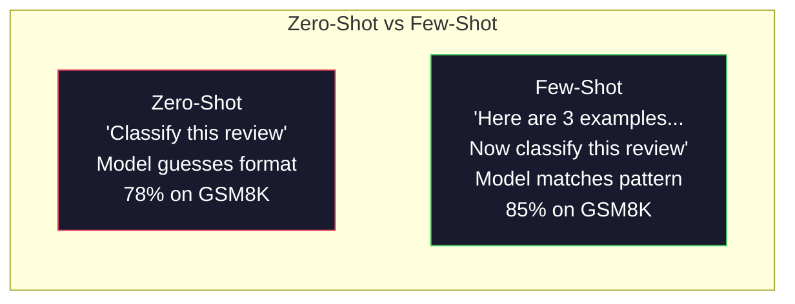
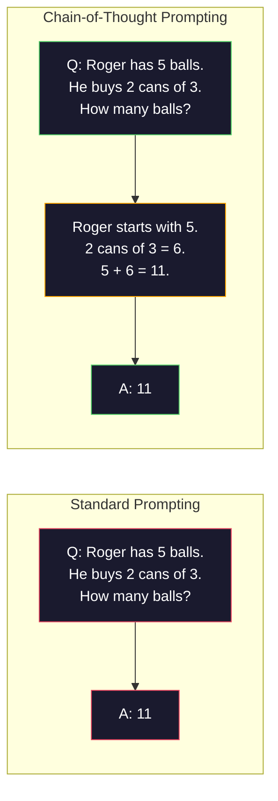
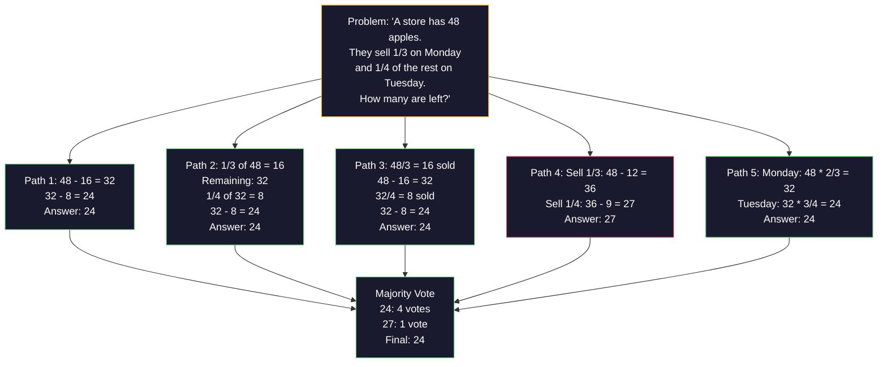
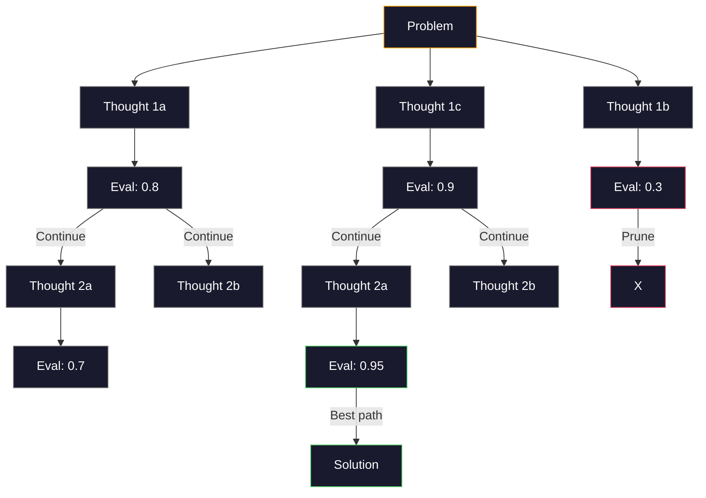

# Kilka strzałów, łańcuch myśli, drzewo myśli

> Mówienie modelowi, co ma robić, jest podpowiadaniem. Pokazanie, jak myśleć, to inżynieria. Różnica między dokładnością 78% a 91% w przypadku tego samego modelu, tego samego zadania i tych samych danych nie jest lepszym modelem. Jest to lepsza strategia rozumowania.

**Typ:** Kompilacja
**Języki:** Python
**Wymagania wstępne:** Lekcja 11.01 (Szybka inżynieria)
**Czas:** ~45 minut

## Cele nauczania

- Wdrażaj podpowiedzi składające się z kilku strzałów, wybierając i formatując przykładowe demonstracje, które maksymalizują dokładność zadania
- Zastosuj rozumowanie oparte na łańcuchu myśli (CoT), aby poprawić dokładność w przypadku problemów wieloetapowych, takich jak zadania matematyczne
- Zbuduj drzewo myśli, które bada wiele ścieżek rozumowania i wybiera najlepszą
- Zmierz poprawę celności w porównaniu do strzelania zerowego, kilku strzałów i CoT w standardowym teście

## Problem

Tworzysz aplikację do nauczania matematyki. Twój monit brzmi: „Rozwiąż to zadanie tekstowe”. GPT-5 radzi sobie poprawnie w 94% przypadków w GSM8K, standardowym benchmarku matematycznym dla szkół podstawowych. Myślisz, że osiągnąłeś już szczyt. Ty nie — łańcuch myślowy nadal dodaje 3-4 punkty.

Dodaj pięć słów – „Pomyślmy krok po kroku” – a dokładność wzrośnie do 91%. Dodaj kilka sprawdzonych przykładów i osiągnie 95%. Ten sam model. Ta sama temperatura. Ten sam koszt API. Jedyna różnica jest taka, że ​​dałeś modelowi papier rysunkowy.

To nie jest hack. Tak działa rozumowanie. Ludzie nie rozwiązują wieloetapowych problemów jednym skokiem mentalnym. Transformatory też nie. Kiedy zmuszasz model do generowania tokenów pośrednich, tokeny te stają się częścią kontekstu dla następnego tokenu. Każdy krok rozumowania napędza następny. Model dosłownie oblicza drogę do odpowiedzi.

Ale „myśl krok po kroku” to początek, a nie koniec. A co, jeśli wybierzesz pięć ścieżek rozumowania i zdobędziesz większość głosów? A co jeśli pozwolisz modelowi zbadać drzewo możliwości, oceniając i przycinając gałęzie? A co, jeśli przeplatasz rozumowanie z użyciem narzędzi? To nie są hipotetyki. Są to opublikowane techniki z wymiernymi ulepszeniami i opracujesz je wszystkie w tej lekcji.

## Koncepcja

### Zero-Shot kontra Few-Shot: gdy przykłady przewyższają instrukcje

Podpowiadanie o zerowym strzale daje modelowi zadanie i nic więcej. Podpowiadanie o kilku strzałach podaje najpierw przykłady.

Wei i in. (2022) zmierzyli to w 8 punktach odniesienia. W przypadku prostych zadań, takich jak klasyfikacja tonacji, strzał zerowy i kilka strzałów są wykonywane w odstępie 2% od siebie. W przypadku złożonych zadań, takich jak wieloetapowa arytmetyka i rozumowanie symboliczne, kilka strzałów poprawiło dokładność o 10–25%.

Intuicja: przykłady to skompresowane instrukcje. Zamiast opisywać format wyjściowy, pokazujesz go. Zamiast wyjaśniać proces rozumowania, demonstrujesz go. Model wzorca dopasowuje się do przykładów bardziej niezawodnie niż interpretuje abstrakcyjne instrukcje.



**Kiedy wygrywa kilka strzałów:** zadania zależne od formatu, klasyfikacja, ekstrakcja strukturalna, żargon specyficzny dla domeny, każde zadanie, w którym model musi pasować do określonego wzorca.

**Kiedy wygrywa zero-shot:** proste pytania oparte na faktach, kreatywne zadania, w których przykłady ograniczają kreatywność, zadania, w których znalezienie dobrych przykładów jest trudniejsze niż napisanie dobrych instrukcji.

### Przykładowy wybór: losowe podobne uderzenia

Nie wszystkie przykłady są równe. Wybór przykładów podobnych do docelowych danych wejściowych przewyższa wybór losowy o 5–15% w przypadku zadań klasyfikacyjnych (Liu i in., 2022). Trzy zasady:

1. **Podobieństwo semantyczne**: wybierz przykłady najbliższe wejściu w przestrzeni osadzania
2. **Różnorodność etykiet**: uwzględnij w swoich przykładach wszystkie kategorie wyników
3. **Dopasowanie trudności**: odpowiada poziomowi złożoności docelowego problemu

Optymalna liczba przykładów dla większości zadań to 3-5. Poniżej 3 model nie ma wystarczającego sygnału, aby wyodrębnić wzór. Powyżej 5 osiągasz malejące zyski i marnujesz żetony okna kontekstowego. W przypadku klasyfikacji z wieloma etykietami użyj jednego przykładu na etykietę.

### Łańcuch myśli: dawanie modelom papieru do rysowania

Podpowiadanie w ramach łańcucha myśli (CoT) zostało wprowadzone przez Wei i in. (2022) w Google Brain. Pomysł jest prosty: zamiast pytać model o odpowiedź, poproś go, aby najpierw pokazał kroki rozumowania.



Dlaczego to działa mechanicznie? Każdy token wygenerowany przez transformator staje się kontekstem dla następnego tokena. Bez CoT model musi skompresować całe rozumowanie do ukrytego stanu pojedynczego przejścia do przodu. W przypadku CoT model udostępnia obliczenia pośrednie jako tokeny. Każdy żeton wnioskowania zwiększa efektywną głębokość obliczeń.

**Testy porównawcze GSM8K (matematyka w szkole podstawowej, problemy 8,5 tys.):**

| Modelka | Zerowy strzał | Zero-Shot CoT | Kilka strzałów CoT |
|-------|-----------|--------------|-------------|
| GPT-4o | 78% | 91% | 95% |
| GPT-5 | 94% | 97% | 98% |
| o4-mini (rozumowanie) | 97% | — | — |
| Claude Opus 4.7 | 93% | 97% | 98% |
| Bliźnięta 3 Pro | 92% | 96% | 98% |
| Lama 4 70B | 80% | 89% | 94% |
| DeepSeek-V3.1 | 89% | 94% | 96% |

**Uwaga na temat modeli wnioskowania.** Modele takie jak seria o OpenAI (o3, o4-mini) i DeepSeek-R1 przeprowadzają wewnętrznie łańcuch myślowy przed wyemitowaniem odpowiedzi. Dodawanie „Pomyślmy krok po kroku” do modelu rozumowania jest zbędne i czasami przynosi efekt przeciwny do zamierzonego – już to zrobili.

Dwa smaki CoT:

**Zero-shot CoT**: dołącz „Pomyślmy krok po kroku” do zachęty. Nie potrzeba żadnych przykładów. Kojima i in. (2022) wykazali, że to pojedyncze zdanie poprawia dokładność w zadaniach arytmetycznych, zdroworozsądkowych i rozumowania symbolicznego.

**CoT z kilkoma strzałami**: podaj przykłady zawierające etapy rozumowania. Bardziej efektywny niż zero-shot CoT, ponieważ model widzi dokładnie taki format rozumowania, jakiego oczekujesz.

**Kiedy CoT boli**: proste przypomnienie faktów („Jaka jest stolica Francji?”), Klasyfikacja jednoetapowa, zadania, w których szybkość jest ważniejsza niż dokładność. CoT dodaje 50–200 tokenów narzutu rozumowania na zapytanie. W przypadku zadań o dużej przepustowości i niskiej złożoności jest to koszt zmarnowany.

### Konsekwentność: próbuj wielu, głosuj raz

Wang i in. (2023) wprowadzili samospójność. Wniosek: pojedyncza ścieżka CoT może zawierać błędy w rozumowaniu. Jeśli jednak pobierzesz próbkę N niezależnych ścieżek rozumowania (przy temperaturze > 0) i zdobędziesz większość głosów w sprawie ostatecznej odpowiedzi, błędy zostaną zniesione.



Własna spójność poprawiła dokładność GSM8K z 56,5% (pojedynczy CoT) do 74,4% przy N=40 w oryginalnych eksperymentach PaLM 540B. W przypadku GPT-5 poprawa jest niewielka (97% do 98%), ponieważ podstawowa dokładność jest już nasycona. Technika ta najlepiej sprawdza się w modelach z podstawową dokładnością CoT wynoszącą 60–85% – czyli w najlepszym punkcie, w którym błędy pojedynczej ścieżki występują często, ale nie są systematyczne. W przypadku modeli wnioskowania (seria o, R1) samospójność jest uwzględniana przez wbudowane próbkowanie wewnętrzne.

Kompromis: N próbek oznacza Nx kosztu API i opóźnienia. W praktyce N=5 zapewnia większość korzyści. N=3 to minimum dla znaczącego głosowania. N > 10 daje malejące korzyści dla większości zadań.

### Drzewo myśli: eksploracja rozgałęziona

Yao i in. (2023) wprowadzili Drzewo Myśli (ToT). Tam, gdzie CoT podąża jedną liniową ścieżką rozumowania, ToT bada wiele gałęzi i ocenia, które są najbardziej obiecujące, zanim przejdzie dalej.



ToT składa się z trzech elementów:

1. **Generowanie myśli**: przedstaw wiele potencjalnych kolejnych kroków
2. **Ocena stanu**: zdobądź ocenę każdego kandydata (może używać samego LLM jako oceniającego)
3. **Algorytm wyszukiwania**: BFS lub DFS poprzez drzewo, przycinanie gałęzi o niskiej punktacji

W zadaniu „Gra w 24” (połącz 4 liczby za pomocą arytmetyki, aby otrzymać 24), GPT-4 ze standardowym monitem rozwiązuje 7,3% problemów. Z CoT, 4,0% (CoT właściwie tutaj boli, ponieważ przestrzeń poszukiwań jest szeroka). Z ToT – 74%.

ToT jest drogie. Każdy węzeł w drzewie wymaga wywołania LLM. Drzewo o współczynniku rozgałęzienia 3 i głębokości 3 wymaga do 39 wywołań LLM. Używaj go tylko w przypadku problemów, w których przestrzeń poszukiwań jest duża, ale możliwa do oceny - planowanie, rozwiązywanie łamigłówek, kreatywne rozwiązywanie problemów z ograniczeniami.

### ReAct: myślenie + działanie

Yao i in. (2022) połączyli ślady rozumowania z działaniami. W modelu na przemian następuje myślenie (generowanie rozumowania) i działanie (wywoływanie narzędzi, wyszukiwanie, obliczanie).

```mermaid
graph LR
    Q["Question:\nWhat is the\npopulation of the\ncountry where\nthe Eiffel Tower\nis located?"]
    T1["Thought: I need to\nfind which country\nhas the Eiffel Tower"]
    A1["Action: search\n'Eiffel Tower location'"]
    O1["Observation:\nParis, France"]
    T2["Thought: Now I need\nFrance's population"]
    A2["Action: search\n'France population 2024'"]
    O2["Observation:\n68.4 million"]
    T3["Thought: I have\nthe answer"]
    F["Answer:\n68.4 million"]

    Q --> T1 --> A1 --> O1 --> T2 --> A2 --> O2 --> T3 --> F

    style Q fill:#1a1a2e,stroke:#ffa500,color:#fff
    style T1 fill:#1a1a2e,stroke:#51cf66,color:#fff
    style A1 fill:#1a1a2e,stroke:#e94560,color:#fff
    style O1 fill:#1a1a2e,stroke:#808080,color:#fff
    style T2 fill:#1a1a2e,stroke:#51cf66,color:#fff
    style A2 fill:#1a1a2e,stroke:#e94560,color:#fff
    style O2 fill:#1a1a2e,stroke:#808080,color:#fff
    style T3 fill:#1a1a2e,stroke:#51cf66,color:#fff
    style F fill:#1a1a2e,stroke:#51cf66,color:#fff
```



ReAct przewyższa czysty CoT w przypadku zadań wymagających dużej wiedzy, ponieważ może oprzeć swoje rozumowanie na rzeczywistych danych. W przypadku HotpotQA (odpowiadanie na pytania z wieloma przeskokami) ReAct z GPT-4 osiąga 35,1% dokładnego dopasowania w porównaniu z 29,4% dla samego CoT. Prawdziwa siła polega na tym, że błędy w rozumowaniu są korygowane przez obserwacje — model może zaktualizować swój plan w połowie realizacji.

ReAct jest podstawą nowoczesnych agentów AI. Każdy framework agentowy (LangChain, CrewAI, AutoGen) implementuje pewien wariant pętli Myśl-Akcja-Obserwacja. Pełnych agentów zbudujesz w fazie 14. W tej lekcji omówiony zostanie wzorzec podpowiedzi.

### Ustrukturyzowane podpowiedzi: znaczniki XML, ograniczniki, nagłówki

W miarę jak podpowiedzi stają się złożone, struktura zapobiega pomieszaniu sekcji w modelu. Trzy podejścia:

**Tagi XML** (działają najlepiej z Claudem, wszędzie są stałe):

```
<context>
You are reviewing a pull request.
The codebase uses TypeScript and React.
</context>

<task>
Review the following diff for bugs, security issues, and style violations.
</task>

<diff>
{diff_content}
</diff>

<output_format>
List each issue with: file, line, severity (critical/warning/info), description.
</output_format>
```

**Nagłówki Markdown** (uniwersalne):

```
## Role
Senior security engineer at a fintech company.

## Task
Analyze this API endpoint for vulnerabilities.

## Input
{api_code}

## Rules
- Focus on OWASP Top 10
- Rate each finding: critical, high, medium, low
- Include remediation steps
```

**Ograniczniki** (minimalne, ale skuteczne):

```
---INPUT---
{user_text}
---END INPUT---

---INSTRUCTIONS---
Summarize the above in 3 bullet points.
---END INSTRUCTIONS---
```

### Natychmiastowe łączenie: rozkład sekwencyjny

Niektóre zadania są zbyt złożone, aby można je było umieścić w jednym monitie. Łączenie podpowiedzi dzieli je na kroki, w których wynik jednego podpowiedzi staje się wejściem następnego.


Łańcuch jest lepszy od pojedynczego monitu z trzech powodów:

1. **Każdy krok jest prostszy**: model obsługuje jedno skupione zadanie, zamiast wszystko żonglować
2. **Wyniki pośrednie można sprawdzić**: możesz sprawdzać i korygować pomiędzy krokami
3. **Różne kroki mogą wykorzystywać różne modele**: użyj taniego modelu do ekstrakcji, drogiego do rozumowania

### Porównanie wydajności

| Technika | Najlepsze dla | Dokładność GSM8K (GPT-5) | Wywołania API | Koszt tokena | Złożoność |
|---------------|----------|----------------------------|---------------|----------------|------------|
| Zerowy strzał | Proste zadania | 94% | 1 | Brak | Trywialne |
| Kilka strzałów | Dopasowanie formatu | 96% | 1 | 200-500 tokenów | Niski |
| Zero-Shot CoT | Szybkie wzmocnienie rozumowania | 97% | 1 | 50-200 tokenów | Trywialne |
| Kilka strzałów CoT | Maksymalna dokładność pojedynczego połączenia | 98% | 1 | 300-600 tokenów | Niski |
| Samokonsekwencja (N=5) | Rozumowanie o wysokiej stawce | 98,5% | 5 | 5x koszt żetonu | Średni |
| Model rozumowania (o4-mini) | Wymiana CoT typu drop-in | 97% | 1 | ukryty (2-10x wewnętrzny) | Trywialne |
| Drzewo Myśli | Problemy z wyszukiwaniem/planowaniem | Nie dotyczy (74% w grze 24) | 10-40+ | 10-40x koszt tokena | Wysoki |
| Reaguj | Rozumowanie oparte na wiedzy | N/A (35,1% na HotpotQA) | 3-10+ | Zmienna | Wysoki |
| Szybkie łączenie | Złożone zadania wieloetapowe | 96% (rurociąg) | 2-5 | 2-5x koszt tokena | Średni |

Właściwa technika zależy od trzech czynników: wymagań dotyczących dokładności, budżetu opóźnień i tolerancji kosztów. W przypadku większości systemów produkcyjnych kilkuetapowy CoT z 3-próbkowym zabezpieczeniem zapewniającym spójność własną pokrywa 90% przypadków użycia.

## Zbuduj to

Stworzymy narzędzie do rozwiązywania problemów matematycznych, które połączy w jednym potoku podpowiedzi oparte na kilku strzałach, rozumowanie oparte na łańcuchu myśli i głosowanie na zasadzie spójności. Następnie dodamy drzewo myśli dla trudnych problemów.

Pełna implementacja znajduje się w `code/advanced_prompting.py`. Oto kluczowe elementy.

### Krok 1: Przykładowy sklep z kilkoma strzałami

Pierwszy komponent zarządza kilkoma przykładami i wybiera te, które są najbardziej odpowiednie dla danego problemu.

```python
GSM8K_EXAMPLES = [
    {
        "question": "Janet's ducks lay 16 eggs per day. She eats three for breakfast every morning and bakes muffins for her friends every day with four. She sells every egg at the farmers' market for $2. How much does she make every day at the farmers' market?",
        "reasoning": "Janet's ducks lay 16 eggs per day. She eats 3 and bakes 4, using 3 + 4 = 7 eggs. So she has 16 - 7 = 9 eggs left. She sells each for $2, so she makes 9 * 2 = $18 per day.",
        "answer": "18"
    },
    ...
]
```

Każdy przykład składa się z trzech części: pytania, łańcucha rozumowania i ostatecznej odpowiedzi. Łańcuch rozumowania przekształca zwykły przykład składający się z kilku strzałów w przykład obejmujący kilka strzałów CoT.

### Krok 2: Kreator podpowiedzi w postaci łańcucha myślowego

Konstruktor podpowiedzi łączy komunikat systemowy, kilka przykładów z łańcuchami rozumowania i pytanie docelowe w jeden monit.

```python
def build_cot_prompt(question, examples, num_examples=3):
    system = (
        "You are a math problem solver. "
        "For each problem, show your step-by-step reasoning, "
        "then give the final numerical answer on the last line "
        "in the format: 'The answer is [number]'."
    )

    example_text = ""
    for ex in examples[:num_examples]:
        example_text += f"Q: {ex['question']}\n"
        example_text += f"A: {ex['reasoning']} The answer is {ex['answer']}.\n\n"

    user = f"{example_text}Q: {question}\nA:"
    return system, user
```

Ograniczenie formatu („Odpowiedź to [liczba]”) jest krytyczne. Bez tego samospójność nie będzie w stanie wyodrębnić i porównać odpowiedzi z różnych próbek.

### Krok 3: Głosowanie w oparciu o samospójność

Wybierz N ścieżek rozumowania i wybierz odpowiedź większości.

```python
def self_consistency_solve(question, examples, client, model, n_samples=5):
    system, user = build_cot_prompt(question, examples)

    answers = []
    reasonings = []
    for _ in range(n_samples):
        response = client.chat.completions.create(
            model=model,
            messages=[
                {"role": "system", "content": system},
                {"role": "user", "content": user}
            ],
            temperature=0.7
        )
        text = response.choices[0].message.content
        reasonings.append(text)
        answer = extract_answer(text)
        if answer is not None:
            answers.append(answer)

    vote_counts = Counter(answers)
    best_answer = vote_counts.most_common(1)[0][0] if vote_counts else None
    confidence = vote_counts[best_answer] / len(answers) if best_answer else 0

    return best_answer, confidence, reasonings, vote_counts
```

Ważna jest temperatura 0,7. W temperaturze 0,0 wszystkie N próbki byłyby identyczne, co byłoby sprzeczne z celem. Potrzebujesz wystarczającej losowości dla różnych ścieżek rozumowania, ale nie na tyle, aby model powodował bełkot.

### Krok 4: Rozwiązanie drzewa myśli

W przypadku problemów, w których zawodzi rozumowanie liniowe, ToT bada wiele podejść i ocenia, który kierunek jest najbardziej obiecujący.

```python
def tree_of_thought_solve(question, client, model, breadth=3, depth=3):
    thoughts = generate_initial_thoughts(question, client, model, breadth)
    scored = [(t, evaluate_thought(t, question, client, model)) for t in thoughts]
    scored.sort(key=lambda x: x[1], reverse=True)

    for current_depth in range(1, depth):
        next_thoughts = []
        for thought, score in scored[:2]:
            extensions = extend_thought(thought, question, client, model, breadth)
            for ext in extensions:
                ext_score = evaluate_thought(ext, question, client, model)
                next_thoughts.append((ext, ext_score))
        scored = sorted(next_thoughts, key=lambda x: x[1], reverse=True)

    best_thought = scored[0][0] if scored else ""
    return extract_answer(best_thought), best_thought
```

Osoba oceniająca sama w sobie jest zaproszeniem do LLM. Zadajesz modelowi pytanie: „W skali od 0,0 do 1,0, jak obiecująca jest ta ścieżka rozumowania w rozwiązaniu problemu?” To jest kluczowy spostrzeżenie ToT – model ocenia własne rozwiązania częściowe.

### Krok 5: Pełny potok

Rurociąg łączy wszystkie techniki ze strategią eskalacji.

```python
def solve_with_escalation(question, examples, client, model):
    system, user = build_cot_prompt(question, examples)
    single_response = call_llm(client, model, system, user, temperature=0.0)
    single_answer = extract_answer(single_response)

    sc_answer, confidence, _, _ = self_consistency_solve(
        question, examples, client, model, n_samples=5
    )

    if confidence >= 0.8:
        return sc_answer, "self_consistency", confidence

    tot_answer, _ = tree_of_thought_solve(question, client, model)
    return tot_answer, "tree_of_thought", None
```

Logika eskalacji: najpierw wypróbuj tanio (pojedynczy CoT). Jeżeli pewność siebie w zakresie spójności jest poniżej 0,8 (zgadza się mniej niż 4 z 5 próbek), eskaluj do ToT. To równoważy koszty i dokładność — większość problemów rozwiązuje się tanio, a trudne problemy wymagają większej mocy obliczeniowej.

## Użyj tego

### Z LangChainem

LangChain zapewnia wbudowaną obsługę szablonów podpowiedzi i analizowania wyników, co upraszcza wzorce kilku strzałów i wzorce CoT:

```python
from langchain_core.prompts import FewShotPromptTemplate, PromptTemplate
from langchain_openai import ChatOpenAI

example_prompt = PromptTemplate(
    input_variables=["question", "reasoning", "answer"],
    template="Q: {question}\nA: {reasoning} The answer is {answer}."
)

few_shot_prompt = FewShotPromptTemplate(
    examples=examples,
    example_prompt=example_prompt,
    suffix="Q: {input}\nA: Let's think step by step.",
    input_variables=["input"]
)

llm = ChatOpenAI(model="gpt-4o", temperature=0.7)
chain = few_shot_prompt | llm
result = chain.invoke({"input": "If a train travels 120 km in 2 hours..."})
```

LangChain posiada również klasy `ExampleSelector` do selekcji podobieństwa semantycznego:

```python
from langchain_core.example_selectors import SemanticSimilarityExampleSelector
from langchain_openai import OpenAIEmbeddings

selector = SemanticSimilarityExampleSelector.from_examples(
    examples,
    OpenAIEmbeddings(),
    k=3
)
```

### Z DSPy

DSPy traktuje strategie podpowiedzi jako moduły, które można optymalizować. Zamiast ręcznie tworzyć podpowiedzi CoT, definiujesz podpis i pozwalasz DSPy zoptymalizować zachętę:

```python
import dspy

dspy.configure(lm=dspy.LM("openai/gpt-4o", temperature=0.7))

class MathSolver(dspy.Module):
    def __init__(self):
        self.solve = dspy.ChainOfThought("question -> answer")

    def forward(self, question):
        return self.solve(question=question)

solver = MathSolver()
result = solver(question="Janet's ducks lay 16 eggs per day...")
```

`ChainOfThought` DSPy automatycznie dodaje ślady rozumowania. `dspy.majority` implementuje spójność wewnętrzną:

```python
result = dspy.majority(
    [solver(question=q) for _ in range(5)],
    field="answer"
)
```

### Porównanie: od podstaw a frameworki

| Funkcja | Od podstaw (ta lekcja) | LangChain | DSP |
|--------|--------------------------|----------|------|
| Kontrola nad formatem podpowiedzi | Pełny | Oparte na szablonie | Automatyczny |
| Samokonsekwencja | Głosowanie ręczne | Instrukcja | Wbudowany (`dspy.majority`) |
| Przykładowy wybór | Niestandardowa logika | `ExampleSelector` | `dspy.BootstrapFewShot` |
| Drzewo Myśli | Niestandardowe wyszukiwanie drzewa | Sieci społecznościowe | Nie wbudowany |
| Szybka optymalizacja | Ręczna iteracja | Instrukcja | Automatyczna kompilacja |
| Najlepsze dla | Nauka, niestandardowe potoki | Standardowe przepływy pracy | Badania, optymalizacja |

## Wyślij to

Podczas tej lekcji powstają dwa artefakty.

**1. Prompt łańcucha rozumowania** (`outputs/prompt-reasoning-chain.md`): gotowy do produkcji szablon podpowiedzi dla kilkuetapowej CoT z zachowaniem spójności. Podłącz swoje przykłady i domenę problemową.

**2. Umiejętność wyboru wzorca CoT** (`outputs/skill-cot-patterns.md`): ramy decyzyjne umożliwiające wybór właściwej techniki rozumowania w oparciu o rodzaj zadania, wymagania dotyczące dokładności i ograniczenia kosztowe.

## Ćwiczenia

1. **Zmierz różnicę**: Rozwiąż 10 problemów GSM8K. Rozwiąż każdy problem za pomocą CoT z zerowym strzałem, z kilkoma strzałami, CoT z zerowym strzałem i CoT z kilkoma strzałami. Zapisz dokładność dla każdego. Która technika daje największy efekt Twojemu modelowi?

2. **Eksperyment z doborem przykładów**: W przypadku tych samych 10 problemów porównaj losowy wybór przykładów z podobnymi przykładami wybranymi ręcznie. Zmierz różnicę dokładności. W którym momencie jakość przykładu ma większe znaczenie niż ilość?

3. **Krzywa kosztów samospójności**: Uruchom samospójność z N=1, 3, 5, 7, 10 na 20 problemach GSM8K. Dokładność wydruku a koszt (całkowita liczba tokenów). Gdzie znajduje się kolano krzywizny Twojego modelu?

4. **Zbuduj pętlę ReAct**: Rozszerz potok za pomocą narzędzia kalkulatora. Gdy model wygeneruje wyrażenie matematyczne, wykonaj je za pomocą `eval()` języka Python (w piaskownicy) i przekaż wynik z powrotem. Zmierz, czy rozumowanie oparte na narzędziach przewyższa czystą CoT.

5. **ToT do zadań kreatywnych**: Dostosuj moduł Drzewa Myśli do kreatywnego zadania pisarskiego: „Napisz historię składającą się z 6 słów, która będzie zarówno zabawna, jak i smutna”. Użyj LLM jako oceniającego. Czy eksploracja rozgałęziona daje lepsze efekty twórcze niż generowanie pojedynczych działań?

## Kluczowe terminy

| Termin | Co ludzie mówią | Co to właściwie oznacza |
|------|----------------|----------------------|
| Podpowiadanie kilku strzałów | „Podaj kilka przykładów” | W tym demonstracje wejścia-wyjścia w monicie w celu zakotwiczenia formatu wyjściowego i zachowania modelu |
| Łańcuch Myśli | „Spraw, by pomyślał krok po kroku” | Wywoływanie pośrednich tokenów rozumowania, które rozszerzają efektywne obliczenia modelu przed udzieleniem ostatecznej odpowiedzi |
| Samokonsekwencja | „Uruchom to wiele razy” | Próbkowanie N różnych ścieżek rozumowania w temperaturze > 0 i wybieranie najczęstszej ostatecznej odpowiedzi większością głosów |
| Drzewo Myśli | „Pozwól mu zbadać opcje” | Ustrukturyzowane wyszukiwanie gałęzi rozumowania, w którym oceniane jest każde rozwiązanie częściowe i rozwijane są tylko obiecujące ścieżki |
| Reaguj | „Myślenie + użycie narzędzi” | Przeplatanie śladów rozumowania z działaniami zewnętrznymi (wyszukiwanie, obliczanie, wywołania API) w pętli Myśl-Działanie-Obserwacja |
| Szybkie łączenie | „Podziel to na kroki” | Rozkładanie złożonego zadania na sekwencyjne podpowiedzi, w których każde wyjście stanowi źródło następnego wejścia |
| Zero-shot CoT | „Wystarczy dodać «przemyśl krok po kroku»” | Dołączenie frazy wyzwalającej rozumowanie do podpowiedzi bez żadnych przykładów, w oparciu o ukrytą zdolność rozumowania modelu |

## Dalsze czytanie

– [Podpowiadanie łańcucha myślowego wywołuje rozumowanie w modelach wielkojęzykowych](https://arxiv.org/abs/2201.11903) – Wei i in. 2022. Oryginalny artykuł CoT z Google Brain. Przeczytaj sekcje 2-3, aby zapoznać się z głównymi wynikami.
– [Spójność własna poprawia rozumowanie łańcucha myślowego w modelach językowych](https://arxiv.org/abs/2203.11171) – Wang i in. 2023. Dokument dotyczący spójności. W tabeli 1 znajdują się wszystkie potrzebne liczby.
– [Drzewo myśli: celowe rozwiązywanie problemów za pomocą modeli wielkojęzykowych](https://arxiv.org/abs/2305.10601) – Yao i in. 2023. Dokument ToT. Najważniejszym wydarzeniem są wyniki Gry 24 w sekcji 4.
– [ReAct: Synergia rozumowania i działania w modelach językowych](https://arxiv.org/abs/2210.03629) – Yao i in. 2022. Podstawa nowoczesnych agentów AI. Sekcja 3 wyjaśnia pętlę Myśl-Działanie-Obserwacja.
– [Wielkojęzyczne modele to racjonalizatorzy zero-shot](https://arxiv.org/abs/2205.11916) – Kojima i in. 2022. Artykuł „Pomyślmy krok po kroku”. Zaskakująco skuteczne, jak na prostotę.
– [DSPy: Kompilowanie wywołań modelu języka deklaratywnego do samodoskonalących się potoków](https://arxiv.org/abs/2310.03714) – Khattab i in. 2023. Podpowiadanie traktuje jako problem z kompilacją. Przeczytaj, jeśli chcesz wyjść poza ręczną, szybką inżynierię.
– [OpenAI — przewodnik po modelach wnioskowania](https://platform.openai.com/docs/guides/reasoning) – wytyczne dostawcy dotyczące tego, kiedy łańcuch myślowy staje się wewnętrznym trybem „wnioskowania” opartym na cenie za token, a kiedy sztuczką na poziomie podpowiedzi.
– [Lightman i in., „Let's Verify Step by Step” (2023)](https://arxiv.org/abs/2305.20050) – modele wynagrodzeń procesu (PRM), które oceniają każdy etap łańcucha; sygnał nadzoru rozumowania, który następuje po nagrodach opartych wyłącznie na wynikach.
- [Snell i in., „Scaling LLM Test-Time Compute Optimally” (2024)](https://arxiv.org/abs/2408.03314) – systematyczne badanie długości CoT, próbkowania na podstawie własnej spójności i MCTS; gdzie „myśl krok po kroku”, gdy dokładność jest ważniejsza niż opóźnienie.