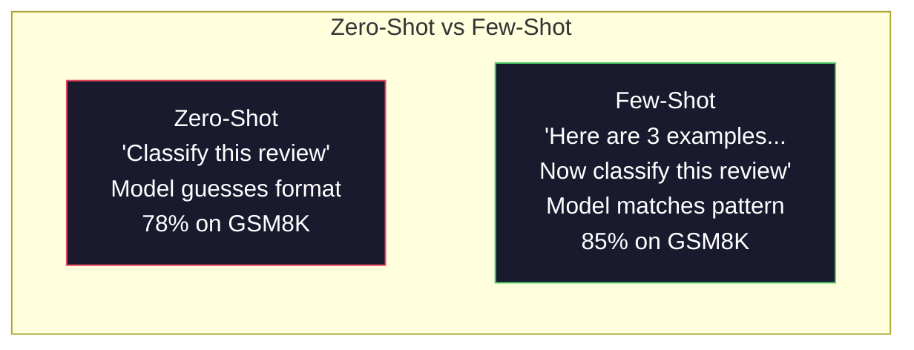
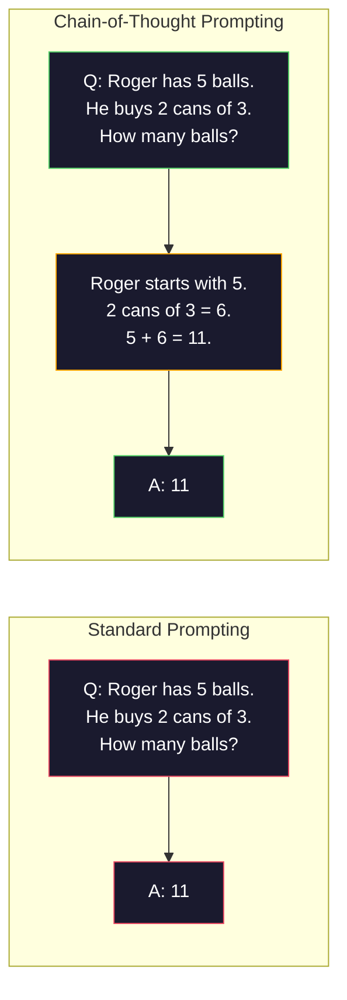
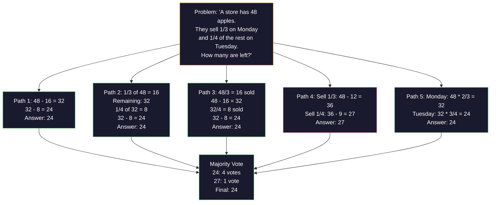
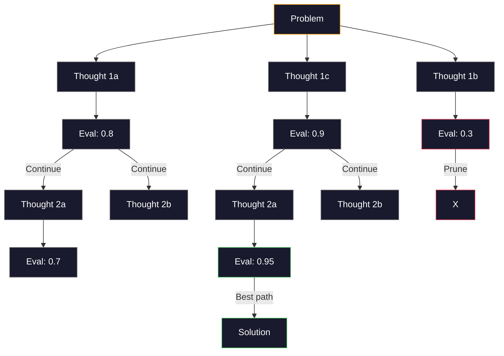

# Kilka przykładów, łańcuch myśli, drzewo myśli

> Mówienie modelowi, co ma robić, to podpowiadanie. Pokazanie mu, jak myśleć, to inżynieria. Różnica między dokładnością 78% a 91% — przy tym samym modelu, tym samym zadaniu i tych samych danych — nie wynika z lepszego modelu. Wynika z lepszej strategii rozumowania.

**Typ:** Kompilacja
**Języki:** Python
**Wymagania wstępne:** Lekcja 11.01 (Inżynieria podpowiedzi)
**Czas:** ~45 minut

## Cele nauczania

- Wdrażaj podpowiedzi oparte na kilku przykładach, dobierając i formatując demonstracje w sposób maksymalizujący dokładność zadania
- Stosuj rozumowanie oparte na łańcuchu myśli (CoT), aby poprawić dokładność w przypadku problemów wieloetapowych, takich jak zadania matematyczne
- Buduj drzewo myśli, które bada wiele ścieżek rozumowania i wybiera najlepszą
- Mierz poprawę dokładności w porównaniu do podejść zero-shot, few-shot i CoT na standardowym teście

## Problem

Tworzysz aplikację do nauczania matematyki. Twój monit brzmi: „Rozwiąż to zadanie tekstowe". GPT-5 osiąga 94% poprawności na GSM8K — standardowym benchmarku zadań matematycznych na poziomie szkoły podstawowej. Wydaje Ci się, że osiągnąłeś pułap. Nie osiągnąłeś — łańcuch myśli nadal dodaje 3–4 punkty procentowe.

Dopisz pięć słów: „Pomyślmy krok po kroku" — a dokładność wzrośnie do 91%. Dodaj kilka sprawdzonych przykładów i osiągnie 95%. Ten sam model. Ta sama temperatura. Ten sam koszt API. Jedyna zmiana: dałeś modelowi kartkę do szkicowania.

To nie jest sztuczka. Tak po prostu działa rozumowanie. Ludzie nie rozwiązują wieloetapowych problemów jednym skokiem myślowym — transformatory też nie. Gdy zmuszasz model do generowania tokenów pośrednich, stają się one częścią kontekstu dla kolejnego tokenu. Każdy krok rozumowania napędza następny. Model dosłownie oblicza sobie drogę do odpowiedzi.

Ale „myśl krok po kroku" to dopiero początek. Co jeśli wylosujesz pięć ścieżek rozumowania i wybierzesz odpowiedź większością głosów? Co jeśli pozwolisz modelowi przeszukać drzewo możliwości, oceniając i odrzucając słabe gałęzie? Co jeśli przeplatasz rozumowanie z wywołaniami narzędzi? To nie są hipotezy — to opublikowane techniki z mierzalnymi ulepszeniami, które opracujesz w tej lekcji.

## Koncepcja

### Zero-Shot kontra Few-Shot: gdy przykłady przewyższają instrukcje

Podpowiadanie zero-shot daje modelowi zadanie i nic więcej. Podpowiadanie few-shot poprzedza je przykładami.

Wei i in. (2022) zmierzyli to na 8 testach porównawczych. W prostych zadaniach, takich jak klasyfikacja tonacji, wyniki zero-shot i few-shot różnią się o zaledwie 2%. W złożonych zadaniach — takich jak wieloetapowa arytmetyka i rozumowanie symboliczne — few-shot poprawia dokładność o 10–25%.

Intuicja jest prosta: przykłady to skompresowane instrukcje. Zamiast opisywać format wyjścia, po prostu go pokazujesz. Zamiast wyjaśniać proces rozumowania, demonstrujesz go. Model dopasowuje wzorzec z przykładów skuteczniej, niż interpretuje abstrakcyjne instrukcje.



**Kiedy wygrywa few-shot:** zadania zależne od formatu, klasyfikacja, ekstrakcja strukturalna, żargon dziedzinowy — wszędzie tam, gdzie model musi trzymać się określonego wzorca.

**Kiedy wygrywa zero-shot:** proste pytania faktograficzne, zadania kreatywne, gdzie przykłady ograniczają wyobraźnię, a także sytuacje, w których znalezienie dobrych przykładów jest trudniejsze niż napisanie dobrych instrukcji.

### Dobór przykładów: podobne bije losowe

Nie wszystkie przykłady są równoważne. Wybór przykładów semantycznie zbliżonych do docelowego wejścia przewyższa dobór losowy o 5–15% w zadaniach klasyfikacyjnych (Liu i in., 2022). Trzy reguły:

1. **Podobieństwo semantyczne**: wybieraj przykłady najbliższe danemu wejściu w przestrzeni osadzeń
2. **Różnorodność etykiet**: uwzględnij w przykładach wszystkie kategorie wyników
3. **Dopasowanie trudności**: dostosuj złożoność przykładów do trudności problemu docelowego

Optymalna liczba przykładów dla większości zadań wynosi 3–5. Poniżej 3 model nie ma wystarczającego sygnału, by wyodrębnić wzorzec. Powyżej 5 zyski maleją, a tokeny okna kontekstowego są marnowane. W przypadku klasyfikacji wieloetykietowej stosuj jeden przykład na etykietę.

### Łańcuch myśli: daj modelowi kartkę do szkicowania

Podpowiadanie w ramach łańcucha myśli (CoT) wprowadzili Wei i in. (2022) z Google Brain. Pomysł jest prosty: zamiast prosić model o podanie odpowiedzi, poproś go, by najpierw pokazał kroki rozumowania.



Dlaczego to działa mechanicznie? Każdy token wygenerowany przez transformator staje się kontekstem dla następnego. Bez CoT model musi skompresować całe rozumowanie do ukrytego stanu pojedynczego przejścia do przodu. Przy CoT obliczenia pośrednie stają się jawne — jako tokeny. Każdy token wnioskowania zwiększa efektywną głębokość obliczeń.

**Wyniki GSM8K (matematyka szkolna, 8,5 tys. zadań):**

| Model | Zero-shot | Zero-Shot CoT | Few-Shot CoT |
|-------|-----------|--------------|-------------|
| GPT-4o | 78% | 91% | 95% |
| GPT-5 | 94% | 97% | 98% |
| o4-mini (rozumowanie) | 97% | — | — |
| Claude Opus 4.7 | 93% | 97% | 98% |
| Gemini 3 Pro | 92% | 96% | 98% |
| Llama 4 70B | 80% | 89% | 94% |
| DeepSeek-V3.1 | 89% | 94% | 96% |

**Uwaga dotycząca modeli wnioskowania.** Modele z serii o OpenAI (o3, o4-mini) oraz DeepSeek-R1 przeprowadzają łańcuch myśli wewnętrznie, przed wygenerowaniem odpowiedzi. Dopisywanie „Pomyślmy krok po kroku" do takich modeli jest zbędne — a niekiedy przynosi efekt odwrotny do zamierzonego. One to już robią.

Dwa warianty CoT:

**Zero-shot CoT**: dołącz do monitu frazę „Pomyślmy krok po kroku". Żadnych przykładów nie potrzeba. Kojima i in. (2022) wykazali, że to jedno zdanie poprawia dokładność w zadaniach arytmetycznych, zdroworozsądkowych i z rozumowaniem symbolicznym.

**Few-shot CoT**: podaj przykłady zawierające pełne łańcuchy rozumowania. Skuteczniejszy niż zero-shot CoT, ponieważ model widzi dokładnie taki format myślenia, jakiego oczekujesz.

**Kiedy CoT przynosi straty**: proste pytania faktograficzne (np. „Jaka jest stolica Francji?"), klasyfikacja jednoetapowa, zadania, gdzie szybkość jest ważniejsza niż dokładność. CoT dodaje 50–200 tokenów narzutu na zapytanie. Przy dużej przepustowości i niskiej złożoności to koszt nieuzasadniony.

### Samospójność: wiele prób, jedno głosowanie

Wang i in. (2023) zaproponowali samospójność. Obserwacja: pojedyncza ścieżka CoT może zawierać błędy w rozumowaniu. Jeśli jednak pobierzesz N niezależnych ścieżek (przy temperaturze > 0) i wybierzesz ostateczną odpowiedź głosowaniem większościowym, błędy się znoszą.



Samospójność poprawiła dokładność GSM8K z 56,5% (pojedynczy CoT) do 74,4% przy N=40 w oryginalnych eksperymentach na PaLM 540B. W przypadku GPT-5 poprawa jest niewielka (97% do 98%), gdyż bazowa dokładność jest już bliska nasycenia. Technika sprawdza się najlepiej przy modelach z bazową dokładnością CoT w przedziale 60–85% — w tym złotym środku błędy pojedynczej ścieżki zdarzają się często, ale nie są systematyczne. W modelach wnioskowania (seria o, R1) samospójność jest realizowana przez wbudowane wewnętrzne próbkowanie.

Kompromis: N próbek to N-krotny koszt API i opóźnienia. W praktyce N=5 zapewnia większość korzyści. N=3 to minimum dla sensownego głosowania. Powyżej N=10 zyski dla większości zadań są marginalne.

### Drzewo myśli: przeszukiwanie rozgałęzione

Yao i in. (2023) wprowadzili Drzewo Myśli (ToT). Tam gdzie CoT podąża jedną liniową ścieżką, ToT bada wiele gałęzi i ocenia, które są najbardziej obiecujące, zanim pójdzie dalej.



ToT składa się z trzech elementów:

1. **Generowanie myśli**: zaproponuj wiele potencjalnych kolejnych kroków
2. **Ocena stanu**: przyznaj każdemu kandydatowi ocenę (może to robić sam LLM jako ewaluator)
3. **Algorytm przeszukiwania**: BFS lub DFS po drzewie, z odrzucaniem słabo ocenionych gałęzi

W zadaniu „Gra w 24" (połącz 4 liczby działaniami arytmetycznymi, by otrzymać 24) GPT-4 ze standardowym monitem rozwiązuje 7,3% problemów. Z CoT — 4,0% (CoT tu wręcz przeszkadza, bo przestrzeń poszukiwań jest rozległa). Z ToT — 74%.

ToT jest kosztowne. Każdy węzeł drzewa wymaga osobnego wywołania LLM. Drzewo o współczynniku rozgałęzienia 3 i głębokości 3 może wymagać do 39 wywołań. Stosuj je wyłącznie w problemach, gdzie przestrzeń poszukiwań jest duża, ale możliwa do oceny: planowanie, rozwiązywanie łamigłówek, twórcze rozwiązywanie problemów z ograniczeniami.

### ReAct: myślenie i działanie

Yao i in. (2022) połączyli ślady rozumowania z akcjami. Model naprzemiennie myśli (generuje rozumowanie) i działa (wywołuje narzędzia, przeszukuje zasoby, wykonuje obliczenia).

```mermaid
graph LR
    Q["Question:\nWhat is the\npopulation of the\ncountry where\nthe Eiffel Tower\nis located?"]
    T1["Thought: I need to\nfind which country\nhas the Eiffel Tower"]
    A1["Action: search\n'Eiffel Tower location'"]
    O1["Observation:\nParis, France"]
    T2["Thought: Now I need\nFrance's population"]
    A2["Action: search\n'France population 2024'"]
    O2["Observation:\n68.4 million"]
    T3["Thought: I have\nthe answer"]
    F["Answer:\n68.4 million"]

    Q --> T1 --> A1 --> O1 --> T2 --> A2 --> O2 --> T3 --> F

    style Q fill:#1a1a2e,stroke:#ffa500,color:#fff
    style T1 fill:#1a1a2e,stroke:#51cf66,color:#fff
    style A1 fill:#1a1a2e,stroke:#e94560,color:#fff
    style O1 fill:#1a1a2e,stroke:#808080,color:#fff
    style T2 fill:#1a1a2e,stroke:#51cf66,color:#fff
    style A2 fill:#1a1a2e,stroke:#e94560,color:#fff
    style O2 fill:#1a1a2e,stroke:#808080,color:#fff
    style T3 fill:#1a1a2e,stroke:#51cf66,color:#fff
    style F fill:#1a1a2e,stroke:#51cf66,color:#fff
```



ReAct przewyższa czysty CoT w zadaniach wymagających rozległej wiedzy, ponieważ może zakorzenić rozumowanie w rzeczywistych danych. W HotpotQA (odpowiadanie na pytania wieloskokowe) ReAct z GPT-4 osiąga 35,1% dokładnych dopasowań wobec 29,4% dla samego CoT. Kluczowa zaleta: błędy w rozumowaniu są korygowane przez obserwacje — model może zaktualizować swój plan w trakcie realizacji.

ReAct stanowi fundament nowoczesnych agentów AI. Każdy framework agentowy (LangChain, CrewAI, AutoGen) implementuje pewien wariant pętli Myśl–Akcja–Obserwacja. Budowanie pełnych agentów omówione zostanie w fazie 14. W tej lekcji skupiamy się na wzorcu podpowiedzi.

### Ustrukturyzowane podpowiedzi: znaczniki XML, ograniczniki, nagłówki

Gdy monity stają się złożone, struktura zapobiega mieszaniu sekcji przez model. Trzy podejścia:

**Tagi XML** (najlepiej sprawdzają się z Claudem, działają wszędzie):

```
<context>
You are reviewing a pull request.
The codebase uses TypeScript and React.
</context>

<task>
Review the following diff for bugs, security issues, and style violations.
</task>

<diff>
{diff_content}
</diff>

<output_format>
List each issue with: file, line, severity (critical/warning/info), description.
</output_format>
```

**Nagłówki Markdown** (rozwiązanie uniwersalne):

```
## Role
Senior security engineer at a fintech company.

## Task
Analyze this API endpoint for vulnerabilities.

## Input
{api_code}

## Rules
- Focus on OWASP Top 10
- Rate each finding: critical, high, medium, low
- Include remediation steps
```

**Ograniczniki** (minimalne, lecz skuteczne):

```
---INPUT---
{user_text}
---END INPUT---

---INSTRUCTIONS---
Summarize the above in 3 bullet points.
---END INSTRUCTIONS---
```

### Łączenie podpowiedzi: rozkład sekwencyjny

Niektóre zadania są zbyt złożone, by zmieścić je w jednym monicie. Łączenie podpowiedzi rozkłada je na etapy, w których wynik jednego monitu staje się wejściem następnego.


Łańcuch podpowiedzi jest lepszy od pojedynczego monitu z trzech powodów:

1. **Każdy krok jest prostszy**: model realizuje jedno skupione zadanie, zamiast żonglować wieloma naraz
2. **Wyniki pośrednie można weryfikować**: możesz sprawdzać i korygować między krokami
3. **Różne kroki mogą używać różnych modeli**: tani model do ekstrakcji, droższy do rozumowania

### Porównanie wydajności

| Technika | Najlepsze zastosowanie | Dokładność GSM8K (GPT-5) | Wywołania API | Koszt tokenów | Złożoność |
|---------------|----------|----------------------------|---------------|----------------|------------|
| Zero-shot | Proste zadania | 94% | 1 | Brak | Trywialna |
| Few-shot | Dopasowanie formatu | 96% | 1 | 200–500 tokenów | Niska |
| Zero-Shot CoT | Szybkie wzmocnienie rozumowania | 97% | 1 | 50–200 tokenów | Trywialna |
| Few-Shot CoT | Maksymalna dokładność przy jednym wywołaniu | 98% | 1 | 300–600 tokenów | Niska |
| Samospójność (N=5) | Rozumowanie wysokiej stawki | 98,5% | 5 | 5x koszt tokenów | Średnia |
| Model wnioskowania (o4-mini) | Zastępstwo CoT | 97% | 1 | ukryty (2–10x wewnętrznie) | Trywialna |
| Drzewo Myśli | Problemy przeszukiwania i planowania | brak danych (74% w grze 24) | 10–40+ | 10–40x koszt tokenów | Wysoka |
| ReAct | Rozumowanie z oparciem w wiedzy | brak danych (35,1% na HotpotQA) | 3–10+ | Zmienna | Wysoka |
| Łączenie podpowiedzi | Złożone zadania wieloetapowe | 96% (potok) | 2–5 | 2–5x koszt tokenów | Średnia |

Właściwy wybór techniki zależy od trzech czynników: wymagań dotyczących dokładności, tolerancji na opóźnienia i budżetu kosztowego. W większości systemów produkcyjnych few-shot CoT z zabezpieczeniem samospójności przy N=3 pokrywa 90% przypadków użycia.

## Zbuduj to

Stworzymy narzędzie do rozwiązywania zadań matematycznych, łączące w jednym potoku podpowiedzi few-shot, rozumowanie CoT i głosowanie samospójnościowe. Następnie dodamy drzewo myśli dla trudniejszych problemów.

Pełna implementacja znajduje się w `code/advanced_prompting.py`. Poniżej opisano kluczowe elementy.

### Krok 1: Biblioteka przykładów few-shot

Pierwszy komponent zarządza przykładami i wybiera te najbardziej odpowiednie dla danego problemu.

```python
GSM8K_EXAMPLES = [
    {
        "question": "Janet's ducks lay 16 eggs per day. She eats three for breakfast every morning and bakes muffins for her friends every day with four. She sells every egg at the farmers' market for $2. How much does she make every day at the farmers' market?",
        "reasoning": "Janet's ducks lay 16 eggs per day. She eats 3 and bakes 4, using 3 + 4 = 7 eggs. So she has 16 - 7 = 9 eggs left. She sells each for $2, so she makes 9 * 2 = $18 per day.",
        "answer": "18"
    },
    ...
]
```

Każdy przykład składa się z trzech części: pytania, łańcucha rozumowania i ostatecznej odpowiedzi. Łańcuch rozumowania przekształca zwykły przykład few-shot w przykład few-shot CoT.

### Krok 2: Konstruktor monitu z łańcuchem myśli

Konstruktor łączy komunikat systemowy, kilka przykładów z łańcuchami rozumowania oraz docelowe pytanie w jeden monit.

```python
def build_cot_prompt(question, examples, num_examples=3):
    system = (
        "You are a math problem solver. "
        "For each problem, show your step-by-step reasoning, "
        "then give the final numerical answer on the last line "
        "in the format: 'The answer is [number]'."
    )

    example_text = ""
    for ex in examples[:num_examples]:
        example_text += f"Q: {ex['question']}\n"
        example_text += f"A: {ex['reasoning']} The answer is {ex['answer']}.\n\n"

    user = f"{example_text}Q: {question}\nA:"
    return system, user
```

Wymuszenie formatu („The answer is [number]") jest kluczowe. Bez niego samospójność nie będzie mogła wyodrębnić i porównać odpowiedzi z różnych próbek.

### Krok 3: Głosowanie samospójnościowe

Pobierz N ścieżek rozumowania i wybierz odpowiedź większości.

```python
def self_consistency_solve(question, examples, client, model, n_samples=5):
    system, user = build_cot_prompt(question, examples)

    answers = []
    reasonings = []
    for _ in range(n_samples):
        response = client.chat.completions.create(
            model=model,
            messages=[
                {"role": "system", "content": system},
                {"role": "user", "content": user}
            ],
            temperature=0.7
        )
        text = response.choices[0].message.content
        reasonings.append(text)
        answer = extract_answer(text)
        if answer is not None:
            answers.append(answer)

    vote_counts = Counter(answers)
    best_answer = vote_counts.most_common(1)[0][0] if vote_counts else None
    confidence = vote_counts[best_answer] / len(answers) if best_answer else 0

    return best_answer, confidence, reasonings, vote_counts
```

Temperatura 0,7 jest tu istotna. Przy temperaturze 0,0 wszystkie N próbek byłoby identyczne, co niweczyłoby cel ćwiczenia. Potrzebujesz wystarczającej losowości, by uzyskać zróżnicowane ścieżki rozumowania — lecz nie na tyle dużej, by model generował niespójne wyniki.

### Krok 4: Rozwiązywanie drzewem myśli

Gdy liniowe rozumowanie zawodzi, ToT bada wiele podejść i ocenia, który kierunek jest najbardziej obiecujący.

```python
def tree_of_thought_solve(question, client, model, breadth=3, depth=3):
    thoughts = generate_initial_thoughts(question, client, model, breadth)
    scored = [(t, evaluate_thought(t, question, client, model)) for t in thoughts]
    scored.sort(key=lambda x: x[1], reverse=True)

    for current_depth in range(1, depth):
        next_thoughts = []
        for thought, score in scored[:2]:
            extensions = extend_thought(thought, question, client, model, breadth)
            for ext in extensions:
                ext_score = evaluate_thought(ext, question, client, model)
                next_thoughts.append((ext, ext_score))
        scored = sorted(next_thoughts, key=lambda x: x[1], reverse=True)

    best_thought = scored[0][0] if scored else ""
    return extract_answer(best_thought), best_thought
```

Ewaluator jest sam w sobie monitem do LLM. Pytasz model: „W skali od 0,0 do 1,0, jak obiecująca jest ta ścieżka rozumowania w rozwiązaniu problemu?" To kluczowy pomysł ToT — model ocenia własne częściowe rozwiązania.

### Krok 5: Pełny potok

Potok łączy wszystkie techniki w strategię eskalacji.

```python
def solve_with_escalation(question, examples, client, model):
    system, user = build_cot_prompt(question, examples)
    single_response = call_llm(client, model, system, user, temperature=0.0)
    single_answer = extract_answer(single_response)

    sc_answer, confidence, _, _ = self_consistency_solve(
        question, examples, client, model, n_samples=5
    )

    if confidence >= 0.8:
        return sc_answer, "self_consistency", confidence

    tot_answer, _ = tree_of_thought_solve(question, client, model)
    return tot_answer, "tree_of_thought", None
```

Logika eskalacji: najpierw próbuj tanio (pojedynczy CoT). Jeśli pewność samospójności spada poniżej 0,8 (mniej niż 4 z 5 próbek się zgadza), eskaluj do ToT. To równoważenie kosztów i dokładności — większość problemów rozwiązuje się ekonomicznie, a trudne wymagają większych nakładów obliczeniowych.

## Użyj tego

### Z LangChainem

LangChain oferuje wbudowaną obsługę szablonów podpowiedzi i parsowania wyników, co upraszcza wzorce few-shot i CoT:

```python
from langchain_core.prompts import FewShotPromptTemplate, PromptTemplate
from langchain_openai import ChatOpenAI

example_prompt = PromptTemplate(
    input_variables=["question", "reasoning", "answer"],
    template="Q: {question}\nA: {reasoning} The answer is {answer}."
)

few_shot_prompt = FewShotPromptTemplate(
    examples=examples,
    example_prompt=example_prompt,
    suffix="Q: {input}\nA: Let's think step by step.",
    input_variables=["input"]
)

llm = ChatOpenAI(model="gpt-4o", temperature=0.7)
chain = few_shot_prompt | llm
result = chain.invoke({"input": "If a train travels 120 km in 2 hours..."})
```

LangChain udostępnia również klasy `ExampleSelector` do selekcji opartej na podobieństwie semantycznym:

```python
from langchain_core.example_selectors import SemanticSimilarityExampleSelector
from langchain_openai import OpenAIEmbeddings

selector = SemanticSimilarityExampleSelector.from_examples(
    examples,
    OpenAIEmbeddings(),
    k=3
)
```

### Z DSPy

DSPy traktuje strategie podpowiedzi jako optymalizowalne moduły. Zamiast ręcznie tworzyć monity CoT, definiujesz sygnaturę i pozwalasz DSPy zoptymalizować podpowiedź:

```python
import dspy

dspy.configure(lm=dspy.LM("openai/gpt-4o", temperature=0.7))

class MathSolver(dspy.Module):
    def __init__(self):
        self.solve = dspy.ChainOfThought("question -> answer")

    def forward(self, question):
        return self.solve(question=question)

solver = MathSolver()
result = solver(question="Janet's ducks lay 16 eggs per day...")
```

`ChainOfThought` w DSPy automatycznie dodaje ślady rozumowania. `dspy.majority` realizuje samospójność:

```python
result = dspy.majority(
    [solver(question=q) for _ in range(5)],
    field="answer"
)
```

### Porównanie: od podstaw kontra frameworki

| Funkcja | Od podstaw (ta lekcja) | LangChain | DSPy |
|--------|--------------------------|----------|------|
| Kontrola nad formatem monitu | Pełna | Oparta na szablonie | Automatyczna |
| Samospójność | Głosowanie ręczne | Manualna | Wbudowana (`dspy.majority`) |
| Dobór przykładów | Własna logika | `ExampleSelector` | `dspy.BootstrapFewShot` |
| Drzewo Myśli | Własne przeszukiwanie drzewa | Brak | Brak |
| Optymalizacja podpowiedzi | Ręczna iteracja | Manualna | Automatyczna kompilacja |
| Najlepsze dla | Nauki, niestandardowych potoków | Standardowych przepływów | Badań, optymalizacji |

## Wyślij to

W trakcie tej lekcji powstają dwa artefakty.

**1. Szablon monitu z łańcuchem rozumowania** (`outputs/prompt-reasoning-chain.md`): gotowy do wdrożenia szablon podpowiedzi dla wieloetapowego CoT z samospójnością. Wystarczy podstawić własne przykłady i domenę problemową.

**2. Przewodnik doboru wzorców CoT** (`outputs/skill-cot-patterns.md`): ramy decyzyjne pomagające wybrać właściwą technikę rozumowania na podstawie rodzaju zadania, wymagań dotyczących dokładności i ograniczeń kosztowych.

## Ćwiczenia

1. **Zmierz różnicę**: Rozwiąż 10 problemów GSM8K każdą z metod — zero-shot, few-shot, zero-shot CoT i few-shot CoT. Zapisz dokładność dla każdej. Która technika daje największy przyrost dokładności dla Twojego modelu?

2. **Eksperyment z doborem przykładów**: Dla tych samych 10 problemów porównaj losowy dobór przykładów z doborem ręcznym opartym na podobieństwie. Zmierz różnicę w dokładności. Od którego momentu jakość przykładów ma większe znaczenie niż ich liczba?

3. **Krzywa kosztów samospójności**: Uruchom samospójność przy N=1, 3, 5, 7, 10 na 20 problemach GSM8K. Wykreśl dokładność w zależności od kosztu (łączna liczba tokenów). Gdzie leży punkt przegięcia krzywej dla Twojego modelu?

4. **Zbuduj pętlę ReAct**: Rozszerz potok o narzędzie kalkulatora. Gdy model wygeneruje wyrażenie matematyczne, oblicz je przez `eval()` w Pythonie (w piaskownicy) i przekaż wynik z powrotem. Sprawdź, czy rozumowanie wspomagane narzędziami przewyższa czysty CoT.

5. **ToT dla zadań kreatywnych**: Dostosuj moduł Drzewa Myśli do kreatywnego zadania pisarskiego: „Napisz historię składającą się z 6 słów, która jest jednocześnie zabawna i smutna". Użyj LLM jako ewaluatora. Czy przeszukiwanie rozgałęzione daje lepsze efekty twórcze niż generowanie pojedynczego rozwiązania?

## Kluczowe terminy

| Termin | Co się mówi | Co to naprawdę oznacza |
|------|----------------|----------------------|
| Few-shot prompting | „Podaj kilka przykładów" | Umieszczenie demonstracji wejście–wyjście w monicie w celu zakotwiczenia formatu wyjścia i zachowania modelu |
| Łańcuch Myśli | „Spraw, by myślał krok po kroku" | Wywoływanie pośrednich tokenów rozumowania, które zwiększają efektywną głębokość obliczeń modelu przed udzieleniem ostatecznej odpowiedzi |
| Samospójność | „Uruchom to wielokrotnie" | Próbkowanie N różnych ścieżek rozumowania przy temperaturze > 0 i wybieranie najczęstszej odpowiedzi głosowaniem większościowym |
| Drzewo Myśli | „Pozwól mu zbadać opcje" | Ustrukturyzowane przeszukiwanie gałęzi rozumowania, w którym każde rozwiązanie częściowe jest oceniane, a rozwijane są tylko obiecujące ścieżki |
| ReAct | „Myślenie i użycie narzędzi" | Naprzemienne generowanie śladów rozumowania i wykonywanie akcji zewnętrznych (wyszukiwanie, obliczenia, wywołania API) w pętli Myśl–Akcja–Obserwacja |
| Łączenie podpowiedzi | „Podziel to na kroki" | Rozkład złożonego zadania na sekwencję monitu, gdzie każde wyjście stanowi wejście dla następnego |
| Zero-shot CoT | „Wystarczy dopisać «przemyśl krok po kroku»" | Dołączenie frazy wyzwalającej rozumowanie do monitu bez żadnych przykładów, korzystające z ukrytej zdolności rozumowania modelu |

## Dalsze czytanie

– [Podpowiadanie łańcucha myślowego wywołuje rozumowanie w dużych modelach językowych](https://arxiv.org/abs/2201.11903) – Wei i in. 2022. Oryginalny artykuł CoT z Google Brain. Przeczytaj sekcje 2–3, by zapoznać się z głównymi wynikami.
– [Samospójność poprawia rozumowanie łańcucha myślowego w modelach językowych](https://arxiv.org/abs/2203.11171) – Wang i in. 2023. Artykuł o samospójności. Tabela 1 zawiera wszystkie potrzebne dane.
– [Drzewo myśli: celowe rozwiązywanie problemów z dużymi modelami językowymi](https://arxiv.org/abs/2305.10601) – Yao i in. 2023. Artykuł ToT. Najważniejsze są wyniki Gry 24 w sekcji 4.
– [ReAct: Synergia rozumowania i działania w modelach językowych](https://arxiv.org/abs/2210.03629) – Yao i in. 2022. Fundament nowoczesnych agentów AI. Sekcja 3 wyjaśnia pętlę Myśl–Akcja–Obserwacja.
– [Duże modele językowe jako racjonalizatorzy zero-shot](https://arxiv.org/abs/2205.11916) – Kojima i in. 2022. Artykuł „Pomyślmy krok po kroku". Zaskakująco skuteczna technika jak na swoją prostotę.
– [DSPy: Kompilowanie deklaratywnych wywołań modeli językowych do samodoskonalących się potoków](https://arxiv.org/abs/2310.03714) – Khattab i in. 2023. Podpowiadanie jako problem kompilacji. Warto przeczytać, jeśli chcesz wyjść poza ręczną inżynierię podpowiedzi.
– [OpenAI — przewodnik po modelach wnioskowania](https://platform.openai.com/docs/guides/reasoning) – wytyczne dostawcy dotyczące tego, kiedy łańcuch myśli staje się wewnętrznym trybem „wnioskowania" rozliczanym za token, a kiedy pozostaje techniką na poziomie monitu.
– [Lightman i in., „Let's Verify Step by Step" (2023)](https://arxiv.org/abs/2305.20050) – modele nagrody procesowej (PRM), oceniające każdy etap łańcucha; sygnał nadzoru rozumowania wykraczający poza nagrody oparte wyłącznie na wynikach.
– [Snell i in., „Scaling LLM Test-Time Compute Optimally" (2024)](https://arxiv.org/abs/2408.03314) – systematyczne badanie długości CoT, próbkowania samospójnościowego i MCTS; gdzie „myśl krok po kroku" jest opłacalne, gdy dokładność jest ważniejsza niż opóźnienie.
