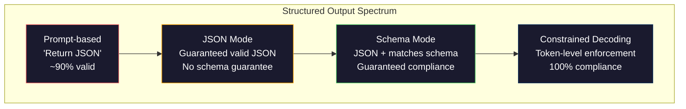
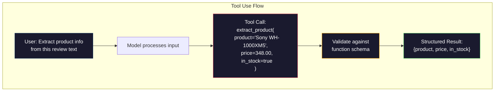

# Ustrukturyzowane dane wyjściowe: JSON, weryfikacja schematu, dekodowanie ograniczone

> Twój LLM zwraca ciąg znaków. Twoja aplikacja potrzebuje JSON. Ta luka spowodowała awarię większej liczby systemów produkcyjnych niż jakakolwiek halucynacja modelowa. Ustrukturyzowane dane wyjściowe stanowią pomost pomiędzy językiem naturalnym a danymi wpisywanymi na maszynie. Zrób to dobrze, a Twój LLM stanie się niezawodnym interfejsem API. Źle się zrozumiesz, a o 3 nad ranem analizujesz dowolny tekst za pomocą wyrażenia regularnego.

**Typ:** Kompilacja
**Języki:** Python
**Wymagania wstępne:** Faza 10, lekcje 01-05 (LLM od podstaw)
**Czas:** ~90 minut
**Powiązane:** Faza 5 · 20 (Ustrukturyzowane dane wyjściowe i ograniczone dekodowanie) obejmuje teorię na poziomie dekodera (procesory logitowe FSM/CFG, konspekty, XGrammar). Ta lekcja skupia się na produkcyjnej powierzchni SDK (OpenAI `response_format`, użycie narzędzi antropicznych, instruktor) — przeczytaj najpierw fazę 5 · 20, jeśli chcesz zrozumieć, co dzieje się pod interfejsem API.

## Cele nauczania

- Implementuj dane wyjściowe w trybie JSON i ograniczone schematem przy użyciu parametrów OpenAI i Anthropic API
- Zbuduj warstwę walidacyjną Pydantic, która odrzuca zniekształcone wyniki LLM i ponawia próby z informacją o błędzie
— Wyjaśnij, w jaki sposób ograniczone dekodowanie wymusza prawidłowy kod JSON na poziomie tokenu bez przetwarzania końcowego
- Projektuj solidne podpowiedzi ekstrakcji, które niezawodnie konwertują nieustrukturyzowany tekst na struktury danych maszynowych

## Problem

Pytasz LLM: „Wyodrębnij nazwę produktu, cenę i dostępność z tego tekstu”. Odpowiedź brzmi:

```
The product is the Sony WH-1000XM5 headphones, which cost $348.00 and are currently in stock.
```

To całkowicie poprawna odpowiedź. Jest to również całkowicie bezużyteczne dla Twojej aplikacji. Twój system inwentaryzacji potrzebuje `{"product": "Sony WH-1000XM5", "price": 348.00, "in_stock": true}`. Potrzebujesz obiektu JSON z określonymi kluczami, określonymi typami i określonymi ograniczeniami wartości. Nie potrzebujesz wyroku.

Naiwne rozwiązanie: dodaj „Odpowiedz w JSON” do swojego monitu. To działa w 90% przypadków. Pozostałe 10% modelu otacza JSON barierami kodu przeceny lub dodaje preambułę w stylu „Oto JSON:” lub generuje niepoprawny składniowo kod JSON, ponieważ wcześniej zamknął nawias. Twój analizator JSON ulega awarii. Twój rurociąg ulega awarii. Dodajesz try/except i pętlę ponawiania. Ponowna próba czasami generuje inne dane. Teraz masz problem ze spójnością, oprócz problemu z analizą.

Nie jest to natychmiastowy problem inżynieryjny. Jest to problem z dekodowaniem. Model generuje tokeny od lewej do prawej. Na każdej pozycji wybiera najbardziej prawdopodobny następny token ze słownika ponad 100 000 opcji. Większość tych opcji spowoduje wygenerowanie nieprawidłowego kodu JSON w dowolnej pozycji. Jeśli model właśnie wyemitował `{"price":`, następnym tokenem musi być cyfra, cudzysłów (w przypadku ciągu znaków), `null`, `true`, `false` lub znak ujemny. Wszystko inne generuje nieprawidłowy JSON. Bez ograniczeń model może wybrać całkowicie rozsądne angielskie słowo, które jest katastrofalnie błędne pod względem składniowym.

## Koncepcja

### Ustrukturyzowane widmo wyjściowe

Istnieją cztery poziomy ustrukturyzowanej kontroli wyjścia, każdy bardziej niezawodny niż poprzedni.



**Oparta na podpowiedzi** („Odpowiedz w prawidłowym formacie JSON”): brak egzekwowania. Model zwykle jest zgodny, ale czasami nie. Niezawodność: ~90%. Tryb awarii: płoty przecen, tekst preambuły, obcięte dane wyjściowe, zła struktura.

**Tryb JSON**: interfejs API gwarantuje, że dane wyjściowe są prawidłowym formatem JSON. Umożliwia to `response_format: { type: "json_object" }` OpenAI. Dane wyjściowe zostaną przeanalizowane bez błędów. Ale może nie pasować do oczekiwanego schematu - dodatkowe klucze, nieprawidłowe typy, brakujące pola.

**Tryb schematu**: interfejs API pobiera schemat JSON i gwarantuje, że dane wyjściowe będą z nim zgodne. W 2026 roku każdy główny dostawca obsługuje to natywnie: `response_format: { type: "json_schema", json_schema: {...} }` OpenAI (także jako `tool_choice="required"`), użycie narzędzi Anthropic z `input_schema` i `response_schema` + <span> firmy Gemini class="notranslate">__IC_11__</span>. Dane wyjściowe zawierają dokładnie określone klucze, typy i ograniczenia.

**Ograniczone dekodowanie**: na każdej pozycji tokena podczas generowania dekoder maskuje wszystkie tokeny, które mogłyby wygenerować nieprawidłowe dane wyjściowe. Jeśli schemat wymaga liczby, a model ma zamiar wyemitować literę, prawdopodobieństwo tego tokena jest ustawiane na zero. Model może generować tylko tokeny, które prowadzą do prawidłowych wyników. To właśnie implementuje tryb ustrukturyzowanego wyjścia OpenAI i biblioteki takie jak Outlines i Guidance.

### Schemat JSON: język kontraktu

Schemat JSON pozwala powiedzieć modelowi (lub warstwie walidacji), jaki kształt musi mieć wynik. Używa go każdy większy ustrukturyzowany system wyjściowy.

```json
{
  "type": "object",
  "properties": {
    "product": { "type": "string" },
    "price": { "type": "number", "minimum": 0 },
    "in_stock": { "type": "boolean" },
    "categories": {
      "type": "array",
      "items": { "type": "string" }
    }
  },
  "required": ["product", "price", "in_stock"]
}
```

Ten schemat mówi: dane wyjściowe muszą być obiektem zawierającym ciąg znaków `product`, liczbę nieujemną `price`, wartość logiczną `in_stock` i opcjonalną tablicę ciągów znaków `categories`. Każde wyjście, które nie pasuje, zostaje odrzucone.

Schematy radzą sobie z trudnymi przypadkami: zagnieżdżonymi obiektami, tablicami z wpisanymi elementami, wyliczeniami (ograniczają ciąg znaków do określonych wartości), dopasowywaniem wzorców (regex na ciągach znaków) i kombinatorami (oneOf, anyOf, allOf dla wyjść polimorficznych).

### Wzór pydantyczny

W Pythonie nie piszesz schematu JSON ręcznie. Definiujesz model Pydantic, a on generuje schemat za Ciebie.

```python
from pydantic import BaseModel

class Product(BaseModel):
    product: str
    price: float
    in_stock: bool
    categories: list[str] = []
```

Daje to ten sam schemat JSON, co powyżej. Biblioteka Instructor (i pakiet SDK OpenAI) bezpośrednio akceptują modele Pydantic: przekaż klasę modelu, odzyskaj sprawdzoną instancję. Jeśli dane wyjściowe LLM nie są zgodne, instruktor automatycznie ponawia próbę.

### Wywołanie funkcji/użycie narzędzia

Alternatywny interfejs dla tego samego problemu. Zamiast prosić model o bezpośrednie utworzenie kodu JSON, definiujesz „narzędzia” (funkcje) za pomocą wpisanych parametrów. Model wyprowadza wywołanie funkcji z argumentami strukturalnymi. OpenAI nazywa to „wywoływaniem funkcji”. Anthropic nazywa to „używaniem narzędzi”. Rezultat jest taki sam: uporządkowane dane.



Użycie narzędzi jest preferowane, gdy model musi wybrać, którą funkcję wywołać, a nie tylko wypełnić parametry. Jeśli masz 10 różnych schematów ekstrakcji i model musi wybrać właściwy na podstawie danych wejściowych, użycie narzędzia umożliwia zarówno wybór schematu, jak i ustrukturyzowany wynik.

### Typowe tryby awarii

Nawet przy egzekwowaniu schematu ustrukturyzowane wyniki mogą zawieść w subtelny sposób.

**Wartości halucynacyjne**: dane wyjściowe odpowiadają schematowi, ale zawierają wymyślone dane. Model generuje `{"price": 299.99}`, gdy tekst mówi 348 USD. Sprawdzanie poprawności schematu nie może tego wykryć — typ jest poprawny, wartość jest nieprawidłowa.

**Zamieszanie w wyliczeniu**: ograniczasz pole do `["in_stock", "out_of_stock", "preorder"]`. Model zwraca `"available"` — semantycznie poprawne, ale nie w dozwolonym zestawie. Dobre ograniczone dekodowanie zapobiega temu. Podejścia oparte na podpowiedziach nie.

**Głębokość obiektu zagnieżdżonego**: głęboko zagnieżdżone schematy (ponad 4 poziomy) powodują więcej błędów. Każdy poziom zagnieżdżenia to kolejne miejsce, w którym model może stracić kontrolę nad strukturą.

**Długość tablicy**: model może generować za dużo lub za mało elementów w tablicy. Schematy obsługują `minItems` i `maxItems`, ale nie wszyscy dostawcy wymuszają je na poziomie dekodowania.

**Opcjonalne pominięcie pola**: model pomija pola, które są technicznie opcjonalne, ale semantycznie ważne dla Twojego przypadku użycia. Ustaw je zgodnie z wymaganiami schematu, nawet jeśli czasami brakuje danych — zmuś model do jawnego utworzenia `null`.

## Zbuduj to

### Krok 1: Walidator schematu JSON

Zbuduj od podstaw walidator, który sprawdza, czy obiekt Pythona pasuje do schematu JSON. To właśnie działa po stronie wyjściowej w celu sprawdzenia zgodności.

```python
import json

def validate_schema(data, schema):
    errors = []
    _validate(data, schema, "", errors)
    return errors

def _validate(data, schema, path, errors):
    schema_type = schema.get("type")

    if schema_type == "object":
        if not isinstance(data, dict):
            errors.append(f"{path}: expected object, got {type(data).__name__}")
            return
        for key in schema.get("required", []):
            if key not in data:
                errors.append(f"{path}.{key}: required field missing")
        properties = schema.get("properties", {})
        for key, value in data.items():
            if key in properties:
                _validate(value, properties[key], f"{path}.{key}", errors)

    elif schema_type == "array":
        if not isinstance(data, list):
            errors.append(f"{path}: expected array, got {type(data).__name__}")
            return
        min_items = schema.get("minItems", 0)
        max_items = schema.get("maxItems", float("inf"))
        if len(data) < min_items:
            errors.append(f"{path}: array has {len(data)} items, minimum is {min_items}")
        if len(data) > max_items:
            errors.append(f"{path}: array has {len(data)} items, maximum is {max_items}")
        items_schema = schema.get("items", {})
        for i, item in enumerate(data):
            _validate(item, items_schema, f"{path}[{i}]", errors)

    elif schema_type == "string":
        if not isinstance(data, str):
            errors.append(f"{path}: expected string, got {type(data).__name__}")
            return
        enum_values = schema.get("enum")
        if enum_values and data not in enum_values:
            errors.append(f"{path}: '{data}' not in allowed values {enum_values}")

    elif schema_type == "number":
        if not isinstance(data, (int, float)):
            errors.append(f"{path}: expected number, got {type(data).__name__}")
            return
        minimum = schema.get("minimum")
        maximum = schema.get("maximum")
        if minimum is not None and data < minimum:
            errors.append(f"{path}: {data} is less than minimum {minimum}")
        if maximum is not None and data > maximum:
            errors.append(f"{path}: {data} is greater than maximum {maximum}")

    elif schema_type == "boolean":
        if not isinstance(data, bool):
            errors.append(f"{path}: expected boolean, got {type(data).__name__}")

    elif schema_type == "integer":
        if not isinstance(data, int) or isinstance(data, bool):
            errors.append(f"{path}: expected integer, got {type(data).__name__}")
```

### Krok 2: Model w stylu Pydantic do schematu

Zbuduj minimalny konwerter klasy na schemat. Zdefiniuj klasę Pythona i automatycznie wygeneruj jej schemat JSON.

```python
class SchemaField:
    def __init__(self, field_type, required=True, default=None, enum=None, minimum=None, maximum=None):
        self.field_type = field_type
        self.required = required
        self.default = default
        self.enum = enum
        self.minimum = minimum
        self.maximum = maximum

def python_type_to_schema(field):
    type_map = {
        str: "string",
        int: "integer",
        float: "number",
        bool: "boolean",
    }

    schema = {}

    if field.field_type in type_map:
        schema["type"] = type_map[field.field_type]
    elif field.field_type == list:
        schema["type"] = "array"
        schema["items"] = {"type": "string"}
    elif isinstance(field.field_type, dict):
        schema = field.field_type

    if field.enum:
        schema["enum"] = field.enum
    if field.minimum is not None:
        schema["minimum"] = field.minimum
    if field.maximum is not None:
        schema["maximum"] = field.maximum

    return schema

def model_to_schema(name, fields):
    properties = {}
    required = []

    for field_name, field in fields.items():
        properties[field_name] = python_type_to_schema(field)
        if field.required:
            required.append(field_name)

    return {
        "type": "object",
        "properties": properties,
        "required": required,
    }
```

### Krok 3: Ograniczony filtr tokenów

Symuluj ograniczone dekodowanie. Mając częściowy ciąg JSON i schemat, określ, które kategorie tokenów są prawidłowe w bieżącej pozycji.

```python
def next_valid_tokens(partial_json, schema):
    stripped = partial_json.strip()

    if not stripped:
        return ["{"]

    try:
        json.loads(stripped)
        return ["<EOS>"]
    except json.JSONDecodeError:
        pass

    last_char = stripped[-1] if stripped else ""

    if last_char == "{":
        return ['"', "}"]
    elif last_char == '"':
        if stripped.endswith('":'):
            return ['"', "0-9", "true", "false", "null", "[", "{"]
        return ["a-z", '"']
    elif last_char == ":":
        return [" ", '"', "0-9", "true", "false", "null", "[", "{"]
    elif last_char == ",":
        return [" ", '"', "{", "["]
    elif last_char in "0123456789":
        return ["0-9", ".", ",", "}", "]"]
    elif last_char == "}":
        return [",", "}", "]", "<EOS>"]
    elif last_char == "]":
        return [",", "}", "<EOS>"]
    elif last_char == "[":
        return ['"', "0-9", "true", "false", "null", "{", "[", "]"]
    else:
        return ["any"]

def demonstrate_constrained_decoding():
    partial_states = [
        '',
        '{',
        '{"product"',
        '{"product":',
        '{"product": "Sony"',
        '{"product": "Sony",',
        '{"product": "Sony", "price":',
        '{"product": "Sony", "price": 348',
        '{"product": "Sony", "price": 348}',
    ]

    print(f"{'Partial JSON':<45} {'Valid Next Tokens'}")
    print("-" * 80)
    for state in partial_states:
        valid = next_valid_tokens(state, {})
        display = state if state else "(empty)"
        print(f"{display:<45} {valid}")
```

### Krok 4: Rurociąg wydobywczy

Połącz wszystko w potok ekstrakcji: zdefiniuj schemat, symuluj LLM generujący ustrukturyzowane dane wyjściowe, zweryfikuj dane wyjściowe i obsługuj ponowne próby.

```python
def simulate_llm_extraction(text, schema, attempt=0):
    if "headphones" in text.lower() or "sony" in text.lower():
        if attempt == 0:
            return '{"product": "Sony WH-1000XM5", "price": 348.00, "in_stock": true, "categories": ["audio", "headphones"]}'
        return '{"product": "Sony WH-1000XM5", "price": 348.00, "in_stock": true}'

    if "laptop" in text.lower():
        return '{"product": "MacBook Pro 16", "price": 2499.00, "in_stock": false, "categories": ["computers"]}'

    return '{"product": "Unknown", "price": 0, "in_stock": false}'

def extract_with_retry(text, schema, max_retries=3):
    for attempt in range(max_retries):
        raw = simulate_llm_extraction(text, schema, attempt)

        try:
            data = json.loads(raw)
        except json.JSONDecodeError as e:
            print(f"  Attempt {attempt + 1}: JSON parse error -- {e}")
            continue

        errors = validate_schema(data, schema)
        if not errors:
            return data

        print(f"  Attempt {attempt + 1}: Schema validation errors -- {errors}")

    return None

product_schema = {
    "type": "object",
    "properties": {
        "product": {"type": "string"},
        "price": {"type": "number", "minimum": 0},
        "in_stock": {"type": "boolean"},
        "categories": {"type": "array", "items": {"type": "string"}},
    },
    "required": ["product", "price", "in_stock"],
}
```

### Krok 5: Uruchom pełny potok

```python
def run_demo():
    print("=" * 60)
    print("  Structured Output Pipeline Demo")
    print("=" * 60)

    print("\n--- Schema Definition ---")
    product_fields = {
        "product": SchemaField(str),
        "price": SchemaField(float, minimum=0),
        "in_stock": SchemaField(bool),
        "categories": SchemaField(list, required=False),
    }
    generated_schema = model_to_schema("Product", product_fields)
    print(json.dumps(generated_schema, indent=2))

    print("\n--- Schema Validation ---")
    test_cases = [
        ({"product": "Test", "price": 10.0, "in_stock": True}, "Valid object"),
        ({"product": "Test", "price": -5.0, "in_stock": True}, "Negative price"),
        ({"product": "Test", "in_stock": True}, "Missing price"),
        ({"product": "Test", "price": "ten", "in_stock": True}, "String as price"),
        ("not an object", "String instead of object"),
    ]

    for data, label in test_cases:
        errors = validate_schema(data, product_schema)
        status = "PASS" if not errors else f"FAIL: {errors}"
        print(f"  {label}: {status}")

    print("\n--- Constrained Decoding Simulation ---")
    demonstrate_constrained_decoding()

    print("\n--- Extraction Pipeline ---")
    texts = [
        "The Sony WH-1000XM5 headphones are priced at $348 and currently available.",
        "The new MacBook Pro 16-inch laptop costs $2499 but is sold out.",
        "This is a random sentence with no product info.",
    ]

    for text in texts:
        print(f"\n  Input: {text[:60]}...")
        result = extract_with_retry(text, product_schema)
        if result:
            print(f"  Output: {json.dumps(result)}")
        else:
            print(f"  Output: FAILED after retries")
```

## Użyj tego

### Ustrukturyzowane wyniki OpenAI

```python
# from openai import OpenAI
# from pydantic import BaseModel
#
# client = OpenAI()
#
# class Product(BaseModel):
#     product: str
#     price: float
#     in_stock: bool
#
# response = client.beta.chat.completions.parse(
#     model="gpt-5-mini",
#     messages=[
#         {"role": "system", "content": "Extract product information."},
#         {"role": "user", "content": "Sony WH-1000XM5, $348, in stock"},
#     ],
#     response_format=Product,
# )
#
# product = response.choices[0].message.parsed
# print(product.product, product.price, product.in_stock)
```

Tryb wyjścia strukturalnego OpenAI wykorzystuje wewnętrznie ograniczone dekodowanie. Każdy token wygenerowany przez model gwarantuje wygenerowanie danych wyjściowych pasujących do schematu Pydantic. Nie ma potrzeby ponawiania prób. Nie jest wymagana żadna walidacja. Ograniczenie jest włączane do procesu dekodowania.

### Użycie narzędzi antropicznych

```python
# import anthropic
#
# client = anthropic.Anthropic()
#
# response = client.messages.create(
#     model="claude-opus-4-7",
#     max_tokens=1024,
#     tools=[{
#         "name": "extract_product",
#         "description": "Extract product information from text",
#         "input_schema": {
#             "type": "object",
#             "properties": {
#                 "product": {"type": "string"},
#                 "price": {"type": "number"},
#                 "in_stock": {"type": "boolean"},
#             },
#             "required": ["product", "price", "in_stock"],
#         },
#     }],
#     messages=[{"role": "user", "content": "Extract: Sony WH-1000XM5, $348, in stock"}],
# )
```

Anthropic osiąga ustrukturyzowany wynik dzięki użyciu narzędzi. Model emituje wywołanie narzędzia z argumentami strukturalnymi pasującymi do input_schema. Ten sam wynik, inna powierzchnia API.

### Biblioteka instruktorów

```python
# pip install instructor
# import instructor
# from openai import OpenAI
# from pydantic import BaseModel
#
# client = instructor.from_openai(OpenAI())
#
# class Product(BaseModel):
#     product: str
#     price: float
#     in_stock: bool
#
# product = client.chat.completions.create(
#     model="gpt-5-mini",
#     response_model=Product,
#     messages=[{"role": "user", "content": "Sony WH-1000XM5, $348, in stock"}],
# )
```

Instruktor otacza dowolnego klienta LLM i dodaje automatyczne ponowne próby z walidacją. Jeśli pierwsza próba nie powiedzie się, wysyła błędy z powrotem do modelu jako kontekst i prosi go o naprawienie danych wyjściowych. Działa to z każdym dostawcą, nie tylko z OpenAI.

## Wyślij to

W tej lekcji omówiono `outputs/prompt-structured-extractor.md` — szablon podpowiedzi wielokrotnego użytku, który wyodrębnia uporządkowane dane z dowolnego tekstu posiadającego definicję schematu. Podaj mu schemat JSON i tekst bez struktury, a zwróci zweryfikowany JSON.

Tworzy także `outputs/skill-structured-outputs.md` — ramy decyzyjne umożliwiające wybór właściwej strategii ustrukturyzowanego wyniku w oparciu o Twojego dostawcę, wymagania dotyczące niezawodności i złożoność schematu.

## Ćwiczenia

1. Rozszerz walidator schematu o obsługę `oneOf` (dane muszą pasować dokładnie do jednego z kilku schematów). Obsługuje to wyniki polimorficzne — na przykład pole, które może być obiektem `Product` lub `Service` o różnych kształtach.

2. Zbuduj narzędzie „schema diff”, które porównuje dwa schematy i identyfikuje istotne zmiany (usunięte wymagane pola, zmienione typy) w porównaniu ze zmianami nieistotnymi (dodane pola opcjonalne, złagodzone ograniczenia). Jest to niezbędne do tworzenia wersji schematów ekstrakcji w środowisku produkcyjnym.

3. Zaimplementuj bardziej realistyczny symulator dekodowania z ograniczeniami. Mając schemat JSON i słownictwo składające się ze 100 tokenów (litery, cyfry, znaki interpunkcyjne, słowa kluczowe), przejdź krok po kroku przez generację, maskując nieprawidłowe tokeny w każdej pozycji. Zmierz, jaki procent słownictwa jest ważny na każdym etapie.

4. Zbuduj pakiet ewaluacyjny ekstrakcji. Utwórz 50 opisów produktów z ręcznie oznaczonymi danymi wyjściowymi w formacie JSON. Uruchom potok ekstrakcji na wszystkich 50 i zmierz dokładne dopasowanie, dokładność na poziomie pola i zgodność z typem. Określ, które pola są najtrudniejsze do prawidłowego wyodrębnienia.

5. Dodaj „wskaźniki zaufania” do swojego rurociągu ekstrakcji. Dla każdej wyodrębnionej zmiennej oszacuj pewność modelu (na podstawie prawdopodobieństw tokenowych lub trzykrotnie uruchamiając ekstrakcję i mierząc spójność). Oznacz pola o niskim poziomie zaufania do sprawdzenia przez człowieka.

## Kluczowe terminy

| Termin | Co ludzie mówią | Co to właściwie oznacza |
|------|----------------|----------------------|
| Tryb JSON | „Zwraca JSON” | Flaga API, która gwarantuje składniowo poprawne dane wyjściowe JSON, ale nie wymusza żadnego konkretnego schematu |
| Dane wyjściowe strukturyzowane | „Wpisano JSON” | Dane wyjściowe pasujące do określonego schematu JSON z poprawnymi kluczami, typami i ograniczeniami |
| Ograniczone dekodowanie | „Pokolenie kierowane” | Na każdej pozycji tokena zamaskuj tokeny, które generowałyby nieprawidłowe dane wyjściowe — gwarantuje 100% zgodność ze schematem |
| Schemat JSON | „Szablon JSON” | Deklaratywny język opisujący strukturę, typy i ograniczenia danych JSON (używany przez OpenAPI, JSON Forms itp.) |
| Pydantyczny | „Klasy danych Pythona+” | Biblioteka Pythona definiująca modele danych z walidacją typu, używana przez FastAPI i Instructor do generowania schematów JSON |
| Wywołanie funkcji | „Korzystanie z narzędzi” | LLM generuje wywołanie funkcji strukturalnej (nazwa + wpisane argumenty) zamiast wolnego tekstu — obsługują to zarówno OpenAI, jak i Anthropic.
| Instruktor | „Pydantic dla LLM” | Biblioteka Pythona, która otacza klientów LLM w celu zwrócenia zweryfikowanych instancji Pydantic z automatyczną ponowną próbą w przypadku niepowodzenia sprawdzania poprawności |
| Maskowanie tokena | „Filtrowanie słownictwa” | Ustawienie prawdopodobieństw określonych tokenów na zero podczas generowania, aby model nie mógł ich wygenerować |
| Zgodność schematu | „Dopasowuje się do kształtu” | Dane wyjściowe zawierają wszystkie wymagane pola, prawidłowe typy, wartości w ramach ograniczeń i brak dodatkowych niedozwolonych pól |
| Pętla ponów próbę | „Spróbuj ponownie, aż zadziała” | Wyślij błędy walidacji z powrotem do modelu i poproś o naprawę danych wyjściowych — instruktor robi to automatycznie, aż do konfigurowalnego limitu |

## Dalsze czytanie

- [Przewodnik po uporządkowanych wynikach OpenAI](https://platform.openai.com/docs/guides/structured-outputs) — oficjalna dokumentacja dotyczące ograniczonego dekodowania opartego na schemacie JSON w interfejsie API OpenAI
– [Willard i Louf, 2023 – „Efficient Guided Generation for Large Language Models”] (https://arxiv.org/abs/2307.09702) – artykuł dotyczący zarysów opisujący sposób kompilowania schematów JSON na maszyny o skończonych stanach w przypadku ograniczeń na poziomie tokena
- [Dokumentacja instruktora](https://python.useinstructor.com/) - standardowa biblioteka do uzyskiwania uporządkowanych wyników z dowolnego LLM z walidacją i ponownymi próbami Pydantic
– [Przewodnik po użyciu narzędzia Anthropic](https://docs.anthropic.com/en/docs/tool-use) – jak Claude implementuje ustrukturyzowane dane wyjściowe za pomocą narzędzia ze schematem JSON input_schema
– [Specyfikacja schematu JSON](https://json-schema.org/) – pełna specyfikacja języka schematu używanego przez każdy główny system strukturalnego wyjścia
- [Biblioteka Outlines](https://github.com/outlines-dev/outlines) -- ograniczone generowanie typu open source przy użyciu wyrażeń regularnych i schematu JSON skompilowane do maszyn o skończonych stanach
- [Dong i in., „XGrammar: Elastic and Efficient Structured Generation Engine for Large Language Models” (MLSys 2025)](https://arxiv.org/abs/2411.15100) – aktualny, najnowocześniejszy silnik gramatyczny; Kompilacja automatu pushdown, która maskuje tokeny przy ~ 100 ns/token.
- [Beurer-Kellner i in., „Prompting Is Programming: A Query Language for Large Language Models” (LMQL)](https://arxiv.org/abs/2212.06094) – papierowa ramka LMQL ograniczała dekodowanie jako język zapytań z ograniczeniami typu i wartości.
- [Wytyczne Microsoft (dokumentacja frameworka)](https://github.com/guidance-ai/guidance) -- ograniczone generowanie oparte na szablonach; niezależne od dostawcy uzupełnienie Outlines i XGrammar.