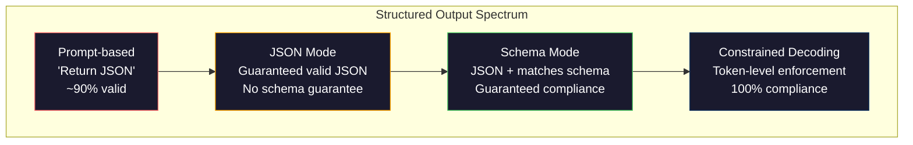
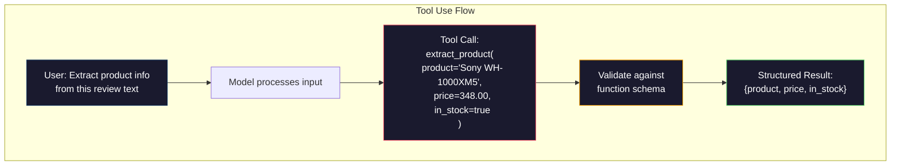

# Ustrukturyzowane dane wyjściowe: JSON, weryfikacja schematu, dekodowanie ograniczone

> Twój LLM zwraca ciąg znaków (string). Twoja aplikacja potrzebuje formatu JSON. Ta rozbieżność spowodowała awarię większej liczby systemów produkcyjnych niż jakakolwiek halucynacja modelu. Ustrukturyzowane dane wyjściowe (Structured Outputs) stanowią pomost pomiędzy językiem naturalnym a ustrukturyzowanymi danymi typowanymi. Zrób to dobrze, a Twój LLM stanie się niezawodnym API. Jeśli podejdziesz do tego źle, o 3 nad ranem będziesz debugować parsowanie tekstu za pomocą wyrażeń regularnych.

**Typ:** Budowa / Kompilacja
**Język:** Python
**Wymagania wstępne:** Faza 10, lekcje 01-05 (LLM od podstaw)
**Czas:** ~90 minut
**Powiązane:** Temat Faza 5 · 20 (Ustrukturyzowane dane wyjściowe i ograniczone dekodowanie) obejmuje teorię na poziomie dekodera (procesory logitów FSM/CFG, Outlines, XGrammar). Niniejsza lekcja skupia się na praktycznym zastosowaniu w produkcyjnych SDK (parametr `response_format` w OpenAI, Tool Use w Anthropic, biblioteka Instructor) – jeśli chcesz zrozumieć niskopoziomowe mechanizmy działania API, przeczytaj najpierw materiał z Fazy 5 · 20.

## Cele lekcji

- Implementacja generowania danych w trybie JSON oraz danych ograniczonych schematem (schema-constrained) z wykorzystaniem parametrów API OpenAI i Anthropic
- Budowa warstwy walidacji opartej na Pydantic, która odrzuca niepoprawne dane wyjściowe z LLM i automatycznie ponawia próby, przesyłając modelowi informację o błędzie
- Zrozumienie, w jaki sposób ograniczone dekodowanie (constrained decoding) wymusza poprawność formatu JSON na poziomie pojedynczych tokenów, eliminując potrzebę postprocessingu
- Projektowanie odpornych promptów ekstrakcyjnych, które niezawodnie konwertują nieustrukturyzowany tekst na struktury danych czytelne dla maszyn

## Problem

Pytasz LLM: „Wyodrębnij nazwę produktu, cenę i dostępność z tego tekstu”. Odpowiedź brzmi:

```
The product is the Sony WH-1000XM5 headphones, which cost $348.00 and are currently in stock.
```

To całkowicie poprawna odpowiedź. Jest ona jednak zupełnie bezużyteczna dla Twojej aplikacji. Twój system magazynowy wymaga formatu `{"product": "Sony WH-1000XM5", "price": 348.00, "in_stock": true}`. Potrzebujesz obiektu JSON z konkretnymi kluczami, określonymi typami danych i zdefiniowanymi ograniczeniami wartości. Nie potrzebujesz całego zdania w języku naturalnym.

Naiwne rozwiązanie: dodanie instrukcji „Odpowiedz w formacie JSON” do promptu. Działa to w około 90% przypadków. W pozostałych 10% model otacza JSON blokami kodu Markdown (markdown code blocks), dodaje wstęp typu „Oto Twój JSON:” lub generuje niepoprawny składniowo kod JSON (np. zapominając o zamknięciu nawiasu). W rezultacie parser JSON zgłasza błąd, a cały potok danych (pipeline) ulega awarii. Dodanie bloku try/except i pętli ponowień nie zawsze pomaga – ponowna próba może wygenerować inne dane, co oprócz problemów z parsowaniem wprowadza problem ze spójnością wyników.

Nie jest to wyłącznie problem związany z prompt engineeringiem – to problem na poziomie dekodowania. Model generuje tokeny od lewej do prawej. Na każdej pozycji wybiera najbardziej prawdopodobny kolejny token ze słownika liczącego ponad 100 000 pozycji. Większość z tych opcji w dowolnym punkcie wygenerowałaby nieprawidłowy składniowo kod JSON. Jeśli model właśnie wyemitował `{"price":`, kolejnym tokenem musi być liczba, cudzysłów (rozpoczynający string), `null`, `true`, `false` lub znak minusa. Każdy inny token spowoduje błąd składniowy. Bez odpowiednich ograniczeń model może wybrać całkowicie poprawne semantycznie angielskie słowo, które jednak pod kątem składni JSON będzie katastrofalnym błędem.

## Koncepcja

### Spektrum ustrukturyzowanych danych wyjściowych

Istnieją cztery poziomy kontroli nad strukturą danych wyjściowych, z których każdy kolejny charakteryzuje się większą niezawodnością.



**Metoda oparta na promptach** („Odpowiedz w prawidłowym formacie JSON”): brak strukturalnego wymuszania. Model zazwyczaj dostosowuje się do instrukcji, ale zdarzają się wyjątki. Niezawodność: ~90%. Typowe błędy: bloki kodu markdown (markdown code blocks), tekst wprowadzający (preambuła), obcięte dane wyjściowe, nieprawidłowa struktura pól.

**Tryb JSON (JSON Mode)**: interfejs API gwarantuje, że wygenerowany tekst jest poprawnym składniowo obiektem JSON. W OpenAI odpowiada za to parametr `response_format: { type: "json_object" }`. Dane zostaną przeanalizowane bez błędów składniowych, ale nie ma gwarancji zgodności z oczekiwanym schematem – mogą pojawić się nadmiarowe klucze, błędne typy danych lub brakować wymaganych pól.

**Tryb schematu (Schema Mode)**: interfejs API przyjmuje schemat JSON (JSON Schema) i gwarantuje, że dane wyjściowe będą z nim w pełni zgodne. W 2026 roku każdy główny dostawca obsługuje to natywnie: `response_format: { type: "json_schema", json_schema: {...} }` w OpenAI (dostępne również poprzez wymuszenie narzędzia za pomocą `tool_choice="required"`), Tool Use w Anthropic z `input_schema` i `response_schema` + <span class="notranslate">__IC_11__</span> w Gemini. Dane wyjściowe zawierają dokładnie zdefiniowane klucze, typy oraz ograniczenia wartości.

**Ograniczone dekodowanie (Constrained Decoding)**: na poziomie generowania każdego kolejnego tokenu dekoder maskuje (blokuje) wszystkie tokeny ze słownika, które mogłyby doprowadzić do powstania niepoprawnego kodu JSON lub naruszenia schematu. Jeśli schemat wymaga liczby, a model próbuje wygenerować literę, prawdopodobieństwo wyboru tego tokenu jest ustawiane na zero. Model może wybrać wyłącznie te tokeny, które prowadzą do poprawnego wyniku zgodnego ze schematem. Rozwiązanie to jest podstawą mechanizmu Structured Outputs w OpenAI oraz bibliotek takich jak Outlines czy Guidance.

### Schemat JSON: Język kontraktu danych

Schemat JSON pozwala zdefiniować strukturę, jaką musi przyjąć wynik generowany przez model (lub weryfikowany przez warstwę walidacji). Jest on standardem we wszystkich nowoczesnych systemach generowania ustrukturyzowanych danych.

```json
{
  "type": "object",
  "properties": {
    "product": { "type": "string" },
    "price": { "type": "number", "minimum": 0 },
    "in_stock": { "type": "boolean" },
    "categories": {
      "type": "array",
      "items": { "type": "string" }
    }
  },
  "required": ["product", "price", "in_stock"]
}
```

Ten schemat określa, że dane wyjściowe muszą być obiektem zawierającym klucz `product` (ciąg znaków), nieujemną wartość `price` (liczba), wartość logiczną `in_stock` oraz opcjonalną tablicę ciągów znaków `categories`. Każdy wynik niezgodny z tym schematem zostanie odrzucony.

Schematy JSON obsługują zaawansowane przypadki: obiekty zagnieżdżone, tablice z typowanymi elementami, typy wyliczeniowe (enum – ograniczające ciąg znaków do określonej listy wartości), dopasowywanie wzorców (wyrażenia regularne dla stringów) oraz operatory logiczne (kombinatory takie jak `oneOf`, `anyOf`, `allOf` dla struktur polimorficznych).

### Model Pydantic

W Pythonie nie ma potrzeby ręcznego pisania schematów JSON. Definiuje się model Pydantic, który automatycznie generuje odpowiedni schemat.

```python
from pydantic import BaseModel

class Product(BaseModel):
    product: str
    price: float
    in_stock: bool
    categories: list[str] = []
```

Powyższy kod wygeneruje dokładnie taki sam schemat JSON jak w poprzednim przykładzie. Biblioteka Instructor oraz oficjalne SDK OpenAI bezpośrednio obsługują modele Pydantic: wystarczy przekazać klasę modelu, aby otrzymać w pełni zweryfikowaną instancję obiektu. Jeśli dane wyjściowe z LLM są niezgodne ze schematem, Instructor automatycznie wyśle zapytanie ponownie.

### Function Calling / Tool Use

Alternatywne podejście do tego samego problemu. Zamiast prosić model o bezpośrednie wygenerowanie kodu JSON, definiujesz „narzędzia” (funkcje) ze ściśle określonymi typami parametrów. Model generuje wywołanie funkcji wraz z ustrukturyzowanymi argumentami. OpenAI określa tę funkcję jako „Function Calling”, a Anthropic jako „Tool Use”. Rezultat końcowy jest taki sam: otrzymujemy czyste, ustrukturyzowane dane.



Wykorzystanie narzędzi (Tool Use) jest preferowane, gdy model musi sam zdecydować, którą funkcję wywołać, zamiast jedynie uzupełniać parametry jednego schematu. Jeśli dysponujesz 10 różnymi schematami ekstrakcji i model musi wybrać właściwy na podstawie tekstu wejściowego, mechanizm Tool Use pozwala na jednoczesny wybór odpowiedniego schematu i wygenerowanie ustrukturyzowanego wyniku.

### Typowe błędy i problemy (Failure Modes)

Nawet przy wymuszeniu schematu na poziomie API, ustrukturyzowane generowanie może napotkać subtelne problemy.

**Halucynowanie wartości**: dane wyjściowe są zgodne ze schematem pod kątem struktury, ale zawierają zmyślone informacje. Model generuje np. `{"price": 299.99}`, mimo że w tekście wejściowym widnieje kwota 348 USD. Walidacja schematu nie jest w stanie tego wykryć – typ danych jest poprawny, ale sama wartość jest błędna.

**Niezgodność z typem wyliczeniowym (enum)**: pole zostaje ograniczone do określonych wartości, np. `["in_stock", "out_of_stock", "preorder"]`. Model zwraca wartość `"available"` – semantycznie poprawną, ale spoza zdefiniowanego zestawu. Skuteczne ograniczone dekodowanie zapobiega takim sytuacjom, podczas gdy metody oparte wyłącznie na promptowaniu często zawodzą.

**Głęboko zagnieżdżone obiekty**: schematy o głębokim zagnieżdżeniu (powyżej 4 poziomów) generują znacznie więcej błędu. Każdy kolejny poziom zagnieżdżenia zwiększa ryzyko, że model straci kontrolę nad strukturą dokumentu.

**Długość tablicy (Array Length)**: model może wygenerować zbyt wiele lub zbyt mało elementów w tablicy. Schematy JSON obsługują parametry `minItems` i `maxItems`, ale nie wszyscy dostawcy API wymuszają ich przestrzeganie na poziomie dekodowania tokenów.

**Pomijanie pól opcjonalnych**: model ma tendencję do ignorowania pól, które są zdefiniowane jako opcjonalne, mimo że są kluczowe z punktu widzenia logiki biznesowej. Dobrą praktyką jest oznaczanie takich pól jako wymagane w schemacie, nawet jeśli dane nie zawsze są dostępne – zmusza to model do jawnego zwracania wartości `null`.

## Implementacja krok po kroku

### Krok 1: Walidator schematu JSON

Napiszemy od podstaw prosty walidator w Pythonie, który sprawdza, czy obiekt jest zgodny ze schematem JSON. Tego typu logika działa pod maską w celu weryfikacji zgodności danych wyjściowych.

```python
import json

def validate_schema(data, schema):
    errors = []
    _validate(data, schema, "", errors)
    return errors

def _validate(data, schema, path, errors):
    schema_type = schema.get("type")

    if schema_type == "object":
        if not isinstance(data, dict):
            errors.append(f"{path}: expected object, got {type(data).__name__}")
            return
        for key in schema.get("required", []):
            if key not in data:
                errors.append(f"{path}.{key}: required field missing")
        properties = schema.get("properties", {})
        for key, value in data.items():
            if key in properties:
                _validate(value, properties[key], f"{path}.{key}", errors)

    elif schema_type == "array":
        if not isinstance(data, list):
            errors.append(f"{path}: expected array, got {type(data).__name__}")
            return
        min_items = schema.get("minItems", 0)
        max_items = schema.get("maxItems", float("inf"))
        if len(data) < min_items:
            errors.append(f"{path}: array has {len(data)} items, minimum is {min_items}")
        if len(data) > max_items:
            errors.append(f"{path}: array has {len(data)} items, maximum is {max_items}")
        items_schema = schema.get("items", {})
        for i, item in enumerate(data):
            _validate(item, items_schema, f"{path}[{i}]", errors)

    elif schema_type == "string":
        if not isinstance(data, str):
            errors.append(f"{path}: expected string, got {type(data).__name__}")
            return
        enum_values = schema.get("enum")
        if enum_values and data not in enum_values:
            errors.append(f"{path}: '{data}' not in allowed values {enum_values}")

    elif schema_type == "number":
        if not isinstance(data, (int, float)):
            errors.append(f"{path}: expected number, got {type(data).__name__}")
            return
        minimum = schema.get("minimum")
        maximum = schema.get("maximum")
        if minimum is not None and data < minimum:
            errors.append(f"{path}: {data} is less than minimum {minimum}")
        if maximum is not None and data > maximum:
            errors.append(f"{path}: {data} is greater than maximum {maximum}")

    elif schema_type == "boolean":
        if not isinstance(data, bool):
            errors.append(f"{path}: expected boolean, got {type(data).__name__}")

    elif schema_type == "integer":
        if not isinstance(data, int) or isinstance(data, bool):
            errors.append(f"{path}: expected integer, got {type(data).__name__}")
```

### Krok 2: Konwersja klas w stylu Pydantic na schemat

Stworzymy minimalistyczny konwerter klas na schemat JSON. Pozwoli to zdefiniować strukturę w Pythonie i automatycznie wygenerować z niej schemat JSON.

```python
class SchemaField:
    def __init__(self, field_type, required=True, default=None, enum=None, minimum=None, maximum=None):
        self.field_type = field_type
        self.required = required
        self.default = default
        self.enum = enum
        self.minimum = minimum
        self.maximum = maximum

def python_type_to_schema(field):
    type_map = {
        str: "string",
        int: "integer",
        float: "number",
        bool: "boolean",
    }

    schema = {}

    if field.field_type in type_map:
        schema["type"] = type_map[field.field_type]
    elif field.field_type == list:
        schema["type"] = "array"
        schema["items"] = {"type": "string"}
    elif isinstance(field.field_type, dict):
        schema = field.field_type

    if field.enum:
        schema["enum"] = field.enum
    if field.minimum is not None:
        schema["minimum"] = field.minimum
    if field.maximum is not None:
        schema["maximum"] = field.maximum

    return schema

def model_to_schema(name, fields):
    properties = {}
    required = []

    for field_name, field in fields.items():
        properties[field_name] = python_type_to_schema(field)
        if field.required:
            required.append(field_name)

    return {
        "type": "object",
        "properties": properties,
        "required": required,
    }
```

### Krok 3: Ograniczony filtr tokenów (Constrained Token Filter)

Symulacja działania ograniczonego dekodowania. Mając dany częściowo wygenerowany ciąg JSON oraz schemat, określamy, jakie kategorie tokenów są dopuszczalne na kolejnej pozycji.

```python
def next_valid_tokens(partial_json, schema):
    stripped = partial_json.strip()

    if not stripped:
        return ["{"]

    try:
        json.loads(stripped)
        return ["<EOS>"]
    except json.JSONDecodeError:
        pass

    last_char = stripped[-1] if stripped else ""

    if last_char == "{":
        return ['"', "}"]
    elif last_char == '"':
        if stripped.endswith('":'):
            return ['"', "0-9", "true", "false", "null", "[", "{"]
        return ["a-z", '"']
    elif last_char == ":":
        return [" ", '"', "0-9", "true", "false", "null", "[", "{"]
    elif last_char == ",":
        return [" ", '"', "{", "["]
    elif last_char in "0123456789":
        return ["0-9", ".", ",", "}", "]"]
    elif last_char == "}":
        return [",", "}", "]", "<EOS>"]
    elif last_char == "]":
        return [",", "}", "<EOS>"]
    elif last_char == "[":
        return ['"', "0-9", "true", "false", "null", "{", "[", "]"]
    else:
        return ["any"]

def demonstrate_constrained_decoding():
    partial_states = [
        '',
        '{',
        '{"product"',
        '{"product":',
        '{"product": "Sony"',
        '{"product": "Sony",',
        '{"product": "Sony", "price":',
        '{"product": "Sony", "price": 348',
        '{"product": "Sony", "price": 348}',
    ]

    print(f"{'Partial JSON':<45} {'Valid Next Tokens'}")
    print("-" * 80)
    for state in partial_states:
        valid = next_valid_tokens(state, {})
        display = state if state else "(empty)"
        print(f"{display:<45} {valid}")
```

### Krok 4: Potok ekstrakcji danych (Extraction Pipeline)

Połączymy wszystkie elementy w kompletny potok ekstrakcji: zdefiniujemy schemat, zasymulujemy generowanie danych przez LLM, zweryfikujemy wynik i wdrożymy obsługę ponownych prób.

```python
def simulate_llm_extraction(text, schema, attempt=0):
    if "headphones" in text.lower() or "sony" in text.lower():
        if attempt == 0:
            return '{"product": "Sony WH-1000XM5", "price": 348.00, "in_stock": true, "categories": ["audio", "headphones"]}'
        return '{"product": "Sony WH-1000XM5", "price": 348.00, "in_stock": true}'

    if "laptop" in text.lower():
        return '{"product": "MacBook Pro 16", "price": 2499.00, "in_stock": false, "categories": ["computers"]}'

    return '{"product": "Unknown", "price": 0, "in_stock": false}'

def extract_with_retry(text, schema, max_retries=3):
    for attempt in range(max_retries):
        raw = simulate_llm_extraction(text, schema, attempt)

        try:
            data = json.loads(raw)
        except json.JSONDecodeError as e:
            print(f"  Attempt {attempt + 1}: JSON parse error -- {e}")
            continue

        errors = validate_schema(data, schema)
        if not errors:
            return data

        print(f"  Attempt {attempt + 1}: Schema validation errors -- {errors}")

    return None

product_schema = {
    "type": "object",
    "properties": {
        "product": {"type": "string"},
        "price": {"type": "number", "minimum": 0},
        "in_stock": {"type": "boolean"},
        "categories": {"type": "array", "items": {"type": "string"}},
    },
    "required": ["product", "price", "in_stock"],
}
```

### Krok 5: Uruchomienie pełnego potoku

```python
def run_demo():
    print("=" * 60)
    print("  Structured Output Pipeline Demo")
    print("=" * 60)

    print("\n--- Schema Definition ---")
    product_fields = {
        "product": SchemaField(str),
        "price": SchemaField(float, minimum=0),
        "in_stock": SchemaField(bool),
        "categories": SchemaField(list, required=False),
    }
    generated_schema = model_to_schema("Product", product_fields)
    print(json.dumps(generated_schema, indent=2))

    print("\n--- Schema Validation ---")
    test_cases = [
        ({"product": "Test", "price": 10.0, "in_stock": True}, "Valid object"),
        ({"product": "Test", "price": -5.0, "in_stock": True}, "Negative price"),
        ({"product": "Test", "in_stock": True}, "Missing price"),
        ({"product": "Test", "price": "ten", "in_stock": True}, "String as price"),
        ("not an object", "String instead of object"),
    ]

    for data, label in test_cases:
        errors = validate_schema(data, product_schema)
        status = "PASS" if not errors else f"FAIL: {errors}"
        print(f"  {label}: {status}")

    print("\n--- Constrained Decoding Simulation ---")
    demonstrate_constrained_decoding()

    print("\n--- Extraction Pipeline ---")
    texts = [
        "The Sony WH-1000XM5 headphones are priced at $348 and currently available.",
        "The new MacBook Pro 16-inch laptop costs $2499 but is sold out.",
        "This is a random sentence with no product info.",
    ]

    for text in texts:
        print(f"\n  Input: {text[:60]}...")
        result = extract_with_retry(text, product_schema)
        if result:
            print(f"  Output: {json.dumps(result)}")
        else:
            print(f"  Output: FAILED after retries")
```

## Przykłady zastosowania

### Structured Outputs w OpenAI

```python
# from openai import OpenAI
# from pydantic import BaseModel
#
# client = OpenAI()
#
# class Product(BaseModel):
#     product: str
#     price: float
#     in_stock: bool
#
# response = client.beta.chat.completions.parse(
#     model="gpt-5-mini",
#     messages=[
#         {"role": "system", "content": "Extract product information."},
#         {"role": "user", "content": "Sony WH-1000XM5, $348, in stock"},
#     ],
#     response_format=Product,
# )
#
# product = response.choices[0].message.parsed
# print(product.product, product.price, product.in_stock)
```

Tryb Structured Outputs w API OpenAI wykorzystuje pod maską ograniczone dekodowanie (constrained decoding). Każdy kolejny token generowany przez model gwarantuje zgodność końcowego tekstu ze schematem Pydantic. Eliminuje to potrzebę obsługi ponownych prób i dodatkowej walidacji – ograniczenia struktury są wbudowane bezpośrednio w proces dekodowania.

### Tool Use w modelach Anthropic

```python
# import anthropic
#
# client = anthropic.Anthropic()
#
# response = client.messages.create(
#     model="claude-opus-4-7",
#     max_tokens=1024,
#     tools=[{
#         "name": "extract_product",
#         "description": "Extract product information from text",
#         "input_schema": {
#             "type": "object",
#             "properties": {
#                 "product": {"type": "string"},
#                 "price": {"type": "number"},
#                 "in_stock": {"type": "boolean"},
#             },
#             "required": ["product", "price", "in_stock"],
#         },
#     }],
#     messages=[{"role": "user", "content": "Extract: Sony WH-1000XM5, $348, in stock"}],
# )
```

Anthropic realizuje generowanie ustrukturyzowanych danych poprzez mechanizm użycia narzędzi (Tool Use). Model generuje wywołanie narzędzia z argumentami strukturalnymi pasującymi do zdefiniowanego schematu `input_schema`. Ostateczny rezultat jest identyczny, zmienia się jedynie warstwa API.

### Biblioteka Instructor

```python
# pip install instructor
# import instructor
# from openai import OpenAI
# from pydantic import BaseModel
#
# client = instructor.from_openai(OpenAI())
#
# class Product(BaseModel):
#     product: str
#     price: float
#     in_stock: bool
#
# product = client.chat.completions.create(
#     model="gpt-5-mini",
#     response_model=Product,
#     messages=[{"role": "user", "content": "Sony WH-1000XM5, $348, in stock"}],
# )
```

Biblioteka Instructor stanowi nakładkę na dowolnego klienta LLM, dodając funkcjonalność automatycznych ponownych prób (retries) z walidacją danych. Jeśli pierwsza próba generowania zakończy się błędem walidacji, biblioteka przesyła treść błędu z powrotem do modelu jako kontekst, prosząc o poprawienie wyniku. Rozwiązanie to działa u dowolnego dostawcy API, nie tylko w OpenAI.

## Publikacja i integracja (Deploying)

Do tej lekcji dołączono plik `outputs/prompt-structured-extractor.md` – szablon promptu wielokrotnego użytku, który pozwala na ekstrakcję ustrukturyzowanych danych z dowolnego tekstu na podstawie definicji schematu. Wystarczy przekazać schemat JSON oraz nieustrukturyzowany tekst, aby otrzymać zweryfikowany obiekt JSON.

Lekcja zawiera również plik `outputs/skill-structured-outputs.md` – ramy decyzyjne ułatwiające wybór odpowiedniej strategii generowania ustrukturyzowanych danych w zależności od wybranego dostawcy API, wymagań dotyczących niezawodności oraz złożoności schematu.

## Ćwiczenia praktyczne

1. Rozszerz walidator schematów o obsługę operatora `oneOf` (dane muszą być zgodne z dokładnie jednym z kilku podanych schematów). Pozwoli to na obsługę polimorficznych struktur danych – na przykład pola, które może przyjmować postać obiektu `Product` lub `Service`, z których każdy ma inną strukturę.

2. Zbuduj narzędzie typu „schema diff” do porównywania dwóch schematów. Powinno ono identyfikować zmiany krytyczne (breaking changes, np. usunięcie wymaganych pól, zmiana typów danych) oraz zmiany niekrytyczne (np. dodanie pól opcjonalnych, złagodzenie ograniczeń wartości). Narzędzie to jest kluczowe przy wersjonowaniu schematów ekstrakcji w środowiskach produkcyjnych.

3. Zaimplementuj bardziej realistyczny symulator ograniczonego dekodowania. Mając schemat JSON oraz uproszczony słownik 100 tokenów (litery, cyfry, znaki interpunkcyjne, słowa kluczowe), przeprowadź symulację generowania znak po znaku, maskując niepoprawne tokeny na każdej pozycji. Zmierz, jaki procent słownika pozostaje dozwolony na poszczególnych etapach generowania.

4. Zbuduj zestaw testów ewaluacyjnych (evaluation suite) dla procesu ekstrakcji. Przygotuj 50 opisów produktów wraz z ręcznie oznaczonymi (ground truth) referencyjnymi obiektami JSON. Uruchom swój potok ekstrakcji na całym zbiorze i zmierz wskaźnik dokładnego dopasowania (exact match), dokładność na poziomie poszczególnych pól (field-level accuracy) oraz zgodność typów danych. Zidentyfikuj, które pola sprawiają modelowi najwięcej trudności.

5. Zaimplementuj „wskaźnik pewności” (confidence score) w swoim potoku ekstrakcji. Dla każdej wyodrębnionej zmiennej oszacuj pewność modelu (np. na podstawie prawdopodobieństw tokenów lub poprzez trzykrotne uruchomienie ekstrakcji i pomiar spójności wyników). Oznacz pola o niskiej pewności do weryfikacji przez człowieka (human-in-the-loop).

## Kluczowe pojęcia

| Termin | Co ludzie mówią | Co to właściwie oznacza |
|------|----------------|----------------------|
| Tryb JSON (JSON Mode) | „Zwraca JSON” | Flaga API gwarantująca poprawność składniową formatu JSON, bez zapewnienia zgodności z jakimkolwiek konkretnym schematem |
| Ustrukturyzowane dane wyjściowe (Structured Outputs) | „Typowany JSON” | Dane wyjściowe ściśle dopasowane do określonego schematu JSON (właściwe klucze, typy danych i ograniczenia wartości) |
| Ograniczone dekodowanie (Constrained Decoding) | „Sterowane generowanie (Guided Generation)” | Blokowanie (maskowanie) na poziomie dekodera tokenów, które prowadziłyby do naruszenia składni lub schematu – gwarantuje 100% zgodności |
| Schemat JSON | „Szablon JSON” | Deklaratywny standard opisu struktury, typów danych oraz ograniczeń w plikach JSON (używany m.in. przez OpenAPI czy JSON Schema) |
| Pydantic | „Rozszerzone klasy danych Pythona (Dataclasses+)” | Biblioteka Pythona do walidacji danych i zarządzania ustawieniami za pomocą adnotacji typów; powszechnie używana przez FastAPI i Instructor do automatycznego generowania schematów JSON |
| Function Calling / Tool Use | „Wywoływanie narzędzi” | Model generuje ustrukturyzowane wywołanie funkcji (nazwa + typowane argumenty) zamiast tekstu swobodnego; natywnie obsługiwane przez OpenAI i Anthropic |
| Instructor | „Pydantic dla LLM” | Biblioteka Pythona rozszerzająca klientów API LLM o możliwość zwracania zweryfikowanych obiektów Pydantic wraz z automatyczną obsługą ponownych prób w przypadku błędów walidacji |
| Maskowanie tokenów (Token Masking) | „Filtrowanie słownika” | Dynamiczne zerowanie prawdopodobieństwa (lub logitów) określonych tokenów podczas generowania, co uniemożliwia ich wybór przez model |
| Zgodność ze schematem (Schema Compliance) | „Zgodność ze strukturą” | Stan, w którym dane wyjściowe zawierają wszystkie wymagane pola, prawidłowe typy danych, wartości mieszczące się w limitach oraz nie zawierają nadmiarowych kluczy |
| Pętla ponownych prób (Retry Loop) | „Automatyczne poprawianie błędów” | Proces przesyłania komunikatów o błędach walidacji z powrotem do LLM z prośbą o ich skorygowanie; Instructor realizuje to automatycznie do określonej liczby prób |

## Materiały dodatkowe

- [Przewodnik po Structured Outputs w OpenAI](https://platform.openai.com/docs/guides/structured-outputs) – oficjalna dokumentacja dotycząca ograniczonego dekodowania opartego na schematach JSON w API OpenAI
- [Willard i Louf, 2023 – „Efficient Guided Generation for Large Language Models”](https://arxiv.org/abs/2307.09702) – publikacja naukowa twórców biblioteki Outlines, opisująca kompilację schematów JSON do automatów skończonych (FSM) na potrzeby ograniczania generowania na poziomie tokenów
- [Dokumentacja biblioteki Instructor](https://python.useinstructor.com/) – oficjalna dokumentacja popularnej biblioteki do generowania ustrukturyzowanych danych przy użyciu walidacji i mechanizmu ponownych prób Pydantic
- [Przewodnik po Tool Use w Anthropic](https://docs.anthropic.com/en/docs/tool-use) – dokumentacja opisująca implementację ustrukturyzowanych danych w modelach Claude za pomocą definicji `input_schema`
- [Specyfikacja JSON Schema](https://json-schema.org/) – oficjalna specyfikacja standardu opisu struktur danych JSON
- [Biblioteka Outlines](https://github.com/outlines-dev/outlines) – otwartoźródłowe narzędzie do ograniczonego generowania za pomocą wyrażeń regularnych i automatów skończonych
- [Dong i in., „XGrammar: Elastic and Efficient Structured Generation Engine for Large Language Models” (MLSys 2025)](https://arxiv.org/abs/2411.15100) – publikacja przedstawiająca wysokowydajny silnik gramatyczny oparty na automatach ze stosem (PDA), umożliwiający maskowanie tokenów w czasie poniżej 100 ns na token.
- [Beurer-Kellner i in., „Prompting Is Programming: A Query Language for Large Language Models” (LMQL)](https://arxiv.org/abs/2212.06094) – publikacja wprowadzająca język zapytań LMQL, który integruje ograniczenia typów i wartości bezpośrednio z procesem dekodowania.
- [Biblioteka Guidance od Microsoft](https://github.com/guidance-ai/guidance) – framework do sterowania generowaniem tekstu za pomocą szablonów (templating); niezależna od dostawcy alternatywa dla silników Outlines i XGrammar.
