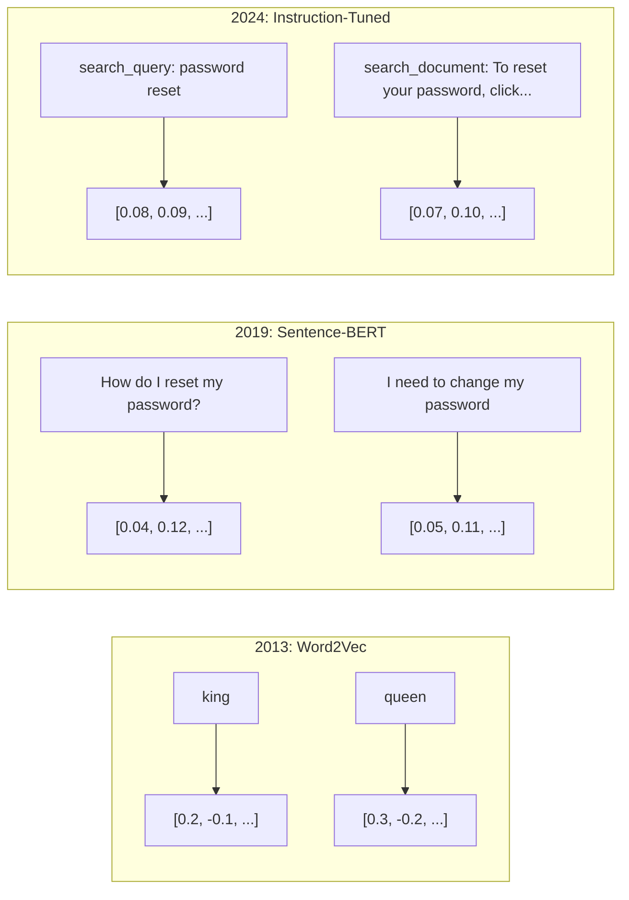
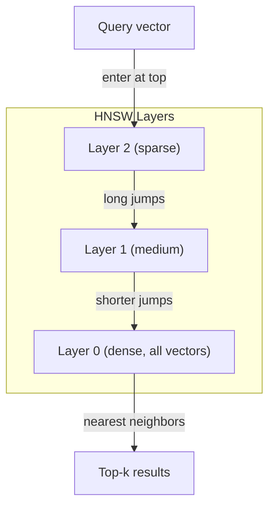
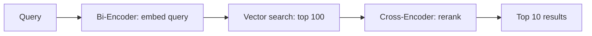

# Osadzenia i reprezentacje wektorowe

> Tekst jest dyskretny. Matematyka jest ciągła. Za każdym razem, gdy prosisz LLM o znalezienie „podobnych” dokumentów, porównanie znaczeń lub wyszukiwanie wykraczające poza słowa kluczowe, polegasz na pomoście między tymi dwoma światami. Ten mostek to osadzenie. Jeśli nie rozumiesz osadzania, nie rozumiesz współczesnej sztucznej inteligencji. Po prostu go używasz.

**Typ:** Kompilacja
**Języki:** Python
**Wymagania wstępne:** Faza 11, lekcja 01 (szybka inżynieria)
**Czas:** ~75 minut
**Powiązane:** Faza 5 · 22 (Dokładne zanurzenie modeli w osadzaniu) obejmuje gęste, rzadkie i wielowektorowe, obcięcie Matryoshki i wybór modelu według osi. Ta lekcja skupia się na rurociągu produkcyjnym (wektorowe bazy danych, HNSW, matematyka podobieństwa). Przeczytaj Fazę 5 · 22 zanim wybierzesz model.

## Cele nauczania

- Generuj osadzanie tekstu przy użyciu dostawców API i modeli open source oraz obliczaj podobieństwo cosinus między nimi
- Wyjaśnij, dlaczego osadzanie rozwiązuje problem niedopasowania słownictwa, z którym nie radzi sobie wyszukiwanie słów kluczowych
- Zbuduj indeks wyszukiwania semantycznego, który wyszukuje dokumenty na podstawie znaczenia, a nie dokładnego dopasowania słowa kluczowego
- Oceń jakość osadzania za pomocą testów porównawczych pobierania (precyzja @ k, przypomnienie) i wybierz odpowiedni model osadzania dla swojego zadania

## Problem

Masz 10 000 zgłoszeń do pomocy technicznej. Klient pisze: „Moja płatność nie została zrealizowana”. Musisz znaleźć podobne bilety z przeszłości. Wyszukiwanie według słów kluczowych pozwala znaleźć bilety zawierające słowa „płatność” i „nie zrealizowane”. Brakuje komunikatów „transakcja nie powiodła się”, „odrzucono obciążenie” i „błąd w rozliczeniu”. Bilety te opisują dokładnie ten sam problem, używając zupełnie innych słów.

To jest problem niedopasowania słownictwa. W języku ludzkim można wyrazić to samo na dziesiątki sposobów. Wyszukiwanie słów kluczowych traktuje każde słowo jako niezależny symbol bez znaczenia. Nie może wiedzieć, że „odrzucił” i „nie przeszedł” odnoszą się do tego samego pojęcia.

Potrzebujesz reprezentacji tekstu, w której znaczenie, a nie pisownia, określa podobieństwo. Potrzebujesz sposobu, aby umieścić komunikaty „moja płatność nie została zrealizowana” i „transakcja odrzucona” blisko siebie w jakiejś przestrzeni matematycznej, jednocześnie odpychając komunikat „moja płatność dotarła na czas” daleko dalej, pomimo wspólnego słowa „płatność”.

Ta reprezentacja jest osadzeniem.

## Koncepcja

### Co to jest osadzanie?

Osadzanie to gęsty wektor liczb zmiennoprzecinkowych, który reprezentuje znaczenie tekstu. Słowo „gęsty” ma znaczenie – każdy wymiar niesie informację, w przeciwieństwie do rzadkich reprezentacji (zbiór słów, TF-IDF), gdzie większość wymiarów wynosi zero.

„Kot usiadł na macie” przypomina mniej więcej `[0.023, -0.041, 0.087, ..., 0.012]` — listę od 768 do 3072 liczb w zależności od modelu. Liczby te kodują znaczenie. Nigdy nie sprawdzasz ich bezpośrednio. Porównujesz je.

### Przełom w Word2Vec

W 2013 roku Tomas Mikolov i współpracownicy Google opublikowali Word2Vec. Podstawowa wiedza: naucz sieć neuronową przewidywania słowa od sąsiadów (lub sąsiadów od słowa), a wagi warstw ukrytych staną się znaczącymi reprezentacjami wektorowymi.

Słynny wynik:

```
king - man + woman = queen
```

Arytmetyka wektorowa osadzania słów rejestruje relacje semantyczne. Kierunek od „mężczyzny” do „kobiety” jest mniej więcej taki sam, jak kierunek od „króla” do „królowej”. To był moment, w którym naukowcy zdali sobie sprawę, że geometria może kodować znaczenie.

Word2Vec stworzył 300-wymiarowe wektory. Każde słowo ma jeden wektor niezależnie od kontekstu. „Bank” w „brzegu rzeki” i „koncie bankowym” miał takie samo osadzenie. To ograniczenie napędzało następną dekadę badań.

### Od słów do zdań

Osadzanie słów reprezentuje pojedyncze tokeny. Systemy produkcyjne muszą osadzać całe zdania, akapity lub dokumenty. Pojawiły się cztery podejścia:

**Uśrednianie**: weź średnią ze wszystkich wektorów słów w zdaniu. Tani, stratny, zaskakująco przyzwoity jak na krótki tekst. Całkowicie traci porządek słów – „pies gryzie człowieka” i „człowiek gryzie psa” mają identyczne osadzenie.

**Token CLS**: modele transformatorów (BERT, 2018) generują specjalny osadzony token [CLS], który reprezentuje całe wejście. Lepsze niż uśrednianie, ale token [CLS] został przeszkolony pod kątem przewidywania następnego zdania, a nie podobieństwa.

**Uczenie się kontrastywne**: wyraźnie trenuj model, aby łączyć podobne pary i rozdzielać pary różne. Zdanie-BERT (Reimers i Gurevych, 2019) wykorzystało to podejście i stało się podstawą nowoczesnych modeli osadzania. Biorąc pod uwagę „Jak zresetować hasło?” i „Muszę zmienić hasło” – model dowiaduje się, że powinny mieć prawie identyczne wektory.

**Osadzania dostosowane do instrukcji**: najnowsze podejście. Modele takie jak E5 i GTE akceptują przedrostek zadania („search_query:”, „search_document:”), który informuje model, jaki rodzaj osadzania ma wykonać. Dzięki temu jeden model może służyć wielu zadaniom.



### Nowoczesne modele osadzania

Na rynku dostępnych jest kilka opcji klasy produkcyjnej (wyniki MTEB na początek 2026 r., MTEB v2):

| Modelka | Dostawca | Wymiary | MTEB | Kontekst | Koszt / 1 mln tokenów |
|-------|-----|-----------|------|---------|------------------|
| Bliźnięta Osadzanie 2 | Google | 3072 (Matrioszka) | 67,7 (odzyskiwanie) | 8192 | 0,15 $ |
| osadzaj-v4 | Spójne | 1024 (Matrioszka) | 65,2 | 128 tys. | 0,12 $ |
| podróż-4 | AI podróży | 1024/2048 (Matrioszka) | 66,8 | 32 tys. | 0,12 $ |
| osadzanie tekstu-3-duże | OpenAI | 3072 (Matrioszka) | 64,6 | 8192 | 0,13 USD |
| osadzanie tekstu-3-małe | OpenAI | 1536 (Matrioszka) | 62,3 | 8192 | 0,02 $ |
| BGE-M3 | BAAI | 1024 (gęsty+rzadki+ColBERT) | 63,0 wielojęzyczny | 8192 | Waga otwarta |
| Osadzanie Qwen3 | Alibaby | 4096 (Matrioszka) | 66,9 | 32 tys. | Waga otwarta |
| Nomic-embed-v2 | Nomiczny | 768 (Matrioszka) | 63,1 | 8192 | Waga otwarta |

MTEB (Massive Text Embedding Benchmark) v2 obejmuje ponad 100 zadań obejmujących wyszukiwanie, klasyfikację, grupowanie, zmianę rankingu i podsumowywanie. Wyżej jest lepiej. Do 2026 r. modele o otwartej wadze (Qwen3-Embedding, BGE-M3) na większości osi dorównają lub przebiją zamknięte modele hostowane. Gemini Embedding 2 prowadzi do czystego wyszukiwania; Voyage/Cohere prowadzi konkretne dziedziny (finanse, prawo, kodowanie). Przed zatwierdzeniem zawsze sprawdzaj własne zapytania.

### Metryki podobieństwa

Biorąc pod uwagę dwa wektory osadzania, trzy sposoby pomiaru ich podobieństwa:

**Cosinus podobieństwa**: cosinus kąta między dwoma wektorami. Zakres od -1 (przeciwny) do 1 (identyczny kierunek). Ignoruje wielkość — zdanie składające się z 10 słów i dokument zawierający 500 słów może uzyskać ocenę 1,0, jeśli wskazują ten sam kierunek. Jest to wartość domyślna w 90% przypadków użycia.

```
cosine_sim(a, b) = dot(a, b) / (||a|| * ||b||)
```

**Iloczyn skalarny**: surowy iloczyn wewnętrzny dwóch wektorów. Identyczne z podobieństwem cosinus, gdy wektory są znormalizowane (długość jednostkowa). Szybsze obliczenia. Osadzania OpenAI są znormalizowane, więc iloczyn skalarny i cosinus dają tę samą pozycję w rankingu.

```
dot(a, b) = sum(a_i * b_i)
```

**Odległość euklidesowa (L2)**: odległość w linii prostej w przestrzeni wektorowej. Mniejszy = bardziej podobny. Wrażliwy na różnice wielkości. Używaj, gdy liczy się bezwzględna pozycja w przestrzeni, a nie tylko kierunek.

```
L2(a, b) = sqrt(sum((a_i - b_i)^2))
```

Kiedy stosować które:

| Metryczne | Użyj, gdy | Unikaj, gdy |
|--------|----------|------------|
| Cosinus podobieństwo | Porównywanie tekstów o różnej długości; większość zadań wyszukiwania | Wielkość niesie informację |
| Produkt kropkowy | Osadzenia są już znormalizowane; maksymalna prędkość | Wektory mają różną wielkość |
| Odległość euklidesowa | klastrowanie; przestrzenne problemy najbliższego sąsiada | Porównywanie dokumentów o bardzo różnych długościach |

### Bazy danych wektorowych i HNSW

Wyszukiwanie podobieństwa metodą brute-force porównuje zapytanie z każdym zapisanym wektorem. Przy 1 milionie wektorów o 1536 wymiarach, czyli 1,5 miliarda operacji mnożenia i dodawania na zapytanie. Za wolno.

Wektorowe bazy danych rozwiązują ten problem za pomocą algorytmów przybliżonego najbliższego sąsiada (ANN). Dominującym algorytmem jest HNSW (Hierarchical Navigable Small World):

1. Zbuduj wielowarstwowy graf wektorów
2. Górne warstwy są rzadkie – połączenia dalekiego zasięgu pomiędzy odległymi gromadami
3. Dolne warstwy są gęste – drobnoziarniste połączenia pomiędzy pobliskimi wektorami
4. Wyszukiwanie rozpoczyna się od górnej warstwy, zachłannie schodząc w dół w celu udoskonalenia
5. Zwraca przybliżone wyniki top-k w czasie O(log n) zamiast O(n)

HNSW zamienia niewielką utratę dokładności (zwykle 95-99% przypominania) na ogromny wzrost prędkości. Przy 10 milionach wektorów brutalna siła zajmuje sekundy. HNSW zajmuje milisekundy.



Opcje produkcyjne:

| Baza danych | Wpisz | Najlepsze dla | Maksymalna skala |
|---------|------|----------|---------------|
| Szyszka | Zarządzany SaaS | Produkcja bez operacji | Miliardy |
| Tkać | Otwarte źródło | Wyszukiwanie hybrydowe na własnym serwerze | 100M+ |
| Qdrant | Otwarte źródło | Wysoka wydajność, filtrowanie | 100M+ |
| ChromaDB | Wbudowany | Prototypowanie, lokalny programista | 1M |
| pgwektor | Rozszerzenie Postgres | Już używasz Postgres | 10M |
| FAISS | Biblioteka | W trakcie, badania | 1B+ |

### Strategie dzielenia

Dokumenty są zbyt długie, aby można je było osadzić jako pojedyncze wektory. 50-stronicowy plik PDF obejmuje dziesiątki tematów — jego osadzenie staje się średnią wszystkiego, niczym konkretnym. Dokumenty dzielisz na fragmenty i każdą z nich osadzasz.

**Porcjowanie o stałym rozmiarze**: podziel każde N żetonów z nałożeniem M-tokenów. Proste i przewidywalne. Sprawdza się dobrze, gdy dokumenty nie mają przejrzystej struktury. Fragment 512 tokenów z nakładaniem się 50 tokenów: fragment 1 to tokeny 0–511, fragment 2 to tokeny 462–973.

**Podział na podstawie zdań**: podział na granicach zdań, grupowanie zdań aż do osiągnięcia limitu tokenów. Każdy fragment to co najmniej jedno pełne zdanie. Lepsze niż stały rozmiar, ponieważ nigdy nie przecinasz myśli na pół.

**Porcjowanie rekurencyjne**: spróbuj najpierw podzielić na największej granicy (nagłówki sekcji). Jeśli nadal jest za duży, wypróbuj granice akapitów. Następnie granice zdań. Następnie ograniczenia znaków. To jest `RecursiveCharacterTextSplitter` LangChaina i działa dobrze w przypadku korpusów o mieszanym formacie.

**Podział semantyczny**: osadź każde zdanie, a następnie pogrupuj kolejne zdania, których osadzenie jest podobne. Gdy podobieństwo osadzania spadnie poniżej progu, rozpocznij nowy fragment. Drogie (wymaga osadzania każdego zdania osobno), ale tworzy najbardziej spójne fragmenty.

| Strategia | Złożoność | Jakość | Najlepsze dla |
|---------|-----------|---------|----------|
| Stały rozmiar | Niski | Przyzwoity | Tekst niestrukturalny, logi |
| Oparta na zdaniu | Niski | Dobrze | Artykuły, e-maile |
| Rekurencyjne | Średni | Dobrze | Markdown, HTML, dokumenty mieszane |
| Semantyczny | Wysoki | Najlepszy | Krytyczna jakość wyszukiwania |

Optymalny punkt dla większości systemów: fragmenty 256–512 tokenów z nakładaniem się 50 tokenów.

### Bi-enkodery a cross-enkodery

Bi-enkoder osadza zapytanie i dokumenty niezależnie, a następnie porównuje wektory. Szybko — osadzasz zapytanie raz i porównujesz z wcześniej obliczonymi osadzeniami dokumentów. Tego właśnie używasz do odzyskiwania.

Koder krzyżowy traktuje zapytanie i dokument jako pojedyncze dane wejściowe i generuje wynik trafności. Powolny — przetwarza każdą parę zapytanie-dokument w całym modelu. Ale o wiele dokładniejszy, ponieważ może jednocześnie obsługiwać tokeny zapytań i dokumentów.

Schemat produkcji: bi-enkoder pobiera 100 najlepszych kandydatów, cross-enkoder ponownie umieszcza ich w pierwszej dziesiątce. To jest potok pobierania, a następnie ponownego uszeregowania.



Modele rerankingu: Cohere Rerank 3.5 (2 USD za 1000 zapytań), BGE-reranker-v2 (bezpłatny, open source), Jina Reranker v2 (bezpłatny, open source).

### Osadzenia Matrioszki

Tradycyjne osadzanie to zasada „wszystko albo nic”. Wektor o 1536 wymiarach wykorzystuje 1536 elementów zmiennoprzecinkowych. Nie można obciąć do 256 wymiarów bez ponownego szkolenia.

Uczenie się reprezentacji Matrioszki (Kusupati i in., 2022) rozwiązuje ten problem. Model jest szkolony tak, aby pierwsze N ​​wymiarów uchwyciło najważniejsze informacje, niczym rosyjska lalka gniazdująca. Obcięcie osadzonej Matrioszki z 1536 r. do 256 wymiarów powoduje utratę pewnej dokładności, ale pozostaje funkcjonalne.

Text-embedding-3-small i text-embedding-3-large OpenAI obsługują obcinanie Matryoshki za pomocą parametru `dimensions`. Żądanie 256 wymiarów zamiast 1536 zmniejsza ilość miejsca na dane 6-krotnie i powoduje utratę dokładności o około 3-5% w testach porównawczych MTEB.

### Kwantyzacja binarna

Osadzanie 1536-wymiarowe przechowywane jako float32 wykorzystuje 6144 bajtów. Pomnóż przez 10 milionów dokumentów: 61 GB tylko na wektory.

Kwantyzacja binarna konwertuje każdy float na pojedynczy bit: wartości dodatnie stają się 1, wartości ujemne stają się 0. Pamięć spada z 6144 bajtów do 192 bajtów – redukcja 32-krotna. Podobieństwo jest obliczane na podstawie odległości Hamminga (zliczanie różnych bitów), którą procesory mogą wykonać w jednej instrukcji.

Dokładność przy przywracaniu wynosi około 5-10%. Powszechny wzorzec: kwantyzacja binarna w celu przeszukiwania pierwszego przejścia przez miliony wektorów, a następnie ponowne sprawdzenie 1000 najlepszych wektorów o pełnej precyzji. Zapewnia to ponad 95% pełnej precyzji przy 32 razy mniejszej pamięci.

## Zbuduj to

Budujemy od podstaw wyszukiwarkę semantyczną. Brak bazy danych wektorów. Brak zewnętrznego interfejsu API do osadzania. Czysty Python z numpy dla matematyki.

### Krok 1: Porcjowanie tekstu

```python
def chunk_text(text, chunk_size=200, overlap=50):
    words = text.split()
    chunks = []
    start = 0
    while start < len(words):
        end = start + chunk_size
        chunk = " ".join(words[start:end])
        chunks.append(chunk)
        start += chunk_size - overlap
    return chunks

def chunk_by_sentences(text, max_chunk_tokens=200):
    sentences = text.replace("\n", " ").split(".")
    sentences = [s.strip() + "." for s in sentences if s.strip()]
    chunks = []
    current_chunk = []
    current_length = 0
    for sentence in sentences:
        sentence_length = len(sentence.split())
        if current_length + sentence_length > max_chunk_tokens and current_chunk:
            chunks.append(" ".join(current_chunk))
            current_chunk = []
            current_length = 0
        current_chunk.append(sentence)
        current_length += sentence_length
    if current_chunk:
        chunks.append(" ".join(current_chunk))
    return chunks
```

### Krok 2: Tworzenie osadzonych elementów od podstaw

Implementujemy proste gęste osadzanie przy użyciu TF-IDF z normalizacją L2. Nie jest to osadzanie neuronowe, ale podlega tej samej umowie: wejście tekstu, wyjście wektora o stałym rozmiarze, podobne teksty tworzą podobne wektory.

```python
import math
import numpy as np
from collections import Counter

class SimpleEmbedder:
    def __init__(self):
        self.vocab = []
        self.idf = []
        self.word_to_idx = {}

    def fit(self, documents):
        vocab_set = set()
        for doc in documents:
            vocab_set.update(doc.lower().split())
        self.vocab = sorted(vocab_set)
        self.word_to_idx = {w: i for i, w in enumerate(self.vocab)}
        n = len(documents)
        self.idf = np.zeros(len(self.vocab))
        for i, word in enumerate(self.vocab):
            doc_count = sum(1 for doc in documents if word in doc.lower().split())
            self.idf[i] = math.log((n + 1) / (doc_count + 1)) + 1

    def embed(self, text):
        words = text.lower().split()
        count = Counter(words)
        total = len(words) if words else 1
        vec = np.zeros(len(self.vocab))
        for word, freq in count.items():
            if word in self.word_to_idx:
                tf = freq / total
                vec[self.word_to_idx[word]] = tf * self.idf[self.word_to_idx[word]]
        norm = np.linalg.norm(vec)
        if norm > 0:
            vec = vec / norm
        return vec
```

### Krok 3: Funkcje podobieństwa

```python
def cosine_similarity(a, b):
    dot = np.dot(a, b)
    norm_a = np.linalg.norm(a)
    norm_b = np.linalg.norm(b)
    if norm_a == 0 or norm_b == 0:
        return 0.0
    return float(dot / (norm_a * norm_b))

def dot_product(a, b):
    return float(np.dot(a, b))

def euclidean_distance(a, b):
    return float(np.linalg.norm(a - b))
```

### Krok 4: Indeks wektorowy z wyszukiwaniem metodą brute-force

```python
class VectorIndex:
    def __init__(self):
        self.vectors = []
        self.texts = []
        self.metadata = []

    def add(self, vector, text, meta=None):
        self.vectors.append(vector)
        self.texts.append(text)
        self.metadata.append(meta or {})

    def search(self, query_vector, top_k=5, metric="cosine"):
        scores = []
        for i, vec in enumerate(self.vectors):
            if metric == "cosine":
                score = cosine_similarity(query_vector, vec)
            elif metric == "dot":
                score = dot_product(query_vector, vec)
            elif metric == "euclidean":
                score = -euclidean_distance(query_vector, vec)
            else:
                raise ValueError(f"Unknown metric: {metric}")
            scores.append((i, score))
        scores.sort(key=lambda x: x[1], reverse=True)
        results = []
        for idx, score in scores[:top_k]:
            results.append({
                "text": self.texts[idx],
                "score": score,
                "metadata": self.metadata[idx],
                "index": idx
            })
        return results

    def size(self):
        return len(self.vectors)
```

### Krok 5: Wyszukiwarka semantyczna

```python
class SemanticSearchEngine:
    def __init__(self, chunk_size=200, overlap=50):
        self.embedder = SimpleEmbedder()
        self.index = VectorIndex()
        self.chunk_size = chunk_size
        self.overlap = overlap

    def index_documents(self, documents, source_names=None):
        all_chunks = []
        all_sources = []
        for i, doc in enumerate(documents):
            chunks = chunk_text(doc, self.chunk_size, self.overlap)
            all_chunks.extend(chunks)
            name = source_names[i] if source_names else f"doc_{i}"
            all_sources.extend([name] * len(chunks))
        self.embedder.fit(all_chunks)
        for chunk, source in zip(all_chunks, all_sources):
            vec = self.embedder.embed(chunk)
            self.index.add(vec, chunk, {"source": source})
        return len(all_chunks)

    def search(self, query, top_k=5, metric="cosine"):
        query_vec = self.embedder.embed(query)
        return self.index.search(query_vec, top_k, metric)

    def search_with_scores(self, query, top_k=5):
        results = self.search(query, top_k)
        return [
            {
                "text": r["text"][:200],
                "source": r["metadata"].get("source", "unknown"),
                "score": round(r["score"], 4)
            }
            for r in results
        ]
```

### Krok 6: Porównanie metryk podobieństwa

```python
def compare_metrics(engine, query, top_k=3):
    results = {}
    for metric in ["cosine", "dot", "euclidean"]:
        hits = engine.search(query, top_k=top_k, metric=metric)
        results[metric] = [
            {"score": round(h["score"], 4), "preview": h["text"][:80]}
            for h in hits
        ]
    return results
```

## Użyj tego

Dzięki produkcyjnemu interfejsowi API do osadzania architektura pozostaje identyczna. Zmienia się tylko embeder:

```python
from openai import OpenAI

client = OpenAI()

def openai_embed(texts, model="text-embedding-3-small", dimensions=None):
    kwargs = {"model": model, "input": texts}
    if dimensions:
        kwargs["dimensions"] = dimensions
    response = client.embeddings.create(**kwargs)
    return [item.embedding for item in response.data]
```

Obcięcie Matryoshki za pomocą OpenAI - ten sam model, mniej wymiarów, mniej miejsca do przechowywania:

```python
full = openai_embed(["semantic search query"], dimensions=1536)
compact = openai_embed(["semantic search query"], dimensions=256)
```

Wektor 256-d zużywa 6 razy mniej pamięci. Dla 10 milionów dokumentów czyli 10 GB vs 61 GB. Strata dokładności wynosi około 3-5% w przypadku standardowych testów porównawczych.

Aby zmienić ranking w Cohere:

```python
import cohere

co = cohere.ClientV2()

results = co.rerank(
    model="rerank-v3.5",
    query="What is the refund policy?",
    documents=["Full refund within 30 days...", "No refunds after 90 days..."],
    top_n=3
)
```

W przypadku osadzania lokalnego bez zależności od interfejsu API:

```python
from sentence_transformers import SentenceTransformer

model = SentenceTransformer("BAAI/bge-small-en-v1.5")
embeddings = model.encode(["semantic search query", "another document"])
```

Klasa VectorIndex z naszej kompilacji działa z każdym z nich. Zamień funkcję osadzania, zachowaj logikę wyszukiwania.

## Wyślij to

Ta lekcja daje:
- `outputs/prompt-embedding-advisor.md` – monit o wybranie modeli osadzania i strategii dla konkretnych przypadków użycia
- `outputs/skill-embedding-patterns.md` – umiejętność ucząca agentów efektywnego wykorzystania osadzania w środowisku produkcyjnym

## Ćwiczenia

1. **Porównanie metryczne**: wykonaj te same 5 zapytań względem przykładowych dokumentów, używając podobieństwa cosinus, iloczynu skalarnego i odległości euklidesowej. Zapisz 3 najlepsze wyniki dla każdego. W przypadku jakich zapytań dane się nie zgadzają? Dlaczego?

2. **Eksperyment z wielkością porcji**: indeksuj przykładowe dokumenty za pomocą fragmentów o wielkości 50, 100, 200 i 500 słów. Dla każdego wykonaj 5 zapytań i zapisz 1 najwyższy wynik podobieństwa. Wykreśl zależność pomiędzy rozmiarem porcji a jakością wyszukiwania. Znajdź punkt, w którym większe kawałki zaczynają boleć.

3. **Symulacja Matrioszki**: zbuduj SimpleEmbedder, który generuje wektory 500-d. Obetnij do wymiarów 50, 100, 200 i 500. Zmierz, jak pogarsza się przypominanie o pobieraniu przy każdym skróceniu. To symuluje zachowanie Matrioszki bez konieczności stosowania prawdziwej sztuczki szkoleniowej.

4. **Kwantyzacja binarna**: pobierz osady z wyszukiwarki, przekonwertuj je na binarne (1 jeśli dodatnie, 0 jeśli ujemne) i zaimplementuj wyszukiwanie na odległość Hamminga. Porównaj 10 najlepszych wyników z pełnym podobieństwem cosinusa. Zmierz procent nakładania się.

5. **Podział na podstawie zdań**: zamień fragmentację o stałym rozmiarze na `chunk_by_sentences`. Uruchom te same zapytania i porównaj wyniki wyszukiwania. Czy przestrzeganie granic zdań poprawia wyniki?

## Kluczowe terminy

| Termin | Co ludzie mówią | Co to właściwie oznacza |
|------|----------------|----------------------|
| Osadzanie | „Tekst na liczby” | Gęsty wektor, w którym bliskość geometryczna koduje podobieństwo semantyczne |
| Word2Vec | „Osadzanie OG” | Model z 2013 r., który uczył się wektorów słów poprzez przewidywanie słów kontekstu; udowodniona arytmetyka wektorowa koduje znaczenie |
| Cosinus podobieństwo | „Jak podobne są dwa wektory” | Cosinus kąta między wektorami; 1 = identyczny kierunek, 0 = ortogonalny, -1 = przeciwny |
| HNSW | „Szybkie wyszukiwanie wektorów” | Hierarchiczny graf żeglowny małego świata - struktura wielowarstwowa umożliwiająca przybliżone wyszukiwanie najbliższego sąsiada metodą O(log n) |
| Bi-enkoder | „Osadź osobno, porównaj szybko” | Koduje zapytania i dokumenty niezależnie w wektorach; umożliwia wstępne obliczenia i szybkie wyszukiwanie |
| Koder krzyżowy | „Powolny, ale dokładny ranking” | Przetwarza parę zapytań i dokumentów łącznie w całym modelu; większa dokładność, bez obliczeń wstępnych |
| Osadzenia Matrioszki | „Wektory obcinane” | Osadzania trenowane tak, aby pierwsze N ​​wymiarów przechwytywało najważniejsze informacje, umożliwiając przechowywanie o zmiennym rozmiarze |
| Kwantyzacja binarna | „Osadzanie 1-bitowe” | Konwersja wektorów zmiennoprzecinkowych na binarny (tylko bit znaku) w celu 32-krotnej redukcji pamięci za pomocą wyszukiwania odległości Hamminga |
| Kawałki | „Podziel dokumenty do osadzania” | Dzielenie dokumentów na segmenty o długości 256–512 tokenów, dzięki czemu każdy z nich może być niezależnie osadzany i pobierany |
| Baza danych wektorowych | "Wyszukiwarka osadzania" | Magazyn danych zoptymalizowany do przechowywania wektorów i wykonywania przybliżonego wyszukiwania najbliższego sąsiada na dużą skalę |
| Kontrastowe uczenie się | „Pociąg przez porównanie” | Podejście szkoleniowe, które łączy podobne osadzania par i od siebie różne osadzania par |
| MTEB | „Wzór osadzania” | Test porównawczy osadzania ogromnego tekstu — 56 zestawów danych w 8 zadaniach; standard porównywania modeli osadzania |

## Dalsze czytanie

– Mikolov i in., „Efficient Estimation of Word Representations in Vector Space” (2013) – artykuł Word2Vec, który zapoczątkował rewolucję osadzania poprzez analogię króla i królowej
– Reimers i Gurevych, „Sentence-BERT: Sentence Embeddings using Siamese BERT-Networks” (2019) – jak trenować bi-enkodery pod kątem podobieństwa na poziomie zdań, podstawy nowoczesnych modeli osadzania
– Kusupati i in., „Matryoshka Representation Learning” (2022) — technika kryjąca się za osadzaniem o zmiennym wymiarze, którą OpenAI przyjęła do osadzania tekstu-3
– Malkov i Yashunin, „Efficient and Robust Approximate Nearest Neighbor using Hierarchical Navigable Small World Graphs” (2018) – artykuł HNSW, algorytm stojący za większością przeszukiwań wektorów produkcyjnych
- Przewodnik po osadzaniu OpenAI (platform.openai.com/docs/guides/embeddings) - praktyczne informacje na temat modeli osadzania tekstu-3, w tym redukcji wymiarów Matrioszki
- Tablica liderów MTEB (huggingface.co/spaces/mteb/leaderboard) - test porównawczy na żywo porównujący wszystkie modele osadzania w różnych zadaniach i językach
- [Muennighoff i in., „MTEB: Massive Text Embedding Benchmark” (EACL 2023)](https://arxiv.org/abs/2210.07316) – benchmark definiujący 8 kategorii zadań (klasyfikacja, grupowanie, klasyfikacja par, reranking, pobieranie, STS, podsumowanie, eksploracja bittekstu), które raportuje tabela liderów; przeczytaj zanim zaufasz jakiemukolwiek pojedynczemu wynikowi MTEB.
- [Dokumentacja Sentence Transformers](https://www.sbert.net/) - kanoniczne odniesienie do bi-enkodera i cross-enkodera, strategii łączenia i potoku RAG ingest-split-embed-store implementowanego w tej lekcji.