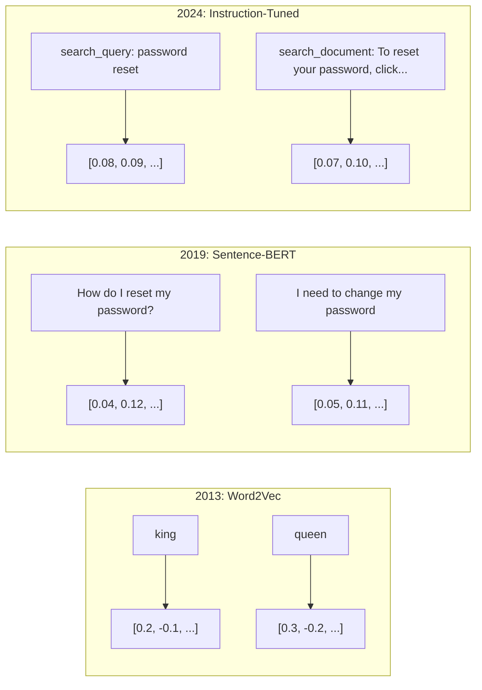
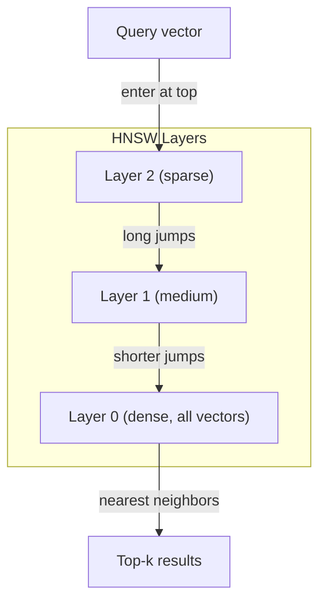

# Osadzenia i reprezentacje wektorowe

> Tekst jest dyskretny. Matematyka jest ciągła. Kiedy prosisz LLM o znalezienie „podobnych" dokumentów, porównanie znaczeń lub wyszukiwanie wykraczające poza słowa kluczowe — polegasz na pomoście między tymi dwoma światami. Tym pomostem jest osadzenie. Jeśli nie rozumiesz osadzeń, nie rozumiesz współczesnej sztucznej inteligencji. Po prostu z nich korzystasz.

**Typ:** Kompilacja
**Języki:** Python
**Wymagania wstępne:** Faza 11, lekcja 01 (inżynieria promptów)
**Czas:** ~75 minut
**Powiązane:** Faza 5 · 22 (Dogłębne omówienie modeli osadzania) obejmuje reprezentacje gęste, rzadkie i wielowektorowe, obcinanie Matryoshki oraz wybór modelu według różnych kryteriów. Niniejsza lekcja skupia się na potoku produkcyjnym (wektorowe bazy danych, HNSW, matematyka podobieństwa). Przed wyborem modelu przeczytaj Fazę 5 · 22.

## Cele nauczania

- Generuj osadzenia tekstu przy użyciu dostawców API i modeli open source oraz obliczaj między nimi podobieństwo cosinusowe
- Wyjaśnij, dlaczego osadzenia rozwiązują problem niedopasowania słownictwa, z którym nie radzi sobie wyszukiwanie słów kluczowych
- Zbuduj indeks wyszukiwania semantycznego, który odnajduje dokumenty na podstawie znaczenia, a nie dokładnego dopasowania słów kluczowych
- Oceń jakość osadzeń za pomocą testów porównawczych wyszukiwania (precyzja @ k, pełność) i dobierz odpowiedni model osadzania do swojego zadania

## Problem

Masz 10 000 zgłoszeń do pomocy technicznej. Klient pisze: „Moja płatność nie została zrealizowana". Musisz znaleźć podobne zgłoszenia z przeszłości. Wyszukiwanie słów kluczowych zwróci tylko bilety zawierające słowa „płatność" i „nie zrealizowane". Pominie komunikaty takie jak „transakcja nie powiodła się", „odrzucono obciążenie" czy „błąd w rozliczeniu" — mimo że opisują dokładnie ten sam problem, tyle że innymi słowami.

To właśnie jest problem niedopasowania słownictwa. W języku naturalnym tę samą myśl można wyrazić na dziesiątki sposobów. Wyszukiwanie słów kluczowych traktuje każde słowo jako niezależny symbol pozbawiony znaczenia — nie jest w stanie stwierdzić, że „odrzucił" i „nie przeszedł" odnoszą się do tego samego pojęcia.

Potrzebna jest reprezentacja tekstu, w której to znaczenie — a nie pisownia — decyduje o podobieństwie. Chodzi o umieszczenie fraz „moja płatność nie została zrealizowana" i „transakcja odrzucona" blisko siebie w przestrzeni matematycznej, przy jednoczesnym odsunięciu frazy „moja płatność dotarła na czas" — pomimo wspólnego słowa „płatność".

Taką reprezentacją jest właśnie osadzenie.

## Koncepcja

### Czym jest osadzenie?

Osadzenie to gęsty wektor liczb zmiennoprzecinkowych reprezentujący znaczenie tekstu. Słowo „gęsty" jest tu kluczowe — każdy wymiar niesie informację, w odróżnieniu od reprezentacji rzadkich (bag of words, TF-IDF), gdzie większość wymiarów przyjmuje wartość zero.

Zdanie „Kot usiadł na macie" wygląda mniej więcej tak: `[0.023, -0.041, 0.087, ..., 0.012]` — lista od 768 do 3072 liczb, zależnie od modelu. Liczby te kodują znaczenie. Nigdy nie analizuje się ich bezpośrednio — porównuje się je ze sobą.

### Przełom Word2Vec

W 2013 roku Tomas Mikolov i współpracownicy z Google opublikowali Word2Vec. Główna idea: wyucz sieć neuronową przewidywania słowa na podstawie jego sąsiadów (lub odwrotnie), a wagi warstw ukrytych staną się znaczącymi reprezentacjami wektorowymi.

Słynny przykład:

```
king - man + woman = queen
```

Arytmetyka wektorowa na osadzeniach słów oddaje relacje semantyczne. Kierunek od „mężczyzny" do „kobiety" jest zbliżony do kierunku od „króla" do „królowej". To był moment, w którym naukowcy uświadomili sobie, że geometria może kodować znaczenie.

Word2Vec tworzył 300-wymiarowe wektory, przy czym każde słowo miało jeden wektor niezależnie od kontekstu. Słowo „bank" w wyrażeniu „brzeg rzeki" i w wyrażeniu „konto bankowe" otrzymywało identyczne osadzenie. To ograniczenie napędzało kolejną dekadę badań.

### Od słów do zdań

Osadzenia słów reprezentują pojedyncze tokeny. Systemy produkcyjne wymagają jednak osadzania całych zdań, akapitów lub dokumentów. Wypracowano cztery podejścia:

**Uśrednianie**: oblicz średnią ze wszystkich wektorów słów w zdaniu. Proste, stratne, zaskakująco przyzwoite dla krótkich tekstów. Całkowicie ignoruje kolejność słów — „pies gryzie człowieka" i „człowiek gryzie psa" otrzymują identyczne osadzenie.

**Token CLS**: modele transformatorowe (BERT, 2018) generują specjalny token [CLS], którego osadzenie reprezentuje całe wejście. Lepsze niż uśrednianie, jednak token [CLS] był trenowany pod kątem przewidywania następnego zdania, a nie podobieństwa.

**Uczenie kontrastywne**: model jest jawnie trenowany tak, aby zbliżał wektory podobnych par i oddalał pary różniące się znaczeniem. Sentence-BERT (Reimers i Gurevych, 2019) zastosował to podejście i stał się podstawą nowoczesnych modeli osadzania. Dla par takich jak „Jak zresetować hasło?" i „Muszę zmienić hasło" model uczy się, że powinny mieć prawie identyczne wektory.

**Osadzenia dostrajane instrukcjami**: najnowsze podejście. Modele takie jak E5 i GTE przyjmują przedrostek zadania („search_query:", „search_document:"), który informuje model o rodzaju wykonywanego osadzenia. Dzięki temu jeden model może obsługiwać wiele zadań.



### Nowoczesne modele osadzania

Na rynku dostępnych jest kilka opcji klasy produkcyjnej (wyniki MTEB na początku 2026 r., MTEB v2):

| Model | Dostawca | Wymiary | MTEB | Kontekst | Koszt / 1 mln tokenów |
|-------|-----|-----------|------|---------|------------------|
| Gemini Embedding 2 | Google | 3072 (Matryoshka) | 67,7 (wyszukiwanie) | 8192 | 0,15 $ |
| embed-v4 | Cohere | 1024 (Matryoshka) | 65,2 | 128 tys. | 0,12 $ |
| voyage-4 | Voyage AI | 1024/2048 (Matryoshka) | 66,8 | 32 tys. | 0,12 $ |
| text-embedding-3-large | OpenAI | 3072 (Matryoshka) | 64,6 | 8192 | 0,13 $ |
| text-embedding-3-small | OpenAI | 1536 (Matryoshka) | 62,3 | 8192 | 0,02 $ |
| BGE-M3 | BAAI | 1024 (gęsty+rzadki+ColBERT) | 63,0 wielojęzyczny | 8192 | open weights |
| Qwen3-Embedding | Alibaba | 4096 (Matryoshka) | 66,9 | 32 tys. | open weights |
| nomic-embed-v2 | Nomic | 768 (Matryoshka) | 63,1 | 8192 | open weights |

MTEB (Massive Text Embedding Benchmark) v2 obejmuje ponad 100 zadań z zakresu wyszukiwania, klasyfikacji, grupowania, rerankingu i podsumowywania — im wyższy wynik, tym lepiej. Do 2026 roku modele z otwartymi wagami (Qwen3-Embedding, BGE-M3) w większości kategorii dorównują modelom zamkniętym lub je przewyższają. Gemini Embedding 2 wiedzie prym w czystym wyszukiwaniu; Voyage i Cohere sprawdzają się w konkretnych dziedzinach (finanse, prawo, programowanie). Przed ostatecznym wyborem zawsze weryfikuj model na własnych zapytaniach.

### Miary podobieństwa

Dla dwóch wektorów osadzeń istnieją trzy sposoby pomiaru ich podobieństwa:

**Podobieństwo cosinusowe**: cosinus kąta między dwoma wektorami. Wartość z zakresu od -1 (wektory przeciwne) do 1 (identyczny kierunek). Ignoruje długość wektorów — zdanie złożone z 10 słów i dokument zawierający 500 słów mogą uzyskać wynik 1,0, jeśli wskazują ten sam kierunek. To domyślny wybór w 90% zastosowań.

```
cosine_sim(a, b) = dot(a, b) / (||a|| * ||b||)
```

**Iloczyn skalarny**: surowy iloczyn wewnętrzny dwóch wektorów. Pokrywa się z podobieństwem cosinusowym, gdy wektory są znormalizowane (długość jednostkowa). Zapewnia szybsze obliczenia. Osadzenia OpenAI są znormalizowane, więc iloczyn skalarny i cosinus dają identyczny ranking.

```
dot(a, b) = sum(a_i * b_i)
```

**Odległość euklidesowa (L2)**: odległość w linii prostej w przestrzeni wektorowej. Im mniejsza wartość, tym większe podobieństwo. Wrażliwa na różnice długości wektorów. Stosuj wtedy, gdy liczy się bezwzględne położenie w przestrzeni, a nie tylko kierunek.

```
L2(a, b) = sqrt(sum((a_i - b_i)^2))
```

Kiedy stosować którą miarę:

| Metryka | Stosuj, gdy | Unikaj, gdy |
|--------|----------|------------|
| Podobieństwo cosinusowe | Porównujesz teksty o różnej długości; większość zadań wyszukiwania | Długość wektora niesie istotną informację |
| Iloczyn skalarny | Osadzenia są już znormalizowane; zależy Ci na maksymalnej szybkości | Wektory mają różne długości |
| Odległość euklidesowa | Grupowanie; zadania przestrzennego wyszukiwania najbliższego sąsiada | Porównywanie dokumentów o bardzo różnej długości |

### Wektorowe bazy danych i HNSW

Wyszukiwanie podobieństwa metodą brute-force polega na porównaniu zapytania z każdym zapisanym wektorem. Przy milionie wektorów o 1536 wymiarach oznacza to 1,5 miliarda operacji mnożenia i dodawania na zapytanie — zbyt wolno jak na zastosowania produkcyjne.

Wektorowe bazy danych rozwiązują ten problem za pomocą algorytmów przybliżonego wyszukiwania najbliższego sąsiada (ANN). Dominującym algorytmem jest HNSW (Hierarchical Navigable Small World):

1. Zbuduj wielowarstwowy graf wektorów
2. Górne warstwy są rzadkie — zawierają połączenia dalekiego zasięgu między odległymi skupiskami
3. Dolne warstwy są gęste — łączą wektory leżące blisko siebie
4. Wyszukiwanie rozpoczyna się od górnej warstwy, zachłannie schodząc w dół w celu coraz dokładniejszego przybliżenia
5. Zwraca przybliżone wyniki top-k w czasie O(log n) zamiast O(n)

HNSW wymienia niewielką utratę dokładności (zazwyczaj 95–99% pełności) na ogromny wzrost szybkości. Dla 10 milionów wektorów metoda brute-force zajmuje sekundy, HNSW — milisekundy.



Opcje produkcyjne:

| Baza danych | Typ | Najlepsze zastosowanie | Maksymalna skala |
|---------|------|----------|---------------|
| Pinecone | Zarządzany SaaS | Produkcja bez konieczności administracji | Miliardy |
| Weaviate | Open source | Wyszukiwanie hybrydowe na własnym serwerze | 100M+ |
| Qdrant | Open source | Wysoka wydajność, zaawansowane filtrowanie | 100M+ |
| ChromaDB | Wbudowany | Prototypowanie, lokalny developer | 1M |
| pgvector | Rozszerzenie Postgres | Gdy już korzystasz z Postgres | 10M |
| FAISS | Biblioteka | Przetwarzanie wsadowe, badania | 1B+ |

### Strategie podziału na fragmenty

Dokumenty są zbyt długie, aby osadzać je jako pojedyncze wektory. Pięćdziesięciostronicowy plik PDF obejmuje dziesiątki tematów — jego osadzenie staje się uśrednioną reprezentacją wszystkiego, a przez to niczego konkretnego. Dlatego dokumenty dzieli się na fragmenty i każdy z nich osadza osobno.

**Podział na fragmenty o stałym rozmiarze**: podziel tekst na N tokenów z nałożeniem M tokenów. Proste i przewidywalne, sprawdza się dobrze, gdy dokumenty nie mają wyraźnej struktury. Fragment 512 tokenów z nałożeniem 50 tokenów: fragment 1 to tokeny 0–511, fragment 2 to tokeny 462–973.

**Podział na podstawie zdań**: podział na granicach zdań z grupowaniem kolejnych zdań do osiągnięcia limitu tokenów. Każdy fragment zawiera co najmniej jedno pełne zdanie. Lepsze od podziału o stałym rozmiarze, bo nie przecina myśli w połowie.

**Podział rekurencyjny**: najpierw próbuj dzielić na największych granicach (nagłówki sekcji). Jeśli fragment nadal jest za duży, przejdź do granic akapitów, potem zdań, a na końcu do limitów znakowych. To właśnie robi `RecursiveCharacterTextSplitter` z LangChain — sprawdza się dobrze na korpusach o mieszanym formacie.

**Podział semantyczny**: osadź każde zdanie, a następnie grupuj kolejne zdania o podobnych osadzeniach. Gdy podobieństwo spada poniżej progu, rozpocznij nowy fragment. Kosztowna metoda (wymaga osadzenia każdego zdania z osobna), ale tworzy najbardziej spójne fragmenty.

| Strategia | Złożoność | Jakość | Najlepsze zastosowanie |
|---------|-----------|---------|----------|
| Stały rozmiar | Niska | Przyzwoita | Tekst niestrukturyzowany, logi |
| Na podstawie zdań | Niska | Dobra | Artykuły, e-maile |
| Rekurencyjna | Średnia | Dobra | Markdown, HTML, dokumenty mieszane |
| Semantyczna | Wysoka | Najlepsza | Gdy jakość wyszukiwania jest priorytetem |

Optymalny punkt dla większości systemów: fragmenty 256–512 tokenów z nałożeniem 50 tokenów.

### Bi-enkodery a cross-enkodery

Bi-enkoder osadza zapytanie i dokumenty niezależnie, a następnie porównuje wektory. Jest szybki — osadzasz zapytanie raz i zestawiasz z wcześniej wyliczonymi osadzeniami dokumentów. To podejście stosuje się podczas wyszukiwania.

Cross-enkoder przyjmuje zapytanie i dokument jako jedno wspólne wejście i wyznacza wynik trafności. Jest wolniejszy — przetwarza każdą parę zapytanie-dokument przez cały model. Jednak znacznie dokładniejszy, ponieważ może jednocześnie analizować tokeny zapytania i dokumentu.

Wzorzec produkcyjny: bi-enkoder wyszukuje 100 najlepszych kandydatów, cross-enkoder ponownie je szereguje i zwraca dziesiątkę. Jest to potok wyszukiwania z następującym po nim rerankowaniem.


Modele rerankujące: Cohere Rerank 3.5 (2 USD za 1000 zapytań), BGE-reranker-v2 (bezpłatny, open source), Jina Reranker v2 (bezpłatny, open source).

### Osadzenia Matryoshki

Tradycyjne osadzenia działają na zasadzie „wszystko albo nic". Wektor o 1536 wymiarach wymaga przechowywania 1536 liczb zmiennoprzecinkowych — nie można go skrócić do 256 wymiarów bez ponownego trenowania modelu.

Matryoshka Representation Learning (Kusupati i in., 2022) rozwiązuje ten problem. Model jest trenowany tak, by pierwsze N wymiarów zawierało najważniejsze informacje — niczym rosyjska lalka gniazdująca. Skrócenie osadzenia Matryoshki z 1536 do 256 wymiarów wiąże się z pewną utratą dokładności, ale reprezentacja pozostaje użyteczna.

Modele text-embedding-3-small i text-embedding-3-large OpenAI obsługują obcinanie Matryoshki za pomocą parametru `dimensions`. Żądanie 256 zamiast 1536 wymiarów zmniejsza zapotrzebowanie na pamięć sześciokrotnie i powoduje utratę dokładności rzędu 3–5% według testów MTEB.

### Kwantyzacja binarna

Osadzenie o 1536 wymiarach przechowywane jako float32 zajmuje 6144 bajty. Dla 10 milionów dokumentów daje to 61 GB samych wektorów.

Kwantyzacja binarna zamienia każdą liczbę zmiennoprzecinkową na jeden bit: wartości dodatnie stają się 1, ujemne — 0. Pamięć spada z 6144 do 192 bajtów, czyli 32-krotnie. Podobieństwo oblicza się na podstawie odległości Hamminga (zliczanie różniących się bitów), którą procesory wykonują w jednej instrukcji.

Spadek dokładności wyszukiwania wynosi około 5–10%. Popularny wzorzec: kwantyzacja binarna przy pierwszym przeszukaniu milionów wektorów, a następnie pełnoprecyzyjna weryfikacja tysiąca najlepszych wyników. Zapewnia to ponad 95% skuteczności pełnej precyzji przy 32-krotnie mniejszym zużyciu pamięci.

## Zbuduj to

Budujemy od podstaw wyszukiwarkę semantyczną. Bez wektorowej bazy danych, bez zewnętrznego API do osadzania — czysty Python z numpy do obliczeń matematycznych.

### Krok 1: Podział tekstu na fragmenty

```python
def chunk_text(text, chunk_size=200, overlap=50):
    words = text.split()
    chunks = []
    start = 0
    while start < len(words):
        end = start + chunk_size
        chunk = " ".join(words[start:end])
        chunks.append(chunk)
        start += chunk_size - overlap
    return chunks

def chunk_by_sentences(text, max_chunk_tokens=200):
    sentences = text.replace("\n", " ").split(".")
    sentences = [s.strip() + "." for s in sentences if s.strip()]
    chunks = []
    current_chunk = []
    current_length = 0
    for sentence in sentences:
        sentence_length = len(sentence.split())
        if current_length + sentence_length > max_chunk_tokens and current_chunk:
            chunks.append(" ".join(current_chunk))
            current_chunk = []
            current_length = 0
        current_chunk.append(sentence)
        current_length += sentence_length
    if current_chunk:
        chunks.append(" ".join(current_chunk))
    return chunks
```

### Krok 2: Budowanie osadzeń od podstaw

Implementujemy proste gęste osadzenie z użyciem TF-IDF z normalizacją L2. Nie jest to osadzenie neuronowe, ale spełnia tę samą umowę: na wejściu tekst, na wyjściu wektor o stałym rozmiarze, a podobne teksty generują podobne wektory.

```python
import math
import numpy as np
from collections import Counter

class SimpleEmbedder:
    def __init__(self):
        self.vocab = []
        self.idf = []
        self.word_to_idx = {}

    def fit(self, documents):
        vocab_set = set()
        for doc in documents:
            vocab_set.update(doc.lower().split())
        self.vocab = sorted(vocab_set)
        self.word_to_idx = {w: i for i, w in enumerate(self.vocab)}
        n = len(documents)
        self.idf = np.zeros(len(self.vocab))
        for i, word in enumerate(self.vocab):
            doc_count = sum(1 for doc in documents if word in doc.lower().split())
            self.idf[i] = math.log((n + 1) / (doc_count + 1)) + 1

    def embed(self, text):
        words = text.lower().split()
        count = Counter(words)
        total = len(words) if words else 1
        vec = np.zeros(len(self.vocab))
        for word, freq in count.items():
            if word in self.word_to_idx:
                tf = freq / total
                vec[self.word_to_idx[word]] = tf * self.idf[self.word_to_idx[word]]
        norm = np.linalg.norm(vec)
        if norm > 0:
            vec = vec / norm
        return vec
```

### Krok 3: Funkcje podobieństwa

```python
def cosine_similarity(a, b):
    dot = np.dot(a, b)
    norm_a = np.linalg.norm(a)
    norm_b = np.linalg.norm(b)
    if norm_a == 0 or norm_b == 0:
        return 0.0
    return float(dot / (norm_a * norm_b))

def dot_product(a, b):
    return float(np.dot(a, b))

def euclidean_distance(a, b):
    return float(np.linalg.norm(a - b))
```

### Krok 4: Indeks wektorowy z wyszukiwaniem brute-force

```python
class VectorIndex:
    def __init__(self):
        self.vectors = []
        self.texts = []
        self.metadata = []

    def add(self, vector, text, meta=None):
        self.vectors.append(vector)
        self.texts.append(text)
        self.metadata.append(meta or {})

    def search(self, query_vector, top_k=5, metric="cosine"):
        scores = []
        for i, vec in enumerate(self.vectors):
            if metric == "cosine":
                score = cosine_similarity(query_vector, vec)
            elif metric == "dot":
                score = dot_product(query_vector, vec)
            elif metric == "euclidean":
                score = -euclidean_distance(query_vector, vec)
            else:
                raise ValueError(f"Unknown metric: {metric}")
            scores.append((i, score))
        scores.sort(key=lambda x: x[1], reverse=True)
        results = []
        for idx, score in scores[:top_k]:
            results.append({
                "text": self.texts[idx],
                "score": score,
                "metadata": self.metadata[idx],
                "index": idx
            })
        return results

    def size(self):
        return len(self.vectors)
```

### Krok 5: Wyszukiwarka semantyczna

```python
class SemanticSearchEngine:
    def __init__(self, chunk_size=200, overlap=50):
        self.embedder = SimpleEmbedder()
        self.index = VectorIndex()
        self.chunk_size = chunk_size
        self.overlap = overlap

    def index_documents(self, documents, source_names=None):
        all_chunks = []
        all_sources = []
        for i, doc in enumerate(documents):
            chunks = chunk_text(doc, self.chunk_size, self.overlap)
            all_chunks.extend(chunks)
            name = source_names[i] if source_names else f"doc_{i}"
            all_sources.extend([name] * len(chunks))
        self.embedder.fit(all_chunks)
        for chunk, source in zip(all_chunks, all_sources):
            vec = self.embedder.embed(chunk)
            self.index.add(vec, chunk, {"source": source})
        return len(all_chunks)

    def search(self, query, top_k=5, metric="cosine"):
        query_vec = self.embedder.embed(query)
        return self.index.search(query_vec, top_k, metric)

    def search_with_scores(self, query, top_k=5):
        results = self.search(query, top_k)
        return [
            {
                "text": r["text"][:200],
                "source": r["metadata"].get("source", "unknown"),
                "score": round(r["score"], 4)
            }
            for r in results
        ]
```

### Krok 6: Porównanie miar podobieństwa

```python
def compare_metrics(engine, query, top_k=3):
    results = {}
    for metric in ["cosine", "dot", "euclidean"]:
        hits = engine.search(query, top_k=top_k, metric=metric)
        results[metric] = [
            {"score": round(h["score"], 4), "preview": h["text"][:80]}
            for h in hits
        ]
    return results
```

## Użyj tego

Przy produkcyjnym API do osadzania architektura pozostaje identyczna. Zmienia się wyłącznie komponent osadzający:

```python
from openai import OpenAI

client = OpenAI()

def openai_embed(texts, model="text-embedding-3-small", dimensions=None):
    kwargs = {"model": model, "input": texts}
    if dimensions:
        kwargs["dimensions"] = dimensions
    response = client.embeddings.create(**kwargs)
    return [item.embedding for item in response.data]
```

Obcinanie Matryoshki w OpenAI — ten sam model, mniej wymiarów, mniej miejsca w pamięci:

```python
full = openai_embed(["semantic search query"], dimensions=1536)
compact = openai_embed(["semantic search query"], dimensions=256)
```

Wektor 256-wymiarowy zużywa 6 razy mniej pamięci. Dla 10 milionów dokumentów to różnica między 10 GB a 61 GB. Utrata dokładności wynosi około 3–5% według standardowych testów porównawczych.

Reranking przy użyciu Cohere:

```python
import cohere

co = cohere.ClientV2()

results = co.rerank(
    model="rerank-v3.5",
    query="What is the refund policy?",
    documents=["Full refund within 30 days...", "No refunds after 90 days..."],
    top_n=3
)
```

Osadzanie lokalne bez zależności od zewnętrznego API:

```python
from sentence_transformers import SentenceTransformer

model = SentenceTransformer("BAAI/bge-small-en-v1.5")
embeddings = model.encode(["semantic search query", "another document"])
```

Klasa VectorIndex z naszej implementacji działa z każdym z tych podejść. Wystarczy podmienić funkcję osadzania — logika wyszukiwania pozostaje bez zmian.

## Wyślij to

Ta lekcja dostarcza:
- `outputs/prompt-embedding-advisor.md` — prompt do dobierania modeli osadzania i strategii dla konkretnych przypadków użycia
- `outputs/skill-embedding-patterns.md` — zestaw wzorców uczący agentów efektywnego wykorzystania osadzeń w środowisku produkcyjnym

## Ćwiczenia

1. **Porównanie miar**: wykonaj te same 5 zapytań na przykładowych dokumentach, używając podobieństwa cosinusowego, iloczynu skalarnego i odległości euklidesowej. Zapisz 3 najlepsze wyniki dla każdej miary. Przy których zapytaniach rankingi się różnią? Dlaczego?

2. **Eksperyment z rozmiarem fragmentu**: zaindeksuj przykładowe dokumenty przy fragmentach o rozmiarze 50, 100, 200 i 500 słów. Dla każdego wariantu wykonaj 5 zapytań i zapisz najwyższy wynik podobieństwa. Wykreśl zależność między rozmiarem fragmentu a jakością wyszukiwania. Znajdź punkt, od którego większe fragmenty zaczynają obniżać wyniki.

3. **Symulacja Matryoshki**: zbuduj SimpleEmbedder generujący wektory 500-wymiarowe. Skróć je do 50, 100, 200 i 500 wymiarów. Zmierz, jak pełność wyszukiwania spada przy każdym skróceniu. Symuluje to zachowanie Matryoshki bez konieczności stosowania prawdziwej sztuczki treningowej.

4. **Kwantyzacja binarna**: pobierz osadzenia z wyszukiwarki, zamień je na binarne (1 dla wartości dodatnich, 0 dla ujemnych) i zaimplementuj wyszukiwanie oparte na odległości Hamminga. Porównaj 10 najlepszych wyników z wynikami pełnego podobieństwa cosinusowego. Zmierz procent pokrywania się.

5. **Podział na podstawie zdań**: zastąp fragmentację o stałym rozmiarze funkcją `chunk_by_sentences`. Uruchom te same zapytania i porównaj wyniki. Czy respektowanie granic zdań poprawia jakość wyszukiwania?

## Kluczowe terminy

| Termin | Co się mówi | Co to naprawdę oznacza |
|------|----------------|----------------------|
| Osadzenie | „Tekst na liczby" | Gęsty wektor, w którym bliskość geometryczna koduje podobieństwo semantyczne |
| Word2Vec | „Osadzanie OG" | Model z 2013 r. uczący się wektorów słów przez przewidywanie słów kontekstu; wykazano, że arytmetyka wektorowa koduje znaczenie |
| Podobieństwo cosinusowe | „Jak podobne są dwa wektory" | Cosinus kąta między wektorami; 1 = identyczny kierunek, 0 = prostopadłe, -1 = przeciwne |
| HNSW | „Szybkie wyszukiwanie wektorów" | Hierarchiczny graf nawigacyjny małego świata — struktura wielowarstwowa umożliwiająca przybliżone wyszukiwanie najbliższego sąsiada w czasie O(log n) |
| Bi-enkoder | „Osadź osobno, porównaj szybko" | Koduje zapytania i dokumenty niezależnie; umożliwia obliczenia wstępne i szybkie wyszukiwanie |
| Cross-enkoder | „Powolny, lecz dokładny ranking" | Przetwarza parę zapytanie–dokument łącznie przez cały model; wyższa dokładność, brak możliwości obliczeń wstępnych |
| Osadzenia Matryoshki | „Wektory z możliwością skracania" | Osadzenia trenowane tak, by pierwsze N wymiarów zawierało najważniejsze informacje, co pozwala na elastyczny rozmiar przechowywania |
| Kwantyzacja binarna | „Osadzanie 1-bitowe" | Zamiana wektorów zmiennoprzecinkowych na binarne (tylko bit znaku) w celu 32-krotnej redukcji pamięci przy wyszukiwaniu odległością Hamminga |
| Fragmenty | „Podziel dokumenty przed osadzaniem" | Segmenty dokumentu o długości 256–512 tokenów, każdy osadzany i wyszukiwany niezależnie |
| Wektorowa baza danych | „Wyszukiwarka osadzeń" | Magazyn danych zoptymalizowany do przechowywania wektorów i wykonywania przybliżonego wyszukiwania najbliższego sąsiada na dużą skalę |
| Uczenie kontrastywne | „Trening przez porównanie" | Metoda treningowa zbliżająca osadzenia podobnych par i oddalająca pary różniące się znaczeniem |
| MTEB | „Wzorzec do oceny osadzeń" | Massive Text Embedding Benchmark — 56 zbiorów danych w 8 kategoriach zadań; standard porównywania modeli osadzania |

## Dalsze czytanie

– Mikolov i in., „Efficient Estimation of Word Representations in Vector Space" (2013) – artykuł Word2Vec, który zapoczątkował rewolucję osadzeń za sprawą analogii króla i królowej
– Reimers i Gurevych, „Sentence-BERT: Sentence Embeddings using Siamese BERT-Networks" (2019) – jak trenować bi-enkodery pod kątem podobieństwa na poziomie zdań; fundament nowoczesnych modeli osadzania
– Kusupati i in., „Matryoshka Representation Learning" (2022) — technika stojąca za osadzeniami o zmiennym wymiarze, którą OpenAI wdrożyło w modelach text-embedding-3
– Malkov i Yashunin, „Efficient and Robust Approximate Nearest Neighbor using Hierarchical Navigable Small World Graphs" (2018) – artykuł opisujący HNSW, algorytm leżący u podstaw większości produkcyjnych wyszukiwarek wektorowych
- Przewodnik po osadzeniach OpenAI (platform.openai.com/docs/guides/embeddings) – praktyczne informacje o modelach text-embedding-3, w tym o redukcji wymiarów Matryoshki
- Tabela liderów MTEB (huggingface.co/spaces/mteb/leaderboard) – aktualne porównanie modeli osadzania w różnych zadaniach i językach
- [Muennighoff i in., „MTEB: Massive Text Embedding Benchmark" (EACL 2023)](https://arxiv.org/abs/2210.07316) – artykuł definiujący 8 kategorii zadań (klasyfikacja, grupowanie, klasyfikacja par, reranking, wyszukiwanie, STS, podsumowywanie, eksploracja tekstu równoległego) raportowanych w tabeli liderów; warto przeczytać przed wyciąganiem wniosków z pojedynczego wyniku MTEB
- [Dokumentacja Sentence Transformers](https://www.sbert.net/) – kompletne źródło wiedzy o bi-enkoderach i cross-enkoderach, strategiach łączenia oraz potoku RAG ingest-split-embed-store zaimplementowanym w tej lekcji
