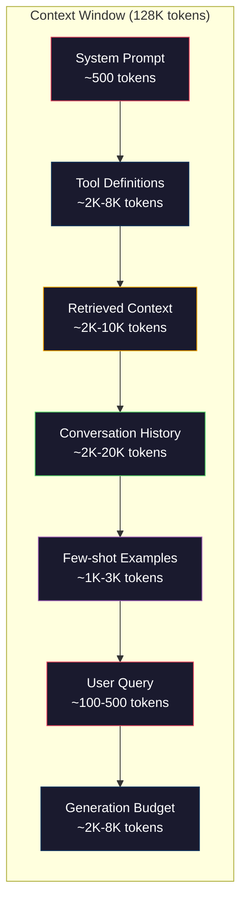
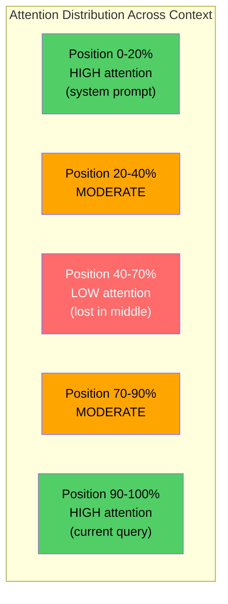
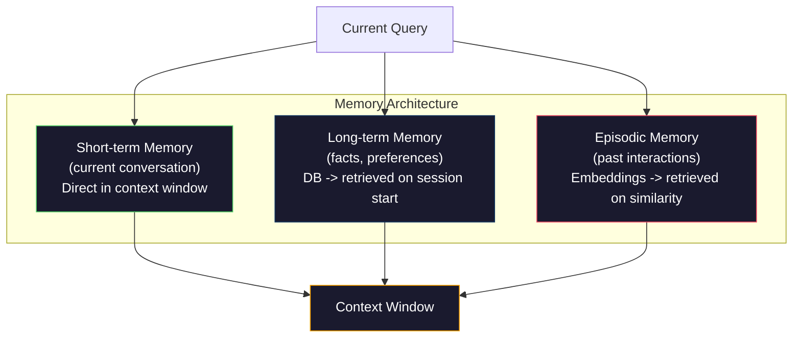

# Inżynieria kontekstu: Windows, budżety, pamięć i pobieranie

> Szybka inżynieria to podzbiór. Inżynieria kontekstu to cała gra. Podpowiedź to wpisywany ciąg. Kontekst to wszystko, co trafia do okna modelu: instrukcje systemowe, pobrane dokumenty, definicje narzędzi, historia rozmów, kilka przykładów i sam monit. Najlepsi inżynierowie AI w 2026 r. to inżynierowie kontekstu. Decydują, co wchodzi do środka, co pozostaje na zewnątrz i w jakiej kolejności.

**Typ:** Kompilacja
**Języki:** Python
**Wymagania wstępne:** Faza 10 (LLM od podstaw), Faza 11, lekcja 01-02
**Czas:** ~90 minut
**Powiązane:** Faza 11 · 15 (Podręczne buforowanie) — układ przyjazny pamięci podręcznej jest rozszerzeniem inżynierii kontekstowej. Faza 5 · 28 (Ocena w długim kontekście), jak mierzyć zagubienie w środku za pomocą NIAH/RULER.

## Cele nauczania

- Oblicz budżety tokenów we wszystkich komponentach okna kontekstowego (podpowiedź systemowa, narzędzia, historia, pobrane dokumenty, zapas generacji)
- Wdrażaj strategie zarządzania oknami kontekstowymi: obcinanie, podsumowywanie i przesuwanie okna historii rozmów
- Ustal priorytety i porządkuj komponenty kontekstu, aby zmaksymalizować uwagę modelu na najbardziej istotnych informacjach
- Zbuduj asembler kontekstu, który dynamicznie przydziela tokeny na podstawie typu zapytania i dostępnego miejsca w oknie

## Problem

Claude Opus 4.7 ma okno o wartości 200 tys. tokenów (1 milion w wersji beta). GPT-5 ma 400 tys. Gemini 3 Pro ma 2M. Lama 4 żąda 10 milionów. Liczby te wydają się ogromne, dopóki ich nie wypełnisz.

Oto prawdziwy podział dla asystenta kodowania. Komunikat systemowy: 500 tokenów. Definicje narzędzi dla 50 narzędzi: 8000 tokenów. Pobrana dokumentacja: 4000 tokenów. Historia rozmów (10 tur): 6000 tokenów. Aktualne zapytanie użytkownika: 200 tokenów. Budżet generacji (maksymalna wydajność): 4000 tokenów. Razem: 22 700 tokenów. To tylko 18% okna 128K.

Jednak uwaga nie skaluje się liniowo wraz z długością kontekstu. Model ze 128 tys. tokenów kontekstu wymaga kwadratowego kosztu uwagi (O(n^2) w transformatorach waniliowych, chociaż większość modeli produkcyjnych wykorzystuje warianty efektywnej uwagi). Co ważniejsze, dokładność wyszukiwania spada. Test „Igła w stogu siana” pokazuje, że modele mają trudności ze znalezieniem informacji umieszczonych w środku długich kontekstów. Badania Liu i in. (2023) wykazali, że LLM wyszukują informacje na początku i na końcu długich kontekstów z niemal idealną dokładnością, ale dokładność spada o 10–20% w przypadku informacji umieszczonych pośrodku (pozycje 40–70% kontekstu). Ten efekt „zagubienia w środku” różni się w zależności od modelu, ale dotyczy wszystkich obecnych architektur.

Lekcja praktyczna: posiadanie 200 tys. tokenów nie oznacza, że ​​wykorzystanie 200 tys. tokenów jest efektywne. Starannie dobrany kontekst tokenów 10 000 często przewyższa porzucony kontekst tokenów 100 000. Inżynieria kontekstu to dyscyplina polegająca na maksymalizacji stosunku sygnału do szumu w oknie kontekstu.

Każdy token, który umieścisz w oknie, zastępuje token, który może zawierać bardziej istotne informacje. Każda nieistotna definicja narzędzia, każdy nieaktualny zwrot w rozmowie, każdy fragment odzyskanego tekstu, który nie odpowiada na pytanie – każde z nich sprawia, że ​​model jest nieco gorszy w zadaniu.

## Koncepcja

### Okno kontekstowe to zasób rzadki

Pomyśl o oknie kontekstowym jak o pamięci RAM, a nie o dysku. Jest szybki i bezpośrednio dostępny, ale ograniczony. Nie da się zmieścić wszystkiego. Musisz wybrać.



Każdy element konkuruje o przestrzeń. Dodanie większej liczby definicji narzędzi oznacza mniej miejsca na historię rozmów. Dodanie większej liczby odzyskanych kontekstów oznacza mniej miejsca na kilka przykładów. Inżynieria kontekstu to sztuka alokacji budżetu w celu maksymalizacji wydajności zadania.

### Zagubiony w środku

Najważniejsze odkrycie empiryczne w inżynierii kontekstowej. Modele lepiej zwracają uwagę na informacje znajdujące się na początku i na końcu kontekstu. Informacje znajdujące się pośrodku przyciągają mniejszą uwagę i jest bardziej prawdopodobne, że zostaną zignorowane.

Liu i in. (2023) systematycznie to sprawdzali. Umieścili odpowiedni dokument wśród 20 nieistotnych dokumentów w różnych miejscach i zmierzyli dokładność odpowiedzi. Kiedy dany dokument był pierwszy lub ostatni, dokładność wynosiła 85-90%. Gdy był w środku (pozycja 10 z 20) celność spadała do 60-70%.

Ma to bezpośrednie implikacje inżynieryjne:

- Umieść najważniejsze informacje na pierwszym miejscu (podpowiedź systemową, najważniejsze instrukcje)
- Umieść bieżące zapytanie i najbardziej odpowiedni kontekst na końcu (pomaga błąd aktualności)
- Traktuj środek kontekstu jako strefę o najniższym priorytecie
- Jeśli musisz zawrzeć informacje w środku, powtórz kluczowy punkt na końcu



### Składniki kontekstu

**Podpowiedź systemowa**: ustawia osobę, ograniczenia i zasady zachowania. To jest pierwsze i pozostaje niezmienne w kolejnych turach. Claude Code używa około 6000 tokenów w swoich podpowiedziach systemowych, w tym w definicjach narzędzi i instrukcjach behawioralnych. Trzymaj mocno. Każde słowo w wierszu poleceń systemowych jest powtarzane przy każdym wywołaniu API.

**Definicje narzędzi**: każde narzędzie dodaje 50-200 tokenów (nazwa, opis, schemat parametrów). 50 narzędzi po 150 tokenów każde to 7500 tokenów, zanim nastąpi jakakolwiek rozmowa. Dynamiczny dobór narzędzi – obejmujący tylko narzędzia istotne dla bieżącego zapytania – może zmniejszyć ten problem o 60-80%.

**Pobrany kontekst**: dokumenty z bazy danych wektorowych, wyniki wyszukiwania, zawartość plików. Jakość wyszukiwania bezpośrednio determinuje jakość odpowiedzi. Złe pobranie jest gorsze niż brak pobrania — wypełnia okno szumem i aktywnie wprowadza model w błąd.

**Historia rozmów**: każda poprzednia wiadomość użytkownika i odpowiedź asystenta. Rośnie liniowo wraz z długością rozmowy. Rozmowa trwająca 50 tur przy 200 żetonach na turę to 10 000 żetonów historii. Większość z nich nie ma znaczenia dla bieżącego zapytania.

**Kilka przykładów**: pary wejścia/wyjścia demonstrujące pożądane zachowanie. Dwa lub trzy dobrze dobrane przykłady często poprawiają jakość wydruku w większym stopniu niż tysiące fragmentów instrukcji. Ale kosztują przestrzeń.

**Budżet generacji**: tokeny zarezerwowane na odpowiedź modelu. Jeśli wypełnisz okno po brzegi, model nie będzie miał miejsca na odpowiedź. Zarezerwuj co najmniej 2 000-4 000 tokenów do wygenerowania.

### Strategie kompresji kontekstu

**Podsumowanie historii**: zamiast zapisywać dosłownie wszystkie poprzednie tury, okresowo podsumowuj rozmowę. „Omówiliśmy X, zdecydowaliśmy Y, a użytkownik chce Z” w 100 tokenach zastępuje 10 tur, które wymagały 2000 tokenów. Uruchom podsumowanie, gdy historia przekroczy próg (np. 5000 tokenów).

**Filtrowanie według trafności**: oceniaj każdy pobrany dokument pod kątem bieżącego zapytania i usuwaj dokumenty poniżej progu. Jeśli odzyskałeś 10 fragmentów, ale tylko 3 są istotne, odrzuć pozostałe 7. Lepiej mieć 3 bardzo istotne fragmenty, niż 10 przeciętnych.

**Oczyszczanie narzędzi**: klasyfikuj zamiar zapytania użytkownika i uwzględniaj tylko narzędzia odpowiednie do tego celu. Pytanie kodowe nie wymaga narzędzi kalendarza. Pytanie dotyczące planowania nie wymaga narzędzi systemu plików. Może to zmniejszyć liczbę definicji narzędzi z 8 000 do 1000 tokenów.

**Podsumowanie rekurencyjne**: w przypadku bardzo długich dokumentów podsumowuj etapami. Najpierw podsumuj każdą sekcję, a następnie podsumuj podsumowania. 50-stronicowy dokument staje się podsumowaniem zawierającym 500 tokenów, które zawiera najważniejsze punkty.

### Systemy pamięci

Inżynieria kontekstu obejmuje trzy horyzonty czasowe.

**Pamięć krótkotrwała**: bieżąca rozmowa. Przechowywane bezpośrednio w oknie kontekstowym. Rośnie z każdą turą. Zarządzane przez podsumowanie i obcięcie.

**Pamięć długoterminowa**: fakty i preferencje utrzymujące się podczas rozmów. „Użytkownik woli TypeScript.” „Projekt korzysta z PostgreSQL.” Przechowywane w bazie danych, pobierane na początku sesji. Claude Code przechowuje to w plikach CLAUDE.md. ChatGPT przechowuje go w swojej pamięci.

**Pamięć epizodyczna**: konkretne interakcje z przeszłości, które mogą być istotne. „W zeszły wtorek debugowaliśmy podobny problem w module uwierzytelniania.” Przechowywane jako elementy osadzone, pobierane, gdy bieżąca rozmowa pasuje do poprzedniego odcinka.



### Dynamiczny montaż kontekstu

Kluczowy spostrzeżenie: różne zapytania wymagają innego kontekstu. Statyczny monit systemowy + statyczne narzędzia + statyczna historia są marnotrawstwem. Najlepsze systemy dynamicznie zestawiają kontekst na zapytanie.

1. Sklasyfikuj intencję zapytania
2. Wybierz odpowiednie narzędzia (nie wszystkie)
3. Pobierz odpowiednie dokumenty (nie ustalony zestaw)
4. Uwzględnij odpowiednie zwroty historii (nie całą historię)
5. Dodaj kilka przykładów pasujących do typu zadania
6. Uporządkuj wszystko według ważności: najważniejsze najpierw, ważne na końcu, opcjonalnie pośrodku

To właśnie odróżnia dobrą aplikację AI od świetnej. Model jest taki sam. Kontekst jest wyróżnikiem.

## Zbuduj to

### Krok 1: Licznik tokenów

Nie można budżetować czegoś, czego nie można zmierzyć. Zbuduj prosty licznik tokenów (przybliżenie za pomocą podziału białych znaków, ponieważ dokładna liczba zależy od tokenizatora).

```python
import json
import numpy as np
from collections import OrderedDict

def count_tokens(text):
    if not text:
        return 0
    return int(len(text.split()) * 1.3)

def count_tokens_json(obj):
    return count_tokens(json.dumps(obj))
```

### Krok 2: Menedżer budżetu kontekstowego

Podstawowa abstrakcja. Menedżer budżetu śledzi, ile tokenów wykorzystuje każdy komponent i egzekwuje limity.

```python
class ContextBudget:
    def __init__(self, max_tokens=128000, generation_reserve=4000):
        self.max_tokens = max_tokens
        self.generation_reserve = generation_reserve
        self.available = max_tokens - generation_reserve
        self.allocations = OrderedDict()

    def allocate(self, component, content, max_tokens=None):
        tokens = count_tokens(content)
        if max_tokens and tokens > max_tokens:
            words = content.split()
            target_words = int(max_tokens / 1.3)
            content = " ".join(words[:target_words])
            tokens = count_tokens(content)

        used = sum(self.allocations.values())
        if used + tokens > self.available:
            allowed = self.available - used
            if allowed <= 0:
                return None, 0
            words = content.split()
            target_words = int(allowed / 1.3)
            content = " ".join(words[:target_words])
            tokens = count_tokens(content)

        self.allocations[component] = tokens
        return content, tokens

    def remaining(self):
        used = sum(self.allocations.values())
        return self.available - used

    def utilization(self):
        used = sum(self.allocations.values())
        return used / self.max_tokens

    def report(self):
        total_used = sum(self.allocations.values())
        lines = []
        lines.append(f"Context Budget Report ({self.max_tokens:,} token window)")
        lines.append("-" * 50)
        for component, tokens in self.allocations.items():
            pct = tokens / self.max_tokens * 100
            bar = "#" * int(pct / 2)
            lines.append(f"  {component:<25} {tokens:>6} tokens ({pct:>5.1f}%) {bar}")
        lines.append("-" * 50)
        lines.append(f"  {'Used':<25} {total_used:>6} tokens ({total_used/self.max_tokens*100:.1f}%)")
        lines.append(f"  {'Generation reserve':<25} {self.generation_reserve:>6} tokens")
        lines.append(f"  {'Remaining':<25} {self.remaining():>6} tokens")
        return "\n".join(lines)
```

### Krok 3: Zmiana kolejności zagubiona w środku

Wdrażaj strategię zmiany kolejności: najważniejsze rzeczy umieszczane są na pierwszym miejscu i na końcu, najmniej ważne na środku.

```python
def reorder_lost_in_middle(items, scores):
    paired = sorted(zip(scores, items), reverse=True)
    sorted_items = [item for _, item in paired]

    if len(sorted_items) <= 2:
        return sorted_items

    first_half = sorted_items[::2]
    second_half = sorted_items[1::2]
    second_half.reverse()

    return first_half + second_half

def score_relevance(query, documents):
    query_words = set(query.lower().split())
    scores = []
    for doc in documents:
        doc_words = set(doc.lower().split())
        if not query_words:
            scores.append(0.0)
            continue
        overlap = len(query_words & doc_words) / len(query_words)
        scores.append(round(overlap, 3))
    return scores
```

### Krok 4: Kompresor historii rozmów

Podsumuj stare konwersacje, aby odzyskać budżet tokenów.

```python
class ConversationManager:
    def __init__(self, max_history_tokens=5000):
        self.turns = []
        self.summaries = []
        self.max_history_tokens = max_history_tokens

    def add_turn(self, role, content):
        self.turns.append({"role": role, "content": content})
        self._compress_if_needed()

    def _compress_if_needed(self):
        total = sum(count_tokens(t["content"]) for t in self.turns)
        if total <= self.max_history_tokens:
            return

        while total > self.max_history_tokens and len(self.turns) > 4:
            old_turns = self.turns[:2]
            summary = self._summarize_turns(old_turns)
            self.summaries.append(summary)
            self.turns = self.turns[2:]
            total = sum(count_tokens(t["content"]) for t in self.turns)

    def _summarize_turns(self, turns):
        parts = []
        for t in turns:
            content = t["content"]
            if len(content) > 100:
                content = content[:100] + "..."
            parts.append(f"{t['role']}: {content}")
        return "Previous: " + " | ".join(parts)

    def get_context(self):
        parts = []
        if self.summaries:
            parts.append("[Conversation Summary]")
            for s in self.summaries:
                parts.append(s)
        parts.append("[Recent Conversation]")
        for t in self.turns:
            parts.append(f"{t['role']}: {t['content']}")
        return "\n".join(parts)

    def token_count(self):
        return count_tokens(self.get_context())
```

### Krok 5: Dynamiczny wybór narzędzi

Uwzględnij tylko narzędzia istotne dla bieżącego zapytania. Klasyfikuj intencje, a następnie filtruj.

```python
TOOL_REGISTRY = {
    "read_file": {
        "description": "Read contents of a file",
        "tokens": 120,
        "categories": ["code", "files"],
    },
    "write_file": {
        "description": "Write content to a file",
        "tokens": 150,
        "categories": ["code", "files"],
    },
    "search_code": {
        "description": "Search for patterns in codebase",
        "tokens": 130,
        "categories": ["code"],
    },
    "run_command": {
        "description": "Execute a shell command",
        "tokens": 140,
        "categories": ["code", "system"],
    },
    "create_calendar_event": {
        "description": "Create a new calendar event",
        "tokens": 180,
        "categories": ["calendar"],
    },
    "list_emails": {
        "description": "List recent emails",
        "tokens": 160,
        "categories": ["email"],
    },
    "send_email": {
        "description": "Send an email message",
        "tokens": 200,
        "categories": ["email"],
    },
    "web_search": {
        "description": "Search the web for information",
        "tokens": 140,
        "categories": ["research"],
    },
    "query_database": {
        "description": "Run a SQL query on the database",
        "tokens": 170,
        "categories": ["code", "data"],
    },
    "generate_chart": {
        "description": "Generate a chart from data",
        "tokens": 190,
        "categories": ["data", "visualization"],
    },
}

def classify_intent(query):
    query_lower = query.lower()

    intent_keywords = {
        "code": ["code", "function", "bug", "error", "file", "implement", "refactor", "debug", "test"],
        "calendar": ["meeting", "schedule", "calendar", "appointment", "event"],
        "email": ["email", "mail", "send", "inbox", "message"],
        "research": ["search", "find", "what is", "how does", "explain", "look up"],
        "data": ["data", "query", "database", "chart", "graph", "analytics", "sql"],
    }

    scores = {}
    for intent, keywords in intent_keywords.items():
        score = sum(1 for kw in keywords if kw in query_lower)
        if score > 0:
            scores[intent] = score

    if not scores:
        return ["code"]

    max_score = max(scores.values())
    return [intent for intent, score in scores.items() if score >= max_score * 0.5]

def select_tools(query, token_budget=2000):
    intents = classify_intent(query)
    relevant = {}
    total_tokens = 0

    for name, tool in TOOL_REGISTRY.items():
        if any(cat in intents for cat in tool["categories"]):
            if total_tokens + tool["tokens"] <= token_budget:
                relevant[name] = tool
                total_tokens += tool["tokens"]

    return relevant, total_tokens
```

### Krok 6: Potok składania pełnego kontekstu

Połącz wszystko razem. Biorąc pod uwagę zapytanie, dynamicznie zbuduj optymalny kontekst.

```python
class ContextEngine:
    def __init__(self, max_tokens=128000, generation_reserve=4000):
        self.budget = ContextBudget(max_tokens, generation_reserve)
        self.conversation = ConversationManager(max_history_tokens=5000)
        self.system_prompt = (
            "You are a helpful AI assistant. You have access to tools for "
            "code editing, file management, web search, and data analysis. "
            "Use the appropriate tools for each task. Be concise and accurate."
        )
        self.knowledge_base = [
            "Python 3.12 introduced type parameter syntax for generic classes using bracket notation.",
            "The project uses PostgreSQL 16 with pgvector for embedding storage.",
            "Authentication is handled by Supabase Auth with JWT tokens.",
            "The frontend is built with Next.js 15 using the App Router.",
            "API rate limits are set to 100 requests per minute per user.",
            "The deployment pipeline uses GitHub Actions with Docker multi-stage builds.",
            "Test coverage must be above 80% for all new modules.",
            "The codebase follows the repository pattern for data access.",
        ]

    def assemble(self, query):
        self.budget = ContextBudget(self.budget.max_tokens, self.budget.generation_reserve)

        system_content, _ = self.budget.allocate("system_prompt", self.system_prompt, max_tokens=1000)

        tools, tool_tokens = select_tools(query, token_budget=2000)
        tool_text = json.dumps(list(tools.keys()))
        tool_content, _ = self.budget.allocate("tools", tool_text, max_tokens=2000)

        relevance = score_relevance(query, self.knowledge_base)
        threshold = 0.1
        relevant_docs = [
            doc for doc, score in zip(self.knowledge_base, relevance)
            if score >= threshold
        ]

        if relevant_docs:
            doc_scores = [s for s in relevance if s >= threshold]
            reordered = reorder_lost_in_middle(relevant_docs, doc_scores)
            doc_text = "\n".join(reordered)
            doc_content, _ = self.budget.allocate("retrieved_context", doc_text, max_tokens=3000)

        history_text = self.conversation.get_context()
        if history_text.strip():
            history_content, _ = self.budget.allocate("conversation_history", history_text, max_tokens=5000)

        query_content, _ = self.budget.allocate("user_query", query, max_tokens=500)

        return self.budget

    def chat(self, query):
        self.conversation.add_turn("user", query)
        budget = self.assemble(query)
        response = f"[Response to: {query[:50]}...]"
        self.conversation.add_turn("assistant", response)
        return budget

def run_demo():
    print("=" * 60)
    print("  Context Engineering Pipeline Demo")
    print("=" * 60)

    engine = ContextEngine(max_tokens=128000, generation_reserve=4000)

    print("\n--- Query 1: Code task ---")
    budget = engine.chat("Fix the bug in the authentication module where JWT tokens expire too early")
    print(budget.report())

    print("\n--- Query 2: Research task ---")
    budget = engine.chat("What is the best approach for implementing vector search in PostgreSQL?")
    print(budget.report())

    print("\n--- Query 3: After conversation history builds up ---")
    for i in range(8):
        engine.conversation.add_turn("user", f"Follow-up question number {i+1} about the implementation details of the system")
        engine.conversation.add_turn("assistant", f"Here is the response to follow-up {i+1} with technical details about the architecture")

    budget = engine.chat("Now implement the changes we discussed")
    print(budget.report())

    print("\n--- Tool Selection Examples ---")
    test_queries = [
        "Fix the bug in auth.py",
        "Schedule a meeting with the team for Tuesday",
        "Show me the database query performance stats",
        "Search for best practices on error handling",
    ]

    for q in test_queries:
        tools, tokens = select_tools(q)
        intents = classify_intent(q)
        print(f"\n  Query: {q}")
        print(f"  Intents: {intents}")
        print(f"  Tools: {list(tools.keys())} ({tokens} tokens)")

    print("\n--- Lost-in-the-Middle Reordering ---")
    docs = ["Doc A (most relevant)", "Doc B (somewhat relevant)", "Doc C (least relevant)",
            "Doc D (relevant)", "Doc E (moderately relevant)"]
    scores = [0.95, 0.60, 0.20, 0.80, 0.50]
    reordered = reorder_lost_in_middle(docs, scores)
    print(f"  Original order: {docs}")
    print(f"  Scores:         {scores}")
    print(f"  Reordered:      {reordered}")
    print(f"  (Most relevant at start and end, least relevant in middle)")
```

## Użyj tego

### Strategia kontekstowa Claude’a Code’a

Claude Code zarządza kontekstem w sposób warstwowy. Podpowiedź systemowa zawiera reguły zachowania i definicje narzędzi (~6 tys. tokenów). Kiedy otwierasz plik, jego zawartość jest wstrzykiwana jako kontekst. Wyniki wyszukiwania są dodawane. Podsumowano stare zwroty konwersacji. CLAUDE.md zapewnia pamięć długoterminową, która utrzymuje się przez całą sesję.

Kluczowa decyzja inżynieryjna: Claude Code nie wrzuca całej bazy kodu do kontekstu. Pobiera odpowiednie pliki na żądanie. To jest inżynieria kontekstu w praktyce.

### Ładowanie dynamicznego kontekstu kursora

Kursor indeksuje całą bazę kodu do osadzania. Po wpisaniu zapytania pobiera ono najbardziej odpowiednie pliki i bloki kodu, korzystając z podobieństwa wektorów. Tylko te elementy trafiają do okna kontekstowego. Baza kodu licząca 500 tys. linii jest skompresowana do 5–10 najbardziej odpowiednich bloków kodu.

Oto wzór: osadzaj wszystko, pobieraj na żądanie, dołączaj tylko to, co ważne.

### Pamięć ChatGPT

ChatGPT przechowuje preferencje i fakty użytkownika w postaci pamięci długotrwałej. Przy każdym rozpoczęciu rozmowy odpowiednie wspomnienia są pobierane i uwzględniane w monitach systemowych. „Użytkownik woli Pythona” kosztuje 5 tokenów, ale pozwala zaoszczędzić setki tokenów powtarzanych instrukcji w rozmowach.

### RAG jako inżynieria kontekstu

Generowanie wspomagane wyszukiwaniem to sformalizowana inżynieria kontekstowa. Zamiast wpychać wiedzę do wag modelu (trening) lub podpowiedzi systemowych (kontekst statyczny), w czasie wykonywania zapytania pobierasz odpowiednie dokumenty i wstawiasz je do okna kontekstowego. Cały potok RAG – fragmentacja, osadzanie, pobieranie, zmiana rankingu – istnieje po to, aby rozwiązać jeden problem: umieszczenie właściwych informacji w oknie kontekstowym.

## Wyślij to

Ta lekcja generuje `outputs/prompt-context-optimizer.md` — monit wielokrotnego użytku, który sprawdza strategię składania kontekstu i zaleca optymalizacje. Podaj informacje o podpowiedziach systemowych, liczbie narzędzi, średniej długości historii i strategii wyszukiwania, a on zidentyfikuje marnotrawstwo tokenów i zasugeruje ulepszenia.

Tworzy także `outputs/skill-context-engineering.md` — strukturę decyzyjną do projektowania potoków składania kontekstu w oparciu o typ zadania, rozmiar okna kontekstu i budżet opóźnień.

## Ćwiczenia

1. Dodaj „wykrywacz marnotrawstwa tokenów” do klasy ContextBudget. Powinien oznaczać komponenty wykorzystujące więcej niż 30% budżetu i sugerować strategie kompresji specyficzne dla każdego typu komponentu (podsumowanie historii, narzędzia do czyszczenia, ponowne uszeregowanie dokumentów).

2. Zaimplementuj deduplikację semantyczną dla pobranego kontekstu. Jeśli dwa odzyskane dokumenty są podobne w więcej niż 80% (pod względem nakładania się słów lub podobieństwa cosinusowego ich osadzania), zatrzymaj tylko ten, który uzyskał wyższą liczbę punktów. Zmierz, ile budżetu tokenowego odzyskasz.

3. Zbuduj narzędzie do „odtwarzania kontekstu”. Mając zapis rozmowy, odtwórz go za pomocą ContextEngine i zwizualizuj, jak po kolei zmienia się alokacja budżetu. Wykres wykorzystania tokenów według komponentu w czasie. Zidentyfikuj zwrot, w którym kontekst zaczyna się kompresować.

4. Zaimplementuj selektor narzędzi oparty na priorytetach. Zamiast binarnego włączania/wykluczania, przypisz każdemu narzędziu ocenę trafności do bieżącego zapytania. Uwzględniaj narzędzia w malejącej kolejności trafności, aż do wyczerpania budżetu narzędzi. Porównaj wydajność zadań z dołączonymi 5, 10, 20 i 50 narzędziami.

5. Zbuduj kompresor kontekstu obsługujący wiele strategii. Zastosuj trzy strategie kompresji (obcięcie, podsumowanie, wyodrębnienie kluczowych zdań) i porównaj je na zestawie 20 dokumentów. Zmierz kompromis między współczynnikiem kompresji a retencją informacji (czy skompresowana wersja nadal zawiera odpowiedź na zapytanie?).

## Kluczowe terminy

| Termin | Co ludzie mówią | Co to właściwie oznacza |
|------|----------------|----------------------|
| Okno kontekstowe | „Ile model może odczytać” | Maksymalna liczba tokenów (wejście + wyjście), które model przetwarza w jednym przebiegu do przodu — 400 tys. dla GPT-5, 200 tys. (1M beta) dla Claude Opus 4.7, 2M dla Gemini 3 Pro |
| Inżynieria kontekstowa | „Zaawansowana szybka inżynieria” | Dyscyplina decydowania o tym, co trafi do okna kontekstowego, w jakiej kolejności i z jakim priorytetem - obejmuje pobieranie, kompresję, wybór narzędzi i zarządzanie pamięcią |
| Zagubiony w środku | „Modele zapominają o tym, co jest pośrodku” | Empiryczne ustalenie, że LLM lepiej skupiają się na początku i na końcu kontekstu, przy spadku dokładności o 10–20% w przypadku informacji umieszczonych pośrodku |
| Budżet symboliczny | „Ile zostało Ci żetonów” | Wyraźny przydział pojemności okna kontekstowego pomiędzy komponentami (podpowiedź systemowa, narzędzia, historia, pobieranie, generowanie) z limitami na komponent |
| Kontekst dynamiczny | „Ładowanie rzeczy w locie” | Odmienne składanie okna kontekstowego dla każdego zapytania w oparciu o klasyfikację intencji, odpowiedni wybór narzędzi i wyniki wyszukiwania |
| Podsumowanie historii | „Kompresowanie rozmowy” | Zastąpienie dosłownych starych zwrotów konwersacji zwięzłym podsumowaniem, redukując koszt tokena przy jednoczesnym zachowaniu kluczowych informacji |
| Przycinanie narzędzi | „Uwzględniając tylko odpowiednie narzędzia” | Klasyfikacja intencji zapytania i uwzględnianie tylko pasujących definicji narzędzi, redukując koszt tokenu narzędzia o 60-80% |
| Pamięć długoterminowa | „Zapamiętywanie podczas sesji” | Fakty i preferencje przechowywane w bazie danych i pobierane na początku sesji — CLAUDE.md, ChatGPT Memory i podobne systemy |
| Pamięć epizodyczna | „Pamiętanie konkretnych wydarzeń z przeszłości” | Wcześniejsze interakcje przechowywane jako osadzenia i pobierane, gdy bieżące zapytanie jest podobne do poprzedniej rozmowy |
| Budżet generacji | „Miejsce na odpowiedź” | Tokeny zarezerwowane na wyjście modelu -- jeśli kontekst całkowicie wypełni okno, model nie będzie miał już miejsca na odpowiedź |

## Dalsze czytanie

– [Liu i in., 2023 – „Lost in the Middle: How Models Language Use Long Contexts”](https://arxiv.org/abs/2307.03172) – ostateczne badanie dotyczące uwagi zależnej od pozycji, pokazujące, że modele zmagają się z informacjami w środku długich kontekstów
– [Post na blogu Anthropic's Contextual Retrieval](https://www.anthropic.com/news/contextual-retrieval) – jak firma Anthropic podchodzi do kontekstowego wyszukiwania fragmentów, ograniczając liczbę niepowodzeń podczas pobierania o 49%
– [„Context Engineering” Simona Willisona](https://simonwillison.net/2025/Jun/27/context-engineering/) – post na blogu, w którym nazwano tę dyscyplinę i odróżniono ją od inżynierii szybkiej
- [Dokumentacja LangChain na temat RAG](https://python.langchain.com/docs/tutorials/rag/) -- praktyczna implementacja generowania wspomaganego wyszukiwaniem jako wzorca inżynierii kontekstu
– [Test igły w stogu siana Grega Kamradta](https://github.com/gkamradt/LLMTest_NeedleInAHaystack) – test porównawczy, który ujawnił błędy pobierania zależne od pozycji we wszystkich głównych modelach
– [Pope i in., „Efficiently Scaling Transformer Inference” (2022)](https://arxiv.org/abs/2211.05102) – dlaczego długość kontekstu wpływa na pamięć i opóźnienia oraz jak pamięć podręczna KV, MQA i GQA zmieniają obliczenia budżetu.
- [Agrawal i in., „SARATHI: Efficient LLM Inference by Piggybacking Decodes with Chunked Prefills” (2023)](https://arxiv.org/abs/2308.16369) — dwie fazy wnioskowania, które sprawiają, że długie podpowiedzi są drogie w TTFT, ale tanie w TPOT; podstawowa prawda stojąca za kompromisami w zakresie pakowania kontekstowego.
– [Ainslie i in., „GQA: Training Generalized Multi-Query Transformer Models from Multi-Head Checkpoints” (EMNLP 2023)](https://arxiv.org/abs/2305.13245) – dokument dotyczący zapytań grupowych, który zmniejsza pamięć KV 8× w dekoderach produkcyjnych bez utraty jakości.