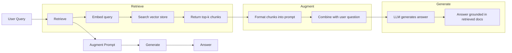
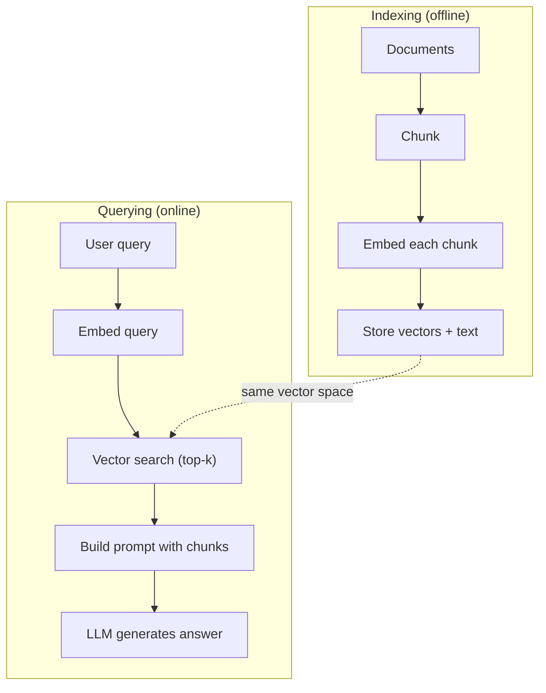

# RAG (generacja wspomagana odzyskiwaniem)

> Twój LLM wie wszystko aż do zakończenia szkolenia. Nie wie nic o dokumentach Twojej firmy, bazie kodu ani notatkach ze spotkań z zeszłego tygodnia. RAG rozwiązuje ten problem, pobierając odpowiednie dokumenty i umieszczając je w wierszu poleceń. Jest to najczęściej stosowany wzorzec w produkcyjnej sztucznej inteligencji. Jeśli zbudujesz jedną rzecz na podstawie tego kursu, zbuduj rurociąg RAG.

**Typ:** Kompilacja
**Języki:** Python
**Wymagania wstępne:** Faza 10 (LLM od podstaw), Faza 11, lekcje 01-05
**Czas:** ~90 minut
**Powiązane:** Faza 5 · 23 (Strategie dzielenia na kawałki dla RAG) dla sześciu algorytmów dzielenia na kawałki i kiedy każdy z nich wygrywa. Faza 5 · 22 (Głębokie nurkowanie z modelami osadzającymi) w celu wybrania modułu osadzającego. Faza 11 · 07 (Zaawansowany RAG) do wyszukiwania hybrydowego, zmiany rankingu i transformacji zapytań.

## Cele nauczania

- Zbuduj kompletny potok RAG: ładowanie dokumentów, fragmentowanie, osadzanie, przechowywanie wektorów, pobieranie i generowanie
- Zaimplementuj wyszukiwanie semantyczne przy użyciu wektorowej bazy danych (ChromaDB, FAISS lub Pinecone) z odpowiednim indeksowaniem
- Wyjaśnij, dlaczego RAG jest preferowany zamiast dostrajania w zastosowaniach opartych na wiedzy (koszt, świeżość, atrybucja)
- Oceń jakość RAG za pomocą wskaźników wyszukiwania (precyzja, przypominanie) i wskaźników generowania (wierność, trafność)

## Problem

Budujesz chatbota dla swojej firmy. Klient pyta: „Jakie są zasady zwrotów w przypadku planów dla przedsiębiorstw?” LLM odpowiada ogólną odpowiedzią na temat typowych zasad zwrotów w ramach SaaS. Rzeczywista polityka, ukryta na 200-stronicowej wewnętrznej wiki, mówi, że klienci korporacyjni otrzymują 60-dniowe okno z proporcjonalnym zwrotem pieniędzy. LLM nigdy nie widziało tego dokumentu. Nie może wiedzieć, w czym nie został przeszkolony.

Dostrajanie jest jednym z rozwiązań. Skorzystaj z LLM, przeszkol go w swoich wewnętrznych dokumentach i wdróż zaktualizowany model. To działa, ale stwarza poważne problemy. Dostrajanie kosztuje tysiące dolarów w obliczeniach. Model staje się nieaktualny w momencie zmiany dokumentu. Nie masz możliwości sprawdzenia, z jakiego źródła zaczerpnął model. A jeśli w przyszłym miesiącu firma nabędzie kolejną linię produktów, ponownie dopracujesz swoje rozwiązania.

RAG to inne rozwiązanie. Pozostaw model nietknięty. Gdy pojawi się pytanie, przeszukaj swój magazyn dokumentów w poszukiwaniu odpowiednich fragmentów, wklej je w wierszu zachęty przed pytaniem i pozwól modelowi odpowiedzieć, używając tych fragmentów jako kontekstu. Magazyn dokumentów można zaktualizować w ciągu kilku minut. Możesz dokładnie zobaczyć, które dokumenty zostały pobrane. Sam model nigdy się nie zmienia. Właśnie dlatego RAG jest dominującym wzorcem w produkcji: jest tańszy, świeższy, łatwiejszy do kontroli i działa z każdym LLM.

## Koncepcja

### Wzór RAG

Cały wzór mieści się w czterech krokach:



Zapytanie -> Pobierz -> Zwiększ monit -> Generuj. Każdy system RAG jest zgodny z tym wzorcem. Różnice pomiędzy produkcyjnymi systemami RAG tkwią w szczegółach każdego etapu: sposobie dzielenia na kawałki, osadzania, wyszukiwania i konstruowania podpowiedzi.

### Dlaczego RAG przewyższa dostrajanie

| Obawa | Dostrajanie | SZARA |
|--------|------------|-----|
| Koszt | $1,000-$Ponad 100 000 na przebieg szkolenia | $0.01-$0,10 na zapytanie (osadzanie + LLM) |
| Świeżość | Nieaktualne do czasu przekwalifikowania | Zaktualizowano w ciągu kilku minut poprzez ponowne indeksowanie dokumentów |
| Kontrolowalność | Nie można prześledzić odpowiedzi do źródła | Może pokazać dokładne pobrane fragmenty |
| Halucynacja | Wciąż swobodnie ma halucynacje | Ugruntowany w odzyskanych dokumentach |
| Prywatność danych | Dane treningowe zapisane w ciężarkach | Dokumenty pozostają w Twoim magazynie wektorów |

Dostrajanie zmienia na stałe ciężar modelu. RAG tymczasowo zmienia kontekst modelu. W przypadku większości aplikacji potrzebny jest kontekst tymczasowy.

Jedyny przypadek, w którym wygrywa dostrojenie: gdy potrzebujesz, aby model przyjął określony styl, ton lub wzorzec rozumowania, którego nie można osiągnąć poprzez samo podpowiadanie. Jeśli chodzi o wyszukiwanie wiedzy opartej na faktach, RAG wygrywa za każdym razem.

### Osadzanie modeli

Model osadzania konwertuje tekst na gęsty wektor. Podobne teksty tworzą wektory, które są blisko siebie w tej wielowymiarowej przestrzeni. „Jak zresetować hasło?” i „Muszę zmienić hasło” dają prawie identyczne wektory, mimo że dzielimy się kilkoma słowami. „Kot usiadł na macie” tworzy zupełnie inny wektor.

Typowe modele osadzania (skład na rok 2026 — pełna analiza znajduje się w fazie 5 · 22):

| Modelka | Wymiary | Dostawca | Notatki |
|-------|-----------|---------|-------|
| osadzanie tekstu-3-małe | 1536 (Matrioszka) | OpenAI | Najlepszy stosunek ceny do wydajności w większości przypadków użycia |
| osadzanie tekstu-3-duże | 3072 (Matrioszka) | OpenAI | Większa dokładność, możliwość skrócenia do 256/512/1024 |
| Bliźnięta Osadzanie 2 | 3072 (Matrioszka) | Google | Najlepsze pobieranie MTEB; Kontekst 8K |
| podróż-4 | 1024/2048 (Matrioszka) | AI podróży | Warianty domen (kod, finanse, prawo) |
| Cohere osadzaj-v4 | 1024 (Matrioszka) | Spójne | Silny wielojęzyczny kontekst 128 tys. |
| BGE-M3 | 1024 (gęsty + rzadki + ColBERT) | BAAI (waga otwarta) | Trzy widoki z jednego modelu |
| Osadzanie Qwen3 | 4096 (Matrioszka) | Alibaba (waga otwarta) | Najlepszy wynik w aportowaniu z ciężarem otwartym |
| all-MiniLM-L6-v2 | 384 | Waga otwarta (transformatory zdań) | Baza prototypowania |

Na potrzeby tej lekcji zbudujemy własne proste osadzanie przy użyciu TF-IDF. Nie dlatego, że systemy produkcyjne używają TF-IDF, ale dlatego, że sprawia, że ​​koncepcja staje się konkretna: tekst wchodzi, wychodzi wektor, podobne teksty tworzą podobne wektory.

### Podobieństwo wektorowe

Mając dwa wektory, jak zmierzyć podobieństwo? Trzy opcje:

**Cosinus podobieństwa**: cosinus kąta między dwoma wektorami. Zakres od -1 (przeciwny) do 1 (identyczny). Ignoruje wielkość, dba tylko o kierunek. Jest to ustawienie domyślne dla RAG.

```
cosine_sim(a, b) = dot(a, b) / (||a|| * ||b||)
```

**Produkt punktowy**: surowy produkt wewnętrzny. Większe wektory uzyskują wyższe wyniki. Przydatne, gdy wielkość niesie ze sobą informacje (dłuższe dokumenty mogą być bardziej istotne).

```
dot(a, b) = sum(a_i * b_i)
```

**Odległość L2 (euklidesowa)**: odległość w linii prostej w przestrzeni wektorowej. Mniejsza odległość = bardziej podobne. Wrażliwy na różnice wielkości.

```
L2(a, b) = sqrt(sum((a_i - b_i)^2))
```

Podobieństwo cosinusowe jest standardem. Z wdziękiem radzi sobie z dokumentami o różnej długości, ponieważ normalizuje wielkość. Kiedy ktoś mówi „wyszukiwanie wektorów”, prawie zawsze ma na myśli podobieństwo cosinus.

### Strategie dzielenia

Dokumenty są zbyt długie, aby można je było osadzić jako pojedyncze wektory. 50-stronicowy plik PDF może powodować okropne osadzanie, ponieważ zawiera dziesiątki tematów. Zamiast tego dzielisz dokumenty na porcje i osadzasz każdą porcję osobno.

**Porcjowanie o stałym rozmiarze**: podziel co N żetonów. Proste i przewidywalne. Fragment 512 tokenów z nakładaniem się 50 tokenów oznacza, że ​​fragment 1 to tokeny 0–511, fragment 2 to tokeny 462–973 i tak dalej. Nakładanie się gwarantuje, że nie podzielisz zdania na pechową granicę.

**Podział semantyczny**: podział na naturalnych granicach. Akapity, sekcje lub nagłówki przecen. Każdy fragment stanowi spójną jednostkę znaczeniową. Bardziej skomplikowane do wdrożenia, ale zapewnia lepsze wyszukiwanie.

**Część rekurencyjna**: spróbuj najpierw podzielić na największej granicy (nagłówki sekcji). Jeśli sekcja jest nadal zbyt duża, podziel ją wzdłuż granic akapitów. Jeśli akapit jest nadal za duży, podziel go na granicach zdania. Jest to podejście LangChain RecursiveCharacterTextSplitter i sprawdza się dobrze w praktyce.

Rozmiar kawałka ma większe znaczenie, niż się ludziom wydaje:

- Zbyt mały (64-128 tokenów): każdemu fragmentowi brakuje kontekstu. „Wzrosło o 15% w ostatnim kwartale” nic nie znaczy, jeśli nie wiemy, do czego to słowo się odnosi.
- Zbyt duży (ponad 2048 tokenów): każdy fragment obejmuje wiele tematów, co osłabia znaczenie. Gdy szukasz danych o przychodach, otrzymujesz fragment obejmujący 10% przychodów i 90% pracowników.
- Najlepszy punkt (256-512 tokenów): wystarczający kontekst, aby był samowystarczalny, wystarczająco skoncentrowany, aby był istotny.

Większość produkcyjnych systemów RAG wykorzystuje fragmenty o długości 256–512 tokenów z nakładaniem się 50 tokenów. Wytyczne Anthropic RAG zalecają ten asortyment.

### Wektorowe bazy danych

Gdy już masz osady, potrzebujesz miejsca, w którym możesz je przechowywać i przeszukiwać. Opcje:

| Baza danych | Wpisz | Najlepsze dla |
|---------|------|---------|
| FAISS | Biblioteka (w trakcie) | Prototypowanie, małe i średnie zbiory danych |
| Chroma | Lekki DB | Rozwój lokalny, małe wdrożenia |
| Szyszka | Usługa zarządzana | Produkcja bez kosztów operacyjnych |
| Tkać | Baza danych open source | Produkcja na własnym serwerze |
| pgwektor | Rozszerzenie Postgres | Już używasz Postgres |
| Qdrant | Baza danych open source | Wysokowydajny hosting |

Na potrzeby tej lekcji zbudujemy prosty magazyn wektorów w pamięci. Przechowuje wektory na liście i wykonuje wyszukiwanie podobieństwa cosinus metodą brute-force. Jest to odpowiednik FAISS z płaskim indeksem. Skaluje się do około 100 000 wektorów, zanim zacznie zwalniać. Systemy produkcyjne wykorzystują algorytmy przybliżonego najbliższego sąsiada (ANN), takie jak HNSW, do wyszukiwania milionów wektorów w ciągu milisekund.

### Pełny rurociąg



Faza indeksowania przebiega raz dla każdego dokumentu (lub podczas aktualizacji dokumentów). Faza odpytywania jest uruchamiana na każde żądanie użytkownika. W środowisku produkcyjnym indeksowanie może przetworzyć miliony dokumentów w ciągu kilku godzin. Zapytanie musi odpowiedzieć w czasie krótszym niż sekunda.

### Liczby rzeczywiste

Większość produkcyjnych systemów RAG wykorzystuje następujące parametry:

- **k = 5 do 10** pobranych fragmentów na zapytanie
- **Rozmiar porcji = 256 do 512 tokenów** z zakładką 50 tokenów
- **Budżet kontekstowy**: 2500-5000 tokenów pobranej treści na zapytanie
- **Całkowita liczba monitów**: ~8 000–16 000 tokenów (podpowiedź systemowa + pobrane fragmenty + historia rozmów + zapytanie użytkownika)
- **Wymiar osadzenia**: 384-3072 w zależności od modelu
- **Przepustowość indeksowania**: 100-1000 dokumentów na sekundę z osadzeniem API
- **Opóźnienie zapytania**: 50-200 ms dla pobrania, 500-3000 ms dla generacji

## Zbuduj to

### Krok 1: Porcjowanie dokumentu

```python
def chunk_text(text, chunk_size=200, overlap=50):
    words = text.split()
    chunks = []
    start = 0
    while start < len(words):
        end = start + chunk_size
        chunk = " ".join(words[start:end])
        chunks.append(chunk)
        start += chunk_size - overlap
    return chunks
```

### Krok 2: Osadzanie TF-IDF

Budujemy prostą funkcję osadzania. TF-IDF (termin częstotliwość-odwrotna częstotliwość dokumentu) nie jest osadzeniem neuronowym, ale konwertuje tekst na wektory w sposób oddający znaczenie słów. Częste słowa w dokumencie uzyskują wyższy TF. Rzadkie słowa w całym korpusie uzyskują wyższy IDF. Produkt daje wektor, w którym ważne, wyróżniające się słowa mają wysokie wartości.

```python
import math
from collections import Counter

def build_vocabulary(documents):
    vocab = set()
    for doc in documents:
        vocab.update(doc.lower().split())
    return sorted(vocab)

def compute_tf(text, vocab):
    words = text.lower().split()
    count = Counter(words)
    total = len(words)
    return [count.get(word, 0) / total for word in vocab]

def compute_idf(documents, vocab):
    n = len(documents)
    idf = []
    for word in vocab:
        doc_count = sum(1 for doc in documents if word in doc.lower().split())
        idf.append(math.log((n + 1) / (doc_count + 1)) + 1)
    return idf

def tfidf_embed(text, vocab, idf):
    tf = compute_tf(text, vocab)
    return [t * i for t, i in zip(tf, idf)]
```

### Krok 3: Wyszukiwanie podobieństwa cosinusowego

```python
def cosine_similarity(a, b):
    dot = sum(x * y for x, y in zip(a, b))
    norm_a = math.sqrt(sum(x * x for x in a))
    norm_b = math.sqrt(sum(x * x for x in b))
    if norm_a == 0 or norm_b == 0:
        return 0.0
    return dot / (norm_a * norm_b)

def search(query_embedding, stored_embeddings, top_k=5):
    scores = []
    for i, emb in enumerate(stored_embeddings):
        sim = cosine_similarity(query_embedding, emb)
        scores.append((i, sim))
    scores.sort(key=lambda x: x[1], reverse=True)
    return scores[:top_k]
```

### Krok 4: Szybka konstrukcja

To tutaj dzieje się „rozszerzone” w RAG. Weź pobrane fragmenty, sformatuj je w zachętę i poproś LLM o odpowiedź w oparciu o podany kontekst.

```python
def build_rag_prompt(query, retrieved_chunks):
    context = "\n\n---\n\n".join(
        f"[Source {i+1}]\n{chunk}"
        for i, chunk in enumerate(retrieved_chunks)
    )
    return f"""Answer the question based ONLY on the following context.
If the context doesn't contain enough information, say "I don't have enough information to answer that."

Context:
{context}

Question: {query}

Answer:"""
```

### Krok 5: Kompletny rurociąg RAG

```python
class RAGPipeline:
    def __init__(self):
        self.chunks = []
        self.embeddings = []
        self.vocab = []
        self.idf = []

    def index(self, documents):
        all_chunks = []
        for doc in documents:
            all_chunks.extend(chunk_text(doc))
        self.chunks = all_chunks
        self.vocab = build_vocabulary(all_chunks)
        self.idf = compute_idf(all_chunks, self.vocab)
        self.embeddings = [
            tfidf_embed(chunk, self.vocab, self.idf)
            for chunk in all_chunks
        ]

    def query(self, question, top_k=5):
        query_emb = tfidf_embed(question, self.vocab, self.idf)
        results = search(query_emb, self.embeddings, top_k)
        retrieved = [(self.chunks[i], score) for i, score in results]
        prompt = build_rag_prompt(
            question, [chunk for chunk, _ in retrieved]
        )
        return prompt, retrieved
```

### Krok 6: Generowanie (symulowane)

W środowisku produkcyjnym jest to miejsce, w którym wywołujesz interfejs API LLM. Na potrzeby tej lekcji symulujemy generowanie, wyodrębniając najbardziej odpowiednie zdanie z odzyskanego kontekstu.

```python
def simple_generate(prompt, retrieved_chunks):
    query_words = set(prompt.lower().split("question:")[-1].split())
    best_sentence = ""
    best_score = 0
    for chunk in retrieved_chunks:
        for sentence in chunk.split("."):
            sentence = sentence.strip()
            if not sentence:
                continue
            words = set(sentence.lower().split())
            overlap = len(query_words & words)
            if overlap > best_score:
                best_score = overlap
                best_sentence = sentence
    return best_sentence if best_sentence else "I don't have enough information."
```

## Użyj tego

Dzięki prawdziwemu modelowi osadzania i LLM kod prawie się nie zmienia:

```python
from openai import OpenAI

client = OpenAI()

def embed(text):
    response = client.embeddings.create(
        model="text-embedding-3-small",
        input=text
    )
    return response.data[0].embedding

def generate(prompt):
    response = client.chat.completions.create(
        model="gpt-4o-mini",
        messages=[{"role": "user", "content": prompt}],
        temperature=0
    )
    return response.choices[0].message.content
```

Lub z Anthropic:

```python
import anthropic

client = anthropic.Anthropic()

def generate(prompt):
    response = client.messages.create(
        model="claude-sonnet-4-20250514",
        max_tokens=1024,
        messages=[{"role": "user", "content": prompt}]
    )
    return response.content[0].text
```

Rurociąg jest taki sam. Zamień funkcję osadzania. Zamień funkcję generowania. Logika wyszukiwania, dzielenie na kawałki, szybka konstrukcja – wszystko identyczne niezależnie od tego, jakiego modelu używasz.

Aby przechowywać wektory na dużą skalę, zamień wyszukiwanie brute-force na odpowiednią bazę danych wektorów:

```python
import chromadb

client = chromadb.Client()
collection = client.create_collection("my_docs")

collection.add(
    documents=chunks,
    ids=[f"chunk_{i}" for i in range(len(chunks))]
)

results = collection.query(
    query_texts=["What is the refund policy?"],
    n_results=5
)
```

Chroma obsługuje osadzanie wewnętrznie (domyślnie używa all-MiniLM-L6-v2) i przechowuje wektory w lokalnej bazie danych. Ten sam wzór, inna hydraulika.

## Wyślij to

Ta lekcja daje:
- `outputs/prompt-rag-architect.md` – zachęta do zaprojektowania systemów RAG dla konkretnych przypadków użycia
- `outputs/skill-rag-pipeline.md` – umiejętność ucząca agentów, jak budować i debugować potoki RAG

## Ćwiczenia

1. Zastąp osadzanie TF-IDF prostą metodą zbioru słów (binarnie: 1, jeśli słowo jest obecne, 0, jeśli nie). Porównaj jakość wyszukiwania w przykładowych dokumentach. TF-IDF powinien osiągać lepsze wyniki, ponieważ ma większą wagę dla rzadkich słów.

2. Eksperymentuj z rozmiarami fragmentów: wypróbuj 50, 100, 200 i 500 słów w tym samym zestawie dokumentów. Dla każdego rozmiaru uruchom te same 5 zapytań i policz, ile z nich zwróciło odpowiednią porcję w pierwszej trójce. Znajdź najlepsze miejsce, w którym jakość wyszukiwania jest najwyższa.

3. Dodaj metadane do każdej porcji (nazwa dokumentu źródłowego, pozycja porcji). Zmodyfikuj szablon podpowiedzi, aby uwzględnić podanie źródła, aby LLM cytował swoje źródła.

4. Zastosuj prostą ocenę: mając 10 par pytanie-odpowiedź, przeprowadź każde pytanie przez potok RAG i zmierz, jaki procent pobranych fragmentów zawiera odpowiedź. To jest przywołanie odzyskiwania w k.

5. Zbuduj potok RAG uwzględniający konwersacje: prowadź historię ostatnich 3 wymian i dołącz je do monitu wraz z pobranymi fragmentami. Przetestuj, zadając pytania uzupełniające, takie jak „A co z przedsiębiorstwem?” po zapytaniu o cenę.

## Kluczowe terminy

| Termin | Co ludzie mówią | Co to właściwie oznacza |
|------|----------------|----------------------|
| SZARA | „AI, która czyta Twoje dokumenty” | Pobierz odpowiednie dokumenty, wklej je do zachęty i wygeneruj odpowiedź na podstawie tych dokumentów |
| Osadzanie | „Konwertuj tekst na liczby” | Gęsta wektorowa reprezentacja tekstu, w której podobne znaczenia tworzą podobne wektory |
| Baza danych wektorowych | „Wyszukiwarka AI” | Magazyn danych zoptymalizowany do przechowywania wektorów i wyszukiwania najbliższych sąsiadów na podstawie podobieństwa |
| Kawałki | „Podziel dokumenty na części” | Dzielenie dokumentów na mniejsze segmenty (zwykle 256–512 tokenów), aby każdy z nich mógł być osadzany i pobierany niezależnie |
| Cosinus podobieństwo | „Jak podobne są dwa wektory” | Cosinus kąta między dwoma wektorami; 1 = identyczny kierunek, 0 = ortogonalny, -1 = przeciwny |
| Pobieranie top-k | „Zdobądź k najlepszych dopasowań” | Zwróć k najbardziej podobnych fragmentów do zapytania z magazynu wektorów |
| Okno kontekstowe | „Ile tekstu może zobaczyć LLM” | Maksymalna liczba tokenów, które LLM może przetworzyć w jednym żądaniu; odzyskane fragmenty muszą mieścić się w tym |
| Pokolenie rozszerzone | „Odpowiedz w podanym kontekście” | Generowanie odpowiedzi przy użyciu odzyskanych dokumentów jako kontekstu, zamiast polegać wyłącznie na przeszkolonej wiedzy |
| TF-IDF | „Ocena ważności słów” | Termin Częstotliwość razy Odwrotność Częstotliwość dokumentu; waży słowa według stopnia ich odrębności w korpusie |
| Indeksowanie | „Przygotowywanie dokumentów do wyszukiwania” | Proces offline polegający na dzieleniu, osadzaniu i przechowywaniu dokumentów w celu umożliwienia ich przeszukiwania w czasie wykonywania zapytania |

## Dalsze czytanie

– Lewis i in., „Retrieval-Augmented Generation for Knowledge-Intensive NLP Tasks” (2020) – oryginalny artykuł RAG z Facebook AI Research, w którym sformalizowano wzorzec „pobierz, a następnie wygeneruj”
- Dokumentacja RAG firmy Anthropic (docs.anthropic.com) - praktyczne wskazówki dotyczące rozmiarów fragmentów, szybkiej konstrukcji i oceny
- Centrum edukacyjne Pinecone, „Co to jest RAG?” -- jasne wizualne objaśnienia rurociągu RAG z uwzględnieniem kwestii produkcyjnych
- Zdanie-BERT: Reimers i Gurevych (2019) - artykuł dotyczący modeli osadzania obejmujących wyłącznie MiniLM, pokazujący, jak trenować bi-enkodery pod kątem podobieństwa semantycznego
– [Karpukhin i in., „Dense Passage Retrieval for Open-Domain Pytanie Answering” (EMNLP 2020)](https://arxiv.org/abs/2004.04906) – artykuł DPR, który udowodnił, że gęste wyszukiwanie za pomocą dwóch koderów przewyższa BM25 w kontroli jakości w domenie otwartej i wyznacza wzór dla nowoczesnych retrieverów RAG.
- [Koncepcje wysokiego poziomu LlamaIndex](https://docs.llamaindex.ai/en/stable/getting_started/concepts.html) — główne koncepcje, które należy znać podczas budowania potoków RAG: programy ładujące dane, parsery węzłów, indeksy, programy pobierające, syntezatory odpowiedzi.
- [samouczek LangChain RAG](https://python.langchain.com/docs/tutorials/rag/) — orkiestrator o przeciwnym smaku; widok łańcucha elementów uruchamialnych tego samego wzorca „pobierz, a następnie wygeneruj”.