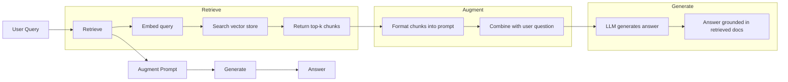
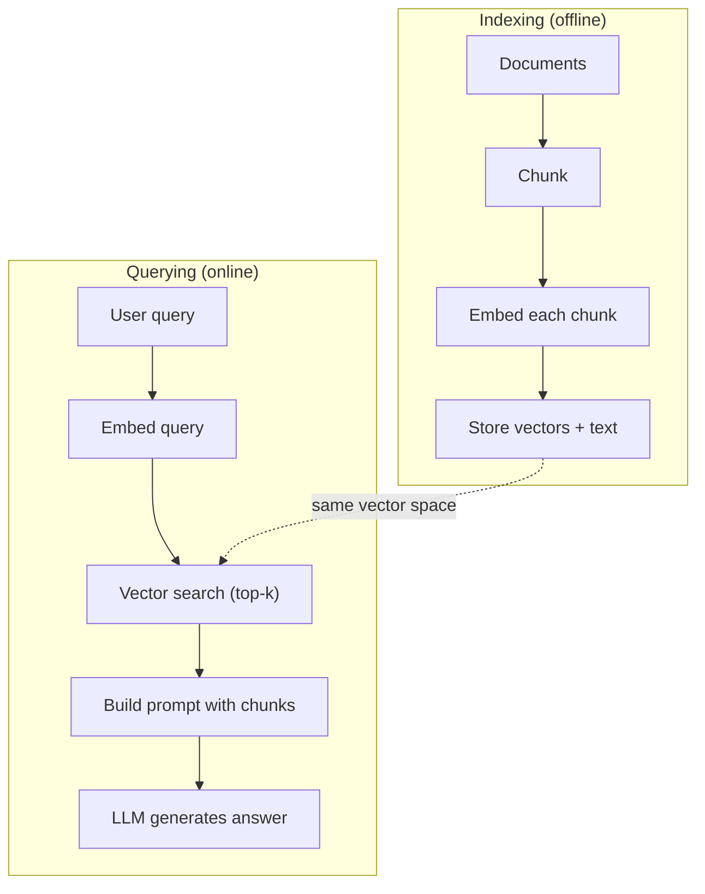

# RAG (Generowanie wspomagane wyszukiwaniem)

> Twój LLM posiada wiedzę aktualną tylko do momentu zakończenia swojego treningu. Nie wie nic o wewnętrznych dokumentach Twojej firmy, bazie kodu ani notatkach ze spotkań z zeszłego tygodnia. RAG (Retrieval-Augmented Generation) rozwiązuje ten problem, wyszukując odpowiednie dokumenty i dołączając je bezpośrednio do promptu. Jest to najpowszechniej stosowany wzorzec w produkcyjnych systemach AI. Jeśli masz wdrożyć choć jedno rozwiązanie z tego kursu, niech to będzie potok RAG.

**Typ:** Projekt szkoleniowy
**Język:** Python
**Wymagania wstępne:** Faza 10 (LLM-y od podstaw), Faza 11, lekcje 01-05
**Czas:** ~90 minut
**Powiązane lekcje:** Faza 5, lekcja 23 (Strategie segmentacji dla RAG) – omówienie sześciu algorytmów chunkingu i kryteriów ich wyboru. Faza 5, lekcja 22 (Szczegółowa analiza modeli embeddingowych) – jak dobrać odpowiedni model osadzeń. Faza 11, lekcja 07 (Zaawansowany RAG) – wyszukiwanie hybrydowe, reranking oraz transformacje zapytań.

## Cele nauczania

- Zbuduj kompletny potok RAG od podstaw: od ładowania dokumentów, przez segmentację (chunking), generowanie embeddingów, zapis w bazie wektorowej, aż po wyszukiwanie i generowanie odpowiedzi.
- Zaimplementuj wyszukiwanie semantyczne przy użyciu wektorowej bazy danych (Chroma, FAISS lub Pinecone) wraz z odpowiednim indeksowaniem.
- Zrozum, dlaczego RAG jest lepszym wyborem niż dostrajanie (fine-tuning) w systemach opartych na wyszukiwaniu wiedzy (analiza kosztów, aktualność danych, wiarygodność źródeł).
- Przeprowadź ewaluację jakości działania potoku RAG za pomocą metryk wyszukiwania (precision, recall) oraz generowania (groundedness, relevance).

## Problem biznesowy

Budujesz chatbota dla swojej firmy. Klient zadaje pytanie: „Jakie są zasady zwrotów w przypadku planów Enterprise?”. LLM generuje ogólną odpowiedź na temat typowych polityk zwrotów w modelach SaaS. Rzeczywiste wytyczne, ukryte w 200-stronicowej wewnętrznej dokumentacji wiki, mówią, że klienci korporacyjni mają prawo do 60-dniowego okna na proporcjonalny zwrot środków. LLM nigdy nie widział tego dokumentu, a model nie może wiedzieć o faktach, na których nie został przeszkolony.

Dostrajanie (fine-tuning) jest jednym z potencjalnych rozwiązań. Możesz wziąć model LLM, dotrenować go na wewnętrznych dokumentach i wdrożyć zaktualizowaną wersję. To podejście jednak generuje poważne wyzwania: proces ten wymaga ogromnej mocy obliczeniowej i kosztuje tysiące dolarów, model staje się nieaktualny w momencie modyfikacji choćby jednego dokumentu, nie mamy możliwości weryfikacji źródeł odpowiedzi, a każde przejęcie nowej linii produktów zmuszałoby nas do powtórzenia całego procesu szkolenia.

RAG oferuje znacznie lepsze podejście. Model bazowy pozostaje nietknięty. Kiedy użytkownik zadaje pytanie, system przeszukuje bazę dokumentów w poszukiwaniu najbardziej dopasowanych fragmentów, wstrzykuje je jako kontekst do promptu i pozwala modelowi wygenerować odpowiedź wyłącznie na ich podstawie. Baza dokumentów może zostać zaktualizowana w kilka minut, masz pełną kontrolę nad pobranymi źródłami, a sam model nigdy nie ulega zmianie. Właśnie dlatego RAG jest dominującym wzorcem produkcyjnym: jest tańszy, zawsze aktualny, w pełni audytowalny i kompatybilny z dowolnym LLM.

## Koncept architektoniczny

### Schemat działania RAG

Cały proces RAG zamyka się w czterech krokach:



Zapytanie -> Wyszukiwanie (Retrieve) -> Rozszerzenie promptu (Augment) -> Generowanie (Generate). Każdy system RAG działa według tego schematu. Różnice w systemach produkcyjnych sprowadzają się do szczegółów technicznych na poszczególnych etapach: metod segmentacji tekstu, doboru modeli embeddingów, technik wyszukiwania oraz optymalizacji konstrukcji promptu.

### Porównanie: RAG vs. Dostrajanie (Fine-tuning)

| Kategoria | Dostrajanie (Fine-tuning) | RAG |
|--------|------------|-----|
| Koszt | $1 000 - $100 000+ za jeden cykl treningowy | $0.01 - $0.10 za zapytanie (embedding + LLM) |
| Aktualność danych | Dane nieaktualne zaraz po treningu | Aktualizacja w kilka minut poprzez reindeksację bazy |
| Audytowalność | Brak możliwości dokładnej weryfikacji źródła | Pełny dostęp do wstrzykniętych segmentów źródłowych |
| Halucynacje | Model nadal podatny na halucynacje | Silne osadzenie (grounding) w podanym kontekście |
| Prywatność danych | Dane zapisane na stałe w wagach modelu | Dokumenty pozostają w zabezpieczonej bazie wektorowej |

Dostrajanie trwale modyfikuje wagi modelu (weights). RAG tymczasowo zmienia kontekst (context window) modelu. W większości aplikacji biznesowych to właśnie dynamiczne zarządzanie kontekstem jest kluczem do sukcesu.

Jedyny przypadek, w którym fine-tuning przewyższa RAG: sytuacja, gdy zależy nam, aby model przyjął bardzo specyficzny ton, styl wypowiedzi lub specyficzny schemat myślenia, którego nie da się wymusić instrukcjami w prompcie. W zadaniach związanych z wyszukiwaniem i analizą faktów RAG wygrywa w przedbiegach.

### Modele embeddingów

Model embeddingów przekształca tekst na gęsty wektor liczb rzeczywistych. Podobne semantycznie teksty tworzą wektory, które znajdują się blisko siebie w przestrzeni wielowymiarowej. Zdania „Jak zresetować hasło?” oraz „Muszę zmienić moje hasło” dadzą bardzo zbliżone wektory, pomimo użycia innych słów. Z kolei zdanie „Kot usiadł na macie” wygeneruje wektor z zupełnie innego obszaru przestrzeni.

Popularne modele embeddingów (stan na rok 2026 – szczegółowa analiza w fazie 5, lekcja 22):

| Model | Wymiary | Dostawca | Uwagi |
|-------|-----------|---------|-------|
| text-embedding-3-small | 1536 (Matryoshka) | OpenAI | Najlepszy stosunek jakości do ceny dla większości wdrożeń |
| text-embedding-3-large | 3072 (Matryoshka) | OpenAI | Maksymalna precyzja, wspiera redukcję wymiarowości do 256/512/1024 |
| Gemini Embedding v2 | 3072 (Matryoshka) | Google | Czołowe wyniki w rankingu MTEB; okno kontekstowe 8K |
| voyage-4 | 1024/2048 (Matryoshka) | Voyage AI | Dedykowane warianty dziedzinowe (kod, finanse, prawo) |
| Cohere Embed v4 | 1024 (Matryoshka) | Cohere | Świetne wsparcie wielojęzyczne, okno kontekstowe 128K |
| BGE-M3 | 1024 (Dense + Sparse + ColBERT) | BAAI (open-weights) | Potrójne podejście do wyszukiwania w ramach jednego modelu |
| Qwen3-Embedding | 4096 (Matryoshka) | Alibaba (open-weights) | Najlepsze wyniki wyszukiwania (retrieval) wśród modeli open-weights |
| all-MiniLM-L6-v2 | 384 | Open-weights | Lekki model bazowy do lokalnego prototypowania |

Na potrzeby tej lekcji napiszemy własny, prosty algorytm osadzania przy użyciu metody TF-IDF. Chociaż systemy produkcyjne nie korzystają z TF-IDF, to wdrożenie to idealnie obrazuje sam koncept: tekst wejściowy jest transformowany w wektor liczbowy, a zbliżone semantycznie teksty dają zbliżone do siebie wektory.

### Podobieństwo wektorowe

Mając dwa wektory, możemy zmierzyć stopień ich podobieństwa na trzy sposoby:

**Podobieństwo cosinusowe (Cosine similarity)**: cosinus kąta między dwoma wektorami. Przyjmuje wartości od -1 (wektory przeciwne) do 1 (identyczny kierunek). Metryka ta ignoruje długość wektorów, skupiając się wyłącznie na ich kierunku. Jest to domyślny wybór w potokach RAG.

```
cosine_sim(a, b) = dot(a, b) / (||a|| * ||b||)
```

**Iloczyn skalarny (Dot product)**: bezpośredni iloczyn wewnętrzny. Dłuższe teksty generujące większe wektory uzyskają wyższy wynik. Przydatny, gdy sama długość dokumentu niesie wartość informacyjną.

```
dot(a, b) = sum(a_i * b_i)
```

**Odległość L2 (euklidesowa)**: geometryczna odległość w linii prostej między punktami w przestrzeni. Mniejsza odległość oznacza wyższe podobieństwo. Metryka ta jest wrażliwa na różnice w długości wektorów.

```
L2(a, b) = sqrt(sum((a_i - b_i)^2))
```

Podobieństwo cosinusowe jest standardem w branży, ponieważ świetnie radzi sobie z tekstami o różnej długości dzięki normalizacji wektorów. Pojęcie „wyszukiwanie wektorowe” w kontekście RAG niemal zawsze odnosi się do podobieństwa cosinusowego.

### Strategie segmentacji (Chunking)

Dokumenty są zazwyczaj zbyt długie, by można było je efektywnie zakodować w postaci pojedynczego wektora. Przekształcenie 50-stronicowego dokumentu PDF w jeden wektor usunie kluczowe szczegóły, ponieważ wektor spróbuje uśrednić zbyt wiele tematów. Z tego powodu dokumenty dzieli się na mniejsze części (segmenty / chunks) i każdą z nich osadza osobno.

**Segmentacja o stałym rozmiarze**: podział tekstu co N tokenów. Metoda prosta i przewidywalna. Na przykład: segmenty o wielkości 512 tokenów z nakładaniem się (overlap) 50 tokenów oznaczają, że pierwszy segment obejmie tokeny 0–511, drugi 462–973 itd. Nakładanie się segmentów zapobiega przerwaniu zdań w losowych miejscach.

**Segmentacja semantyczna**: podział na logicznych granicach tekstu, np. akapitach, sekcjach lub nagłówkach Markdown. Każdy segment stanowi spójną tematycznie całość. Trudniejsza w implementacji, ale poprawia precyzję wyszukiwania.

**Segmentacja rekurencyjna**: próba podziału tekstu zaczynając od największych struktur (nagłówki sekcji). Jeśli dana sekcja nadal przekracza limit rozmiaru, algorytm dzieli ją na poziomie akapitów, a w razie konieczności na poziomie pojedynczych zdań. Jest to mechanizm działania popularnej klasy `RecursiveCharacterTextSplitter` i sprawdza się doskonale w większości zastosowań.

Wpływ rozmiaru segmentu na jakość RAG:
- **Zbyt mały (64-128 tokenów)**: segmenty są pozbawione kontekstu. Zdanie „wzrosły o 15% w ostatnim kwartale” jest bezużyteczne, jeśli nie wiemy, do jakiej metryki się odnosi.
- **Zbyt duży (ponad 2048 tokenów)**: segmenty zawierają zbyt wiele wątków, co rozmywa sygnał wektorowy. Szukając informacji o przychodach, otrzymasz fragment zawierający 10% danych o finansach i 90% opisu struktury zatrudnienia.
- **Optymalny zakres (256-512 tokenów)**: zapewnia optymalną dawkę kontekstu przy zachowaniu wysokiej precyzji semantycznej.

Większość produkcyjnych wdrożeń RAG opiera się na segmentach o rozmiarze 256–512 tokenów z overlapem na poziomie 50 tokenów.

### Wektorowe bazy danych

Po wygenerowaniu wektorów musimy zapisać je w strukturze umożliwiającej szybkie przeszukiwanie:

| Baza danych | Typ | Zastosowanie |
|---------|------|---------|
| FAISS | Biblioteka (in-memory) | Prototypowanie, małe i średnie zbiory danych |
| Chroma | Lekka baza danych | Lokalny development, mniejsze wdrożenia |
| Pinecone | Usługa zarządzana (SaaS) | Produkcja w chmurze (zero overheadu operacyjnego) |
| Weaviate | Silnik bazodanowy | Wydajne systemy self-hosted |
| pgvector | Rozszerzenie relacyjne | Integracja z istniejącą bazą PostgreSQL |
| Qdrant | Silnik bazodanowy | Wdrożenia wymagające maksymalnej wydajności |

Na potrzeby tej lekcji stworzymy własną bazę wektorową w pamięci operacyjnej (in-memory). Będzie ona przechowywać wektory na liście i realizować wyszukiwanie k-NN metodą brute-force. Jest to odpowiednik indeksu FAISS Flat. Takie rozwiązanie działa wydajnie dla zbiorów do 100 000 wektorów. Produkcyjne bazy danych stosują zaawansowane algorytmy wyszukiwania przybliżonego (ANN - Approximate Nearest Neighbor), takie jak HNSW, co pozwala przeszukiwać miliony wektorów w czasie kilku milisekund.

### Kompletny potok przetwarzania (Pipeline)



Proces indeksowania (offline) jest uruchamiany jednorazowo dla każdego dokumentu (lub przy jego aktualizacji). Proces wyszukiwania (online) wykonuje się w czasie rzeczywistym dla każdego zapytania użytkownika. W systemach produkcyjnych indeksowanie może przetwarzać miliony rekordów w tle, natomiast zapytanie użytkownika musi zostać obsłużone w czasie poniżej sekundy.

### Typowe parametry systemów produkcyjnych

- **Top-K**: pobieranie od 5 do 10 segmentów na zapytanie.
- **Rozmiar segmentu**: 256 do 512 tokenów (overlap = 50 tokenów).
- **Rozmiar wstrzykiwanego kontekstu**: 2500–5000 tokenów na zapytanie.
- **Całkowity rozmiar promptu**: ~8 000 – 16 000 tokenów (System Prompt + pobrany kontekst + historia rozmowy + zapytanie użytkownika).
- **Wymiarowość embeddingów**: od 384 do 3072 w zależności od modelu.
- **Wydajność indeksowania**: 100–1000 dokumentów na sekundę (przy użyciu batchingu i równoległych zapytań do API).
- **Opóźnienia (latency)**: 50–200 ms na wyszukiwanie wektorowe, 500–3000 ms na generowanie odpowiedzi przez LLM.

## Implementacja krok po kroku

### Krok 1: Segmentacja tekstu (Chunking)

```python
def chunk_text(text, chunk_size=200, overlap=50):
    words = text.split()
    chunks = []
    start = 0
    while start < len(words):
        end = start + chunk_size
        chunk = " ".join(words[start:end])
        chunks.append(chunk)
        start += chunk_size - overlap
    return chunks
```

### Krok 2: Generowanie wektorów przy użyciu TF-IDF

Napiszemy uproszczoną funkcję osadzania. TF-IDF (Term Frequency-Inverse Document Frequency) nie jest siecią neuronową, ale pozwala przekształcić tekst w wektory odzwierciedlające znaczenie słów. Słowa często występujące w danym segmencie otrzymują wysoki współczynnik TF. Słowa rzadkie w skali całego korpusu otrzymują wysoki współczynnik IDF. Ich iloczyn tworzy wektor, w którym unikalne i kluczowe słowa mają najwyższe wartości.

```python
import math
from collections import Counter

def build_vocabulary(documents):
    vocab = set()
    for doc in documents:
        vocab.update(doc.lower().split())
    return sorted(vocab)

def compute_tf(text, vocab):
    words = text.lower().split()
    count = Counter(words)
    total = len(words)
    return [count.get(word, 0) / total for word in vocab]

def compute_idf(documents, vocab):
    n = len(documents)
    idf = []
    for word in vocab:
        doc_count = sum(1 for doc in documents if word in doc.lower().split())
        idf.append(math.log((n + 1) / (doc_count + 1)) + 1)
    return idf

def tfidf_embed(text, vocab, idf):
    tf = compute_tf(text, vocab)
    return [t * i for t, i in zip(tf, idf)]
```

### Krok 3: Obliczanie podobieństwa cosinusowego i wyszukiwanie

```python
def cosine_similarity(a, b):
    dot = sum(x * y for x, y in zip(a, b))
    norm_a = math.sqrt(sum(x * x for x in a))
    norm_b = math.sqrt(sum(x * x for x in b))
    if norm_a == 0 or norm_b == 0:
        return 0.0
    return dot / (norm_a * norm_b)

def search(query_embedding, stored_embeddings, top_k=5):
    scores = []
    for i, emb in enumerate(stored_embeddings):
        sim = cosine_similarity(query_embedding, emb)
        scores.append((i, sim))
    scores.sort(key=lambda x: x[1], reverse=True)
    return scores[:top_k]
```

### Krok 4: Konstruowanie promptu RAG

W tym miejscu następuje „rozszerzenie” (Augment) w schemacie RAG. Pobieramy dopasowane segmenty, formatujemy je w spójny blok tekstu i przekazujemy jako kontekst do LLM.

```python
def build_rag_prompt(query, retrieved_chunks):
    context = "\n\n---\n\n".join(
        f"[Source {i+1}]\n{chunk}"
        for i, chunk in enumerate(retrieved_chunks)
    )
    return f"""Answer the question based ONLY on the following context.
If the context doesn't contain enough information, say "I don't have enough information to answer that."

Context:
{context}

Question: {query}

Answer:"""
```

### Krok 5: Integracja potoku RAG

```python
class RAGPipeline:
    def __init__(self):
        self.chunks = []
        self.embeddings = []
        self.vocab = []
        self.idf = []

    def index(self, documents):
        all_chunks = []
        for doc in documents:
            all_chunks.extend(chunk_text(doc))
        self.chunks = all_chunks
        self.vocab = build_vocabulary(all_chunks)
        self.idf = compute_idf(all_chunks, self.vocab)
        self.embeddings = [
            tfidf_embed(chunk, self.vocab, self.idf)
            for chunk in all_chunks
        ]

    def query(self, question, top_k=5):
        query_emb = tfidf_embed(question, self.vocab, self.idf)
        results = search(query_emb, self.embeddings, top_k)
        retrieved = [(self.chunks[i], score) for i, score in results]
        prompt = build_rag_prompt(
            question, [chunk for chunk, _ in retrieved]
        )
        return prompt, retrieved
```

### Krok 6: Generowanie odpowiedzi (Symulacja)

Na potrzeby tego projektu zasymulujemy generowanie odpowiedzi przez wyszukanie zdania z kontekstu, które wykazuje największą zbieżność słów z zapytaniem użytkownika. W warunkach produkcyjnych w tym miejscu wywoływane jest API modelu językowego.

```python
def simple_generate(prompt, retrieved_chunks):
    query_words = set(prompt.lower().split("question:")[-1].split())
    best_sentence = ""
    best_score = 0
    for chunk in retrieved_chunks:
        for sentence in chunk.split("."):
            sentence = sentence.strip()
            if not sentence:
                continue
            words = set(sentence.lower().split())
            overlap = len(query_words & words)
            if overlap > best_score:
                best_score = overlap
                best_sentence = sentence
    return best_sentence if best_sentence else "I don't have enough information."
```

## Praca z produkcyjnymi API

Używając rzeczywistych modeli embeddingów oraz API LLM, struktura kodu pozostaje niemal bez zmian:

```python
from openai import OpenAI

client = OpenAI()

def embed(text):
    response = client.embeddings.create(
        model="text-embedding-3-small",
        input=text
    )
    return response.data[0].embedding

def generate(prompt):
    response = client.chat.completions.create(
        model="gpt-4o-mini",
        messages=[{"role": "user", "content": prompt}],
        temperature=0
    )
    return response.choices[0].message.content
```

Lub przy integracji z modelami Anthropic:

```python
import anthropic

client = anthropic.Anthropic()

def generate(prompt):
    response = client.messages.create(
        model="claude-sonnet-4-20250514",
        max_tokens=1024,
        messages=[{"role": "user", "content": prompt}]
    )
    return response.content[0].text
```

Aby obsłużyć dane na dużą skalę, zamieniamy wyszukiwanie Flat (brute-force) na dedykowaną wektorową bazę danych:

```python
import chromadb

client = chromadb.Client()
collection = client.create_collection("my_docs")

collection.add(
    documents=chunks,
    ids=[f"chunk_{i}" for i in range(len(chunks))]
)

results = collection.query(
    query_texts=["What is the refund policy?"],
    n_results=5
)
```

Chroma automatycznie wygeneruje embeddingi w tle (domyślnie przy użyciu lokalnego modelu `all-MiniLM-L6-v2`) i zapisze je w zoptymalizowanym indeksie. Schemat działania pozostaje ten sam, zmienia się tylko wydajność warstwy technicznej.

## Powiązane zasoby (Artefakty)

W ramach tej lekcji otrzymujesz dostęp do:
- [prompt-rag-architect.md](../outputs/prompt-rag-architect.md) – system prompt wspierający projektowanie systemów RAG dla specyficznych wyzwań biznesowych.
- [skill-rag-pipeline.md](../outputs/skill-rag-pipeline.md) – plik instruktażowy (skill) uczący agenta, jak implementować, debugować i optymalizować potoki RAG.

## Ćwiczenia praktyczne

1. Zastąp algorytm TF-IDF najprostszą reprezentacją typu Bag-of-Words (wektor binarny: 1 jeśli słowo występuje w tekście, 0 jeśli nie). Porównaj jakość wyszukiwania dla kilku testowych zapytań. Zaobserwuj, dlaczego TF-IDF daje lepsze rezultaty dzięki odpowiedniemu pozycjonowaniu unikalnych słów.

2. Przetestuj wpływ rozmiaru segmentacji (chunk size): podziel ten sam dokument na segmenty o długości 50, 100, 200 oraz 500 słów. Dla każdej konfiguracji uruchom 5 identycznych zapytań i sprawdź, czy poprawny dokument znajduje się w Top-3 wyników. Wyznacz optymalny rozmiar segmentu (sweet spot).

3. Rozbuduj strukturę metadanych dla każdego segmentu (np. nazwa pliku źródłowego, numer akapitu). Zmodyfikuj szablon promptu RAG w taki sposób, aby wymusić na LLM cytowanie konkretnych źródeł przy udzielaniu odpowiedzi.

4. Zbuduj prosty skrypt ewaluacyjny: przygotuj 10 par pytanie-odpowiedź na podstawie dokumentów źródłowych. Przepuść zapytania przez potok RAG i zmierz, w jakim procencie przypadków pobrane segmenty zawierają poprawną odpowiedź (metryka Retrieval Recall@K).

5. Zaimplementuj obsługę konwersacji (Conversational RAG): przechowuj w pamięci historię 3 ostatnich tur dialogu i dołączaj je do kontekstu wraz z pobranymi dokumentami. Sprawdź, czy model potrafi poprawnie zinterpretować zapytanie uszczegóławiające (np. „A co z wersją Enterprise?” zadane tuż po pytaniu o cennik).

## Słownik pojęć

| Termin | Co mówią deweloperzy | Co to oznacza w rzeczywistości |
|------|----------------|----------------------|
| **RAG** | „AI czytające dokumenty” | Potok polegający na pobraniu pasujących dokumentów, wstrzyknięciu ich do promptu i wygenerowaniu odpowiedzi w oparciu o ten kontekst. |
| **Embedding** | „Liczbowa reprezentacja tekstu” | Gęsty wektor liczb rzeczywistych reprezentujący znaczenie semantyczne tekstu; podobne teksty mają zbliżone wektory. |
| **Baza wektorowa** | „Wyszukiwarka semantyczna” | Baza danych zoptymalizowana pod kątem szybkiego wyszukiwania najbliższych sąsiadów (k-NN/ANN) w przestrzeniach wielowymiarowych. |
| **Segment (Chunk)** | „Kawałek dokumentu” | Fragment tekstu (zazwyczaj 256–512 tokenów) powstały w wyniku podziału dużego dokumentu, ułatwiający precyzyjne wyszukiwanie. |
| **Podobieństwo cosinusowe** | „Miara zbieżności wektorów” | Cosinus kąta między dwoma wektorami; wartość 1 oznacza identyczny kierunek, 0 – brak powiązania (wektory ortogonalne). |
| **Top-K Retrieval** | „Pobranie k najlepszych wyników” | Operacja zwrócenia K najbardziej podobnych semantycznie segmentów na podstawie zapytania użytkownika. |
| **Okno kontekstowe** | „Pamięć robocza modelu” | Maksymalna liczba tokenów, jaką model LLM może przetworzyć w ramach jednego zapytania (uwzględniając prompt systemowy, RAG i historię). |
| **Groundedness** | „Osadzenie w faktach” | Miara określająca, w jakim stopniu odpowiedź LLM bazuje wyłącznie na dostarczonym kontekście (brak halucynacji). |
| **TF-IDF** | „Wycena unikalności słów” | Klasyczny algorytm statystyczny ważący znaczenie słów w tekście na podstawie ich częstotliwości w segmencie oraz rzadkości w całym korpusie. |
| **Indeksowanie** | „Budowanie indeksu” | Proces offline obejmujący segmentację dokumentów, generowanie wektorów i zapisywanie ich w bazie danych na potrzeby późniejszego wyszukiwania. |

## Sugerowane lektury

- [Lewis et al., „Retrieval-Augmented Generation for Knowledge-Intensive NLP Tasks” (2020)](https://arxiv.org/abs/2005.11401) – przełomowa publikacja Facebook AI Research wprowadzająca i formalizująca wzorzec RAG.
- [Dokumentacja Anthropic dotyczącą RAG](https://docs.anthropic.com) – praktyczne porady inżynieryjne w zakresie doboru rozmiaru segmentów, optymalizacji promptów i metod ewaluacji.
- [Baza wiedzy Pinecone (Learning Center)](https://www.pinecone.io/learn/) – doskonałe, wizualne objaśnienia architektury RAG oraz wyzwań związanych ze skalowaniem systemów produkcyjnych.
- [Reimers & Gurevych, „Sentence-BERT: Sentence Embeddings using Siamese BERT-Networks” (2019)](https://arxiv.org/abs/1908.10084) – fundamentalna praca na temat modeli SentenceTransformers, na których bazuje większość współczesnych modeli embeddingów.
- [Karpukhin et al., „Dense Passage Retrieval for Open-Domain Question Answering” (EMNLP 2020)](https://arxiv.org/abs/2004.04906) – publikacja dowodząca wyższości wyszukiwania wektorowego (dense retrieval) nad klasycznym wyszukiwaniem słów kluczowych (BM25) w systemach Q&A.
- [Podstawowe pojęcia w dokumentacji LlamaIndex](https://docs.llamaindex.ai) – świetne omówienie modułów wchodzących w skład nowoczesnych frameworków RAG (Loaders, Parsers, Indexers, Query Engines).
- [Samouczek LangChain RAG](https://python.langchain.com) – przewodnik po tworzeniu łańcuchów przetwarzania (Chains) realizujących wzorzec „Retrieve-and-Generate”.
