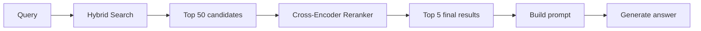
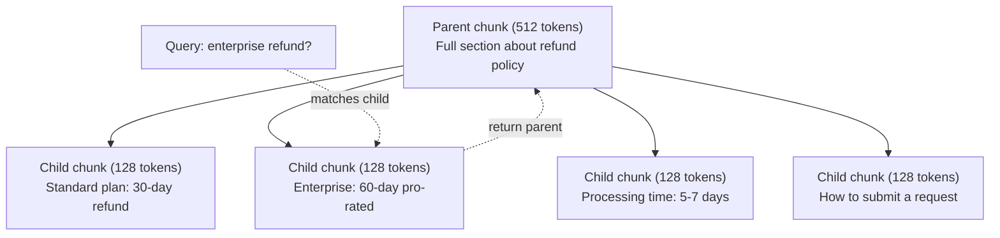
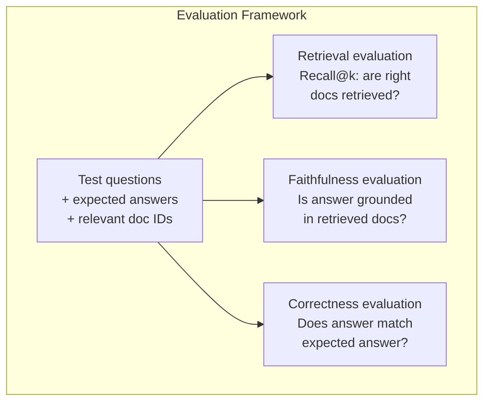

# Zaawansowane RAG (dzielenie, zmiana rankingu, wyszukiwanie hybrydowe)

> Podstawowy RAG pobiera górne k najbardziej podobnych fragmentów. To działa w przypadku prostych pytań. Rozpada się w przypadku rozumowania wieloprzeskokowego, niejednoznacznych zapytań i dużych korpusów. Zaawansowane RAG to różnica pomiędzy demo, które działa na 10 dokumentach, a systemem, który działa na 10 milionach.

**Typ:** Kompilacja
**Języki:** Python
**Wymagania wstępne:** Faza 11, lekcja 06 (RAG)
**Czas:** ~90 minut
**Powiązane:** Faza 5 · 23 (Strategie fragmentowania dla RAG) obejmuje wszystkie sześć algorytmów dzielenia na kawałki — rekursywny, semantyczny, zdanie, dokument nadrzędny, późne fragmenty, pobieranie kontekstowe — z testami porównawczymi Vectara/Anthropic. Ta lekcja opiera się na najważniejszych informacjach: wyszukiwanie hybrydowe, reranking, transformacja zapytań.

## Cele nauczania

- Wdrażaj zaawansowane strategie fragmentacji (semantyczne, rekurencyjne, rodzic-dziecko), które zachowują strukturę i kontekst dokumentu
- Zbuduj hybrydowy potok wyszukiwania, łącząc dopasowanie słów kluczowych BM25 z wyszukiwaniem wektorów semantycznych i funkcją zmiany rankingu między koderami
- Zastosuj techniki transformacji zapytań (HyDE, wiele zapytań, krok wstecz), aby usprawnić wyszukiwanie niejednoznacznych lub złożonych pytań
- Diagnozuj i napraw typowe awarie RAG: pobrano niewłaściwy fragment, odpowiedź nie w kontekście, awaria rozumowania z wieloma przeskokami

## Problem

Zbudowałeś podstawowy potok RAG w Lekcji 06. Działa on w przypadku prostych pytań w małym korpusie. Teraz wypróbuj te:

**Niejednoznaczne zapytanie**: „Jakie były przychody w zeszłym kwartale?” Wyszukiwanie semantyczne zwraca fragmenty dotyczące strategii przychodów, prognoz przychodów i przemyśleń dyrektora finansowego na temat wzrostu przychodów. Wszystko semantycznie podobne do słowa „przychody”. Żaden nie zawiera rzeczywistej liczby. Prawidłowy fragment to „$47.2M in Q3 2025" but uses the word "earnings" instead of "revenue." The embedding model thinks "revenue strategy" is closer to the query than "Q3 earnings were $47,2M”.

**Pytanie obejmujące wiele przeskoków**: „Który zespół odnotował największą poprawę wyniku zadowolenia klienta?” Wymaga to znalezienia wyników satysfakcji dla każdego zespołu, porównania ich i określenia maksimum. Żaden fragment nie zawiera odpowiedzi. Informacje są rozproszone po raportach zespołów.

**Problem z dużym korpusem**: Masz 2 miliony kawałków. Prawidłowa odpowiedź znajduje się w fragmencie #1,847,293. Twoje 5 najlepszych wyników obejmuje fragmenty #14, #89,201, #1,200,000, #44 i #901,333. Zamknij przestrzeń osadzania, ale żadna nie zawiera odpowiedzi. W tej skali przybliżone wyszukiwanie najbliższego sąsiada wprowadza wystarczający błąd, że odpowiednie wyniki zostaną wypchnięte poza górne k.

Podstawowy RAG zawodzi, ponieważ podobieństwo wektorów to nie to samo, co trafność. Fragment może być semantycznie podobny do zapytania, ale nie być użyteczny przy udzielaniu odpowiedzi. Advanced RAG rozwiązuje ten problem za pomocą czterech technik: wyszukiwania hybrydowego (dodaj dopasowanie słów kluczowych), zmiany rankingu (bardziej ostrożna ocena kandydatów), transformacji zapytań (napraw zapytanie przed wyszukiwaniem) i lepszego fragmentowania (pobieranie z odpowiednią szczegółowością).

## Koncepcja

### Wyszukiwanie hybrydowe: semantyczne + słowo kluczowe

Wyszukiwanie semantyczne (podobieństwo wektorów) dobrze radzi sobie ze zrozumieniem znaczenia. „Jak anulować subskrypcję?” pasuje do „Kroków prowadzących do zakończenia planu”, mimo że nie zawierają żadnych słów. Brakuje jednak dokładnych dopasowań. „Kod błędu E-4021” może nie pasować do fragmentu zawierającego „E-4021”, jeśli model osadzania traktuje go jako szum.

Wyszukiwanie słów kluczowych (BM25) jest odwrotne. Świetnie radzi sobie z dokładnymi dopasowaniami. „E-4021” pasuje idealnie. Jednak opcja „anuluj moją subskrypcję” zwraca zero wyników, jeśli w dokumencie jest napisane „zakończ swój plan”.

Wyszukiwanie hybrydowe uruchamia oba, a następnie łączy wyniki.

**BM25** (Najlepsze dopasowanie 25) to standardowy algorytm wyszukiwania słów kluczowych. Jest podstawą wyszukiwarek od lat 90. XX wieku. Formuła:

```
BM25(q, d) = sum over terms t in q:
    IDF(t) * (tf(t,d) * (k1 + 1)) / (tf(t,d) + k1 * (1 - b + b * |d| / avgdl))
```

Gdzie tf(t,d) jest częstotliwością terminu t w dokumencie d, IDF(t) jest odwrotną częstotliwością dokumentu, |d| to długość dokumentu, avgdl to średnia długość dokumentu, k1 kontroluje nasycenie częstotliwości terminów (domyślnie 1,2), a b kontroluje normalizację długości (domyślnie 0,75).

Mówiąc prosto: BM25 ocenia dokumenty wyżej, jeśli zawierają terminy będące przedmiotem zapytania (szczególnie rzadkie), ale przy malejących zyskach w przypadku powtarzających się terminów. Dokument zawierający słowo „przychody” 50 razy nie jest 50 razy bardziej trafny niż ten, w którym występuje ono raz.

### Fuzja rang wzajemnych (RRF)

Masz dwie listy rankingowe: jedną z wyszukiwania wektorowego, drugą z BM25. Jak je łączysz? Wzajemna fuzja rang jest podejściem standardowym.

```
RRF_score(d) = sum over rankings R:
    1 / (k + rank_R(d))
```

Gdzie k jest stałą (zwykle 60), która zapobiega dominacji wyniku o najwyższym rankingu.

Dokument zajmujący 1. miejsce w wyszukiwaniu wektorowym i 5. w BM25 otrzymuje: 1/(60+1) + 1/(60+5) = 0,0164 + 0,0154 = 0,0318

Dokument zajmujący 3. miejsce w wyszukiwaniu wektorowym i 2. miejsce w BM25 otrzymuje: 1/(60+3) + 1/(60+2) = 0,0159 + 0,0161 = 0,0320

RRF w naturalny sposób równoważy oba sygnały. Dokument, który zajmie wysokie miejsca na obu listach, otrzyma najlepszą ocenę. Dokument, który zajmuje pierwsze miejsce na jednej liście, ale nie ma go na drugiej, otrzymuje umiarkowaną ocenę. Jest to solidny system, ponieważ wykorzystuje rangi, a nie surowe wyniki, zatem różnice w rozkładach wyników pomiędzy obydwoma systemami nie mają znaczenia.

### Zmiana rankingu

Pobieranie (wektorowe, kluczowe lub hybrydowe) jest szybkie, ale nieprecyzyjne. Wykorzystuje bi-enkodery: zapytanie i każdy dokument są osadzane niezależnie, a następnie porównywane. Osadzenia są obliczane raz i buforowane. Dotyczy to milionów dokumentów.

W rerankingu wykorzystuje się kodery krzyżowe: zapytanie i dokument kandydujący są wprowadzane razem do modelu, który generuje wynik trafności. Model widzi oba teksty jednocześnie i może uchwycić szczegółowe interakcje między nimi. Osoba korzystająca z cross-enkodera może zrozumieć, że „Jakie były zarobki za trzeci kwartał?” jest bardzo istotne w przypadku fragmentu zawierającego „47,2 mln dolarów w trzecim kwartale”, nawet jeśli podwójny koder utracił połączenie.

Kompromis: kodery krzyżowe są 100–1000 razy wolniejsze niż kodery podwójne, ponieważ wspólnie przetwarzają parę zapytanie-dokument. Nie można wstępnie obliczyć wyników cross-enkodera dla miliona dokumentów. Rozwiązanie: pobierz większy zestaw kandydatów (50 najlepszych z wyszukiwania hybrydowego), a następnie zmień klasyfikację za pomocą kodera krzyżowego, aby uzyskać ostateczną piątkę najlepszych.



Typowe modele rerankingu (skład na 2026 r.):
- Cohere Rerank 3.5: zarządzany interfejs API, wielojęzyczny, najlepszy przyrost zapamiętywania w korpusach mieszanych
- Reranking Voyage - 2.5: zarządzane API, najniższe opóźnienie spośród hostowanych opcji
- Jina-Reranker-v2 Wielojęzyczny: wersja otwarta, ponad 100 języków
- bge-reranker-v2-m3: otwarta waga, mocna linia bazowa
- cross-encoder/ms-marco-MiniLM-L-6-v2: open-weight, działa na procesorze do prototypowania
- ColBERTv2 / Jina-ColBERT-v2: wielowektorowe rerankery w późnej interakcji — O(tokeny), a nie O(dokumenty) w momencie punktacji

### Transformacja zapytania

Czasami problemem nie jest pobieranie, ale samo zapytanie. „Co takiego było w tej nowej zmianie polityki?” to straszne zapytanie. Nie zawiera żadnych konkretnych terminów. Osadzanie jest niejasne. Żaden system wyszukiwania nie jest w stanie znaleźć w ten sposób odpowiednich dokumentów.

**Przepisywanie zapytania**: zmień sformułowanie zapytania użytkownika na lepsze zapytanie. LLM może to zrobić:

```
User: "What was that thing about the new policy change?"
Rewritten: "Recent policy changes and updates"
```

**HyDE (Hipotetyczne osadzanie dokumentów)**: zamiast szukać za pomocą zapytania, wygeneruj hipotetyczną odpowiedź, osadź ją i wyszukaj podobne, rzeczywiste dokumenty.

```
Query: "What is the refund policy for enterprise?"
Hypothetical answer: "Enterprise customers are eligible for a full refund
within 60 days of purchase. Refunds are pro-rated based on the remaining
subscription period and processed within 5-7 business days."
```

Osadź hipotetyczną odpowiedź i wyszukaj prawdziwe dokumenty podobne do niej. Intuicja: hipotetyczna odpowiedź żyje bliżej w osadzaniu przestrzeni prawdziwej odpowiedzi niż pierwotne pytanie. Pytania i odpowiedzi mają różne struktury językowe. Generując hipotetyczną odpowiedź, wypełniasz lukę pomiędzy „przestrzenią pytań” a „przestrzenią odpowiedzi” w osadzaniu.

HyDE dodaje jedno połączenie LLM przed pobraniem. Zwiększa to opóźnienie o 500–2000 ms. Warto, gdy jakość wyszukiwania w przypadku nieprzetworzonych zapytań jest niska.

### Podział rodzic-dziecko

Standardowe fragmentowanie wymusza kompromis: małe fragmenty umożliwiają precyzyjne wyszukiwanie, duże fragmenty zapewniają wystarczający kontekst. Podział rodzic-dziecko eliminuje ten kompromis.

Indeksuj małe fragmenty (128 tokenów) w celu odzyskania. Po pobraniu małego fragmentu zwróć jego fragment nadrzędny (512 tokenów), aby wyświetlić monit. Mały fragment dokładnie pasuje do zapytania. Fragment nadrzędny zapewnia wystarczający kontekst, aby LLM mógł wygenerować dobrą odpowiedź.



Zapytanie „zwrot dla przedsiębiorstwa?” dokładnie pasuje do fragmentu potomnego C2. Jednak zachęta otrzymuje pełny fragment nadrzędny P, który zawiera otaczający kontekst dotyczący czasu przetwarzania i procesu przesyłania.

### Filtrowanie metadanych

Przed uruchomieniem wyszukiwania wektorowego przefiltruj korpus według metadanych: data, źródło, kategoria, autor, język. Zmniejsza to przestrzeń wyszukiwania i zapobiega nieistotnym wynikom.

„Co zmieniło się w polityce bezpieczeństwa w zeszłym miesiącu?” w kategorii bezpieczeństwa należy wyszukiwać wyłącznie dokumenty z ostatnich 30 dni. Bez filtrowania metadanych przeszukujesz cały korpus i możesz odzyskać dokument bezpieczeństwa sprzed dwóch lat, który jest semantycznie podobny.

Systemy produkcyjne RAG przechowują metadane obok każdej porcji: dokument źródłowy, datę utworzenia, kategorię, autora, wersję. Wektorowe bazy danych obsługują wstępne filtrowanie według metadanych przed wyszukiwaniem podobieństw, co ma kluczowe znaczenie dla wydajności na dużą skalę.

### Ocena

Zbudowałeś system RAG. Skąd wiesz, czy to działa? Trzy wskaźniki:

**Istotność wyszukiwania (Recall@k)**: w przypadku zestawu pytań testowych ze znanymi odpowiednimi dokumentami, jaki procent odpowiednich dokumentów pojawia się w wynikach z najwyższej półki? Jeśli odpowiedź na pytanie znajduje się w fragmencie nr 47, czy fragment nr 47 pojawia się w pierwszej piątce?

**Wierność**: czy wygenerowana odpowiedź opiera się na odnalezionych dokumentach? Jeśli na pobranych fragmentach widnieje informacja „60-dniowe okno zwrotu”, a model mówi „90-dniowy okres zwrotu”, oznacza to brak wierności. Modelka miała halucynacje, mimo że miała odpowiedni kontekst.

**Prawidłowość odpowiedzi**: czy wygenerowana odpowiedź jest zgodna z oczekiwaną? Jest to metryka typu end-to-end. Łączy w sobie jakość wyszukiwania i jakość generowania.

Prosta kontrola wierności: weź każde roszczenie z wygenerowanej odpowiedzi i sprawdź, czy pojawia się (w istocie) w odzyskanych fragmentach. Jeśli odpowiedź zawiera fakt, którego nie ma w żadnym odzyskanym fragmencie, prawdopodobnie jest to halucynacja.



## Zbuduj to

### Krok 1: Wdrożenie BM25

```python
import math
from collections import Counter

class BM25:
    def __init__(self, k1=1.2, b=0.75):
        self.k1 = k1
        self.b = b
        self.docs = []
        self.doc_lengths = []
        self.avg_dl = 0
        self.doc_freqs = {}
        self.n_docs = 0

    def index(self, documents):
        self.docs = documents
        self.n_docs = len(documents)
        self.doc_lengths = []
        self.doc_freqs = {}

        for doc in documents:
            words = doc.lower().split()
            self.doc_lengths.append(len(words))
            unique_words = set(words)
            for word in unique_words:
                self.doc_freqs[word] = self.doc_freqs.get(word, 0) + 1

        self.avg_dl = sum(self.doc_lengths) / self.n_docs if self.n_docs else 1

    def score(self, query, doc_idx):
        query_words = query.lower().split()
        doc_words = self.docs[doc_idx].lower().split()
        doc_len = self.doc_lengths[doc_idx]
        word_counts = Counter(doc_words)
        score = 0.0

        for term in query_words:
            if term not in word_counts:
                continue
            tf = word_counts[term]
            df = self.doc_freqs.get(term, 0)
            idf = math.log((self.n_docs - df + 0.5) / (df + 0.5) + 1)
            numerator = tf * (self.k1 + 1)
            denominator = tf + self.k1 * (1 - self.b + self.b * doc_len / self.avg_dl)
            score += idf * numerator / denominator

        return score

    def search(self, query, top_k=10):
        scores = [(i, self.score(query, i)) for i in range(self.n_docs)]
        scores.sort(key=lambda x: x[1], reverse=True)
        return scores[:top_k]
```

### Krok 2: Wzajemna fuzja rang

```python
def reciprocal_rank_fusion(ranked_lists, k=60):
    scores = {}
    for ranked_list in ranked_lists:
        for rank, (doc_id, _) in enumerate(ranked_list):
            if doc_id not in scores:
                scores[doc_id] = 0.0
            scores[doc_id] += 1.0 / (k + rank + 1)
    fused = sorted(scores.items(), key=lambda x: x[1], reverse=True)
    return fused
```

### Krok 3: Potok wyszukiwania hybrydowego

```python
def hybrid_search(query, chunks, vector_embeddings, vocab, idf, bm25_index, top_k=5, fusion_k=60):
    query_emb = tfidf_embed(query, vocab, idf)
    vector_results = search(query_emb, vector_embeddings, top_k=top_k * 3)
    bm25_results = bm25_index.search(query, top_k=top_k * 3)
    fused = reciprocal_rank_fusion([vector_results, bm25_results], k=fusion_k)
    return fused[:top_k]
```

### Krok 4: Prosta zmiana rankingu

W produkcji użyłbyś modelu cross-enkodera. W tym miejscu tworzymy moduł rerankingu, który ocenia trafność zapytania i dokumentu na podstawie nakładania się słów, ważności terminów i dopasowania fraz.

```python
def rerank(query, candidates, chunks):
    query_words = set(query.lower().split())
    stop_words = {"the", "a", "an", "is", "are", "was", "were", "what", "how",
                  "why", "when", "where", "do", "does", "for", "of", "in", "to",
                  "and", "or", "on", "at", "by", "it", "its", "this", "that",
                  "with", "from", "be", "has", "have", "had", "not", "but"}
    query_terms = query_words - stop_words

    scored = []
    for doc_id, initial_score in candidates:
        chunk = chunks[doc_id].lower()
        chunk_words = set(chunk.split())

        term_overlap = len(query_terms & chunk_words)

        query_bigrams = set()
        q_list = [w for w in query.lower().split() if w not in stop_words]
        for i in range(len(q_list) - 1):
            query_bigrams.add(q_list[i] + " " + q_list[i + 1])
        bigram_matches = sum(1 for bg in query_bigrams if bg in chunk)

        position_boost = 0
        for term in query_terms:
            pos = chunk.find(term)
            if pos != -1 and pos < len(chunk) // 3:
                position_boost += 0.5

        rerank_score = (
            term_overlap * 1.0
            + bigram_matches * 2.0
            + position_boost
            + initial_score * 5.0
        )
        scored.append((doc_id, rerank_score))

    scored.sort(key=lambda x: x[1], reverse=True)
    return scored
```

### Krok 5: HyDE (hipotetyczne osadzanie dokumentów)

```python
def hyde_generate_hypothesis(query):
    templates = {
        "what": "The answer to '{query}' is as follows: Based on our documentation, {topic} involves specific policies and procedures that define how the process works.",
        "how": "To address '{query}': The process involves several steps. First, you need to initiate the request. Then, the system processes it according to the defined rules.",
        "default": "Regarding '{query}': Our records indicate specific details and policies related to this topic that provide a comprehensive answer."
    }
    query_lower = query.lower()
    if query_lower.startswith("what"):
        template = templates["what"]
    elif query_lower.startswith("how"):
        template = templates["how"]
    else:
        template = templates["default"]

    topic_words = [w for w in query.lower().split()
                   if w not in {"what", "is", "the", "how", "do", "does", "a", "an",
                                "for", "of", "to", "in", "on", "at", "by", "and", "or"}]
    topic = " ".join(topic_words) if topic_words else "this topic"

    return template.format(query=query, topic=topic)

def hyde_search(query, chunks, vector_embeddings, vocab, idf, top_k=5):
    hypothesis = hyde_generate_hypothesis(query)
    hypothesis_emb = tfidf_embed(hypothesis, vocab, idf)
    results = search(hypothesis_emb, vector_embeddings, top_k)
    return results, hypothesis
```

### Krok 6: Podział rodzic-dziecko

```python
def create_parent_child_chunks(text, parent_size=200, child_size=50):
    words = text.split()
    parents = []
    children = []
    child_to_parent = {}

    parent_idx = 0
    start = 0
    while start < len(words):
        parent_end = min(start + parent_size, len(words))
        parent_text = " ".join(words[start:parent_end])
        parents.append(parent_text)

        child_start = start
        while child_start < parent_end:
            child_end = min(child_start + child_size, parent_end)
            child_text = " ".join(words[child_start:child_end])
            child_idx = len(children)
            children.append(child_text)
            child_to_parent[child_idx] = parent_idx
            child_start += child_size

        parent_idx += 1
        start += parent_size

    return parents, children, child_to_parent
```

### Krok 7: Ocena wierności

```python
def evaluate_faithfulness(answer, retrieved_chunks):
    answer_sentences = [s.strip() for s in answer.split(".") if len(s.strip()) > 10]
    if not answer_sentences:
        return 1.0, []

    grounded = 0
    ungrounded = []
    context = " ".join(retrieved_chunks).lower()

    for sentence in answer_sentences:
        words = set(sentence.lower().split())
        stop_words = {"the", "a", "an", "is", "are", "was", "were", "and", "or",
                      "to", "of", "in", "for", "on", "at", "by", "it", "this", "that"}
        content_words = words - stop_words
        if not content_words:
            grounded += 1
            continue

        matched = sum(1 for w in content_words if w in context)
        ratio = matched / len(content_words) if content_words else 0

        if ratio >= 0.5:
            grounded += 1
        else:
            ungrounded.append(sentence)

    score = grounded / len(answer_sentences) if answer_sentences else 1.0
    return score, ungrounded

def evaluate_retrieval_recall(queries_with_relevant, retrieval_fn, k=5):
    total_recall = 0.0
    results = []

    for query, relevant_indices in queries_with_relevant:
        retrieved = retrieval_fn(query, k)
        retrieved_indices = set(idx for idx, _ in retrieved)
        relevant_set = set(relevant_indices)
        hits = len(retrieved_indices & relevant_set)
        recall = hits / len(relevant_set) if relevant_set else 1.0
        total_recall += recall
        results.append({
            "query": query,
            "recall": recall,
            "hits": hits,
            "total_relevant": len(relevant_set)
        })

    avg_recall = total_recall / len(queries_with_relevant) if queries_with_relevant else 0
    return avg_recall, results
```

## Użyj tego

Z prawdziwym cross-enkoderem do rerankingu:

```python
from sentence_transformers import CrossEncoder

reranker = CrossEncoder("cross-encoder/ms-marco-MiniLM-L-6-v2")

def rerank_with_cross_encoder(query, candidates, chunks, top_k=5):
    pairs = [(query, chunks[doc_id]) for doc_id, _ in candidates]
    scores = reranker.predict(pairs)
    scored = list(zip([doc_id for doc_id, _ in candidates], scores))
    scored.sort(key=lambda x: x[1], reverse=True)
    return scored[:top_k]
```

Dzięki zarządzanemu rerankerowi Cohere:

```python
import cohere

co = cohere.Client()

def rerank_with_cohere(query, candidates, chunks, top_k=5):
    docs = [chunks[doc_id] for doc_id, _ in candidates]
    response = co.rerank(
        model="rerank-english-v3.0",
        query=query,
        documents=docs,
        top_n=top_k
    )
    return [(candidates[r.index][0], r.relevance_score) for r in response.results]
```

Dla HyDE z prawdziwym LLM:

```python
import anthropic

client = anthropic.Anthropic()

def hyde_with_llm(query):
    response = client.messages.create(
        model="claude-sonnet-4-20250514",
        max_tokens=256,
        messages=[{
            "role": "user",
            "content": f"Write a short paragraph that would be a good answer to this question. Do not say you don't know. Just write what the answer would look like.\n\nQuestion: {query}"
        }]
    )
    return response.content[0].text
```

W przypadku produkcyjnego wyszukiwania hybrydowego za pomocą Weaviate:

```python
import weaviate

client = weaviate.connect_to_local()

collection = client.collections.get("Documents")
response = collection.query.hybrid(
    query="enterprise refund policy",
    alpha=0.5,
    limit=10
)
```

Parametr alfa kontroluje równowagę: 0,0 = czyste słowo kluczowe (BM25), 1,0 = czysty wektor, 0,5 = równa waga. Większość systemów produkcyjnych używa wartości alfa od 0,3 do 0,7.

## Wyślij to

Ta lekcja daje:
- `outputs/prompt-advanced-rag-debugger.md` – monit o diagnozowanie i naprawianie problemów z jakością RAG
- `outputs/skill-advanced-rag.md` – umiejętność tworzenia RAG klasy produkcyjnej za pomocą wyszukiwania hybrydowego i zmiany rankingu

## Ćwiczenia

1. Porównaj BM25 z wyszukiwaniem wektorowym i hybrydowym na przykładowych dokumentach. Dla każdego z 5 zapytań testowych zapisz, które podejście zwraca najbardziej odpowiedni fragment na pozycji nr 1. Wyszukiwanie hybrydowe powinno wygrać co najmniej 3 z 5.

2. Zaimplementuj filtr metadanych. Dodaj pole „kategoria” do każdego dokumentu (bezpieczeństwo, rozliczenia, interfejs API, produkt). Przed uruchomieniem wyszukiwania wektorowego przefiltruj fragmenty tylko do odpowiedniej kategorii. Przetestuj za pomocą opcji „Jakie szyfrowanie jest używane?” i sprawdź, czy przeszukuje tylko fragmenty kategorii zabezpieczeń.

3. Zbuduj pełny potok HyDE, korzystając z prostej funkcji generowania z Lekcji 06. Porównaj jakość wyszukiwania (3 najważniejsze trafności) pomiędzy wyszukiwaniem za pomocą zapytań bezpośrednich i wyszukiwaniem HyDE dla wszystkich 5 zapytań testowych. HyDE powinien poprawić wyniki w przypadku niejasnych zapytań.

4. Zastosuj strategię podziału na części nadrzędne i podrzędne w przykładowych dokumentach. Użyj child_size=30 i parent_size=100. Szukaj z fragmentami podrzędnymi, ale zwracaj fragmenty nadrzędne w wierszu poleceń. Porównaj wygenerowane odpowiedzi ze standardowym fragmentowaniem za pomocą chunk_size=50.

5. Utwórz zbiór danych ewaluacyjnych: 10 pytań ze znanymi fragmentami odpowiedzi. Zmierz Recall@3, Recall@5 i Recall@10 dla (a) tylko wyszukiwania wektorowego, (b) tylko BM25, (c) wyszukiwania hybrydowego, (d) hybrydy + zmiana rankingu. Przedstaw wyniki i określ, gdzie zmiana rankingu najbardziej pomaga.

## Kluczowe terminy

| Termin | Co ludzie mówią | Co to właściwie oznacza |
|------|----------------|----------------------|
| BM25 | „Wyszukiwanie słów kluczowych” | Algorytm rankingu probabilistycznego, który ocenia dokumenty według częstotliwości występowania terminów, odwrotnej częstotliwości dokumentów i normalizacji długości dokumentu |
| Wyszukiwanie hybrydowe | „Najlepsze z obu światów” | Równolegle uruchamianie wyszukiwania semantycznego (wektorowego) i słów kluczowych (BM25), a następnie łączenie wyników w celu fuzji rang |
| Fuzja wzajemnych rang | „Połącz listy rankingowe” | Łączenie wielu list rankingowych poprzez zsumowanie 1/(k + ranga) dla każdego dokumentu ze wszystkich list |
| Zmiana rankingu | „Punktacja drugiego podania” | Użycie droższego modelu cross-enkodera do ponownej oceny zestawu kandydatów z początkowego pobrania |
| Koder krzyżowy | „Wspólny model zapytania i dokumentu” | Model, który przyjmuje zapytanie i dokument jako pojedyncze dane wejściowe, tworząc wynik trafności; dokładniejsze niż bi-enkodery, ale zbyt wolne do pełnego przeszukiwania korpusu |
| Bi-enkoder | „Niezależny model osadzania” | Model, który niezależnie osadza zapytania i dokumenty; szybkie, ponieważ osadzania są wstępnie obliczane, ale mniej dokładne niż kodery krzyżowe |
| HYD | „Szukaj z fałszywą odpowiedzią” | Wygeneruj hipotetyczną odpowiedź na zapytanie, osadź ją i wyszukaj prawdziwe dokumenty do niej podobne |
| Dzielenie rodzic-dziecko | „Małe wyszukiwanie, duży kontekst” | Indeksuj małe fragmenty w celu precyzyjnego wyszukiwania, ale zwracaj większy fragment nadrzędny, aby zapewnić wystarczający kontekst |
| Filtrowanie metadanych | „Zawęź przed wyszukiwaniem” | Filtrowanie dokumentów według atrybutów (data, źródło, kategoria) przed uruchomieniem wyszukiwania wektorowego w celu zmniejszenia obszaru wyszukiwania |
| Wierność | „Czy pozostało uziemione” | Czy wygenerowana odpowiedź jest poparta odzyskanymi dokumentami, a nie halucynacjami z danych szkoleniowych modelu |

## Dalsze czytanie

- Robertson i Zaragoza, „The Probabilistic Relevance Framework: BM25 and Beyond” (2009) – ostateczne odniesienie do BM25, wyjaśniające probabilistyczne podstawy wzoru
- Cormack i in., „Reciprocal Rank Fusion Outperforms Condorcet and Individual Rank Learning Methods” (2009) – oryginalny artykuł RRF pokazujący, że przewyższa on bardziej złożone metody łączenia
– Gao i in., „Precise Zero-Shot Dense Retrieval Without Relevance Labels” (2022) – artykuł HyDE pokazujący, że hipotetyczne osadzanie dokumentów poprawia wyszukiwanie bez żadnych danych szkoleniowych
– Nogueira i Cho, „Passage Re-ranking with BERT” (2019) – wykazali, że zmiana rankingu między koderami na BM25 znacznie poprawia jakość wyszukiwania
- [Khattab i in., „DSPy: Compiling Declarative Language Model Calls to Self-Improving Pipelines” (2023)](https://arxiv.org/abs/2310.03714) – traktuje szybką konstrukcję i wybór ciężaru jako problem optymalizacji w przypadku potoków pobierania; przeczytaj to w przypadku „programowych LLM” zamiast „podpowiadających LLM”.
- [Edge i in., „From Local to Global: A Graph RAG Approach to Query-Focused Summarization” (Microsoft Research 2024)](https://arxiv.org/abs/2404.16130) — Dokument GraphRAG: ekstrakcja relacji między jednostkami + wykrywanie społeczności Leiden na potrzeby podsumowań skoncentrowanych na zapytaniach; rozróżnienie wyszukiwania globalnego i lokalnego.
- [Asai i in., „Self-RAG: Learning to Retrieve, Generate, and Critique Through Self-Reflection” (ICLR 2024)](https://arxiv.org/abs/2310.11511) – samoocena RAG z tokenami refleksji; granica agenta poza statycznym pobieraniem, a następnie generowaniem.
– [Blog LangChain Query Construction](https://blog.langchain.dev/query-construction/) – jak przetłumaczyć zapytania w języku naturalnym na ustrukturyzowane zapytania do baz danych (Text-to-SQL, Cypher) jako krok przed pobraniem.