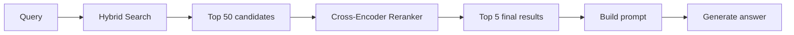
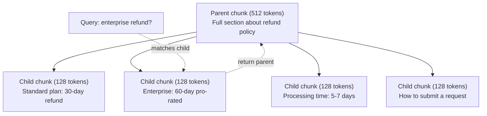
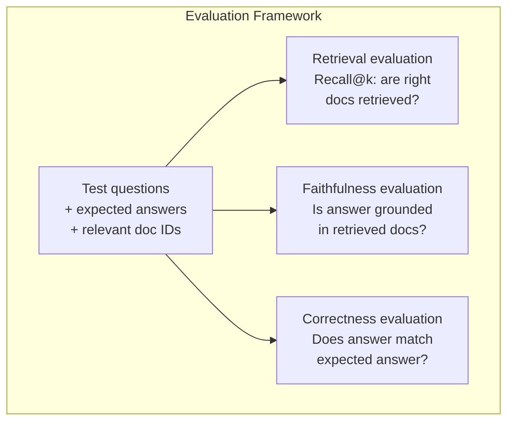

# Zaawansowany RAG (segmentacja, reranking, wyszukiwanie hybrydowe)

> Podstawowy RAG pobiera top-K najbardziej podobnych segmentów. Takie podejście sprawdza się w przypadku prostych pytań, ale zawodzi przy wieloetapowym wnioskowaniu (multi-hop reasoning), niejednoznacznych zapytaniach oraz olbrzymich korpusach danych. Zaawansowany RAG stanowi różnicę między prostym demem działającym na 10 dokumentach a systemem produkcyjnym przetwarzającym 10 milionów rekordów.

**Typ:** Projekt szkoleniowy
**Język:** Python
**Wymagania wstępne:** Faza 11, lekcja 06 (RAG)
**Czas:** ~90 minut
**Powiązane lekcje:** Faza 5, lekcja 23 (Strategie segmentacji dla RAG) – szczegółowe omówienie sześciu algorytmów podziału tekstu (rekurencyjny, semantyczny, zdaniowy, Parent-Child, Late Chunking, Contextual Retrieval) wraz z testami porównawczymi od Vectara i Anthropic. Ta lekcja skupia się na kluczowych technikach produkcyjnych: wyszukiwaniu hybrydowym, rerankingu oraz transformacjach zapytań.

## Cele nauczania

- Zaimplementuj zaawansowane strategie segmentacji tekstu (semantyczną, rekurencyjną, Parent-Child), które zachowują strukturę logiczną i kontekst dokumentu.
- Zbuduj hybrydowy potok wyszukiwania łączący klasyczne dopasowanie słów kluczowych (BM25) z wyszukiwaniem semantycznym (wektorowym) oraz modelem rerankingu opartego na cross-enkoderach.
- Zastosuj techniki transformacji zapytań (HyDE, Query Rewriting/Multi-Query, Step-back), aby poprawić wyniki wyszukiwania w przypadku niejednoznacznych lub złożonych pytań użytkowników.
- Diagnozuj i naprawiaj typowe problemy z jakością systemów RAG: pobranie niewłaściwego kontekstu, ignorowanie wstrzykniętych danych przez model oraz awarie wnioskowania wieloetapowego.

## Problem badawczy

W lekcji 06 zaimplementowałeś podstawowy potok RAG. Działa on poprawnie dla prostych pytań w niewielkiej bazie dokumentów. Rozważmy jednak następujące scenariusze:

**Niejednoznaczne zapytanie**: „Jakie były przychody w zeszłym kwartale?”. Wyszukiwanie wektorowe zwraca segmenty dotyczące ogólnej strategii przychodowej, prognoz finansowych i wypowiedzi dyrektora finansowego na temat dynamiki wzrostu – wszystkie są semantycznie zbliżone do słowa „przychody”. Żadne z nich nie zawiera jednak konkretnych liczb. Prawidłowy fragment brzmi: „$47.2M in Q3 2025”, ale używa słowa „earnings” zamiast „revenue”. Model embeddingów błędnie uznaje, że fraza „revenue strategy” leży bliżej zapytania niż „Q3 earnings were $47.2M”.

**Zapytanie wieloetapowe (Multi-hop query)**: „Który zespół odnotował największy wzrost wskaźnika satysfakcji klienta?”. Rozwiązanie tego problemu wymaga znalezienia wyników satysfakcji (CSAT) dla każdego zespołu, porównania ich wartości w czasie i wyznaczenia maksimum. Żaden pojedynczy segment nie zawiera gotowej odpowiedzi – dane są rozproszone po raportach wielu działów.

**Praca na wielką skalę (duży korpus)**: Masz w bazie 2 miliony segmentów. Prawidłowa informacja znajduje się w segmencie o indeksie #1 847 293. Twoje Top-5 wyników zwraca segmenty o indeksach #14, #89 201, #1 200 000, #44 i #901 333. Choć leżą one blisko zapytania w przestrzeni wektorowej, żaden nie zawiera odpowiedzi. Przy tej skali algorytmy przybliżonego wyszukiwania (ANN) generują na tyle duży błąd statystyczny, że właściwe dokumenty zostają wypchnięte poza czołówkę wyników.

Podstawowy RAG zawodzi, ponieważ wysokie podobieństwo wektorowe nie jest równoznaczne z przydatnością informacji (relevance). Segment może być semantycznie zbliżony do pytania, ale bezużyteczny przy tworzeniu odpowiedzi. Zaawansowany RAG rozwiązuje te wyzwania za pomocą czterech technik: wyszukiwania hybrydowego (dodanie słów kluczowych), rerankingu (dokładniejszej weryfikacji kandydatów), transformacji zapytań (optymalizacji pytania przed wyszukiwaniem) oraz zaawansowanej segmentacji (pobierania danych z odpowiednią granulacją).

## Koncepcje teoretyczne

### Wyszukiwanie hybrydowe: semantyka + słowa kluczowe

Wyszukiwanie semantyczne (wektorowe) doskonale rozumie intencję i znaczenie. Zapytanie „Jak anulować subskrypcję?” świetnie dopasuje się do segmentu „Kroki w celu rozwiązania umowy”, mimo braku wspólnych słów. Zawodzi jednak przy dokładnych identyfikatorach. Zapytanie „Kod błędu E-4021” może nie zwrócić dokumentu zawierającego dokładnie „E-4021”, jeśli model embeddingów potraktuje ten kod jako nieistotny szum.

Z kolei wyszukiwanie słów kluczowych (BM25) działa odwrotnie. Jest niezrównane przy wyszukiwaniu dokładnych dopasowań (jak „E-4021”). Jednak zapytanie „anuluj moją subskrypcję” nie zwróci żadnych wyników, jeśli w dokumentacji użyto wyłącznie sformułowania „rozwiązanie umowy”.

Wyszukiwanie hybrydowe łączy oba te podejścia, uruchamiając je równolegle i scalając wyniki.

**BM25** (Best Matching 25) to standardowy probabilistyczny algorytm wyszukiwania słów kluczowych, stanowiący fundament wyszukiwarek od lat 90. XX wieku. Wzór matematyczny:

```
BM25(q, d) = sum over terms t in q:
    IDF(t) * (tf(t,d) * (k1 + 1)) / (tf(t,d) + k1 * (1 - b + b * |d| / avgdl))
```

Gdzie `tf(t,d)` oznacza częstotliwość występowania terminu `t` w dokumencie `d`, `IDF(t)` to odwrotna częstotliwość dokumentu (Inverse Document Frequency), `|d|` to długość dokumentu, `avgdl` to średnia długość dokumentu w całym korpusie, `k1` kontroluje nasycenie częstotliwości słów (domyślnie 1.2), a `b` odpowiada za normalizację długości (domyślnie 0.75).

Upraszczając: BM25 ocenia dokument wyżej, jeśli zawiera on słowa kluczowe z zapytania (zwłaszcza te rzadkie w skali całego korpusu), ale wprowadza malejące przyrosty dla wielokrotnych powtórzeń tego samego słowa. Dokument zawierający słowo „przychody” 50 razy nie jest 50-krotnie bardziej trafny od dokumentu, w którym to słowo występuje tylko raz.

### Fuzja rang (Reciprocal Rank Fusion - RRF)

Mając dwie niezależne listy rankingowe (jedną z wyszukiwania wektorowego, drugą z BM25), musimy je połączyć w jedną spójną listę. Standardowym i wysoce efektywnym podejściem jest fuzja RRF:

```
RRF_score(d) = sum over rankings R:
    1 / (k + rank_R(d))
```

Gdzie `k` to stała wygładzająca (zazwyczaj równa 60), zapobiegająca zdominowaniu rankingu przez pojedyncze pozycje z pierwszych miejsc.

Przykład: dokument, który zajął 1. miejsce w wyszukiwaniu wektorowym i 5. miejsce w BM25, uzyskuje ocenę:
`1/(60+1) + 1/(60+5) = 0.0164 + 0.0154 = 0.0318`

Z kolei dokument, który zajął 3. miejsce w wyszukiwaniu wektorowym i 2. miejsce w BM25, otrzymuje:
`1/(60+3) + 1/(60+2) = 0.0159 + 0.0161 = 0.0320`

RRF automatycznie równoważy oba sygnały. Dokumenty, które plasują się wysoko w obu algorytmach, uzyskają najwyższe pozycje. Dokumenty wysoce trafne tylko dla jednego z algorytmów otrzymają ocenę umiarkowaną. RRF bazuje na pozycjach w rankingu (rangach), a nie na surowych wartościach podobieństwa, co eliminuje problem niekompatybilności rozkładów wyników między dwoma różnymi systemami.

### Ponowne ocenianie (Reranking)

Pierwszy etap wyszukiwania (retrieval) musi być szybki, przez co bywa nieprecyzyjny. Bazuje on na bi-enkoderach: zapytanie i każdy dokument są kodowane wektorowo niezależnie od siebie, a następnie porównywane za pomocą prostej metryki (np. cosinusowej). Pozwala to na indeksowanie i przeszukiwanie milionów rekordów w milisekundy.

W procesie rerankingu wykorzystuje się cross-enkodery. W tym podejściu zapytanie oraz dokument kandydujący są wprowadzane do modelu jednocześnie jako jedna sekwencja. Model analizuje pełną relację i interakcję między wszystkimi słowami z zapytania i dokumentu. Cross-enkoder doskonale zrozumie, że pytanie „Jakie były zarobki w Q3?” odnosi się bezpośrednio do segmentu zawierającego tekst „wykazano 47.2 mln USD przychodu w trzecim kwartale”, nawet jeśli bi-enkoder nie połączył tych faktów semantycznie.

Narzut wydajnościowy: cross-enkodery są od 100 do 1000 razy wolniejsze niż bi-enkodery, ponieważ przetwarzanie pary zapytanie-dokument wymaga pełnego przejścia przez sieć neuronową. Niemożliwe jest przeliczenie cross-enkodera dla całego miliona dokumentów w czasie rzeczywistym.
Rozwiązanie: w pierwszym etapie pobierz większą listę kandydatów (np. top 50 za pomocą szybkiego wyszukiwania hybrydowego), a następnie zawęź ją i posortuj przy użyciu cross-enkodera, wyodrębniając ostateczne top 5 segmentów.



Popularne modele rerankingu (stan na rok 2026):
- **Cohere Rerank 3.5**: w pełni zarządzane API, świetne wsparcie wielojęzyczne, najwyższe przyrosty trafności w korpusach mieszanych.
- **Voyage Rerank 2.5**: zarządzane API o najniższych opóźnieniach (latency) wśród rozwiązań chmurowych.
- **Jina Reranker v2 (Multilingual)**: potężny model open-source obsługujący ponad 100 języków.
- **BGE Reranker v2 (M3)**: model open-source, stabilny i sprawdzony punkt odniesienia.
- **MiniLM Cross-Encoder** (np. `ms-marco-MiniLM-L-6-v2`): lekki model open-source, idealny do uruchamiania lokalnego na CPU.
- **ColBERTv2 / Jina-ColBERT-v2**: zaawansowane modele wyszukiwania oparte na mechanizmie późnej interakcji (late interaction).

### Transformacja zapytań (Query Transformation)

Często problem leży w sposobie sformułowania zapytania przez użytkownika. Zapytanie „Co tam zmienili w nowej polityce?” jest mało precyzyjne, nie zawiera słów kluczowych, a jego wektor semantyczny będzie bardzo rozmyty. Żaden system wyszukiwania nie znajdzie w ten sposób właściwych informacji.

**Query Rewriting (Przepisywanie zapytań)**: proces przeformułowania zapytania za pomocą modelu LLM w celu optymalizacji pod kątem wyszukiwarki:
```
User: "What was that thing about the new policy change?"
Rewritten: "Recent policy changes and updates documentation"
```

**HyDE (Hypothetical Document Embeddings)**: zamiast wyszukiwać dokumenty bezpośrednio na podstawie zapytania użytkownika, model LLM generuje najpierw hipotetyczną, idealną odpowiedź (nawet jeśli zawiera ona zmyślone fakty). Następnie generuje się wektor dla tej hipotetycznej odpowiedzi i na jego podstawie wyszukuje rzeczywiste dokumenty w bazie.

```
Query: "What is the refund policy for enterprise?"
Hypothetical answer: "Enterprise customers are eligible for a full refund
within 60 days of purchase. Refunds are pro-rated based on the remaining
subscription period and processed within 5-7 business days."
```

Hipotetyczna odpowiedź leży znacznie bliżej rzeczywistych dokumentów w przestrzeni wektorowej niż samo pytanie. Pytania i odpowiedzi mają zupełnie inną strukturę składniową. Tworząc sztuczną odpowiedź (HyDE), eliminujemy różnicę dystansu semantycznego między strukturą pytania a strukturą odpowiedzi.

Narzut: HyDE wymaga dodatkowego wywołania LLM przed etapem wyszukiwania, co wydłuża proces o ok. 500–2000 ms. Jest to jednak technika niezwykle cenna w systemach, gdzie zapytania użytkowników są chaotyczne i nieprecyzyjne.

### Segmentacja Parent-Child (Parent-Child Splitting)

Klasyczna segmentacja stawia nas przed trudnym wyborem: małe segmenty pozwalają na bardzo precyzyjne wyszukiwanie wektorowe, ale duże segmenty dostarczają modelowi LLM odpowiednio szeroki kontekst do sformułowania poprawnej odpowiedzi. Strategia Parent-Child eliminuje ten kompromis.

Indeksujemy małe segmenty (np. 128 tokenów - child chunks) na potrzeby wyszukiwania wektorowego. Jednak po znalezieniu najbardziej pasującego małego segmentu, system pobiera z bazy przypisany do niego większy segment nadrzędny (np. 512 tokenów - parent chunk) i to jego wstrzykuje do promptu. Dzięki temu wyszukiwanie jest niezwykle precyzyjne, a model LLM otrzymuje pełny kontekst tematyczny.



Zapytanie „zwrot dla Enterprise?” idealnie dopasuje się do segmentu potomnego C2. Jednak do promptu wstrzyknięty zostanie pełen segment nadrzędny P, dostarczając modelowi informacje o czasie procesowania zwrotów oraz procedurze składania wniosków.

### Filtrowanie metadanych (Metadata Filtering)

Przed wykonaniem wyszukiwania wektorowego zawęź bazę dokumentów za pomocą filtrów relacyjnych opartych na metadanych (np. data publikacji, źródło, kategoria, uprawnienia dostępu). Pozwala to drastycznie ograniczyć przestrzeń wyszukiwania i eliminuje ryzyko pobrania nieistotnych danych.

Dla zapytania: „Co zmieniło się w polityce bezpieczeństwa w zeszłym miesiącu?” system powinien filtrować dokumenty wyłącznie do kategorii `bezpieczeństwo` oraz daty modyfikacji w ciągu ostatnich 30 dni. Bez filtracji metadanych wyszukiwanie wektorowe mogłoby zwrócić nieaktualny dokument o bezpieczeństwie sprzed dwóch lat, tylko dlatego, że jest semantycznie podobny.

W produkcyjnych systemach RAG każdy segment przechowuje zestaw metadanych. Bazy wektorowe realizują filtrowanie metadanych (pre-filtering) przed etapem wyszukiwania wektorowego, co jest kluczowe dla zachowania wydajności przy milionach rekordów.

### Ewaluacja potoku

Ewaluację potoku RAG przeprowadzamy w oparciu o trzy kluczowe metryki:

**Trafność wyszukiwania (Retrieval Recall@K)**: jaki procent dokumentów rzeczywiście zawierających odpowiedź pojawia się w Top-K pobranych segmentów? Jeśli odpowiedź na pytanie znajduje się w segmencie #47, to czy segment ten znalazł się w Top-5 wyszukiwania?

**Wierność kontekstowa (Faithfulness / Groundedness)**: czy wygenerowana odpowiedź opiera się wyłącznie na dostarczonym kontekście? Jeśli w segmentach jest mowa o „60-dniowym oknie zwrotów”, a model w odpowiedzi napisał „90 dni”, wierność kontekstowa wynosi 0. Model zignorował fakty i wyhalucynował odpowiedź.

**Poprawność odpowiedzi (Answer Correctness)**: stopień zgodności wygenerowanej odpowiedzi z odpowiedzią referencyjną (oczekiwaną). Jest to metryka typu end-to-end, łącząca jakość wyszukiwania i syntezy LLM.

Prosty algorytm oceny wierności: podziel wygenerowaną odpowiedź na pojedyncze twierdzenia i zweryfikuj, czy każde z nich znajduje potwierdzenie w treści pobranych segmentów. Jeśli odpowiedź zawiera fakt nieobecny w kontekście, klasyfikujemy go jako halucynację.



## Implementacja krok po kroku

### Krok 1: Wdrożenie wyszukiwania BM25

```python
import math
from collections import Counter

class BM25:
    def __init__(self, k1=1.2, b=0.75):
        self.k1 = k1
        self.b = b
        self.docs = []
        self.doc_lengths = []
        self.avg_dl = 0
        self.doc_freqs = {}
        self.n_docs = 0

    def index(self, documents):
        self.docs = documents
        self.n_docs = len(documents)
        self.doc_lengths = []
        self.doc_freqs = {}

        for doc in documents:
            words = doc.lower().split()
            self.doc_lengths.append(len(words))
            unique_words = set(words)
            for word in unique_words:
                self.doc_freqs[word] = self.doc_freqs.get(word, 0) + 1

        self.avg_dl = sum(self.doc_lengths) / self.n_docs if self.n_docs else 1

    def score(self, query, doc_idx):
        query_words = query.lower().split()
        doc_words = self.docs[doc_idx].lower().split()
        doc_len = self.doc_lengths[doc_idx]
        word_counts = Counter(doc_words)
        score = 0.0

        for term in query_words:
            if term not in word_counts:
                continue
            tf = word_counts[term]
            df = self.doc_freqs.get(term, 0)
            idf = math.log((self.n_docs - df + 0.5) / (df + 0.5) + 1)
            numerator = tf * (self.k1 + 1)
            denominator = tf + self.k1 * (1 - self.b + self.b * doc_len / self.avg_dl)
            score += idf * numerator / denominator

        return score

    def search(self, query, top_k=10):
        scores = [(i, self.score(query, i)) for i in range(self.n_docs)]
        scores.sort(key=lambda x: x[1], reverse=True)
        return scores[:top_k]
```

### Krok 2: Fuzja rang (RRF)

```python
def reciprocal_rank_fusion(ranked_lists, k=60):
    scores = {}
    for ranked_list in ranked_lists:
        for rank, (doc_id, _) in enumerate(ranked_list):
            if doc_id not in scores:
                scores[doc_id] = 0.0
            scores[doc_id] += 1.0 / (k + rank + 1)
    fused = sorted(scores.items(), key=lambda x: x[1], reverse=True)
    return fused
```

### Krok 3: Wyszukiwanie hybrydowe

```python
def hybrid_search(query, chunks, vector_embeddings, vocab, idf, bm25_index, top_k=5, fusion_k=60):
    query_emb = tfidf_embed(query, vocab, idf)
    vector_results = search(query_emb, vector_embeddings, top_k=top_k * 3)
    bm25_results = bm25_index.search(query, top_k=top_k * 3)
    fused = reciprocal_rank_fusion([vector_results, bm25_results], k=fusion_k)
    return fused[:top_k]
```

### Krok 4: Własny algorytm rerankingu (Heurystyczny Reranker)

W środowisku produkcyjnym wykorzystasz model cross-enkodera. Lokalnie możemy napisać uproszczony moduł rerankingu oceniający trafność segmentu na podstawie nakładania się słów kluczowych, bigramów oraz pozycji słów kluczowych w tekście.

```python
def rerank(query, candidates, chunks):
    query_words = set(query.lower().split())
    stop_words = {"the", "a", "an", "is", "are", "was", "were", "what", "how",
                  "why", "when", "where", "do", "does", "for", "of", "in", "to",
                  "and", "or", "on", "at", "by", "it", "its", "this", "that",
                  "with", "from", "be", "has", "have", "had", "not", "but"}
    query_terms = query_words - stop_words

    scored = []
    for doc_id, initial_score in candidates:
        chunk = chunks[doc_id].lower()
        chunk_words = set(chunk.split())

        term_overlap = len(query_terms & chunk_words)

        query_bigrams = set()
        q_list = [w for w in query.lower().split() if w not in stop_words]
        for i in range(len(q_list) - 1):
            query_bigrams.add(q_list[i] + " " + q_list[i + 1])
        bigram_matches = sum(1 for bg in query_bigrams if bg in chunk)

        position_boost = 0
        for term in query_terms:
            pos = chunk.find(term)
            if pos != -1 and pos < len(chunk) // 3:
                position_boost += 0.5

        rerank_score = (
            term_overlap * 1.0
            + bigram_matches * 2.0
            + position_boost
            + initial_score * 5.0
        )
        scored.append((doc_id, rerank_score))

    scored.sort(key=lambda x: x[1], reverse=True)
    return scored
```

### Krok 5: Wdrożenie wyszukiwania HyDE

```python
def hyde_generate_hypothesis(query):
    templates = {
        "what": "The answer to '{query}' is as follows: Based on our documentation, {topic} involves specific policies and procedures that define how the process works.",
        "how": "To address '{query}': The process involves several steps. First, you need to initiate the request. Then, the system processes it according to the defined rules.",
        "default": "Regarding '{query}': Our records indicate specific details and policies related to this topic that provide a comprehensive answer."
    }
    query_lower = query.lower()
    if query_lower.startswith("what"):
        template = templates["what"]
    elif query_lower.startswith("how"):
        template = templates["how"]
    else:
        template = templates["default"]

    topic_words = [w for w in query.lower().split()
                   if w not in {"what", "is", "the", "how", "do", "does", "a", "an",
                                "for", "of", "to", "in", "on", "at", "by", "and", "or"}]
    topic = " ".join(topic_words) if topic_words else "this topic"

    return template.format(query=query, topic=topic)

def hyde_search(query, chunks, vector_embeddings, vocab, idf, top_k=5):
    hypothesis = hyde_generate_hypothesis(query)
    hypothesis_emb = tfidf_embed(hypothesis, vocab, idf)
    results = search(hypothesis_emb, vector_embeddings, top_k)
    return results, hypothesis
```

### Krok 6: Segmentacja Parent-Child

```python
def create_parent_child_chunks(text, parent_size=200, child_size=50):
    words = text.split()
    parents = []
    children = []
    child_to_parent = {}

    parent_idx = 0
    start = 0
    while start < len(words):
        parent_end = min(start + parent_size, len(words))
        parent_text = " ".join(words[start:parent_end])
        parents.append(parent_text)

        child_start = start
        while child_start < parent_end:
            child_end = min(child_start + child_size, parent_end)
            child_text = " ".join(words[child_start:child_end])
            child_idx = len(children)
            children.append(child_text)
            child_to_parent[child_idx] = parent_idx
            child_start += child_size

        parent_idx += 1
        start += parent_size

    return parents, children, child_to_parent
```

### Krok 7: Ewaluacja potoku (Wierność i Recall)

```python
def evaluate_faithfulness(answer, retrieved_chunks):
    answer_sentences = [s.strip() for s in answer.split(".") if len(s.strip()) > 10]
    if not answer_sentences:
        return 1.0, []

    grounded = 0
    ungrounded = []
    context = " ".join(retrieved_chunks).lower()

    for sentence in answer_sentences:
        words = set(sentence.lower().split())
        stop_words = {"the", "a", "an", "is", "are", "was", "were", "and", "or",
                      "to", "of", "in", "for", "on", "at", "by", "it", "this", "that"}
        content_words = words - stop_words
        if not content_words:
            grounded += 1
            continue

        matched = sum(1 for w in content_words if w in context)
        ratio = matched / len(content_words) if content_words else 0

        if ratio >= 0.5:
            grounded += 1
        else:
            ungrounded.append(sentence)

    score = grounded / len(answer_sentences) if answer_sentences else 1.0
    return score, ungrounded

def evaluate_retrieval_recall(queries_with_relevant, retrieval_fn, k=5):
    total_recall = 0.0
    results = []

    for query, relevant_indices in queries_with_relevant:
        retrieved = retrieval_fn(query, k)
        retrieved_indices = set(idx for idx, _ in retrieved)
        relevant_set = set(relevant_indices)
        hits = len(retrieved_indices & relevant_set)
        recall = hits / len(relevant_set) if relevant_set else 1.0
        total_recall += recall
        results.append({
            "query": query,
            "recall": recall,
            "hits": hits,
            "total_relevant": len(relevant_set)
        })

    avg_recall = total_recall / len(queries_with_relevant) if queries_with_relevant else 0
    return avg_recall, results
```

## Praca z produkcyjnymi API

Integracja z lokalnym modelem cross-enkodera (SentenceTransformers):

```python
from sentence_transformers import CrossEncoder

reranker = CrossEncoder("cross-encoder/ms-marco-MiniLM-L-6-v2")

def rerank_with_cross_encoder(query, candidates, chunks, top_k=5):
    pairs = [(query, chunks[doc_id]) for doc_id, _ in candidates]
    scores = reranker.predict(pairs)
    scored = list(zip([doc_id for doc_id, _ in candidates], scores))
    scored.sort(key=lambda x: x[1], reverse=True)
    return scored[:top_k]
```

Integracja z chmurowym API rerankera od Cohere:

```python
import cohere

co = cohere.Client()

def rerank_with_cohere(query, candidates, chunks, top_k=5):
    docs = [chunks[doc_id] for doc_id, _ in candidates]
    response = co.rerank(
        model="rerank-english-v3.0",
        query=query,
        documents=docs,
        top_n=top_k
    )
    return [(candidates[r.index][0], r.relevance_score) for r in response.results]
```

Wykorzystanie API LLM (np. Claude) na potrzeby mechanizmu HyDE:

```python
import anthropic

client = anthropic.Anthropic()

def hyde_with_llm(query):
    response = client.messages.create(
        model="claude-sonnet-4-20250514",
        max_tokens=256,
        messages=[{
            "role": "user",
            "content": f"Write a short paragraph that would be a good answer to this question. Do not say you don't know. Just write what the answer would look like.\n\nQuestion: {query}"
        }]
    )
    return response.content[0].text
```

Wyszukiwanie hybrydowe z użyciem bazy Weaviate:

```python
import weaviate

client = weaviate.connect_to_local()
collection = client.collections.get("Documents")

response = collection.query.hybrid(
    query="enterprise refund policy",
    alpha=0.5,
    limit=10
)
```

Wartość parametru `alpha` określa wagę poszczególnych metod wyszukiwania: 0.0 = czyste dopasowanie słów kluczowych (BM25), 1.0 = czyste wyszukiwanie wektorowe (semantyczne), 0.5 = równe proporcje. Większość systemów produkcyjnych stosuje wartości `alpha` w zakresie od 0.3 do 0.7.

## Materiały lekcyjne

W ramach tej lekcji otrzymujesz dostęp do:
- [prompt-advanced-rag-debugger.md](../outputs/prompt-advanced-rag-debugger.md) – system prompt do diagnozowania błędów i optymalizacji jakości działania potoków RAG.
- [skill-advanced-rag.md](../outputs/skill-advanced-rag.md) – plik instruktażowy (skill) prezentujący produkcyjne wzorce zaawansowanego wyszukiwania hybrydowego i rerankingu.

## Ćwiczenia praktyczne

1. Przeprowadź analizę porównawczą BM25, czystego wyszukiwania wektorowego oraz wyszukiwania hybrydowego na zestawie dokumentów testowych. Dla 5 zróżnicowanych zapytań zanotuj, który algorytm plasuje najbardziej trafny segment na 1. pozycji. Wyszukiwanie hybrydowe powinno osiągnąć najlepsze wyniki w większości przypadków.

2. Zaimplementuj filtrację metadanych (Metadata Filtering). Przypisz kategorię (np. `bezpieczeństwo`, `rozliczenia`, `API`) do każdego dokumentu. Przed wyszukiwaniem wektorowym przefiltruj zbiór tylko do wybranej kategorii. Sprawdź, czy dla zapytania o metody szyfrowania system przeszukuje wyłącznie dokumenty z kategorii `bezpieczeństwo`.

3. Stwórz kompletny potok HyDE przy użyciu prostego generatora z lekcji 06. Porównaj precyzję (Precision@3) wyszukiwania bezpośredniego oraz wyszukiwania HyDE dla 5 niejednoznacznych pytań. HyDE powinien przynieść wyraźną poprawę wyników.

4. Wdrożenie segmentacji Parent-Child. Przyjmij rozmiar segmentu potomnego (child) na poziomie 30 słów, a nadrzędnego (parent) na poziomie 100 słów. Wykonaj wyszukiwanie wektorowe na segmentach potomnych, ale wstrzykuj segmenty nadrzędne do promptu. Porównaj wyniki jakościowe z klasycznym podziałem na segmenty o rozmiarze 50 słów.

5. Przygotuj zbiór ewaluacyjny (10 zapytań testowych wraz ze wskazanymi poprawnymi identyfikatorami segmentów). Zmierz Recall@3, Recall@5 oraz Recall@10 dla konfiguracji: (a) tylko wektory, (b) tylko BM25, (c) wyszukiwanie hybrydowe, (d) wyszukiwanie hybrydowe + reranking. Przedstaw zestawienie wyników w tabeli.

## Słownik pojęć

| Termin | Co mówią deweloperzy | Co to oznacza w rzeczywistości |
|------|----------------|----------------------|
| **BM25** | „Wyszukiwanie słów kluczowych” | Probabilistyczny algorytm rankingowy ważący dokumenty na podstawie częstotliwości występowania słów kluczowych, z uwzględnieniem długości tekstu. |
| **Wyszukiwanie hybrydowe** | „Hybryda wektorów i tekstu” | Równoległe wyszukiwanie wektorowe (semantyczne) i tekstowe (BM25), a następnie scalenie wyników w jeden ranking. |
| **Reciprocal Rank Fusion (RRF)** | „Scalanie rankingów” | Algorytm łączenia list rankingowych na podstawie pozycji (rang) dokumentów na poszczególnych listach. |
| **Reranking** | „Drugie przejście sortujące” | Etap weryfikacji kandydatów polegający na ponownym przeliczeniu ich trafności za pomocą precyzyjnego modelu (cross-enkodera). |
| **Cross-Encoder** | „Model analizujący parę” | Model sieci neuronowej analizujący zapytanie i dokument jednocześnie, wychwytujący głębokie relacje semantyczne. |
| **Bi-Encoder** | „Model niezależnego kodowania” | Model embeddingów generujący wektory niezależnie dla tekstu i zapytania; szybki, ale mniej precyzyjny niż cross-enkodery. |
| **HyDE** | „Wyszukiwanie przez hipotezę” | Metoda polegająca na wygenerowaniu sztucznej odpowiedzi na pytanie użytkownika i wyszukiwaniu na jej podstawie rzeczywistych dokumentów. |
| **Parent-Child Splitting** | „Precyzyjne wyszukiwanie, pełny kontekst” | Zapisywanie małych segmentów na potrzeby wyszukiwania wektorowego i wstrzykiwanie powiązanych z nimi większych segmentów nadrzędnych do promptu. |
| **Filtrowanie metadanych** | „Filtrowanie wstępne” | Ograniczenie przestrzeni wyszukiwania wektorowego na podstawie kryteriów relacyjnych (np. data, autor, tagi). |
| **Wierność kontekstowa** | „Groundedness” | Metryka określająca, czy odpowiedź LLM bazuje wyłącznie na faktach dostarczonych w kontekście RAG (brak halucynacji). |

## Sugerowane lektury

- [Robertson & Zaragoza, „The Probabilistic Relevance Framework: BM25 and Beyond” (2009)](https://www.nowpublishers.com/article/Details/INR-019) – fundamentalna praca wyjaśniająca probabilistyczne podstawy algorytmu BM25.
- [Cormack et al., „Reciprocal Rank Fusion Outperforms Condorcet and Individual Rank Learning Methods” (2009)](https://dl.acm.org/doi/10.1145/1571941.1572114) – oryginalna publikacja dotycząca fuzji RRF dowodząca jej przewagi nad bardziej skomplikowanymi metodami łączenia rankingów.
- [Gao et al., „Precise Zero-Shot Dense Retrieval Without Relevance Labels” (2022)](https://arxiv.org/abs/2212.10496) – publikacja wprowadzająca metodę HyDE i wykazująca jej wysoką skuteczność w testach zero-shot.
- [Nogueira & Cho, „Passage Re-ranking with BERT” (2019)](https://arxiv.org/abs/1901.04085) – praca wykazująca, jak zastosowanie cross-enkodera opartego na architekturze BERT na wynikach zgrubnych (BM25) drastycznie podnosi jakość wyszukiwania.
- [Khattab et al., „DSPy: Compiling Declarative Language Model Calls to Self-Improving Pipelines” (2023)](https://arxiv.org/abs/2310.03714) – podejście DSPy do programowej optymalizacji promptów i struktur potoków RAG.
- [Edge et al., „From Local to Global: A Graph RAG Approach to Query-Focused Summarization” (Microsoft Research 2024)](https://arxiv.org/abs/2404.16130) – publikacja wprowadzająca metodę GraphRAG i prezentująca zalety strukturyzowania wiedzy w postaci grafów relacji.
- [Asai et al., „Self-RAG: Learning to Retrieve, Generate, and Critique Through Self-Reflection” (ICLR 2024)](https://arxiv.org/abs/2310.11511) – koncepcja Self-RAG wprowadzająca dynamiczne tokeny refleksji do oceny pobieranego kontekstu.
- [Przewodnik LangChain dotyczący konstruowania zapytań (Query Construction)](https://blog.langchain.dev/query-construction/) – jak przekształcać zapytania naturalne na strukturyzowane polecenia bazodanowe przed etapem wyszukiwania.
