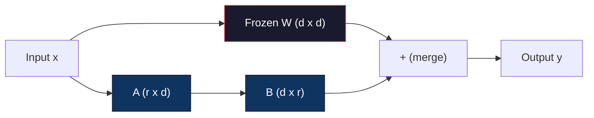
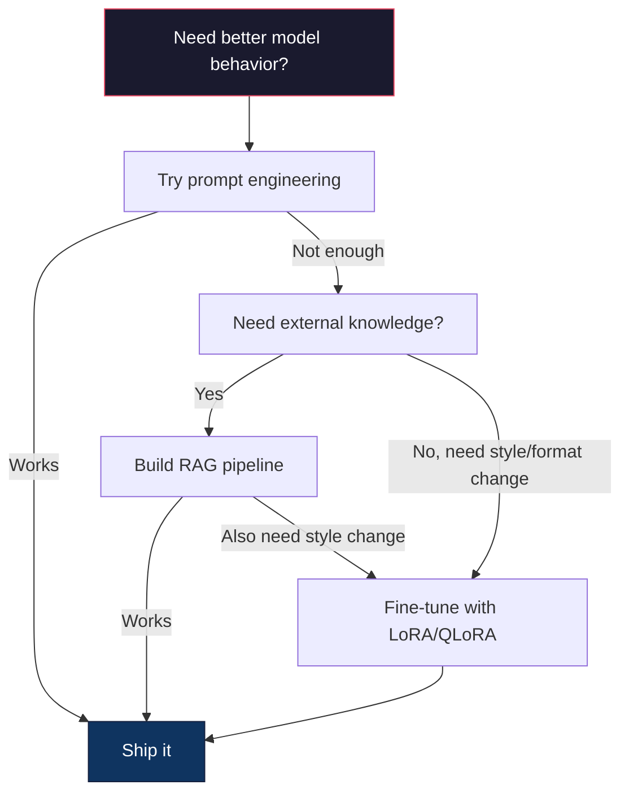

# Dostrajanie za pomocą LoRA i QLoRA

> Pełne dostrojenie modelu 7B wymaga 56 GB pamięci VRAM. Nie masz tego. Większość firm też nie. LoRA pozwala dostroić ten sam model w 6 GB, szkoląc mniej niż 1% parametrów. To nie jest kompromis — zapewnia pełną, dostrojoną jakość w przypadku większości zadań. Cały ekosystem dostrajania oprogramowania open source działa w oparciu o tę jedną sztuczkę.

**Typ:** Kompilacja
**Języki:** Python
**Wymagania wstępne:** Faza 10, lekcja 06 (Dostrajanie instrukcji / SFT)
**Czas:** ~75 minut
**Powiązane:** Faza 10 obejmuje od podstaw pętle SFT/DPO. Ta lekcja łączy je z zestawami narzędzi PEFT 2026 (PEFT, TRL, Unsloth, Axolotl, LLaMA-Factory).

## Cele nauczania

- Zaimplementuj LoRA poprzez wstrzyknięcie macierzy adapterów niskiej rangi (A i B) do warstw uwagi wstępnie wyszkolonego modelu
- Oblicz oszczędności parametrów LoRA w porównaniu z pełnym dostrojeniem: ranga r z wymiarami d_model pociąga parametry 2*r*d zamiast d^2
- Dostosuj model za pomocą QLoRA (4-bitowa kwantyzowana baza + adaptery LoRA), aby zmieścił się w pamięci GPU konsumenckiego
- Scal wagi LoRA z powrotem do modelu podstawowego w celu wdrożenia i porównaj prędkość wnioskowania z adapterami i bez nich

## Problem

Masz model podstawowy. Lama 3 8B. Chcesz, aby odpowiadał na zgłoszenia do obsługi klienta głosem Twojej firmy. Odpowiedzią jest SFT. Jednak SFT ma problem z kosztami.

Pełne dostrajanie aktualizuje każdy parametr w modelu. Lama 3 8B ma 8 miliardów parametrów. W fp16 każdy parametr zajmuje 2 bajty. To 16 GB tylko na obciążenie. Podczas treningu potrzebne są także gradienty (16 GB), stany optymalizatora dla Adama (32 GB na pęd + wariancja) i aktywacje. Razem: około 56 GB pamięci VRAM dla pojedynczego modelu 8B.

A100 80 GB ledwo to zmieści. Koszt dwóch A100 $3-4/hour on cloud providers. Training for 3 epochs on 50,000 examples takes 6-10 hours. That's $30–40 za eksperyment. Przeprowadź 10 eksperymentów, aby uzyskać prawidłowe hiperparametry, a wydasz 400 USD, zanim cokolwiek wdrożysz.

Skaluj to do Lamy 3 70B, a liczby staną się absurdalne. 140 GB na same ciężarki. Potrzebujesz klastra. Ponad 100 USD za eksperyment.

Jest też głębszy problem. Pełne dostrojenie modyfikuje każdą wagę w modelu. Jeśli dostosujesz dane dotyczące obsługi klienta, możesz pogorszyć ogólne możliwości modelu. Nazywa się to katastrofalnym zapominaniem. Model staje się lepszy w zadaniu, a gorszy we wszystkim innym.

Potrzebujesz metody, która szkoli mniej parametrów, zużywa mniej pamięci i nie niszczy istniejącej wiedzy modelu.

## Koncepcja

### LoRA: Adaptacja niskiej rangi

Edward Hu i współpracownicy z firmy Microsoft opublikowali LoRA w czerwcu 2021 r. Wnioski z artykułu: aktualizacje masy podczas dostrajania mają niską rangę wewnętrzną. Nie musisz aktualizować wszystkich 16,7 miliona parametrów w macierzy wagowej 4096x4096. Przydatne informacje w aktualizacji można ująć w matrycy rangi 16 lub 32.

Oto matematyka. Standardowa warstwa liniowa oblicza:

```
y = Wx
```

Gdzie W jest macierzą d_out x d_in. W przypadku projekcji uwagi o wymiarach 4096 x 4096 jest to 16 777 216 parametrów.

LoRA zamraża W i dodaje rozkład niskiej rangi:

```
y = Wx + BAx
```

Gdzie B to (d_out x r), a A to (r x d_in). Ranga r jest znacznie mniejsza niż d – zazwyczaj wynosi 8, 16 lub 32.

Dla r=16 na warstwie 4096x4096:
- Oryginalne parametry: 4096 x 4096 = 16 777 216
- Parametry LoRA: (4096 x 16) + (16 x 4096) = 65 536 + 65 536 = 131 072
- Redukcja: 131 072 / 16 777 216 = 0,78%

Trenujesz 0,78% parametrów i uzyskujesz 95-100% jakości.



A jest inicjowany losowym Gaussa. B jest inicjowany na zero. Oznacza to, że wkład LoRA zaczyna się od zera — model rozpoczyna naukę od swojego pierwotnego zachowania i stopniowo uczy się adaptacji.

### Współczynnik skalowania: alfa

LoRA wprowadza współczynnik skalowania alfa, który kontroluje, w jakim stopniu aktualizacja o niskiej randze wpływa na wynik:

```
y = Wx + (alpha / r) * BAx
```

Gdy alfa = r, skalowanie wynosi 1x. Gdy alfa = 2r (wspólna wartość domyślna), skalowanie wynosi 2x. Ten hiperparametr kontroluje szybkość uczenia się ścieżki LoRA niezależnie od podstawowej szybkości uczenia się.

Praktyczne wskazówki:
- alfa = 2 * ranga jest powszechną konwencją społeczności (w oryginalnej pracy w większości eksperymentów używano alfa = ranga)
- alfa = ranga daje skalowanie 1x, konserwatywne, ale stabilne
- Wyższa wartość alfa oznacza większe aktualizacje na krok, co może przyspieszyć konwergencję lub spowodować niestabilność

### Gdzie zastosować LoRA

Transformator ma wiele warstw liniowych. Nie musisz dodawać LoRA do wszystkich. W oryginalnym artykule testowano różne kombinacje:

| Warstwy docelowe | Parametry możliwe do wyszkolenia (7B) | Jakość |
|-------------|----------------------|--------|
| tylko q_proj | 4,7 mln | Dobrze |
| q_proj + v_proj | 9,4 mln | Lepiej |
| q_proj + k_proj + v_proj + o_proj | 18,9 mln | Najlepsze dla uwagi |
| Wszystko liniowe (uwaga + MLP) | 37,7 mln | Zysk krańcowy, 2x parametry |

Najlepszy punkt dla większości zadań: q_proj + v_proj. Dotyczy to projekcji zapytań i wartości w samouważności, które kontrolują, czym zajmuje się model i jakie informacje wydobywa. Dodawanie warstw MLP pomaga w przypadku złożonych zadań, takich jak generowanie kodu, ale podwaja liczbę parametrów, co zmniejsza zyski z prostszych zadań.

### Wybór rangi

Stopień r kontroluje ekspresję adaptacji:

| Ranga | Parametry możliwe do wytrenowania (na warstwę) | Najlepsze dla |
|------|---------------------------|---------|
| 4 | 32768 | Prosta klasyfikacja, sentyment |
| 8 | 65536 | Pytania i odpowiedzi w jednej domenie, podsumowanie |
| 16 | 131 072 | Zadania wielodomenowe, instrukcja po |
| 32 | 262144 | Złożone rozumowanie, generowanie kodu |
| 64 | 524288 | Malejące zyski dla większości zadań |
| 128 | 1 048 576 | Rzadko uzasadnione |

Hu i in. pokazało, że r=4 uwzględnia już większość adaptacji do prostych zadań. r=8 i r=16 to najczęstsze wybory w praktyce. Wyjście poza r=64 rzadko poprawia jakość i zaczyna tracić przewagę pamięci LoRA.

### QLoRA: 4-bitowa kwantyzacja + LoRA

Tim Dettmers i współpracownicy z Uniwersytetu Waszyngtońskiego opublikowali QLoRA w maju 2023 r. Pomysł: skwantyzować zamrożony model podstawowy z 4-bitową precyzją, a następnie podłączyć adaptery LoRA w fp16 na górze.

To radykalnie zmienia równanie pamięci:

| Metoda | Pamięć wagi (7B) | Pamięć treningowa (7B) | Wymagany procesor graficzny |
|--------|---------|----------|------------|
| Pełne dostrojenie (fp16) | 14 GB | ~56 GB | 1x A100 80 GB |
| LoRA (podstawa fp16) | 14 GB | ~18 GB | 1x A100 40 GB |
| QLoRA (baza 4-bitowa) | 3,5 GB | ~6 GB | 1x RTX 3090 24 GB |

QLoRA wnosi trzy wkłady techniczne:

**NF4 (Normal Float 4-bit)**: Nowy typ danych zaprojektowany specjalnie dla wag sieci neuronowych. Wagi sieci neuronowych mają w przybliżeniu rozkład normalny. NF4 umieszcza swoje 16 poziomów kwantyzacji w kwantylach standardowego rozkładu normalnego. Jest to informacja teoretycznie optymalna dla danych o rozkładzie normalnym. Traci mniej informacji niż jednolita 4-bitowa kwantyzacja (INT4) lub standardowa Float4.

**Podwójna kwantyzacja**: Same stałe kwantyzacji zajmują pamięć. Każdy blok 64 wag wymaga współczynnika skali FP32 (4 bajty). W przypadku modelu 7B jest to dodatkowe 0,4 GB. Podwójna kwantyzacja kwantyzuje te stałe do fp8, redukując narzut do 0,1 GB. Mały, ale to się sumuje.

**Optymalizatory stronicowane**: Podczas uczenia stany optymalizatora (pęd i wariancja Adama) mogą w długich sekwencjach przekraczać pamięć GPU. Optymalizatory stronicowane wykorzystują zunifikowaną pamięć NVIDIA do automatycznego stronicowania stanów optymalizatora do pamięci RAM procesora, gdy pamięć GPU jest wyczerpana, i przywoływania ich w razie potrzeby. Zapobiega to awariom OOM kosztem pewnej przepustowości.

### Pytanie o jakość

Czy zmniejszanie parametrów lub kwantyzacja bazy szkodzi jakości? Wyniki z wielu artykułów:

| Metoda | MMLU (5 strzałów) | Ławka MT | HumanEval |
|--------|-------------|----------|---------------|
| Pełne dostrojenie (Llama 2 7B) | 48,3 | 6,72 | 14,6 |
| LoRA r=16 | 47,9 | 6,68 | 14,0 |
| QLoRA r=16 (NF4) | 47,5 | 6,61 | 13,4 |
| QLoRA r=64 (NF4) | 48,1 | 6,70 | 14,2 |

LoRA przy r=16 mieści się w zakresie 1% pełnego dostrojenia w większości testów porównawczych. QLoRA przy r=16 traci kolejny ułamek procenta. QLoRA przy r=64 zasadniczo odpowiada pełnemu dostrojeniu przy zużyciu 90% mniej pamięci.

### Koszty w świecie rzeczywistym

Dostrajanie Lamy 3 8B na 50 000 egzemplarzy (3 epoki):

| Metoda | Procesor graficzny | Czas | Koszt |
|--------|-----|------|------|
| Pełne dostrojenie | 2x A100 80 GB | 8 godzin | ~32 $ |
| LoRA r=16 | 1x A100 40 GB | 4 godziny | ~8 dolarów |
| QLoRA r=16 | 1x RTX 4090 24 GB | 6 godzin | ~5 dolarów |
| QLoRA r=16 (Unsloth) | 1x RTX 4090 24 GB | 2,5 godziny | ~2 dolary |
| QLoRA r=16 | 1x T4 16 GB | 12 godzin | ~4 dolary |

QLoRA na jednym konsumenckim procesorze graficznym kosztuje mniej niż lunch. To dlatego społeczność dostrajająca wagi otwarte eksplodowała w 2023 r. i dlatego wszystkie poniższe ramy szkoleniowe domyślnie dostarczają QLoRA w 2026 r.

### Stos PEFT na rok 2026

| Ramy | Co to jest | Wybierz kiedy |
|----------|-----------|----------|
| **Przytulająca twarz PEFT** | Kanoniczna biblioteka LoRA/QLoRA/DoRA/IA3 | Chcesz surowej kontroli, a Twoja pętla treningowa jest już włączona `transformers.Trainer` |
| **TRL** | Trenerzy HF wzmacniający na podstawie informacji zwrotnej (SFT, DPO, GRPO, PPO, ORPO) | Po SFT potrzebujesz DPO/GRPO; zbudowany na bazie PEFT |
| **Nielenistwo** | Przepisanie przez jądro Tritona przejścia do przodu/do tyłu | Chcesz 2-5x przyspieszenia + połowa VRAM bez utraty dokładności; Rodzina Lamy/Mistral/Qwen |
| **Aksolotl** | Opakowanie YAML-config na PEFT + TRL + DeepSpeed ​​+ Unsloth | Chcesz powtarzalnych, kontrolowanych wersji przebiegów szkoleniowych |
| **Fabryka LLaMA** | GUI/CLI/API przez PEFT + TRL | Chcesz dostrajania przy zerowym kodzie; Obsługiwanych jest ponad 100 rodzin modeli |
| **dźwięk pochodni** | Natywne przepisy PyTorch, nie `transformers` dep | Chcesz minimalnej liczby specjalistów, a Twoja organizacja już standaryzuje PyTorch |

Praktyczna zasada: zastosowanie badawcze lub jednorazowy eksperyment → PEFT. Powtarzalny rurociąg produkcyjny → Axolotl z włączonymi jądrami Unsloth. Prototypowanie jednorazowe → LLaMA-Factory.

### Łączenie adapterów

Po szkoleniu zostają Ci dwie rzeczy: zamrożony model bazowy i mały adapter LoRA (zwykle 10-100MB). Możesz:

1. **Trzymaj je oddzielnie**: Załaduj model podstawowy, załaduj adapter na górę. Zamień adaptery do różnych zadań. W ten sposób możesz serwować wiele dopracowanych wariantów z jednego modelu podstawowego.

2. **Połącz je na stałe**: Oblicz W' = W + (alfa/r) * BA i zapisz wynik jako nowy pełny model. Połączony model ma taki sam rozmiar jak oryginał. Brak narzutu wnioskowania. Brak adaptera do zarządzania.

W przypadku obsługi wielu zadań (adapter obsługi klienta, adapter kodu, adapter tłumaczeń) przechowuj je oddzielnie. Aby wdrożyć pojedynczy wyspecjalizowany model, należy połączyć.

Zaawansowane techniki łączenia w celu łączenia wielu adapterów:

- **TIES-Merging** (Yadav i in. 2023): przycina parametry o małej wielkości, rozwiązuje konflikty znaków, a następnie łączy. Zmniejsza zakłócenia pomiędzy adapterami.
- **DARE** (Yu i in. 2023): Losowo usuwa parametry adaptera przed połączeniem i przeskalowuje resztę. Zaskakująco skuteczne w łączeniu możliwości.
- **Arytmetyka zadań**: Wystarczy dodać lub odjąć ciężary adapterów. Dodanie adaptera „kodu” i adaptera „matematyki” często daje model dobry w obu przypadkach.

### Kiedy NIE należy dostrajać

Dostrajanie to trzecia opcja, a nie pierwsza.

**Po pierwsze: szybka inżynieria.** Napisz lepszy monit systemowy. Dodaj kilka przykładów. Użyj łańcucha myślowego. To nic nie kosztuje i zajmuje kilka minut. Jeśli podpowiedzi pozwolą Ci dotrzeć do celu w 80%, prawdopodobnie nie musisz dostrajać.

**Po drugie: RAG.** Jeśli model musi znać Twoje konkretne dane (dokumenty, bazę wiedzy, katalog produktów), ich odzyskanie jest tańsze i łatwiejsze w utrzymaniu niż spiekanie go w wagach. Zobacz lekcję 06.

**Po trzecie: dostrajanie.** Użyj tej opcji, jeśli chcesz, aby model przyjął określony styl, format lub wzorzec rozumowania, którego nie można osiągnąć za pomocą podpowiedzi. Gdy potrzebujesz spójnych, ustrukturyzowanych wyników. Kiedy trzeba przerobić większy model na mniejszy. Kiedy opóźnienie ma znaczenie i nie możesz sobie pozwolić na dodatkowe tokeny z monitu o kilka strzałów.



## Zbuduj to

Wdrażamy LoRA od podstaw w czystym PyTorch. Żadnych bibliotek. Żadnej magii. Zbudujesz warstwę LoRA, wstrzykniesz ją do modelu, wytrenujesz i ponownie połączysz wagi.

### Krok 1: Warstwa LoRA

```python
import torch
import torch.nn as nn
import math

class LoRALayer(nn.Module):
    def __init__(self, in_features, out_features, rank=8, alpha=16):
        super().__init__()
        self.rank = rank
        self.alpha = alpha
        self.scaling = alpha / rank

        self.A = nn.Parameter(torch.randn(in_features, rank) * (1 / math.sqrt(rank)))
        self.B = nn.Parameter(torch.zeros(rank, out_features))

    def forward(self, x):
        return (x @ self.A @ self.B) * self.scaling
```

A jest inicjowany skalowanymi wartościami losowymi. B jest inicjowany na zero. Produkt BA zaczyna się od zera, więc model zaczyna się od pierwotnego zachowania.

### Krok 2: Warstwa liniowa owinięta LoRA

```python
class LinearWithLoRA(nn.Module):
    def __init__(self, linear, rank=8, alpha=16):
        super().__init__()
        self.linear = linear
        self.lora = LoRALayer(
            linear.in_features, linear.out_features, rank, alpha
        )

        for param in self.linear.parameters():
            param.requires_grad = False

    def forward(self, x):
        return self.linear(x) + self.lora(x)
```

Oryginalna warstwa liniowa jest zamrożona. Można trenować tylko parametry LoRA (A i B).

### Krok 3: Wstrzyknij LoRA do modelu

```python
def inject_lora(model, target_modules, rank=8, alpha=16):
    for param in model.parameters():
        param.requires_grad = False

    lora_layers = {}
    for name, module in model.named_modules():
        if isinstance(module, nn.Linear):
            if any(t in name for t in target_modules):
                parent_name = ".".join(name.split(".")[:-1])
                child_name = name.split(".")[-1]
                parent = dict(model.named_modules())[parent_name]
                lora_linear = LinearWithLoRA(module, rank, alpha)
                setattr(parent, child_name, lora_linear)
                lora_layers[name] = lora_linear
    return lora_layers
```

Najpierw zamroź każdy parametr w modelu. Następnie przejdź się po drzewie modelu, znajdź warstwy liniowe pasujące do nazw docelowych i zastąp je wersjami opakowanymi w LoRA. Macierze LoRA A i B są jedynymi parametrami, które można trenować w całym modelu.

### Krok 4: Zliczenie parametrów

```python
def count_parameters(model):
    total = sum(p.numel() for p in model.parameters())
    trainable = sum(p.numel() for p in model.parameters() if p.requires_grad)
    frozen = total - trainable
    return {
        "total": total,
        "trainable": trainable,
        "frozen": frozen,
        "trainable_pct": 100 * trainable / total if total > 0 else 0
    }
```

### Krok 5: Scal wagi z powrotem

```python
def merge_lora_weights(model):
    for name, module in model.named_modules():
        if isinstance(module, LinearWithLoRA):
            with torch.no_grad():
                merged = (
                    module.lora.A @ module.lora.B
                ) * module.lora.scaling
                module.linear.weight.data += merged.T
            parent_name = ".".join(name.split(".")[:-1])
            child_name = name.split(".")[-1]
            if parent_name:
                parent = dict(model.named_modules())[parent_name]
            else:
                parent = model
            setattr(parent, child_name, module.linear)
```

Po połączeniu warstwy LoRA zniknęły. Model jest tej samej wielkości co oryginał z adaptacją wtopioną w obciążniki. Brak narzutu wnioskowania.

### Krok 6: Symulowana kwantyzacja QLoRA

```python
def quantize_to_nf4(tensor, block_size=64):
    blocks = tensor.reshape(-1, block_size)
    scales = blocks.abs().max(dim=1, keepdim=True).values / 7.0
    scales = torch.clamp(scales, min=1e-8)
    quantized = torch.round(blocks / scales).clamp(-8, 7).to(torch.int8)
    return quantized, scales

def dequantize_from_nf4(quantized, scales, original_shape):
    dequantized = quantized.float() * scales
    return dequantized.reshape(original_shape)
```

Symuluje to 4-bitową kwantyzację poprzez mapowanie wag na 16 dyskretnych poziomów w blokach po 64. Produkcja QLoRA wykorzystuje bibliotekę bitsandbytes dla prawdziwego NF4 na GPU.

### Krok 7: Pętla treningowa

```python
def train_lora(model, data, epochs=5, lr=1e-3, batch_size=4):
    optimizer = torch.optim.AdamW(
        [p for p in model.parameters() if p.requires_grad], lr=lr
    )
    criterion = nn.MSELoss()

    losses = []
    for epoch in range(epochs):
        epoch_loss = 0.0
        n_batches = 0
        indices = torch.randperm(len(data["inputs"]))

        for i in range(0, len(indices), batch_size):
            batch_idx = indices[i:i + batch_size]
            x = data["inputs"][batch_idx]
            y = data["targets"][batch_idx]

            output = model(x)
            loss = criterion(output, y)

            optimizer.zero_grad()
            loss.backward()
            optimizer.step()

            epoch_loss += loss.item()
            n_batches += 1

        avg_loss = epoch_loss / n_batches
        losses.append(avg_loss)

    return losses
```

### Krok 8: Pełna wersja demonstracyjna

```python
def demo():
    torch.manual_seed(42)
    d_model = 256
    n_classes = 10

    model = nn.Sequential(
        nn.Linear(d_model, 512),
        nn.ReLU(),
        nn.Linear(512, 512),
        nn.ReLU(),
        nn.Linear(512, n_classes),
    )

    n_samples = 500
    x = torch.randn(n_samples, d_model)
    y = torch.randint(0, n_classes, (n_samples,))
    y_onehot = torch.zeros(n_samples, n_classes).scatter_(1, y.unsqueeze(1), 1.0)

    data = {"inputs": x, "targets": y_onehot}

    params_before = count_parameters(model)

    lora_layers = inject_lora(
        model, target_modules=["0", "2"], rank=8, alpha=16
    )

    params_after = count_parameters(model)

    losses = train_lora(model, data, epochs=20, lr=1e-3)

    merge_lora_weights(model)
    params_merged = count_parameters(model)

    return {
        "params_before": params_before,
        "params_after": params_after,
        "params_merged": params_merged,
        "losses": losses,
    }
```

Demo tworzy mały model, wstrzykuje LoRA do dwóch warstw, trenuje go i ponownie łączy wagi. Liczba parametrów spada z pełnego wyszkolenia do ~1% możliwego do przeszkolenia podczas szkolenia LoRA, a następnie po połączeniu powraca do oryginalnej architektury.

## Użyj tego

Dzięki ekosystemowi Hugging Face LoRA na prawdziwym modelu zajmuje około 20 linii:

```python
from transformers import AutoModelForCausalLM, AutoTokenizer
from peft import LoraConfig, get_peft_model, TaskType

model = AutoModelForCausalLM.from_pretrained("meta-llama/Llama-3.1-8B")
tokenizer = AutoTokenizer.from_pretrained("meta-llama/Llama-3.1-8B")

lora_config = LoraConfig(
    task_type=TaskType.CAUSAL_LM,
    r=16,
    lora_alpha=32,
    lora_dropout=0.05,
    target_modules=["q_proj", "v_proj"],
)

model = get_peft_model(model, lora_config)
model.print_trainable_parameters()
```

W przypadku QLoRA dodaj kwantyzację bitów i bajtów:

```python
from transformers import BitsAndBytesConfig

bnb_config = BitsAndBytesConfig(
    load_in_4bit=True,
    bnb_4bit_quant_type="nf4",
    bnb_4bit_compute_dtype=torch.bfloat16,
    bnb_4bit_use_double_quant=True,
)

model = AutoModelForCausalLM.from_pretrained(
    "meta-llama/Llama-3.1-8B",
    quantization_config=bnb_config,
    device_map="auto",
)

model = get_peft_model(model, lora_config)
```

To wszystko. Ta sama pętla treningowa. Ten sam potok danych. Podstawowy model żyje teraz w 4-bitach, adaptery LoRA trenują w fp16, a całość mieści się w 6 GB.

Trening z trenażerem do przytulania twarzy:

```python
from transformers import TrainingArguments, Trainer
from datasets import load_dataset

dataset = load_dataset("tatsu-lab/alpaca", split="train[:5000]")

training_args = TrainingArguments(
    output_dir="./lora-llama",
    num_train_epochs=3,
    per_device_train_batch_size=4,
    gradient_accumulation_steps=4,
    learning_rate=2e-4,
    fp16=True,
    logging_steps=10,
    save_strategy="epoch",
    optim="paged_adamw_8bit",
)

trainer = Trainer(
    model=model,
    args=training_args,
    train_dataset=dataset,
)

trainer.train()

model.save_pretrained("./lora-adapter")
```

Zapisany adapter ma rozmiar 10-100MB. Podstawowy model pozostaje nietknięty. Możesz udostępniać adaptery w Hugging Face Hub bez redystrybucji pełnego modelu.

## Wyślij to

Ta lekcja daje:
- `outputs/prompt-lora-advisor.md` — podpowiedź, która pomaga określić rangę LoRA, moduły docelowe i hiperparametry dla konkretnego zadania
- `outputs/skill-fine-tuning-guide.md` – umiejętność, która uczy agentów drzewa decyzyjnego umożliwiającego określenie, kiedy i jak dostroić

## Ćwiczenia

1. **Badanie ablacji rang.** Uruchom demo z rangami 2, 4, 8, 16, 32 i 64. Wykreśl ostateczną stratę w funkcji rangi. Znajdź punkt malejących zysków, w którym podwojenie rangi nie zmniejsza już o połowę straty. W przypadku prostego zadania klasyfikacji obiektów o 256 przyciemnieniach powinno to wynosić około r=8-16.

2. **Porównanie modułu docelowego.** Zmodyfikuj inject_lora tak, aby celował tylko w warstwę „0”, tylko warstwę „2”, tylko warstwę „4” i wszystkie trzy. Trenuj każdy wariant przez 20 epok. Porównaj prędkość konwergencji i końcową stratę. Odzwierciedla to prawdziwą decyzję o celowaniu w q_proj, v_proj i wszystkie warstwy liniowe.

3. **Analiza błędów kwantyzacji.** Weź macierze wag wyuczonego modelu przed i po quantize_to_nf4 / dequantize_from_nf4. Oblicz błąd średniokwadratowy, maksymalny błąd bezwzględny i korelację między masami pierwotnymi i zrekonstruowanymi. Poeksperymentuj z wartościami block_size wynoszącymi 32, 64, 128 i 256.

4. **Obsługa wielu adapterów.** Trenuj dwa adaptery LoRA na różnych podzbiorach danych (indeksy parzyste vs indeksy nieparzyste). Zapisz oba adaptery. Załaduj raz model podstawowy, następnie zamień adaptery i sprawdź, czy każdy z nich generuje inne wyjścia na tym samym wejściu. W ten sposób systemy produkcyjne obsługują wiele dopracowanych modeli z jednej bazy.

5. **Wnioskowanie scalone a niescalone.** Porównaj dane wyjściowe modelu LoRA przed i po merge_lora_weights na tych samych 100 danych wejściowych. Sprawdź, czy wyjścia są identyczne (w zakresie tolerancji zmiennoprzecinkowej 1e-5). Następnie porównaj prędkość wnioskowania dla obu - połączone powinno być nieco szybsze, ponieważ jest to mnożenie pojedynczej macierzy zamiast dwóch.

## Kluczowe terminy

| Termin | Co ludzie mówią | Co to właściwie oznacza |
|------|----------------|----------------------|
| LoRA | „Efektywne dostrajanie” | Adaptacja niskiego rzędu: zamroź wagi podstawowe, wytrenuj dwie małe macierze A i B, których iloczyn jest przybliżony do pełnej aktualizacji wag |
| QLoRA | „Dopracuj na laptopie” | Kwantyzowana LoRA: załaduj model podstawowy w 4-bitowym NF4, wytrenuj adaptery LoRA w fp16 na górze, umożliwiając dostrajanie 7B w 6GB VRAM |
| Ranga (r) | „Ile model może się nauczyć” | Wewnętrzny wymiar macierzy A i B; kontroluje ekspresję w porównaniu z liczbą parametrów |
| Alfa | „Szybkość uczenia się LoRA” | Współczynnik skalowania zastosowany do wyjścia LoRA; alfa/r skaluje wkład adaptacji w wynik końcowy |
| NF4 | „4-bitowa kwantyzacja” | Normal Float 4: 4-bitowy typ danych z poziomami kwantyzacji w kwantylach rozkładu normalnego, optymalnymi dla wag sieci neuronowych |
| Adapter | „Mała wyszkolona część” | Macierze LoRA A i B zapisane w osobnym pliku (10-100 MB), który można wczytać na dowolnej kopii modelu bazowego |
| Moduły docelowe | „Jakie warstwy do LoRA” | Konkretne warstwy liniowe (q_proj, v_proj itp.), do których wstrzykiwane są adaptery LoRA |
| Łączenie | „Upiecz to” | Obliczenie W + (alfa/r) * BA i zastąpienie pierwotnej wagi, eliminując obciążenie adaptera przy wnioskowaniu |
| Optymalizatory stronicowane | „Nie wykonuj OOM podczas treningu” | Przeciążanie stanów optymalizatora (pęd Adama, wariancja) do procesora, gdy pamięć GPU jest wyczerpana |
| Katastrofalne zapomnienie | „Dostrojenie zepsuło wszystko inne” | Aktualizacja wszystkich wag powoduje, że model traci wcześniej wyuczone możliwości |

## Dalsze czytanie

- Hu i in., „LoRA: Low-Rank Adaptation of Large Language Models” (2021) – artykuł oryginalny przedstawiający metodę dekompozycji niskiego stopnia, przetestowany na GPT-3 175B z rangą zaledwie 4
— Dettmers i in., „QLoRA: Efficient Finetuning of Quantized Language Models” (2023) — wprowadza technologię NF4, podwójną kwantyzację i optymalizatory stronicowane, umożliwiające precyzyjne dostrojenie 65B na pojedynczym procesorze graficznym 48 GB
- Dokumentacja biblioteki PEFT (huggingface.co/docs/peft) - standardowa biblioteka dla LoRA, QLoRA i innych metod wydajnych pod względem parametrów w ekosystemie Hugging Face
- Yadav i in., „TIES-Merging: Resolving Interference When Merging Models” (2023) — techniki łączenia wielu adapterów LoRA bez pogorszenia jakości
– [Rafailov i in., „Bezpośrednia optymalizacja preferencji: Twój model języka jest potajemnie modelem nagrody” (NeurIPS 2023)](https://arxiv.org/abs/2305.18290) – Wyprowadzenie DPO; etap dostrajania preferencji, który następuje po SFT, nie jest potrzebny żaden model nagrody.
– [Dokumentacja TRL](https://huggingface.co/docs/trl/) – oficjalne informacje o `SFTTrainer`, `DPOTrainer`, `KTOTrainer` i powierzchni integracji z PEFT/bitsandbytes/Unsloth.
- [Dokumentacja Unslotha](https://docs.unsloth.ai/) - połączone jądra, które podwajają dostrajającą przepustowość i zmniejszają o połowę pamięć; warstwa wydajności pod TRL.
- [Dokumentacja Axolotl](https://axolotl-ai-cloud.github.io/axolotl/) -- Trenażer wielu GPU SFT/DPO/QLoRA skonfigurowany w YAML; alternatywa dla skryptów pisanych ręcznie.