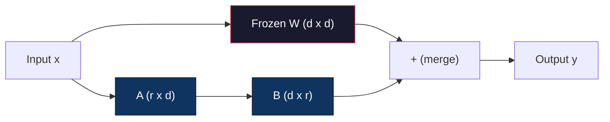
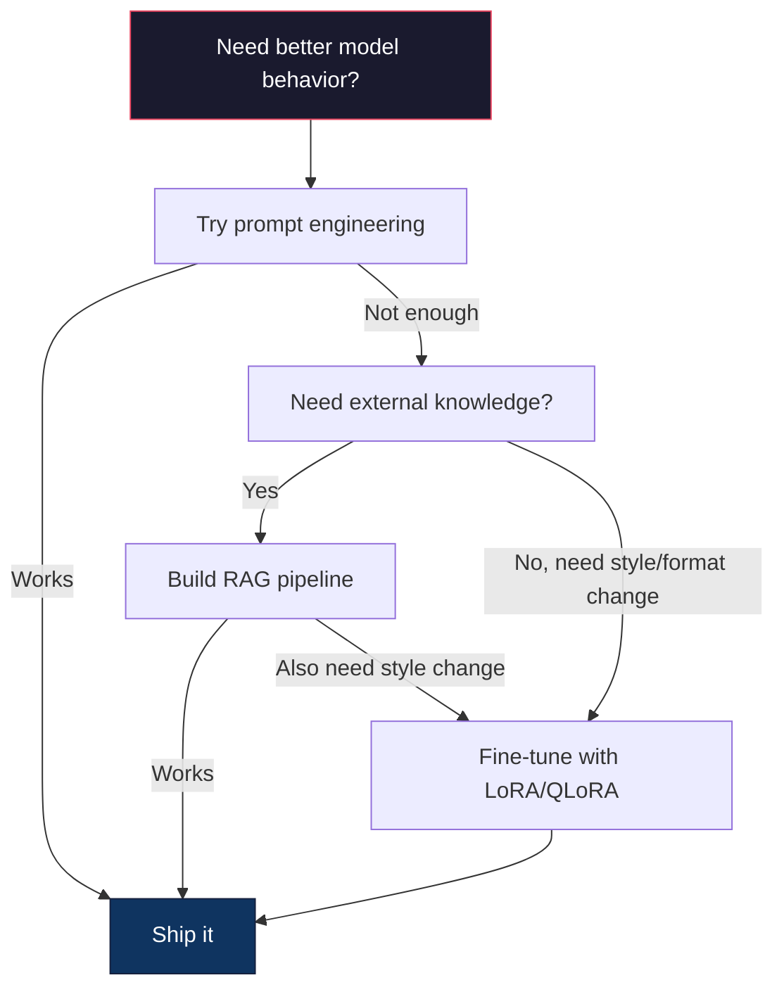

# Dostrajanie za pomocą LoRA i QLoRA

> Pełne dostrojenie (full fine-tuning) modelu o rozmiarze 7B wymaga około 56 GB pamięci VRAM. Mało który deweloper dysponuje takim sprzętem, podobnie jak większość firm. Technika LoRA pozwala dostroić ten sam model przy użyciu zaledwie 6 GB pamięci, trenując mniej niż 1% jego parametrów. Nie jest to zgniły kompromis – w większości zadań uzyskujemy jakość w pełni odpowiadającą pełnemu dostrojeniu. Cały ekosystem optymalizacji modeli open-source opiera się na tym jednym rozwiązaniu.

**Typ:** Projekt szkoleniowy
**Język:** Python
**Wymagania wstępne:** Faza 10, lekcja 06 (Dostrajanie instrukcji / SFT)
**Czas:** ~75 minut
**Powiązane lekcje:** Faza 10 obejmuje implementację od podstaw pętli SFT/DPO. Ta lekcja łączy te podstawy z nowoczesnymi pakietami narzędziowymi PEFT (PEFT, TRL, Unsloth, Axolotl, LLaMA-Factory).

## Cele nauczania

- Zaimplementuj technikę LoRA poprzez wstrzyknięcie macierzy adapterów niskiej rangi (A i B) do warstw attention wstępnie wytrenowanego modelu.
- Oblicz oszczędność parametrów w LoRA w porównaniu z pełnym dostrojeniem: ranga `r` przy wymiarze modelu `d_model` wymaga trenowania `2 * r * d` parametrów zamiast `d^2`.
- Przeprowadź dostrajanie modelu przy użyciu metody QLoRA (4-bitowa skwantyzowana baza + adaptery LoRA), umożliwiając uruchomienie treningu na konsumenckiej karcie graficznej.
- Scal wagi adaptera LoRA z modelem bazowym (merge weights) na potrzeby wdrożenia produkcyjnego i porównaj prędkość inferencji z adapterem i bez niego.

## Problem badawczy

Masz model bazowy, np. Llama 3 8B. Chcesz, aby odpowiadał na zgłoszenia klientów w specyficznym stylu i tonie Twojej firmy. Standardowym rozwiązaniem jest SFT (Supervised Fine-Tuning). Jednak pełne SFT generuje olbrzymie koszty infrastrukturalne.

Pełne dostrajanie aktualizuje każdy parametr w modelu. Llama 3 8B posiada 8 miliardów parametrów. W formacie FP16 (precyzja półpołówkowa) każdy parametr zajmuje 2 bajty. Daje to 16 GB samej pamięci na wagi modelu. Podczas treningu musisz jednak pomieścić również gradienty (kolejne 16 GB), stany optymalizatora Adam (32 GB na pęd i wariancję) oraz pamięć aktywacji. Łącznie: około 56 GB pamięci VRAM dla modelu 8B.

Pojedyncza karta A100 80 GB z trudem pomieści taki proces. Koszt wynajmu dwóch kart A100 w chmurze to około 3–4 USD za godzinę. Trening przez 3 epoki na 50 000 przykładów zajmuje 6–10 godzin, co daje 30–40 USD za jeden eksperyment. Wykonaj 10 takich prób w celu znalezienia odpowiednich hiperparametrów, a wydasz 400 USD jeszcze przed wdrożeniem czegokolwiek na produkcję.

Przeskaluj to do modelu Llama 3 70B, a liczby staną się zaporowe: 140 GB na same wagi. Wymaga to klastra wielokartowego i budżetu rzędu setek dolarów za jedno uruchomienie.

Istnieje też głębszy problem natury naukowej. Pełne dostrajanie modyfikuje każdą wagę w modelu. Jeśli dostroisz go na danych obsługi klienta, możesz drastycznie pogorszyć jego ogólne zdolności logiczne i językowe. Zjawisko to nazywa się katastrofalnym zapominaniem (catastrophic forgetting). Model staje się świetny w jednym zadaniu kosztem utraty sprawności w innych.

Potrzebujemy metody, która trenuje minimalną liczbę parametrów, zużywa ułamek pamięci VRAM i nie niszczy wiedzy ogólnej modelu.

## Koncepcja teoretyczna

### LoRA: Low-Rank Adaptation

Edward Hu i zespół z Microsoftu opublikowali metodę LoRA w czerwcu 2021 roku. Kluczowy wniosek z pracy: modyfikacje wag podczas dostrajania charakteryzują się niską rangą wewnętrzną (low intrinsic dimension). Nie musimy aktualizować wszystkich 16.7 miliona parametrów w macierzy wag o wymiarach 4096x4096. Istotne zmiany można opisać przy użyciu macierzy o randze 16 lub 32.

Rozważmy aparat matematyczny. Standardowa warstwa liniowa wykonuje operację:

```
y = Wx
```

Gdzie `W` jest macierzą o wymiarach `d_out x d_in`. Dla warstwy projekcji attention o wymiarach 4096 x 4096 daje to dokładnie 16 777 216 parametrów.

LoRA zamraża macierz `W` i dodaje do niej rozkład niskiej rangi:

```
y = Wx + BAx
```

Gdzie `B` ma wymiary `d_out x r`, a `A` ma wymiary `r x d_in`. Ranga `r` jest znacznie mniejsza niż wymiar modelu `d` – zazwyczaj wynosi 8, 16 lub 32.

Dla `r = 16` na warstwie 4096x4096:
- Oryginalna liczba parametrów: 4096 x 4096 = 16 777 216
- Liczba parametrów LoRA: (4096 x 16) + (16 x 4096) = 65 536 + 65 536 = 131 072
- Procent trenowanych parametrów: 131 072 / 16 777 216 = 0.78%

Trenujesz zaledwie 0.78% wag, uzyskując jakość na poziomie 95–100% pełnego dostrojenia.



Macierz `A` jest inicjowana rozkładem losowym Gaussa. Macierz `B` jest inicjowana samymi zerami. Oznacza to, że na początku treningu wkład adaptera LoRA wynosi dokładnie zero – model rozpoczyna naukę od swojego oryginalnego zachowania i stopniowo dostosowuje wagi w procesie optymalizacji.

### Współczynnik skalowania: Alfa

LoRA wprowadza dodatkowy współczynnik skalowania `alpha`, który kontroluje siłę wpływu adaptera na wynik końcowy:

```
y = Wx + (alpha / r) * BAx
```

Gdy `alpha = r`, współczynnik skalowania wynosi 1. Jeśli `alpha = 2r` (popularne ustawienie domyślne), wkład adaptera jest podwajany. Ten parametr pozwala kontrolować siłę adaptacji niezależnie od bazowego parametru uczenia (learning rate).

Wskazówki praktyczne:
- Zależność `alpha = 2 * r` to powszechny standard w społeczności open-source.
- Ustawienie `alpha = r` daje stabilne, konserwatywne skalowanie o współczynniku 1.
- Wyższa wartość `alpha` wzmacnia modyfikacje na krok, co może przyspieszyć naukę, ale grozi niestabilnością procesu optymalizacji.

### Gdzie stosować adaptery LoRA

Model Transformer składa się z wielu warstw liniowych. Nie musimy modyfikować każdej z nich. W oryginalnej publikacji przetestowano różne scenariusze:

| Konfiguracja warstw docelowych | Trenowane parametry (model 7B) | Wynik jakościowy |
|-------------|----------------------|--------|
| tylko `q_proj` | 4.7 mln | Zadowalający |
| `q_proj` + `v_proj` | 9.4 mln | Dobry |
| `q_proj` + `k_proj` + `v_proj` + `o_proj` | 18.9 mln | Bardzo dobry (rekomendowany dla attention) |
| Wszystkie warstwy liniowe (Attention + MLP) | 37.7 mln | Najwyższy (często z marginalnym zyskiem) |

Optymalny kompromis dla większości zadań: dodanie LoRA do warstw projekcji zapytań (`q_proj`) i wartości (`v_proj`) w mechanizmie self-attention. Decydują one o tym, na jakich informacjach model skupia uwagę. Modyfikacja warstw MLP bywa przydatna w złożonych zadaniach (jak generowanie kodu), ale podwaja liczbę parametrów i narzut pamięciowy.

### Dobór rangi (Rank Selection)

Ranga `r` definiuje pojemność informacyjną adaptera:

| Ranga | Trenowane parametry (na warstwę) | Zastosowanie |
|------|---------------------------|---------|
| 4 | 32 768 | Prosta klasyfikacja, analiza wydźwięku (sentiment analysis) |
| 8 | 65 536 | Praca na jednej dziedzinie wiedzy, podsumowania (Q&A / Summarization) |
| 16 | 131 072 | Zadania wieloaspektowe, instrukcje złożone (SFT) |
| 32 | 262 144 | Skomplikowane wnioskowanie logiczne, generowanie kodu |
| 64 | 524 288 | Próg malejących korzyści dla większości zadań |
| 128 | 1 048 576 | Rzadko uzasadnione ekonomicznie |

Praca Edwarda Hu wykazała, że ranga `r = 4` pozwala na pełną adaptację w prostszych zadaniach. W praktyce najpowszechniej wybiera się wartości `r = 8` lub `r = 16`. Wyjście powyżej `r = 64` rzadko przekłada się na lepszą jakość, natomiast niweczy zyski z oszczędności pamięciowej adapterów.

### QLoRA: 4-bit Quantization + LoRA

Tim Dettmers i zespół z Uniwersytetu Waszyngtońskiego opublikowali metodę QLoRA w maju 2023 roku. Idea polega na skwantyzowaniu (skompresowaniu) wag modelu bazowego do precyzji 4-bitowej, a następnie dołączeniu na nich adapterów LoRA pracujących z precyzją FP16 (lub BF16).

To podejście drastycznie redukuje zapotrzebowanie na pamięć VRAM:

| Metoda treningu | Pamięć samych wag (model 7B) | Całkowita pamięć treningowa (7B) | Wymagane GPU |
|--------|---------|----------|------------|
| Pełne dostrajanie (FP16) | 14 GB | ~56 GB | 1x A100 80 GB |
| LoRA (baza FP16) | 14 GB | ~18 GB | 1x A100 40 GB |
| QLoRA (baza 4-bit NF4) | 3.5 GB | ~6 GB | 1x RTX 3090/4090 24 GB |

QLoRA wprowadza trzy innowacje techniczne:

**NF4 (Normal Float 4-bit)**: Dedykowany typ danych stworzony specjalnie pod kątem dystrybucji wag sieci neuronowych (które mają w przybliżeniu rozkład normalny). NF4 dopasowuje swoje 16 progów kwantyzacji do kwantyli standardowego rozkładu normalnego. Z perspektywy teorii informacji jest to optymalny format zapisu danych o takim rozkładzie, zachowujący znacznie więcej informacji niż klasyczna kwantyzacja liniowa (INT4) czy standardowy format Float4.

**Double Quantization (Podwójna kwantyzacja)**: Same parametry skalujące kwantyzacji (quantization constants) zajmują pamięć. Każdy blok 64 wag wymaga współczynnika skali FP32 (4 bajty). Dla modelu 7B przekłada się to na dodatkowe 0.4 GB pamięci. Podwójna kwantyzacja kompresuje te współczynniki do formatu FP8, redukując narzut do zaledwie 0.1 GB.

**Paged Optimizers (Stronicowanie optymalizatorów)**: Podczas uczenia na bardzo długich sekwencjach stany optymalizatora mogą okresowo przekraczać pamięć GPU. Stronicowanie wykorzystuje mechanizm Unified Memory technologii NVIDIA do automatycznego przenoszenia (stronicowania) stanów optymalizatora z pamięci VRAM do pamięci RAM procesora CPU, zapobiegając błędom braku pamięci (OOM - Out of Memory) kosztem nieznacznego spadku wydajności obliczeniowej.

### Wpływ na jakość modelu

Czy kompresja modelu bazowego do 4 bitów i stosowanie adapterów degraduje jakość? Wyniki testów porównawczych:

| Metoda | MMLU (5-shot) | MT-Bench | HumanEval |
|--------|-------------|----------|---------------|
| Pełne dostrojenie (Llama 2 7B) | 48.3 | 6.72 | 14.6 |
| LoRA `r = 16` | 47.9 | 6.68 | 14.0 |
| QLoRA `r = 16` (NF4) | 47.5 | 6.61 | 13.4 |
| QLoRA `r = 64` (NF4) | 48.1 | 6.70 | 14.2 |

LoRA przy randze `r = 16` ustępuje pełnemu dostrojeniu o mniej niż 1% w większości benchmarków. QLoRA o randze `r = 64` praktycznie zrównuje się z pełnym SFT, zużywając przy tym 90% mniej pamięci VRAM.

### Analiza kosztów w świecie rzeczywistym

Dostrajanie modelu Llama 3 8B na zbiorze 50 000 przykładów (3 epoki):

| Metoda | Karta graficzna | Czas treningu | Szacowany koszt |
|--------|-----|------|------|
| Pełne dostrojenie | 2x A100 80 GB | 8 godzin | ~32 USD |
| LoRA `r = 16` | 1x A100 40 GB | 4 godziny | ~8 USD |
| QLoRA `r = 16` | 1x RTX 4090 24 GB | 6 godzin | ~5 USD |
| QLoRA `r = 16` (z biblioteką Unsloth) | 1x RTX 4090 24 GB | 2.5 godziny | ~2 USD |
| QLoRA `r = 16` | 1x Tesla T4 16 GB | 12 godzin | ~4 USD |

Dzięki QLoRA koszt dostrojenia modelu na własnym GPU jest niższy niż koszt obiadu. To właśnie ta rewolucja zapoczątkowała gwałtowny rozwój modeli open-source.

### Ekosystem PEFT (stan na rok 2026)

| Narzędzie / Biblioteka | Rola w ekosystemie | Kiedy wybrać |
|----------|-----------|----------|
| **Hugging Face PEFT** | Oficjalna biblioteka implementująca LoRA, QLoRA, DoRA, IA3. | Gdy potrzebujesz pełnej kontroli nad kodem, a Twoja pętla bazuje na `transformers.Trainer`. |
| **TRL (Transformer Reinforcement Learning)** | Moduł do uczenia ze sprzężeniem zwrotnym (SFT, DPO, GRPO, PPO). | Po zakończeniu etapu SFT, gdy wdrażasz wyrównywanie modeli (alignment); zintegrowany z PEFT. |
| **Unsloth** | Ekstremalnie zoptymalizowane jądra Triton faz forward/backward. | Gdy zależy Ci na 2-5x szybszym treningu i mniejszym zużyciu VRAM; wspiera architektury Llama/Mistral/Qwen. |
| **Axolotl** | Orkiestrator treningu konfigurowany za pomocą plików YAML. | Gdy wdrażasz powtarzalny, produkcyjny potok szkoleniowy i chcesz uniknąć pisania skryptów. |
| **LLaMA-Factory** | Kompletny interfejs GUI/CLI/API do szkolenia modeli. | Gdy chcesz przeprowadzić szybki trening bez pisania kodu (zerocode). |
| **torchtune** | Natywne skrypty i przepisy w czystym PyTorch. | Gdy Twoja organizacja standaryzuje procesy bezpośrednio w PyTorch, unikając zależności od Hugging Face. |

Złota zasada dewelopera: szybki eksperyment badawczy → PEFT. Powtarzalny potok produkcyjny → Axolotl z optymalizacją Unsloth. Szybkie prototypowanie bez kodu → LLaMA-Factory.

### Strategie zarządzania adapterami

Po zakończeniu treningu dysponujesz zamrożonym modelem bazowym oraz plikiem adaptera LoRA (zazwyczaj o rozmiarze 10–100 MB). Możesz zarządzać nimi na dwa sposoby:

1. **Przechowywanie rozdzielne (Dynamic serving)**: Model bazowy i adaptery są ładowane osobno. Możesz dynamicznie podmieniać pliki adapterów w locie w zależności od zadania. Umożliwia to obsługę wielu dopasowanych funkcjonalnie modeli z poziomu jednej instancji modelu bazowego w pamięci GPU.
2. **Trwałe scalenie (Hard merge)**: Przeliczasz wagi modelu według wzoru `W' = W + (alpha/r) * BA` i zapisujesz wynik jako nowy, pełny model. Scalony model ma identyczną strukturę i rozmiar co model bazowy. Brak jakichkolwiek opóźnień (latency overhead) w czasie inferencji i brak konieczności zarządzania plikami adapterów.

Do obsługi wielu różnych zadań (osobny adapter do kodu, osobny do tłumaczeń) stosuj wariant rozdzielny. Na potrzeby jednego, ściśle wyspecjalizowanego zadania produkcyjnego – wykonaj trwałe scalenie.

Zaawansowane techniki łączenia wielu adapterów:
- **TIES-Merging** (Yadav et al. 2023): usuwa parametry o małej wartości, rozwiązuje konflikty znaków wag, a następnie dokonuje scalenia. Minimalizuje to negatywne interakcje między adapterami.
- **DARE** (Yu et al. 2023): losowo zeruje wybrane wagi adapterów przed scaleniem i odpowiednio przeskalowuje pozostałe, co pozwala na łączenie odmiennych możliwości w jednym modelu.
- **Task Arithmetic (Arytmetyka zadań)**: bezpośrednie dodawanie lub odejmowanie macierzy wag adapterów. Dodanie wag adaptera programistycznego i matematycznego często daje model sprawny w obu dziedzinach.

### Kiedy NIE należy dostrajać modeli

Dostrajanie to zaawansowana metoda optymalizacji, którą należy rozważać w ostatniej kolejności:

1. **Najpierw spróbuj: Inżynierii promptów**. Napisz precyzyjny prompt systemowy, dodaj przykłady few-shot, zaimplementuj Chain of Thought. Jest to darmowe i zajmuje kilka minut. Jeśli to podejście daje 80% wymaganej skuteczności, rzadko opłaca się iść dalej.
2. **Następnie spróbuj: RAG**. Jeśli model musi posiadać wiedzę o Twoich dokumentach, bazie wiedzy czy katalogu produktów – wstrzykiwanie tych danych jako kontekst (RAG) jest tańsze, bezpieczniejsze i znacznie łatwiejsze w utrzymaniu.
3. **Na końcu: Dostrajanie**. Zastosuj LoRA/QLoRA, jeśli chcesz wymusić bardzo specyficzny styl odpowiedzi, sztywną strukturę danych wyjściowych (np. specyficzny schemat JSON), specyficzny schemat wnioskowania logicznego, lub gdy chcesz skompresować możliwości dużego modelu (np. 70B) do mniejszej, tańszej architektury (np. 8B).



## Implementacja krok po kroku

Napiszemy kompletną implementację warstwy LoRA, mechanizmu wstrzykiwania jej do modelu oraz algorytmu scalania wag w czystym PyTorch, bez użycia zewnętrznych bibliotek.

### Krok 1: Definicja modułu LoRA

```python
import torch
import torch.nn as nn
import math

class LoRALayer(nn.Module):
    def __init__(self, in_features, out_features, rank=8, alpha=16):
        super().__init__()
        self.rank = rank
        self.alpha = alpha
        self.scaling = alpha / rank

        self.A = nn.Parameter(torch.randn(in_features, rank) * (1 / math.sqrt(rank)))
        self.B = nn.Parameter(torch.zeros(rank, out_features))

    def forward(self, x):
        return (x @ self.A @ self.B) * self.scaling
```

### Krok 2: Wrapper warstwy liniowej z LoRA

```python
class LinearWithLoRA(nn.Module):
    def __init__(self, linear, rank=8, alpha=16):
        super().__init__()
        self.linear = linear
        self.lora = LoRALayer(
            linear.in_features, linear.out_features, rank, alpha
        )

        for param in self.linear.parameters():
            param.requires_grad = False

    def forward(self, x):
        return self.linear(x) + self.lora(x)
```

Oryginalna warstwa liniowa (`self.linear`) zostaje zamrożona – gradienty będą liczone wyłącznie dla parametrów adaptera `A` i `B` wewnątrz `self.lora`.

### Krok 3: Wstrzykiwanie LoRA do architektury modelu

```python
def inject_lora(model, target_modules, rank=8, alpha=16):
    for param in model.parameters():
        param.requires_grad = False

    lora_layers = {}
    for name, module in model.named_modules():
        if isinstance(module, nn.Linear):
            if any(t in name for t in target_modules):
                parent_name = ".".join(name.split(".")[:-1])
                child_name = name.split(".")[-1]
                parent = dict(model.named_modules())[parent_name]
                lora_linear = LinearWithLoRA(module, rank, alpha)
                setattr(parent, child_name, lora_linear)
                lora_layers[name] = lora_linear
    return lora_layers
```

Mrozimy cały model, a następnie dynamicznie podmieniamy docelowe warstwy liniowe na ich wersje z zaimplementowanym adapterem LoRA.

### Krok 4: Monitorowanie liczby parametrów

```python
def count_parameters(model):
    total = sum(p.numel() for p in model.parameters())
    trainable = sum(p.numel() for p in model.parameters() if p.requires_grad)
    frozen = total - trainable
    return {
        "total": total,
        "trainable": trainable,
        "frozen": frozen,
        "trainable_pct": 100 * trainable / total if total > 0 else 0
    }
```

### Krok 5: Trwałe scalanie wag (Merge)

```python
def merge_lora_weights(model):
    for name, module in model.named_modules():
        if isinstance(module, LinearWithLoRA):
            with torch.no_grad():
                merged = (
                    module.lora.A @ module.lora.B
                ) * module.lora.scaling
                module.linear.weight.data += merged.T
            parent_name = ".".join(name.split(".")[:-1])
            child_name = name.split(".")[-1]
            if parent_name:
                parent = dict(model.named_modules())[parent_name]
            else:
                parent = model
            setattr(parent, child_name, module.linear)
```

Po wykonaniu tej operacji adaptery LoRA są usuwane z modelu, a ich nauczone modyfikacje zostają trwale dodane do oryginalnych wag warstw liniowych.

### Krok 6: Symulacja kwantyzacji QLoRA

```python
def quantize_to_nf4(tensor, block_size=64):
    blocks = tensor.reshape(-1, block_size)
    scales = blocks.abs().max(dim=1, keepdim=True).values / 7.0
    scales = torch.clamp(scales, min=1e-8)
    quantized = torch.round(blocks / scales).clamp(-8, 7).to(torch.int8)
    return quantized, scales

def dequantize_from_nf4(quantized, scales, original_shape):
    dequantized = quantized.float() * scales
    return dequantized.reshape(original_shape)
```

Przedstawiony kod symuluje proces kwantyzacji NF4 poprzez mapowanie wag na 16 dyskretnych poziomów w blokach o rozmiarze 64. W warunkach produkcyjnych do natywnej kwantyzacji GPU wykorzystuje się bibliotekę `bitsandbytes`.

### Krok 7: Pętla szkoleniowa

```python
def train_lora(model, data, epochs=5, lr=1e-3, batch_size=4):
    optimizer = torch.optim.AdamW(
        [p for p in model.parameters() if p.requires_grad], lr=lr
    )
    criterion = nn.MSELoss()

    losses = []
    for epoch in range(epochs):
        epoch_loss = 0.0
        n_batches = 0
        indices = torch.randperm(len(data["inputs"]))

        for i in range(0, len(indices), batch_size):
            batch_idx = indices[i:i + batch_size]
            x = data["inputs"][batch_idx]
            y = data["targets"][batch_idx]

            output = model(x)
            loss = criterion(output, y)

            optimizer.zero_grad()
            loss.backward()
            optimizer.step()

            epoch_loss += loss.item()
            n_batches += 1

        avg_loss = epoch_loss / n_batches
        losses.append(avg_loss)

    return losses
```

### Krok 8: Pełny proces demonstracyjny

```python
def demo():
    torch.manual_seed(42)
    d_model = 256
    n_classes = 10

    model = nn.Sequential(
        nn.Linear(d_model, 512),
        nn.ReLU(),
        nn.Linear(512, 512),
        nn.ReLU(),
        nn.Linear(512, n_classes),
    )

    n_samples = 500
    x = torch.randn(n_samples, d_model)
    y = torch.randint(0, n_classes, (n_samples,))
    y_onehot = torch.zeros(n_samples, n_classes).scatter_(1, y.unsqueeze(1), 1.0)

    data = {"inputs": x, "targets": y_onehot}

    params_before = count_parameters(model)

    lora_layers = inject_lora(
        model, target_modules=["0", "2"], rank=8, alpha=16
    )

    params_after = count_parameters(model)

    losses = train_lora(model, data, epochs=20, lr=1e-3)

    merge_lora_weights(model)
    params_merged = count_parameters(model)

    return {
        "params_before": params_before,
        "params_after": params_after,
        "params_merged": params_merged,
        "losses": losses,
    }
```

## Praca z produkcyjnymi bibliotekami

Dostrajanie modelu przy użyciu oficjalnej biblioteki PEFT od Hugging Face:

```python
from transformers import AutoModelForCausalLM, AutoTokenizer
from peft import LoraConfig, get_peft_model, TaskType

model = AutoModelForCausalLM.from_pretrained("meta-llama/Llama-3.1-8B")
tokenizer = AutoTokenizer.from_pretrained("meta-llama/Llama-3.1-8B")

lora_config = LoraConfig(
    task_type=TaskType.CAUSAL_LM,
    r=16,
    lora_alpha=32,
    lora_dropout=0.05,
    target_modules=["q_proj", "v_proj"],
)

model = get_peft_model(model, lora_config)
model.print_trainable_parameters()
```

Konfiguracja QLoRA przy użyciu biblioteki `bitsandbytes`:

```python
from transformers import BitsAndBytesConfig

bnb_config = BitsAndBytesConfig(
    load_in_4bit=True,
    bnb_4bit_quant_type="nf4",
    bnb_4bit_compute_dtype=torch.bfloat16,
    bnb_4bit_use_double_quant=True,
)

model = AutoModelForCausalLM.from_pretrained(
    "meta-llama/Llama-3.1-8B",
    quantization_config=bnb_config,
    device_map="auto",
)

model = get_peft_model(model, lora_config)
```

Szkolenie modelu z użyciem klasy `Trainer` z biblioteki Hugging Face `transformers`:

```python
from transformers import TrainingArguments, Trainer
from datasets import load_dataset

dataset = load_dataset("tatsu-lab/alpaca", split="train[:5000]")

training_args = TrainingArguments(
    output_dir="./lora-llama",
    num_train_epochs=3,
    per_device_train_batch_size=4,
    gradient_accumulation_steps=4,
    learning_rate=2e-4,
    fp16=True,
    logging_steps=10,
    save_strategy="epoch",
    optim="paged_adamw_8bit",
)

trainer = Trainer(
    model=model,
    args=training_args,
    train_dataset=dataset,
)

trainer.train()
model.save_pretrained("./lora-adapter")
```

## Materiały lekcyjne

W ramach tej lekcji otrzymujesz dostęp do:
- [prompt-lora-advisor.md](../outputs/prompt-lora-advisor.md) – system prompt do dobierania optymalnej rangi LoRA, modułów docelowych i hiperparametrów treningu dla konkretnych zadań.
- [skill-fine-tuning-guide.md](../outputs/skill-fine-tuning-guide.md) – plik instruktażowy (skill) prowadzący agenta przez drzewo decyzyjne określające, kiedy i jak przeprowadzić proces dostrajania.

## Ćwiczenia praktyczne

1. **Wpływ rangi na proces uczenia**: Uruchom proces demonstracyjny (`demo()`) dla rangi `r` równej 2, 4, 8, 16, 32 oraz 64. Wykres strat końcowych w zależności od wybranej rangi pozwoli Ci zaobserwować próg opłacalności (sweet spot), w którym dalsze zwiększanie rangi nie przekłada się już na spadek błędu.

2. **Porównanie warstw docelowych**: Zmodyfikuj funkcję `inject_lora` tak, aby wstrzykiwała adaptery wyłącznie do pierwszej warstwy liniowej (`0`), wyłącznie do drugiej (`2`), a następnie do wszystkich warstw liniowych. Porównaj tempo spadku straty (loss convergence) dla każdego ze scenariuszy.

3. **Analiza błędów kwantyzacji**: Zbadaj macierz wag modelu przed i po zastosowaniu funkcji kwantyzacji/dekwantyzacji (`quantize_to_nf4` / `dequantize_from_nf4`). Oblicz błąd średniokwadratowy (MSE) oraz korelację między wagami oryginalnymi a zrekonstruowanymi dla bloków o rozmiarach 32, 64, 128 oraz 256.

4. **Wielozadaniowość z użyciem adapterów**: Wytrenuj dwa niezależne adaptery LoRA na różnych podzbiorach danych. Zapisz pliki adapterów. Załaduj model bazowy, a następnie załaduj i przetestuj działanie każdego z adapterów osobno na tym samym zestawie danych wejściowych, aby potwierdzić możliwość dynamicznej podmiany zachowania modelu.

5. **Porównanie wydajności modelu scalonego**: Porównaj odpowiedzi modelu z włączonym adapterem LoRA oraz po przeprowadzeniu trwałego scalenia (`merge_lora_weights`). Upewnij się, że odpowiedzi są identyczne (w granicach tolerancji błędu precyzji obliczeń zmiennoprzecinkowych, np. 1e-5), a następnie zmierz czas inferencji dla obu wariantów.

## Słownik pojęć

| Termin | Co mówią deweloperzy | Co to oznacza w rzeczywistości |
|------|----------------|----------------------|
| **LoRA** | „Efektywne dostrajanie (PEFT)” | Metoda polegająca na zamrożeniu wag bazowych i wstrzyknięciu do warstw modelu pary małych macierzy A i B o niskiej randze (low-rank), których iloczyn BA przybliża aktualizację wag. |
| **QLoRA** | „Dostrajanie na taniej karcie” | Odmiana LoRA, w której model bazowy jest skompresowany do precyzji 4-bitowej (NF4), a trenowane są wyłącznie dołączone na nim adaptery FP16. |
| **Ranga (r)** | „Pojemność adaptera” | Wewnętrzny wymiar macierzy A i B kontrolujący liczbę trenowanych parametrów oraz precyzję dopasowania adaptera. |
| **Alfa (lora_alpha)** | „Wzmocnienie adaptera” | Parametr skalujący wkład adaptera w wynik końcowy warstwy; stosunek `alpha / r` określa wagę poprawek. |
| **NF4** | „4-bitowy Normal Float” | Zoptymalizowany pod kątem wag sieci neuronowych typ danych, rozkładający 16 wartości kwantyzacji zgodnie z rozkładem normalnym. |
| **Adapter** | „Wagi adaptera” | Mały plik wag (10–100 MB) zwierający nauczone macierze A i B, nakładany dynamicznie na model bazowy. |
| **Moduły docelowe** | „Target modules” | Nazwy konkretnych warstw modelu (np. `q_proj`, `v_proj`), do których wstrzykujemy adaptery. |
| **Scalanie (Merging)** | „Wtopienie adaptera” | Matematyczne dodanie modyfikacji adaptera bezpośrednio do wag bazowych w celu eliminacji narzutów wydajnościowych na produkcji. |
| **Stronicowanie (Paging)** | „Paged Optimizers” | Przenoszenie stanów optymalizatora z pamięci VRAM do RAM procesora CPU w celu ochrony przed błędami braku pamięci (OOM). |
| **Katastrofalne zapominanie** | „Model zapomniał wiedzę ogólną” | Zjawisko polegające na utracie przez model ogólnych zdolności logiczno-językowych w wyniku przeuczenia na jednym, specyficznym zadaniu. |

## Sugerowane lektury

- [Hu et al., „LoRA: Low-Rank Adaptation of Large Language Models” (2021)](https://arxiv.org/abs/2106.09685) – oryginalna publikacja naukowa wprowadzająca metodę LoRA.
- [Dettmers et al., „QLoRA: Efficient Finetuning of Quantized Language Models” (2023)](https://arxiv.org/abs/2305.14314) – publikacja wprowadzająca NF4, podwójną kwantyzację oraz stronicowanie optymalizatorów.
- [Dokumentacja biblioteki PEFT od Hugging Face](https://huggingface.co/docs/peft) – oficjalna dokumentacja najpopularniejszej biblioteki do wydajnego trenowania modeli.
- [Yadav et al., „TIES-Merging: Resolving Interference When Merging Models” (2023)](https://arxiv.org/abs/2306.01708) – zaawansowane metody fuzji wielu adapterów LoRA.
- [Rafailov et al., „Direct Preference Optimization: Your Language Model is Secretly a Reward Model” (NeurIPS 2023)](https://arxiv.org/abs/2305.18290) – publikacja wprowadzająca DPO, czyli optymalizację preferencji bez osobnego modelu nagrody.
- [Dokumentacja Hugging Face TRL](https://huggingface.co/docs/trl) – narzędzia do uczenia modeli w procesie dostrajania instrukcji i wyrównywania preferencji (SFTTrainer, DPOTrainer).
- [Dokumentacja optymalizacji Unsloth](https://docs.unsloth.ai) – szczegóły techniczne dotyczące przyspieszania treningu i redukcji zużycia pamięci VRAM.
- [Dokumentacja orkiestratora Axolotl](https://axolotl-ai-cloud.github.io/axolotl/) – kompletny przewodnik po konfiguracji wielokartowego treningu SFT/QLoRA za pomocą plików YAML.
