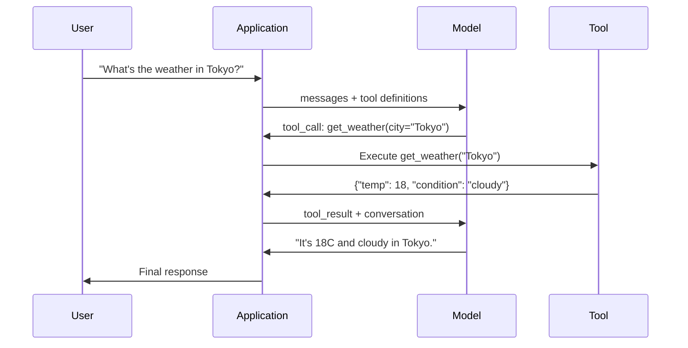

# Wywoływanie funkcji i użycie narzędzi

> LLM nie mogą nic zrobić. Generują tekst. To jest cała zdolność. Nie mogą sprawdzić pogody, wysłać zapytania do bazy danych, wysłać e-maila, uruchomić kodu ani odczytać pliku. Każdy „agent AI”, jakiego kiedykolwiek widziałeś, to plik JSON generujący LLM, który mówi, którą funkcję wywołać – a następnie kod faktycznie ją wywołuje. Modelem jest mózg. Narzędzia to ręce. Wywołanie funkcji to łączący je układ nerwowy.

**Typ:** Kompilacja
**Języki:** Python
**Wymagania wstępne:** Faza 11, lekcja 03 (ustrukturyzowane wyniki)
**Czas:** ~75 minut
**Powiązane:** Faza 11 · 14 (Protokół kontekstu modelu) — gdy narzędzie jest współdzielone między hostami, należy przejść od wewnętrznego wywoływania funkcji do serwera MCP. Ta lekcja dotyczy przypadku wbudowanego; MCP obejmuje sprawę protokołu.

## Cele nauczania

- Zaimplementuj pętlę wywoływania funkcji: zdefiniuj schematy narzędzi, analizuj JSON wywołania narzędzia w modelu, wykonuj funkcje i zwracaj wyniki
- Projektuj schematy narzędzi z przejrzystymi opisami i wpisanymi parametrami, które model może niezawodnie przywoływać
- Zbuduj wieloobrotową pętlę agentów, która łączy wiele wywołań funkcji w celu odpowiedzi na złożone zapytania
- Obsługa przypadków wywoływania funkcji brzegowych: równoległe wywołania narzędzi, propagacja błędów i zapobieganie nieskończonym pętlom narzędzi

## Problem

Budujesz chatbota. Użytkownik pyta: „Jaka jest teraz pogoda w Tokio?”

Modelka odpowiada: „Nie mam dostępu do danych pogodowych w czasie rzeczywistym, ale biorąc pod uwagę porę roku, w Tokio temperatura prawdopodobnie wynosi około 15 stopni Celsjusza…”

To halucynacja ubrana w zastrzeżenie. Modelka nie zna pogody. To nigdy się nie stanie. Pogoda zmienia się co godzinę. Dane szkoleniowe modelu mają kilka miesięcy.

Prawidłowa odpowiedź wymaga wywołania API OpenWeatherMap, uzyskania aktualnej temperatury i zwrócenia liczby rzeczywistej. Model nie może wywoływać interfejsów API. Twój kod może. Brakujący element: ustrukturyzowany protokół, który pozwala modelowi powiedzieć „Muszę wywołać interfejs API pogody z tymi argumentami” i pozwala Twojemu kodowi go wykonać i przekazać wynik.

To jest wywołanie funkcji. Model wyprowadza ustrukturyzowany kod JSON opisujący, którą funkcję wywołać z jakimi argumentami. Twoja aplikacja wykonuje tę funkcję. Wynik wraca do rozmowy. Model wykorzystuje wynik do uzyskania ostatecznej odpowiedzi.

Bez wywoływania funkcji LLM są encyklopediami. Dzięki niemu stają się agentami.

## Koncepcja

### Pętla wywoływania funkcji

Każda interakcja z użyciem narzędzia przebiega według tej samej 5-etapowej pętli.



Krok 1: użytkownik wysyła wiadomość. Krok 2: model otrzymuje komunikat wraz z definicjami narzędzi (Schemat JSON opisujący dostępne funkcje). Krok 3: zamiast odpowiadać tekstem, model wysyła wywołanie narzędzia — ustrukturyzowany obiekt JSON z nazwą funkcji i argumentami. Krok 4: Twój kod wykonuje funkcję i przechwytuje wynik. Krok 5: wynik wraca do modelu, który ma teraz rzeczywiste dane do uzyskania ostatecznej odpowiedzi.

Model nigdy niczego nie wykonuje. Decyduje tylko, co wywołać i z jakimi argumentami. Twój kod jest wykonawcą.

### Definicje narzędzi: Kontrakt schematu JSON

Każde narzędzie jest zdefiniowane przez schemat JSON, który informuje model, co robi funkcja, jakie przyjmuje argumenty i jakiego typu muszą to być argumenty.

```json
{
  "type": "function",
  "function": {
    "name": "get_weather",
    "description": "Get current weather for a city. Returns temperature in Celsius and conditions.",
    "parameters": {
      "type": "object",
      "properties": {
        "city": {
          "type": "string",
          "description": "City name, e.g. 'Tokyo' or 'San Francisco'"
        },
        "units": {
          "type": "string",
          "enum": ["celsius", "fahrenheit"],
          "description": "Temperature units"
        }
      },
      "required": ["city"]
    }
  }
}
```

Pola `description` są krytyczne. Model odczytuje je, aby zdecydować, kiedy i jak użyć narzędzia. Niejasny opis, taki jak „pobiera pogodę”, powoduje gorszy wybór narzędzia niż „Pobierz aktualną pogodę dla miasta. Zwraca temperaturę w stopniach Celsjusza i warunki”. Opis stanowi zachętę do wyboru narzędzia.

### Porównanie dostawców

Każdy główny dostawca obsługuje wywoływanie funkcji, ale powierzchnia API jest inna.

| Dostawca | Parametr API | Format wywołania narzędzia | Połączenia równoległe | Wymuszone połączenie |
|---------|-------------|--------------------------------|--------------|----------------|
| OpenAI (GPT-5, o4) | `tools` | `tool_calls[].function` | Tak (wiele na turę) | `tool_choice="required"` |
| Antropiczny (Claude 4.6/4.7) | `tools` | `content[].type="tool_use"` | Tak (wiele bloków) | `tool_choice={"type":"any"}` |
| Google (Bliźnięta 3) | `function_declarations` | `functionCall` | Tak | `function_calling_config` |
| Waga otwarta (Lama 4, Qwen3, DeepSeek-V3) | Natywny `tools` na Lamie 4; Hermes lub ChatML na innych | Mieszane | Zależne od modelu | Oparte na podpowiedziach lub `tool_choice`, jeśli są obsługiwane |

Do 2026 r. trzej zamknięci dostawcy połączyli siły w niemal identycznych formatach opartych na schemacie JSON. Lama 4 jest dostarczana z natywnym polem `tools`, które odpowiada kształtowi OpenAI. Dostrajanie wagi otwartej wciąż się różni — format Hermes (NousResearch) jest najczęstszy w przypadku dostrajania innych firm. W przypadku narzędzi współdzielonych na różnych hostach preferuj MCP (faza 11 · 14) zamiast wbudowanych wywołań funkcji — serwer jest taki sam dla wszystkich.

### Wybór narzędzia: automatyczny, wymagany, specyficzny

Kontrolujesz, kiedy model używa narzędzi.

**Auto** (domyślnie): model decyduje, czy wywołać narzędzie, czy odpowiedzieć bezpośrednio. „Co to jest 2+2?” – odpowiada bezpośrednio. „Jaka jest pogoda?” -- wywołuje narzędzie.

**Wymagane**: model musi wywołać przynajmniej jedno narzędzie. Użyj tej opcji, jeśli wiesz, że zamiar użytkownika wymaga narzędzia. Zapobiega zgadywaniu modelu zamiast wyszukiwania rzeczywistych danych.

**Określona funkcja**: zmusza model do wywołania określonej funkcji. `tool_choice={"type":"function", "function": {"name": "get_weather"}}` gwarantuje wywołanie narzędzia pogodowego niezależnie od zapytania. Użyj tego do routingu — gdy logika nadrzędna już określiła, które narzędzie jest potrzebne.

### Równoległe wywoływanie funkcji

GPT-4o i Claude mogą wywoływać wiele funkcji w jednej turze. Użytkownik pyta: „Jaka jest pogoda w Tokio i Nowym Jorku?” Model wyprowadza jednocześnie dwa wywołania narzędzi:

```json
[
  {"name": "get_weather", "arguments": {"city": "Tokyo"}},
  {"name": "get_weather", "arguments": {"city": "New York"}}
]
```

Twój kod wykonuje oba (najlepiej jednocześnie), zwraca oba wyniki, a model syntetyzuje pojedynczą odpowiedź. Skraca to liczbę podróży w obie strony z 2 do 1. W przypadku agentów z 5–10 wywołaniami narzędzi na zapytanie wywołanie równoległe zmniejsza opóźnienia o 60–80%.

### Ustrukturyzowane wyniki a wywoływanie funkcji

Lekcja 03 dotyczyła ustrukturyzowanych wyników. Wywoływanie funkcji wykorzystuje tę samą maszynerię schematu JSON, ale w innym celu.

**Ustrukturyzowane wyniki**: zmuszają model do generowania danych w określonym kształcie. Dane wyjściowe to produkt końcowy. Przykład: wyodrębnij informacje o produkcie z tekstu jako `{name, price, in_stock}`.

**Wywołanie funkcji**: model deklaruje zamiar wykonania akcji. Wynik jest etapem pośrednim. Przykład: `get_weather(city="Tokyo")` — model żąda działania, ale nie podaje ostatecznej odpowiedzi.

Jeśli chcesz wyodrębnić dane, użyj ustrukturyzowanych wyników. Użyj wywołania funkcji, jeśli chcesz, aby model współdziałał z systemami zewnętrznymi.

### Bezpieczeństwo: zasady niepodlegające negocjacjom

Wywoływanie funkcji jest najniebezpieczniejszą możliwością, jaką możesz dać LLM. Model wybiera, co ma wykonać. Jeśli zestaw narzędzi zawiera zapytania do bazy danych, model konstruuje zapytania. Jeśli zawiera polecenia powłoki, model je zapisuje.

**Zasada 1: Nigdy nie przekazuj kodu SQL wygenerowanego przez model bezpośrednio do bazy danych.** Model może generować i będzie generować DROP TABLE, zastrzyki UNION lub zapytania zwracające każdy wiersz. Zawsze parametryzuj. Zawsze sprawdzaj. Zawsze używaj listy dozwolonych operacji.

**Zasada 2: Funkcje listy dozwolonych.** Model może wywoływać tylko funkcje wyraźnie zdefiniowane przez Ciebie. Nigdy nie buduj ogólnego narzędzia „wykonaj dowolną funkcję według nazwy”. Jeśli masz 50 funkcji wewnętrznych, udostępnij tylko 5, których potrzebuje użytkownik.

**Zasada 3: Sprawdź argumenty.** Model może przekazać nazwę miasta `"; DROP TABLE users; --"`. Przed wykonaniem sprawdź każdy argument pod kątem oczekiwanych typów, zakresów i formatów.

**Zasada 4: Oczyść wyniki narzędzia.** Jeśli narzędzie zwraca wrażliwe dane (klucze API, PII, błędy wewnętrzne), przefiltruj je przed wysłaniem z powrotem do modelu. Model będzie dosłownie zawierał wyniki narzędzia w swojej odpowiedzi.

**Zasada 5: Wywołania narzędzi z limitem szybkości.** Model w pętli może wywoływać narzędzia setki razy. Ustaw maksimum (rozsądne jest 10–20 połączeń na rozmowę). Przerwij nieskończone pętle.

### Obsługa błędów

Narzędzia zawodzą. Przekroczono limit czasu interfejsów API. Bazy danych spadają. Pliki nie istnieją. Model musi wiedzieć, kiedy narzędzie zawodzi i dlaczego.

Zwracaj błędy jako wyniki narzędzia strukturalnego, a nie wyjątki:

```json
{
  "error": true,
  "message": "City 'Toky' not found. Did you mean 'Tokyo'?",
  "code": "CITY_NOT_FOUND"
}
```

Model odczytuje to, dostosowuje swoje argumenty i próbuje ponownie. Modele dobrze radzą sobie z samokorygowaniem na podstawie ustrukturyzowanych komunikatów o błędach. Słabo radzą sobie z odzyskiwaniem po pustych odpowiedziach lub ogólnych błędach typu „coś poszło nie tak”.

### MCP: Protokół kontekstu modelu

MCP to otwarty standard firmy Anthropic dotyczący interoperacyjności narzędzi. Zamiast definiowania przez każdą aplikację własnych narzędzi, MCP zapewnia uniwersalny protokół: narzędzia są obsługiwane przez serwery MCP, a wykorzystywane przez klientów MCP (takich jak Claude Code, Cursor lub Twoja aplikacja).

Jeden serwer MCP może udostępniać narzędzia dowolnemu kompatybilnemu klientowi. Serwer Postgres MCP zapewnia dostęp do bazy danych agentów zgodnych z MCP. Serwer GitHub MCP zapewnia dostęp do dowolnego repozytorium agentów. Narzędzia są definiowane raz i używane wszędzie.

MCP ma działać, wywołując tym samym, czym HTTP jest dla sieci. Standaryzuje warstwę transportową, dzięki czemu narzędzia stają się przenośne.

## Zbuduj to

### Krok 1: Zdefiniuj rejestr narzędzi

Zbuduj rejestr przechowujący definicje narzędzi i ich implementacje. Każde narzędzie ma definicję schematu JSON (co widzi model) i funkcję Pythona (co wykonuje Twój kod).

```python
import json
import math
import time
import hashlib

TOOL_REGISTRY = {}

def register_tool(name, description, parameters, function):
    TOOL_REGISTRY[name] = {
        "definition": {
            "type": "function",
            "function": {
                "name": name,
                "description": description,
                "parameters": parameters,
            },
        },
        "function": function,
    }
```

### Krok 2: Wdróż 5 narzędzi

Zbuduj kalkulator, wyszukiwarkę pogody, symulator wyszukiwania w Internecie, czytnik plików i moduł uruchamiający kod.

```python
def calculator(expression, precision=2):
    allowed = set("0123456789+-*/.() ")
    if not all(c in allowed for c in expression):
        return {"error": True, "message": f"Invalid characters in expression: {expression}"}
    try:
        result = eval(expression, {"__builtins__": {}}, {"math": math})
        return {"result": round(float(result), precision), "expression": expression}
    except Exception as e:
        return {"error": True, "message": str(e)}

WEATHER_DB = {
    "tokyo": {"temp_c": 18, "condition": "cloudy", "humidity": 72, "wind_kph": 14},
    "new york": {"temp_c": 22, "condition": "sunny", "humidity": 45, "wind_kph": 8},
    "london": {"temp_c": 12, "condition": "rainy", "humidity": 88, "wind_kph": 22},
    "san francisco": {"temp_c": 16, "condition": "foggy", "humidity": 80, "wind_kph": 18},
    "sydney": {"temp_c": 25, "condition": "sunny", "humidity": 55, "wind_kph": 10},
}

def get_weather(city, units="celsius"):
    key = city.lower().strip()
    if key not in WEATHER_DB:
        suggestions = [c for c in WEATHER_DB if c.startswith(key[:3])]
        return {
            "error": True,
            "message": f"City '{city}' not found.",
            "suggestions": suggestions,
            "code": "CITY_NOT_FOUND",
        }
    data = WEATHER_DB[key].copy()
    if units == "fahrenheit":
        data["temp_f"] = round(data["temp_c"] * 9 / 5 + 32, 1)
        del data["temp_c"]
    data["city"] = city
    return data

SEARCH_DB = {
    "python function calling": [
        {"title": "OpenAI Function Calling Guide", "url": "https://platform.openai.com/docs/guides/function-calling", "snippet": "Learn how to connect LLMs to external tools."},
        {"title": "Anthropic Tool Use", "url": "https://docs.anthropic.com/en/docs/tool-use", "snippet": "Claude can interact with external tools and APIs."},
    ],
    "MCP protocol": [
        {"title": "Model Context Protocol", "url": "https://modelcontextprotocol.io", "snippet": "An open standard for connecting AI models to data sources."},
    ],
    "weather API": [
        {"title": "OpenWeatherMap API", "url": "https://openweathermap.org/api", "snippet": "Free weather API with current, forecast, and historical data."},
    ],
}

def web_search(query, max_results=3):
    key = query.lower().strip()
    for db_key, results in SEARCH_DB.items():
        if db_key in key or key in db_key:
            return {"query": query, "results": results[:max_results], "total": len(results)}
    return {"query": query, "results": [], "total": 0}

FILE_SYSTEM = {
    "data/config.json": '{"model": "gpt-4o", "temperature": 0.7, "max_tokens": 4096}',
    "data/users.csv": "name,email,role\nAlice,alice@example.com,admin\nBob,bob@example.com,user",
    "README.md": "# My Project\nA tool-use agent built from scratch.",
}

def read_file(path):
    if ".." in path or path.startswith("/"):
        return {"error": True, "message": "Path traversal not allowed.", "code": "FORBIDDEN"}
    if path not in FILE_SYSTEM:
        available = list(FILE_SYSTEM.keys())
        return {"error": True, "message": f"File '{path}' not found.", "available_files": available, "code": "NOT_FOUND"}
    content = FILE_SYSTEM[path]
    return {"path": path, "content": content, "size_bytes": len(content), "lines": content.count("\n") + 1}

def run_code(code, language="python"):
    if language != "python":
        return {"error": True, "message": f"Language '{language}' not supported. Only 'python' is available."}
    forbidden = ["import os", "import sys", "import subprocess", "exec(", "eval(", "__import__", "open("]
    for pattern in forbidden:
        if pattern in code:
            return {"error": True, "message": f"Forbidden operation: {pattern}", "code": "SECURITY_VIOLATION"}
    try:
        local_vars = {}
        exec(code, {"__builtins__": {"print": print, "range": range, "len": len, "str": str, "int": int, "float": float, "list": list, "dict": dict, "sum": sum, "min": min, "max": max, "abs": abs, "round": round, "sorted": sorted, "enumerate": enumerate, "zip": zip, "map": map, "filter": filter, "math": math}}, local_vars)
        result = local_vars.get("result", None)
        return {"success": True, "result": result, "variables": {k: str(v) for k, v in local_vars.items() if not k.startswith("_")}}
    except Exception as e:
        return {"error": True, "message": f"{type(e).__name__}: {e}"}
```

### Krok 3: Zarejestruj wszystkie narzędzia

```python
def register_all_tools():
    register_tool(
        "calculator", "Evaluate a mathematical expression. Supports +, -, *, /, parentheses, and decimals. Returns the numeric result.",
        {"type": "object", "properties": {"expression": {"type": "string", "description": "Math expression, e.g. '(10 + 5) * 3'"}, "precision": {"type": "integer", "description": "Decimal places in result", "default": 2}}, "required": ["expression"]},
        calculator,
    )
    register_tool(
        "get_weather", "Get current weather for a city. Returns temperature, condition, humidity, and wind speed.",
        {"type": "object", "properties": {"city": {"type": "string", "description": "City name, e.g. 'Tokyo' or 'San Francisco'"}, "units": {"type": "string", "enum": ["celsius", "fahrenheit"], "description": "Temperature units, defaults to celsius"}}, "required": ["city"]},
        get_weather,
    )
    register_tool(
        "web_search", "Search the web for information. Returns a list of results with title, URL, and snippet.",
        {"type": "object", "properties": {"query": {"type": "string", "description": "Search query"}, "max_results": {"type": "integer", "description": "Maximum results to return", "default": 3}}, "required": ["query"]},
        web_search,
    )
    register_tool(
        "read_file", "Read the contents of a file. Returns the file content, size, and line count.",
        {"type": "object", "properties": {"path": {"type": "string", "description": "Relative file path, e.g. 'data/config.json'"}}, "required": ["path"]},
        read_file,
    )
    register_tool(
        "run_code", "Execute Python code in a sandboxed environment. Set a 'result' variable to return output.",
        {"type": "object", "properties": {"code": {"type": "string", "description": "Python code to execute"}, "language": {"type": "string", "enum": ["python"], "description": "Programming language"}}, "required": ["code"]},
        run_code,
    )
```

### Krok 4: Zbuduj pętlę wywołującą funkcje

To jest główny silnik. Symuluje model, decydując, które narzędzie wywołać, wykonuje narzędzie i przekazuje wyniki.

```python
def simulate_model_decision(user_message, tools, conversation_history):
    msg = user_message.lower()

    if any(word in msg for word in ["weather", "temperature", "forecast"]):
        cities = []
        for city in WEATHER_DB:
            if city in msg:
                cities.append(city)
        if not cities:
            for word in msg.split():
                if word.capitalize() in [c.title() for c in WEATHER_DB]:
                    cities.append(word)
        if not cities:
            cities = ["tokyo"]
        calls = []
        for city in cities:
            calls.append({"name": "get_weather", "arguments": {"city": city.title()}})
        return calls

    if any(word in msg for word in ["calculate", "compute", "math", "what is", "how much"]):
        for token in msg.split():
            if any(c in token for c in "+-*/"):
                return [{"name": "calculator", "arguments": {"expression": token}}]
        if "+" in msg or "-" in msg or "*" in msg or "/" in msg:
            expr = "".join(c for c in msg if c in "0123456789+-*/.() ")
            if expr.strip():
                return [{"name": "calculator", "arguments": {"expression": expr.strip()}}]
        return [{"name": "calculator", "arguments": {"expression": "0"}}]

    if any(word in msg for word in ["search", "find", "look up", "google"]):
        query = msg.replace("search for", "").replace("look up", "").replace("find", "").strip()
        return [{"name": "web_search", "arguments": {"query": query}}]

    if any(word in msg for word in ["read", "file", "open", "cat", "show"]):
        for path in FILE_SYSTEM:
            if path.split("/")[-1].split(".")[0] in msg:
                return [{"name": "read_file", "arguments": {"path": path}}]
        return [{"name": "read_file", "arguments": {"path": "README.md"}}]

    if any(word in msg for word in ["run", "execute", "code", "python"]):
        return [{"name": "run_code", "arguments": {"code": "result = 'Hello from the sandbox!'", "language": "python"}}]

    return []

def execute_tool_call(tool_call):
    name = tool_call["name"]
    args = tool_call["arguments"]

    if name not in TOOL_REGISTRY:
        return {"error": True, "message": f"Unknown tool: {name}", "code": "UNKNOWN_TOOL"}

    tool = TOOL_REGISTRY[name]
    func = tool["function"]
    start = time.time()

    try:
        result = func(**args)
    except TypeError as e:
        result = {"error": True, "message": f"Invalid arguments: {e}"}

    elapsed_ms = round((time.time() - start) * 1000, 2)
    return {"tool": name, "result": result, "execution_time_ms": elapsed_ms}

def run_function_calling_loop(user_message, max_iterations=5):
    conversation = [{"role": "user", "content": user_message}]
    tool_definitions = [t["definition"] for t in TOOL_REGISTRY.values()]
    all_tool_results = []

    for iteration in range(max_iterations):
        tool_calls = simulate_model_decision(user_message, tool_definitions, conversation)

        if not tool_calls:
            break

        results = []
        for call in tool_calls:
            result = execute_tool_call(call)
            results.append(result)

        conversation.append({"role": "assistant", "content": None, "tool_calls": tool_calls})

        for result in results:
            conversation.append({"role": "tool", "content": json.dumps(result["result"]), "tool_name": result["tool"]})

        all_tool_results.extend(results)
        break

    return {"conversation": conversation, "tool_results": all_tool_results, "iterations": iteration + 1 if tool_calls else 0}
```

### Krok 5: Walidacja argumentu

Zbuduj walidator, który przed wykonaniem sprawdza argumenty wywołania narzędzia względem schematu JSON.

```python
def validate_tool_arguments(tool_name, arguments):
    if tool_name not in TOOL_REGISTRY:
        return [f"Unknown tool: {tool_name}"]

    schema = TOOL_REGISTRY[tool_name]["definition"]["function"]["parameters"]
    errors = []

    if not isinstance(arguments, dict):
        return [f"Arguments must be an object, got {type(arguments).__name__}"]

    for required_field in schema.get("required", []):
        if required_field not in arguments:
            errors.append(f"Missing required argument: {required_field}")

    properties = schema.get("properties", {})
    for arg_name, arg_value in arguments.items():
        if arg_name not in properties:
            errors.append(f"Unknown argument: {arg_name}")
            continue

        prop_schema = properties[arg_name]
        expected_type = prop_schema.get("type")

        type_checks = {"string": str, "integer": int, "number": (int, float), "boolean": bool, "array": list, "object": dict}
        if expected_type in type_checks:
            if not isinstance(arg_value, type_checks[expected_type]):
                errors.append(f"Argument '{arg_name}': expected {expected_type}, got {type(arg_value).__name__}")

        if "enum" in prop_schema and arg_value not in prop_schema["enum"]:
            errors.append(f"Argument '{arg_name}': '{arg_value}' not in {prop_schema['enum']}")

    return errors
```

### Krok 6: Uruchom wersję demonstracyjną

```python
def run_demo():
    register_all_tools()

    print("=" * 60)
    print("  Function Calling & Tool Use Demo")
    print("=" * 60)

    print("\n--- Registered Tools ---")
    for name, tool in TOOL_REGISTRY.items():
        desc = tool["definition"]["function"]["description"][:60]
        params = list(tool["definition"]["function"]["parameters"].get("properties", {}).keys())
        print(f"  {name}: {desc}...")
        print(f"    params: {params}")

    print(f"\n--- Argument Validation ---")
    validation_tests = [
        ("get_weather", {"city": "Tokyo"}, "Valid call"),
        ("get_weather", {}, "Missing required arg"),
        ("get_weather", {"city": "Tokyo", "units": "kelvin"}, "Invalid enum value"),
        ("calculator", {"expression": 123}, "Wrong type (int for string)"),
        ("unknown_tool", {"x": 1}, "Unknown tool"),
    ]
    for tool_name, args, label in validation_tests:
        errors = validate_tool_arguments(tool_name, args)
        status = "VALID" if not errors else f"ERRORS: {errors}"
        print(f"  {label}: {status}")

    print(f"\n--- Tool Execution ---")
    direct_tests = [
        {"name": "calculator", "arguments": {"expression": "(10 + 5) * 3 / 2"}},
        {"name": "get_weather", "arguments": {"city": "Tokyo"}},
        {"name": "get_weather", "arguments": {"city": "Mars"}},
        {"name": "web_search", "arguments": {"query": "python function calling"}},
        {"name": "read_file", "arguments": {"path": "data/config.json"}},
        {"name": "read_file", "arguments": {"path": "../etc/passwd"}},
        {"name": "run_code", "arguments": {"code": "result = sum(range(1, 101))"}},
        {"name": "run_code", "arguments": {"code": "import os; os.system('rm -rf /')"}},
    ]
    for call in direct_tests:
        result = execute_tool_call(call)
        print(f"\n  {call['name']}({json.dumps(call['arguments'])})")
        print(f"    -> {json.dumps(result['result'], indent=None)[:100]}")
        print(f"    time: {result['execution_time_ms']}ms")

    print(f"\n--- Full Function Calling Loop ---")
    test_queries = [
        "What's the weather in Tokyo?",
        "Calculate (100 + 250) * 0.15",
        "Search for MCP protocol",
        "Read the config file",
        "Run some Python code",
        "Tell me a joke",
    ]
    for query in test_queries:
        print(f"\n  User: {query}")
        result = run_function_calling_loop(query)
        if result["tool_results"]:
            for tr in result["tool_results"]:
                print(f"    Tool: {tr['tool']} ({tr['execution_time_ms']}ms)")
                print(f"    Result: {json.dumps(tr['result'], indent=None)[:90]}")
        else:
            print(f"    [No tool called -- direct response]")
        print(f"    Iterations: {result['iterations']}")

    print(f"\n--- Parallel Tool Calls ---")
    multi_city_query = "What's the weather in tokyo and london?"
    print(f"  User: {multi_city_query}")
    result = run_function_calling_loop(multi_city_query)
    print(f"  Tool calls made: {len(result['tool_results'])}")
    for tr in result["tool_results"]:
        city = tr["result"].get("city", "unknown")
        temp = tr["result"].get("temp_c", "N/A")
        print(f"    {city}: {temp}C, {tr['result'].get('condition', 'N/A')}")

    print(f"\n--- Security Checks ---")
    security_tests = [
        ("read_file", {"path": "../../etc/passwd"}),
        ("run_code", {"code": "import subprocess; subprocess.run(['ls'])"}),
        ("calculator", {"expression": "__import__('os').system('ls')"}),
    ]
    for tool_name, args in security_tests:
        result = execute_tool_call({"name": tool_name, "arguments": args})
        blocked = result["result"].get("error", False)
        print(f"  {tool_name}({list(args.values())[0][:40]}): {'BLOCKED' if blocked else 'ALLOWED'}")
```

## Użyj tego

### Wywoływanie funkcji OpenAI

```python
# from openai import OpenAI
#
# client = OpenAI()
#
# tools = [{
#     "type": "function",
#     "function": {
#         "name": "get_weather",
#         "description": "Get current weather for a city",
#         "parameters": {
#             "type": "object",
#             "properties": {
#                 "city": {"type": "string"},
#                 "units": {"type": "string", "enum": ["celsius", "fahrenheit"]}
#             },
#             "required": ["city"]
#         }
#     }
# }]
#
# response = client.chat.completions.create(
#     model="gpt-4o",
#     messages=[{"role": "user", "content": "Weather in Tokyo?"}],
#     tools=tools,
#     tool_choice="auto",
# )
#
# tool_call = response.choices[0].message.tool_calls[0]
# args = json.loads(tool_call.function.arguments)
# result = get_weather(**args)
#
# final = client.chat.completions.create(
#     model="gpt-4o",
#     messages=[
#         {"role": "user", "content": "Weather in Tokyo?"},
#         response.choices[0].message,
#         {"role": "tool", "tool_call_id": tool_call.id, "content": json.dumps(result)},
#     ],
# )
# print(final.choices[0].message.content)
```

OpenAI zwraca wywołania narzędzi jako `response.choices[0].message.tool_calls`. Każde wywołanie ma wartość `id`, którą należy uwzględnić podczas zwracania wyniku. Model używa tego identyfikatora do dopasowywania wyników do połączeń. GPT-4o może zwrócić wiele wywołań narzędzi w jednej odpowiedzi - iteruj i wykonaj je wszystkie.

### Użycie narzędzi antropicznych

```python
# import anthropic
#
# client = anthropic.Anthropic()
#
# response = client.messages.create(
#     model="claude-sonnet-4-20250514",
#     max_tokens=1024,
#     tools=[{
#         "name": "get_weather",
#         "description": "Get current weather for a city",
#         "input_schema": {
#             "type": "object",
#             "properties": {
#                 "city": {"type": "string"},
#                 "units": {"type": "string", "enum": ["celsius", "fahrenheit"]}
#             },
#             "required": ["city"]
#         }
#     }],
#     messages=[{"role": "user", "content": "Weather in Tokyo?"}],
# )
#
# tool_block = next(b for b in response.content if b.type == "tool_use")
# result = get_weather(**tool_block.input)
#
# final = client.messages.create(
#     model="claude-sonnet-4-20250514",
#     max_tokens=1024,
#     tools=[...],
#     messages=[
#         {"role": "user", "content": "Weather in Tokyo?"},
#         {"role": "assistant", "content": response.content},
#         {"role": "user", "content": [{"type": "tool_result", "tool_use_id": tool_block.id, "content": json.dumps(result)}]},
#     ],
# )
```

Anthropic zwraca wywołania narzędzi jako bloki treści z `type: "tool_use"`. Wynik narzędzia jest przesyłany w wiadomości użytkownika zawierającej `type: "tool_result"`. Zwróć uwagę na kluczową różnicę: Anthropic używa `input_schema` do definicji parametrów narzędzi, podczas gdy OpenAI używa `parameters`.

### Integracja MCP

```python
# MCP servers expose tools over a standardized protocol.
# Any MCP-compatible client can discover and call these tools.
#
# Example: connecting to a Postgres MCP server
#
# from mcp import ClientSession, StdioServerParameters
# from mcp.client.stdio import stdio_client
#
# server_params = StdioServerParameters(
#     command="npx",
#     args=["-y", "@modelcontextprotocol/server-postgres", "postgresql://localhost/mydb"],
# )
#
# async with stdio_client(server_params) as (read, write):
#     async with ClientSession(read, write) as session:
#         await session.initialize()
#         tools = await session.list_tools()
#         result = await session.call_tool("query", {"sql": "SELECT count(*) FROM users"})
```

MCP oddziela implementację narzędzia od jego zużycia. Serwer Postgres zna SQL. Serwer GitHub zna API. Twój agent po prostu odkrywa i wywołuje narzędzia — nie potrzebuje kodu specyficznego dla dostawcy dla każdej integracji.

## Wyślij to

Ta lekcja przedstawia `outputs/prompt-tool-designer.md` — szablon podpowiedzi wielokrotnego użytku do projektowania definicji narzędzi. Podaj opis tego, co narzędzie ma robić, a utworzy pełną definicję schematu JSON z opisami, typami i ograniczeniami.

Tworzy także `outputs/skill-function-calling-patterns.md` — strukturę decyzyjną do implementowania wywoływania funkcji w środowisku produkcyjnym, obejmującą projektowanie narzędzi, obsługę błędów, bezpieczeństwo i wzorce specyficzne dla dostawcy.

## Ćwiczenia

1. **Dodaj szóste narzędzie: zapytanie do bazy danych.** Zaimplementuj symulowane narzędzie SQL z tabelą w pamięci. Narzędzie akceptuje nazwę tabeli i warunki filtrowania (nie surowy kod SQL). Sprawdź, czy nazwa tabeli znajduje się na liście dozwolonych i czy operatory filtrów są ograniczone do `=`, `>`, `<`, `>=`, `<=`. Zwróć pasujące wiersze jako JSON.

2. **Zaimplementuj ponowną próbę ze sprzężeniem zwrotnym o błędzie.** Jeśli wywołanie narzędzia nie powiedzie się (np. nie znaleziono miasta), przekaż komunikat o błędzie z powrotem do funkcji decyzyjnej modelu i pozwól jej poprawić swoje argumenty. Śledź liczbę ponownych prób każdego połączenia. Ustaw maksymalnie 3 próby na wywołanie narzędzia.

3. **Stwórz agenta wieloetapowego.** Niektóre zapytania wymagają wywołań narzędzi łączenia: „Przeczytaj plik konfiguracyjny i powiedz mi, jaki model jest skonfigurowany, a następnie wyszukaj w Internecie ceny tego modelu”. Zaimplementuj pętlę, która będzie działać, dopóki model nie zdecyduje, że nie są już potrzebne żadne narzędzia, i przekazuje zgromadzone wyniki do każdego etapu decyzyjnego. Ogranicz do 10 iteracji, aby zapobiec nieskończonym pętlom.

4. **Zmierz dokładność wyboru narzędzia.** Utwórz 30 zapytań testowych z oczekiwanymi nazwami narzędzi. Uruchom funkcję decyzyjną na wszystkich 30 i zmierz, w jakim procencie przypadków wybiera właściwe narzędzie. Zidentyfikuj, które zapytania powodują najwięcej zamieszania między narzędziami.

5. **Zaimplementuj buforowanie wywołań narzędzi.** Jeśli to samo narzędzie zostanie wywołane z identycznymi argumentami w ciągu 60 sekund, zwróć wynik z pamięci podręcznej zamiast wykonywać ponownie. Użyj słownika z kluczem `(tool_name, frozenset(args.items()))`. Zmierz współczynniki trafień w pamięci podręcznej w rozmowie z 20 zapytaniami.

## Kluczowe terminy

| Termin | Co ludzie mówią | Co to właściwie oznacza |
|------|----------------|----------------------|
| Wywołanie funkcji | „Korzystanie z narzędzi” | Model generuje uporządkowany kod JSON opisujący funkcję do wywołania z określonymi argumentami — wykonuje ją Twój kod, a nie model |
| Definicja narzędzia | „Schemat funkcji” | Obiekt JSON Schema opisujący nazwę, przeznaczenie, parametry i typy narzędzia — model odczytuje to, aby zdecydować, kiedy i jak użyć narzędzia |
| Wybór narzędzia | „Tryb dzwonienia” | Kontroluje, czy model musi wywołać narzędzie (wymagane), może wywołać narzędzie (automatycznie) lub musi wywołać określone narzędzie (nazwane) |
| Połączenia równoległe | „Wielonarzędzie” | Model generuje wiele wywołań narzędzi w jednym obrocie, redukując liczbę cykli w obie strony — obsługują to zarówno GPT-4o, jak i Claude.
| Wynik narzędzia | „Wyjście funkcji” | Wartość zwracana po wykonaniu narzędzia, wysyłana z powrotem do modelu jako wiadomość, dzięki czemu może on w swojej odpowiedzi wykorzystać rzeczywiste dane |
| Walidacja argumentu | „Sprawdzanie wejścia” | Sprawdzanie, czy argumenty wygenerowane przez model odpowiadają oczekiwanym typom, zakresom i ograniczeniom przed wykonaniem narzędzia |
| MCP | „Protokół narzędzia” | Model Context Protocol — otwarty standard firmy Anthropic umożliwiający udostępnianie narzędzi za pośrednictwem serwerów, które każdy kompatybilny klient może wykryć i wywołać |
| Pętla agenta | „Pętla ReAct” | Cykl iteracyjny składający się z narzędzia podejmującego decyzję o modelu, narzędzia wykonującego kod i informacji zwrotnej o wynikach, dopóki model nie będzie miał wystarczającej ilości informacji, aby odpowiedzieć |
| Zatrucie narzędzia | „Szybki zastrzyk za pomocą narzędzi” | Atak, w którym wyniki narzędzia zawierają instrukcje manipulujące zachowaniem modelu — oczyść wszystkie dane wyjściowe narzędzia |
| Ograniczanie szybkości | „Zadzwoń do budżetu” | Ustawianie maksymalnej liczby wywołań narzędzi na rozmowę, aby zapobiec nieskończonym pętlom i niekontrolowanym kosztom API |

## Dalsze czytanie

– [Przewodnik po wywoływaniu funkcji OpenAI](https://platform.openai.com/docs/guides/function-calling) — ostateczne informacje dotyczące użycia narzędzi z GPT-4o, w tym wywołania równoległe, wywołania wymuszone i argumenty strukturalne
– [Przewodnik po użyciu narzędzia Anthropic](https://docs.anthropic.com/en/docs/tool-use) – Implementacja użycia narzędzia Claude'a z input_schema, odpowiedziami wielu narzędzi i konfiguracją Tool_choice
– [Specyfikacja protokołu kontekstowego modelu](https://modelcontextprotocol.io) — otwarty standard zapewniający interoperacyjność narzędzi w aplikacjach AI, z architekturą serwer/klient
– [Schick i in., 2023 – „Toolformer: Language Models Can Naucz się korzystać z narzędzi”](https://arxiv.org/abs/2302.04761) – podstawowy dokument na temat szkolenia menedżerów LLM w zakresie decydowania, kiedy i jak wywołać narzędzia zewnętrzne
– [Patil i in., 2023 – „Gorilla: model wielkojęzykowy połączony z ogromnymi interfejsami API”](https://arxiv.org/abs/2305.15334) – dostrajanie LLM pod kątem dokładnych wywołań API w 1645 interfejsach API z redukcją halucynacji
– [Tablica wyników wywołań funkcji Berkeley](https://gorilla.cs.berkeley.edu/leaderboard.html) – test porównawczy w czasie rzeczywistym porównujący dokładność wywoływania funkcji w modelach GPT-4o, Claude, Gemini i otwartych
- [Yao i in., „ReAct: Synergizing Reasoning and Acting in Language Models” (ICLR 2023)](https://arxiv.org/abs/2210.03629) – pętla Myśl-Działanie-Obserwacja, która jest zewnętrzną pętlą agenta wokół każdego wywołania narzędzia; tam, gdzie kończy się ta lekcja, rozpoczyna się faza 14.
– [Anthropic — Tworzenie skutecznych agentów (grudzień 2024 r.)](https://www.anthropic.com/research/building-efektywne-agents) – pięć możliwych do komponowania wzorców (szybkie łączenie w łańcuch, routing, równoległość, orkiestrator-pracownicy, oceniający-optymalizator) zbudowanych z prymitywnego użycia pojedynczego narzędzia.