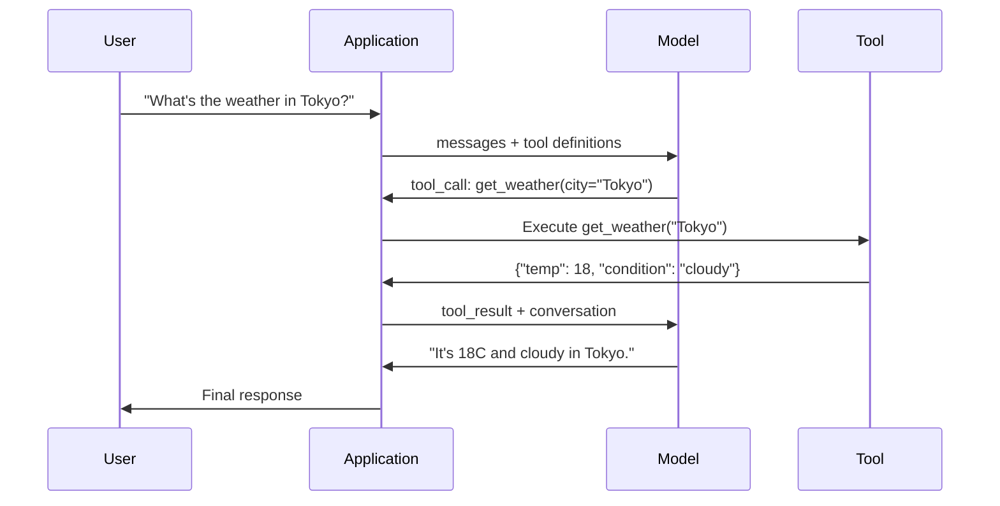

# Wywoływanie funkcji (Function Calling) i użycie narzędzi (Tool Use)

> Modele LLM same w sobie nie potrafią wykonywać żadnych zewnętrznych akcji. Ich jedyną umiejętnością jest generowanie tekstu. Nie potrafią sprawdzić pogody, odpytać bazy danych, wysłać e-maila, uruchomić kodu ani odczytać pliku. Każdy „agent AI”, jakiego widziałeś, opiera się na tym, że model generuje odpowiednio sformatowaną strukturę JSON wskazującą, jaką funkcję należy wywołać, a zewnętrzny kod aplikacji tę funkcję wykonuje. Model jest mózgiem. Narzędzia to ręce. Wywoływanie funkcji to układ nerwowy łączący jedno z drugim.

**Typ:** Projekt szkoleniowy
**Język:** Python
**Wymagania wstępne:** Faza 11, lekcja 03 (Ustrukturyzowane dane wyjściowe)
**Czas:** ~75 minut
**Powiązane lekcje:** Faza 11, lekcja 14 (Model Context Protocol - MCP) – kiedy narzędzie jest współdzielone między różnymi hostami, przechodzimy od lokalnego wywoływania funkcji do serwera MCP. Ta lekcja dotyczy integracji wbudowanej (in-process); lekcja o MCP skupia się na standaryzacji protokołu sieciowego.

## Cele nauczania

- Zaimplementuj kompletną pętlę wywoływania funkcji: od definicji schematu narzędzi, przez parsowanie wygenerowanego przez model kodu JSON, aż po wykonanie funkcji w aplikacji i zwrócenie wyniku.
- Zaprojektuj schematy narzędzi (tool schemas) z jasnymi opisami i typami parametrów, które model potrafi stabilnie i precyzyjnie dobierać.
- Zbuduj wieloetapową pętlę agenta (multi-turn agent loop) zdolną do łączenia wielu wywołań narzędzi w celu rozwiązania złożonych zadań.
- Zabezpiecz system przed skrajnymi przypadkami (edge cases): zaimplementuj równoległe wywołania narzędzi, propagację błędów oraz mechanizmy zapobiegania nieskończonym pętlom wywołań.

## Problem biznesowy

Budujesz chatbota. Użytkownik zadaje pytanie: „Jaka jest teraz pogoda w Tokio?”.

Model bez dostępu do narzędzi odpowie: „Nie mam dostępu do danych pogodowych w czasie rzeczywistym, ale biorąc pod uwagę obecną porę roku, w Tokio temperatura wynosi zazwyczaj około 15 stopni Celsjusza...”.

Jest to halucynacja ubrana w uprzejme zastrzeżenie. Model nie zna bieżącej pogody i nie ma możliwości jej poznać – pogoda zmienia się dynamicznie, podczas gdy dane treningowe modelu mają co najmniej kilka miesięcy.

Prawidłowa odpowiedź wymaga odpytania API serwisu pogodowego (np. OpenWeatherMap) i pobrania rzeczywistej temperatury. Model nie potrafi wywoływać API, ale Twój kod aplikacji jak najbardziej. Brakującym ogniwem jest ustrukturyzowany protokół, który pozwala modelowi zadeklarować: „Muszę wywołać funkcję pogodową z następującymi argumentami”, a aplikacji – wykonać to polecenie i zwrócić wynik z powrotem do kontekstu modelu.

Na tym polega wywoływanie funkcji (Function Calling). Model generuje ustrukturyzowany obiekt JSON opisujący nazwę funkcji oraz wartości jej parametrów. Twoja aplikacja wykonuje powiązaną funkcję, a jej wynik jest wstrzykiwany do historii konwersacji. Na koniec model przetwarza te dane i formułuje ostateczną odpowiedź dla użytkownika.

Bez wywoływania funkcji LLM są jedynie statycznymi encyklopediami. Dzięki niemu stają się autonomicznymi agentami.

## Koncept architektoniczny

### Pętla wywoływania funkcji (Tool Use Loop)

Każda interakcja z użyciem narzędzi przebiega według tego samego 5-etapowego schematu:



Krok 1: Użytkownik wysyła zapytanie.  
Krok 2: Aplikacja przekazuje zapytanie do modelu wraz z definicjami dostępnych narzędzi (schematy JSON opisujące funkcje).  
Krok 3: Zamiast odpowiedzi tekstowej, model generuje strukturę `tool_call` – obiekt JSON z nazwą funkcji i argumentami.  
Krok 4: Kod aplikacji wykonuje powiązaną funkcję lokalnie lub zdalnie i przechwytuje wynik.  
Krok 5: Wynik jest przekazywany z powrotem do modelu jako kolejna tura konwersacji, umożliwiając mu wygenerowanie ostatecznej odpowiedzi na podstawie rzeczywistych danych.

Pamiętaj: model nigdy nie wykonuje kodu bezpośrednio. Deklaruje jedynie intencję i parametry wywołania. Wykonawcą jest zawsze Twój kod aplikacji.

### Definicje narzędzi: Kontrakt JSON Schema

Każde narzędzie jest opisywane za pomocą standardu JSON Schema, który informuje model o przeznaczeniu funkcji, jej parametrach oraz wymaganych typach danych.

```json
{
  "type": "function",
  "function": {
    "name": "get_weather",
    "description": "Get current weather for a city. Returns temperature in Celsius and conditions.",
    "parameters": {
      "type": "object",
      "properties": {
        "city": {
          "type": "string",
          "description": "City name, e.g. 'Tokyo' or 'San Francisco'"
        },
        "units": {
          "type": "string",
          "enum": ["celsius", "fahrenheit"],
          "description": "Temperature units"
        }
      },
      "required": ["city"]
    }
  }
}
```

Pola `description` (opisy) mają krytyczne znaczenie. Model analizuje je semantycznie, aby zdecydować, czy dane narzędzie jest przydatne do rozwiązania problemu. Niejasny opis typu „pobiera pogodę” doprowadzi do znacznie częstszych błędów doboru narzędzi niż precyzyjne sformułowanie: „Pobiera aktualną pogodę dla wskazanego miasta. Zwraca temperaturę w stopniach Celsjusza oraz warunki atmosferyczne”. Opis w schemacie to de facto prompt nakierowujący model na wybór narzędzia.

### Porównanie implementacji u dostawców API

Wszyscy wiodący dostawcy obsługują wywoływanie funkcji, ale struktura ich API się różni:

| Dostawca | Parametr API | Format wygenerowanego wywołania | Wywołania równoległe | Wymuszenie wywołania |
|---------|-------------|--------------------------------|--------------|----------------|
| OpenAI (GPT-4o, o1, o3) | `tools` | `tool_calls[].function` | Tak (wiele na turę) | `tool_choice="required"` |
| Anthropic (Claude 3.5/3.7) | `tools` | `content[].type="tool_use"` | Tak (wiele bloków) | `tool_choice={"type": "any"}` |
| Google (Gemini 2.0/2.5) | `tools.function_declarations` | `candidates[].content.parts[].function_call` | Tak | `tool_config` (wymuszenie) |
| Open-weights (Llama 3, Qwen2.5, DeepSeek-V3) | Zintegrowane pole `tools` w nowszych API; Hermes lub ChatML w starszych | Zróżnicowany (często tagi XML) | Zależnie od modelu | Zależnie od silnika wnioskowania (prompt/config) |

Do 2026 roku dostawcy komercyjni praktycznie zunifikowali formaty definicji narzędzi wokół standardu JSON Schema. Modele z rodziny Llama posiadają natywne wsparcie dla parametru `tools` zgodne ze strukturą OpenAI. W przypadku starszych lub mniejszych modeli open-source formaty bywają zróżnicowane (najpowszechniejszy jest standard XML promowany przez NousResearch/Hermes). W przypadku systemów rozproszonych, gdzie narzędzia są hostowane na zewnętrznych serwerach, standardem staje się Model Context Protocol (MCP, lekcja 14).

### Tryby wyboru narzędzi (Tool Choice)

Możesz kontrolować zachowanie modelu w zakresie korzystania z narzędzi:

**Auto** (domyślny): Model samodzielnie decyduje, czy wywołać narzędzie, czy odpowiedzieć bezpośrednio tekstem. Zapytanie „Ile to 2+2?” wygeneruje bezpośrednią odpowiedź tekstową. Zapytanie „Jaka jest pogoda w Londynie?” wygeneruje wywołanie funkcji pogodowej.

**Required / Any**: Model jest zmuszony do wywołania co najmniej jednego narzędzia przed zwróceniem odpowiedzi tekstowej. Przydatne, gdy logika aplikacji bezwzględnie wymaga zasilenia danymi zewnętrznymi (np. wyszukiwarką).

**Specific Function (Wymuszenie konkretnej funkcji)**: Zmusza model do wywołania jednej, precyzyjnie wskazanej funkcji. Przekazanie parametru `tool_choice={"type": "function", "function": {"name": "get_weather"}}` gwarantuje, że model wywoła tę funkcję niezależnie od treści zapytania użytkownika. Stosowane przy orkiestracji i routingu zapytań.

### Wywołania równoległe (Parallel Tool Calling)

Nowoczesne modele (np. GPT-4o czy Claude 3.5) potrafią wygenerować wiele wywołań narzędzi w ramach jednej tury. Jeśli użytkownik zapyta: „Jaka jest pogoda w Tokio i Nowym Jorku?”, model wygeneruje dwa wywołania jednocześnie:

```json
[
  {"name": "get_weather", "arguments": {"city": "Tokyo"}},
  {"name": "get_weather", "arguments": {"city": "New York"}}
]
```

Aplikacja wykonuje oba wywołania (najlepiej równolegle/asynchronicznie), zwraca wyniki do kontekstu, a model generuje jedną, spójną odpowiedź syntetyzującą oba wyniki. Skraca to liczbę cykli zapytanie-odpowiedź z dwóch do jednego, redukując opóźnienia (latency) o 60–80%.

### Ustrukturyzowane dane wyjściowe vs. Wywoływanie funkcji

Oba podejścia bazują na strukturze JSON Schema, ale służą do innych celów:

**Ustrukturyzowane dane wyjściowe (Structured Outputs)**: Zmuszają model do wygenerowania danych w ściśle zdefiniowanym formacie. Dane te są produktem końcowym prezentowanym użytkownikowi (np. wyodrębnienie specyfikacji produktu z tekstu do obiektu `{nazwa, cena, dostepnosc}`).

**Wywoływanie funkcji (Function Calling)**: Model sygnalizuje zamiar wykonania akcji. Wygenerowany JSON jest stanem pośrednim. Zwrócenie `get_weather(city="Tokyo")` nie jest odpowiedzią dla użytkownika, ale instrukcją dla kodu aplikacji, by pobrać dane niezbędne do sformułowania odpowiedzi.

## Zasady bezpieczeństwa (Zasady krytyczne)

Umożliwienie modelowi LLM wywoływania funkcji to otwarcie drzwi do interakcji z rzeczywistym światem, co niesie za sobą poważne ryzyka bezpieczeństwa.

**Zasada 1: Nigdy nie przekazuj wygenerowanych przez LLM zapytań SQL bezpośrednio do bazy danych.** Model może (i pod wpływem sprytnego promptu użytkownika na pewno to zrobi) wygenerować polecenia typu `DROP TABLE`, wykonać wstrzyknięcie danych (SQL Injection) lub wyciągnąć poufne rekordy. Zawsze stosuj zapytania parametryzowane, ORM-y, sztywne listy dozwolonych tabel i kolumn oraz ograniczaj uprawnienia użytkownika bazy danych (zasada minimalnych uprawnień).

**Zasada 2: Sztywne bazy dozwolonych funkcji (Whitelisting).** Aplikacja może wykonywać wyłącznie funkcje, które zostały jawnie zadeklarowane w kodzie i zarejestrowane. Nigdy nie twórz uniwersalnego narzędzia typu „uruchom dowolną funkcję Pythona o wskazanej nazwie”. Jeśli w aplikacji masz 50 funkcji, udostępnij modelowi tylko te 5, których rzeczywiście potrzebuje do realizacji zadania.

**Zasada 3: Rygorystyczna walidacja argumentów.** Model może spróbować przekazać jako wartość argumentu złośliwy ciąg znaków, np. `city="; DROP TABLE users; --"`. Zanim wykonasz funkcję, sprawdź każdy przekazany parametr pod kątem typów danych, dozwolonych zakresów liczbowych, długości ciągów znaków czy wartości typu enum.

**Zasada 4: Oczyszczanie danych wyjściowych narzędzi (Sanitization).** Jeśli wywołane narzędzie zwróci błąd systemowy zawierający poufne dane (klucze API, hasła, wewnętrzne ścieżki plików, dane osobowe), odfiltruj te informacje przed przekazaniem wyniku do modelu. Pamiętaj, że dane wejściowe przekazane do modelu mogą zostać przez niego wypisane w ostatecznej odpowiedzi dla użytkownika.

**Zasada 5: Ograniczanie liczby wywołań (Rate Limiting) i zapobieganie pętlom.** Zły kod lub złośliwy prompt użytkownika może zapętlić agenta (model ciągle wywołuje narzędzia w nieskończoność). Zawsze definiuj maksymalną liczbę wywołań narzędzi w ramach jednej sesji (np. maksymalnie 10 wywołań na zapytanie użytkownika) i przerywaj pętlę w przypadku przekroczenia limitu.

### Obsługa błędów narzędzi

Narzędzia i zewnętrzne API mogą ulec awarii (błędy sieciowe, przekroczenia limitów czasu, niepoprawne dane). Model LLM musi otrzymać jasną informację, dlaczego operacja się nie powiodła.

Zamiast rzucać wyjątkami w aplikacji, przechwyć błąd i przekaż go do modelu w postaci ustrukturyzowanej odpowiedzi:

```json
{
  "error": true,
  "message": "City 'Toky' not found. Did you mean 'Tokyo'?",
  "code": "CITY_NOT_FOUND"
}
```

Model odczyta tę strukturę, zrozumie swój błąd (np. literówkę w nazwie miasta), skoryguje argumenty i podejmie kolejną, poprawną próbę wywołania. Modele świetnie radzą sobie z autokorektą, pod warunkiem, że otrzymają precyzyjny komunikat diagnostyczny. Zwrócenie pustego ciągu lub ogólnego błędu systemowego (np. `Internal Server Error 500`) uniemożliwi modelowi naprawienie błędu.

### Model Context Protocol (MCP)

MCP to otwarty standard stworzony przez firmę Anthropic służący do unifikacji integracji narzędzi z modelami AI. Zamiast pisać dedykowany kod integracyjny dla każdego narzędzia w każdej aplikacji osobno, MCP wprowadza uniwersalny protokół: serwery MCP hostują narzędzia, a klienci MCP (np. Claude Code, Cursor, Twoja aplikacja) dynamicznie je wykrywają i z nich korzystają.

Dzięki temu jeden serwer MCP (np. integrujący bazę PostgreSQL) może obsługiwać dowolną aplikację kliencką kompatybilną z tym standardem. Narzędzia są definiowane raz po stronie serwera MCP i stają się natychmiast dostępne dla wielu agentów i aplikacji.

Protokół MCP standaryzuje warstwę komunikacyjną, stając się dla ekosystemu narzędzi AI tym, czym protokół HTTP jest dla sieci Web.

## Implementacja krok po kroku

Zaimplementujemy prosty rejestr narzędzi, system walidacji parametrów na podstawie JSON Schema oraz pętlę agenta wykonującą wywołania w pamięci podręcznej Pythona.

### Krok 1: Definicja rejestru narzędzi

```python
import json
import math
import time

TOOL_REGISTRY = {}

def register_tool(name, description, parameters, function):
    TOOL_REGISTRY[name] = {
        "definition": {
            "type": "function",
            "function": {
                "name": name,
                "description": description,
                "parameters": parameters,
            },
        },
        "function": function,
    }
```

### Krok 2: Implementacja funkcji wykonawczych (Narzędzia)

Zaimplementujemy pięć testowych narzędzi: kalkulator, wyszukiwarkę pogodową, wyszukiwarkę internetową, moduł odczytu plików oraz interpreter kodu Python.

```python
def calculator(expression, precision=2):
    allowed = set("0123456789+-*/.() ")
    if not all(c in allowed for c in expression):
        return {"error": True, "message": f"Invalid characters in expression: {expression}"}
    try:
        result = eval(expression, {"__builtins__": {}}, {"math": math})
        return {"result": round(float(result), precision), "expression": expression}
    except Exception as e:
        return {"error": True, "message": str(e)}

WEATHER_DB = {
    "tokyo": {"temp_c": 18, "condition": "cloudy", "humidity": 72, "wind_kph": 14},
    "new york": {"temp_c": 22, "condition": "sunny", "humidity": 45, "wind_kph": 8},
    "london": {"temp_c": 12, "condition": "rainy", "humidity": 88, "wind_kph": 22},
    "san francisco": {"temp_c": 16, "condition": "foggy", "humidity": 80, "wind_kph": 18},
    "sydney": {"temp_c": 25, "condition": "sunny", "humidity": 55, "wind_kph": 10},
}

def get_weather(city, units="celsius"):
    key = city.lower().strip()
    if key not in WEATHER_DB:
        suggestions = [c for c in WEATHER_DB if c.startswith(key[:3])]
        return {
            "error": True,
            "message": f"City '{city}' not found.",
            "suggestions": suggestions,
            "code": "CITY_NOT_FOUND",
        }
    data = WEATHER_DB[key].copy()
    if units == "fahrenheit":
        data["temp_f"] = round(data["temp_c"] * 9 / 5 + 32, 1)
        del data["temp_c"]
    data["city"] = city
    return data

SEARCH_DB = {
    "python function calling": [
        {"title": "OpenAI Function Calling Guide", "url": "https://platform.openai.com/docs/guides/function-calling", "snippet": "Learn how to connect LLMs to external tools."},
        {"title": "Anthropic Tool Use", "url": "https://docs.anthropic.com/en/docs/tool-use", "snippet": "Claude can interact with external tools and APIs."},
    ],
    "mcp protocol": [
        {"title": "Model Context Protocol", "url": "https://modelcontextprotocol.io", "snippet": "An open standard for connecting AI models to data sources."},
    ],
}

def web_search(query, max_results=3):
    key = query.lower().strip()
    for db_key, results in SEARCH_DB.items():
        if db_key in key or key in db_key:
            return {"query": query, "results": results[:max_results], "total": len(results)}
    return {"query": query, "results": [], "total": 0}

FILE_SYSTEM = {
    "data/config.json": '{"model": "gpt-4o", "temperature": 0.7, "max_tokens": 4096}',
    "data/users.csv": "name,email,role\nAlice,alice@example.com,admin\nBob,bob@example.com,user",
    "README.md": "# My Project\nA tool-use agent built from scratch.",
}

def read_file(path):
    if ".." in path or path.startswith("/"):
        return {"error": True, "message": "Path traversal not allowed.", "code": "FORBIDDEN"}
    if path not in FILE_SYSTEM:
        available = list(FILE_SYSTEM.keys())
        return {"error": True, "message": f"File '{path}' not found.", "available_files": available, "code": "NOT_FOUND"}
    content = FILE_SYSTEM[path]
    return {"path": path, "content": content, "size_bytes": len(content), "lines": content.count("\n") + 1}

def run_code(code, language="python"):
    if language != "python":
        return {"error": True, "message": f"Language '{language}' not supported. Only 'python' is available."}
    forbidden = ["import os", "import sys", "import subprocess", "exec(", "eval(", "__import__", "open("]
    for pattern in forbidden:
        if pattern in code:
            return {"error": True, "message": f"Forbidden operation: {pattern}", "code": "SECURITY_VIOLATION"}
    try:
        local_vars = {}
        exec(code, {"__builtins__": {"print": print, "range": range, "len": len, "str": str, "int": int, "float": float, "list": list, "dict": dict, "sum": sum, "min": min, "max": max, "abs": abs, "round": round, "sorted": sorted, "enumerate": enumerate, "zip": zip, "map": map, "filter": filter, "math": math}}, local_vars)
        result = local_vars.get("result", None)
        return {"success": True, "result": result, "variables": {k: str(v) for k, v in local_vars.items() if not k.startswith("_")}}
    except Exception as e:
        return {"error": True, "message": f"{type(e).__name__}: {e}"}
```

### Krok 3: Rejestracja narzędzi w systemie

```python
def register_all_tools():
    register_tool(
        "calculator", "Evaluate a mathematical expression. Supports +, -, *, /, parentheses, and decimals. Returns the numeric result.",
        {"type": "object", "properties": {"expression": {"type": "string", "description": "Math expression, e.g. '(10 + 5) * 3'"}, "precision": {"type": "integer", "description": "Decimal places in result", "default": 2}}, "required": ["expression"]},
        calculator,
    )
    register_tool(
        "get_weather", "Get current weather for a city. Returns temperature, condition, humidity, and wind speed.",
        {"type": "object", "properties": {"city": {"type": "string", "description": "City name, e.g. 'Tokyo' or 'San Francisco'"}, "units": {"type": "string", "enum": ["celsius", "fahrenheit"], "description": "Temperature units, defaults to celsius"}}, "required": ["city"]},
        get_weather,
    )
    register_tool(
        "web_search", "Search the web for information. Returns a list of results with title, url, and snippet.",
        {"type": "object", "properties": {"query": {"type": "string", "description": "Search query"}, "max_results": {"type": "integer", "description": "Maximum results to return", "default": 3}}, "required": ["query"]},
        web_search,
    )
    register_tool(
        "read_file", "Read the contents of a file. Returns the file content, size, and line count.",
        {"type": "object", "properties": {"path": {"type": "string", "description": "Relative file path, e.g. 'data/config.json'"}}, "required": ["path"]},
        read_file,
    )
    register_tool(
        "run_code", "Execute Python code in a sandboxed environment. Set a 'result' variable to return output.",
        {"type": "object", "properties": {"code": {"type": "string", "description": "Python code to execute"}, "language": {"type": "string", "enum": ["python"], "description": "Programming language"}}, "required": ["code"]},
        run_code,
    )
```

### Krok 4: Pętla agenta (Orkiestracja wywołań)

Napiszemy moduł symulujący podejmowanie decyzji przez model (mapowanie intencji użytkownika na wywołania zdefiniowanych narzędzi), uruchamiający kod i zwracający wyniki.

```python
def simulate_model_decision(user_message, tools, conversation_history):
    msg = user_message.lower()

    if any(word in msg for word in ["weather", "temperature", "forecast"]):
        cities = []
        for city in WEATHER_DB:
            if city in msg:
                cities.append(city)
        if not cities:
            for word in msg.split():
                if word.capitalize() in [c.title() for c in WEATHER_DB]:
                    cities.append(word)
        if not cities:
            cities = ["tokyo"]
        calls = []
        for city in cities:
            calls.append({"name": "get_weather", "arguments": {"city": city.title()}})
        return calls

    if any(word in msg for word in ["calculate", "compute", "math", "what is", "how much"]):
        for token in msg.split():
            if any(c in token for c in "+-*/"):
                return [{"name": "calculator", "arguments": {"expression": token}}]
        if "+" in msg or "-" in msg or "*" in msg or "/" in msg:
            expr = "".join(c for c in msg if c in "0123456789+-*/.() ")
            if expr.strip():
                return [{"name": "calculator", "arguments": {"expression": expr.strip()}}]
        return [{"name": "calculator", "arguments": {"expression": "0"}}]

    if any(word in msg for word in ["search", "find", "look up", "google"]):
        query = msg.replace("search for", "").replace("look up", "").replace("find", "").strip()
        return [{"name": "web_search", "arguments": {"query": query}}]

    if any(word in msg for word in ["read", "file", "open", "cat", "show"]):
        for path in FILE_SYSTEM:
            if path.split("/")[-1].split(".")[0] in msg:
                return [{"name": "read_file", "arguments": {"path": path}}]
        return [{"name": "read_file", "arguments": {"path": "README.md"}}]

    if any(word in msg for word in ["run", "execute", "code", "python"]):
        return [{"name": "run_code", "arguments": {"code": "result = 'Hello from the sandbox!'", "language": "python"}}]

    return []

def execute_tool_call(tool_call):
    name = tool_call["name"]
    args = tool_call["arguments"]

    if name not in TOOL_REGISTRY:
        return {"error": True, "message": f"Unknown tool: {name}", "code": "UNKNOWN_TOOL"}

    tool = TOOL_REGISTRY[name]
    func = tool["function"]
    start = time.time()

    try:
        result = func(**args)
    except TypeError as e:
        result = {"error": True, "message": f"Invalid arguments: {e}"}

    elapsed_ms = round((time.time() - start) * 1000, 2)
    return {"tool": name, "result": result, "execution_time_ms": elapsed_ms}

def run_function_calling_loop(user_message, max_iterations=5):
    conversation = [{"role": "user", "content": user_message}]
    tool_definitions = [t["definition"] for t in TOOL_REGISTRY.values()]
    all_tool_results = []

    for iteration in range(max_iterations):
        tool_calls = simulate_model_decision(user_message, tool_definitions, conversation)

        if not tool_calls:
            break

        results = []
        for call in tool_calls:
            result = execute_tool_call(call)
            results.append(result)

        conversation.append({"role": "assistant", "content": None, "tool_calls": tool_calls})

        for result in results:
            conversation.append({"role": "tool", "content": json.dumps(result["result"]), "tool_name": result["tool"]})

        all_tool_results.extend(results)
        break

    return {"conversation": conversation, "tool_results": all_tool_results, "iterations": iteration + 1 if tool_calls else 0}
```

### Krok 5: Walidator argumentów wywołania

Zaimplementujemy moduł sprawdzający poprawność typów danych i obecność wymaganych pól przed faktycznym wykonaniem funkcji.

```python
def validate_tool_arguments(tool_name, arguments):
    if tool_name not in TOOL_REGISTRY:
        return [f"Unknown tool: {tool_name}"]

    schema = TOOL_REGISTRY[tool_name]["definition"]["function"]["parameters"]
    errors = []

    if not isinstance(arguments, dict):
        return [f"Arguments must be an object, got {type(arguments).__name__}"]

    for required_field in schema.get("required", []):
        if required_field not in arguments:
            errors.append(f"Missing required argument: {required_field}")

    properties = schema.get("properties", {})
    for arg_name, arg_value in arguments.items():
        if arg_name not in properties:
            errors.append(f"Unknown argument: {arg_name}")
            continue

        prop_schema = properties[arg_name]
        expected_type = prop_schema.get("type")

        type_checks = {"string": str, "integer": int, "number": (int, float), "boolean": bool, "array": list, "object": dict}
        if expected_type in type_checks:
            if not isinstance(arg_value, type_checks[expected_type]):
                errors.append(f"Argument '{arg_name}': expected {expected_type}, got {type(arg_value).__name__}")

        if "enum" in prop_schema and arg_value not in prop_schema["enum"]:
            errors.append(f"Argument '{arg_name}': '{arg_value}' not in {prop_schema['enum']}")

    return errors
```

### Krok 6: Testy demonstracyjne systemu

```python
def run_demo():
    register_all_tools()

    print("=" * 60)
    print("  Function Calling & Tool Use Demo")
    print("=" * 60)

    print("\n--- Zarejestrowane narzędzia ---")
    for name, tool in TOOL_REGISTRY.items():
        desc = tool["definition"]["function"]["description"][:60]
        params = list(tool["definition"]["function"]["parameters"].get("properties", {}).keys())
        print(f"  {name}: {desc}...")
        print(f"    parametry: {params}")

    print(f"\n--- Walidacja argumentów zapytań ---")
    validation_tests = [
        ("get_weather", {"city": "Tokyo"}, "Poprawne wywołanie"),
        ("get_weather", {}, "Brak wymaganych argumentów"),
        ("get_weather", {"city": "Tokyo", "units": "kelvin"}, "Niepoprawna wartość typu enum"),
        ("calculator", {"expression": 123}, "Niepoprawny typ danych (int zamiast string)"),
        ("unknown_tool", {"x": 1}, "Nieznane narzędzie"),
    ]
    for tool_name, args, label in validation_tests:
        errors = validate_tool_arguments(tool_name, args)
        status = "POPRAWNY" if not errors else f"BŁĘDY: {errors}"
        print(f"  {label}: {status}")

    print(f"\n--- Bezpośrednie wykonanie narzędzi ---")
    direct_tests = [
        {"name": "calculator", "arguments": {"expression": "(10 + 5) * 3 / 2"}},
        {"name": "get_weather", "arguments": {"city": "Tokyo"}},
        {"name": "get_weather", "arguments": {"city": "Mars"}},
        {"name": "web_search", "arguments": {"query": "python function calling"}},
        {"name": "read_file", "arguments": {"path": "data/config.json"}},
        {"name": "read_file", "arguments": {"path": "../etc/passwd"}},
        {"name": "run_code", "arguments": {"code": "result = sum(range(1, 101))"}},
        {"name": "run_code", "arguments": {"code": "import os; os.system('rm -rf /')"}},
    ]
    for call in direct_tests:
        result = execute_tool_call(call)
        print(f"\n  {call['name']}({json.dumps(call['arguments'])})")
        print(f"    -> {json.dumps(result['result'], indent=None)[:100]}")
        print(f"    Czas wykonania: {result['execution_time_ms']}ms")

    print(f"\n--- Pętla agenta (Function Calling Loop) ---")
    test_queries = [
        "What's the weather in Tokyo?",
        "Calculate (100 + 250) * 0.15",
        "Search for MCP protocol",
        "Read the config file",
        "Run some Python code",
        "Tell me a joke",
    ]
    for query in test_queries:
        print(f"\n  Użytkownik: {query}")
        result = run_function_calling_loop(query)
        if result["tool_results"]:
            for tr in result["tool_results"]:
                print(f"    Narzędzie: {tr['tool']} ({tr['execution_time_ms']}ms)")
                print(f"    Wynik: {json.dumps(tr['result'], indent=None)[:90]}")
        else:
            print(f"    [Brak wywołania narzędzi -- bezpośrednia odpowiedź tekstowa]")
        print(f"    Iteracje: {result['iterations']}")

    print(f"\n--- Wywołania równoległe (Parallel Tool Calls) ---")
    multi_city_query = "What's the weather in tokyo and london?"
    print(f"  Użytkownik: {multi_city_query}")
    result = run_function_calling_loop(multi_city_query)
    print(f"  Wykonane wywołania: {len(result['tool_results'])}")
    for tr in result["tool_results"]:
        city = tr["result"].get("city", "unknown")
        temp = tr["result"].get("temp_c", "N/A")
        print(f"    {city}: {temp}C, {tr['result'].get('condition', 'N/A')}")

    print(f"\n--- Weryfikacja zabezpieczeń (Security Sandbox) ---")
    security_tests = [
        ("read_file", {"path": "../../etc/passwd"}),
        ("run_code", {"code": "import subprocess; subprocess.run(['ls'])"}),
        ("calculator", {"expression": "__import__('os').system('ls')"}),
    ]
    for tool_name, args in security_tests:
        result = execute_tool_call({"name": tool_name, "arguments": args})
        blocked = "error" in result["result"]
        print(f"  {tool_name}({list(args.values())[0][:40]}): {'ZABLOKOWANE' if blocked else 'DOZWOLONE'}")
```

## Praca z produkcyjnymi API

### Wywoływanie funkcji w API OpenAI

```python
from openai import OpenAI
import json

client = OpenAI()

tools = [{
    "type": "function",
    "function": {
        "name": "get_weather",
        "description": "Get current weather for a city",
        "parameters": {
            "type": "object",
            "properties": {
                "city": {"type": "string"},
                "units": {"type": "string", "enum": ["celsius", "fahrenheit"]}
            },
            "required": ["city"]
        }
    }
}]

response = client.chat.completions.create(
    model="gpt-4o",
    messages=[{"role": "user", "content": "Weather in Tokyo?"}],
    tools=tools,
    tool_choice="auto",
)

tool_call = response.choices[0].message.tool_calls[0]
args = json.loads(tool_call.function.arguments)
result = get_weather(**args)

final = client.chat.completions.create(
    model="gpt-4o",
    messages=[
        {"role": "user", "content": "Weather in Tokyo?"},
        response.choices[0].message,
        {"role": "tool", "tool_call_id": tool_call.id, "content": json.dumps(result)},
    ],
)
print(final.choices[0].message.content)
```

Interfejs OpenAI zwraca wywołania narzędzi w polu `response.choices[0].message.tool_calls`. Każde wywołanie posiada unikalny identyfikator `id`, który musi zostać dołączony do tablicy wiadomości wraz z wynikiem działania funkcji. Pozwala to modelowi przypisać wyniki do konkretnych wywołań. Model może zwrócić wiele wywołań jednocześnie – należy je sparsować i obsłużyć w pętli.

### Wywoływanie funkcji w API Anthropic (Claude)

```python
import anthropic
import json

client = anthropic.Anthropic()

response = client.messages.create(
    model="claude-sonnet-4-20250514",
    max_tokens=1024,
    tools=[{
        "name": "get_weather",
        "description": "Get current weather for a city",
        "input_schema": {
            "type": "object",
            "properties": {
                "city": {"type": "string"},
                "units": {"type": "string", "enum": ["celsius", "fahrenheit"]}
            },
            "required": ["city"]
        }
    }],
    messages=[{"role": "user", "content": "Weather in Tokyo?"}],
)

tool_block = next(b for b in response.content if b.type == "tool_use")
result = get_weather(**tool_block.input)

final = client.messages.create(
    model="claude-sonnet-4-20250514",
    max_tokens=1024,
    messages=[
        {"role": "user", "content": "Weather in Tokyo?"},
        {"role": "assistant", "content": response.content},
        {"role": "user", "content": [{"type": "tool_result", "tool_use_id": tool_block.id, "content": json.dumps(result)}]},
    ],
)
```

Anthropic zwraca żądania wywołań jako bloki typu `tool_use`. Wynik działania narzędzia jest przesyłany jako blok typu `tool_result` w kolejnej wiadomości o roli `user`. Zwróć uwagę na kluczową różnicę: Anthropic definiuje parametry za pomocą pola `input_schema`, podczas gdy OpenAI stosuje nazwę `parameters`.

### Wywołania za pomocą Model Context Protocol (MCP)

```python
# Serwery MCP udostępniają narzędzia za pomocą ujednoliconego standardu.
# Dowolny klient kompatybilny z MCP może wykryć i wywołać te narzędzia.
#
# Przykład: połączenie z lokalnym serwerem MCP bazy Postgres.
#
# from mcp import ClientSession, StdioServerParameters
# from mcp.client.stdio import stdio_client
#
# server_params = StdioServerParameters(
#     command="npx",
#     args=["-y", "@modelcontextprotocol/server-postgres", "postgresql://localhost/mydb"],
# )
#
# async with stdio_client(server_params) as (read, write):
#     async with ClientSession(read, write) as session:
#         await session.initialize()
#         tools = await session.list_tools()
#         result = await session.call_tool("query", {"sql": "SELECT count(*) FROM users"})
```

MCP całkowicie oddziela architekturę serwera narzędzi od logiki samej aplikacji klienckiej. Serwer bazy danych zna składnię SQL, serwer integracji z GitHubem obsługuje uwierzytelnianie API, natomiast klient (agent) jedynie wyszukuje dostępne narzędzia i wysyła zapytania w uniwersalnym standardzie.

## Materiały lekcyjne

W ramach tej lekcji otrzymujesz dostęp do:
- [prompt-tool-designer.md](../outputs/prompt-tool-designer.md) – system prompt wspierający generowanie definicji schematów JSON Schema na podstawie słownego opisu funkcji.
- [skill-function-calling-patterns.md](../outputs/skill-function-calling-patterns.md) – plik instruktażowy (skill) opisujący produkcyjne wzorce projektowe integracji narzędzi, obsługi błędów i wdrożeń zabezpieczeń.

## Ćwiczenia praktyczne

1. **Dodaj nowe narzędzie – zapytanie do bazy danych**: Zaimplementuj symulowane narzędzie bazodanowe obsługujące prostą tabelę w pamięci RAM. Narzędzie powinno przyjmować nazwę tabeli oraz słownik filtrów (np. `{"status": "aktywny"}`). Wprowadź blokadę bezpieczeństwa: upewnij się, że nazwa tabeli znajduje się na liście dozwolonych (whitelist), a operatory filtrowania są ograniczone wyłącznie do bezpiecznych znaków.

2. **Obsługa błędów ze sprzężeniem zwrotnym (Self-correction)**: Zmodyfikuj pętlę agenta. Jeśli wykonanie narzędzia zwróci błąd (np. brak wskazanego pliku), przekaż szczegółowy komunikat o błędzie z powrotem do modelu LLM, pozwalając mu na skorygowanie argumentów (np. poprawę ścieżki pliku) i ponowne wywołanie narzędzia. Ogranicz liczbę prób naprawy błędu do maksymalnie 3 na zapytanie.

3. **Wdrożenie wieloetapowego agenta (Multi-step Agent)**: Zrealizuj zadanie wymagające połączenia wyników z kilku narzędzi. Użytkownik pyta: „Odczytaj konfigurację systemu, sprawdź w sieci aktualną cenę wskazanego tam modelu i oblicz koszt zakupu 5 sztuk z 15% rabatem”. Napisz pętlę agenta, która będzie wykonywać kolejne kroki wnioskowania i wywoływać kolejne narzędzia tak długo, aż model zdecyduje o możliwości zwrócenia ostatecznej odpowiedzi. Ogranicz pętlę do 10 kroków w celu ochrony przed zapętleniem.

4. **Testy trafności doboru narzędzi**: Stwórz zbiór testowy zawierający 30 zróżnicowanych zapytań użytkownika o znanych intencjach wywołań. Przepuść je przez moduł `simulate_model_decision` i oblicz procent poprawnie dobranych narzędzi. Zidentyfikuj, które sformułowania pytań najczęściej wprowadzają model w błąd.

5. **Wdrożenie buforowania wywołań (Caching)**: Zaimplementuj bufor cache dla wywołań narzędzi. Jeśli w ciągu ostatnich 60 sekund nastąpi wywołanie tego samego narzędzia z identycznymi argumentami, zwróć zapisany wynik z pamięci podręcznej zamiast ponownego wykonywania funkcji. Zmierz liczbę trafień w cache (cache hit rate) w trakcie 20-etapowej konwersacji testowej.

## Słownik pojęć

| Termin | Co mówią deweloperzy | Co to oznacza w rzeczywistości |
|------|----------------|----------------------|
| **Function Calling** | „Wywoływanie funkcji / Tool Use” | Proces, w którym model LLM generuje ustrukturyzowany obiekt JSON z nazwą funkcji i argumentami, a kod aplikacji go wykonuje. |
| **Definicja narzędzia** | „Schemat narzędzia” | Opis struktury wejściowej funkcji w standardzie JSON Schema, odczytywany przez model w celu dopasowania parametrów. |
| **Tool Choice** | „Wymuszenie narzędzia” | Parametr API określający, czy model może odpowiedzieć tekstem (Auto), czy jest zmuszony wywołać jakiekolwiek narzędzie (Required). |
| **Parallel Tool Calls** | „Wywołania równoległe” | Zdolność modelu do zgłoszenia kilku żądań wywołań narzędzi w jednej turze, co przyspiesza przetwarzanie. |
| **Wynik narzędzia** | „Tool Result” | Odpowiedź zwrócona przez funkcję aplikacji, wstrzykiwana do kontekstu modelu w celu wygenerowania odpowiedzi końcowej. |
| **Walidacja argumentów** | „Argument Validation” | Weryfikacja poprawności typów, zakresów i formatów parametrów wygenerowanych przez LLM przed ich uruchomieniem w systemie. |
| **MCP** | „Model Context Protocol” | Stworzony przez Anthropic otwarty protokół standaryzujący komunikację i udostępnianie narzędzi przez dedykowane serwery. |
| **Pętla agenta** | „Pętla ReAct” | Iteracyjny proces wnioskowania, wyboru działania (Action) i obserwacji wyników (Observation) realizowany przez agenta AI. |
| **Zatrucie narzędzia** | „Tool output poisoning” | Złośliwy atak, w którym dane zwrócone przez narzędzie zawierają ukryte instrukcje prompt injection przejmujące kontrolę nad modelem. |
| **Limit zapytań** | „Budżet wywołań API” | Sztywny limit liczby wywołań narzędzi w jednej sesji, chroniący przed zapętleniem i niekontrolowanym wzrostem kosztów API. |

## Sugerowane lektury

- [Oficjalny przewodnik OpenAI po wywoływaniu funkcji](https://platform.openai.com/docs/guides/function-calling) – szczegółowe wytyczne API w zakresie obsługi narzędzi w modelach GPT.
- [Przewodnik Anthropic w zakresie Tool Use](https://docs.anthropic.com/en/docs/tool-use) – zasady implementacji obsługi narzędzi w modelach z rodziny Claude.
- [Specyfikacja techniczna Model Context Protocol (MCP)](https://modelcontextprotocol.io) – dokumentacja otwartego standardu integracji narzędzi AI.
- [Schick et al., „Toolformer: Language Models Can Learn to Use Tools” (2023)](https://arxiv.org/abs/2302.04761) – przełomowa publikacja naukowa opisująca proces uczenia modeli samodzielnego korzystania z zewnętrznych interfejsów API.
- [Patil et al., „Gorilla: Large Language Model Connected with Massive APIs” (2023)](https://arxiv.org/abs/2305.15334) – publikacja prezentująca metody dostrajania modeli pod kątem precyzyjnego generowania wywołań API bez halucynacji.
- [Ranking Berkeley Function Calling Leaderboard (BFCL)](https://gorilla.cs.berkeley.edu/leaderboard.html) – aktualizowany na bieżąco benchmark oceniający precyzję wywoływania funkcji przez wiodące modele komercyjne i open-source.
- [Yao et al., „ReAct: Synergizing Reasoning and Acting in Language Models” (ICLR 2023)](https://arxiv.org/abs/2210.03629) – publikacja wprowadzająca paradygmat ReAct, czyli łączenie procesów myślenia i działania w modelach językowych.
- [Anthropic: Tworzenie efektywnych agentów (grudzień 2024)](https://www.anthropic.com/research/building-effective-agents) – zestawienie pięciu wzorców kompozycji agentów (workflow, routing, parallel, orchestrator-workers, evaluator-optimizer).
