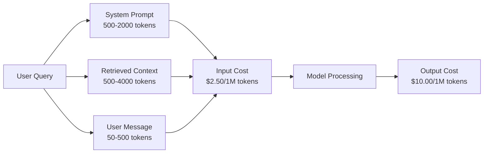
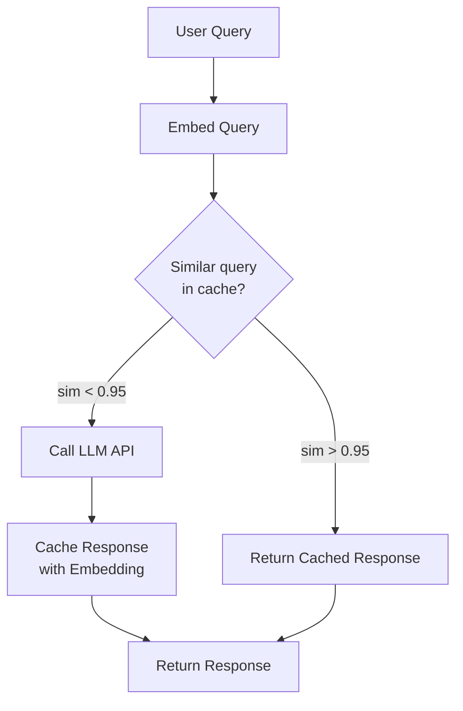
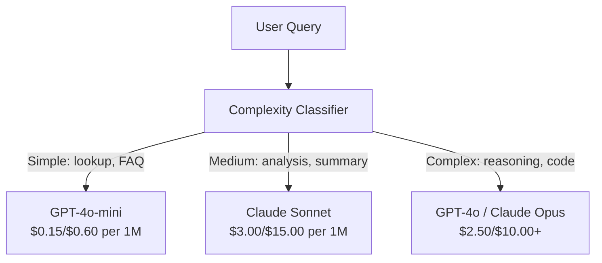

# Buforowanie, ograniczanie szybkości i optymalizacja kosztów

> Większość startupów AI nie umiera z powodu złych modeli. Umierają z powodu złej ekonomii jednostek. Pojedyncze połączenie GPT-4o kosztuje ułamki centa. Dziesięć tysięcy użytkowników wykonujących dziesięć połączeń dziennie kosztuje 250 dolarów w samych tokenach wejściowych – zanim pobierzesz jednego dolara. Firmy, które przetrwają, to te, które traktują każde wywołanie API jako transakcję finansową, a nie wywołanie funkcji.

**Typ:** Kompilacja
**Języki:** Python
**Wymagania wstępne:** Faza 11, lekcja 09 (wywoływanie funkcji)
**Czas:** ~45 minut
**Powiązane:** Faza 11 · 15 (Podręczne buforowanie) — ta lekcja dotyczy buforowania w warstwie aplikacji (pamięć podręczna semantyczna, dokładna pamięć podręczna skrótu, routing modelu). Lekcja 15 omawia buforowanie podpowiedzi w warstwie dostawcy (Anthropic cache_control, automatyczne OpenAI, Gemini CachedContent). Połącz oba, aby uzyskać redukcję kosztów o 50–95%.

## Cele nauczania

- Zaimplementuj buforowanie semantyczne, które obsługuje powtarzające się lub podobne zapytania z pamięci podręcznej zamiast wykonywania nowego wywołania API
- Oblicz koszty na żądanie u dostawców i wdrażaj ograniczanie stawek i alerty budżetowe uwzględniające tokeny
- Zbuduj warstwę optymalizacji kosztów z szybką kompresją, routingiem modelu (drogie lub tanie) i buforowaniem odpowiedzi
- Zaprojektuj wielopoziomową strategię buforowania, wykorzystując dokładne dopasowanie, podobieństwo semantyczne i buforowanie prefiksów dla różnych typów zapytań

## Problem

Budujesz chatbota RAG. Działa pięknie. Użytkownicy to uwielbiają.

Potem przychodzi faktura.

GPT-5 kosztuje $5 per million input tokens and $15 na milion wyników. Claude Opus 4.7 kosztuje $15 input / $75 wyjść. Gemini 3 Pro kosztuje $1.25 input / $5 ​​wyjść. GPT-5-mini to $0.25/$2. Poniższe ceny mają charakter poglądowy; zawsze sprawdzaj aktualną stronę cenową dostawcy.

Oto matematyka, która zabija startupy:

- 10 000 aktywnych użytkowników dziennie
- 10 zapytań na użytkownika dziennie
- 1000 tokenów wejściowych na zapytanie (podpowiedź systemowa + kontekst + wiadomość użytkownika)
- 500 żetonów wyjściowych na odpowiedź

**Dzienny koszt wejścia:** 10 000 x 10 x 1000 / 1 000 000 x $2.50 = **$250/dzień**
**Dzienny koszt wydruku:** 10 000 x 10 x 500 / 1 000 000 x $10.00 = **$500/dzień**
**Łącznie miesięcznie:** **22 500 USD/miesiąc**

To jest właśnie LLM. Dodaj osadzania, hosting wektorowych baz danych, infrastrukturę. Szukasz chatbota za 30 000 USD miesięcznie.

Brutalna część: 40–60% tych zapytań to prawie duplikaty. Użytkownicy zadają te same pytania, używając nieco innych słów. Podpowiedź systemowa – identyczna w przypadku każdego żądania – jest obciążana za każdym razem. Dokumenty kontekstowe pobrane przez RAG powtarzają się u użytkowników, którzy pytają o ten sam temat.

Płacisz pełną cenę za nadmiarowe obliczenia.

## Koncepcja

### Anatomia kosztów rozmowy LLM

Każde wywołanie API ma pięć składników kosztów.



Komunikaty systemowe to cichy zabójca. Monit systemowy zawierający 1500 tokenów wysyłany z każdym żądaniem kosztuje $3.75 per million requests just for that prefix. At 100K requests per day, that is $375 dziennie – 11 250 USD miesięcznie – w przypadku tekstu, który nigdy się nie zmienia.

### Buforowanie dostawcy: wbudowane rabaty

Wszyscy trzej główni dostawcy oferują w 2026 r. natychmiastowe buforowanie po stronie dostawcy, ale mechanika jest inna. Aby zapoznać się z głębokim nurkowaniem, zobacz Fazę 11 · 15.

| Dostawca | Mechanizm | Rabat | Minimalna | Czas trwania pamięci podręcznej |
|---------|-------|---------|---------|----------------|
| Antropiczny | Wyraźne znaczniki kontroli pamięci podręcznej | 90% na trafienia w pamięci podręcznej (zapłać 25% dodatkowo za zapis) | 1024 tokeny (Sonnet/Opus), 2048 (Haiku) | domyślnie 5 minut; 1h przedłużony (2x premia za zapis) |
| OpenAI | Automatyczne dopasowanie prefiksu | 50% na trafienia w pamięci podręcznej | 1024 tokeny | Najlepszy wysiłek do 1 godziny |
| Google Bliźnięta | Jawny interfejs API zawartości buforowanej | ~75% zniżki (plus miejsce do przechowywania) | 4096 (Flash) / 32768 (Pro) | Konfigurowalny przez użytkownika TTL |

**Podejście Anthropic** jest jednoznaczne. Zaznaczasz sekcje podpowiedzi za pomocą `cache_control: {"type": "ephemeral"}`. Za pierwsze żądanie pobierana jest opłata za zapis w wysokości 25%. Kolejne zamówienia z tym samym prefiksem otrzymują 90% zniżki. Monit systemowy zawierający 2000 tokenów, który kosztuje $0.005 normally costs $0,000625 w przypadku trafień w pamięci podręcznej. Ponad 100 tys. żądań, co pozwala zaoszczędzić 437,50 USD dziennie.

**Podejście OpenAI** jest automatyczne. Każdy prefiks podpowiedzi pasujący do poprzedniego żądania otrzymuje 50% zniżki. Nie potrzeba żadnych markerów. Kompromis: mniejszy rabat, mniejsza kontrola, ale zerowy wysiłek wdrożeniowy.

### Buforowanie semantyczne: Twoja warstwa niestandardowa

Buforowanie dostawcy działa tylko w przypadku identycznych prefiksów. Buforowanie semantyczne obsługuje trudniejszy przypadek: różne zapytania o tym samym znaczeniu.

„Jaka jest polityka zwrotów?” i „Jak zwrócić przedmiot?” to różne ciągi, ale identyczne intencje. Semantyczna pamięć podręczna osadza oba zapytania, oblicza podobieństwo cosinus i zwraca buforowaną odpowiedź, jeśli podobieństwo przekracza próg (zwykle 0,92–0,95).



Koszty osadzenia są znikome. Osadzanie tekstu-3-small w OpenAI kosztuje 0,02 dolara za milion tokenów. Sprawdzanie pamięci podręcznej kosztuje prawie nic w porównaniu z pełnym połączeniem LLM.

### Dokładne buforowanie: hash i dopasowanie

W przypadku wywołań deterministycznych (temperatura = 0, ten sam model, ten sam monit) dokładne buforowanie jest prostsze i szybsze. Zaszyfruj pełny monit, sprawdź pamięć podręczną i wróć, jeśli zostanie znaleziony.

Działa to doskonale w przypadku:
- Podpowiedź systemowa + stały kontekst + identyczne zapytania użytkowników
- Wywołanie funkcji z identycznymi definicjami narzędzi
- Przetwarzanie wsadowe, w przypadku którego ten sam dokument jest przetwarzany wielokrotnie

### Ograniczanie stawek: ochrona Twojego budżetu

Ograniczanie stawek to nie tylko kwestia uczciwości. Chodzi o przetrwanie.

**Algorytm wiadra tokenów:** każdy użytkownik otrzymuje wiadro N tokenów, które uzupełnia się z szybkością R na sekundę. Żądanie zużywa tokeny z zasobnika. Jeśli zasobnik jest pusty, żądanie zostanie odrzucone. Umożliwia to wykonywanie serii impulsów (wykorzystanie pełnego wiadra na raz) przy jednoczesnym egzekwowaniu średniej szybkości.

**Limity na użytkownika:** ustawiaj dzienne/miesięczne limity tokenów na poziom użytkownika.

| Poziom | Dzienny limit tokenów | Maksymalna liczba żądań/min | Dostęp do modelu |
|------|----------------------|--------------------------------|------------|
| Bezpłatne | 50 000 | 10 | Tylko GPT-4o-mini |
| Zawodowiec | 500 000 | 60 | GPT-4o, Claude Sonnet |
| Przedsiębiorstwo | 5 000 000 | 300 | Wszystkie modele |

### Trasowanie modeli: właściwy model do odpowiedniego zadania

Nie każde zapytanie wymaga GPT-4o.

„O której godzinie zamykają sklep?” nie wymaga wyjścia $10/M-output model. GPT-4o-mini at $0,60/M, radzi sobie z tym doskonale. Radzi sobie z tym Claude Haiku przy produkcji wynoszącej 1,25 USD/M. Prosty klasyfikator kieruje tanie zapytania do tanich modeli, a złożone zapytania do drogich modeli.



Dobrze dostrojony router pozwala zaoszczędzić 40–70% kosztów samego modelu.

### Śledzenie kosztów: wiesz, gdzie trafiają pieniądze

Nie możesz optymalizować tego, czego nie mierzysz. Rejestruj każde wywołanie API za pomocą:

- Znacznik czasu
- Nazwa modelu
- Tokeny wejściowe
- Tokeny wyjściowe
- Opóźnienie (ms)
- Obliczony koszt ($)
- Identyfikator użytkownika
- Trafienie/chybienie pamięci podręcznej
- Kategoria żądania

Dane te pokazują, które funkcje są drogie, którzy użytkownicy dużo korzystają i gdzie buforowanie ma największy wpływ.

### Grupowanie: rabaty zbiorcze

Interfejs API Batch OpenAI przetwarza żądania asynchronicznie z 50% rabatem. Przesyłasz partię do 50 000 żądań, a wyniki pojawiają się w ciągu 24 godzin.

Użyj dozowania dla:
- Nocne przetwarzanie dokumentów
- Klasyfikacja zbiorcza
- Trwa ocena
- Potoki wzbogacania danych

Nie dla: zapytań kierowanych do użytkownika w czasie rzeczywistym (liczą się opóźnienia).

### Alerty budżetowe i wyłączniki automatyczne

Wyłącznik automatyczny przestaje wydawać pieniądze po osiągnięciu limitu. Bez niego błąd lub nadużycie może przepalić Twój miesięczny budżet w ciągu kilku godzin.

Ustaw trzy progi:
1. **Ostrzeżenie** (70% budżetu): wyślij alert
2. **Przepustnica** (85% budżetu): przejdź tylko na tańsze modele
3. **Stop** (95% budżetu): odrzucaj nowe żądania, zwracaj tylko odpowiedzi z pamięci podręcznej

### Stos optymalizacji

Zastosuj te techniki w odpowiedniej kolejności. Każda warstwa łączy się z poprzednimi.

| Warstwa | Technika | Typowe oszczędności | Wysiłek wdrożeniowy |
|-------|------|----------------|----------------------|
| 1 | Buforowanie monitu dostawcy | 30-50% | Niski (dodaj znaczniki pamięci podręcznej) |
| 2 | Dokładne buforowanie | 10-20% | Niski (hash + dykt) |
| 3 | Buforowanie semantyczne | 15-30% | Średni (osadzenia + podobieństwo) |
| 4 | Model routingu | 40-70% | Średni (klasyfikator) |
| 5 | Ograniczanie szybkości | Ochrona budżetu | Niski (zasobnik tokenów) |
| 6 | Szybka kompresja | 10-30% | Średni (podpowiedzi o przepisanie) |
| 7 | Dozowanie | 50% kwalifikujących się | Niski (wsadowy interfejs API) |

Aplikacja RAG stosująca warstwy 1–5 zazwyczaj obniża koszty z $22,500/month to $4 000–6 000 miesięcznie. Na tym polega różnica między spaleniem pasa startowego a budowaniem biznesu.

### Prawdziwe oszczędności: przed i po

Oto prawdziwy podział chatbota RAG obsługującego 10 000 DAU.

| Metryczne | Przed optymalizacją | Po optymalizacji | Oszczędności |
|--------|----------|---------------------------------|---------|
| Miesięczny koszt LLM | $22,500 | $5200 | 77% |
| Średni koszt zapytania | $0.0075 | $0.0017 | 77% |
| Współczynnik trafień w pamięci podręcznej | 0% | 52% | -- |
| Zapytania kierowane do mini | 0% | 65% | -- |
| Opóźnienie P95 | 2800 ms | 900 ms (trafienia w pamięci podręcznej: 50 ms) | 68% |
| Miesięczny koszt osadzania | $0 | $180 | (nowy koszt) |
| Całkowity koszt miesięczny | $22,500 | $5 ​​380 | 76% |

Koszt osadzania pamięci podręcznej semantycznej (180 USD miesięcznie) zwraca się w ciągu pierwszej godziny od trafienia do pamięci podręcznej.

## Zbuduj to

### Krok 1: Kalkulator kosztów

Zbuduj kalkulator kosztów symbolicznych, który zna aktualne ceny głównych modeli.

```python
import hashlib
import time
import json
import math
from dataclasses import dataclass, field

MODEL_PRICING = {
    "gpt-4o": {"input": 2.50, "output": 10.00, "cached_input": 1.25},
    "gpt-4o-mini": {"input": 0.15, "output": 0.60, "cached_input": 0.075},
    "gpt-4.1": {"input": 2.00, "output": 8.00, "cached_input": 0.50},
    "gpt-4.1-mini": {"input": 0.40, "output": 1.60, "cached_input": 0.10},
    "gpt-4.1-nano": {"input": 0.10, "output": 0.40, "cached_input": 0.025},
    "o3": {"input": 2.00, "output": 8.00, "cached_input": 0.50},
    "o3-mini": {"input": 1.10, "output": 4.40, "cached_input": 0.55},
    "o4-mini": {"input": 1.10, "output": 4.40, "cached_input": 0.275},
    "claude-opus-4": {"input": 15.00, "output": 75.00, "cached_input": 1.50},
    "claude-sonnet-4": {"input": 3.00, "output": 15.00, "cached_input": 0.30},
    "claude-haiku-3.5": {"input": 0.80, "output": 4.00, "cached_input": 0.08},
    "gemini-2.5-pro": {"input": 1.25, "output": 10.00, "cached_input": 0.3125},
    "gemini-2.5-flash": {"input": 0.15, "output": 0.60, "cached_input": 0.0375},
}

def calculate_cost(model, input_tokens, output_tokens, cached_input_tokens=0):
    if model not in MODEL_PRICING:
        return {"error": f"Unknown model: {model}"}
    pricing = MODEL_PRICING[model]
    non_cached = input_tokens - cached_input_tokens
    input_cost = (non_cached / 1_000_000) * pricing["input"]
    cached_cost = (cached_input_tokens / 1_000_000) * pricing["cached_input"]
    output_cost = (output_tokens / 1_000_000) * pricing["output"]
    total = input_cost + cached_cost + output_cost
    return {
        "model": model,
        "input_tokens": input_tokens,
        "output_tokens": output_tokens,
        "cached_input_tokens": cached_input_tokens,
        "input_cost": round(input_cost, 6),
        "cached_input_cost": round(cached_cost, 6),
        "output_cost": round(output_cost, 6),
        "total_cost": round(total, 6),
    }
```

### Krok 2: Dokładna pamięć podręczna

Zaszyfruj pełny monit i zwróć odpowiedzi z pamięci podręcznej dla identycznych żądań.

```python
class ExactCache:
    def __init__(self, max_size=1000, ttl_seconds=3600):
        self.cache = {}
        self.max_size = max_size
        self.ttl = ttl_seconds
        self.hits = 0
        self.misses = 0

    def _hash(self, model, messages, temperature):
        key_data = json.dumps({"model": model, "messages": messages, "temperature": temperature}, sort_keys=True)
        return hashlib.sha256(key_data.encode()).hexdigest()

    def get(self, model, messages, temperature=0.0):
        if temperature > 0:
            self.misses += 1
            return None
        key = self._hash(model, messages, temperature)
        if key in self.cache:
            entry = self.cache[key]
            if time.time() - entry["timestamp"] < self.ttl:
                self.hits += 1
                entry["access_count"] += 1
                return entry["response"]
            del self.cache[key]
        self.misses += 1
        return None

    def put(self, model, messages, temperature, response):
        if temperature > 0:
            return
        if len(self.cache) >= self.max_size:
            oldest_key = min(self.cache, key=lambda k: self.cache[k]["timestamp"])
            del self.cache[oldest_key]
        key = self._hash(model, messages, temperature)
        self.cache[key] = {
            "response": response,
            "timestamp": time.time(),
            "access_count": 1,
        }

    def stats(self):
        total = self.hits + self.misses
        return {
            "hits": self.hits,
            "misses": self.misses,
            "hit_rate": round(self.hits / total, 4) if total > 0 else 0,
            "cache_size": len(self.cache),
        }
```

### Krok 3: Pamięć podręczna semantyczna

Osadzaj zapytania i zwracaj odpowiedzi z pamięci podręcznej, gdy podobieństwo przekracza próg.

```python
def simple_embed(text):
    words = text.lower().split()
    vocab = {}
    for w in words:
        vocab[w] = vocab.get(w, 0) + 1
    norm = math.sqrt(sum(v * v for v in vocab.values()))
    if norm == 0:
        return {}
    return {k: v / norm for k, v in vocab.items()}

def cosine_similarity(a, b):
    if not a or not b:
        return 0.0
    all_keys = set(a) | set(b)
    dot = sum(a.get(k, 0) * b.get(k, 0) for k in all_keys)
    return dot

class SemanticCache:
    def __init__(self, similarity_threshold=0.85, max_size=500, ttl_seconds=3600):
        self.entries = []
        self.threshold = similarity_threshold
        self.max_size = max_size
        self.ttl = ttl_seconds
        self.hits = 0
        self.misses = 0

    def get(self, query):
        query_embedding = simple_embed(query)
        now = time.time()
        best_match = None
        best_sim = 0.0
        for entry in self.entries:
            if now - entry["timestamp"] > self.ttl:
                continue
            sim = cosine_similarity(query_embedding, entry["embedding"])
            if sim > best_sim:
                best_sim = sim
                best_match = entry
        if best_match and best_sim >= self.threshold:
            self.hits += 1
            best_match["access_count"] += 1
            return {"response": best_match["response"], "similarity": round(best_sim, 4), "original_query": best_match["query"]}
        self.misses += 1
        return None

    def put(self, query, response):
        if len(self.entries) >= self.max_size:
            self.entries.sort(key=lambda e: e["timestamp"])
            self.entries.pop(0)
        self.entries.append({
            "query": query,
            "embedding": simple_embed(query),
            "response": response,
            "timestamp": time.time(),
            "access_count": 1,
        })

    def stats(self):
        total = self.hits + self.misses
        return {
            "hits": self.hits,
            "misses": self.misses,
            "hit_rate": round(self.hits / total, 4) if total > 0 else 0,
            "cache_size": len(self.entries),
        }
```

### Krok 4: Ograniczenie szybkości

Ogranicznik szybkości wiadra tokenów z przydziałami na użytkownika.

```python
class TokenBucketRateLimiter:
    def __init__(self):
        self.buckets = {}
        self.tiers = {
            "free": {"capacity": 50_000, "refill_rate": 500, "max_requests_per_min": 10},
            "pro": {"capacity": 500_000, "refill_rate": 5_000, "max_requests_per_min": 60},
            "enterprise": {"capacity": 5_000_000, "refill_rate": 50_000, "max_requests_per_min": 300},
        }

    def _get_bucket(self, user_id, tier="free"):
        if user_id not in self.buckets:
            tier_config = self.tiers.get(tier, self.tiers["free"])
            self.buckets[user_id] = {
                "tokens": tier_config["capacity"],
                "capacity": tier_config["capacity"],
                "refill_rate": tier_config["refill_rate"],
                "last_refill": time.time(),
                "request_timestamps": [],
                "max_rpm": tier_config["max_requests_per_min"],
                "tier": tier,
                "total_tokens_used": 0,
            }
        return self.buckets[user_id]

    def _refill(self, bucket):
        now = time.time()
        elapsed = now - bucket["last_refill"]
        refill = int(elapsed * bucket["refill_rate"])
        if refill > 0:
            bucket["tokens"] = min(bucket["capacity"], bucket["tokens"] + refill)
            bucket["last_refill"] = now

    def check(self, user_id, tokens_needed, tier="free"):
        bucket = self._get_bucket(user_id, tier)
        self._refill(bucket)
        now = time.time()
        bucket["request_timestamps"] = [t for t in bucket["request_timestamps"] if now - t < 60]
        if len(bucket["request_timestamps"]) >= bucket["max_rpm"]:
            return {"allowed": False, "reason": "rate_limit", "retry_after_seconds": 60 - (now - bucket["request_timestamps"][0])}
        if bucket["tokens"] < tokens_needed:
            deficit = tokens_needed - bucket["tokens"]
            wait = deficit / bucket["refill_rate"]
            return {"allowed": False, "reason": "token_limit", "tokens_available": bucket["tokens"], "retry_after_seconds": round(wait, 1)}
        return {"allowed": True, "tokens_available": bucket["tokens"]}

    def consume(self, user_id, tokens_used, tier="free"):
        bucket = self._get_bucket(user_id, tier)
        bucket["tokens"] -= tokens_used
        bucket["request_timestamps"].append(time.time())
        bucket["total_tokens_used"] += tokens_used

    def get_usage(self, user_id):
        if user_id not in self.buckets:
            return {"error": "User not found"}
        b = self.buckets[user_id]
        return {
            "user_id": user_id,
            "tier": b["tier"],
            "tokens_remaining": b["tokens"],
            "capacity": b["capacity"],
            "total_tokens_used": b["total_tokens_used"],
            "utilization": round(b["total_tokens_used"] / b["capacity"], 4) if b["capacity"] else 0,
        }
```

### Krok 5: Śledzenie kosztów

Rejestruj każde połączenie i obliczaj bieżące sumy.

```python
class CostTracker:
    def __init__(self, monthly_budget=1000.0):
        self.logs = []
        self.monthly_budget = monthly_budget
        self.alerts = []

    def log_call(self, model, input_tokens, output_tokens, cached_input_tokens=0, latency_ms=0, user_id="anonymous", cache_status="miss"):
        cost = calculate_cost(model, input_tokens, output_tokens, cached_input_tokens)
        entry = {
            "timestamp": time.time(),
            "model": model,
            "input_tokens": input_tokens,
            "output_tokens": output_tokens,
            "cached_input_tokens": cached_input_tokens,
            "latency_ms": latency_ms,
            "cost": cost["total_cost"],
            "user_id": user_id,
            "cache_status": cache_status,
        }
        self.logs.append(entry)
        self._check_budget()
        return entry

    def _check_budget(self):
        total = self.total_cost()
        pct = total / self.monthly_budget if self.monthly_budget > 0 else 0
        if pct >= 0.95 and not any(a["level"] == "stop" for a in self.alerts):
            self.alerts.append({"level": "stop", "message": f"Budget 95% consumed: ${total:.2f}/${self.monthly_budget:.2f}", "timestamp": time.time()})
        elif pct >= 0.85 and not any(a["level"] == "throttle" for a in self.alerts):
            self.alerts.append({"level": "throttle", "message": f"Budget 85% consumed: ${total:.2f}/${self.monthly_budget:.2f}", "timestamp": time.time()})
        elif pct >= 0.70 and not any(a["level"] == "warning" for a in self.alerts):
            self.alerts.append({"level": "warning", "message": f"Budget 70% consumed: ${total:.2f}/${self.monthly_budget:.2f}", "timestamp": time.time()})

    def total_cost(self):
        return round(sum(e["cost"] for e in self.logs), 6)

    def cost_by_model(self):
        by_model = {}
        for e in self.logs:
            m = e["model"]
            if m not in by_model:
                by_model[m] = {"calls": 0, "cost": 0, "input_tokens": 0, "output_tokens": 0}
            by_model[m]["calls"] += 1
            by_model[m]["cost"] = round(by_model[m]["cost"] + e["cost"], 6)
            by_model[m]["input_tokens"] += e["input_tokens"]
            by_model[m]["output_tokens"] += e["output_tokens"]
        return by_model

    def cache_savings(self):
        cache_hits = [e for e in self.logs if e["cache_status"] == "hit"]
        if not cache_hits:
            return {"saved": 0, "cache_hits": 0}
        saved = 0
        for e in cache_hits:
            full_cost = calculate_cost(e["model"], e["input_tokens"], e["output_tokens"])
            saved += full_cost["total_cost"]
        return {"saved": round(saved, 4), "cache_hits": len(cache_hits)}

    def summary(self):
        if not self.logs:
            return {"total_calls": 0, "total_cost": 0}
        total_latency = sum(e["latency_ms"] for e in self.logs)
        cache_hits = sum(1 for e in self.logs if e["cache_status"] == "hit")
        return {
            "total_calls": len(self.logs),
            "total_cost": self.total_cost(),
            "avg_cost_per_call": round(self.total_cost() / len(self.logs), 6),
            "avg_latency_ms": round(total_latency / len(self.logs), 1),
            "cache_hit_rate": round(cache_hits / len(self.logs), 4),
            "cost_by_model": self.cost_by_model(),
            "cache_savings": self.cache_savings(),
            "budget_remaining": round(self.monthly_budget - self.total_cost(), 2),
            "budget_utilization": round(self.total_cost() / self.monthly_budget, 4) if self.monthly_budget > 0 else 0,
            "alerts": self.alerts,
        }
```

### Krok 6: Model routera

Kieruj zapytania do najtańszego modelu, który może je obsłużyć.

```python
SIMPLE_KEYWORDS = ["what time", "hours", "address", "phone", "price", "return policy", "hello", "hi", "thanks", "yes", "no"]
COMPLEX_KEYWORDS = ["analyze", "compare", "explain why", "write code", "debug", "architect", "design", "trade-off", "evaluate"]

def classify_complexity(query):
    q = query.lower()
    if len(q.split()) <= 5 or any(kw in q for kw in SIMPLE_KEYWORDS):
        return "simple"
    if any(kw in q for kw in COMPLEX_KEYWORDS):
        return "complex"
    return "medium"

def route_model(query, tier="pro"):
    complexity = classify_complexity(query)
    routing_table = {
        "simple": {"free": "gpt-4.1-nano", "pro": "gpt-4o-mini", "enterprise": "gpt-4o-mini"},
        "medium": {"free": "gpt-4o-mini", "pro": "claude-sonnet-4", "enterprise": "claude-sonnet-4"},
        "complex": {"free": "gpt-4o-mini", "pro": "gpt-4o", "enterprise": "claude-opus-4"},
    }
    model = routing_table[complexity].get(tier, "gpt-4o-mini")
    return {"query": query, "complexity": complexity, "model": model, "tier": tier}
```

### Krok 7: Uruchom wersję demonstracyjną

```python
def simulate_llm_call(model, query):
    input_tokens = len(query.split()) * 4 + 500
    output_tokens = 150 + (len(query.split()) * 2)
    latency = 200 + (output_tokens * 2)
    return {
        "model": model,
        "response": f"[Simulated {model} response to: {query[:50]}...]",
        "input_tokens": input_tokens,
        "output_tokens": output_tokens,
        "latency_ms": latency,
    }

def run_demo():
    print("=" * 60)
    print("  Caching, Rate Limiting & Cost Optimization Demo")
    print("=" * 60)

    print("\n--- Model Pricing ---")
    for model, pricing in list(MODEL_PRICING.items())[:6]:
        cost_1k = calculate_cost(model, 1000, 500)
        print(f"  {model}: ${cost_1k['total_cost']:.6f} per 1K in + 500 out")

    print("\n--- Cost Comparison: 100K Requests ---")
    for model in ["gpt-4o", "gpt-4o-mini", "claude-sonnet-4", "claude-haiku-3.5"]:
        cost = calculate_cost(model, 1000 * 100_000, 500 * 100_000)
        print(f"  {model}: ${cost['total_cost']:.2f}")

    print("\n--- Anthropic Cache Savings ---")
    no_cache = calculate_cost("claude-sonnet-4", 2000, 500, 0)
    with_cache = calculate_cost("claude-sonnet-4", 2000, 500, 1500)
    saving = no_cache["total_cost"] - with_cache["total_cost"]
    print(f"  Without cache: ${no_cache['total_cost']:.6f}")
    print(f"  With 1500 cached tokens: ${with_cache['total_cost']:.6f}")
    print(f"  Savings per call: ${saving:.6f} ({saving/no_cache['total_cost']*100:.1f}%)")

    exact_cache = ExactCache(max_size=100, ttl_seconds=300)
    semantic_cache = SemanticCache(similarity_threshold=0.75, max_size=100)
    rate_limiter = TokenBucketRateLimiter()
    tracker = CostTracker(monthly_budget=100.0)

    print("\n--- Exact Cache ---")
    messages_1 = [{"role": "user", "content": "What is the return policy?"}]
    result = exact_cache.get("gpt-4o-mini", messages_1, 0.0)
    print(f"  First lookup: {'HIT' if result else 'MISS'}")
    exact_cache.put("gpt-4o-mini", messages_1, 0.0, "You can return items within 30 days.")
    result = exact_cache.get("gpt-4o-mini", messages_1, 0.0)
    print(f"  Second lookup: {'HIT' if result else 'MISS'} -> {result}")
    result = exact_cache.get("gpt-4o-mini", messages_1, 0.7)
    print(f"  With temp=0.7: {'HIT' if result else 'MISS (non-deterministic, skip cache)'}")
    print(f"  Stats: {exact_cache.stats()}")

    print("\n--- Semantic Cache ---")
    test_queries = [
        ("What is the return policy?", "Items can be returned within 30 days with receipt."),
        ("How do I return an item?", None),
        ("What are your store hours?", "We are open 9am-9pm Monday through Saturday."),
        ("When does the store open?", None),
        ("Tell me about quantum computing", "Quantum computers use qubits..."),
        ("Explain quantum mechanics", None),
    ]
    for query, response in test_queries:
        cached = semantic_cache.get(query)
        if cached:
            print(f"  '{query[:40]}' -> CACHE HIT (sim={cached['similarity']}, original='{cached['original_query'][:40]}')")
        elif response:
            semantic_cache.put(query, response)
            print(f"  '{query[:40]}' -> MISS (stored)")
        else:
            print(f"  '{query[:40]}' -> MISS (no match)")
    print(f"  Stats: {semantic_cache.stats()}")

    print("\n--- Rate Limiting ---")
    for i in range(12):
        check = rate_limiter.check("user_1", 1000, "free")
        if check["allowed"]:
            rate_limiter.consume("user_1", 1000, "free")
        status = "OK" if check["allowed"] else f"BLOCKED ({check['reason']})"
        if i < 5 or not check["allowed"]:
            print(f"  Request {i+1}: {status}")
    print(f"  Usage: {rate_limiter.get_usage('user_1')}")

    print("\n--- Model Routing ---")
    routing_queries = [
        "What time do you close?",
        "Summarize this quarterly earnings report",
        "Analyze the trade-offs between microservices and monoliths",
        "Hello",
        "Write code for a binary search tree with deletion",
    ]
    for q in routing_queries:
        route = route_model(q, "pro")
        print(f"  '{q[:50]}' -> {route['model']} ({route['complexity']})")

    print("\n--- Full Pipeline: Before vs After Optimization ---")
    queries = [
        "What is the return policy?",
        "How do I return something?",
        "What are your hours?",
        "When do you open?",
        "Explain the difference between TCP and UDP",
        "Compare TCP vs UDP protocols",
        "Hello",
        "What is your phone number?",
        "Write a Python function to sort a list",
        "Analyze the pros and cons of serverless architecture",
    ]

    print("\n  [Before: no caching, single model (gpt-4o)]")
    tracker_before = CostTracker(monthly_budget=1000.0)
    for q in queries:
        result = simulate_llm_call("gpt-4o", q)
        tracker_before.log_call("gpt-4o", result["input_tokens"], result["output_tokens"], latency_ms=result["latency_ms"], cache_status="miss")
    before = tracker_before.summary()
    print(f"  Total cost: ${before['total_cost']:.6f}")
    print(f"  Avg cost/call: ${before['avg_cost_per_call']:.6f}")
    print(f"  Avg latency: {before['avg_latency_ms']}ms")

    print("\n  [After: caching + routing + rate limiting]")
    exact_c = ExactCache()
    semantic_c = SemanticCache(similarity_threshold=0.75)
    tracker_after = CostTracker(monthly_budget=1000.0)

    for q in queries:
        messages = [{"role": "user", "content": q}]
        cached = exact_c.get("gpt-4o", messages, 0.0)
        if cached:
            tracker_after.log_call("gpt-4o-mini", 0, 0, latency_ms=5, cache_status="hit")
            continue
        sem_cached = semantic_c.get(q)
        if sem_cached:
            tracker_after.log_call("gpt-4o-mini", 0, 0, latency_ms=15, cache_status="hit")
            continue
        route = route_model(q)
        result = simulate_llm_call(route["model"], q)
        tracker_after.log_call(route["model"], result["input_tokens"], result["output_tokens"], latency_ms=result["latency_ms"], cache_status="miss")
        exact_c.put(route["model"], messages, 0.0, result["response"])
        semantic_c.put(q, result["response"])

    after = tracker_after.summary()
    print(f"  Total cost: ${after['total_cost']:.6f}")
    print(f"  Avg cost/call: ${after['avg_cost_per_call']:.6f}")
    print(f"  Avg latency: {after['avg_latency_ms']}ms")
    print(f"  Cache hit rate: {after['cache_hit_rate']:.0%}")

    if before["total_cost"] > 0:
        savings_pct = (1 - after["total_cost"] / before["total_cost"]) * 100
        print(f"\n  SAVINGS: {savings_pct:.1f}% cost reduction")
        print(f"  Latency improvement: {(1 - after['avg_latency_ms'] / before['avg_latency_ms']) * 100:.1f}% faster")

    print("\n--- Budget Alerts Demo ---")
    alert_tracker = CostTracker(monthly_budget=0.01)
    for i in range(5):
        alert_tracker.log_call("gpt-4o", 5000, 2000, latency_ms=500)
    print(f"  Total spent: ${alert_tracker.total_cost():.6f} / ${alert_tracker.monthly_budget}")
    for alert in alert_tracker.alerts:
        print(f"  ALERT [{alert['level'].upper()}]: {alert['message']}")

    print("\n--- Cost Breakdown by Model ---")
    multi_tracker = CostTracker(monthly_budget=500.0)
    for _ in range(50):
        multi_tracker.log_call("gpt-4o-mini", 800, 200, latency_ms=150)
    for _ in range(30):
        multi_tracker.log_call("claude-sonnet-4", 1500, 500, latency_ms=400)
    for _ in range(10):
        multi_tracker.log_call("gpt-4o", 2000, 800, latency_ms=600)
    for _ in range(10):
        multi_tracker.log_call("claude-opus-4", 3000, 1000, latency_ms=1200)
    breakdown = multi_tracker.cost_by_model()
    for model, data in sorted(breakdown.items(), key=lambda x: x[1]["cost"], reverse=True):
        print(f"  {model}: {data['calls']} calls, ${data['cost']:.6f}, {data['input_tokens']:,} in / {data['output_tokens']:,} out")
    print(f"  Total: ${multi_tracker.total_cost():.6f}")

    print("\n" + "=" * 60)
    print("  Demo complete.")
    print("=" * 60)

if __name__ == "__main__":
    run_demo()
```

## Użyj tego

### Antropiczne buforowanie podpowiedzi

```python
# import anthropic
#
# client = anthropic.Anthropic()
#
# response = client.messages.create(
#     model="claude-sonnet-4-20250514",
#     max_tokens=1024,
#     system=[
#         {
#             "type": "text",
#             "text": "You are a helpful customer support agent for Acme Corp...",
#             "cache_control": {"type": "ephemeral"},
#         }
#     ],
#     messages=[{"role": "user", "content": "What is the return policy?"}],
# )
#
# print(f"Input tokens: {response.usage.input_tokens}")
# print(f"Cache creation tokens: {response.usage.cache_creation_input_tokens}")
# print(f"Cache read tokens: {response.usage.cache_read_input_tokens}")
```

Pierwsze połączenie zapisuje do pamięci podręcznej (premia 25%). Każde kolejne wywołanie z tym samym prefiksem podpowiedzi systemowej odczytuje dane z pamięci podręcznej (rabat 90%). Pamięć podręczna trwa 5 minut i resetuje licznik czasu przy każdym trafieniu.

### Automatyczne buforowanie OpenAI

```python
# from openai import OpenAI
#
# client = OpenAI()
#
# response = client.chat.completions.create(
#     model="gpt-4o",
#     messages=[
#         {"role": "system", "content": "You are a helpful customer support agent..."},
#         {"role": "user", "content": "What is the return policy?"},
#     ],
# )
#
# print(f"Prompt tokens: {response.usage.prompt_tokens}")
# print(f"Cached tokens: {response.usage.prompt_tokens_details.cached_tokens}")
# print(f"Completion tokens: {response.usage.completion_tokens}")
```

OpenAI buforuje automatycznie. Każdy prefiks zachęty składający się z ponad 1024 tokenów, który pasuje do ostatniego żądania, otrzymuje 50% zniżki. Nie są potrzebne żadne zmiany w kodzie — wystarczy sprawdzić `prompt_tokens_details.cached_tokens` w odpowiedzi, aby sprawdzić, czy działa.

### Wsadowy interfejs API OpenAI

```python
# import json
# from openai import OpenAI
#
# client = OpenAI()
#
# requests = []
# for i, query in enumerate(queries):
#     requests.append({
#         "custom_id": f"request-{i}",
#         "method": "POST",
#         "url": "/v1/chat/completions",
#         "body": {
#             "model": "gpt-4o-mini",
#             "messages": [{"role": "user", "content": query}],
#         },
#     })
#
# with open("batch_input.jsonl", "w") as f:
#     for r in requests:
#         f.write(json.dumps(r) + "\n")
#
# batch_file = client.files.create(file=open("batch_input.jsonl", "rb"), purpose="batch")
# batch = client.batches.create(input_file_id=batch_file.id, endpoint="/v1/chat/completions", completion_window="24h")
# print(f"Batch ID: {batch.id}, Status: {batch.status}")
```

Batch API daje stałą zniżkę 50% na wszystkie tokeny. Wyniki pojawiają się w ciągu 24 godzin. Idealny do obciążeń innych niż w czasie rzeczywistym: oceny, etykietowanie danych, podsumowania zbiorcze.

### Produkcyjna pamięć podręczna semantyczna z Redis

```python
# import redis
# import numpy as np
# from openai import OpenAI
#
# r = redis.Redis()
# client = OpenAI()
#
# def get_embedding(text):
#     response = client.embeddings.create(model="text-embedding-3-small", input=text)
#     return response.data[0].embedding
#
# def semantic_cache_lookup(query, threshold=0.95):
#     query_emb = np.array(get_embedding(query))
#     keys = r.keys("cache:emb:*")
#     best_sim, best_key = 0, None
#     for key in keys:
#         stored_emb = np.frombuffer(r.get(key), dtype=np.float32)
#         sim = np.dot(query_emb, stored_emb) / (np.linalg.norm(query_emb) * np.linalg.norm(stored_emb))
#         if sim > best_sim:
#             best_sim, best_key = sim, key
#     if best_sim >= threshold and best_key:
#         response_key = best_key.decode().replace("cache:emb:", "cache:resp:")
#         return r.get(response_key).decode()
#     return None
```

W środowisku produkcyjnym zastąp skan liniowy indeksem wektorowym (Redis Vector Search, Pinecone lub pgvector). Skanowanie liniowe działa dla <1000 wpisów. Poza tym użyj ANN (przybliżony najbliższy sąsiad) do wyszukiwania O (log n).

## Wyślij to

W ramach tej lekcji powstaje `outputs/prompt-cost-optimizer.md` — monit wielokrotnego użytku, który analizuje aplikację LLM i zaleca określone optymalizacje kosztów wraz z przewidywanymi oszczędnościami.

Tworzy także `outputs/skill-cost-patterns.md` — ramy decyzyjne umożliwiające wybór właściwej strategii buforowania, konfiguracji ograniczającej szybkość i reguł routingu modelu dla danego przypadku użycia.

## Ćwiczenia

1. **Zaimplementuj eksmisję LRU dla semantycznej pamięci podręcznej.** Zamień najstarsze eksmisje na ostatnio używane. Śledź czas ostatniego dostępu dla każdego wpisu i usuwaj wpis z najstarszym czasem dostępu, gdy pamięć podręczna jest pełna. Porównaj współczynniki trafień pomiędzy obiema strategiami w ciągu 100 zapytań.

2. **Stwórz narzędzie do prognozowania kosztów.** Biorąc pod uwagę dziennik wywołań API (dzienniki CostTracker), zaplanuj miesięczny koszt w oparciu o końcową średnią z 7 dni. Uwzględnij wzorce dni powszednich/weekendów. Uruchom alert, jeśli przewidywany miesięczny koszt przekroczy budżet o więcej niż 20%.

3. **Zaimplementuj wielopoziomowe buforowanie semantyczne.** Użyj dwóch progów podobieństwa: 0,98 dla trafień o wysokim stopniu pewności (wróć natychmiast) i 0,90 dla trafień o średniej pewności (powrót z zastrzeżeniem: „Na podstawie podobnego poprzedniego pytania…”). Śledź, z którego poziomu pochodzi każde trafienie i mierz różnice w zadowoleniu użytkowników.

4. **Utwórz klasyfikator routingu modelu.** Zastąp klasyfikator oparty na słowach kluczowych klasyfikatorem opartym na osadzaniu. Osadź 50 zapytań oznaczonych etykietami (proste/średnie/złożone), a następnie klasyfikuj nowe zapytania, znajdując najbliższy przykład z etykietą. Zmierz dokładność klasyfikacji na podstawie zestawu testowego składającego się z 20 zapytań.

5. **Zastosuj wyłącznik automatyczny o poziomach degradacji.** Przy budżecie 70% zarejestruj ostrzeżenie. Przy 85% automatycznie przełączaj wszystkie routingi na najtańszy model (gpt-4o-mini). Przy 95% wyświetlaj tylko odpowiedzi z pamięci podręcznej i odrzucaj nowe zapytania. Przetestuj, symulując 1000 żądań przy budżecie 1,00 USD i sprawdź, czy każdy próg uruchamia się prawidłowo.

## Kluczowe terminy

| Termin | Co ludzie mówią | Co to właściwie oznacza |
|------|----------------|----------------------|
| Natychmiastowe buforowanie | „Przechowuj monit systemowy w pamięci podręcznej” | Buforowanie na poziomie dostawcy, gdzie powtarzające się prefiksy podpowiedzi są objęte zniżką (90% Anthropic, 50% OpenAI) — brak zmian w kodzie dla OpenAI, wyraźne znaczniki dla Anthropic |
| Buforowanie semantyczne | „Inteligentne buforowanie” | Osadzanie zapytania, obliczanie podobieństwa do poprzednich zapytań i zwracanie odpowiedzi z pamięci podręcznej, jeśli podobieństwo przekracza próg — wyłapuje parafrazy, w których brakuje dokładnego dopasowania |
| Dokładne buforowanie | „Buforowanie skrótów” | Mieszanie pełnego podpowiedzi (model + komunikaty + temperatura) i zwracanie odpowiedzi z pamięci podręcznej dla identycznych danych wejściowych - działa tylko w przypadku wywołań deterministycznych temperatura=0 |
| Wiadro żetonów | „Ogranicznik szybkości” | Algorytm, w którym każdy użytkownik ma wiadro N żetonów, które uzupełnia się z szybkością R na sekundę — umożliwia zwiększenie liczby impulsów do N przy jednoczesnym wymuszaniu średniej szybkości R |
| Model routingu | „Tanie trasowanie” | Użycie klasyfikatora do wysyłania prostych zapytań do tanich modeli (GPT-4o-mini, Haiku) i złożonych zapytań do drogich modeli (GPT-4o, Opus) - oszczędność 40-70% na kosztach modeli |
| Śledzenie kosztów | „Pomiar” | Rejestrowanie każdego wywołania API z podaniem modelu, tokenów, opóźnienia, kosztu i identyfikatora użytkownika, dzięki czemu wiesz dokładnie, gdzie trafiają pieniądze i które funkcje są drogie |
| Wyłącznik | „Wyłącznik awaryjny” | Automatyczne pogarszanie jakości usług (tańsze modele, tylko w pamięci podręcznej) lub całkowite wstrzymywanie żądań, gdy wydatki zbliżają się do limitu budżetu |
| Wsadowe API | „Rabat hurtowy” | Asynchroniczne przetwarzanie OpenAI z 50% rabatem — prześlij do 50 000 żądań, uzyskaj wyniki w ciągu 24 godzin |
| Szybka kompresja | „Dieta symboliczna” | Przepisanie podpowiedzi systemowych i kontekstu w celu użycia mniejszej liczby tokenów przy jednoczesnym zachowaniu znaczenia — krótsze podpowiedzi kosztują mniej i często działają lepiej |
| Współczynnik trafień w pamięci podręcznej | „Efektywność pamięci podręcznej” | Odsetek żądań obsługiwanych z pamięci podręcznej zamiast wywoływania LLM - 40-60% jest typowe dla chatbotów produkcyjnych, oszczędza proporcjonalnie na kosztach |

## Dalsze czytanie

– [Przewodnik po buforowaniu Anthropic Prompt](https://docs.anthropic.com/en/docs/build-with-claude/prompt-caching) – oficjalna dokumentacja dotycząca jawnych znaczników kontroli pamięci podręcznej firmy Anthropic, cen i zachowania pamięci podręcznej przez cały okres jej użytkowania
– [Buforowanie podpowiedzi OpenAI](https://platform.openai.com/docs/guides/prompt-caching) – Automatyczne buforowanie OpenAI, jak weryfikować trafienia w pamięci podręcznej za pomocą pól użycia i minimalne długości prefiksów
– [OpenAI Batch API](https://platform.openai.com/docs/guides/batch) – 50% zniżki na przetwarzanie asynchroniczne, format JSONL, 24-godzinne okno realizacji i limit żądań 50 tys.
– [GPTCache](https://github.com/zilliztech/GPTCache) – biblioteka semantycznego buforowania o otwartym kodzie źródłowym, obsługująca wiele backendów do osadzania, magazyny wektorów i zasady eksmisji
- [Martian Model Router](https://docs.withmartian.com) - routing modelu produkcyjnego, który automatycznie wybiera najtańszy model zdolny obsłużyć każde zapytanie
– [Not Diamond](https://www.notdiamond.ai) – Model routera oparty na technologii ML, który uczy się na podstawie wzorców ruchu w celu optymalizacji stosunku kosztów do jakości u dostawców
– [Helicone](https://www.helicone.ai) – platforma obserwowalności LLM ze śledzeniem kosztów, buforowaniem, ograniczaniem stawek i alertami budżetowymi jako warstwa proxy
– [Dean i Barroso, „The Tail at Scale” (CACM 2013)](https://research.google/pubs/the-tail-at-scale/) – opóźnienia, przepustowość, percentyle TTFT/TPOT i żądania zabezpieczone; model kosztowy oparty na zasadzie „wybierz najtańszy model, który nadal spełnia wymagania P95”.
– [Kwon i in., „Efficient Memory Management for Large Language Model Serving with PagedAttention” (SOSP 2023)](https://arxiv.org/abs/2309.06180) – artykuł vLLM; dlaczego stronicowana pamięć podręczna KV + ciągłe przetwarzanie wsadowe pokonują naiwne serwery 24× pod względem przepustowości, warstwa infrastruktury w sekcji „buforowanie i koszty”.
- [Dao i in., „FlashAttention-2: Faster Attention with Better Parallelism and Work Partitioning” (ICLR 2024)](https://arxiv.org/abs/2307.08691) — ortogonalna redukcja kosztów na poziomie jądra w celu przyspieszenia buforowania; aby uzyskać pełny obraz krzywej kosztów, przeczytaj obok dekodowania spekulatywnego i GQA.