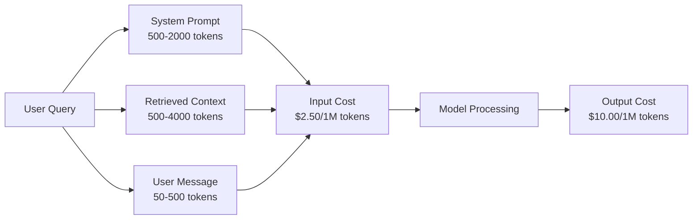
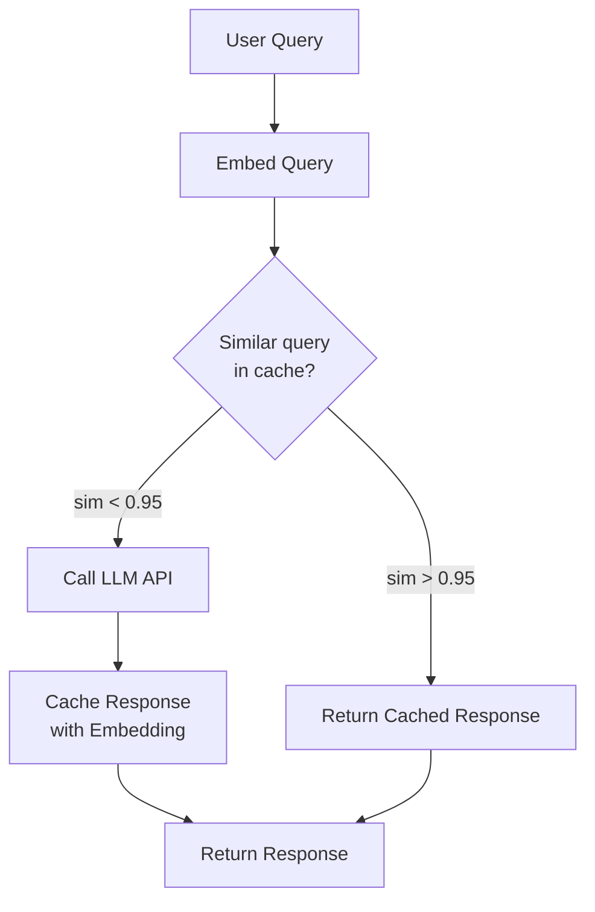
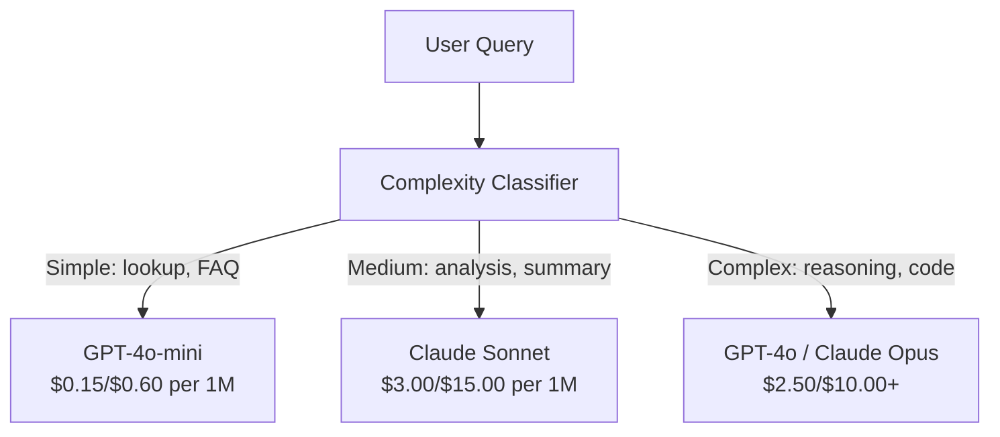

# Buforowanie, ograniczanie liczby wywołań i optymalizacja kosztów

> Większość startupów AI nie upada z powodu złych modeli. Upadają z powodu wadliwej ekonomii jednostkowej (unit economics). Pojedyncze zapytanie do GPT-4o kosztuje ułamek centa. Jednak dziesięć tysięcy użytkowników wykonujących dziesięć zapytań dziennie generuje koszt 250 USD dziennie w samych tylko tokenach wejściowych – zanim zarobisz chociażby dolara. Firmy, które przetrwają, to te, które traktują każde wywołanie API jako transakcję finansową, a nie zwykłe wywołanie funkcji.

**Typ:** Kompilacja  
**Języki:** Python  
**Wymagania wstępne:** Faza 11, lekcja 09 (wywoływanie funkcji)  
**Czas:** ~45 minut  
**Powiązane:** Faza 11 · 15 (Buforowanie promptów) — ta lekcja dotyczy buforowania w warstwie aplikacji (pamięć podręczna semantyczna, dokładne dopasowywanie haszy, routing modeli). Lekcja 15 omawia buforowanie promptów bezpośrednio w warstwie dostawcy (np. `cache_control` w Anthropic, automatyczne buforowanie w OpenAI, CachedContent w Gemini). Połącz oba podejścia, aby uzyskać redukcję kosztów rzędu 50–95%.

## Cele nauczania

- Zaimplementuj buforowanie semantyczne (semantic caching), które obsługuje powtarzające się lub podobne zapytania bezpośrednio z pamięci podręcznej zamiast wykonywania nowego wywołania API.
- Obliczaj koszty żądań u różnych dostawców w czasie rzeczywistym i wdrażaj ograniczanie liczby wywołań (rate limiting) oraz alerty budżetowe uwzględniające zużycie tokenów.
- Zbuduj warstwę optymalizacji kosztów obejmującą kompresję promptów, inteligentny routing modeli (przekierowywanie do tańszych lub droższych modeli) oraz buforowanie odpowiedzi.
- Zaprojektuj wielopoziomową strategię buforowania, wykorzystując dokładne dopasowanie (exact match), podobieństwo semantyczne oraz buforowanie prefiksów dla różnych typów zapytań.

## Problem

Budujesz chatbota RAG. Działa świetnie, a użytkownicy go uwielbiają.

Nagle przychodzi faktura.

GPT-4o kosztuje $2.50 za milion tokenów wejściowych (input) i $10.00 za milion tokenów wyjściowych (output). Claude 3.5 Sonnet kosztuje odpowiednio $3.00 (input) / $15.00 (output). Gemini 1.5 Pro to koszt $1.25 (input) / $5.00 (output), a GPT-4o-mini kosztuje zaledwie $0.15 / $0.60. Poniższe stawki mają charakter poglądowy; zawsze sprawdzaj aktualny cennik na stronach dostawców.

Oto kalkulacja, która potrafi zrujnować budżet młodego projektu:
- 10 000 aktywnych użytkowników dziennie (DAU).
- 10 zapytań dziennie na każdego użytkownika.
- 1000 tokenów wejściowych na jedno zapytanie (prompt systemowy + kontekst RAG + wiadomość użytkownika).
- 500 tokenów wyjściowych na wygenerowaną odpowiedź.

**Dzienny koszt wejścia:** 10 000 x 10 x 1000 / 1 000 000 x $2.50 = **$250 / dzień**  
**Dzienny koszt wyjścia:** 10 000 x 10 x 500 / 1 000 000 x $10.00 = **$500 / dzień**  
**Łączny koszt miesięczny:** **$22 500 / miesiąc**

A to tylko koszt samych zapytań do LLM. Trzeba dbać o koszt generowania osadzeń (embeddings), utrzymanie wektorowej bazy danych i infrastrukturę serwerową. Ostatecznie sam chatbot kosztuje blisko 30 000 USD miesięcznie.

Najgorsze jest to, że 40–60% tych zapytań to niemal identyczne powtórzenia. Użytkownicy zadają bardzo podobne pytania, formułując je za pomocą nieco innych słów. Prompt systemowy — identyczny przy każdym zapytaniu — jest przesyłany i opłacany za każdym razem. Dokumenty kontekstowe pobierane przez mechanizm RAG powtarzają się u wielu użytkowników pytających o ten sam temat.

Płacisz pełną stawkę za nadmiarowe, powtarzające się obliczenia.

## Koncepcja

### Anatomia kosztów konwersacji LLM

Każde wywołanie API składa się z pięciu kluczowych elementów wpływających na koszty:



Prompty systemowe to cichy zabójca budżetu. Prompt systemowy o długości 1500 tokenów wysyłany przy każdym żądaniu generuje koszt $3.75 za milion zapytań za sam tylko niezmienny prefiks. Przy 100 tys. zapytań dziennie daje to $375 dziennie – czyli $11 250 miesięcznie – za przetwarzanie tekstu, który nigdy się nie zmienia.

### Buforowanie dostawcy: wbudowane rabaty

Wiodący dostawcy oferują automatyczne lub konfigurowalne buforowanie promptów (prompt caching) po swojej stronie, choć mechanizmy te się różnią. Szczegółowe omówienie znajdziesz w lekcji 15.

| Dostawca | Mechanizm | Rabat | Próg minimalny | Czas trwania pamięci podręcznej |
|---------|-------|---------|---------|----------------|
| Anthropic | Jawne znaczniki kontroli pamięci podręcznej | 90% na trafienia w cache (25% dopłaty za pierwszy zapis) | 1024 tokeny (Sonnet/Opus), 2048 (Haiku) | Domyślnie 5 minut; przedłużany przy każdym trafieniu |
| OpenAI | Automatyczne dopasowanie prefiksu | 50% na trafienia w cache | 1024 tokeny | Dynamiczny (best-effort) do 1 godziny |
| Google Gemini | Jawne API buforowania zawartości | ~75% zniżki (plus opłata za przechowywanie) | 4096 (Flash) / 32768 (Pro) | Konfigurowalny czas życia (TTL) |

**Podejście Anthropic** wymaga bezpośredniego wskazania elementów za pomocą parametru `cache_control: {"type": "ephemeral"}`. Za pierwsze zapytanie naliczana jest dodatkowa opłata w wysokości 25% (koszt zapisu do cache). Każde kolejne zapytanie z tym samym prefiksem korzysta z 90% rabatu. Prompt systemowy o długości 2000 tokenów, który normalnie kosztuje $0.006, przy trafieniu w cache kosztuje zaledwie $0.0006. Przy 100 tys. zapytań dziennie oszczędność wynosi $540 na dobę.

**Podejście OpenAI** działa w sposób automatyczny. Każdy prefiks promptu, który dokładnie pasuje do wcześniej przetworzonego zapytania, otrzymuje 50% zniżki. Nie trzeba modyfikować kodu ani dodawać znaczników. Choć rabat jest mniejszy i mamy mniejszą kontrolę nad cache, rozwiązanie to nie wymaga żadnego nakładu pracy programistycznej.

### Buforowanie semantyczne (Semantic Caching)

Buforowanie po stronie dostawcy działa wyłącznie przy idealnym dopasowaniu prefiksów znakowych. Buforowanie semantyczne rozwiązuje trudniejszy problem: zapytania o tej samej intencji, ale sformułowane inaczej.

Zapytania „Jaka jest polityka zwrotów?” oraz „Jak mogę zwrócić kupiony towar?” różnią się tekstem, ale mają identyczne znaczenie. Semantyczna pamięć podręczna generuje wektory osadzeń (embeddings) dla obu zapytań, oblicza ich podobieństwo cosinusowe i zwraca zapisaną odpowiedź, jeśli wskaźnik podobieństwa przekracza próg (zazwyczaj 0.92–0.95).



Koszty generowania osadzeń wektorowych są marginalne (np. model `text-embedding-3-small` w OpenAI to koszt rzędu $0.02 za milion tokenów). Sprawdzenie semantycznej pamięci podręcznej kosztuje ułamek centa w porównaniu z pełnym wywołaniem modelu językowego.

### Dokładne buforowanie (Exact Match Caching)

Dla zapytań w pełni deterministycznych (temperatura = 0, ten sam model, ten sam prompt) najprostszym i najszybszym rozwiązaniem jest dokładne buforowanie na podstawie skrótu (hash). Obliczamy hash SHA-256 z pełnego promptu i jeśli istnieje w lokalnej bazie – zwracamy zapisaną wartość.

Działa to doskonale w przypadku:
- Identycznych pytań użytkowników przy stałym promptu systemowym i kontekście.
- Wywołań narzędzi z identycznymi definicjami parametrów.
- Przetwarzania wsadowego (batch), gdzie te same dokumenty są wielokrotnie analizowane.

### Ograniczanie liczby wywołań (Rate Limiting)

Ograniczanie liczby zapytań (rate limiting) to nie tylko kwestia zapobiegania nadużyciom, ale także ochrony Twojego budżetu.

**Algorytm Token Bucket:** Każdy użytkownik ma przypisany wirtualny „koszyk” o pojemności N tokenów, który regeneruje się w tempie R tokenów na sekundę. Każde zapytanie zużywa odpowiednią liczbę tokenów z koszyka. Jeśli koszyk jest pusty, zapytanie zostaje odrzucone. Pozwala to na obsługę nagłych skoków natężenia ruchu (bursts) przy jednoczesnym utrzymaniu bezpiecznej średniej prędkości zapytań.

**Limity na użytkownika:** Warto zdefiniować dobowe i miesięczne limity tokenów przypisane do odpowiednich poziomów kont użytkowników.

| Poziom (Tier) | Dobowy limit tokenów | Maksymalna liczba zapytań / min | Dostępne modele |
|------|----------------------|--------------------------------|------------|
| Free | 50 000 | 10 | Tylko GPT-4o-mini / Gemini Flash |
| Pro | 500 000 | 60 | GPT-4o, Claude Sonnet |
| Enterprise | 5 000 000 | 300 | Wszystkie dostępne modele |

### Routing modeli: dopasowanie narzędzia do zadania

Nie każde zapytanie wymaga uruchomienia najmocniejszego i najdroższego modelu.

Proste zapytanie typu: „O której godzinie zamykacie sklep?” nie potrzebuje modelu klasy premium kosztującego $10.00/1M tokenów wyjściowych. Tani model `gpt-4o-mini` (kosztujący $0.60/1M) lub `claude-3-5-haiku` poradzi sobie z tym bez problemu. Zastosowanie prostego klasyfikatora intencji pozwala kierować proste zapytania do tańszych modeli, a wymagające wnioskowania lub generowania kodu do modeli flagowych.



Właściwie zaprojektowany router modeli pozwala obniżyć koszty interfejsów API o 40–70%.

### Monitorowanie i analiza kosztów

Nie da się zoptymalizować czegoś, czego nie mierzysz. Każde wywołanie API powinno być rejestrowane w bazie danych z uwzględnieniem następujących informacji:
- Znacznik czasu (timestamp).
- Nazwa modelu.
- Liczba tokenów wejściowych (input tokens).
- Liczba tokenów wyjściowych (output tokens).
- Opóźnienie (latency) w milisekundach.
- Rzeczywisty koszt finansowy zapytania.
- Identyfikator użytkownika (user ID).
- Status pamięci podręcznej (hit/miss).
- Kategoria zapytania.

Dane te pozwolą Ci natychmiast zidentyfikować najbardziej kosztowne funkcjonalności, wykryć anomalie w zużyciu u konkretnych użytkowników oraz ocenić realne zyski z buforowania.

### Przetwarzanie wsadowe (Batching)

Usługi takie jak OpenAI Batch API umożliwiają asynchroniczne przetwarzanie zapytań z 50% rabatem. Wysyłasz plik z listą zapytań (do 50 000 zadań), a wyniki są zwracane w ciągu 24 godzin.

Warto stosować przetwarzanie wsadowe do:
- Masowego, nocnego indeksowania i analizy dokumentów.
- Zbiorczego tagowania i klasyfikacji danych.
- Uruchamiania długotrwałych testów ewaluacyjnych.
- Potoków wzbogacania danych.

Nie należy stosować tej metody do interaktywnych chatbotów i zapytań użytkowników w czasie rzeczywistym.

### Alerty budżetowe i wyłączniki awaryjne (Circuit Breakers)

Wyłącznik awaryjny (circuit breaker) to mechanizm, który automatycznie blokuje wywołania API po przekroczeniu zdefiniowanego limitu finansowego. Zapobiega to sytuacjom, w których nieskończona pętla w kodzie lub atak typu DoS wyczerpuje cały budżet projektu w ciągu kilku godzin.

Zdefiniuj trzy poziomy alertów:
1. **Warning** (70% budżetu): Wyślij powiadomienie (np. na Slacka lub e-mail).
2. **Throttle** (85% budżetu): Automatycznie przełącz wszystkie zapytania na tańsze modele (degradacja jakości).
3. **Stop** (95% budżetu): Zablokuj nowe wywołania API i zwracaj odpowiedzi wyłącznie z pamięci podręcznej.

### Stos optymalizacji kosztów

Wdrażaj optymalizacje w zalecanej kolejności. Każdy kolejny poziom zwiększa oszczędności uzyskane na poziomach niższych.

| Warstwa | Technika | Typowe oszczędności | Stopień trudności wdrożenia |
|-------|------|----------------|----------------------|
| 1 | Buforowanie promptów u dostawcy | 30-50% | Niski (konfiguracja nagłówków/kontroli cache) |
| 2 | Dokładne buforowanie lokalne | 10-20% | Niski (wyliczenie skrótów md5/sha256) |
| 3 | Buforowanie semantyczne | 15-30% | Średni (baza wektorowa + wyliczanie podobieństwa) |
| 4 | Routing modeli | 40-70% | Średni (klasyfikator intencji/złożoności) |
| 5 | Ograniczanie liczby wywołań | Ochrona budżetu | Niski (algorytm token bucket) |
| 6 | Kompresja promptów | 10-30% | Średni (skracanie kontekstu, optymalizacja instrukcji) |
| 7 | Przetwarzanie wsadowe (Batch) | 50% (dla zadań wsadowych) | Niski (wykorzystanie Batch API) |

Zastosowanie warstw 1–5 w produkcyjnym systemie RAG pozwala na obniżenie miesięcznych kosztów z **$22 500** do poziomu **$4 000 – $6 000**. To różnica, która decyduje o przetrwaniu i rentowności startupu.

### Porównanie kosztów przed i po optymalizacji

Realne dane dla systemu obsługującego 10 000 DAU:

| Metryka | Przed optymalizacją | Po optymalizacji | Różnica / Oszczędność |
|--------|----------|---------------------------------|---------|
| Miesięczny koszt LLM | $22 500 | $5 200 | **Spadek o 77%** |
| Średni koszt zapytania | $0.0075 | $0.0017 | **Spadek o 77%** |
| Współczynnik trafień w cache | 0% | 52% | -- |
| Udział tańszych modeli | 0% | 65% | -- |
| Opóźnienie P95 | 2800 ms | 900 ms (trafienie w cache: 50 ms) | **Szybciej o 68%** |
| Koszt generowania osadzeń | $0 | $180 | (nowy koszt operacyjny) |
| **Całkowity koszt miesięczny** | **$22 500** | **$5 380** | **Oszczędność 76%** |

Koszt generowania osadzeń na potrzeby semantycznej pamięci podręcznej ($180) zwraca się z nawiązką już w ciągu pierwszej godziny działania systemu na produkcji.

## Zbuduj to

### Krok 1: Kalkulator kosztów

Zaimplementujemy prostą klasę wyliczającą koszty w oparciu o aktualne cenniki modeli.

```python
import hashlib
import time
import json
import math
from dataclasses import dataclass, field

MODEL_PRICING = {
    "gpt-4o": {"input": 2.50, "output": 10.00, "cached_input": 1.25},
    "gpt-4o-mini": {"input": 0.15, "output": 0.60, "cached_input": 0.075},
    "gpt-4.1": {"input": 2.00, "output": 8.00, "cached_input": 0.50},
    "gpt-4.1-mini": {"input": 0.40, "output": 1.60, "cached_input": 0.10},
    "gpt-4.1-nano": {"input": 0.10, "output": 0.40, "cached_input": 0.025},
    "o3": {"input": 2.00, "output": 8.00, "cached_input": 0.50},
    "o3-mini": {"input": 1.10, "output": 4.40, "cached_input": 0.55},
    "o4-mini": {"input": 1.10, "output": 4.40, "cached_input": 0.275},
    "claude-opus-4": {"input": 15.00, "output": 75.00, "cached_input": 1.50},
    "claude-sonnet-4": {"input": 3.00, "output": 15.00, "cached_input": 0.30},
    "claude-haiku-3.5": {"input": 0.80, "output": 4.00, "cached_input": 0.08},
    "gemini-2.5-pro": {"input": 1.25, "output": 10.00, "cached_input": 0.3125},
    "gemini-2.5-flash": {"input": 0.15, "output": 0.60, "cached_input": 0.0375},
}

def calculate_cost(model, input_tokens, output_tokens, cached_input_tokens=0):
    if model not in MODEL_PRICING:
        return {"error": f"Unknown model: {model}"}
    pricing = MODEL_PRICING[model]
    non_cached = input_tokens - cached_input_tokens
    input_cost = (non_cached / 1_000_000) * pricing["input"]
    cached_cost = (cached_input_tokens / 1_000_000) * pricing["cached_input"]
    output_cost = (output_tokens / 1_000_000) * pricing["output"]
    total = input_cost + cached_cost + output_cost
    return {
        "model": model,
        "input_tokens": input_tokens,
        "output_tokens": output_tokens,
        "cached_input_tokens": cached_input_tokens,
        "input_cost": round(input_cost, 6),
        "cached_input_cost": round(cached_cost, 6),
        "output_cost": round(output_cost, 6),
        "total_cost": round(total, 6),
    }
```

### Krok 2: Dokładne buforowanie (Exact Match Cache)

Oblicza hash z pełnego zapytania i zwraca odpowiedź dla identycznych żądań.

```python
class ExactCache:
    def __init__(self, max_size=1000, ttl_seconds=3600):
        self.cache = {}
        self.max_size = max_size
        self.ttl = ttl_seconds
        self.hits = 0
        self.misses = 0

    def _hash(self, model, messages, temperature):
        key_data = json.dumps({"model": model, "messages": messages, "temperature": temperature}, sort_keys=True)
        return hashlib.sha256(key_data.encode()).hexdigest()

    def get(self, model, messages, temperature=0.0):
        if temperature > 0:
            self.misses += 1
            return None
        key = self._hash(model, messages, temperature)
        if key in self.cache:
            entry = self.cache[key]
            if time.time() - entry["timestamp"] < self.ttl:
                self.hits += 1
                entry["access_count"] += 1
                return entry["response"]
            del self.cache[key]
        self.misses += 1
        return None

    def put(self, model, messages, temperature, response):
        if temperature > 0:
            return
        if len(self.cache) >= self.max_size:
            oldest_key = min(self.cache, key=lambda k: self.cache[k]["timestamp"])
            del self.cache[oldest_key]
        key = self._hash(model, messages, temperature)
        self.cache[key] = {
            "response": response,
            "timestamp": time.time(),
            "access_count": 1,
        }

    def stats(self):
        total = self.hits + self.misses
        return {
            "hits": self.hits,
            "misses": self.misses,
            "hit_rate": round(self.hits / total, 4) if total > 0 else 0,
            "cache_size": len(self.cache),
        }
```

### Krok 3: Pamięć podręczna semantyczna (Semantic Cache)

Klasa generująca uproszczone osadzenia i zwracająca odpowiedzi na podstawie podobieństwa cosinusowego.

```python
def simple_embed(text):
    words = text.lower().split()
    vocab = {}
    for w in words:
        vocab[w] = vocab.get(w, 0) + 1
    norm = math.sqrt(sum(v * v for v in vocab.values()))
    if norm == 0:
        return {}
    return {k: v / norm for k, v in vocab.items()}

def cosine_similarity(a, b):
    if not a or not b:
        return 0.0
    all_keys = set(a) | set(b)
    dot = sum(a.get(k, 0) * b.get(k, 0) for k in all_keys)
    return dot

class SemanticCache:
    def __init__(self, similarity_threshold=0.85, max_size=500, ttl_seconds=3600):
        self.entries = []
        self.threshold = similarity_threshold
        self.max_size = max_size
        self.ttl = ttl_seconds
        self.hits = 0
        self.misses = 0

    def get(self, query):
        query_embedding = simple_embed(query)
        now = time.time()
        best_match = None
        best_sim = 0.0
        for entry in self.entries:
            if now - entry["timestamp"] > self.ttl:
                continue
            sim = cosine_similarity(query_embedding, entry["embedding"])
            if sim > best_sim:
                best_sim = sim
                best_match = entry
        if best_match and best_sim >= self.threshold:
            self.hits += 1
            best_match["access_count"] += 1
            return {"response": best_match["response"], "similarity": round(best_sim, 4), "original_query": best_match["query"]}
        self.misses += 1
        return None

    def put(self, query, response):
        if len(self.entries) >= self.max_size:
            self.entries.sort(key=lambda e: e["timestamp"])
            self.entries.pop(0)
        self.entries.append({
            "query": query,
            "embedding": simple_embed(query),
            "response": response,
            "timestamp": time.time(),
            "access_count": 1,
        })

    def stats(self):
        total = self.hits + self.misses
        return {
            "hits": self.hits,
            "misses": self.misses,
            "hit_rate": round(self.hits / total, 4) if total > 0 else 0,
            "cache_size": len(self.entries),
        }
```

### Krok 4: Ograniczanie liczby wywołań (Rate Limiting)

Implementacja algorytmu Token Bucket z podziałem na poziomy uprawnień użytkowników.

```python
class TokenBucketRateLimiter:
    def __init__(self):
        self.buckets = {}
        self.tiers = {
            "free": {"capacity": 50_000, "refill_rate": 500, "max_requests_per_min": 10},
            "pro": {"capacity": 500_000, "refill_rate": 5_000, "max_requests_per_min": 60},
            "enterprise": {"capacity": 5_000_000, "refill_rate": 50_000, "max_requests_per_min": 300},
        }

    def _get_bucket(self, user_id, tier="free"):
        if user_id not in self.buckets:
            tier_config = self.tiers.get(tier, self.tiers["free"])
            self.buckets[user_id] = {
                "tokens": tier_config["capacity"],
                "capacity": tier_config["capacity"],
                "refill_rate": tier_config["refill_rate"],
                "last_refill": time.time(),
                "request_timestamps": [],
                "max_rpm": tier_config["max_requests_per_min"],
                "tier": tier,
                "total_tokens_used": 0,
            }
        return self.buckets[user_id]

    def _refill(self, bucket):
        now = time.time()
        elapsed = now - bucket["last_refill"]
        refill = int(elapsed * bucket["refill_rate"])
        if refill > 0:
            bucket["tokens"] = min(bucket["capacity"], bucket["tokens"] + refill)
            bucket["last_refill"] = now

    def check(self, user_id, tokens_needed, tier="free"):
        bucket = self._get_bucket(user_id, tier)
        self._refill(bucket)
        now = time.time()
        bucket["request_timestamps"] = [t for t in bucket["request_timestamps"] if now - t < 60]
        if len(bucket["request_timestamps"]) >= bucket["max_rpm"]:
            return {"allowed": False, "reason": "rate_limit", "retry_after_seconds": 60 - (now - bucket["request_timestamps"][0])}
        if bucket["tokens"] < tokens_needed:
            deficit = tokens_needed - bucket["tokens"]
            wait = deficit / bucket["refill_rate"]
            return {"allowed": False, "reason": "token_limit", "tokens_available": bucket["tokens"], "retry_after_seconds": round(wait, 1)}
        return {"allowed": True, "tokens_available": bucket["tokens"]}

    def consume(self, user_id, tokens_used, tier="free"):
        bucket = self._get_bucket(user_id, tier)
        bucket["tokens"] -= tokens_used
        bucket["request_timestamps"].append(time.time())
        bucket["total_tokens_used"] += tokens_used

    def get_usage(self, user_id):
        if user_id not in self.buckets:
            return {"error": "User not found"}
        b = self.buckets[user_id]
        return {
            "user_id": user_id,
            "tier": b["tier"],
            "tokens_remaining": b["tokens"],
            "capacity": b["capacity"],
            "total_tokens_used": b["total_tokens_used"],
            "utilization": round(b["total_tokens_used"] / b["capacity"], 4) if b["capacity"] else 0,
        }
```

### Krok 5: Monitorowanie kosztów i alerty budżetowe

Śledzi wydatki i generuje alerty przy osiągnięciu progów procentowych.

```python
class CostTracker:
    def __init__(self, monthly_budget=1000.0):
        self.logs = []
        self.monthly_budget = monthly_budget
        self.alerts = []

    def log_call(self, model, input_tokens, output_tokens, cached_input_tokens=0, latency_ms=0, user_id="anonymous", cache_status="miss"):
        cost = calculate_cost(model, input_tokens, output_tokens, cached_input_tokens)
        entry = {
            "timestamp": time.time(),
            "model": model,
            "input_tokens": input_tokens,
            "output_tokens": output_tokens,
            "cached_input_tokens": cached_input_tokens,
            "latency_ms": latency_ms,
            "cost": cost["total_cost"],
            "user_id": user_id,
            "cache_status": cache_status,
        }
        self.logs.append(entry)
        self._check_budget()
        return entry

    def _check_budget(self):
        total = self.total_cost()
        pct = total / self.monthly_budget if self.monthly_budget > 0 else 0
        if pct >= 0.95 and not any(a["level"] == "stop" for a in self.alerts):
            self.alerts.append({"level": "stop", "message": f"Budget 95% consumed: ${total:.2f}/${self.monthly_budget:.2f}", "timestamp": time.time()})
        elif pct >= 0.85 and not any(a["level"] == "throttle" for a in self.alerts):
            self.alerts.append({"level": "throttle", "message": f"Budget 85% consumed: ${total:.2f}/${self.monthly_budget:.2f}", "timestamp": time.time()})
        elif pct >= 0.70 and not any(a["level"] == "warning" for a in self.alerts):
            self.alerts.append({"level": "warning", "message": f"Budget 70% consumed: ${total:.2f}/${self.monthly_budget:.2f}", "timestamp": time.time()})

    def total_cost(self):
        return round(sum(e["cost"] for e in self.logs), 6)

    def cost_by_model(self):
        by_model = {}
        for e in self.logs:
            m = e["model"]
            if m not in by_model:
                by_model[m] = {"calls": 0, "cost": 0, "input_tokens": 0, "output_tokens": 0}
            by_model[m]["calls"] += 1
            by_model[m]["cost"] = round(by_model[m]["cost"] + e["cost"], 6)
            by_model[m]["input_tokens"] += e["input_tokens"]
            by_model[m]["output_tokens"] += e["output_tokens"]
        return by_model

    def cache_savings(self):
        cache_hits = [e for e in self.logs if e["cache_status"] == "hit"]
        if not cache_hits:
            return {"saved": 0, "cache_hits": 0}
        saved = 0
        for e in cache_hits:
            full_cost = calculate_cost(e["model"], e["input_tokens"], e["output_tokens"])
            saved += full_cost["total_cost"]
        return {"saved": round(saved, 4), "cache_hits": len(cache_hits)}

    def summary(self):
        if not self.logs:
            return {"total_calls": 0, "total_cost": 0}
        total_latency = sum(e["latency_ms"] for e in self.logs)
        cache_hits = sum(1 for e in self.logs if e["cache_status"] == "hit")
        return {
            "total_calls": len(self.logs),
            "total_cost": self.total_cost(),
            "avg_cost_per_call": round(self.total_cost() / len(self.logs), 6),
            "avg_latency_ms": round(total_latency / len(self.logs), 1),
            "cache_hit_rate": round(cache_hits / len(self.logs), 4),
            "cost_by_model": self.cost_by_model(),
            "cache_savings": self.cache_savings(),
            "budget_remaining": round(self.monthly_budget - self.total_cost(), 2),
            "budget_utilization": round(self.total_cost() / self.monthly_budget, 4) if self.monthly_budget > 0 else 0,
            "alerts": self.alerts,
        }
```

### Krok 6: Router modeli

Kieruje zapytania do najtańszego dopuszczalnego modelu na podstawie słów kluczowych.

```python
SIMPLE_KEYWORDS = ["what time", "hours", "address", "phone", "price", "return policy", "hello", "hi", "thanks", "yes", "no"]
COMPLEX_KEYWORDS = ["analyze", "compare", "explain why", "write code", "debug", "architect", "design", "trade-off", "evaluate"]

def classify_complexity(query):
    q = query.lower()
    if len(q.split()) <= 5 or any(kw in q for kw in SIMPLE_KEYWORDS):
        return "simple"
    if any(kw in q for kw in COMPLEX_KEYWORDS):
        return "complex"
    return "medium"

def route_model(query, tier="pro"):
    complexity = classify_complexity(query)
    routing_table = {
        "simple": {"free": "gpt-4.1-nano", "pro": "gpt-4o-mini", "enterprise": "gpt-4o-mini"},
        "medium": {"free": "gpt-4o-mini", "pro": "claude-sonnet-4", "enterprise": "claude-sonnet-4"},
        "complex": {"free": "gpt-4o-mini", "pro": "gpt-4o", "enterprise": "claude-opus-4"},
    }
    model = routing_table[complexity].get(tier, "gpt-4o-mini")
    return {"query": query, "complexity": complexity, "model": model, "tier": tier}
```

### Krok 7: Uruchom wersję demonstracyjną

```python
def simulate_llm_call(model, query):
    input_tokens = len(query.split()) * 4 + 500
    output_tokens = 150 + (len(query.split()) * 2)
    latency = 200 + (output_tokens * 2)
    return {
        "model": model,
        "response": f"[Simulated {model} response to: {query[:50]}...]",
        "input_tokens": input_tokens,
        "output_tokens": output_tokens,
        "latency_ms": latency,
    }

def run_demo():
    print("=" * 60)
    print("  Caching, Rate Limiting & Cost Optimization Demo")
    print("=" * 60)

    print("\n--- Model Pricing ---")
    for model, pricing in list(MODEL_PRICING.items())[:6]:
        cost_1k = calculate_cost(model, 1000, 500)
        print(f"  {model}: ${cost_1k['total_cost']:.6f} per 1K in + 500 out")

    print("\n--- Cost Comparison: 100K Requests ---")
    for model in ["gpt-4o", "gpt-4o-mini", "claude-sonnet-4", "claude-haiku-3.5"]:
        cost = calculate_cost(model, 1000 * 100_000, 500 * 100_000)
        print(f"  {model}: ${cost['total_cost']:.2f}")

    print("\n--- Anthropic Cache Savings ---")
    no_cache = calculate_cost("claude-sonnet-4", 2000, 500, 0)
    with_cache = calculate_cost("claude-sonnet-4", 2000, 500, 1500)
    saving = no_cache["total_cost"] - with_cache["total_cost"]
    print(f"  Without cache: ${no_cache['total_cost']:.6f}")
    print(f"  With 1500 cached tokens: ${with_cache['total_cost']:.6f}")
    print(f"  Savings per call: ${saving:.6f} ({saving/no_cache['total_cost']*100:.1f}%)")

    exact_cache = ExactCache(max_size=100, ttl_seconds=300)
    semantic_cache = SemanticCache(similarity_threshold=0.75, max_size=100)
    rate_limiter = TokenBucketRateLimiter()
    tracker = CostTracker(monthly_budget=100.0)

    print("\n--- Exact Cache ---")
    messages_1 = [{"role": "user", "content": "What is the return policy?"}]
    result = exact_cache.get("gpt-4o-mini", messages_1, 0.0)
    print(f"  First lookup: {'HIT' if result else 'MISS'}")
    exact_cache.put("gpt-4o-mini", messages_1, 0.0, "You can return items within 30 days.")
    result = exact_cache.get("gpt-4o-mini", messages_1, 0.0)
    print(f"  Second lookup: {'HIT' if result else 'MISS'} -> {result}")
    result = exact_cache.get("gpt-4o-mini", messages_1, 0.7)
    print(f"  With temp=0.7: {'HIT' if result else 'MISS (non-deterministic, skip cache)'}")
    print(f"  Stats: {exact_cache.stats()}")

    print("\n--- Semantic Cache ---")
    test_queries = [
        ("What is the return policy?", "Items can be returned within 30 days with receipt."),
        ("How do I return an item?", None),
        ("What are your store hours?", "We are open 9am-9pm Monday through Saturday."),
        ("When does the store open?", None),
        ("Tell me about quantum computing", "Quantum computers use qubits..."),
        ("Explain quantum mechanics", None),
    ]
    for query, response in test_queries:
        cached = semantic_cache.get(query)
        if cached:
            print(f"  '{query[:40]}' -> CACHE HIT (sim={cached['similarity']}, original='{cached['original_query'][:40]}')")
        elif response:
            semantic_cache.put(query, response)
            print(f"  '{query[:40]}' -> MISS (stored)")
        else:
            print(f"  '{query[:40]}' -> MISS (no match)")
    print(f"  Stats: {semantic_cache.stats()}")

    print("\n--- Rate Limiting ---")
    for i in range(12):
        check = rate_limiter.check("user_1", 1000, "free")
        if check["allowed"]:
            rate_limiter.consume("user_1", 1000, "free")
        status = "OK" if check["allowed"] else f"BLOCKED ({check['reason']})"
        if i < 5 or not check["allowed"]:
            print(f"  Request {i+1}: {status}")
    print(f"  Usage: {rate_limiter.get_usage('user_1')}")

    print("\n--- Model Routing ---")
    routing_queries = [
        "What time do you close?",
        "Summarize this quarterly earnings report",
        "Analyze the trade-offs between microservices and monoliths",
        "Hello",
        "Write code for a binary search tree with deletion",
    ]
    for q in routing_queries:
        route = route_model(q, "pro")
        print(f"  '{q[:50]}' -> {route['model']} ({route['complexity']})")

    print("\n--- Full Pipeline: Before vs After Optimization ---")
    queries = [
        "What is the return policy?",
        "How do I return something?",
        "What are your hours?",
        "When do you open?",
        "Explain the difference between TCP and UDP",
        "Compare TCP vs UDP protocols",
        "Hello",
        "What is your phone number?",
        "Write a Python function to sort a list",
        "Analyze the pros and cons of serverless architecture",
    ]

    print("\n  [Before: no caching, single model (gpt-4o)]")
    tracker_before = CostTracker(monthly_budget=1000.0)
    for q in queries:
        result = simulate_llm_call("gpt-4o", q)
        tracker_before.log_call("gpt-4o", result["input_tokens"], result["output_tokens"], latency_ms=result["latency_ms"], cache_status="miss")
    before = tracker_before.summary()
    print(f"  Total cost: ${before['total_cost']:.6f}")
    print(f"  Avg cost/call: ${before['avg_cost_per_call']:.6f}")
    print(f"  Avg latency: {before['avg_latency_ms']}ms")

    print("\n  [After: caching + routing + rate limiting]")
    exact_c = ExactCache()
    semantic_c = SemanticCache(similarity_threshold=0.75)
    tracker_after = CostTracker(monthly_budget=1000.0)

    for q in queries:
        messages = [{"role": "user", "content": q}]
        cached = exact_c.get("gpt-4o", messages, 0.0)
        if cached:
            tracker_after.log_call("gpt-4o-mini", 0, 0, latency_ms=5, cache_status="hit")
            continue
        sem_cached = semantic_c.get(q)
        if sem_cached:
            tracker_after.log_call("gpt-4o-mini", 0, 0, latency_ms=15, cache_status="hit")
            continue
        route = route_model(q)
        result = simulate_llm_call(route["model"], q)
        tracker_after.log_call(route["model"], result["input_tokens"], result["output_tokens"], latency_ms=result["latency_ms"], cache_status="miss")
        exact_c.put(route["model"], messages, 0.0, result["response"])
        semantic_c.put(q, result["response"])

    after = tracker_after.summary()
    print(f"  Total cost: ${after['total_cost']:.6f}")
    print(f"  Avg cost/call: ${after['avg_cost_per_call']:.6f}")
    print(f"  Avg latency: {after['avg_latency_ms']}ms")
    print(f"  Cache hit rate: {after['cache_hit_rate']:.0%}")

    if before["total_cost"] > 0:
        savings_pct = (1 - after["total_cost"] / before["total_cost"]) * 100
        print(f"\n  SAVINGS: {savings_pct:.1f}% cost reduction")
        print(f"  Latency improvement: {(1 - after['avg_latency_ms'] / before['avg_latency_ms']) * 100:.1f}% faster")

    print("\n--- Budget Alerts Demo ---")
    alert_tracker = CostTracker(monthly_budget=0.01)
    for i in range(5):
        alert_tracker.log_call("gpt-4o", 5000, 2000, latency_ms=500)
    print(f"  Total spent: ${alert_tracker.total_cost():.6f} / ${alert_tracker.monthly_budget}")
    for alert in alert_tracker.alerts:
        print(f"  ALERT [{alert['level'].upper()}]: {alert['message']}")

    print("\n--- Cost Breakdown by Model ---")
    multi_tracker = CostTracker(monthly_budget=500.0)
    for _ in range(50):
        multi_tracker.log_call("gpt-4o-mini", 800, 200, latency_ms=150)
    for _ in range(30):
        multi_tracker.log_call("claude-sonnet-4", 1500, 500, latency_ms=400)
    for _ in range(10):
        multi_tracker.log_call("gpt-4o", 2000, 800, latency_ms=600)
    for _ in range(10):
        multi_tracker.log_call("claude-opus-4", 3000, 1000, latency_ms=1200)
    breakdown = multi_tracker.cost_by_model()
    for model, data in sorted(breakdown.items(), key=lambda x: x[1]["cost"], reverse=True):
        print(f"  {model}: {data['calls']} calls, ${data['cost']:.6f}, {data['input_tokens']:,} in / {data['output_tokens']:,} out")
    print(f"  Total: ${multi_tracker.total_cost():.6f}")

    print("\n" + "=" * 60)
    print("  Demo complete.")
    print("=" * 60)

if __name__ == "__main__":
    run_demo()
```

## Użyj tego

### Buforowanie promptów w Anthropic (Prompt Caching)

```python
# import anthropic
#
# client = anthropic.Anthropic()
#
# response = client.messages.create(
#     model="claude-3-5-sonnet-20241022",
#     max_tokens=1024,
#     system=[
#         {
#             "type": "text",
#             "text": "You are a helpful customer support agent for Acme Corp...",
#             "cache_control": {"type": "ephemeral"},
#         }
#     ],
#     messages=[{"role": "user", "content": "What is the return policy?"}],
# )
#
# print(f"Input tokens: {response.usage.input_tokens}")
# print(f"Cache creation tokens: {response.usage.cache_creation_input_tokens}")
# print(f"Cache read tokens: {response.usage.cache_read_input_tokens}")
```

Pierwsze zapytanie inicjuje zapis do pamięci podręcznej (koszt wyższy o 25%). Każde kolejne zapytanie z identycznym prefiksem promptu systemowego odczytuje dane z cache z 90% rabatem. Pamięć podręczna jest ważna przez 5 minut i odnawia swój TTL przy każdym kolejnym trafieniu.

### Automatyczne buforowanie promptów w OpenAI

```python
# from openai import OpenAI
#
# client = OpenAI()
#
# response = client.chat.completions.create(
#     model="gpt-4o",
#     messages=[
#         {"role": "system", "content": "You are a helpful customer support agent..."},
#         {"role": "user", "content": "What is the return policy?"},
#     ],
# )
#
# print(f"Prompt tokens: {response.usage.prompt_tokens}")
# print(f"Cached tokens: {response.usage.prompt_tokens_details.cached_tokens}")
# print(f"Completion tokens: {response.usage.completion_tokens}")
```

OpenAI automatycznie buforuje powtarzające się fragmenty. Każdy prefiks promptu systemowego przekraczający 1024 tokeny, który odpowiada wcześniej wysłanemu zapytaniu, automatycznie uzyskuje 50% rabatu. Rozwiązanie to nie wymaga żadnych zmian strukturalnych w kodzie – szczegóły trafień sprawdzisz w polu `prompt_tokens_details.cached_tokens`.

### Przetwarzanie wsadowe przez Batch API (OpenAI)

```python
# import json
# from openai import OpenAI
#
# client = OpenAI()
#
# requests = []
# for i, query in enumerate(queries):
#     requests.append({
#         "custom_id": f"request-{i}",
#         "method": "POST",
#         "url": "/v1/chat/completions",
#         "body": {
#             "model": "gpt-4o-mini",
#             "messages": [{"role": "user", "content": query}],
#         },
#     })
#
# with open("batch_input.jsonl", "w") as f:
#     for r in requests:
#         f.write(json.dumps(r) + "\n")
#
# batch_file = client.files.create(file=open("batch_input.jsonl", "rb"), purpose="batch")
# batch = client.batches.create(input_file_id=batch_file.id, endpoint="/v1/chat/completions", completion_window="24h")
# print(f"Batch ID: {batch.id}, Status: {batch.status}")
```

Batch API daje stały rabat 50% na wszystkie tokeny. Wyniki są zwracane w ciągu maksymalnie 24 godzin. Jest to idealny wybór do zadań asynchronicznych: uruchamiania testów ewaluacyjnych, etykietowania danych i masowego generowania streszczeń.

### Produkcyjna pamięć podręczna semantyczna z Redis

```python
# import redis
# import numpy as np
# from openai import OpenAI
#
# r = redis.Redis()
# client = OpenAI()
#
# def get_embedding(text):
#     response = client.embeddings.create(model="text-embedding-3-small", input=text)
#     return response.data[0].embedding
#
# def semantic_cache_lookup(query, threshold=0.95):
#     query_emb = np.array(get_embedding(query))
#     keys = r.keys("cache:emb:*")
#     best_sim, best_key = 0, None
#     for key in keys:
#         stored_emb = np.frombuffer(r.get(key), dtype=np.float32)
#         sim = np.dot(query_emb, stored_emb) / (np.linalg.norm(query_emb) * np.linalg.norm(stored_emb))
#         if sim > best_sim:
#             best_sim, best_key = sim, key
#     if best_sim >= threshold and best_key:
#         response_key = best_key.decode().replace("cache:emb:", "cache:resp:")
#         return r.get(response_key).decode()
#     return None
```

W systemach produkcyjnych należy zastąpić naiwne wyszukiwanie liniowe dedykowanym indeksem wektorowym (np. Redis Vector Search, pgvector lub Pinecone). Wyszukiwanie liniowe jest wydajne tylko dla zbiorów poniżej 1000 wpisów. Dla większych baz danych konieczne jest użycie algorytmów przybliżonego wyszukiwania najbliższych sąsiadów (ANN) o złożoności O(log n).

## Co zostało wygenerowane

Ta lekcja udostępnia dwa przydatne zasoby:
1. `outputs/prompt-cost-optimizer.md` — szablon promptu wielokrotnego użytku, który analizuje architekturę Twojej aplikacji LLM i generuje dedykowane rekomendacje optymalizacyjne wraz z szacunkami oszczędności.
2. `outputs/skill-cost-patterns.md` — ramy decyzyjne ułatwiające wybór optymalnej strategii buforowania, konfiguracji limitów rate limit oraz definiowania reguł routingu modeli.

## Ćwiczenia

1. **Zaimplementuj mechanizm usuwania wpisów LRU (Least Recently Used) w pamięci podręcznej.** Zastąp proste usuwanie najstarszych wpisów (FIFO) algorytmem LRU. Śledź czas ostatniego odczytu dla każdego wpisu w pamięci podręcznej i przy przepełnieniu usuwaj ten, który był nieużywany przez najdłuższy czas. Porównaj skuteczność (hit rate) obu strategii na próbie 100 zapytań.
2. **Stwórz moduł prognozowania kosztów.** Napisz narzędzie analizujące historię zapytań z `CostTracker` i prognozujące miesięczne wydatki na podstawie średniej kroczącej z ostatnich 7 dni. Uwzględnij różnice w ruchu między dniami roboczymi a weekendami. Wygeneruj alert, jeśli prognozowany koszt przekroczy budżet o ponad 20%.
3. **Wprowadź dwupoziomowe buforowanie semantyczne.** Zdefiniuj dwa progi podobieństwa: 0.98 dla dopasowań o najwyższej pewności (zwracaj odpowiedź natychmiast) oraz 0.90 dla dopasowań o średniej pewności (zwracaj odpowiedź z ostrzeżeniem typu: „Na podstawie podobnego pytania z przeszłości: ...”). Śledź źródło każdego trafienia i monitoruj różnice w ocenach przydatności ze strony użytkowników.
4. **Zbuduj router modeli w oparciu o osadzenia wektorowe.** Zastąp prosty router słownikowy klasyfikatorem opartym na osadzeniach. Przygotuj zestaw 50 przykładowych zapytań oznaczonych etykietami (`simple`/`medium`/`complex`). Dla każdego nowego zapytania wylicz wektor osadzenia, znajdź najbliższego sąsiada w zbiorze treningowym i przypisz jego klasę złożoności. Mierz trafność klasyfikacji na próbie testowej 20 zapytań.
5. **Zaimplementuj wyłącznik awaryjny o stopniach degradacji.** Symulując 1000 zapytań przy budżecie $1.00, przetestuj poprawne wyzwalanie progów: przy zużyciu 70% budżetu zapisz ostrzeżenie w logach, przy 85% automatycznie przełącz cały routing na model `gpt-4o-mini`, a przy 95% serwuj odpowiedzi wyłącznie z cache, odrzucając nowe wywołania API.

## Kluczowe terminy

| Termin | Potoczne rozumienie | Rzeczywiste znaczenie techniczne |
|------|----------------|----------------------|
| Buforowanie promptów (Prompt Caching) | „Zapisywanie promptu systemowego w cache” | Buforowanie na poziomie dostawcy modeli, gdzie powtarzające się prefiksy promptów są przetwarzane z rabatem (90% Anthropic, 50% OpenAI). OpenAI robi to automatycznie, Anthropic wymaga znaczników |
| Buforowanie semantyczne | „Inteligentny cache” | Wyznaczanie osadzenia wektorowego zapytania, wyliczanie jego podobieństwa cosinusowego do zapytań historycznych i zwracanie cache przy przekroczeniu progu (obsługuje parafrazy) |
| Dokładne buforowanie (Exact Cache) | „Cache na bazie skrótu” | Haszowanie całego obiektu zapytania (model + wiadomości + temperatura) i zwracanie cache dla identycznych kluczy; działa stabilnie tylko przy temperaturze = 0 |
| Koszyk tokenów (Token Bucket) | „Ogranicznik zapytań” | Algorytm kontroli przepływu, w którym użytkownik posiada limit N tokenów regenerujący się w tempie R tokenów na sekundę; pozwala na chwilowe skoki ruchu (bursts) |
| Routing modeli | „Tani routing” | Klasyfikowanie zapytań w locie w celu kierowania prostych zadań do tańszych modeli (GPT-4o-mini, Haiku), a trudnych do modeli flagowych (GPT-4o, Opus); oszczędność 40-70% kosztów |
| Monitorowanie kosztów | „Pomiar zużycia” | Szczegółowe logowanie każdego zapytania z uwzględnieniem modelu, liczby tokenów, opóźnienia i kosztu w celach analitycznych i optymalizacyjnych |
| Wyłącznik awaryjny (Circuit Breaker) | „Bezpiecznik budżetowy” | Mechanizm automatycznego obniżania jakości usług (np. fallback na tańsze modele, blokada API) w momencie zbliżania się wydatków do limitu budżetowego |
| Batch API | „Rabat hurtowy” | Tryb przetwarzania asynchronicznego w OpenAI oferujący stały rabat 50% w zamian za wydłużenie czasu realizacji zadania do 24 godzin |
| Kompresja promptu | „Dieta tokenowa” | Usuwanie nadmiarowych słów i optymalizacja struktury promptu w celu minimalizacji liczby przesyłanych tokenów bez utraty zdolności poznawczych modelu |
| Wskaźnik trafień (Hit Rate) | „Skuteczność cache” | Procent zapytań, które zostały pomyślnie obsłużone z pamięci podręcznej bez konieczności odpytywania modelu LLM na produkcji |

## Dalsze czytanie

- [Przewodnik po buforowaniu promptów w Anthropic](https://docs.anthropic.com/en/docs/build-with-claude/prompt-caching) – szczegółowe omówienie znaczników cache, cennika, czasu życia (TTL) i strategii wdrażania.
- [Buforowanie promptów w OpenAI](https://platform.openai.com/docs/guides/prompt-caching) – zasada działania automatycznego buforowania OpenAI, analiza pól zużycia tokenów w API i minimalne limity prefiksów.
- [OpenAI Batch API Guide](https://platform.openai.com/docs/guides/batch) – dokumentacja asynchronicznych zadań z 50% zniżką, format plików JSONL, zarządzanie limitami i czas realizacji.
- [GPTCache GitHub Repository](https://github.com/zilliztech/GPTCache) – otwarta biblioteka dedykowana do budowania semantycznej pamięci podręcznej dla aplikacji LLM, obsługująca różne bazy wektorowe i strategie LRU/FIFO.
- [Martian Model Router](https://docs.withmartian.com) – komercyjna platforma routingu modeli, automatycznie dobierająca najbardziej opłacalny model LLM dla każdego zapytania w locie.
- [Not Diamond Platform](https://www.notdiamond.ai) – zaawansowany router modeli oparty na uczeniu maszynowym, optymalizujący balans między kosztem a jakością odpowiedzi.
- [Helicone.ai](https://www.helicone.ai) – proxy bramki dla API LLM oferujące gotowe mechanizmy buforowania, monitorowania kosztów, rate limitów i alertów budżetowych.
- [Dean and Barroso, „The Tail at Scale” (CACM 2013)](https://research.google/pubs/the-tail-at-scale/) – klasyczna praca inżynieryjna dotycząca minimalizowania opóźnień w systemach rozproszonych w percentylach P95 i P99.
- [Kwon et al., „Efficient Memory Management for Large Language Model Serving with PagedAttention” (SOSP 2023)](https://arxiv.org/abs/2309.06180) – publikacja opisująca silnik vLLM, zarządzanie pamięcią KV-cache i technologię PagedAttention.
- [Dao et al., „FlashAttention-2: Faster Attention with Better Parallelism and Work Partitioning” (ICLR 2024)](https://arxiv.org/abs/2307.08691) – naukowe opracowanie wydajnego algorytmu Attention implementowanego bezpośrednio na poziomie GPU w celu optymalizacji kosztów obliczeniowych.
