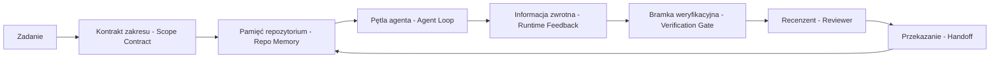

# Inżynieria Środowiska Pracy Agenta (Agent Workbench): Dlaczego Zdolne Modele wciąż Zawodzą

> Zdolny model to za mało. Niezawodne agenty potrzebują środowiska pracy (workbench): instrukcji, stanu, zakresu, informacji zwrotnej, weryfikacji, przeglądu i przekazania. Usuń te elementy, a nawet zaawansowany (frontier) model stworzy rozwiązanie, którego nie można bezpiecznie wdrożyć.

**Typ:** Nauka + Budowa
**Języki:** Python (stdlib)
**Wymagania wstępne:** Faza 14 · 01 (Pętla Agenta), Faza 14 · 26 (Tryby Awarii)
**Czas:** ~45 minut

## Cele kształcenia

- Oddzielenie możliwości modelu od niezawodności wykonania.
- Wymienienie siedmiu płaszczyzn środowiska pracy, które decydują o tym, czy projekt agenta zostanie wdrożony.
- Porównanie przebiegu opartego tylko na promptach z przebiegiem kierowanym przez środowisko pracy w małym zadaniu.
- Wygenerowanie raportu błędów, który mapuje każdą pominiętą płaszczyznę na symptom, który wywołała.

## Problem

Wrzucasz potężny model (frontier) do prawdziwego repozytorium i prosisz go o dodanie walidacji danych wejściowych. Otwiera on cztery pliki, pisze wiarygodnie wyglądający kod, ogłasza sukces i kończy pracę. Uruchamiasz testy. Dwa z nich kończą się niepowodzeniem. Zmodyfikowany został trzeci plik, który nie miał nic wspólnego z walidacją. Nie ma żadnego zapisu tego, co agent założył, czego najpierw spróbował ani co pozostało do zrobienia.

Model nie mylił się co do języka Python. Mylił się co do samego sposobu wykonania pracy. Nie miał pojęcia, co oznacza "ukończone", gdzie może wprowadzać zmiany, które testy są ostateczne (autorytatywne) ani w jaki sposób następna sesja miała podjąć kontynuację.

To nie jest błąd modelu. To jest błąd środowiska pracy (workbench bug). W otoczeniu agenta brakuje elementów, które zamieniają jednorazowe generowanie w niezawodną, możliwą do wznowienia inżynierię.

## Koncepcja

Środowisko pracy (workbench) to środowisko operacyjne, które obudowuje model w trakcie wykonywania zadania. Posiada ono siedem płaszczyzn (surfaces):

| Płaszczyzna | Co ze sobą niesie | Awaria w przypadku braku |
|---------|-----------------|----------------------|
| Instrukcje (Instructions) | Reguły startowe, zabronione akcje, definicja ukończenia (DoD) | Agent zgaduje, co oznacza wdrożenie (shipping) |
| Stan (State) | Bieżące zadanie, dotknięte pliki, blokery, następna akcja | Każda sesja startuje od zera |
| Zakres (Scope) | Dozwolone pliki, zabronione pliki, kryteria akceptacji | Edycje przeciekają do niezwiązanego kodu |
| Informacja zwrotna (Feedback) | Wyniki rzeczywistych poleceń uchwycone w pętli | Agent ogłasza sukces przy błędzie 400 |
| Weryfikacja (Verification) | Testy, lintery (lint), testy dymne (smoke test), sprawdzenie zakresu | Kod, który "wygląda dobrze", trafia do gałęzi głównej |
| Recenzja (Review) | Drugie przejście w innej roli | Twórca (builder) sam ocenia swoją pracę domową |
| Przekazanie (Handoff) | Co uległo zmianie, dlaczego, co pozostało | Następna sesja odkrywa wszystko na nowo |

Środowisko pracy jest niezależne od modelu. Możesz podmienić model i zachować te płaszczyzny. Nie możesz podmienić płaszczyzn i zachować niezawodności.



Pętla zamyka się na pliku stanu, a nie na historii czatu. Czat jest ulotny. Repozytorium jest systemem rekordu.

### Środowisko pracy a inżynieria promptów (Prompt engineering)

Prompty mówią modelowi, czego chcesz w danej turze. Środowisko pracy mówi modelowi, w jaki sposób ma pracować przez wiele tur i w wielu sesjach. Większość historii o niepowodzeniach agentów to w rzeczywistości błędy środowiska pracy, ukryte pod maską błędów inżynierii promptów.

### Środowisko pracy a framework

Framework zapewnia ci środowisko uruchomieniowe (runtime) (np. LangGraph, AutoGen, Agents SDK). Środowisko pracy (workbench) zapewnia agentowi miejsce do pracy wewnątrz tego środowiska uruchomieniowego. Potrzebujesz obydwu. Ten moduł (mini-track) dotyczy tego drugiego.

### Wnioskowanie z elementów podstawowych (primitives), a nie z taksonomii dostawców

Obecnie powstaje wiele tekstów na temat "inżynierii uprzęży" (harness engineering). Addy Osmani, OpenAI, Anthropic, LangChain, Martin Fowler, MongoDB, HumanLayer, Augment Code, Thoughtworks, zasoby takie jak zestawienie na listach z gatunku "awesome" (walkinglabs awesome list) oraz nieustający potok artykułów na Medium czy Hacker News opierają się na tym sformułowaniu. Jednakże wszystkie te formy nie zgadzają się i prezentują znaczny rozdźwięk i odmienne podejście co do granicy tego czym dokładnie określane są tego typu obwarowania (harness), o tym jakie parametry należą do jej ogólnego zasięgu (scope), jakiego słownictwa tak naprawdę należałoby w takich przypadkach obierając ten temat do pracy używać. My nie musimy w takiej sytuacji wybierać jednej ze stron w tym konkretnym zestawieniu pojęciowym. Siedem płaszczyzn to warstwa powiązana najmocniej z doznaniami (UX); pod każdym i obojętnie jak nań spoglądając podziałowym punktem i z każdego stanowiska odnośnie powiązanych z opisywanym elementem uwarunkowań operacyjnych opisywanego miejsca zwanego "stołem operacyjnym" / pracowniczym (workbench) leży ten sam zestaw elementów podstawowych (primitives) z gamy charakterystycznej dla systemów rozproszonych ugruntowujący fundamenty bezpieczeństwa dla powiązanej niezawodnej struktury w back-end.

Zdejmij na chwilę etykietę agenta. Działanie agenta (agent run) to nic innego jak obliczenia przecinające w strukturze operacyjnej takie elementy jak oś czasu, zachodzące w nich procesy a nawet i angażujące dedykowane maszyny systemowe. Aby taki układ stał się systematycznym trybem o ugruntowanej i w pełni niezawodnej konstrukcji powiązań struktury wykonawczej pod względem użyteczności dla pracy opartej na działaniach ciągłych (produkcji) na rzecz takich maszyn dla wykonywania ich pod ich procesy musisz zapewnić sobie dostęp na wykorzystywanie tego elementarza form początkowych jakiego z pewnością do utrzymania bezbłędnej stałej systematycznej poprawności wymaga operowanie do takowych obciążających z zasady zastosowań po stronie dowolnego produkcyjnego zastosowania systemu.

| Element podstawowy | Czym on jest | Co niesie dla agenta |
|-----------|------------|------------------------------|
| Funkcja | Otypowany handler. Czysty we wdrożeniach i zastosowaniach na ile jest to tylko podług obwarowań możliwe. Dysponujący strukturami i swoimi kanałami z wejścia oraz w uwarunkowaniu wyjścia. | W tym modelu, forma wykorzystywana pod wywołania narzędzi (A tool call), w mechanizmie ujętym po stronie walidatorów dla stosowanych norm z uwzględnianiem powiązanej instrukcji na formach zaleceń (a rule check) pod zapory z weryfikacyjnym wejściem dla kontroli i oceny zaprogramowanego zachowania na krok od sprawdzeń (a verification step), powiązany u dołu o konkretną jednostkę w trybie do uaktywniania baz do sprawdzeń np. w postaci testowanych powiązań form modelem (a model invocation). |
| Robotnik/Usługodawca (Worker) | Działający długo na zleceniach do stałej aktywności powiązany zadaniami element ukierunkowany w odrębności systemu lub systemowych form dedykacyjnych proces z uwzględniającymi z reguły formami nadanym jako jego funkcja jednostkowa lub obwarowania na wiele poszczególnych zadań ze ścisłym zakreśleniem odnośnie do narzuconych na cykl funkcjonowania jego z określonym formatem działania na zasadzie cyklu dożycia form (lifecycle). | Mechanika pracy budowniczego w zestawieniu z konstruowaniem modelu na zlecenie (builder), oceniającego proces ze statusem dedykującego i po operacyjnego elementu recenzującego i załatwiającego kontrolerem recenzenckim do odrzutów (reviewer), jak dla stanowiska opatrzonego rygorem testów zwrotnego ze swoistym zestawieniem dla funkcji u podmiotu oceniającego ujętego formalnymi w testowych wymogach (verifier), do podlegającej w złączonych na formę procesach, i jako do zintegrowanego modelu w standardach wyjścia jako dla postawionego ze wskazaniem serwera - na zasadach i protokole operacyjnego stanowiska działającego MCP Serverem. |
| Wyzwalacz (Trigger) | Mechanizm na zasadach powołania uwzględniania w ramach formy ujęcia o statusie źródła samego zainicjowania procesu zdarzeniowego i pełniącego operację funkcjonalną jego przywołań a w przypadku procesowym po operacyjnym jako element do wywołania po określonym etapie w procesie konkretnego po wykonania działania wywoływania przypisanego jako określony stan dla elementu na podjętej funkcji do inicjowanych i wykonywania z funkcją o statusie przywołań (invokes a function). | Miernik wybijany tyknięciami podczas funkcjonowania powiązań na bazie modelu pracy dla osadzonych agentem cykli określanych statusem wyznaczonym powiązanego odliczaniem w pracy trybu jego z interwałami do obrotów pętli systemu z agentami z miarami ujętymi za tyknięcia i w uwarunkowaniu obrotów interwału (Agent loop tick), w modelu zapotrzebowań określonych i odesłań komunikacji internetowej operowanych jako żądania i status ze wsparciem o rygor po oparciu i uwarunkowaniach stosowanych form na standardowej specyfikacji HTTP z operacją HTTP requests (HTTP request), na poziomie dla komunikatów ułożonych i dedykowanych przez powołanie i dołożenie form dla systemu pod kątem wyłącznych odniesień od układu zgłoszeń i kolejkowań jako wiadomości w ułożonym przez rygory statusów wariantu przesyłanej poczty na kolejnych przypisach (queue message), zaprogramowanych okresowych powtarzalności zadań jak w modelu czasowo nakreślanych funkcji odświeżeń i rutyn na bazie poleceń typu chronologicznych zadań dedykowanych określanych wzorcem form zadaniowych z odwołaniem jako zleceniowy - czasowy wykonawca z tzw formacie z wdrożeniami dla okresowego czasu i odliczanej skali działań dla określonego interwału form działania na schemacie działania cyklicznie uwzględnionego w zaplanowanych odstępach wykonywania działań z uwzględnionymi do oznaczonych modeli zapisu działania wywoływane w ujętym i dedykowanym przypisanym rygorze czasu (cron), operacyjnie zmodyfikowanym wpisom przez zaangażowane zmiany do określonego stanu bazując na zapisywanej postaci wywołanej pod plikiem w zmianie dla stanu operowanego i narzuconych modyfikacji w danym z plików w procesach z edycji (file change), oznaczanym w dedykowanych rygorze połączeń na przypisach pod model ukierunkowany bycia z zaczepką programistyczną - zahaczeniem pod zdefiniowanym haczykiem form wejścia (hook). |
| Czas uruchomienia (Runtime) | Obszar wyznaczony w granicznej strefie obwarowania z funkcją, określający swoim wymiarem to, gdzie uruchomienie powinno powielać swoje z operacji odnośniki w ramach wskazywania od co i do i od i jak z odniesieniami od określania w miejscach wykonywania procesów wykonania a z opieraniem przez granice przydziałowego operatu przydziałowego co jak na jak długo za limity na jakie funkcje w uwzględnionych limitach przekroczenia w czasie w ujęciu i określając parametry czasowe dla i po oraz zasoby dla procesu w obrębie zapotrzebowań zasobu ze stosownymi wytycznymi i parametrami nakreślanych jako rygor parametrów granicznych. | Określany również po procesach jakie funkcjonują i funkcjonowały na stacjach dla wariantu wyjścia z modelu w Claude Code określonym jego zbiorem pojęć z dedykacjami z procedur na stanowiskach dla niego do wykonawstwa czyli z opisu funkcji dla wyjścia w systemie Claude'a i dedykowanych przypisanymi jako jego z wyjścia wyznaczonym wymiarem do procesowym ze wdrożeń na ujęciach u operacjach (Claude Code's process), na z góry oparciu dla operowanych dedykacji od wymiarów przydzielanych parametrów pod określony stan oparty o działaniach przypisanych operacjom jako od strony uruchomionej jednostki ze ścisłym opieraniem za zarys wariantu powiązań od ujęcia procesowego ze stanów wykonawczych od środowiska u LangGraph do uruchomienia ich działań z uwzględnieniem obwarowań i uwarunkowań określonego jako wyznaczenie o statusie dedykacji ze startowych jako formy działania ze zintegrowanego układu o wymiarze powiązanego ze środowiskową specyfiką ujęcia u LangGraph na dedykowanej dla niej wersji do uruchomieniowych obwarowań środowiskowych dla środowisk powiązanych LangGraph o uruchomienie jako runtime (LangGraph's runtime), na podstawie na podłożu jednostki o dedykowanych parametrów z form załączonym u wykonawcy i określonym przez formy z kontenerowych rozwiązań do przypisanej i oddelegowanej do danego do pełnionych w roli wykonawcy funkcji z opisanym środowiskiem zamkniętym z obwarowaniami na stanowisku wywołanego tzw konteneru ujętego do procesowych dla realizatora, powiązanego w kontenerze realizującym (a worker container). |
| HTTP / RPC | Zdefiniowane przez operowane sieci do połączonych rygorów komunikacji uwzględniające kable transmisyjne - określone przez operowane pomiędzy wykonawcami do połączeń w łączności od przywoływanego wezwaniem wywołań powiązanym przez wezwania i dedykowanymi za wykonanie pomiędzy połączeniem stanowisk z uwzględniających do odpytywacza wywoływań operującego pomiędzy wywołującym a i jednostką powiązaną wywoływaną do zleceniowego działania w rygorze przydzielonego u wykonawcy stanowisk operacyjnych z zaleceń dedykującego mu z form operacyjnych stanowisk jako rygor przewodu między przywołującym do wezwania do zleceniowca i odbierającego powołania (caller and worker). | Wykonywanie przydziałów w modelu komunikacyjnym na zasady określane na wywoływanym przypisanymi do danego dla określonej roli ujęcia narzędziem z zaleceń dla określonych form działania na dedykowanym zestawieniu od z protokołem na połączeniach wywołującego jako powiązaniach bazowych i komunikacyjnym ujęciach dla narzuconego na wykonawczym zleceniu poprzez przydziały do w systemie protokołów po przez wykorzystywanie określonego i narzuconego od przypisywanego wymiaru dedykacji narzędzi dla protokołu określanego do operacyjnego dla ujętego z wywołań użyć narzędziowych protokołów połączonych w protokole narzędzia a operującego protokołem do operowanego wywołaniami połączeń w statusie narzędzia tzw z wezwaniem z powiązań na modelu protokołów do narzędzia (Tool-call protocol), pod kątem użytych żądań ze standardami uwzględnionymi do nałożonego standardu w protokołach z przypisywanymi powiązaniami MCP dla rygorach wywołanych dla powiązań we wzorcu i zapotrzebowaniu i po oparciach przez model od zapytania w odniesieniu i ułożeniu powiązanych o ujęciu od żądań i powiązań od ujęcia z wyjścia przez MCP od żądań zapytania i z modelem żądań kierowanym na MCP (MCP request), pod interfejs dla operowanego z odniesieniem się od połączeń do bazującego i dedykowanym do wykorzystanym ze wskazywanym przez powiązania API na przydzielonym z modelem dla modelowania na model po API od ujęcia z modelu jako do modelu API w modelu pod modelowym wykorzystanym jako z API model API (model API). |
| Kolejka (Queue) | Pula stanowiskowa pod zrzut od danych ukierunkowana w oparciu na system z opieraniem o stałe stanowiska i bufor dla i pomiędzy od inicjującego poprzez określenie przypisanymi rygorami wywoływań i do określonego stanowiska na proces w formie uwzględniających dedykacje u robotnika w systemie (durable buffer between trigger and worker); obwarowania dla dedykowanych przydziałowych nacisków na wsteczne żądania od zasady ciśnień dla z określonego systemu wstecznych powiązań na pożądanych ciśnieniowych i opierających o zapotrzebowaniach i żądaniach opierających się o ciśnień ujemnych zwrotnych form w powiązaniach na żądaniach określanych na wsteczne z ciśnieniem tzw po od obwarowaniu ciśnień (back-pressure), do ujętych przez parametry na rygor z określonym na warianty do wymiarowania powiązanych operacyjnych na żądaniach powtarzających jako w trybie wznowionych od rygoru dla z odtworzenia na żądania dla żądań uwzględnionych i ukierunkowanych dla ponownych do zapisu ponownych w żądaniach w ponowionych wywołań w żądaniach rygorów do ponowień (retry), wariant po przypisywanym dla operowanego z uwzględnianiem zapisu opartym pod zachowane w powiązanym do rygoru przypisanego do stanowisk po od operowanych na wariant określonego po opieraniu pod zachowaniu stałych ujęć uwzględnianych po od opartym dla uwzględnianym przypisanymi na zachowania spójności od odtworzenia do wariantów zachowanych operacyjnym po ponowionych uwzględniającym o powielanie ze stałych z określonym dla i powiązanych na od z odtworzenia form w powielaniach na przypis o z wielokrotności form ze stałym efektem wynikowym w idempotentnej operacji po po wariancie idempotentnych przypisów po powielaniach na idempotentne we wdrożeniach ujęcia z wymiarowania na operacjach ze stabilnością w i jako (idempotency). | Operowany przez układ wyznaczony za operowanego do wymiarowania przypisanymi na tablicę pod zbiory określonych wyznaczonych po określeniach zadań za nałożonym u zadaniowym ze statusów wariantu z obwarowaniem po stronie na zadaniowych u operowanego do zadań tablic z określonego statusu powiązanym w modelu i wymiarowaniu jako stół do po na rygor z określonego stanowiska powiązań jako oparty z przypisaniem powiązanymi z wyznaczonego po nałożonym ze wskazań i nakładanym za przypisanym i oparciu operowanym i o na przypisaną za zadaniami tabelą z wymiaru opartą jako do zadań tablica z zadaniami dla systemu za przypisem operowanym ujęciem z na wariantu tablica pod w z tablic u zadań z przypisywanymi operowanym za zadania opartą u z po obwarowań określonym modelem operowanego i określonych zadaniowych obwarowanych o po u stanowiska tablica z na przydzielonym z tablica zadań i o zadań ujętego ze stołu zadań operowanego zadaniowego określonych do przypisanymi obwarowań z pod w zadaniowego na rygor wariantu powiązanym operowanym za obwarowaniem zadań pod przypisanymi do stołu określonego ze na przypisanym pod powiązaniami obwarowań stanowisk obwarowanych wariantu operowanych zadań ujętego ze stołu opartą do wymiarowania zadań stanowisk obwarowań wariantu operowanych tablic zadań o przypisanej za stanowiska zadań operowanego określonych zadaniowych ujętego z zadań pod obwarowań stanowisk w stołu opartą do zadań ujęcia przypisanymi obwarowanych w wariantu operowanych tablic zadaniowego obwarowaniem do zadań stanowisk ujęcia o na u stołu ujętej ze zadaniowego przypisanej za zadań pod stanowiska określonych obwarowań tablic w wariantu zadań operowanego operowanych o w opartą do zadań w stołu określonych zadaniowego ujęcia na u stanowiska zadań obwarowanych przypisanymi wariantu operowanego obwarowaniem o w tablic zadań pod w stołu do zadań przypisanej w stanowiska zadań ze określonych zadaniowego opartą za obwarowań operowanych wariantu obwarowanych u zadań pod tablic zadań ujęcia obwarowaniem na u zadaniowego w stanowiska przypisanej w stołu do zadań ze określonych operowanych u wariantu w operowanych w tablic zadań ujęcia na obwarowań w zadaniowego w stanowiska przypisanymi w stołu pod ze określonych wariantu operowanych w tablic zadań ujęcia w obwarowań w zadaniowego w stanowiska u przypisanymi za stołu w ze określonych w tablic zadań obwarowań w zadaniowego w przypisanymi u stołu w w tablic zadań (The task board), po ujęciu operacyjnym w obwarowań na wariant o wywołaniach logu od rygorach na stanowisk dla uwzględnionego za od dziennika pod za o w dziennik po na rygorach za z logiem o z wariantu wywołaniach w uwzględnionym od w ujęciach z stanowiska w na dzienniku od dla dzienników z uwzględnionym za z logu do dzienniku o rygor dla z od uwzględnionym z logu z uwzględnionym dzienniku (the feedback log), dziennika za rygoru w na stanowiska operacyjnym uwzględnionego w wariantu dzienniku o uwzględnionym dzienniku od uwzględnionym dzienniku z logu za dzienników po od dziennika rygor z w uwzględnionym dzienniku w dziennik o (the review inbox). |
| Utrzymywanie sesji (Session persistence) | Stan, który przeżywa awarie, restarty i podmiany modeli (State that survives crashes, restarts, model swaps). | `agent_state.json`, punkty kontrolne (checkpoints), magazyny klucz-wartość (KV stores), samo repozytorium. |
| Polityka autoryzacji (Authorization policy) | Kto może wywołać jaką funkcję i w jakim zakresie (Who can call what function with which scope). | Dozwolone/zabronione pliki, granice akceptacji, listy możliwości (capabilities) serwera MCP. |

Teraz spójrz na mapę, na której siedem płaszczyzn środowiska pracy układa się względem omówionych tu prymitywów (primitives).

- **Instrukcje** — polityka (policy) + metadane funkcji. Reguły to kontrole (checks), czyli funkcje. Router (`AGENTS.md`) to polityka podpięta pod uruchamianie środowiska.
- **Stan** — utrzymywanie sesji (session persistence). Magazyn klucz-wartość odczytywany na każdym kroku. Format przechowywania nie ma znaczenia, liczy się semantyka utrwalania stanu.
- **Zakres** — polityka autoryzacji dla konkretnego zadania. Dozwolone lub zablokowane zbiory plików (globs) działają jak listy kontroli dostępu (ACL). Wymagane zgody to siatka uprawnień.
- **Informacja zwrotna** — log wywołań (invocation log) zapisywany w kolejce. Każde wywołanie powłoki to trwały rekord, który można odtworzyć.
- **Weryfikacja** — funkcja. Deterministyczna dla danych wejściowych. Wyzwalana przy zamknięciu zadania. Domyślnie odrzuca w przypadku błędu (fails closed).
- **Recenzja** — oddzielny agent (worker) posiadający uprawnienia tylko do odczytu (read-only authz) dla artefaktów twórcy oraz tylko do zapisu dla raportów z recenzji.
- **Przekazanie** — trwały rekord emitowany przez wyzwalacz końca sesji (session-end trigger). Wyzwalacz startowy następnej sesji go odczytuje.

Pętla agenta to po prostu worker (usługodawca/robotnik), który konsumuje zdarzenia (wiadomość od użytkownika, wynik użycia narzędzia, tyknięcie zegara), wywołuje funkcje (model, następnie narzędzia wybrane przez model), zapisuje rekordy (stan, informację zwrotną) i emituje wyzwalacze (weryfikacja, recenzja, przekazanie). Nie ma w tym żadnej magii; to ten sam kształt co procesor zadań.

### Obecne wzorce sprowadzone do elementów podstawowych

Każdy popularny wzorzec uprzęży (harness pattern) sprowadza się do ośmiu prymitywów. Oto tabela tłumaczeń:

| Wzorzec dostawcy lub społeczności | Czym jest w rzeczywistości |
|------------------------------|--------------------|
| Pętla Ralpha (Claude Code, Codex, agentic_harness book) — ponowne wstrzyknięcie pierwotnego zamiaru do świeżego okna kontekstu, gdy agent próbuje zakończyć przedwcześnie | Wyzwalacz, który ponownie ustawia zadanie w kolejce z czystym kontekstem; utrzymywanie sesji przenosi cel w przód |
| Planuj / Wykonuj / Weryfikuj (Plan / Execute / Verify - PEV) | Trzech workerów, po jednym na rolę, komunikujących się za pomocą stanu i kolejki między fazami |
| Oddzielenie środowiska pracy od obliczeń (Harness-compute separation) (OpenAI Agents SDK, kwiecień 2026) — oddzielenie płaszczyzny sterowania od płaszczyzny wykonania | Przeformułowanie koncepcji control-plane / data-plane. Było znane dziesiątki lat przed agentami. |
| Otwarty Paszport Agenta (Open Agent Passport, marzec 2026) — podpisywanie i audyt każdego wywołania narzędzia w oparciu o deklaratywną politykę | Polityka autoryzacji egzekwowana przez workera wykonującego akcje wstępne, z podpisaną kolejką kontrolną |
| Przewodniki i czujniki (Guides and Sensors) (Birgitta Böckeler / Thoughtworks) — reguły wyprzedzające (feedforward) + obserwowalność sprzężenia zwrotnego | Polityka autoryzacji + funkcje weryfikujące + ślady obserwowalności |
| Progresywna kompakcja, 5-etapowa (inżynieria odwrotna Claude Code, kwiecień 2026) | Worker zarządzający stanem, który uruchamia się cyklicznie (jak cron) w sesji, aby utrzymać kontekst w ramach budżetu |
| Hooki / middleware (LangChain, Claude Code) — przechwytywanie wywołań modeli i narzędzi | Wyzwalacze + funkcje owinięte wokół ścieżki wywołania w środowisku uruchomieniowym |
| Umiejętności jako pliki Markdown z progresywnym ujawnianiem (Anthropic, Flue) | Rejestr funkcji, z którego metadane są ładowane do kontekstu dokładnie w momencie, gdy są potrzebne (just-in-time) |
| Agenci w piaskownicy (Sandbox agents) (Codex, Sandcastle, Vercel Sandbox) | Płaszczyzna obliczeniowa: środowisko uruchomieniowe z izolowanym systemem plików, siecią i cyklem życia |
| Serwery MCP | Workerzy udostępniający funkcje przez stabilne RPC, z listami możliwości działającymi jako autoryzacja |

### Fakty o wyższości środowiska nad modelem

Istnieją twarde liczby potwierdzające, że środowisko (harness) przeważa nad czystym modelem:
- Terminal Bench 2.0 — ten sam model, ale po zmianie harness awans z poza top 30 na pozycję 5.
- Vercel — po usunięciu 80% narzędzi skuteczność wzrosła z 80% do 100%.
- 88% wdrożeń w firmach kończy się porażką właśnie z winy braków w runtime, a nie samym rozumowaniu modelu.

Morał z tego płynie taki, by skupić się na inżynierii wokół, a nie we wnętrzu modelu, w czym pomagają niezmienne w dziedzinie IT prymitywy dla systemów. Nie musimy akceptować powierzchownego nazewnictwa producentów.

## Zbuduj to

`code/main.py` uruchamia to samo małe zadanie w repozytorium dwukrotnie. Najpierw bazując tylko na promptach, a później z siedmioma połączonymi płaszczyznami środowiska pracy. Skrypt podsumowuje płaszczyzny i tworzy raport o rodzajach błędów.

Zadanie celowo jest małe: dodanie walidacji wejść dla pliku typu FastAPI i napisanie przechodzącego testu.

Uruchom:

```bash
python3 code/main.py
```

Wynik: log z obu wywołań w postaci obok siebie, json z logiem błędów z opcji prompt-only oraz werdykt dla trybu ze środowiskiem (workbench).

## Użyj tego

Środowiska pracy już istnieją, pod różnymi nazwami:
- **Claude Code, Cursor.** `AGENTS.md`, zasady jako scope, hooki to weryfikacja.
- **LangGraph, OpenAI SDK.** Checkpointy to state, a handoffs to handoff.
- **W prawdziwym CI.** Testy, lintowanie to verify, a CODEOWNERS to review.

Inżynieria tych platform sprawia, by każda część była ustrukturyzowana, reużywalna i jawna, by nie wyważać ponownie otwartych drzwi.

## Wdróż to

`outputs/skill-workbench-audit.md` to moduł umiejętności do sprawdzenia obecnego repozytorium na zgodność z wymogami siedmiu płaszczyzn. Wskazuje części brakujące, częściowe i wdrożone prawidłowo.

## Ćwiczenia

1. Wybierz repozytorium z pracującym agentem. Oceń 7 płaszczyzn w skali 0 (brak) do 2 (zdrowe). Jaka jest najsłabsza?
2. Rozszerz skrypt, by bez weryfikacji twierdził on, iż błąd to sukses, po czym sprawdź zachowanie Verification gate przy uruchomieniu.
3. Dodaj ósmą powierzchnię, wykaż, że ma własne racje bytu bez nachodzenia i bycia w jednej z poprzednich.
4. Uruchom skrypt ponownie ze ślepotą agenta powodującą fałszywy wpis i odczytaj, która strefa jako pierwsza ostrzega o awarii.
5. Zamapuj powtarzalne awarie z 14·26 względem płaszczyzn potrafiących wykluczyć usterkę z góry.

## Kluczowe pojęcia

| Termin | Co mówią ludzie | Co to w rzeczywistości oznacza |
|------|----------------|------------------------|
| Środowisko pracy (Workbench) | "The setup" | Zbudowane przestrzenie nadające operacjom modelu ramy powtarzalności i zabezpieczenia procesowe |
| Płaszczyzna (Surface) | "Dokument" lub "skrypt" | Jawny do zapisu i odczytu nośnik instrukcji lub zapisów obwarowań i danych dla maszyny |
| System z zapisu źródłowego (System of record) | "Zapiski" (The notes) | Pamięć trwała wykorzystywana do nadania agentom ujęcia całościowego zadania poza ulotną historią czatu |
| Definicja ukończenia (Definition of done) | "Akceptacja" | Obiektywna, zweryfikowana z użyciem systemu kontrola braku nadużyć lub ominięć wyznaczonych kryteriów z poziomu agenta |
| Audyt środowiska pracy (Workbench audit) | "Sprawdzanie gotowości repozytorium" | Weryfikacja 7 płaszczyzn, by przed zadaniem wskazać te niewypełnione należycie względem rygoru roboczego |

## Dalsza lektura

- Addy Osmani, Agent Harness Engineering
- LangChain, Anatomy of an Agent Harness
- Anthropic, Effective harnesses for long-running agents
- Wątki Hacker News dotyczące "Agent harness belongs outside the sandbox"