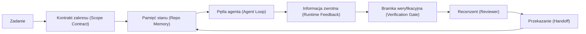

# Inżynieria Środowiska Pracy Agenta (Agent Workbench): Dlaczego Zdolne Modele wciąż Zawodzą

> Zdolny model to za mało. Niezawodni agenci potrzebują ustrukturyzowanego środowiska pracy (workbench) definiującego zasady, stan, zakres, informacje zwrotne, weryfikację, recenzję oraz procedurę przekazania zadań. Pozbawiony tych ram nawet najbardziej zaawansowany model wygeneruje kod, którego nie będzie można bezpiecznie wdrożyć na produkcji.

**Typ:** Nauka + Budowa
**Języki:** Python (stdlib)
**Wymagania wstępne:** Faza 14 · 01 (Pętla Agenta), Faza 14 · 26 (Tryby Awarii)
**Czas:** ~45 minut

## Cele nauczania

- Odróżnij ogólne możliwości modelu od rzeczywistej niezawodności wykonywania zadań w systemie.
- Wymień siedem płaszczyzn środowiska pracy (workbench), które decydują o gotowości agenta do wdrożenia produkcyjnego.
- Porównaj przepływ pracy oparty wyłącznie na promptach z podejściem ustrukturyzowanym przez środowisko pracy na przykładzie prostego zadania.
- Zidentyfikuj brakujące płaszczyzny środowiska pracy na podstawie obserwowanych błędów agenta.

## Problem

Wdrażasz zaawansowany model LLM w realnym repozytorium kodu i zlecasz mu napisanie walidacji danych wejściowych. Model analizuje cztery pliki, generuje poprawnie wyglądający kod, ogłasza sukces i kończy pracę. Po uruchomieniu testów okazuje się jednak, że dwa testy jednostkowe zakończyły się błędem, a model niepotrzebnie zmodyfikował plik niezwiązany z walidacją. Co więcej, brak jest jakichkolwiek logów wyjaśniających założenia agenta, podjęte próby czy zadania pozostałe do wykonania.

Model nie popełnił błędu składniowego w Pythonie. Popełnił błąd w sposobie organizacji swojej pracy. Nie posiadał definicji ukończenia zadania (Definition of Done), nie wiedział, w którym obszarze wolno mu dokonywać zmian, które testy są kluczowe ani jak przekazać stan prac do kolejnej sesji.

To nie jest wada samego modelu. To błąd środowiska pracy (workbench bug). W otoczeniu agenta zabrakło mechanizmów, które przekształcają jednorazowe generowanie tekstu w powtarzalny i bezpieczny proces inżynieryjny.

## Koncepcja

Środowisko pracy (workbench) to ustrukturyzowane środowisko operacyjne, które otacza model podczas wykonywania zadań. Składa się z siedmiu kluczowych płaszczyzn (surfaces):

| Płaszczyzna | Rola w systemie | Skutki braku wdrożenia |
|---------|-----------------|----------------------|
| Instrukcje (Instructions) | Reguły startowe, ograniczenia, definicja ukończenia zadania (DoD) | Agent domyśla się kryteriów sukcesu i wdrożenia |
| Stan (State) | Status zadania, zmodyfikowane pliki, blokady, następny krok | Każde uruchomienie (sesja) startuje od zera bez pamięci podręcznej |
| Zakres (Scope) | Dozwolone i zabronione pliki/katalogi, kryteria akceptacji | Zmiany kodu wyciekają do niezwiązanych modułów aplikacji |
| Informacja zwrotna (Feedback) | Wyniki rzeczywistych wywołań API i konsoli w pętli | Agent raportuje sukces mimo wystąpienia błędów systemowych (np. HTTP 400) |
| Weryfikacja (Verification) | Testy jednostkowe, lintery, testy dymne, walidacja zakresu zmian | Kod „wyglądający poprawnie”, ale zawierający błędy logiczne, trafia do gałęzi main |
| Recenzja (Review) | Niezależna weryfikacja wyników przez inny proces/model | Agent samodzielnie i bezkrytycznie ocenia poprawność własnej pracy |
| Przekazanie (Handoff) | Podsumowanie zmian, uzasadnienie decyzji, status zadań | Kolejna sesja lub programista musi analizować stan prac od nowa |

Środowisko pracy jest niezależne od wybranego modelu LLM. Możesz podmienić model na inny, zachowując te same płaszczyzny kontrolne. Nie można jednak zbudować niezawodnego systemu, rezygnując z płaszczyzn kontrolnych, nawet przy użyciu najlepszego modelu.



Pętla agenta zamyka się na trwałym pliku stanu, a nie na historii czatu. Konwersacja ma charakter ulotny, natomiast repozytorium i pliki stanu stanowią główne źródło prawdy (system of record).

### Środowisko pracy a inżynieria promptów (Prompt Engineering)

Prompty instruują model, jak ma się zachować w ramach pojedynczej tury. Środowisko pracy definiuje reguły współdziałania modelu w ujęciu wieloturowym i wielosesyjnym. Większość awarii agentów w rzeczywistości wynika z błędów środowiska pracy (uprzęży), a nie z nieoptymalnych promptów.

### Środowisko pracy a framework

Framework (np. LangGraph, AutoGen, OpenAI Agents SDK) dostarcza środowisko uruchomieniowe (runtime). Środowisko pracy (workbench) to logiczna struktura i reguły, które organizują pracę agenta wewnątrz tego runtime'u. Do stabilnego wdrożenia potrzebujesz obu tych elementów.

### Projektowanie w oparciu o fundamentalne elementy systemowe (Primitives)

Obecnie w branży poświęca się wiele uwagi tzw. inżynierii uprzęży (harness engineering). Opracowania firm takich jak OpenAI, Anthropic, LangChain czy Thoughtworks stosują różne terminologie i definicje granic pojęciowych. Zamiast skupiać się na nazewnictwie dostawców, warto sprowadzić systemy agentowe do klasycznych elementów systemów rozproszonych (primitives), które gwarantują bezpieczeństwo i niezawodność procesów:

| Element podstawowy (Primitive) | Opis | Zastosowanie w architekturze agentowej |
|-----------|------------|------------------------------|
| Funkcja (Function) | Wyizolowany moduł kodu posiadający zdefiniowane wejście i wyjście. | Wywołanie narzędzia (tool call), reguła walidacyjna, krok weryfikacyjny lub zapytanie do modelu LLM. |
| Proces roboczy (Worker) | Długo działający proces systemowy odpowiedzialny za wykonywanie zadań. | Agent budujący (builder), agent recenzujący (reviewer), weryfikator (verifier) lub serwer MCP. |
| Wyzwalacz (Trigger) | Zdarzenie inicjujące wykonanie określonego procesu lub funkcji. | Krok pętli agenta (loop tick), zapytanie HTTP, nowa wiadomość w kolejce, harmonogram cron, modyfikacja pliku lub webhook. |
| Środowisko uruchomieniowe (Runtime) | Izolowane środowisko systemowe, w którym wykonywane są procesy agenta. | Proces agenta (np. Claude Code), środowisko wykonawcze LangGraph lub izolowany kontener Docker (worker container). |
| Protokół komunikacji (HTTP / RPC) | Standard komunikacyjny służący do przesyłania poleceń i danych pomiędzy usługami. | Protokół wywołań narzędzi (Tool-call protocol), zapytania protokołu MCP (MCP request) lub interfejs API modelu (Model API). |
| Kolejka (Queue) | Trwały bufor pośredniczący w przesyłaniu zadań pomiędzy wyzwalaczem a procesem roboczym, obsługujący kontrolę przepływu (back-pressure), ponowne próby (retries) i gwarantujący idempotentność. | Tablica zadań (Task board), dziennik zdarzeń zwrotnych (Feedback log) lub skrzynka odbiorcza recenzji (Review inbox). |
| Utrzymywanie sesji (Session persistence) | Trwały zapis stanu aplikacji, który pozwala przetrwać restarty procesów, awarie serwera lub zmiany modeli. | Plik stanu `agent_state.json`, punkty kontrolne (checkpoints) w bazie danych lub magazyny klucz-wartość (KV stores). |
| Polityka autoryzacji (Authorization policy) | Reguły określające, które procesy mogą wywoływać określone funkcje i w jakim zakresie. | Ograniczenia dostępu do plików, limity uprawnień API oraz uprawnienia serwera MCP. |

Z mapy zależności wynika bezpośrednie przełożenie siedmiu płaszczyzn środowiska pracy na powyższe elementy podstawowe (primitives):

- **Instrukcje:** Są realizowane jako polityka autoryzacji oraz metadane funkcji. Reguły sprawdzające to funkcje walidacyjne, natomiast centralny router (`AGENTS.md`) stanowi politykę wpiętą w środowisko uruchomieniowe.
- **Stan:** Przekłada się na utrzymywanie sesji (session persistence). Zrzut stanu jest zapisywany w trwałym magazynie i odczytywany na początku każdego kroku.
- **Zakres:** Odpowiada polityce autoryzacji dla danego zadania (np. maski dopuszczonych plików/ścieżek działające jak listy ACL).
- **Informacja zwrotna:** To trwały log wywołań (invocation log) zapisywany w kolejce zdarzeń. Każda wykonana w terminalu komenda tworzy odtwarzalny rekord historyczny.
- **Weryfikacja:** Jest funkcją deterministyczną wyzwalaną przy próbie zakończenia zadania, domyślnie blokującą proces w przypadku wykrycia błędów (fail-closed).
- **Recenzja:** To dedykowany proces roboczy (worker) posiadający uprawnienia wyłącznie do odczytu (read-only) kodu źródłowego oraz do zapisu raportu z recenzji.
- **Przekazanie:** To trwały rekord stanu generowany przez wyzwalacz końca sesji, odczytywany przez wyzwalacz startowy kolejnej sesji.

W ujęciu systemowym pętla agenta to po prostu proces roboczy (worker), który przetwarza zdarzenia (komunikaty użytkownika, zwrotki z narzędzi), wywołuje funkcje (LLM oraz narzędzia), zapisuje rejestry (stan, informacje zwrotne) i aktywuje wyzwalacze (weryfikacja, recenzja, przekazanie).

### Przełożenie wzorców rynkowych na elementy podstawowe

Popularne w branży pojęcia i wzorce uprzęży można bezpośrednio sprowadzić do powyższych prymitywów:

| Nazewnictwo rynkowe / narzędziowe | Odpowiednik systemowy |
|------------------------------|--------------------|
| Pętla Ralpha (np. w Claude Code) – ponowne wstrzyknięcie intencji do nowego okna kontekstu przy próbie przedwczesnego zakończenia zadania | Wyzwalacz dodający zadanie z powrotem do kolejki z wyczyszczonym kontekstem, podczas gdy mechanizm utrwalania sesji przenosi stan w przód |
| Wzorzec PEV (Plan / Execute / Verify) | Trzy procesy robocze (workers) komunikujące się asynchronicznie za pomocą kolejki i wspólnego stanu |
| Rozdział sterowania od wykonania (Control/Data plane separation) | Klasyczny podział architektury na płaszczyznę sterowania (control-plane) i płaszczyznę danych (data-plane) |
| System paszportów agenta (Agent Passport) – podpisywanie i audyt wywołań narzędzi w oparciu o polityki | Polityka autoryzacji egzekwowana przez proces roboczy przed wykonaniem akcji, wsparta podpisanym logiem kontrolnym |
| Pętla feedforward i feedback (Thoughtworks Guides and Sensors) | Polityka autoryzacji połączona z funkcjami weryfikacyjnymi i śledzeniem obserwowalności |
| Progresywna kompakcja kontekstu (np. w Claude Code) | Proces roboczy zarządzający pamięcią, uruchamiany cyklicznie w celu kompresji kontekstu w ramach budżetu tokenów |
| Mechanizmy middleware (np. w LangChain) | Funkcje i wyzwalacze wbudowane w potok wywołań środowiska uruchomieniowego |
| Dynamiczne ładowanie umiejętności z plików Markdown | Rejestr funkcji pobierający metadane opisów narzędzi dokładnie w momencie ich wywołania (just-in-time) |
| Piaskownice wykonawcze (Sandboxes) | Środowisko uruchomieniowe (runtime) z odizolowanym systemem plików, procesami i siecią |
| Serwery MCP (Model Context Protocol) | Procesy robocze (workers) udostępniające funkcje (narzędzia) przez RPC z obsługą list uprawnień |

### Znaczenie środowiska pracy (Harness/Workbench) dla stabilności systemu

Badania i wdrożenia produkcyjne wykazują, że jakość uprzęży (środowiska pracy) ma kluczowe znaczenie:
- W teście Terminal Bench 2.0 ten sam model LLM, dzięki optymalizacji środowiska pracy (harness), awansował z pozycji poza pierwszą trzydziestką do pierwszej piątki rankingu.
- Analizy Vercel wykazują, że ograniczenie liczby dostępnych narzędzi o 80% (lepsze zdefiniowanie zakresu/scope) pozwoliło na wzrost skuteczności realizacji zadań z 80% do 100%.
- Ponad 80% błędów wdrożeniowych systemów agentowych wynika z braków w architekturze środowiska uruchomieniowego i płaszczyznach kontrolnych, a nie ze słabości modeli LLM w logicznym rozumowaniu.

Podstawą sukcesu jest skupienie się na inżynierii oprogramowania otaczającej model, wykorzystującej sprawdzone w informatyce wzorce projektowe.

## Zbuduj to

Plik `code/main.py` demonstruje wykonanie małego zadania programistycznego w repozytorium (dodanie walidacji wejść w FastAPI oraz wdrożenie testu jednostkowego) w dwóch wariantach:
1. Przepływ oparty wyłącznie na promptach (prompt-only).
2. Przepływ ustrukturyzowany z wykorzystaniem siedmiu płaszczyzn środowiska pracy (workbench).

Skrypt generuje raport porównawczy z kategoryzacją błędów i weryfikacją skuteczności wdrożenia zmian.

Uruchomienie:

```bash
python3 code/main.py
```

Dane wyjściowe: zestawienie logów z obu przebiegów, raport błędów w formacie JSON dla wariantu prompt-only oraz status wdrożenia dla wariantu ustrukturyzowanego.

## Użyj tego

Koncepcje środowiska pracy (workbench) są stosowane w wiodących narzędziach pod różnymi nazwami:
- **Claude Code / Cursor:** Plik `AGENTS.md` oraz pliki konfiguracji zasad definiują zakres (scope), natomiast skrypty weryfikacyjne w potokach pełnią rolę kroku weryfikacji (verify).
- **LangGraph / OpenAI SDK:** Checkpointy reprezentują stan (state), a mechanizmy handoffs odpowiadają za przekazanie zadań.
- **Potoki CI/CD:** Testy automatyczne i lintery tworzą bramki weryfikacyjne (verify), natomiast CODEOWNERS reguluje proces recenzji (review).

## Wyślij to

Plik `outputs/skill-workbench-audit.md` dostarcza listę kontrolną do audytu obecnego repozytorium pod kątem pokrycia i poprawności wdrożenia siedmiu płaszczyzn środowiska pracy.

## Ćwiczenia

1. Przeprowadź audyt wybranego projektu agentowego. Oceń pokrycie 7 płaszczyzn w skali od 0 (brak) do 2 (pełne wdrożenie). Zidentyfikuj najsłabsze ogniwo systemu.
2. Zmodyfikuj skrypt testowy tak, aby symulował błąd w kodzie, i zweryfikuj czy bramka weryfikacyjna (verification gate) poprawnie zablokuje wdrożenie mimo raportowanego przez agenta sukcesu.
3. Zdefiniuj i opisz potencjalną ósmą płaszczyznę środowiska pracy, wykazując jej niezależność od siedmiu pozostałych.
4. Przeprowadź test odporności systemu na fałszywe dane wejściowe i zaobserwuj, która płaszczyzna jako pierwsza wykryje i zablokuje anomalie.
5. Dokonaj mapowania najczęstszych trybów awarii (lekcja 26) na płaszczyzny środowiska pracy, które są w stanie im zapobiec.

## Kluczowe pojęcia

| Termin | Co potocznie się mówi | Co to oznacza w rzeczywistości |
|------|----------------|------------------------|
| Środowisko pracy (Workbench/Harness) | „Konfiguracja agenta” | Zbiór reguł, zabezpieczeń i narzędzi systemowych otaczających model w celu zapewnienia powtarzalności procesu |
| Płaszczyzna kontrolna (Surface) | „Plik zasad lub skrypt walidacji” | Interfejs do wymiany informacji i egzekwowania reguł pomiędzy agentem a systemem operacyjnym |
| System zapisu (System of record) | „Pliki stanu i logi” | Trwałe nośniki informacji przechowujące stan prac agenta poza ulotnym oknem kontekstu czatu |
| Definicja ukończenia (DoD) | „Kryteria odbioru” | Zautomatyzowane i deterministyczne reguły weryfikujące poprawność wykonania zadania przed wdrożeniem |
| Audyt środowiska pracy (Workbench audit) | „Lista kontrolna repozytorium” | Analiza stopnia pokrycia i dojrzałości 7 płaszczyzn środowiska pracy w projekcie |

## Dalsza lektura

- Addy Osmani, *Agent Harness Engineering*
- LangChain, *Anatomy of an Agent Harness*
- Anthropic, *Effective harnesses for long-running agents*
- Dyskusje w społecznościach inżynieryjnych: *„Agent harness belongs outside the sandbox”*
