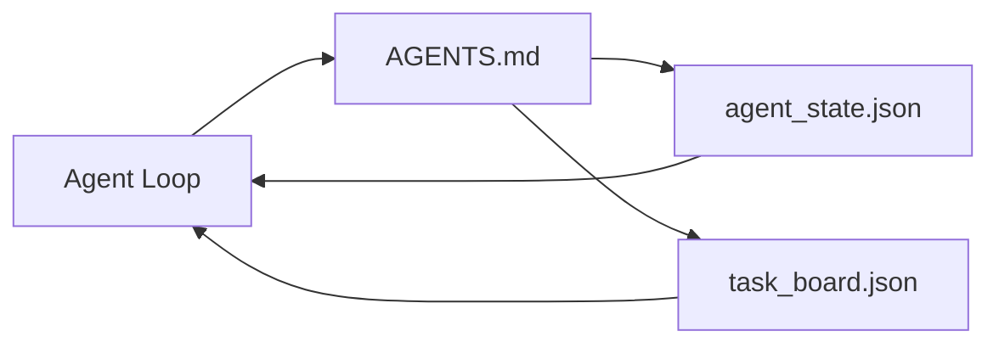

# Minimalny stół warsztatowy agentów

> Najmniejszy użyteczny warsztat to trzy pliki: router instrukcji root, plik stanu i tablica zadań. Wszystko inne jest ułożone na wierzchu. Jeśli repo nie może pomieścić tych trzech danych, żaden model ich nie zapisze.

**Typ:** Kompilacja
**Języki:** Python (stdlib)
**Wymagania wstępne:** Faza 14 · 31 (Dlaczego zdolne modele wciąż zawodzą)
**Czas:** ~45 minut

## Cele nauczania

- Zdefiniuj trzy pliki tworzące minimalne wykonalne środowisko pracy.
- Wyjaśnij, dlaczego krótki router główny jest lepszy od długiego monolitycznego `AGENTS.md`.
- Zbuduj plik stanu, który agent będzie mógł odczytać w każdej turze i zapisać na końcu.
- Zbuduj tablicę zadań, która przetrwa pracę wielosesyjną bez historii czatów.

## Problem

Większość zespołów sięga po stół warsztatowy, pisząc `AGENTS.md` 3000 wierszy i ogłaszając, że jest to zrobione. Model ładuje go, ignoruje części, których nie może podsumować, i nadal zawodzi na tych samych powierzchniach, na których zawsze zawodził.

Potrzebujesz czegoś przeciwnego. Mały plik główny, który kieruje agenta do głębszych plików tylko wtedy, gdy jest to istotne. Trwały stan, który agent czyta przed podjęciem działania i pisze po. Tablica zadań informująca o tym, co jest w trakcie realizacji, co jest zablokowane i co będzie dalej.

Trzy pliki. Każdy z pracą. Każdy z nich jest na tyle czytelny maszynowo, że można go później przekształcić w prawdziwy system.

## Koncepcja



### AGENTS.md to router, a nie instrukcja

Dobry `AGENTS.md` jest krótki. Wskazuje agentowi:

- Plik stanu (gdzie jesteś).
- Tablica zadań (co zostało).
- Głębsze zasady (w `docs/agent-rules.md`).
- Polecenie weryfikacji (jak poznać, że działa).

Wszystko, co jest dłuższe, trafia do głębszych dokumentów i jest ładowane tylko w razie potrzeby. Długie instrukcje są ignorowane. Śledzone są krótkie routery.

### agent_state.json to system rejestrowania

Stan przenosi: identyfikator aktywnego zadania, dotknięte pliki, przyjęte założenia, blokery i następną akcję. Agent czyta to na każdym kroku. Następna sesja czyta go zamiast odtwarzać czat.

Stan znajduje się w pliku, ponieważ historia czatów jest niewiarygodna. Sesje umierają. Rozmowy zostają przycięte. Plik nie.

### task_board.json to kolejka

Na tablicy zadań znajdują się wszystkie zadania ze statusem `todo | in_progress | done | blocked`. Jest to kolejka, z której agent pobiera dane, gdy stan jest pusty, i kolejka, którą czytasz, gdy chcesz wiedzieć, czy agent działa prawidłowo.

Zadanie na tablicy ma identyfikator, cel, właściciela (`builder`, `reviewer` lub `human`) i kryteria akceptacji. Tablica jest celowo mała: kiedy wyrasta poza ekran, pojawia się problem z planowaniem, a nie z tablicą.

### Trzy pilniki to podłoga, a nie sufit

Późniejsze lekcje dodają umowy dotyczące zakresu, narzędzia do przesyłania informacji zwrotnej, bramki weryfikacyjne, listy kontrolne recenzentów i pakiety przekazania. Wszyscy zakładają, że trzy pliki tutaj są takie, jakie są.

## Zbuduj to

`code/main.py` zapisuje minimalny warsztat w pustym repozytorium i demonstruje obrót pojedynczego agenta, który:

1. Czyta `agent_state.json`.
2. Pobiera następne zadanie z `task_board.json`, jeśli stan jest pusty.
3. Dotyka pojedynczego pliku w zakresie.
4. Zapisuje ponownie zaktualizowany stan.

Uruchom to:

```
python3 code/main.py
```

Skrypt tworzy `workdir/` obok siebie, umieszcza trzy pliki, wykonuje jedną turę i wypisuje różnicę. Uruchom go ponownie, aby zobaczyć, jak druga tura rozpoczyna się w miejscu, w którym zakończyła się pierwsza.

## Użyj tego

W produktach agenta produkcyjnego te same trzy pliki pojawiają się pod różnymi nazwami:

- **Kod Claude:** `AGENTS.md` lub `CLAUDE.md` dla routera, sklepy w stylu `.claude/state.json` dla stanu, haczyki na płytkę.
- **Kodeks / Kursor:** reguły obszaru roboczego dla routera, pamięć sesji dla stanu, zadania w kolejce na pasku bocznym czatu dla tablicy.
- **Niestandardowy agent Pythona:** te same pliki, które właśnie napisałeś.

Imiona się zmieniają. Kształt nie.

## Wzorce produkcji na wolności

Minimalny stół warsztatowy wytrzymuje kontakt z prawdziwymi monorepo, gdy na nim ułożone są trzy warstwy. Są niezależni; wybierz te, których faktycznie potrzebuje Twoje repozytorium.

**Zagnieżdżone `AGENTS.md` z pierwszeństwem najbliższych zwycięstw.** OpenAI dostarcza 88 plików `AGENTS.md` w swoim głównym repozytorium, po jednym na podkomponent. Codex, Cursor, Claude Code i Copilot przechodzą od pliku roboczego do katalogu głównego repozytorium i łączą wszystkie `AGENTS.md`, które znajdą po drodze. Pliki podkatalogów rozszerzają plik główny. Kodeks dodaje `AGENTS.override.md`, aby zastąpić, a nie rozszerzyć; mechanizm zastępowania jest specyficzny dla Kodeksu i należy go unikać w przypadku pracy z różnymi narzędziami. Linia, która ma znaczenie, ma miarę Kodu Rozszerzającego: najlepsze pliki `AGENTS.md` dają skok jakościowy równoważny aktualizacji z Haiku do Opus; najgorsze powodują, że dane wyjściowe są gorsze niż brak pliku.

**Anty-wzorce do odrzucenia, nawet jeśli wyglądają jak pokrycie.** Sprzeczne instrukcje powodują dyskretne przejście agenta z trybu interaktywnego do zachłannego (ICLR 2026 AMBIG-SWE: współczynnik rozwiązywania 48,8% → 28%); numeruj priorytety zamiast układać je płasko. Niemożliwe do zweryfikowania reguły stylu („postępuj zgodnie z przewodnikiem po stylu Google Python”) bez polecenia egzekwowania pozwalają agentowi wymyślić zgodność; sparuj każdą regułę stylu z dokładnym poleceniem lint. Prowadzenie ze stylem zamiast poleceń zakopuje ścieżkę weryfikacji; najpierw polecenia, na końcu styl. Pisanie dla ludzi zamiast dla agentów marnuje budżet kontekstowy; zwięzłość jest cechą.

**Dowiązania symboliczne między narzędziami.** Pojedynczy plik główny z dowiązaniami symbolicznymi (`ln -s AGENTS.md CLAUDE.md`, `ln -s AGENTS.md .github/copilot-instructions.md`, `ln -s AGENTS.md .cursorrules`) zapewnia każdemu agentowi kodującemu to samo źródło prawdy. `nx ai-setup` Nx automatyzuje to w Claude Code, Cursor, Copilot, Gemini, Codex i OpenCode z jednej konfiguracji.

## Wyślij to

`outputs/skill-minimal-workbench.md` generuje środowisko robocze składające się z trzech plików dla dowolnego nowego repozytorium: router `AGENTS.md` dostrojony do projektu, router `agent_state.json` z odpowiednimi kluczami i router `task_board.json` z bieżącym zaległości.

## Ćwiczenia

1. Dodaj znacznik czasu `last_run` do `agent_state.json`. Odmów uruchomienia, jeśli plik jest starszy niż 24 godziny, chyba że operator to potwierdzi.
2. Dodaj pole `priority` do tablicy zadań i zmień moduł ściągający tak, aby zawsze wybierał najwyższy priorytet `todo`.
3. Przeprowadź migrację `task_board.json` do linii JSON, aby każde zadanie było linią, a różnice w kontroli wersji były czyste.
4. Napisz `lint_workbench.py`, który zakończy się niepowodzeniem, jeśli `AGENTS.md` ma ponad 80 linii lub odwołuje się do pliku, który nie istnieje.
5. Zdecyduj, którego z trzech plików szkoda byłoby najbardziej stracić. Broń tego.

## Kluczowe terminy

| Termin | Co ludzie mówią | Co to właściwie oznacza |
|------|----------------|--------------------------------------|
| routera | `AGENTS.md` | Krótki plik główny, który wskazuje agentowi głębsze dokumenty i pliki |
| Plik stanu | „Notatki” | Czytelny maszynowo zapis miejsca pobytu agenta, zapisywany co turę |
| Tablica zadań | „Zaległości” | Kolejka pracy JSON ze statusem, właścicielem, akceptacją |
| System zapisu | „Źródło prawdy” | Plik, który środowisko robocze traktuje jako wiarygodne, gdy czat zostanie wyłączony |

## Dalsze czytanie

- [agents.md — otwarta specyfikacja](https://agents.md/) — przyjęta przez Cursor, Codex, Claude Code, Copilot, Gemini, OpenCode
- [Kod rozszerzający, dobry AGENTS.md to aktualizacja modelu. Zły jest gorszy niż brak dokumentów](https://www.augmentcode.com/blog/how-to-write-good-agents-dot-md-files) — zmierzone skoki jakości
- [Blake Crosley, AGENTS.md Patterns: Co faktycznie zmienia zachowanie agenta](https://blakecrosley.com/blog/agents-md-patterns) — co działa empirycznie, a co nie
- [Datadog Frontend, Sterowanie agentami AI w Monorepos za pomocą AGENTS.md](https://dev.to/datadog-frontend-dev/steering-ai-agents-in-monorepos-with-agentsmd-13g0) — pierwszeństwo zagnieżdżone w praktyce
– [Blog Nx, Naucz swojego agenta AI, jak pracować w Monorepo](https://nx.dev/blog/nx-ai-agent-skills) — generowanie z jednego źródła za pomocą sześciu narzędzi
– [The Prompt Shelf, AGENTS.md Najlepsze praktyki: struktura, zakres i rzeczywiste przykłady](https://thepromptshelf.dev/blog/agents-md-best-practices/) — kolejność sekcji, która przetrwa recenzję
- [Anthropic, podagenci Claude Code i sklep sesji](https://docs.anthropic.com/en/docs/agents-and-tools/claude-code/sub-agents)
- Faza 14 · 31 – rodzaje awarii pochłaniane przez to minimum
- Faza 14 · 34 — schemat stanu trwałego, którego prezentacja jest zapowiedzią tej lekcji