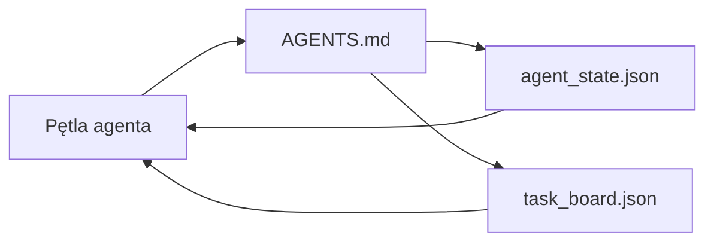

# Minimalne środowisko pracy agenta (Minimal Agent Workbench)

> Najprostsze użyteczne środowisko pracy składa się z trzech plików: głównego routera instrukcji (root), pliku stanu oraz tablicy zadań. Wszystkie pozostałe elementy są budowane na tej bazie. Jeśli repozytorium nie potrafi przechować tych trzech informacji, żaden model nie obsłuży go poprawnie.

**Typ:** Budowa (Build)  
**Języki:** Python (biblioteka standardowa)  
**Wymagania wstępne:** Faza 14 · 31 (Dlaczego zdolne modele wciąż zawodzą)  
**Czas:** ~45 minut  

## Cele nauczania

- Zdefiniowanie trzech plików tworzących minimalne, działające środowisko pracy agenta.
- Wyjaśnienie, dlaczego krótki, główny plik przekierowujący (router) jest lepszy od długiego, monolitycznego pliku `AGENTS.md`.
- Zbudowanie pliku stanu, który agent odczytuje na początku każdej tury i aktualizuje na jej końcu.
- Zbudowanie tablicy zadań, która umożliwia realizację zadań wielosesyjnych bez konieczności polegania na historii czatu.

## Problem

Większość zespołów tworzy środowisko pracy agenta poprzez napisanie pliku `AGENTS.md` o długości 3000 linii, uznając zadanie za zakończone. Model wczytuje taki plik, ignoruje fragmenty, których nie jest w stanie przetworzyć w kontekście, i wciąż popełnia błędy w tych samych obszarach co wcześniej.

Potrzebujesz zupełnie innego podejścia: krótkiego pliku głównego, który kieruje agenta do szczegółowych dokumentów tylko wtedy, gdy są one potrzebne; trwałego stanu, który agent czyta przed podjęciem działania i zapisuje po jego zakończeniu; oraz tablicy zadań informującej o tym, co jest w toku, co zostało zablokowane, a co należy wykonać w następnej kolejności.

Trzy pliki. Każdy z nich ma przypisane konkretne zadanie. Każdy z nich jest na tyle czytelny dla maszyn, że można go później łatwo zintegrować z większym systemem.

## Koncept



### AGENTS.md to router, a nie instrukcja obsługi

Dobry plik `AGENTS.md` jest krótki. Wskazuje on agentowi:

- Plik stanu (gdzie aktualnie się znajduje).
- Tablicę zadań (co pozostało do zrobienia).
- Szczegółowe reguły (w `docs/agent-rules.md`).
- Polecenie weryfikacji (skąd wiedzieć, czy kod działa).

Wszystkie dłuższe treści powinny trafić do dedykowanych dokumentów i być ładowane tylko w razie potrzeby. Długie instrukcje są przez modele ignorowane, natomiast krótkie pliki routujące są skutecznie przestrzegane.

### agent_state.json jako system zapisu (System of Record)

Plik stanu przechowuje: identyfikator aktywnego zadania, modyfikowane pliki, przyjęte założenia, blokery oraz następną akcję. Agent odczytuje go w każdym kroku. Kolejna sesja rozpoczyna się od odczytania tego pliku, zamiast odtwarzania całej historii czatu.

Stan jest zapisywany w pliku, ponieważ historia czatu bywa zawodna. Sesje mogą zostać przerwane, a kontekst rozmowy ulega skróceniu. Plik na dysku pozostaje nienaruszony.

### task_board.json jako kolejka zadań

Na tablicy zadań znajdują się wszystkie zadania wraz z ich statusami: `todo | in_progress | done | blocked`. Jest to kolejka, z której agent pobiera zadania, gdy jego stan jest pusty, oraz źródło informacji dla Ciebie o postępach w pracy agenta.

Każde zadanie na tablicy posiada identyfikator, cel, przypisanego wykonawcę (`builder`, `reviewer` lub `human`) oraz kryteria akceptacji. Tablica powinna być celowo mała: jeśli jej rozmiar przekracza jeden ekran, problem leży w planowaniu pracy, a nie w samym narzędziu.

### Trzy pliki to fundament, a nie limit możliwości

Kolejne lekcje wprowadzą umowy dotyczące zakresu (scopes), narzędzia do przesyłania informacji zwrotnej (feedback runners), bramki weryfikacyjne, listy kontrolne dla recenzentów oraz pakiety przekazania prac. Wszystkie te elementy zakładają jednak poprawne działanie opisanych tutaj trzech podstawowych plików.

## Wdrożenie (Zbuduj to)

Skrypt `code/main.py` tworzy minimalne środowisko pracy w pustym repozytorium i demonstruje pojedynczą turę pracy agenta, która:

1. Odczytuje `agent_state.json`.
2. Pobiera kolejne zadanie z `task_board.json`, jeśli stan jest pusty.
3. Modyfikuje pojedynczy plik w dozwolonym zakresie.
4. Zapisuje zaktualizowany stan z powrotem na dysk.

Uruchomienie:

```
python3 code/main.py
```

Skrypt utworzy katalog `workdir/`, umieści w nim trzy pliki, wykona jedną turę i wyświetli wprowadzone zmiany (diff). Uruchom go ponownie, aby zobaczyć, jak kolejna tura rozpoczyna się dokładnie w miejscu, w którym zakończyła się poprzednia.

## Zastosowanie (Użyj tego)

W produkcyjnych narzędziach te same trzy pliki występują pod różnymi nazwami:

- **Claude Code:** `AGENTS.md` lub `CLAUDE.md` jako router, dane stanu w `.claude/state.json`, integracja z tablicami zadań.
- **Cursor / VS Code:** reguły obszaru roboczego jako router, pamięć sesji jako stan, zadania w kolejce na pasku bocznym czatu jako tablica.
- **Własny agent w Pythonie:** te same trzy pliki, które właśnie zaimplementowałeś.

Nazwy mogą się różnić, ale struktura pozostaje taka sama.

## Wzorce produkcyjne w praktyce

Minimalne środowisko pracy sprawdza się w rzeczywistych monorepo, gdy zostanie rozbudowane o trzy dodatkowe warstwy. Są one od siebie niezależne; wybierz te, których faktycznie potrzebuje Twoje repozytorium.

**Zagnieżdżone pliki `AGENTS.md` z zasadą pierwszeństwa najbliższej reguły (closest-wins).** OpenAI stosuje 88 plików `AGENTS.md` w swoim głównym repozytorium – po jednym na każdy podkomponent. Narzędzia takie jak Cursor, Claude Code czy Copilot wyszukują pliki konfiguracyjne od folderu roboczego w górę, aż do głównego katalogu repozytorium, łącząc wszystkie znalezione instrukcje. Pliki w podkatalogach rozszerzają reguły z katalogu głównego. Cursor umożliwia użycie pliku `.cursorrules` do nadpisania instrukcji. Odpowiednie dopasowanie tych plików ma kluczowe znaczenie: badania firmy Augment Code pokazują, że dobrze napisane pliki `AGENTS.md` dają skok jakościowy porównywalny z przejściem z modelu Haiku na Opus; złe instrukcje mogą z kolei pogorszyć wyniki bardziej niż brak jakichkolwiek dokumentów.

**Antywzorce do wyeliminowania, nawet jeśli wydają się zapewniać dobre pokrycie.** Sprzeczne instrukcje powodują ciche przejście agenta z trybu interaktywnego (dopytywanie o szczegóły) do zachłannego (zgadywanie rozwiązań), co drastycznie obniża skuteczność (wg ICLR 2026 AMBIG-SWE: spadek z 48,8% do 28%). Priorytety należy numerować, a nie tylko wypisywać obok siebie. Nieweryfikowalne reguły stylu (np. „przestrzegaj Google Python Style Guide”) bez automatycznego polecenia sprawdzającego pozwalają agentowi na ignorowanie wytycznych. Każdą regułę stylu należy powiązać z konkretnym poleceniem lintera. Umieszczanie reguł stylu przed poleceniami uruchomienia utrudnia weryfikację kodu; polecenia powinny być zawsze na początku, a styl na końcu. Pisanie instrukcji w sposób przeznaczony dla ludzi zamiast dla agentów marnuje okno kontekstowe – zwięzłość to kluczowa zaleta.

**Dowiązania symboliczne między narzędziami.** Stworzenie jednego głównego pliku i dowiązań symbolicznych (`ln -s AGENTS.md CLAUDE.md`, `ln -s AGENTS.md .github/copilot-instructions.md`, `ln -s AGENTS.md .cursorrules`) zapewnia wszystkim agentom to samo źródło prawdy. Narzędzie `nx ai-setup` automatyzuje ten proces dla wielu popularnych asystentów z poziomu jednej konfiguracji.

## Wdrożenie (Wyślij to)

Szablon `outputs/skill-minimal-workbench.md` umożliwia wygenerowanie środowiska roboczego złożonego z trzech plików dla dowolnego nowego repozytorium: pliku `AGENTS.md` dostosowanego do projektu, `agent_state.json` z odpowiednimi kluczami oraz `task_board.json` z początkową listą zadań.

## Ćwiczenia

1. Dodaj znacznik czasu `last_run` do pliku `agent_state.json`. Zablokuj uruchomienie agenta, jeśli plik jest starszy niż 24 godziny, chyba że operator wyraźnie to zatwierdzi.
2. Dodaj pole `priority` do tablicy zadań i zmień logikę pobierania zadań tak, aby zawsze wybierać zadanie `todo` o najwyższym priorytecie.
3. Zmień format `task_board.json` na JSON Lines (JSONL), aby każde zadanie było zapisane w jednej linii, co ułatwi śledzenie zmian w systemie kontroli wersji.
4. Napisz skrypt `lint_workbench.py`, który zgłosi błąd, jeśli plik `AGENTS.md` przekracza 80 linii lub odwołuje się do nieistniejących plików.
5. Zastanów się, utrata którego z tych trzech plików byłaby najbardziej kosztowna. Uzasadnij swój wybór.

## Kluczowe terminy

| Termin | Potoczna nazwa | Rzeczywiste znaczenie |
| :--- | :--- | :--- |
| Router | `AGENTS.md` | Krótki plik główny, który kieruje agenta do szczegółowych dokumentów i plików |
| Plik stanu | „Notatki” | Czytelny dla maszyn zapis stanu prac agenta, aktualizowany w każdej turze |
| Tablica zadań | „Backlog” | Kolejka zadań w formacie JSON zawierająca statusy, osoby przypisane oraz kryteria akceptacji |
| System zapisu | „Źródło prawdy” | Plik, który środowisko pracy traktuje jako nadrzędny, gdy sesja czatu zostanie zamknięta |

## Dalsza lektura

- [Specyfikacja agents.md](https://agents.md/) – standard adoptowany przez wiodące edytory i agentów.
- [Augment Code: Good AGENTS.md is a model upgrade](https://www.augmentcode.com/blog/how-to-write-good-agents-dot-md-files) – analiza wpływu instrukcji na jakość pracy.
- [Blake Crosley: AGENTS.md Patterns](https://blakecrosley.com/blog/agents-md-patterns) – co empirycznie wpływa na zachowanie agentów.
- [Datadog Frontend: Steering AI agents in monorepos](https://dev.to/datadog-frontend-dev/steering-ai-agents-in-monorepos-with-agentsmd-13g0) – zarządzanie wieloma plikami instrukcji w monorepozytoriach.
- [Blog Nx: Teach your AI agent how to work in a Monorepo](https://nx.dev/blog/nx-ai-agent-skills) – generowanie konfiguracji z jednego źródła.
- [The Prompt Shelf: AGENTS.md Best Practices](https://thepromptshelf.dev/blog/agents-md-best-practices/) – struktura i przykłady plików konfiguracyjnych.
- [Anthropic: Claude Code sub-agents and session store](https://docs.anthropic.com/en/docs/agents-and-tools/claude-code/sub-agents)
- Faza 14 · 31 – rodzaje awarii eliminowane przez to minimalne środowisko.
- Faza 14 · 34 – schemat stanu trwałego, który rozwija zagadnienia z tej lekcji.
