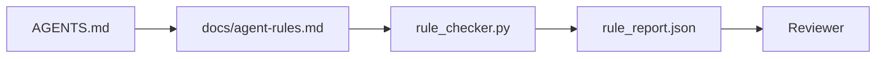

# Instrukcje agenta jako ograniczenia wykonywalne

> Instrukcje napisane prozą są życzeniami. Instrukcje napisane jako ograniczenia są testami. Workbench zamienia każdą regułę w coś, co agent może sprawdzić w czasie wykonywania, a recenzent może zweryfikować po fakcie.

**Typ:** Kompilacja
**Języki:** Python (stdlib)
**Wymagania wstępne:** Faza 14 · 32 (Minimalny stół warsztatowy)
**Czas:** ~50 minut

## Cele nauczania

- Oddziel prozę routingu od zasad operacyjnych.
- Wyraź zasady uruchamiania, zabronione działania, definicję wykonania, radzenie sobie z niepewnością i granice zatwierdzania jako ograniczenia sprawdzalne maszynowo.
- Zaimplementuj moduł sprawdzający reguły, który ocenia przebieg względem zestawu reguł.
- Spraw, aby zestaw reguł był przyjazny dla różnic, aby przegląd mógł zobaczyć, co się zmieniło.

## Problem

Typowy `AGENTS.md` brzmi jak dokumentacja wprowadzająca. Mówi agentowi, aby „był ostrożny”, „dokładnie przetestował” i „zapytał, jeśli nie jest pewien”. Trzy dni później agent wysyła zmianę bez testów, zapisuje do zabronionego katalogu i nigdy nie pyta, ponieważ nigdy nie wiedział, gdzie jest linia.

Instrukcje są skuteczne, gdy są praktyczne, i słabe, gdy mają aspiracje. Rozwiązaniem jest napisanie reguł, które środowisko robocze będzie mogło zinterpretować, a recenzent będzie mógł zdobyć punkty.

## Koncepcja

Reguły znajdują się w `docs/agent-rules.md`, z dala od krótkiego routera głównego. Każda reguła ma nazwę, kategorię i znacznik.



### Pięć kategorii obejmujących większość zasad

| Kategoria | Zadaj pytania zasadom odpowiedzi | Przykład |
|---------|---------------------------|---------|
| Uruchomienie | Co musi być prawdą przed rozpoczęciem pracy? | „plik stanu istnieje i jest świeży” |
| Zabronione | Co nigdy nie może się wydarzyć? | „nie edytuj `scripts/release.sh`” |
| Definicja skończonego | Co świadczy o wykonaniu zadania? | „pytest wychodzi 0 i linia akceptacji przechodzi” |
| Niepewność | Co robi agent, gdy nie jest pewien? | „otwórz notatkę z pytaniem zamiast zgadywać” |
| Zatwierdzenie | Co wymaga ludzkiej akceptacji? | „dowolna nowa zależność, dowolny zapis prod” |

Reguła, która nie pasuje do żadnej z tych pięciu, zwykle chce być dwiema regułami. Wymuś podział.

### Reguły można odczytać maszynowo

Każda reguła ma informację, kategorię, jednowierszowy opis i pole `check`, które określa nazwę funkcji w `rule_checker.py`. Dodanie reguły oznacza dodanie czeku; kontroler rośnie wraz ze stołem warsztatowym.

### Reguły są przyjazne dla różnic

Reguły obowiązują po jednej na nagłówek w jednym pliku przecen. Zmiany nazw są widoczne w różnicach. Nowe zasady znajdują się na szczycie swojej kategorii. Przestarzałe zasady są usuwane, a nie komentowane, ponieważ środowisko warsztatowe jest źródłem prawdy, a nie dziennik czatu pokazujący, jak zespół czuł się w ostatnim kwartale.

### Zasady a poręcze szkieletowe

Poręcze platformy (poręcze OpenAI Agents SDK, przerwania LangGraph) wymuszają reguły na poziomie środowiska wykonawczego. Zasadą określoną w tej lekcji jest czytelna dla człowieka i możliwa do sprawdzenia umowa, którą wdrażają te poręcze. Potrzebujesz obu: środowisko wykonawcze wychwytuje naruszenia podczas tury, zestaw reguł udowadnia, że ​​środowisko wykonawcze postępuje właściwie.

## Zbuduj to

`code/main.py` wysyła:

- `agent-rules.md` parser ładujący reguły do klasy danych.
- Funkcje sprawdzania stylu `rule_checker.py`, jedna na odwołanie `check`.
- Uruchomienie agenta demonstracyjnego, które narusza dwie zasady i przepustkę kontrolną, która je łapie.

Uruchom to:

```
python3 code/main.py
```

Dane wyjściowe: przeanalizowany zestaw reguł, uruchomienie śledzenia, wynik pozytywny/nieudany dla reguły oraz plik `rule_report.json` zapisany obok skryptu.

## Wzorce produkcji na wolności

Trzy wzorce oddzielają zestaw reguł trwający kwartał od takiego, który zanika w ciągu tygodnia.

**Oznaczanie ważności w czasie zapisu.** Każda reguła zawiera `severity`: `block`, `warn` lub `info`. Kontroler zgłasza wszystkie trzy; środowisko wykonawcze odmawia tylko `block`. Większość zespołów na początku przecenia dotkliwość, a następnie po cichu ją osłabia pod presją terminu; znakowanie w czasie zapisu wymusza kalibrację z góry. Sparuj z bramką weryfikacyjną (faza 14 · 38), która podpisuje wszelkie zastąpienia reguły `block` w dzienniku audytu `overrides.jsonl`.

**Wygaśnięcie reguły jako funkcja wymuszająca.** Każda reguła ma datę `expires_at` (domyślnie 90 dni od utworzenia). Moduł sprawdzający emituje ostrzeżenie, gdy niewygasła reguła nie miała żadnych naruszeń przez 60 kolejnych dni; następny kwartalny przegląd albo uzasadnia jego utrzymanie, osłabia go do `info`, albo go usuwa. Dane z produkcyjnego przeglądu kodu AI firmy Cloudflare (z kwietnia 2026 r., 131 246 przeglądów obejmujących 5169 repozytoriów w ciągu 30 dni) pokazały, że zestawy reguł z wyraźnym wygaśnięciem nie przekraczały 30 reguł na repo; zestawy bez wzrosły do ​​80+, a większość nigdy nie strzelała.

**Markdown-as-source, JSON-as-cache.** `agent-rules.md` to plik autorstwa; `agent-rules.lock.json` to pamięć podręczna, którą moduł sprawdzający odczytuje ze ścieżki aktywnej. Zamek jest regenerowany przez hak przed zatwierdzeniem. Różnice w Markdown można przeglądać; Analizowanie JSON pozostaje poza każdą turą. Taki sam kształt jak `package.json` / `package-lock.json` i `Cargo.toml` / `Cargo.lock`.

## Użyj tego

W produkcji:

- Claude Code, Codex, Cursor czytają zasady na początku sesji i cytują je, gdy odmawiają podjęcia działań. Kontroler ponownie uruchamia je w CI, aby wychwycić cichy dryf.
- Poręcze zabezpieczające SDK agentów OpenAI rejestrują te same kontrole, co poręcze wejściowe i wyjściowe. Przecena to powierzchnia dokumentu; SDK jest powierzchnią wykonawczą.
- LangGraph przerywa działanie, gdy węzeł w locie narusza regułę. Program obsługi przerwań czyta regułę, pyta człowieka i wznawia działanie.

Zestaw reguł jest przenośny dla wszystkich trzech, ponieważ składa się z przeceny plus nazwy funkcji.

## Wyślij to

`outputs/skill-rule-set-builder.md` przeprowadza wywiad z właścicielem projektu, klasyfikuje istniejące instrukcje dotyczące prozy w pięciu kategoriach i emituje wersjonowany `agent-rules.md` plus fragment sprawdzający.

## Ćwiczenia

1. Dodaj szóstą kategorię, jeśli Twój produkt naprawdę jej potrzebuje. Broń się dlaczego nie zapada się w jedną z pięciu.
2. Rozszerz moduł sprawdzający, aby reguła mogła mieć określoną ważność (`block`, `warn`, `info`), a raport został odpowiednio zagregowany.
3. Podłącz moduł sprawdzający do CI: kompilacja zakończy się niepowodzeniem, jeśli przy ostatnim uruchomieniu agenta nie powiedzie się reguła ważności bloku.
4. Dodaj pole „wygaśnięcie” dla każdej reguły. Po 90 dniach bez pozytywnego sprawdzenia reguła zostanie poddana sprawdzeniu.
5. Znajdź prawdziwy `AGENTS.md` i zapisz go jako reguły pięciu kategorii. Ile linii było czynnych? Ilu było aspirujących?

## Kluczowe terminy

| Termin | Co ludzie mówią | Co to właściwie oznacza |
|------|----------------|--------------------------------------|
| Zasada działania | „Prawdziwa instrukcja” | Reguła, którą środowisko robocze może sprawdzić w czasie wykonywania |
| Zasada aspiracji | „Bądź ostrożny” | Reguła bez kontroli; albo usuń, albo uaktualnij |
| Definicja skończonego | „Akceptacja” | Obiektywny, oparty na plikach dowód, że zadanie zostało ukończone |
| Dotkliwość bloku | „Twarda zasada” | Naruszenie powoduje zatrzymanie biegu; nie można wyciszyć bez operatora |
| Wygaśnięcie reguły | „Przestarzałe zasady” | Zasada, która nie zawiedzie w ciągu N dni, zostanie wycofana |

## Dalsze czytanie

- [Poręcze zabezpieczające OpenAI Agents SDK](https://platform.openai.com/docs/guides/agents-sdk/guardrails)
- [Przerwania LangGraph](https://langchain-ai.github.io/langgraph/how-tos/human_in_the_loop/breakpoints/)
– [Anthropic, budowanie skutecznych agentów](https://www.anthropic.com/research/building-efektywne-agents)
- [Rick Hightower, Agent RuleZ: A Deterministic Policy Engine](https://medium.com/@richardhightower/agent-rulez-a-deterministic-policy-engine-for-ai-coding-agents-9489e0561edf) — poziom ważności blokowania/ostrzegania/informacji w środowisku produkcyjnym
— [Cloudflare, Orkiestrowanie przeglądu kodu AI na dużą skalę](https://blog.cloudflare.com/ai-code-review/) — 131 tys. przebiegów recenzji, lekcje dotyczące tworzenia reguł
- [microservices.io, platforma programistyczna GenAI — część 1: poręcze](https://microservices.io/post/architecture/2026/03/09/genai-development-platform-part-1-development-guardrails.html) — dogłębna obrona między regułami a CI
— [Zgodność sprawdzona typu: Deterministyczne poręcze (arXiv 2604.01483)](https://arxiv.org/pdf/2604.01483) — Lean 4 jako górna granica reguły podczas sprawdzania
- [logi-cmd/agent-guardrails](https://github.com/logi-cmd/agent-guardrails) — implementacja merge-gate: zakres, testowanie mutacji, budżety naruszeń
- Faza 14 · 32 — minimalny warsztat, do którego trafia ten zestaw zasad
- Faza 14 · 38 — bramka weryfikacyjna zużywająca raport reguły
- Faza 14 · 39 — agent recenzent, który ocenia zgodność z regułami