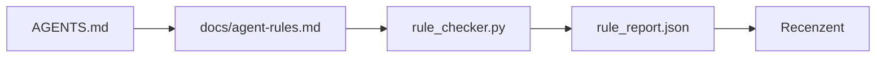

# Instrukcje agenta jako ograniczenia wykonywalne

> Instrukcje napisane prozą to pobożne życzenia. Instrukcje sformułowane jako ograniczenia to testy. Środowisko pracy (workbench) zamienia każdą regułę w warunek, który agent może sprawdzić w czasie wykonywania, a recenzent zweryfikować po zakończeniu zadania.

**Typ:** Budowa (Build)  
**Języki:** Python (biblioteka standardowa)  
**Wymagania wstępne:** Faza 14 · 32 (Minimalne środowisko pracy)  
**Czas:** ~50 minut  

## Cele nauczania

- Oddzielenie opisowych instrukcji od reguł operacyjnych.
- Zdefiniowanie reguł rozruchu, działań zabronionych, kryteriów zakończenia prac, obsługi niepewności oraz granic zatwierdzania jako ograniczeń sprawdzalnych maszynowo.
- Zaimplementowanie modułu sprawdzającego reguły (rule checker), który ocenia przebieg pracy pod kątem zdefiniowanego zestawu reguł.
- Stworzenie struktury reguł przyjaznej dla systemu kontroli wersji (git-friendly), aby w procesie recenzji (code review) zmiany były czytelne.

## Problem

Typowy plik `AGENTS.md` przypomina dokumentację wdrożeniową dla nowego pracownika. Nakazuje agentowi „zachować ostrożność”, „dokładnie przetestować kod” i „pytać w razie wątpliwości”. Kilka dni później agent wysyła zmiany bez uruchomienia testów, zapisuje dane do zabronionego katalogu i nie zadaje pytań, ponieważ nie wiedział, gdzie przebiega granica dozwolonych działań.

Instrukcje są skuteczne, gdy są wykonalne, i bezużyteczne, gdy są jedynie deklaratywne. Rozwiązaniem jest napisanie reguł, które środowisko pracy potrafi zinterpretować, a recenzent zweryfikować.

## Koncept

Reguły znajdują się w pliku `docs/agent-rules.md`, z dala od krótkiego, głównego routera. Każda reguła posiada nazwę, kategorię oraz unikalny identyfikator (tag).



### Pięć kategorii obejmujących większość reguł

| Kategoria | Pytania, na które odpowiada reguła | Przykład |
| :--- | :--- | :--- |
| Rozruch (Startup) | Co musi być prawdą przed rozpoczęciem pracy? | „plik stanu istnieje i jest aktualny” |
| Zabronione (Forbidden) | Co nigdy nie może się wydarzyć? | „nie edytuj `scripts/release.sh`” |
| Definicja zakończenia (Done) | Co stanowi dowód wykonania zadania? | „pytest kończy się kodem 0 i testy akceptacyjne przechodzą” |
| Niepewność (Unsure) | Co robi agent, gdy ma wątpliwości? | „utwórz notatkę z pytaniem zamiast zgadywać” |
| Zatwierdzenie (Approval) | Co wymaga akceptacji człowieka? | „każda nowa zależność, każdy zapis na produkcji” |

Reguła, która nie pasuje do żadnej z tych pięciu kategorii, najczęściej powinna zostać podzielona na dwie osobne reguły.

### Reguły czytelne dla maszyn

Każda reguła posiada swoją kategorię, krótki opis oraz pole `check` wskazujące nazwę powiązanej funkcji w skrypcie `rule_checker.py`. Dodanie nowej reguły sprowadza się do dopisania odpowiedniego testu – moduł sprawdzający rozwija się wraz ze środowiskiem pracy.

### Reguły przyjazne dla systemu kontroli wersji (git-friendly)

Każda reguła jest opisana pod osobnym nagłówkiem w pliku Markdown. Dzięki temu zmiany w konfiguracji są przejrzyste w historii gita (diff). Nowe zasady dodawane są na górze danej kategorii. Reguły przestarzałe są usuwane, a nie komentowane – plik konfiguracyjny jest jedynym źródłem prawdy, a nie pamiętnikiem historycznym zespołu.

### Reguły a barierki ochronne (guardrails) platformy

Barierki platformy (np. OpenAI Agents SDK, hooki w LangGraph) wymuszają zasady w czasie rzeczywistym. Reguły zdefiniowane w tej lekcji to czytelny dla człowieka kontrakt, który te barierki realizują. Potrzebujesz obu tych elementów: barierki wyłapują naruszenia w locie, a raport reguł potwierdza, że cały system działa prawidłowo.

## Wdrożenie (Zbuduj to)

Skrypt `code/main.py` generuje:

- Parser pliku `agent-rules.md` ładujący reguły do obiektów dataclass.
- Funkcje walidacyjne w `rule_checker.py`, powiązane z kluczami `check` w regułach.
- Przykładowe uruchomienie agenta, które narusza dwie reguły, oraz moduł sprawdzający, który te naruszenia wykrywa.

Uruchomienie:

```
python3 code/main.py
```

Wynik działania: przeanalizowany zestaw reguł, logi z przebiegu walidacji, statusy (pass/fail) dla poszczególnych reguł oraz plik raportu `rule_report.json` zapisany w tym samym katalogu.

## Wzorce produkcyjne w praktyce

Trzy wzorce odróżniają trwałe reguły produkcyjne od tych, które stają się bezużyteczne po pierwszym tygodniu:

**Definiowanie poziomu ważności (severity) przy tworzeniu reguły.** Każda reguła powinna mieć określony stopień: `block`, `warn` lub `info`. Moduł sprawdzający raportuje wszystkie trzy, ale pętla agenta blokuje wykonanie zadania tylko przy statusie `block`. Zespoły mają tendencję do ustawiania zbyt wielu blokad na starcie, a następnie cichego ich wyłączania pod presją czasu. Określenie ważności wymusza racjonalną ocenę zasad od samego początku. Warto połączyć to z bramką weryfikacyjną (faza 14 · 38), która wymaga zapisania każdego obejścia reguły typu `block` w pliku logów `overrides.jsonl`.

**Daty wygaśnięcia reguł (expiry dates) jako mechanizm porządkujący.** Każda reguła ma zdefiniowaną datę wygaśnięcia `expires_at` (np. domyślnie 90 dni od utworzenia). Moduł sprawdzający ostrzega, jeśli aktywna reguła nie wykryła żadnego naruszenia przez 60 kolejnych dni. Podczas kwartalnego przeglądu należy podjąć decyzję o jej przedłużeniu, obniżeniu priorytetu do `info` lub całkowitym usunięciu. Dane z analizy narzędzia AI Code Review w Cloudflare (kwiecień 2026, 131 246 weryfikacji w 5169 repozytoriach) wykazały, że projekty stosujące mechanizm wygaszania utrzymywały średnio do 30 reguł na repozytorium; w pozostałych liczba ta rosła powyżej 80, z czego większość nigdy nie była wywoływana.

**Markdown jako źródło (source), JSON jako pamięć podręczna (lockfile).** Plik `agent-rules.md` służy do edycji przez człowieka, natomiast `agent-rules.lock.json` to zoptymalizowana pamięć podręczna odczytywana przez parser podczas uruchomienia agenta. Plik lockfile jest automatycznie regenerowany za pomocą skryptu pre-commit. Dzięki temu w historii zmian gita widać czytelny Markdown, a parser nie traci czasu na przetwarzanie tekstu przy każdej turze pracy agenta. Działa to analogicznie do plików `package.json` / `package-lock.json` czy `Cargo.toml` / `Cargo.lock`.

## Zastosowanie (Użyj tego)

W środowisku produkcyjnym:

- Claude Code, Cursor czy narzędzia OpenAI odczytują reguły na początku sesji i powołują się na nie w przypadku odmowy wykonania akcji. Skrypty sprawdzające są uruchamiane w procesach CI (Continuous Integration), aby zapobiec cichemu dryfowi reguł.
- Barierki ochronne (guardrails) w OpenAI Agents SDK realizują te same testy na wejściu i wyjściu modelu. Plik Markdown to definicja kontraktu, a SDK to warstwa wykonawcza.
- LangGraph przerywa wykonywanie grafu zadań, gdy napotka naruszenie reguły. Handler błędu odczytuje regułę, pyta użytkownika o decyzję i wznawia lub zatrzymuje proces.

Wspólna struktura oparta na pliku Markdown oraz nazwach funkcji walidacyjnych sprawia, że reguły są łatwo przenaszalne między różnymi frameworkami.

## Wdrożenie (Wyślij to)

Skrypt `outputs/skill-rule-set-builder.md` przeprowadza krótki wywiad dotyczący projektu, kategoryzuje dotychczasowe opisowe instrukcje i generuje zwersjonowany plik `agent-rules.md` wraz z szablonem skryptu walidacyjnego.

## Ćwiczenia

1. Dodaj szóstą kategorię reguł, jeśli Twój projekt tego wymaga. Uzasadnij, dlaczego nie można jej przyporządkować do żadnej z pięciu podstawowych grup.
2. Rozbuduj moduł sprawdzający, aby obsługiwał poziomy ważności (`block`, `warn`, `info`) i odpowiednio grupował je w raporcie końcowym.
3. Podłącz skrypt sprawdzający do systemu CI: proces budowania powinien zakończyć się błędem, jeśli ostatnie uruchomienie agenta naruszyło regułę o statusie `block`.
4. Dodaj do reguł parametr wygaśnięcia. Sprawdzaj, czy reguły, które nie wykryły żadnych błędów przez 90 dni, są nadal potrzebne.
5. Weź dowolny plik `AGENTS.md` i przepisz go na reguły podzielone na pięć kategorii. Ile z nich było rzeczywistymi regułami technicznymi, a ile jedynie ogólnikami?

## Kluczowe terminy

| Termin | Potoczna nazwa | Rzeczywiste znaczenie |
| :--- | :--- | :--- |
| Reguła operacyjna | „Prawdziwa instrukcja” | Reguła, którą środowisko wykonawcze potrafi automatycznie zweryfikować |
| Reguła deklaratywna | „Bądź ostrożny” | Instrukcja bez automatycznego testu – należy ją usunąć lub zaimplementować dla niej test |
| Definicja ukończenia | „Kryteria akceptacji” | Obiektywny, oparty na plikach dowód na to, że zadanie zostało w pełni zrealizowane |
| Blokada (Blocker) | „Twarda zasada” | Naruszenie reguły wstrzymuje pracę agenta; wymaga interwencji operatora |
| Wygasanie reguł | „Przestarzałe zasady” | Automatyczne usuwanie lub przegląd reguł, które nie zostały wywołane przez określony czas |

## Dalsza lektura

- [Barierki ochronne w OpenAI Agents SDK](https://platform.openai.com/docs/guides/agents-sdk/guardrails)
- [LangGraph: Human-in-the-loop and Breakpoints](https://langchain-ai.github.io/langgraph/how-tos/human_in_the_loop/breakpoints/)
- [Anthropic: Building Effective Agents](https://www.anthropic.com/research/building-effective-agents)
- [Rick Hightower: Agent RuleZ – A Deterministic Policy Engine](https://medium.com/@richardhightower/agent-rulez-a-deterministic-policy-engine-for-ai-coding-agents-9489e0561edf)
- [Cloudflare: Orchestrating AI Code Review at Scale](https://blog.cloudflare.com/ai-code-review/)
- [GenAI Development Platform – Part 1: Guardrails](https://microservices.io/post/architecture/2026/03/09/genai-development-platform-part-1-development-guardrails.html)
- [Type-Checked Compliance: Deterministic Guardrails (arXiv 2604.01483)](https://arxiv.org/pdf/2604.01483)
- [Biblioteka agent-guardrails w GitHubie](https://github.com/logi-cmd/agent-guardrails)
- Faza 14 · 32 – minimalne środowisko pracy, w którym stosowany jest ten zestaw reguł.
- Faza 14 · 38 – bramka weryfikacyjna wykorzystująca raport z walidacji reguł.
- Faza 14 · 39 – agent recenzujący oceniający zgodność z regułami.
