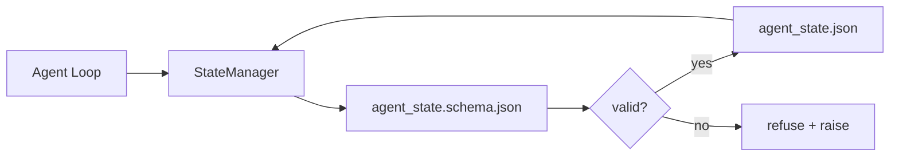

# Pamięć Repo i trwały stan

> Historia czatów jest zmienna. Repozytorium jest trwałe. Workbench przechowuje stan agenta w plikach z wersjonowaniem, więc następna sesja, następny agent i następny recenzent czytają z tego samego źródła prawdy.

**Typ:** Kompilacja
**Języki:** Python (stdlib + `jsonschema` opcjonalnie)
**Wymagania wstępne:** Faza 14 · 32 (Minimalny stół warsztatowy)
**Czas:** ~60 minut

## Cele nauczania

- Zdefiniuj, co należy do pamięci repo, a co do historii czatów.
- Autor schematów JSON dla `agent_state.json` i `task_board.json`.
- Zbuduj menedżera stanu, który ładuje, sprawdza poprawność, mutuje i utrzymuje stan atomowo.
- Użyj schematu, aby odmówić złych zapisów, zanim uszkodzą środowisko robocze.

## Problem

Agent kończy sesję. Czat zostanie zamknięty. Otwiera się następna sesja i pojawia się pytanie, od czego zacząć. Model mówi „pozwól mi sprawdzić pliki”, czyta nieaktualne notatki i ponownie wykonuje już ukończoną pracę. Albo, co gorsza, przepisuje gotowy plik, ponieważ nikt mu nie powiedział, że plik został ukończony.

Poprawka środowiska roboczego to pamięć repo: stan znajduje się w plikach JSON w repozytorium, zapisanych według schematu, utrwalonych atomowo, przyjaznych różnicom podczas przeglądania kodu. Czat to kanał przejściowy; repo to system zapisu.

## Koncepcja



### Co należy do pamięci repo

| Należy | Nie należy |
|--------|--------------------------------|
| Identyfikator aktywnego zadania | Surowe transkrypcje czatów |
| Dotknięto plików w tej sesji | Ślady rozumowania na poziomie tokena |
| Założenia przyjęte przez agenta | „Użytkownik wydawał się sfrustrowany” |
| Otwórz blokady | Próbki ukończeń |
| Następna akcja | Identyfikatory modeli specyficzne dla dostawcy |

Testem jest trwałość: czy przydałoby się to za trzy miesiące w ponownym uruchomieniu CI? Jeśli tak, repo. Jeśli nie, telemetria.

### Stan pierwszego schematu

Schemat JSON jest kontraktem. Bez tego każdy agent wymyśla nowe pola, każdy recenzent uczy się nowego kształtu, a każdy skrypt CI musi specjalnie uwzględniać poprzednie wersje. Dzięki temu zły zapis jest zapisem odrzuconym.

Schemat obejmuje:

- Wymagane klucze.
- Dozwolone wartości `status`.
- Zabronione wartości (np. `null` dla tablic).
- Ograniczenia wzorca (identyfikatory zadań odpowiadają `T-\d{3,}`).
- Pole wersji dla migracji.

### Atomic pisze

Zapisy stanu muszą przetrwać częściowe awarie: zapisz do pliku tymczasowego, fsync, zmień nazwę na obiekt docelowy. Akta stanu są źródłem prawdy; napisany w połowie jest gorszy niż żaden plik.

### Migracje

Gdy schemat się zmieni, wyślij skrypt migracji obok zmiany schematu. Plik stanu zawiera pole `schema_version`; menedżer odmawia załadowania pliku z wersji, której nie może migrować.

## Zbuduj to

`code/main.py` implementuje:

- `agent_state.schema.json` i `task_board.schema.json`.
- Walidator tylko stdlib (podzbiór schematu JSON: wymagany, typ, wyliczenie, wzorzec, elementy).
- `StateManager.load`, `StateManager.update`, `StateManager.commit` z atomowymi zapisami tymczasowymi i zmianą nazwy.
- Demo, które zmienia stan, utrzymuje się, ładuje ponownie i potwierdza działanie w obie strony.

Uruchom to:

```
python3 code/main.py
```

Skrypt zapisuje `workdir/agent_state.json` i `workdir/task_board.json`, mutuje je w dwóch turach i wypisuje zatwierdzony stan w każdym kroku.

## Wzorce produkcji na wolności

Cztery wzorce zamieniają minimum lekcji w coś, co może przetrwać wieloagentowe repozytorium mono.

**Atomowa zmiana nazwy i tempa nie jest opcjonalna.** Raport o błędach projektu Hive z marca 2026 r. jasno dokumentuje tryb awarii: `state.json` został napisany za pośrednictwem `write_text()`, a wyjątki zostały przechwycone i wyciszone. Częściowe zapisywanie pozostawionych sesji wznawiane w przypadku uszkodzonego stanu i braku sygnału. Rozwiązaniem jest zawsze: `tempfile.mkstemp` w tym samym katalogu co cel, napisz, `fsync`, `os.replace` (atomowa zmiana nazwy w POSIX i Windows). `atomic_write` z tej lekcji robi dokładnie to samo.

**Klucze idempotentne przy każdym wywołaniu narzędzia, które nie jest idempotentne.** Jeśli agent ulegnie awarii po wywołaniu narzędzia, ale przed sprawdzeniem wyniku, funkcja odzyskiwania ponawia próbę wywołania narzędzia. Bezpieczny dla odczytów; niebezpieczne dla e-maili, wstawek DB i przesyłanych plików. Wzór: loguj każdy identyfikator wywołania narzędzia przed wykonaniem do `pending_calls.jsonl`. Przy ponownej próbie sprawdź identyfikator; jeśli jest obecny, pomiń połączenie i użyj wyniku z pamięci podręcznej. Zarówno Anthropic, jak i LangChain wzywają do tego w wytycznych na 2026 r.; Wskaźnik kontrolny LangGraph utrzymuje oczekujące zapisy z tego samego powodu.

**Oddziel duże artefakty od stanu.** Nie przechowuj plików CSV, długich transkrypcji ani wygenerowanych plików w `agent_state.json`. Zapisz artefakt jako osobny plik (lub prześlij do magazynu obiektów) i zachowaj tylko stan ścieżki. Punkty kontrolne pozostają małe i szybkie; artefakty rosną niezależnie.

**Źródło zdarzeń do celów audytu, migawki do wznowienia.** Dołącz do dziennika zdarzeń (`state.events.jsonl`) w przypadku każdej mutacji; okresowo zrzut ekranu do `state.json`. Wznów odczytuje migawkę, a następnie odtwarza wszystkie zdarzenia po sygnaturze czasowej migawki. Kosztuje to więcej dysku, ale umożliwia dosłowne odtworzenie decyzji agenta – co jest niezbędne podczas debugowania długoterminowych uruchomień. Ten sam kształt, którego Postgres używa wewnętrznie dla WAL.

**Migracja schematu lub odmowa załadowania.** Liczba całkowita `schema_version` jest kontraktem. Gdy menedżer ładuje plik w nieznanej wersji, odmawia on odczytania. Wyślij skrypt migracji obok zmiany schematu; `tools/migrate_state.py` działa idempotentnie przy każdym uruchomieniu.

## Użyj tego

W produkcji:

- **Punkty kontrolne LangGraph.** Ten sam pomysł, inne przechowywanie. Wskaźnik kontrolny utrzymuje stan wykresu w SQLite, Postgres lub niestandardowym backendie. Schemat, którego uczy ta lekcja, dotyczy tego, po co sięgasz, gdy wskaźnik kontrolny umrze i musisz ręcznie odczytać stan.
- **Bloki pamięci Letta.** Trwałe bloki ze schematami strukturalnymi (faza 14 · 08). Ta sama dyscyplina skierowana do osób o długim stażu.
- **Magazyn sesji pakietu SDK dla agentów OpenAI.** Wtykowe backendy, obsługujące schematy. Plik stanu przedstawiony w tej lekcji jest plikiem lokalnym.

## Wyślij to

`outputs/skill-state-schema.md` generuje specyficzną dla projektu parę schematów JSON (stan + tablica), Python `StateManager` podłączony do zapisów atomowych oraz szkielet migracji, dzięki czemu następna zmiana schematu nie zakłóca środowiska roboczego.

## Ćwiczenia

1. Dodaj znacznik czasu `last_human_touch`. Odmów jakiemukolwiek agentowi pisania w ciągu pięciu sekund od edycji dokonanej przez człowieka.
2. Rozszerz walidator o obsługę `oneOf`, tak aby zadanie mogło być zadaniem kompilacji lub zadaniem przeglądu z różnymi wymaganymi polami.
3. Dodaj pole `schema_version` i zapisz migrację z wersji 1 do wersji 2 (zmień nazwę `blockers` na `risks`).
4. Przenieś zaplecze pamięci masowej z pliku lokalnego do SQLite. Zachowaj identyczność interfejsu API `StateManager`.
5. Uruchom dwóch agentów na tym samym pliku stanu z wyścigiem zapisu wynoszącym 50 ms. Co idzie nie tak i w jaki sposób atomowa zmiana nazwy Cię uratuje?

## Kluczowe terminy

| Termin | Co ludzie mówią | Co to właściwie oznacza |
|------|----------------|--------------------------------------|
| Pamięć repozytorium | „Plik notatek” | Stan przechowywany w śledzonych plikach w repozytorium, w schemacie |
| Najpierw schemat | „Sprawdź dane wejściowe” | Zdefiniuj umowę przed pisarzem, odmów driftu |
| Zapis atomowy | „Po prostu zmień nazwę” | Zapisz do temp, fsync, zmień nazwę, aby częściowe awarie nie mogły uszkodzić |
| Migracja | „Błąd schematu” | Skrypt zamieniający stan vN na stan v(N+1) |
| System zapisu | „Źródło prawdy” | Artefakt, który stół warsztatowy traktuje jako wiarygodny |

## Dalsze czytanie

- [Specyfikacja schematu JSON](https://json-schema.org/specification.html)
- [Punkty kontrolne LangGraph](https://langchain-ai.github.io/langgraph/concepts/persistence/)
- [Bloki pamięci Letty](https://docs.letta.com/concepts/memory)
- [Fast.io, Punkt kontrolny stanu agenta AI: praktyczny przewodnik](https://fast.io/resources/ai-agent-state-checkpointing/) — punkt kontrolny oparty na schemacie z idempotencją
- [Fast.io, Trwałość stanu przepływu pracy agenta AI: najlepsze praktyki 2026](https://fast.io/resources/ai-agent-workflow-state-persistence/) — kontrola współbieżności, TTL, pozyskiwanie zdarzeń
- [Hive Issue #6263 — nieatomowy stan.json zapisuje po cichu ignorowany](https://github.com/aden-hive/hive/issues/6263) — tryb awarii w prawdziwym projekcie
- [eunomia, Checkpoint/Restore Systems: Evolution, Techniques, Applications](https://eunomia.dev/blog/2025/05/11/checkpointrestore-systems-evolution-techniques-and-applications-in-ai-agents/) — Prymitywy CR z historii systemu operacyjnego zastosowane do agentów
– [Ind, 7 strategii trwałości stanu dla długoterminowych agentów AI w 2026 r.](https://www.indium.tech/blog/7-state-persistence-strategies-ai-agents-2026/)
- [Microsoft Agent Framework, kompaktowanie](https://learn.microsoft.com/en-us/agent-framework/agents/conversations/compaction) — menedżer punktów kontrolnych dostawcy
- Faza 14 · 08 – bloki pamięci i obliczanie czasu uśpienia
- Faza 14 · 32 — minimum trzech plików, jakie schematycznie przedstawia ta lekcja
- Faza 14 · 40 – pakiety przekazania odczytywane z tego samego schematu