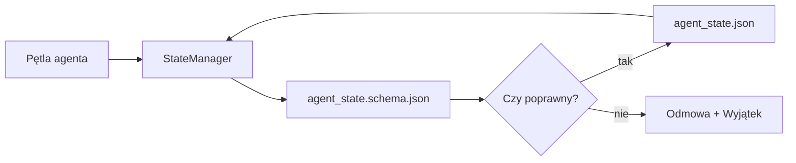

# Pamięć repozytorium (Repo Memory) i trwały stan

> Historia czatu jest ulotna. Repozytorium jest trwałe. Środowisko pracy (workbench) przechowuje stan agenta w wersjonowanych plikach, dzięki czemu kolejna sesja, inny agent oraz recenzent korzystają z tego samego, stabilnego źródła prawdy.

**Typ:** Budowa (Build)  
**Języki:** Python (biblioteka standardowa + opcjonalnie `jsonschema`)  
**Wymagania wstępne:** Faza 14 · 32 (Minimalne środowisko pracy)  
**Czas:** ~60 minut  

## Cele nauczania

- Zrozumienie, które informacje powinny trafiać do pamięci repozytorium, a które do historii czatu.
- Opracowanie schematów JSON dla plików `agent_state.json` oraz `task_board.json`.
- Zbudowanie menedżera stanu (StateManager), który pobiera, waliduje, modyfikuje i zapisuje stan w sposób atomowy.
- Wykorzystanie schematów do odrzucania błędnych zapisów, zanim uszkodzą one środowisko pracy.

## Problem

Agent kończy sesję i czat zostaje zamknięty. Po uruchomieniu kolejnej sesji pojawia się pytanie: od czego zacząć? Model decyduje: „muszę sprawdzić pliki”, po czym odczytuje nieaktualne notatki i powtarza zadania, które zostały już ukończone. W najgorszym przypadku nadpisuje gotowy plik, ponieważ nie otrzymał informacji, że praca nad nim dobiegła końca.

Rozwiązaniem jest pamięć repozytorium: stan jest przechowywany w plikach JSON wewnątrz repozytorium, walidowany za pomocą schematu, zapisywany atomowo i czytelny dla systemu kontroli wersji (git-friendly). Czat to jedynie kanał tymczasowy (ephemeral), natomiast repozytorium to główny system zapisu (System of Record).

## Koncept



### Co powinno trafiać do pamięci repozytorium

| Powinno trafiać | Nie powinno trafiać |
| :--- | :--- |
| Identyfikator aktywnego zadania | Surowe transkrypcje czatu |
| Pliki zmodyfikowane w bieżącej sesji | Szczegółowe logi rozumowania (chain-of-thought) |
| Założenia przyjęte przez agenta | Informacje typu „Użytkownik wydawał się sfrustrowany” |
| Aktywne blokady (blockers) | Przykładowe warianty odpowiedzi modelu |
| Następna akcja do wykonania | Identyfikatory modeli specyficzne dla dostawców chmurowych |

Kluczowym testem jest trwałość: czy dana informacja będzie przydatna za trzy miesiące podczas ponownego uruchomienia procesu w systemie CI? Jeśli tak – powinna trafić do repozytorium. Jeśli nie – należy zapisać ją w telemetrii.

### Projektowanie oparte na schemacie (Schema-First)

Schemat JSON to kontrakt. Bez niego każdy agent tworzy własne, niestandardowe pola, recenzent musi za każdym razem uczyć się nowej struktury pliku, a skrypty CI wymagają ciągłego dostosowywania do starszych wersji. Dzięki schematowi każdy niepoprawny zapis jest natychmiast odrzucany.

Schemat definiuje:

- Wymagane klucze.
- Dozwolone wartości pola `status`.
- Wartości niedozwolone (np. wartość `null` w tablicach).
- Ograniczenia formatu danych (np. identyfikatory zadań pasujące do wzorca `T-\d{3,}`).
- Pole wersji (`schema_version`) na potrzeby przyszłych migracji.

### Zapisy atomowe (Atomic Writes)

Zapisywanie stanu musi być odporne na nagłe przerwanie procesu. Standardowa procedura to: zapis do pliku tymczasowego, synchronizacja na dysk (`fsync`) oraz zmiana nazwy na plik docelowy. Plik stanu to jedyne źródło prawdy – plik zapisany tylko w połowie jest gorszy niż brak pliku.

### Migracje

Gdy schemat ulega zmianie, należy wraz z nim wdrożyć skrypt migracyjny. Plik stanu zawiera pole `schema_version`. Menedżer stanu odmawia wczytania pliku z wersją, której nie potrafi automatycznie zmigrować.

## Wdrożenie (Zbuduj to)

Skrypt `code/main.py` implementuje:

- Szablony `agent_state.schema.json` oraz `task_board.schema.json`.
- Walidator oparty wyłącznie na bibliotece standardowej Pythona (obsługujący reguły: `required`, `type`, `enum`, `pattern`, `items`).
- Metody `StateManager.load`, `StateManager.update` oraz `StateManager.commit` wykonujące atomowy zapis do pliku tymczasowego i zmianę nazwy.
- Test demonstracyjny, który modyfikuje stan, zapisuje go, wczytuje ponownie i potwierdza spójność danych.

Uruchomienie:

```
python3 code/main.py
```

Skrypt utworzy pliki `workdir/agent_state.json` oraz `workdir/task_board.json`, zmodyfikuje je w dwóch kolejnych turach i wyświetli zapisany stan po każdym kroku.

## Wzorce produkcyjne w praktyce

Cztery wzorce pozwalają przekształcić to minimalne rozwiązanie w system gotowy na obsługę monorepozytorium z wieloma agentami:

**Atomowy zapis i synchronizacja dyskowa (fsync) są obowiązkowe.** Logi błędów projektu Hive z marca 2026 roku opisują powszechny problem: plik `state.json` był zapisywany za pomocą standardowej metody `write_text()`, a ewentualne wyjątki były wyciszane. Powodowało to powstawanie plików obciętych w połowie, na bazie których kolejne sesje agenta próbowały pracować bez żadnego ostrzeżenia. Rozwiązanie to zawsze: utworzenie pliku tymczasowego za pomocą `tempfile.mkstemp` w tym samym katalogu co plik docelowy, zapis danych, wywołanie `fsync` i zamiana plików za pomocą `os.replace` (operacja atomowa zarówno w POSIX, jak i w Windows). Klasa `StateManager` w tej lekcji realizuje dokładnie ten schemat.

**Klucze idempotencji dla operacji nieidempotentnych.** Jeśli agent ulegnie awarii po uruchomieniu narzędzia, ale przed zapisaniem jego wyniku, mechanizm restartu ponowi to wywołanie. Jest to bezpieczne dla operacji odczytu, ale niedopuszczalne w przypadku wysyłania wiadomości e-mail, modyfikacji produkcyjnych baz danych czy transferu plików. Wzorzec: zapisuj identyfikator każdego uruchomienia narzędzia do pliku `pending_calls.jsonl` przed jego wykonaniem. Przy ponownej próbie sprawdź ten plik – jeśli identyfikator istnieje, pomiń wywołanie i zwróć zapamiętany wynik. Rozwiązanie to jest zalecane w wytycznych firm Anthropic oraz LangChain; mechanizmy checkpointingu w LangGraph stosują tę metodę z tego samego powodu.

**Wydzielenie dużych artefaktów ze stanu.** Nie przechowuj plików CSV, długich logów rozmów ani wygenerowanych plików bezpośrednio w `agent_state.json`. Zapisz te artefakty jako osobne pliki (lub prześlij do magazynu obiektów), a w pliku stanu zachowaj jedynie ścieżki do nich. Dzięki temu punkty kontrolne (checkpoints) pozostają małe i szybko się zapisują, a dane rosną niezależnie.

**Event Sourcing dla celów audytowych, migawki (snapshots) do szybkiego wznawiania.** Zapisuj każdą zmianę stanu jako zdarzenie w logu (`state.events.jsonl`), a okresowo generuj pełny zrzut stanu do `state.json`. Proces wznawiania wczytuje ostatnią migawkę, a następnie aplikuje zdarzenia, które nastąpiły po niej. Zwiększa to zużycie dysku, ale pozwala na dokładne odtworzenie ścieżki decyzyjnej agenta, co jest kluczowe przy debugowaniu długo trwających zadań (analogicznie do mechanizmu Write-Ahead Logging w bazie PostgreSQL).

**Migracja schematu lub blokada odczytu.** Parametr `schema_version` określa wersję kontraktu. Jeśli menedżer napotka nieznaną wersję pliku, odmawia jego przetworzenia. Skrypt migracyjny (np. `tools/migrate_state.py`) powinien być uruchamiany w sposób idempotentny przy każdym wdrożeniu nowej wersji kodu.

## Zastosowanie (Użyj tego)

W środowisku produkcyjnym:

- **Checkpointy w LangGraph:** Realizują tę samą koncepcję, korzystając z SQLite, PostgreSQL lub dedykowanych baz danych. Schemat omawiany w tej lekcji jest przydatny, gdy baza danych ulegnie awarii i musisz ręcznie przeanalizować lub zmodyfikować stan z poziomu systemu plików.
- **Bloki pamięci Letta (Letta Memory Blocks):** Trwała pamięć o ustrukturyzowanym schemacie (faza 14 · 08) przeznaczona dla agentów działających długoterminowo.
- **Magazyn sesji w OpenAI Agents SDK:** Rozwiązania chmurowe i lokalne oparte na schematach walidacyjnych.

## Wdrożenie (Wyślij to)

Skrypt `outputs/skill-state-schema.md` generuje dostosowaną do projektu parę schematów JSON (dla stanu i tablicy zadań), klasę `StateManager` w Pythonie obsługującą zapisy atomowe oraz szablon skryptu migracji, zabezpieczający środowisko pracy przed uszkodzeniem przy kolejnych zmianach struktury danych.

## Ćwiczenia

1. Dodaj pole `last_human_touch`. Zablokuj możliwość zapisu stanu przez agenta, jeśli od ostatniej modyfikacji dokonanej przez człowieka minęło mniej niż 5 sekund.
2. Rozbuduj walidator o obsługę słowa kluczowego `oneOf`, aby zadanie w tablicy mogło być zdefiniowane albo jako zadanie programistyczne (build), albo jako zadanie recenzji (review), różniąc się wymaganymi polami.
3. Dodaj obsługę wersji i napisz skrypt migracyjny przenoszący strukturę z wersji 1 do wersji 2 (zmieniając klucz `blockers` na `risks`).
4. Przenieś przechowywanie stanu z lokalnego pliku JSON do bazy SQLite, zachowując bez zmian publiczne interfejsy API klasy `StateManager`.
5. Uruchom jednocześnie dwóch agentów pracujących na tym samym pliku stanu, wprowadzając opóźnienie zapisu na poziomie 50 ms (race condition). Zaobserwuj błędy i przeanalizuj, w jaki sposób mechanizm atomowej zmiany nazwy chroni przed uszkodzeniem danych.

## Kluczowe terminy

| Termin | Potoczna nazwa | Rzeczywiste znaczenie |
| :--- | :--- | :--- |
| Pamięć repozytorium | „Plik notatek” | Stan zapisywany w wersjonowanych plikach wewnątrz repozytorium, walidowany schematem |
| Projektowanie ze schematem | „Walidacja wejścia” | Definiowanie kontraktu danych przed uruchomieniem kodu w celu uniknięcia niespójności |
| Zapis atomowy | „Zapis tymczasowy i zmiana nazwy” | Bezpieczna sekwencja zapisu (temp, fsync, rename) chroniąca przed uszkodzeniem pliku stanu |
| Migracja stanu | „Uaktualnienie wersji” | Skrypt modyfikujący plik stanu z wersji vN do wersji v(N+1) |
| System zapisu | „Źródło prawdy” | Nadrzędny plik lub baza danych, z której środowisko pracy odczytuje stan po restarcie |

## Dalsza lektura

- [Specyfikacja schematu JSON](https://json-schema.org/specification.html)
- [Koncepcja persistence w LangGraph](https://langchain-ai.github.io/langgraph/concepts/persistence/)
- [Dokumentacja pamięci w Letta](https://docs.letta.com/concepts/memory)
- [Fast.io: AI Agent State Checkpointing](https://fast.io/resources/ai-agent-state-checkpointing/)
- [Fast.io: AI Agent Workflow State Persistence](https://fast.io/resources/ai-agent-workflow-state-persistence/)
- [Hive Issue #6263: Non-atomic state.json writes](https://github.com/aden-hive/hive/issues/6263)
- [Eunomia: Checkpoint/Restore Systems in AI Agents](https://eunomia.dev/blog/2025/05/11/checkpointrestore-systems-evolution-techniques-and-applications-in-ai-agents/)
- [Indium: 7 State Persistence Strategies for AI Agents](https://www.indium.tech/blog/7-state-persistence-strategies-ai-agents-2026/)
- [Microsoft Agent Framework: Compaction](https://learn.microsoft.com/en-us/agent-framework/agents/conversations/compaction)
- Faza 14 · 08 – bloki pamięci i sterowanie czasem uśpienia agenta.
- Faza 14 · 32 – minimalne środowisko pracy składające się z trzech podstawowych plików.
- Faza 14 · 40 – pakiety przekazania zadań korzystające z tej samej struktury schematów.
