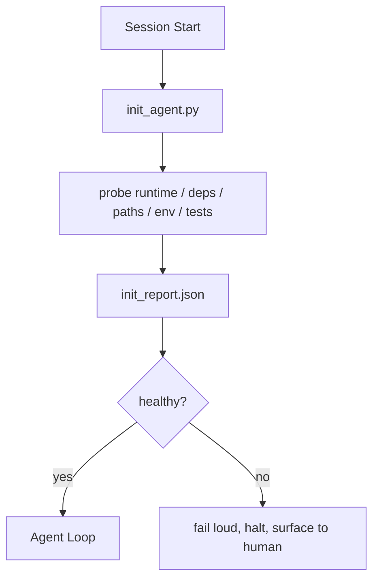

# Skrypty inicjujące dla agentów

> Każda sesja rozpoczynająca się na zimno płaci podatek. Agent odczytuje te same pliki, ponawia te same próby i ponownie odkrywa te same ścieżki. Skrypt init płaci podatek raz i zapisuje odpowiedzi w stanie.

**Typ:** Kompilacja
**Języki:** Python (stdlib)
**Wymagania wstępne:** Faza 14 · 32 (Minimalny stół warsztatowy), Faza 14 · 34 (pamięć Repo)
**Czas:** ~45 minut

## Cele nauczania

- Zidentyfikuj pracę, której agent nigdy nie powinien musieć powtarzać w trakcie sesji.
- Zbuduj deterministyczny skrypt init, który sprawdza czas wykonania, zależności i stan repozytorium.
- Utrwal wynik sondy, aby agent go odczytał, zamiast ponownie przeprowadzać kontrole.
- Awaria jest głośna, szybka i dostępna w jednym miejscu, gdy inicjalizacja się nie powiedzie.

## Problem

Otwórz sesję. Agent zgaduje wersję Pythona. Odgaduje polecenie testowe. Wyświetla katalog główny repozytorium pięć razy, aby znaleźć punkt wejścia. Próbuje zaimportować pakiet, który nie jest zainstalowany. Pyta użytkownika, gdzie znajduje się plik konfiguracyjny. Do czasu wprowadzenia prawdziwej edycji dziesięć tysięcy tokenów poszło na prace konfiguracyjne, które powinny stanowić pojedynczy skrypt.

Rozwiązaniem jest jeden skrypt inicjujący, który jest uruchamiany, zanim agent wykona cokolwiek innego, i zapisuje `init_report.json`, który agent odczytuje podczas uruchamiania.

## Koncepcja



### Co sprawdza skrypt inicjujący

| Sonda | Dlaczego to ma znaczenie |
|------|----------------|
| Wersje wykonawcze | Zła wersja Pythona lub Node'a oznacza ciche błędy nieprawidłowej wersji |
| Dostępność zależności | Zagubiona paczka kosztuje później dziesięciokrotność kosztu jej złapania teraz |
| Polecenie testowe | Agent musi wiedzieć, jak weryfikować; jeśli brakuje polecenia, środowisko robocze jest uszkodzone |
| Ścieżki repozytorium | Zakodowane ścieżki dryfują; rozwiąż je raz i przypnij |
| Zmienne środowiskowe | Brak `OPENAI_API_KEY` to powierzchnia awarii, a nie zagadka środowiska wykonawczego |
| Stan + świeżość deski | Nieaktualny stan z zawieszonej sesji to footgun |
| Ostatnie znane dobre zatwierdzenie | Kotwica różnicy przekazania na koniec sesji |

### Porażka głośna, porażka szybka, porażka w jednym miejscu

Awaria sondy oznacza zatrzymanie i wynurzenie się na powierzchnię człowieka. Nie, „agent się o tym przekona”. Cały sens init polega na odmowie uruchomienia, gdy stół warsztatowy jest zepsuty.

### Idempotentny

Uruchom go dwa razy z rzędu. Drugie uruchomienie powinno zakończyć się niepowodzeniem, z wyjątkiem nowego znacznika czasu. Idempotencja umożliwia podłączenie skryptu do CI, haków lub polecenia ukośnika poprzedzającego zadanie.

### Inicjacja a reguły uruchamiania

Zasady (faza 14 · 33) opisują, co musi być zgodne z prawdą, aby działać. Init to skrypt, który sprawdza, czy te reguły mogą zostać sprawdzone. Reguły bez init stają się „bądź ostrożny”. Init bez reguł staje się dopracowaną porażką.

## Zbuduj to

`code/main.py` implementuje `init_agent.py`:

- Pięć sond: wersja Pythona, wymienione zależności poprzez `importlib.util.find_spec`, rozpoznawalność poleceń testowych, wymagane zmienne środowiskowe, aktualność pliku stanu.
- Każda sonda zwraca `(name, status, detail)`.
- Skrypt zapisuje `init_report.json` z pełnym zestawem sond i kończy działanie z wartością różną od zera, jeśli którakolwiek sonda dotycząca ważności bloku zakończy się niepowodzeniem.

Uruchom to:

```
python3 code/main.py
```

Skrypt wypisuje tabelę sond, zapisuje `init_report.json` i kończy zerem na szczęśliwej ścieżce lub niezerowym z listą nieudanych sond.

## Wzorce produkcji na wolności

Trzy wzorce oddzielają użyteczny skrypt init od ceremonii.

**Kotwiczenie ostatniego znanego dobrego zatwierdzenia.** Sprawdź bieżące zatwierdzenie w oparciu o plik `LKG` zapisany podczas ostatniego pomyślnego scalania. Jeśli różnica przekracza budżet (domyślnie 50 plików), odmów rozpoczęcia i poproś człowieka o zatwierdzenie nowej linii bazowej. Właśnie tego używa AI Code Review Cloudflare do określania zakresu agentów recenzentów: każda sesja przeglądu zakotwicza się w tym samym, ostatnio znanym, dobrym i nigdy nie zmienia się pomiędzy sesjami.

**Zablokuj pliki za pomocą TTL.** Napisz `prereqs.lock` po pierwszym pomyślnym przejściu sondy. Kolejne uruchomienia ufają blokadzie przez N godzin (domyślnie 24 godziny) i pomijają drogie sondy. Skrypt init najpierw odczytuje blokadę; jeśli jest świeży i manifest zależności pasuje do skrótu, powoduje zwarcie. Jest to ten sam wzorzec, którego Docker używa w przypadku pamięci podręcznych warstw: idempotentna sonda + skrót treści = pomiń.

**Brak sieci, brak LLM, brak niespodzianek na gorącej ścieżce.** Sondy inicjujące są deterministyczne. Sonda, która wywołuje LLM w celu sklasyfikowania awarii lub trafia do usługi zewnętrznej w celu sprawdzenia licencji, nie jest sondą; to jest przepływ pracy. Jeśli próba próbna trwa dłużej niż trzy sekundy, potraktuj to jako zapach warsztatu i albo wyjdź z inicjowania, albo zapisz wynik w pamięci podręcznej.

## Użyj tego

W produkcji:

- **Haki Claude Code.** `pre-task` hook wywołuje skrypt inicjujący i odmawia uruchomienia agenta, jeśli zakończy się niepowodzeniem.
- **Akcje GitHub.** Zadanie `setup-agent` uruchamia skrypt inicjujący; od tego zależy praca agenta.
- **Punkt wejścia Dockera.** Kontener agenta uruchamia skrypt inicjujący przed uruchomieniem środowiska wykonawczego agenta; rejestruje powierzchnię w przypadku awarii.

Skrypt init jest przenośny, ponieważ nie wywołuje żadnych konkretnych struktur. Bash, Make lub plik zadań mogą to wszystko zawinąć.

## Wyślij to

`outputs/skill-init-script.md` przeprowadza wywiad z projektem, klasyfikuje jego prace konfiguracyjne na sondy i emituje specyficzny dla projektu `init_agent.py` oraz przepływ pracy CI, który uruchamia go przed jakimkolwiek krokiem agenta.

## Ćwiczenia

1. Dodaj sondę, która porównuje bieżące zatwierdzenie z ostatnim znanym dobrym zatwierdzeniem i odmawia uruchomienia, jeśli zmieniono więcej niż 50 plików.
2. Podłącz skrypt do zapisu pliku `prereqs.lock` i odmów uruchomienia, jeśli blokada jest starsza niż siedem dni.
3. Dodaj flagę `--fix`, która automatycznie instaluje brakujące zależności programistyczne, ale nigdy nie modyfikuje zależności środowiska wykonawczego bez zgody.
4. Przenieś sondy z zakodowanych na stałe funkcji do rejestru YAML. Broń kompromisu.
5. Dodaj budżet czasowy na sondę. Sonda działająca dłużej niż trzy sekundy to zapach warsztatu.

## Kluczowe terminy

| Termin | Co ludzie mówią | Co to właściwie oznacza |
|------|----------------|--------------------------------------|
| Sonda | „Czek” | Funkcja deterministyczna zwracająca `(name, status, detail)` |
| Raport początkowy | „Wyjście konfiguracji” | JSON zapisany obok stanu z wynikami sondy |
| Idempotentny | „Bezpieczne ponowne uruchomienie” | Dwa uruchomienia z rzędu dają identyczne raporty modulo znacznik czasu |
| Porażka głośno | „Nie połykaj” | Zatrzymaj się i wynurz na powierzchnię człowieka; bez cichego powrotu |
| Podatek instalacyjny | „Koszt ładowania początkowego” | Tokeny, które agent wydaje na sesję, odkrywając na nowo oczywiste |

## Dalsze czytanie

- [Antropiczne, skuteczne uprzęże dla agentów działających długotrwale](https://www.anthropic.com/engineering/efektywne-harnesses-for-long-running-agents)
- [Akcje GitHub, akcje złożone do konfiguracji](https://docs.github.com/en/actions/sharing-automations/creating-actions/creating-a-composite-action)
- [microservices.io, platforma deweloperska GenAI: poręcze](https://microservices.io/post/architecture/2026/03/09/genai-development-platform-part-1-development-guardrails.html) — wstępne zatwierdzenie + kontrole CI jako init
– [Kod rozszerzający, Jak zbudować plik AGENTS.md (2026)](https://www.augmentcode.com/guides/how-to-build-agents-md) — oczekiwania początkowe
- [Blog Codex, Kompaktowanie kontekstu Codex CLI](https://codex.danielvaughan.com/2026/03/31/codex-cli-context-compaction-architecture/) — rozpoczęcie sesji jako inicjacja obsługująca kompaktowanie
- Faza 14 · 33 — zestaw reguł, na który pozwala ten skrypt
- Faza 14 · 34 — plik stanu inicjuje ten skrypt
- Faza 14 · 38 – bramka weryfikacyjna zasilana przez skrypt inicjujący
- Faza 14 · 40 — przekazanie, które zużywa ostatnie znane dobro raportu początkowego