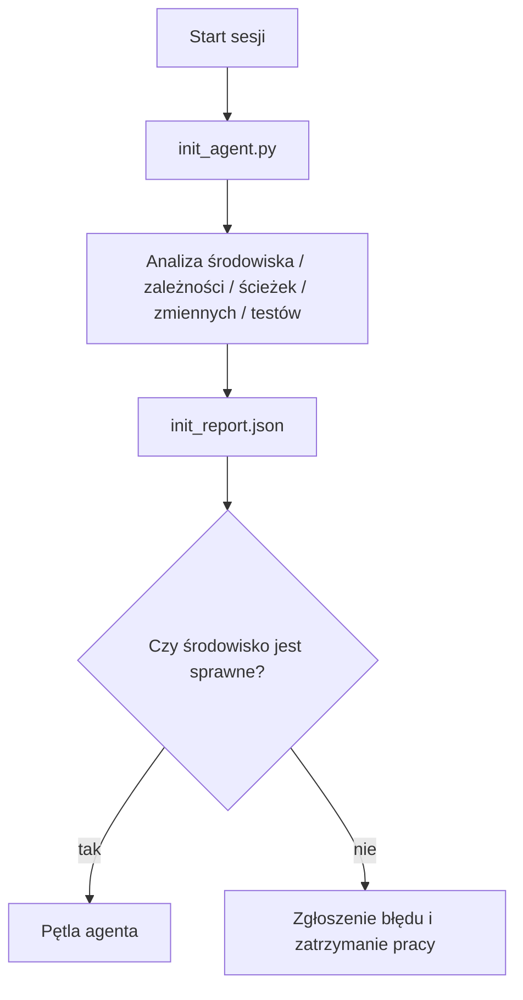

# Skrypty inicjalizacyjne dla agentów

> Każda sesja uruchamiana na zimno (cold start) generuje koszty. Agent odczytuje te same pliki, powtarza te same próby i od nowa analizuje te same ścieżki. Skrypt inicjalizacyjny (init script) wykonuje te czynności tylko raz, a wyniki zapisuje bezpośrednio w pliku stanu.

**Typ:** Budowa (Build)  
**Języki:** Python (biblioteka standardowa)  
**Wymagania wstępne:** Faza 14 · 32 (Minimalne środowisko pracy), Faza 14 · 34 (Pamięć repozytorium)  
**Czas:** ~45 minut  

## Cele nauczania

- Identyfikacja zadań konfiguracyjnych, których agent nie powinien powtarzać przy każdym uruchomieniu sesji.
- Zbudowanie deterministycznego skryptu inicjalizacyjnego, który sprawdza środowisko uruchomieniowe, zależności oraz stan repozytorium.
- Zapisanie wyników analizy środowiska w pliku stanu, aby agent mógł je odczytać zamiast przeprowadzać testy od nowa.
- Wdrożenie zasady „fail-fast” – natychmiastowe zgłaszanie błędów w jednym, czytelnym miejscu w przypadku niepowodzenia inicjalizacji.

## Problem

Po uruchomieniu sesji agent próbuje odgadnąć wersję Pythona oraz polecenie testowe. Przeszukuje główny katalog repozytorium kilkukrotnie, aby znaleźć punkt wejścia. Próbuje zaimportować bibliotekę, która nie jest zainstalowana, i dopytuje użytkownika o lokalizację pliku konfiguracyjnego. Zanim przejdzie do właściwej pracy, model zużywa dziesięć tysięcy tokenów na czynności konfiguracyjne, które powinny zostać zrealizowane za pomocą jednego, prostego skryptu.

Rozwiązaniem jest dedykowany skrypt inicjalizacyjny, uruchamiany przed przystąpieniem agenta do jakichkolwiek działań, który generuje raport `init_report.json` odczytywany przez agenta na starcie.

## Koncept



### Co weryfikuje skrypt inicjalizacyjny

| Weryfikowany element | Dlaczego jest to ważne |
| :--- | :--- |
| Wersje środowisk uruchomieniowych | Niewłaściwa wersja Pythona lub Node.js powoduje trudne do wykrycia błędy kompatybilności. |
| Dostępność zależności | Brak biblioteki wykryty na późniejszym etapie generuje dziesięciokrotnie większe koszty naprawy. |
| Polecenie testowe | Agent musi wiedzieć, jak zweryfikować swoje zmiany. Brak polecenia testowego oznacza uszkodzenie środowiska pracy. |
| Ścieżki w repozytorium | Ścieżki wpisane na sztywno ulegają zmianom. Należy je ustalić raz i zapisać. |
| Zmienne środowiskowe | Brak klucza `OPENAI_API_KEY` to oczywisty błąd konfiguracyjny, a nie problem do rozwiązania w trakcie działania pętli. |
| Spójność stanu i tablicy zadań | Przestarzałe dane stanu z przerwanej sesji to częsta przyczyna błędów. |
| Ostatnie znane dobre zatwierdzenie (LKG) | Punkt odniesienia do generowania diffa przy przekazywaniu zadań na koniec sesji. |

### Zasada Fail-Fast: zgłaszaj błędy natychmiast i jawnie

Błąd w testach inicjalizacyjnych musi skutkować natychmiastowym zatrzymaniem procesu i przekazaniem problemu człowiekowi. Nie należy zakładać, że „agent sam sobie z tym poradzi”. Głównym celem skryptu init jest zablokowanie uruchomienia agenta, jeśli środowisko pracy nie jest w pełni skonfigurowane.

### Idempotentność

Skrypt powinien działać idempotentnie. Drugie uruchomienie z rzędu powinno dać identyczny rezultat (poza zaktualizowanym znacznikiem czasu). Dzięki temu skrypt init można łatwo podpiąć do procesów CI, hooków gita lub poleceń uruchamianych przed rozpoczęciem zadania.

### Inicjalizacja a reguły rozruchu

Zasady (faza 14 · 33) definiują warunki, które muszą być spełnione, aby system działał. Skrypt init to narzędzie, które sprawdza, czy te warunki są faktycznie spełnione. Zasady bez skryptu init stają się jedynie pobożnymi życzeniami („bądź ostrożny”), a skrypt init bez reguł prowadzi do dobrze udokumentowanych awarii.

## Wdrożenie (Zbuduj to)

Skrypt `code/main.py` implementuje moduł `init_agent.py`:

- Pięć testów (sond): wersja Pythona, import zależności za pomocą `importlib.util.find_spec`, weryfikacja polecenia testowego, wymagane zmienne środowiskowe oraz aktualność pliku stanu.
- Każdy test zwraca wynik w formacie `(name, status, detail)`.
- Skrypt zapisuje raport `init_report.json` zawierający szczegółowe wyniki i kończy działanie kodem niezerowym, jeśli jakikolwiek kluczowy test (blocker) zakończy się niepowodzeniem.

Uruchomienie:

```
python3 code/main.py
```

Skrypt wyświetli tabelę z wynikami testów, zapisze plik `init_report.json` i zakończy działanie z kodem zero (jeśli wszystko działa poprawnie) lub kodem niezerowym z listą wykrytych problemów.

## Wzorce produkcyjne w praktyce

Trzy wzorce odróżniają dobrze zaprojektowany skrypt init od zbędnej procedury konfiguracyjnej:

**Kotwiczenie ostatniej znanej dobrej rewizji (Last Known Good Commit - LKG).** Porównaj aktualne zatwierdzenie gita z plikiem `LKG` zapisanym podczas ostatniego udanego scalenia (merge). Jeśli różnica przekracza ustalony limit (np. modyfikacja ponad 50 plików), odmów uruchomienia i poproś człowieka o weryfikację. Wzorzec ten jest wykorzystywany w systemach AI Code Review w Cloudflare do określania zakresu prac recenzentów – każda sesja analizuje te same, stabilne dane.

**Wykorzystanie plików blokad z czasem ważności (TTL).** Po pomyślnym zakończeniu testów skrypt zapisuje plik `prereqs.lock`. Kolejne uruchomienia sprawdzają ten plik i – jeśli jest aktualny (np. ma mniej niż 24 godziny) oraz skrót (hash) zależności się zgadza – pomijają kosztowne testy środowiska. Działa to analogicznie do mechanizmu cache'owania warstw w Dockerze.

**Brak połączeń sieciowych i zapytań do LLM na krytycznej ścieżce.** Testy inicjalizacyjne muszą być w pełni deterministyczne. Test, który wysyła zapytanie do LLM w celu sklasyfikowania błędu lub łączy się z zewnętrznym serwerem licencjonowania, nie jest testem konfiguracyjnym, lecz częścią przepływu pracy. Jeśli uruchomienie testu trwa dłużej niż 3 sekundy, jest to niepokojący sygnał (code smell) – należy skrócić czas jego działania lub zapisać wynik w pamięci podręcznej.

## Zastosowanie (Użyj tego)

W środowisku produkcyjnym:

- **Hooki w Claude Code:** Hook typu `pre-task` uruchamia skrypt init i blokuje start agenta, jeśli konfiguracja wykaże błędy.
- **GitHub Actions:** Krok `setup-agent` wykonuje skrypt init, od którego zależą kolejne zadania w potoku.
- **Punkt wejścia (EntryPoint) w Dockerze:** Kontener agenta uruchamia skrypt init przed startem głównego procesu, logując wszelkie nieprawidłowości konfiguracyjne.

Skrypt init jest uniwersalny i niezależny od konkretnego frameworka. Może być łatwo uruchamiany za pomocą basha, pliku Makefile czy narzędzia Taskfile.

## Wdrożenie (Wyślij to)

Skrypt `outputs/skill-init-script.md` analizuje strukturę projektu, definiuje wymagane testy konfiguracyjne i generuje dopasowany skrypt `init_agent.py` wraz z konfiguracją przepływu pracy CI.

## Ćwiczenia

1. Dodaj test porównujący bieżące zatwierdzenie z ostatnim znanym dobrym zatwierdzeniem (LKG) i zablokuj uruchomienie agenta, jeśli zmodyfikowano więcej niż 50 plików.
2. Zaimplementuj obsługę pliku blokady `prereqs.lock` i zablokuj start agenta, jeśli plik ten jest starszy niż 7 dni.
3. Dodaj flagę `--fix`, która automatycznie instaluje brakujące zależności deweloperskie, ale nigdy nie modyfikuje zależności produkcyjnych bez wyraźnej zgody operatora.
4. Przenieś konfigurację testów ze skryptu Python do zewnętrznego pliku YAML. Przeanalizuj zalety i wady takiego rozwiązania.
5. Zaimplementuj budżet czasowy (timeout) dla każdego testu. Test trwający dłużej niż 3 sekundy powinien być traktowany jako anomalia konfiguracyjna.

## Kluczowe terminy

| Termin | Potoczna nazwa | Rzeczywiste znaczenie |
| :--- | :--- | :--- |
| Test (Sonda) | „Walidacja” | Deterministyczna funkcja zwracająca wynik w formacie `(name, status, detail)` |
| Raport inicjalizacji | „Wynik konfiguracji” | Plik JSON z wynikami testów środowiska, zapisywany obok pliku stanu |
| Idempotentność | „Bezpieczne ponowne uruchomienie” | Właściwość skryptu sprawiająca, że kolejne uruchomienia generują identyczne raporty (poza sygnaturą czasową) |
| Jawne zgłaszanie błędów | „Brak tolerancji na błędy” | Zatrzymanie procesu i przekazanie informacji o awarii człowiekowi zamiast ignorowania problemu |
| Koszt konfiguracji | „Setup tax” | Czas i tokeny zużywane przez agenta na próby samodzielnego zdiagnozowania oczywistych parametrów środowiska |

## Dalsza lektura

- [Anthropic: Effective harnesses for long-running agents](https://www.anthropic.com/engineering/effective-harnesses-for-long-running-agents)
- [GitHub Actions: Creating a composite action](https://docs.github.com/en/actions/sharing-automations/creating-actions/creating-a-composite-action)
- [GenAI Development Platform: Guardrails, Pre-commit & CI checks](https://microservices.io/post/architecture/2026/03/09/genai-development-platform-part-1-development-guardrails.html)
- [Augment Code: How to build agents.md (2026)](https://www.augmentcode.com/guides/how-to-build-agents-md)
- [Codex Blog: Context compaction architecture in Codex CLI](https://codex.danielvaughan.com/2026/03/31/codex-cli-context-compaction-architecture/)
- Faza 14 · 33 – zestaw reguł weryfikowany przez ten skrypt.
- Faza 14 · 34 – integracja skryptu ze stanem początkowym agenta.
- Faza 14 · 38 – bramka weryfikacyjna zasilana danymi ze skryptu inicjalizacyjnego.
- Faza 14 · 40 – proces przekazania zadania korzystający z punktu odniesienia LKG.
