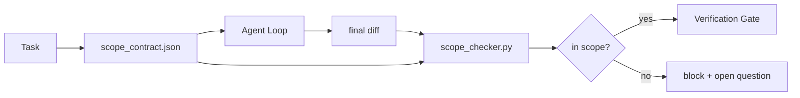

# Umowy dotyczące zakresu i granice zadań

> Modelka nie wie, gdzie kończy się praca. Umowa dotycząca zakresu to plik dotyczący poszczególnych zadań, który określa, gdzie praca się zaczyna, gdzie się kończy i jak ją wycofać, jeśli się rozleje. Umowa zmienia „pozostanie w zakresie” z życzenia w czek.

**Typ:** Kompilacja
**Języki:** Python (stdlib)
**Wymagania wstępne:** Faza 14 · 32 (Minimalny stół warsztatowy), Faza 14 · 33 (Zasady jako ograniczenia)
**Czas:** ~50 minut

## Cele nauczania

- Napisz umowę zakresu, którą agent czyta na początku zadania, a weryfikator na końcu zadania.
- Określ dozwolone pliki, zabronione pliki, kryteria akceptacji, plan wycofywania i granice zatwierdzenia.
- Zaimplementuj moduł sprawdzający zakres, który porównuje różnicę z umową i sygnalizuje naruszenia.
- Spraw, aby przesunięcie zakresu było widoczne, automatyczne i możliwe do sprawdzenia.

## Problem

Agenci pełzają. Zadanie brzmi „napraw błąd logowania”. Różnica dotyczy ścieżki logowania, pomocnika poczty e-mail, sterownika bazy danych, pliku README i skryptu wydania. Każde dotknięcie miało w tej chwili wiarygodny powód. Razem stanowią inną zmianę niż ta, która była recenzowana.

Pełzanie zakresu to najbardziej niedostatecznie monitorowany rodzaj awarii w pracy agenta, ponieważ agent opowiada o każdym kroku w dobrej wierze. Poprawka nie jest bardziej rygorystycznym monitem. Poprawka to kontrakt na dysku, który mówi, co zostało obiecane, oraz sprawdzenie, które porównuje wynik z obietnicą.

## Koncepcja



### Co obejmuje umowa zakresowa

| Pole | Cel |
|-------|-------------|
| `task_id` | Linki do zadania na tablicy |
| `goal` | Jedno zdanie, które recenzent może zweryfikować |
| `allowed_files` | Globy, które agent może napisać |
| `forbidden_files` | Globy, których agent nie może dotykać nawet przypadkowo |
| `acceptance_criteria` | Polecenia testowe lub linie asercji, które okażą się wykonane |
| `rollback_plan` | Jeden akapit, który operator może wykonać, jeśli wymagane jest zatrzymanie |
| `approvals_required` | Działania wykraczające poza zakres, które wymagają wyraźnego podpisu człowieka |

Umowa bez `forbidden_files` jest niekompletna. Przestrzeń ujemna to połowa kontraktu.

### Globy, a nie surowe ścieżki

Prawdziwe repozytoria przenoszą pliki. Przypinaj kontrakty do globów (`app/**/*.py`, `tests/test_signup*.py`), aby refaktoryzacja między sesjami nie unieważniała kontraktu.

### Wycofanie zmian jest częścią zakresu

Lista sposobów wycofania zmusza autora umowy do zastanowienia się, co może pójść nie tak. Umowa, z której nie można się wycofać, to umowa, której nie należy zatwierdzać.

### Kontrola zakresu to kontrola różnicowa

Agent zapisuje różnicę. Program sprawdzający odczytuje różnicę, dozwolone i zabronione obszary glob oraz listę wszystkich wykonanych poleceń akceptacji. Każde naruszenie jest oznakowanym stwierdzeniem, że bramka weryfikacyjna może odmówić.

## Zbuduj to

`code/main.py` implementuje:

- schemat `scope_contract.json` (podzbiór schematu JSON, tablice glob).
- Parser różnicowy, który zamienia listę dotkniętych plików oraz listę poleceń uruchamiania w `RunSummary`.
- Element `scope_check`, który zwraca `(violations, in_scope, off_scope)` zgodnie z umową.
- Dwie serie demonstracyjne: jedna, która pozostaje w zasięgu, druga, która się skrada. Kontroler zaznacza błąd, podając dokładny plik i przyczynę.

Uruchom to:

```
python3 code/main.py
```

Dane wyjściowe: umowa, dwa przebiegi, werdykty dotyczące przebiegu i zapisany `scope_report.json`.

## Wzorce produkcji na wolności

Praktyk prowadzący „specsmaxxing” (kontrakty zakresu w YAML przed wywołaniem agenta) zgłasza, że wskaźnik występowania króliczych nor spadł z 52% do 21% w ciągu trzech tygodni bez zmiany agenta. Umowa wykonała pracę, a nie model. Trzy wzory sprawiają, że wzmocnienie się utrzymuje.

**Budżety naruszeń, a nie błędy binarne.** `agent-guardrails` (brama scalająca OSS używana przez Claude Code, Cursor, Windsurf, Codex za pośrednictwem MCP) wysyła `violationBudget` na każde zadanie: drobne przekroczenia zakresu w ramach budżetu są wyświetlane jako ostrzeżenia; dopiero po przekroczeniu budżetu brama scalająca odmawia. Sparuj z `violationSeverity: "error" | "warning"`. Budżet to różnica między bramą, która jest wysyłana, a bramą, która zostaje unieruchomiona przez zespół, który jej nienawidzi.

**Asymetria ważności według rodziny ścieżek.** Zapisy poza zakresem do `docs/**` to zwykle `warn`; zapisy poza zakresem do `scripts/**`, `migrations/**`, `config/prod/**` są zawsze `block`. Ta asymetria musi wynikać z umowy, a nie ze środowiska wykonawczego, ponieważ jest specyficzna dla projektu i zmienia się w zależności od zadania.

**Budżety czasu i sieci obok budżetów plików.** Pole `time_budget_minutes` ogranicza zegar ścienny; środowisko wykonawcze odmawia kontynuowania bez ponownego zatwierdzenia. Lista dozwolonych `network_egress` na nazwach hostów uniemożliwia agentowi ciche uruchomienie zewnętrznego interfejsu API, który nie był częścią zadania. Są to także wymiary zakresu; kule plików są konieczne, ale niewystarczające.

**Semantyka łączenia wielu kontraktów (najmniejsze uprawnienia).** Gdy mają zastosowanie dwie umowy dotyczące zakresu (np. umowa obejmująca cały projekt i umowa dotycząca konkretnego zadania), połączenie wygląda następująco: **intersect** `allowed_files` (obie umowy muszą zezwalać na ścieżkę), **union** `forbidden_files` (każda może zabronić), `time_budget_minutes` jest najbardziej restrykcyjny (min), kumuluje się `approvals_required`. `network_egress` to `None` w przypadku braku egzekwowania, `[]` w przypadku opcji odrzucania wszystkich, `[...]` jako lista dozwolonych; w przypadku scalania `None` przesuwa się na drugą stronę, dwie listy przecinają się i odmowa-wszystko pozostaje odmową-wszystko. Określ to w schemacie umowy, aby połączenie było mechaniczne i możliwe do sprawdzenia.

## Użyj tego

Wzory produkcyjne:

- **Komendy Claude Code z ukośnikiem.** Polecenie `/scope` zapisuje kontrakt i przypina go jako kontekst sesji. Subagenci czytają umowę przed podjęciem działań.
- **PRs GitHub.** Prześlij umowę jako plik JSON do treści PR lub jako zaewidencjonowany artefakt. CI uruchamia sprawdzanie zakresu względem różnicy scalania.
- **LangGraph przerywa.** Naruszenie zakresu powoduje przerwanie; przewodnik pyta człowieka, czy kontrakt musi się rozwinąć, czy też agent musi się wycofać.

Umowa podróżuje z zadaniem. Po zamknięciu zadania umowa jest archiwizowana w lokalizacji `outputs/scope/closed/`.

## Wyślij to

`outputs/skill-scope-contract.md` generuje kontrakt zakresu dla opisu zadania i narzędzia sprawdzającego uwzględniającego globalność, które działa w CI przy każdym porównaniu agenta.

## Ćwiczenia

1. Dodaj pole `network_egress` z listą dozwolonych hostów zewnętrznych. Odmawiaj biegów, które dotykają innych gospodarzy.
2. Rozszerz moduł sprawdzania tak, aby powodował miękki błąd na `docs/**` i twardy na `scripts/**`. Uzasadnij asymetrię.
3. Spraw, aby kontrakt wywodził `allowed_files` z pola `goal` przy użyciu statycznego zestawu reguł (bez LLM). Co idzie nie tak w przypadku pierwszej krawędzi?
4. Dodaj `time_budget_minutes` i nie kontynuuj pracy, gdy zegar ścienny ją przekroczy.
5. Uruchom dwa kontrakty z tą samą różnicą. Jaka jest właściwa semantyka scalania, gdy oba mają zastosowanie?

## Kluczowe terminy

| Termin | Co ludzie mówią | Co to właściwie oznacza |
|------|----------------|--------------------------------------|
| Umowa zakresowa | „Spis zadania” | Lista plików JSON dla poszczególnych zadań, dozwolone/zabronione, akceptacja, wycofywanie |
| Pełzanie lunety | „To także dotknęło…” | Pliki poza umową zmienione w tym samym zadaniu |
| Plan wycofania | „Możemy powrócić” | Element Runbook operatora jednoakapitowego do zatrzymywania |
| Granica zatwierdzenia | „Wymaga podpisu” | Działanie wymienione w umowie jako wymagające wyraźnej zgody człowieka |
| Kontrola różnicowa | „Audyt ścieżki” | Porównanie dotkniętych plików z globusami kontraktów |

## Dalsze czytanie

- [LangGraph przerwania typu human-in-the-loop](https://langchain-ai.github.io/langgraph/concepts/human_in_the_loop/)
- [Zasady zatwierdzania narzędzi OpenAI Agents SDK](https://platform.openai.com/docs/guides/agents-sdk)
- [logi-cmd/agent-guardrails — bramki scalające i weryfikacja zakresu](https://github.com/logi-cmd/agent-guardrails) — budżety naruszeń, poziomy istotności
- [Dev|Journal, Preventing AI Agent Drift with Agent Contract Testing](https://earezki.com/ai-news/2026-05-05-i-built-a-tiny-ci-tool-to-keep-ai-agent-configs-from-drifting-in-my-repo/) — tryb `--strict` bez zewnętrznego dep
- [Agentic Coding to nie pułapka (dzienniki produkcyjne)](https://dev.to/jtorchia/agentic-coding-is-not-a-trap-i-answered-the-viral-hn-post-with-my-own-production-logs-33d9) — wpływy ze specsmaxxing: 52% → 21%
- [Globy uprawnień OpenCode](https://opencode.ai/docs/agents/) — szczegółowy zakres uprawnień
- [Knostic, AI Coding Agent Security: modele zagrożeń i strategie ochrony](https://www.knostic.ai/blog/ai-coding-agent-security) — zakres w ramach najniższych uprawnień
- [Kod rozszerzający, szablon specyfikacji AI](https://www.augmentcode.com/guides/ai-spec-template) — trójpoziomowy system granic (trzeba/pytać/nigdy)
- Faza 14 · 27 – natychmiastowa obrona zastrzykowa, która łączy się z blokadami lunety
- Faza 14 · 33 – zasada określona w tym kontrakcie specjalizuje się w poszczególnych zadaniach
- Faza 14 · 38 – bramka weryfikacyjna, do której zgłasza się kontroler