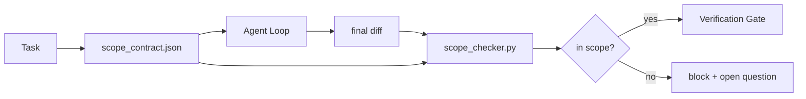

# Umowy dotyczące zakresu i granice zadań

> Model nie wie, gdzie kończy się praca. Umowa dotycząca zakresu (scope contract) to powiązany z konkretnym zadaniem plik, który określa, gdzie praca się zaczyna, gdzie się kończy i jak ją wycofać w razie niepowodzenia. Taki kontrakt zmienia „pozostanie w zakresie” z pobożnego życzenia w twardą gwarancję.

**Typ:** Kompilacja
**Języki:** Python (stdlib)
**Wymagania wstępne:** Faza 14 · 32 (Minimalny stół warsztatowy), Faza 14 · 33 (Zasady jako ograniczenia)
**Czas:** ~50 minut

## Cele nauczania

- Napisz umowę zakresu, którą agent odczytuje na początku zadania, a weryfikator sprawdza na jego końcu.
- Określ dozwolone i zabronione pliki, kryteria akceptacji, plan wycofania zmian oraz granice autoryzacji.
- Zaimplementuj moduł sprawdzający zakres (scope checker), który porównuje zmiany (diff) z umową i sygnalizuje naruszenia.
- Uczyń rozszerzanie zakresu (scope creep) widocznym, automatycznym i możliwym do zweryfikowania.

## Problem

Agenci mają tendencję do rozszerzania zakresu prac (scope creep). Zadanie może brzmieć „napraw błąd logowania”, ale zestaw zmian (diff) ostatecznie obejmuje ścieżkę logowania, pomocnika poczty e-mail, sterownik bazy danych, plik README oraz skrypt wydania. Każda wprowadzona zmiana miała w danym momencie racjonalne uzasadnienie. Razem tworzą one jednak zupełnie inną modyfikację niż ta, która miała zostać zweryfikowana.

Rozszerzanie zakresu to najmniej kontrolowany rodzaj awarii w pracy agenta, ponieważ agent tłumaczy każdy swój krok działaniem w dobrej wierze. Rozwiązaniem nie jest stworzenie bardziej rygorystycznego promptu. Rozwiązaniem jest zapisany na dysku kontrakt określający zobowiedzania oraz walidator, który porównuje wynik z tymi obietnicami.

## Koncepcja



### Co zawiera umowa dotycząca zakresu

| Pole | Cel |
|-------|-------------|
| `task_id` | Link do zadania w systemie (np. Jira/Trello) |
| `goal` | Jedno zdanie, które weryfikator może łatwo sprawdzić |
| `allowed_files` | Wzorce glob dla plików, które agent może modyfikować lub tworzyć |
| `forbidden_files` | Wzorce glob dla plików, których agent nie może modyfikować nawet przypadkowo |
| `acceptance_criteria` | Polecenia testowe lub asercje potwierdzające wykonanie zadania |
| `rollback_plan` | Krótki plan przywrócenia poprzedniego stanu, z którego operator może skorzystać w razie konieczności wycofania zmian |
| `approvals_required` | Działania wykraczające poza zakres, które wymagają wyraźnej akceptacji człowieka |

Umowa bez `forbidden_files` jest niekompletna. Wykluczenia to połowa sukcesu kontraktu.

### Wzorce glob, a nie bezwzględne ścieżki

W rzeczywistych projektach pliki często zmieniają lokalizację. Powiąż reguły z wzorcami glob (`app/**/*.py`, `tests/test_signup*.py`), aby refaktoryzacja kodu między sesjami nie unieważniła kontraktu.

### Plan wycofania zmian to element zakresu

Zdefiniowanie procedury wycofania zmian zmusza autora umowy do przemyślenia potencjalnych problemów. Umowa, z której nie da się wycofać, nie powinna zostać zatwierdzona.

### Sprawdzanie zakresu opiera się na analizie zmian (diff)

Agent zapisuje diff (zmiany). Moduł sprawdzający analizuje te zmiany, porównuje je z dozwolonymi i zabronionymi wzorcami glob oraz weryfikuje listę wykonanych poleceń testowych. Każde naruszenie skutkuje odrzuceniem zmian przez bramkę weryfikacyjną.

## Implementacja

`code/main.py` implementuje:

- schemat `scope_contract.json` (podzbiór JSON Schema z tablicami wzorców glob).
- Parser zmian (diff), który przekształca listę zmodyfikowanych plików oraz wykonanych poleceń w obiekt `RunSummary`.
- Funkcję `scope_check`, która zwraca status `(violations, in_scope, off_scope)` zgodnie z kontraktem.
- Dwa przebiegi demonstracyjne: jeden zgodny z zakresem, a drugi wykraczający poza niego. Moduł sprawdzający zgłasza błąd, wskazując konkretny plik oraz przyczynę naruszenia.

Uruchomienie:

```
python3 code/main.py
```

Wynik: treść umowy, dwa przebiegi testowe wraz z werdyktami oraz zapisany raport `scope_report.json`.

## Wzorce produkcyjne w praktyce

Jeden z programistów stosujących podejście „specsmaxxing” (definiowanie umów zakresu w formacie YAML przed uruchomieniem agenta) zauważył spadek liczby niekontrolowanych prac (tzw. rabbit holes) z 52% do 21% w ciągu trzech tygodni, bez modyfikowania samego agenta. To zasługa precyzyjnego kontraktu, a nie zmiany modelu. Oto three wzorce, które gwarantują trwałość tego rozwiązania.

**Budżety naruszeń zamiast walidacji zero-jedynkowej.** Narzędzie `agent-guardrails` (otwarta bramka scalająca weryfikująca kod, używana m.in. przez Claude Code, Cursor, Windsurf czy Codex za pośrednictwem protokołu MCP) definiuje `violationBudget` dla każdego zadania. Niewielkie przekroczenia zakresu mieszczące się w budżecie są zgłaszane jako ostrzeżenia, a dopiero przekroczenie limitu blokuje scalenie zmian. Warto połączyć to z parametrem `violationSeverity: "error" | "warning"`. Taki budżet decyduje o tym, czy bramka weryfikacyjna będzie faktycznie użyteczna, czy też zostanie całkowicie wyłączona przez sfrustrowany zespół.

**Zróżnicowanie poziomu błędu w zależności od ścieżki (asymetria).** Zapisy poza zakresem do katalogu `docs/**` zazwyczaj generują jedynie ostrzeżenie (`warn`), natomiast próby zapisu do `scripts/**`, `migrations/**` czy `config/prod/**` są bezwzględnie blokowane (`block`). Ta asymetria powinna być zdefiniowana w samej umowie, a nie w środowisku uruchomieniowym, ponieważ zależy ona od specyfiki konkretnego projektu i zadania.

**Budżet czasowy i sieciowy jako uzupełnienie reguł plikowych.** Pole `time_budget_minutes` określa maksymalny czas działania agenta; po jego przekroczeniu środowisko uruchomieniowe przerywa pracę i wymaga ponownej autoryzacji. Z kolei lista dozwolonych hostów (`network_egress`) uniemożliwia agentowi potajemne odpytywanie zewnętrznych API poza zakresem zadania. Są to kluczowe wymiary kontroli – same reguły plikowe są niezbędne, lecz niewystarczające.

**Łączenie wielu kontraktów według zasady najmniejszych uprawnień (least privilege).** Gdy obowiązują dwie umowy dotyczące zakresu (np. globalna umowa dla całego projektu oraz szczegółowa umowa dla konkretnego zadania), ich reguły łączą się według następującego schematu: część wspólna (**intersect**) dla `allowed_files` (obie umowy muszą dopuszczać daną ścieżkę), suma (**union**) dla `forbidden_files` (dowolna umowa może zabronić zapisu), wartość minimalna (najbardziej restrykcyjna) dla `time_budget_minutes` oraz suma dla `approvals_required`. W przypadku `network_egress`: wartość `None` oznacza brak ograniczeń, `[]` blokuje cały ruch sieciowy, a lista `[...]` to wykaz dozwolonych adresów. Przy scalaniu brak reguły (`None`) ustępuje miejsca konkretnym restrykcjom, listy dozwolonych adresów są filtrowane do części wspólnej, a blokada całkowita zawsze pozostaje blokadą. Taki mechanizm należy uwzględnić w schemacie kontraktu, aby scalanie było w pełni deterministyczne i weryfikowalne.

## Zastosowanie

Wzorce produkcyjne:

- **Polecenia z ukośnikiem (slash commands) w Claude Code.** Polecenie `/scope` tworzy umowę i podpina ją pod kontekst sesji. Subagenci odczytują te reguły przed wykonaniem jakichkolwiek akcji.
- **Pull Requests w GitHubie.** Umowę można przesłać jako plik JSON w treści PR lub jako załączony artefakt. System CI uruchamia wtedy weryfikację zakresu na podstawie zestawu zmian (diff) w PR.
- **Punkty przerwania (interrupts) w LangGraph.** Naruszenie zakresu wywołuje zatrzymanie wykonywania programu, a system pyta użytkownika, czy należy rozszerzyć kontrakt, czy też wycofać zmiany wprowadzone przez agenta.

Umowa towarzyszy zadaniu na każdym etapie. Po zakończeniu prac jest archiwizowana w katalogu `outputs/scope/closed/`.

## Wdrożenie

`outputs/skill-scope-contract.md` tworzy umowę zakresu dla danego zadania oraz konfiguruje analizator zmian (obsługujący dopasowania glob), który działa w CI przy każdej weryfikacji działań agenta.

## Ćwiczenia

1. Dodaj pole `network_egress` z listą dozwolonych hostów zewnętrznych. Blokuj przebiegi, które próbują łączyć się z innymi adresami.
2. Rozbuduj walidator tak, aby generował ostrzeżenie (soft error) przy zmianach w `docs/**` oraz błąd blokujący (hard error) w przypadku modyfikacji `scripts/**`. Uzasadnij tę asymetrię.
3. Zaimplementuj automatyczne generowanie `allowed_files` na podstawie pola `goal` za pomocą zestawu statycznych reguł (bez użycia LLM). Jaki problem pojawia się w pierwszej kolejności na granicach zakresu?
4. Dodaj obsługę parametru `time_budget_minutes` i przerywaj pracę, jeśli czas wykonywania przekroczy ten limit.
5. Przetestuj zachowanie dwóch kontraktów na tym samym zestawie zmian (diff). Jaka powinna być prawidłowa semantyka ich scalania w takiej sytuacji?

## Kluczowe terminy

| Termin | Co ludzie mówią | Co to właściwie oznacza |
|------|----------------|--------------------------------------|
| Umowa zakresu (scope contract) | „Karta zadania” | Plik JSON powiązany z zadaniem, określający dozwolone/zabronione pliki, kryteria akceptacji oraz plan wycofania |
| Rozszerzanie zakresu (scope creep) | „Przy okazji zmieniłem też...” | Modyfikowanie plików wykraczających poza umowę w ramach jednego zadania |
| Plan wycofania zmian (rollback plan) | „Jak cofnąć zmiany” | Krótka instrukcja (runbook) dla operatora, opisująca powrót do stabilnego stanu |
| Granica autoryzacji (approval boundary) | „Wymaga podpisu” | Akcja wymieniona w umowie, która wymaga wyraźnej zgody człowieka przed wykonaniem |
| Analiza zmian (diff check) | „Audyt ścieżek” | Porównanie zmodyfikowanych plików ze wzorcami glob zdefiniowanymi w umowie |

## Dalsze czytanie

- [LangGraph interrupts type human-in-the-loop](https://langchain-ai.github.io/langgraph/concepts/human_in_the_loop/)
- [Zasady zatwierdzania narzędzi OpenAI Agents SDK](https://platform.openai.com/docs/guides/agents-sdk)
- [logi-cmd/agent-guardrails — bramki scalające i weryfikacja zakresu](https://github.com/logi-cmd/agent-guardrails) — budżety naruszeń, poziomy istotności
- [Dev|Journal, Preventing AI Agent Drift with Agent Contract Testing](https://earezki.com/ai-news/2026-05-05-i-built-a-tiny-ci-tool-to-keep-ai-agent-configs-from-drifting-in-my-repo/) — tryb `--strict` bez zewnętrznych zależności
- [Agentic Coding to nie pułapka (dzienniki produkcyjne)](https://dev.to/jtorchia/agentic-coding-is-not-a-trap-i-answered-the-viral-hn-post-with-my-own-production-logs-33d9) — korzyści ze specsmaxxing: 52% → 21%
- [Globy uprawnień OpenCode](https://opencode.ai/docs/agents/) — szczegółowe definiowanie uprawnień
- [Knostic, AI Coding Agent Security: modele zagrożeń i strategie ochrony](https://www.knostic.ai/blog/ai-coding-agent-security) — ograniczanie zakresu według zasady najmniejszych uprawnień
- [Augment Code, Szablon specyfikacji AI](https://www.augmentcode.com/guides/ai-spec-template) — trójstopniowy system granic (rób / zapytaj / nigdy)
- Faza 14 · 27 – natychmiastowa obrona przed wstrzykiwaniem instrukcji łącząca się z blokadami zakresu
- Faza 14 · 33 – zasady zdefiniowane w tym kontrakcie specjalizują się w poszczególnych zadaniach
- Faza 14 · 38 – bramka weryfikacyjna, do której raportuje walidator zakresu
