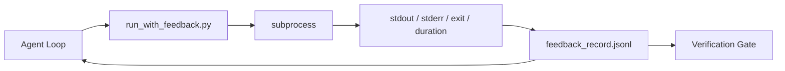

# Pętle sprzężenia zwrotnego środowiska wykonawczego

> Agenci, którzy nie widzą rzeczywistych wyników poleceń. Mechanizm zbierający informacje zwrotne zapisuje standardowe wyjście, stderr, kod wyjścia i czas w ustrukturyzowany rekord, który może odczytać następna tura. Wtedy agent reaguje na fakty, zamiast na własne przewidywanie faktów.

**Typ:** Kompilacja
**Języki:** Python (stdlib)
**Wymagania wstępne:** Faza 14 · 32 (Minimalne środowisko warsztatowe), Faza 14 · 35 (skrypt inicjujący)
**Czas:** ~50 minut

## Cele nauczania

- Odróżnij informacje zwrotne dotyczące czasu wykonania od telemetrii obserwowalności.
- Zbuduj moduł zbierający informacje zwrotne, który otacza polecenia powłoki i utrzymuje uporządkowane rekordy.
- Obcinaj deterministycznie duże wyniki, aby pętla mieściła się w budżecie tokena.
- Odmów rozwijania pętli, gdy brakuje sprzężenia zwrotnego.

## Problem

Agent mówi: „Teraz przeprowadzam testy”. Następna wiadomość brzmi: „Wszystkie testy poszły pomyślnie”. Rzeczywistość jest taka, że ​​nie przeprowadzono żadnego testu. Agent wyobraził sobie wynik lub uruchomił polecenie i nigdy nie odczytał wyniku, albo odczytał wynik i po cichu obciął linię błędu.

Biegacz informacji zwrotnej usuwa tę lukę. Każde polecenie przechodzi przez moduł biegacza. Każdy rekord zawiera polecenie, przechwycone standardowe wyjścia i stderr, kod zakończenia, czas trwania zegara ściennego i jednowierszową notatkę agenta. Agent czyta zapis w następnej turze. Bramka weryfikacyjna odczytuje zapisy na koniec zadania.

## Koncepcja



### Co zawiera zapis opinii

| Pole | Dlaczego to ma znaczenie |
|------|----------------|
| `command` | Dokładny argv, żadnych niespodzianek związanych z ekspansją powłoki |
| `stdout_tail` | N ostatnich linii, obcięcie deterministyczne |
| `stderr_tail` | Ostatnie N linii, oddzielonych od stdout |
| `exit_code` | Jednoznaczny sygnał sukcesu |
| `duration_ms` | Powierzchnie spowalniają sondy i niekontrolowane procesy |
| `started_at` | Znacznik czasu powtórki |
| `agent_note` | W jednym zdaniu agent pisze o tym, czego się spodziewał

### Obcięcie jest deterministyczne

Dziennik o rozmiarze 50 MB niszczy pętlę. Runner obcina głowę i koniec za pomocą znacznika `...truncated N lines...`, deterministycznego, więc te same dane wyjściowe zawsze dają ten sam rekord. Brak pobierania próbek; części, które agent musi zobaczyć (błąd końcowy, podsumowanie końcowe), są na końcu.

### Informacje zwrotne a telemetria

Telemetria (faza 14 · 23, konwencje Otel GenAI) jest przeznaczona dla operatorów-ludzi przeglądających przebiegi w czasie. Informacja zwrotna dotyczy następnej tury tego biegu. Dzielą pola, ale żyją w różnych plikach z różną retencją.

### Odmawiaj dalszych postępów bez informacji zwrotnej

Jeśli biegacz popełni błąd przed przechwyceniem wyjścia, rekord zawiera `exit_code: null` i `error: <reason>`. Pętla agenta musi odmówić przyjęcia sukcesu przy wyjściu `null`. Nie ma wyjścia, nie ma postępu.

## Zbuduj to

`code/main.py` implementuje:

- `run_with_feedback(command, agent_note)`, który otacza `subprocess.run`, przechwytuje stdout/stderr/exit/duration, obcina deterministycznie, dołącza do `feedback_record.jsonl`.
- Mały moduł ładujący, który przesyła strumieniowo JSONL do listy Pythona.
- Wersja demonstracyjna, która uruchamia trzy polecenia (sukces, niepowodzenie, powolne) i drukuje ostatni rekord dla każdego polecenia.

Uruchom to:

```
python3 code/main.py
```

Wynik: trzy rekordy opinii dołączone do `feedback_record.jsonl`, ostatni z każdego wydrukowany w tekście. Dokończ plik po kolejnych uruchomieniach, aby zobaczyć akumulację pętli.

## Wzorce produkcji na wolności

Trzy wzory utwardzają biegacza na tyle, że można go wysłać.

** Redaguj podczas zapisu, a nie podczas odczytu. ** Każdy rekord, który dotyka standardowego wyjścia lub stderr, może spowodować ujawnienie sekretów. Biegacz wysyła przepustkę redakcyjną przed dołączeniem JSONL: linie pasujące do `^Bearer `, `password=`, `api[_-]?key=`, `AKIA[0-9A-Z]{16}` (AWS), `xox[baprs]-` (Slack). Redakcja w czasie czytania to pistolet; plik na dysku jest tym, do czego dociera atakujący. Co kwartał sprawdzaj wzorce redakcyjne pod kątem tajnych formatów obserwowanych w środowisku wykonawczym.

**Zasady rotacji, a nie pojedynczego pliku.** Ograniczenie `feedback_record.jsonl` do 1 MB na plik; w przypadku przepełnienia obróć do `.1`, `.2`, upuść `.5`. Pętla agenta odczytuje tylko bieżący plik, więc koszt czasu wykonania jest ograniczony. Magazyn artefaktów CI otrzymuje pełny zestaw rotacyjny. Bez rotacji plik staje się wąskim gardłem przy każdym wywołaniu modułu ładującego.

**Identyfikator polecenia nadrzędnego dla łańcuchów ponownych prób.** Każdy rekord pobiera `command_id`; ponowne próby przenoszą `parent_command_id` wskazując na poprzednią próbę. Lista „nieudanych prób” recenzenta (faza 14 · 40) i audyt bramki weryfikacyjnej podążają za łańcuchem. Bez tego łącza ponowne próby wyglądają jak niezależne sukcesy, a kontrola ukrywa historię niepowodzeń.

## Użyj tego

Wzory produkcyjne:

- **Narzędzie Claude Code Bash.** Narzędzie już przechwytuje standardowe wyjście, stderr, wyjście i czas trwania. Moduł uruchamiający w tej lekcji jest niezależnym od platformy odpowiednikiem dowolnego produktu agenta.
- **Węzły LangGraph.** Owiń dowolny węzeł powłoki w module runner, aby rekord pozostał poza stanem wykresu.
- **Dzienniki CI.** Poprowadź plik JSONL do magazynu artefaktów CI; recenzenci mogą odtworzyć dowolne polecenie bez konieczności ponownego uruchamiania sesji.

Element wykonawczy to cienkie opakowanie, które przetrwa każdą migrację struktury, ponieważ odpowiada kształtowi rekordu.

## Wyślij to

`outputs/skill-feedback-runner.md` generuje specyficzny dla projektu `run_with_feedback.py` z odpowiednim budżetem na obcięcie, modułem zapisującym JSONL podłączonym do środowiska roboczego i modułem ładującym, który agent czyta na każdym kroku.

## Ćwiczenia

1. Dodaj pole `cwd` dla każdego rekordu, aby można było odróżnić to samo polecenie uruchomione z różnych katalogów.
2. Dodaj krok `redaction`, który usuwa linie pasujące do `^Bearer ` lub `password=`. Test na płycie z urządzenia.
3. Ogranicz całkowity rozmiar `feedback_record.jsonl` do 1 MB, obracając do plików `.1`, `.2`. Broń polityki rotacji.
4. Dodaj `parent_command_id`, aby łańcuchy ponownych prób były widoczne: które polecenie wygenerowało dane wejściowe, które wykorzystało następne polecenie.
5. Potokuj kod JSONL do małego TUI, który podświetla ostatnie niezerowe wyjście. Osiem kluczowych cech, które TUI musi wykazać, aby było przydatne w recenzji.

## Kluczowe terminy

| Termin | Co ludzie mówią | Co to właściwie oznacza |
|------|----------------|--------------------------------------|
| Zapis opinii | „Uruchom dziennik” | Strukturalny wpis JSONL z poleceniem, wyjściem, wyjściem, czasem trwania |
| Obcięcie ogona | „Przytnij kłodę” | Deterministyczne przechwytywanie głowy i ogona, aby rekordy mieściły się w budżecie tokena |
| Odrzuć przy zerowej wartości | „Blokuj brakujące dane” | Pętla nie może się rozwijać, gdy `exit_code` ma wartość null |
| Notatka agenta | „Znacznik oczekiwań” | Jednowierszowa prognoza, którą agent zapisuje przed odczytaniem wyniku |
| Podział telemetrii | „Dwa pliki dziennika” | Informacja zwrotna na temat następnej tury, telemetria dla operatora |

## Dalsze czytanie

- [Konwencje semantyczne OpenTelemetry GenAI](https://opentelemetry.io/docs/specs/semconv/gen-ai/)
- [Antropiczne, skuteczne uprzęże dla agentów działających długotrwale](https://www.anthropic.com/engineering/efektywne-harnesses-for-long-running-agents)
- [Guardrails AI x MLflow — deterministyczne bezpieczeństwo, PII, walidatory jakości](https://guardrailsai.com/blog/guardrails-mlflow) — wzorce redakcyjne jako testy regresji
– [Aport.io, Najlepsze zabezpieczenia agentów AI 2026: porównanie autoryzacji przed akcją](https://aport.io/blog/best-ai-agent-guardrails-2026-pre-action-authorization-compared/) — przechwytywanie przed i po użyciu narzędzia
- [Andrii Furmanets, Agenci AI w 2026 r.: Praktyczna architektura narzędzi, pamięci, ocen, poręczy](https://andriifurmanets.com/blogs/ai-agents-2026-practical-architecture-tools-memory-evals-guardrails) — powierzchnie obserwowalności
- Faza 14 · 23 – Konwencje Otel GenAI po stronie telemetrii
- Faza 14 · 24 – platformy obserwowalności agentów (Langfuse, Phoenix, Opik)
- Faza 14 · 33 – reguła wymagająca informacji zwrotnej przed stwierdzeniem wykonania
- Faza 14 · 38 – bramka weryfikacyjna odczytująca JSONL