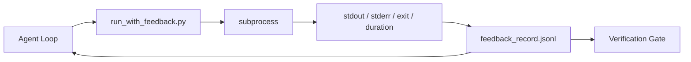

# Pętle sprzężenia zwrotnego środowiska wykonawczego

> Agenci często działają bez wglądu w rzeczywiste rezultaty uruchamianych poleceń. Mechanizm sprzężenia zwrotnego (feedback runner) zapisuje strumienie stdout, stderr, kod wyjścia oraz czas wykonania do ustrukturyzowanego rekordu, z którego agent może skorzystać w kolejnej turze. Dzięki temu model opiera swoje działania na faktach, a nie na własnych wyobrażeniach o nich.

**Typ:** Kompilacja
**Języki:** Python (stdlib)
**Wymagania wstępne:** Faza 14 · 32 (Minimalne środowisko warsztatowe), Faza 14 · 35 (Skrypt inicjujący)
**Czas:** ~50 minut

## Cele nauczania

- Odróżnienie sprzężenia zwrotnego w czasie rzeczywistym (runtime feedback) od telemetrii i obserwowalności (observability).
- Zbudowanie modułu uruchamiającego (feedback runner), który opakowuje polecenia powłoki i zapisuje ustrukturyzowane rekordy.
- Deterministyczne skracanie (obcinanie) zbyt długich danych wyjściowych, aby zmieścić się w budżecie tokenów.
- Blokowanie dalszego działania agenta w przypadku braku informacji zwrotnej.

## Problem

Agent deklaruje: „Uruchamiam testy”. W kolejnym kroku twierdzi: „Wszystkie testy zakończyły się sukcesem”. W rzeczywistości jednak żaden test nie został wykonany. Agent albo zmyślił wynik, albo uruchomił polecenie i nie odczytał jego rezultatu, albo też odczytał go, lecz zignorował lub po cichu usunął informację o błędzie.

Moduł sprzężenia zwrotnego (feedback runner) eliminuje tę lukę. Każde polecenie przechodzi przez ten moduł. Każdy rekord zawiera uruchomione polecenie, przechwycone strumienie stdout i stderr, kod wyjścia, rzeczywisty czas wykonania oraz krótką notatkę agenta. Agent odczytuje ten rekord w kolejnej turze, a bramka weryfikacyjna analizuje zebrane logi po zakończeniu zadania.

## Koncepcja



### Co zawiera rekord sprzężenia zwrotnego

| Pole | Dlaczego to ważne |
|------|----------------|
| `command` | Dokładna tablica argumentów (argv), zapobiegająca nieoczekiwanemu rozwijaniu zmiennych przez powłokę |
| `stdout_tail` | Ostatnie N linii, obcięte w sposób deterministyczny |
| `stderr_tail` | Ostatnie N linii strumienia błędów, oddzielone od stdout |
| `exit_code` | Jednoznaczny kod statusu (sukces/błąd) |
| `duration_ms` | Ujawnia wolno działające skrypty i zawieszone procesy |
| `started_at` | Znacznik czasu umożliwiający odtworzenie przebiegu |
| `agent_note` | Jednozdaniowy opis oczekiwanego rezultatu, zapisany przez agenta przed uruchomieniem polecenia |

### Deterministyczne skracanie danych wyjściowych

Plik logu o rozmiarze 50 MB potrafi zablokować pętlę agenta. Biegacz (runner) deterministycznie obcina początek i środek danych wyjściowych, wstawiając znacznik `...truncated N lines...`, dzięki czemu identyczne dane wyjściowe zawsze generują taki sam rekord. Nie stosuje się tu losowego próbkowania – kluczowe dla agenta informacje (takie jak podsumowanie czy treść błędu) znajdują się zazwyczaj na samym końcu strumienia.

### Sprzężenie zwrotne a telemetria

Telemetria (faza 14 · 23, konwencje OpenTelemetry GenAI) służy operatorom i ludziom do analizy działania systemu w czasie. Sprzężenie zwrotne (feedback) jest natomiast przeznaczone dla agenta na potrzeby jego kolejnego kroku w danej sesji. Choć oba mechanizmy korzystają z podobnych danych, są zapisywane w osobnych plikach i mają inny czas retencji.

### Blokada postępu w przypadku braku informacji zwrotnej

Jeśli biegacz napotka błąd przed przechwyceniem strumieni wyjściowych, rekord otrzyma status `exit_code: null` oraz komunikat `error: <reason>`. Pętla agenta must bezwzględnie zablokować dalsze kroki przy kodzie wyjścia `null`. Brak danych wyjściowych oznacza brak postępu.

## Implementacja

`code/main.py` implementuje:

- funkcję `run_with_feedback(command, agent_note)`, która opakowuje `subprocess.run`, przechwytuje strumienie stdout/stderr, kod wyjścia i czas trwania, deterministycznie skraca wyjście i zapisuje rekord w formacie JSONL w pliku `feedback_record.jsonl`.
- prosty parser wczytujący dane z pliku JSONL do listy obiektów w Pythonie.
- kod demonstracyjny, który wykonuje trzy różne polecenia (zakończone sukcesem, błędem oraz działające powoli) i wypisuje ostatni rekord dla każdego z nich.

Uruchomienie:

```
python3 code/main.py
```

Wynik: trzy rekordy sprzężenia zwrotnego dopisane do pliku `feedback_record.jsonl`, z których ostatnie linie zostaną wypisane na konsoli. Kolejne uruchomienia będą dopisywać nowe rekordy, ilustrując gromadzenie się historii w pętli.

## Wzorce produkcyjne w praktyce

Trzy poniższe wzorce pozwalają odpowiednio zabezpieczyć i przygotować runnera do pracy w środowisku produkcyjnym.

**Ukrywanie danych wrażliwych (redagowanie) podczas zapisu, a nie odczytu.** Każdy rekord przechwytujący strumienie stdout lub stderr może przypadkowo zawierać sekrety. Biegacz powinien filtrować i maskować wrażliwe dane przed zapisaniem ich do pliku JSONL, sprawdzając dopasowania do wzorców takich jak: `^Bearer `, `password=`, `api[_-]?key=`, `AKIA[0-9A-Z]{16}` (AWS) czy `xox[baprs]-` (Slack). Próba ukrywania danych dopiero podczas odczytu jest ryzykowna – niezaszyfrowany plik na dysku to łatwy cel dla atakującego. Należy regularnie weryfikować reguły maskowania pod kątem nowych formatów sekretów pojawiających się w logach.

**Stosowanie rotacji logów zamiast jednego dużego pliku.** Ogranicz rozmiar pliku `feedback_record.jsonl` (np. do 1 MB). Po przekroczeniu tego limitu dokonaj rotacji (np. zmieniając nazwę na `.1`, `.2` i usuwając najstarsze, np. powyżej `.5`). Pętla agenta powinna odczytywać wyłącznie bieżący plik logu, co zapobiega narzutowi wydajnościowemu. Kompletny zestaw zrotowanych plików może być przesyłany do magazynu artefaktów CI. Bez rotacji wczytywanie pliku stawałoby się coraz wolniejsze z każdym kolejnym krokiem.

**Identyfikator powiązania (parent ID) dla kolejnych prób.** Każdy rekord powinien posiadać unikalny `command_id`, a ponowne próby wykonania polecenia powinny zawierać pole `parent_command_id` wskazujące na wcześniejszą próbę. Pozwala to na śledzenie łańcucha zdarzeń przez bramkę weryfikacyjną lub recenzenta (faza 14 · 40). Bez takiego powiązania kolejne próby wyglądałyby jak niezależne polecenia, co maskowałoby historię błędów przed audytem.

## Zastosowanie

Wzorce produkcyjne:

- **Narzędzie Bash w Claude Code.** To narzędzie natywnie przechwytuje strumienie wyjściowe, status zakończenia oraz czas wykonania. Implementowany w tej lekcji runner stanowi uniwersalny wzorzec, który można przenieść do dowolnego systemu agentowego.
- **Węzły LangGraph.** Opakowanie węzłów wykonujących polecenia powłoki w moduł runnera pozwala przechowywać szczegółowe logi bez niepotrzebnego obciążania stanu samego grafu (state).
- **Logi w CI/CD.** Zapisywanie pliku JSONL jako artefaktu w potoku CI pozwala recenzentom dokładnie prześledzić i odtworzyć kroki agenta bez potrzeby ponownego uruchamiania całego środowiska.

Narzędzie uruchamiające (runner) stanowi minimalistyczną nakładkę, która nie ulegnie przedawnieniu przy zmianach architektury, gdyż odpowiada wyłącznie za strukturę pojedynczego rekordu.

## Wdrożenie

`outputs/skill-feedback-runner.md` tworzy dopasowany do projektu skrypt `run_with_feedback.py` zawierający zdefiniowany limit skracania danych wyjściowych, moduł zapisu JSONL powiązany ze środowiskiem roboczym oraz loader, z którego agent korzysta na każdym kroku pętli.

## Ćwiczenia

1. Add pole `cwd` do każdego rekordu, aby odróżnić to samo polecenie uruchomione w różnych katalogach roboczych.
2. Zaimplementuj funkcję redagowania (`redaction`), która usuwa linie pasujące do wzorców `^Bearer ` lub `password=`. Przeprowadź test na danych testowych.
3. Ogranicz maksymalny rozmiar pliku `feedback_record.jsonl` do 1 MB i zaimplementuj rotację do plików z przyrostkiem `.1`, `.2` itd. Uzasadnij przyjętą strategię rotacji.
4. Wprowadź pole `parent_command_id`, aby powiązać próby ponownego uruchomienia: wskaż, które polecenie wygenerowało dane wyjściowe analizowane przez kolejny krok.
5. Przekieruj strumień JSONL do prostego interfejsu tekstowego (TUI), który wyróżnia ostatnie polecenia zakończone niezerowym kodem wyjścia. Wymień osiem cech niezbędnych, aby takie TUI było przydatne podczas inspekcji kodu.

## Kluczowe terminy

| Termin | Co ludzie mówią | Co to właściwie oznacza |
|------|----------------|--------------------------------------|
| Rekord sprzężenia zwrotnego (feedback record) | „Log uruchomienia” | Ustrukturyzowany wpis w formacie JSONL zawierający polecenie, strumienie wyjściowe, kod wyjścia i czas trwania |
| Obcinanie danych (truncation) | „Skracanie logów” | Deterministyczne zachowanie początku i końca danych wyjściowych, aby zmieścić rekord w budżecie tokenów |
| Blokada przy braku statusu (exit null) | „Blokada pustego wyniku” | Zatrzymanie działania pętli agenta, gdy `exit_code` jest niezdefiniowany (null) |
| Notatka agenta (agent note) | „Deklaracja celu” | Krótkie określenie oczekiwanego rezultatu, zapisywane przez agenta przed wykonaniem operacji |
| Rozdzielenie danych (telemetry split) | „Rozdział logów” | Prowadzenie osobnych danych na potrzeby kolejnych kroków agenta (feedback) oraz na potrzeby analizy przez operatora (telemetria) |

## Dalsze czytanie

- [Konwencje semantyczne OpenTelemetry GenAI](https://opentelemetry.io/docs/specs/semconv/gen-ai/)
- [Anthropic, Sprawne środowiska uruchomieniowe dla długo działających agentów](https://www.anthropic.com/engineering/effective-harnesses-for-long-running-agents)
- [Guardrails AI x MLflow — deterministyczne bezpieczeństwo, PII, walidatory jakości](https://guardrailsai.com/blog/guardrails-mlflow) — wzorce redagowania jako testy regresyjne
- [Aport.io, Najlepsze zabezpieczenia agentów AI 2026: porównanie autoryzacji przed akcją](https://aport.io/blog/best-ai-agent-guardrails-2026-pre-action-authorization-compared/) — przechwytywanie logów przed i po użyciu narzędzia
- [Andrii Furmanets, Agenci AI w 2026 r.: Praktyczna architektura narzędzi, pamięci, ocen, poręczy](https://andriifurmanets.com/blogs/ai-agents-2026-practical-architecture-tools-memory-evals-guardrails) — obszary obserwowalności
- Faza 14 · 23 – Konwencje OpenTelemetry GenAI po stronie telemetrii
- Faza 14 · 24 – platformy obserwowalności agentów (Langfuse, Phoenix, Opik)
- Faza 14 · 33 – reguła wymagająca informacji zwrotnej przed stwierdzeniem wykonania
- Faza 14 · 38 – bramka weryfikacyjna odczytująca JSONL
