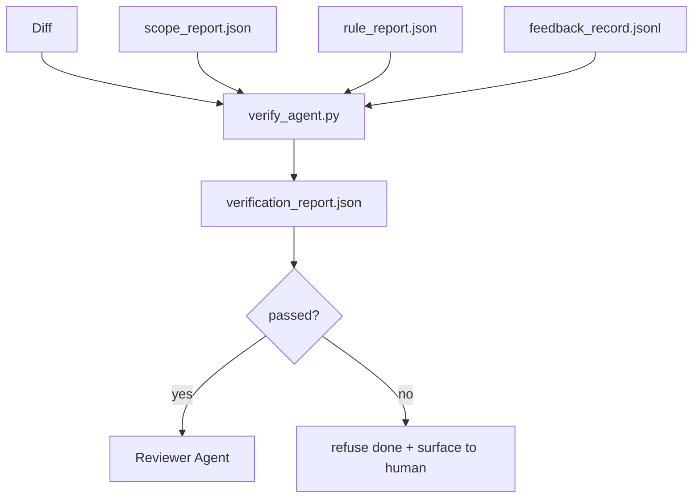

# Bramy weryfikacyjne

> Agent nie może oznaczać swojej pracy jako wykonanej. Bramka weryfikacyjna odczytuje umowę zakresu, dziennik opinii, raport reguły i różnicę, a następnie odpowiada na jedno pytanie: czy to zadanie rzeczywiście zostało ukończone? Jeśli brama powie „nie”, zadanie nie zostanie wykonane, niezależnie od tego, co mówi czat.

**Typ:** Kompilacja
**Języki:** Python (stdlib)
**Wymagania wstępne:** Faza 14 · 33 (Zasady), Faza 14 · 36 (Zakres), Faza 14 · 37 (Opinia zwrotna)
**Czas:** ~55 minut

## Cele nauczania

- Zdefiniuj bramkę weryfikacyjną jako funkcję deterministyczną względem artefaktów środowiska warsztatowego.
- Połącz raport reguł, raport zakresu, zapisy opinii i różnicę w jeden werdykt.
- Wyślij `verification_report.json`, który zarówno agent recenzenta, jak i CI mogą przeczytać.
- Odmów przyspieszenia zadania w przypadku jakiejkolwiek awarii dotyczącej ważności bloku, bez wyjątku.

## Problem

Agenci zbyt łatwo ogłaszają sukces. Dominują trzy kształty awarii:

- „Wygląda dobrze”. Model odczytał swoją różnicę i zdecydował, że jest prawidłowa.
- „Testy zaliczone”. Powiedział z przekonaniem. Brak zapisu o faktycznym przebiegu testu.
- „Akceptacja spełniona”. Kryteria akceptacji interpretowane na tyle luźno, że oznaczają „wszystko, co przypomina zrobione”.

Poprawka środowiska roboczego to pojedyncza bramka weryfikacyjna, która odczytuje artefakty już wytworzone przez agenta i wykonuje połączenie. Brama jest deterministyczna. Brama jest pod kontrolą wersji. Brama jest podłączona do CI. Agent nie może go przekupić.

## Koncepcja



### Co sprawdza brama

| Sprawdź | Artefakt źródłowy | Dotkliwość |
|-------|-----------------|---------|
| Wszystkie polecenia akceptacji zostały uruchomione | `feedback_record.jsonl` | blok |
| Wszystkie polecenia akceptacji zakończyły się zerem | `feedback_record.jsonl` | blok |
| Kontrola zakresu nie zawiera zabronionych zapisów | `scope_report.json` | blok |
| Kontrola zakresu nie zawiera zapisów spoza zakresu | `scope_report.json` | blokuj lub ostrzegaj |
| Wszystkie reguły ważności bloków przechodzą | `rule_report.json` | blok |
| Brak `null` kodów wyjścia w opinii | `feedback_record.jsonl` | blok |
| Dotknięte pliki odpowiadają `scope.allowed_files` | oba | ostrzegam |

Wynik `warn` zawiera adnotację do wyroku; wynik `block` uniemożliwia `passed: true`.

### Deterministyczny, a nie probabilistyczny

Brama musi za każdym razem wydawać ten sam werdykt w sprawie tego samego zestawu artefaktów. Brak sędziów LLM. Sędziowie LLM należą po stronie recenzentów (faza 14 · 39), gdzie celem jest ocena jakościowa, a nie status.

### Jeden raport, jedna ścieżka

Bramka emituje jeden `verification_report.json` na zakończenie zadania, zapisany w `outputs/verification/<task_id>.json`. CI zużywa tę samą ścieżkę. Wiele bram o różnych ścieżkach rozwidla źródło prawdy.

### Odmów bez wyjątku

Agent nie może zastąpić ustaleń dotyczących ważności bloku. Może je zastąpić jedynie człowiek posiadający zarejestrowany `override_reason` i identyfikator użytkownika `overridden_by`. Zastąpienie to podpisana zmiana, a nie decyzja agenta.

## Zbuduj to

`code/main.py` implementuje:

- Program ładujący dla każdego artefaktu wejściowego, wszystkie lokalnie zakotwiczone, więc lekcja jest samodzielna.
- `verify(task_id, artifacts) -> VerdictReport` czysta funkcja.
- Drukarka pokazująca wyniki poszczególnych kontroli i końcowy wynik pozytywny/negatywny.
- Demo z trzema scenariuszami zadań: czyste przejście, zwiększenie zakresu, brak akceptacji.

Uruchom to:

```
python3 code/main.py
```

Wynik: trzy raporty z werdyktem, każdy zapisany obok scenariusza.

## Wzorce produkcji na wolności

Cztery wzory podnoszą bramę z „kolejnej pracy” do „decydującej krawędzi”.

**Dogłębna obrona, a nie pojedyncza bramka.** Zaczep przed zatwierdzeniem → Sprawdzanie statusu CI → Zaczep do autoryzacji przed użyciem narzędzia → Brama przed połączeniem. Każda warstwa jest deterministyczna, więc awaria w jednej warstwie jest wychwytywana przez następną. Poradnik microservices.io z marca 2026 r. jest jednoznaczny: haka przed zatwierdzeniem nie można ominąć, ponieważ w przeciwieństwie do umiejętności po stronie modelu nie zależy to od tego, czy agent wykonuje instrukcje. Brama weryfikacyjna znajduje się w warstwie CI/przed połączeniem.

**Obrona poprzez kontrolę deterministyczną, ocena modelu tylko pod kątem niuansów.** Parowanie Normy Hybrydowej Anthropic 2026: weryfikowalne nagrody (testy jednostkowe, kontrole schematu, kody wyjścia) odpowiedź „czy kod rozwiązał problem?” — Odpowiedź rubryk LLM „czy kod jest czytelny, bezpieczny i zgodny ze stylem?” Brama obsługuje pierwszą klasę; recenzent (faza 14 · 39) prowadzi drugą. Mieszanie ich załamuje sygnał.

**Podpisany dziennik zastąpień, a nie wątki Slack.** Każde przesłonięcie generuje wiersz w `outputs/verification/overrides.jsonl` zawierający: znacznik czasu, znaleziony kod, przyczynę, podpisującego użytkownika, bieżące zatwierdzenie HEAD. Środowisko wykonawcze odrzuca wszelkie zastąpienia bez podpisu; ścieżka audytu jest śledzona przez git. Jest to granica pomiędzy polityką obejścia a teatrem obejścia.

**Dolny poziom pokrycia jako czek pierwszej klasy.** `coverage_report.json` zasila czek `coverage_floor` (domyślnie 80%). Bramka nie działa, jeśli zmierzone pokrycie spadnie poniżej dolnej granicy lub poniżej dolnej granicy poprzedniego scalania o więcej niż 1 punkt procentowy. Bez tej kontroli agenci po cichu usuwają testy, które zakończyły się niepowodzeniem, a raporty z weryfikacji pozostają zielone.

**`--strict` tryb promuje ostrzeżenia do bloków.** W przypadku rozgałęzień wersji, PR blokujących statki lub selekcji po incydencie, `--strict` sprawia, że ​​każde ostrzeżenie jest poważnym niepowodzeniem. Flaga jest akceptowana przez oddział; nie jest to globalne ustawienie domyślne, ponieważ rygorystyczne przestrzeganie wszystkiego zakłóca codzienny przepływ pracy.

## Użyj tego

Wzory produkcyjne:

- **Krok CI.** Zadanie `verify_agent` uruchamia bramę przed końcowymi artefaktami agenta. Zabezpieczenie przed połączeniem odrzuca bez `passed: true`.
- **Przechwyt przed przekazaniem.** Środowisko wykonawcze agenta wywołuje bramę przed wygenerowaniem dokumentu przekazania. Żadnego zielonego wyroku, żadnego przekazania.
- **Ręczna segregacja.** Operatorzy czytają raport, gdy agent twierdzi, że odniósł sukces, a człowiek go podejrzewa.

Brama jest decydującą przewagą w przepływie pracy na stole warsztatowym. Każda inna powierzchnia znajduje się powyżej niej.

## Wyślij to

`outputs/skill-verification-gate.md` łączy bramę z konkretnym projektem: jakie polecenia akceptacji ją zasilają, jakie reguły mają ważność bloków, jakie zapisy poza zakresem są tolerowane, w jaki sposób przechowywany jest dziennik kontroli przesłonięć.

## Ćwiczenia

1. Dodaj opcję `coverage_floor`: polecenie testowe musi generować raport pokrycia co najmniej w 80%. Zdecyduj, który artefakt dźwiga podłogę.
2. Obsługuje tryb `--strict`, który promuje każdy `warn` do `block`. Udokumentuj przypadki, w których tryb ścisły jest właściwym ustawieniem domyślnym.
3. Spraw, aby brama wygenerowała podsumowanie Markdown oprócz JSON. Broń, które pola należą do podsumowania.
4. Dodaj opcję `time_since_last_human_touch`: każdy plik edytowany w ciągu 60 sekund od naciśnięcia klawisza przez człowieka nie jest objęty flagami spoza zakresu.
5. Uruchom bramę na prawdziwym agencie różniącym się od Twojego produktu. Ile odkryć jest prawdziwych, a ile szumu? Gdzie brama musi rosnąć?

## Kluczowe terminy

| Termin | Co ludzie mówią | Co to właściwie oznacza |
|------|----------------|--------------------------------------|
| Bramka weryfikacyjna | „Czek, który wszystko zatrzymuje” | Funkcja deterministyczna na artefaktach środowiska warsztatowego generująca werdykt pozytywny/negatywny |
| Dotkliwość bloku | „Trudna porażka” | Wynik, który uniemożliwia `passed: true` i wymaga podpisanego zastąpienia |
| Zastąp dziennik | „Dlaczego to przepuściliśmy” | Podpisane wpisy z powodem i identyfikatorem użytkownika, sprawdzone przez recenzję |
| Polecenie akceptacji | „Dowód” | Polecenie powłoki, którego wyjście zerowe oznacza `done` |
| Jedna ścieżka raportu | „Źródło prawdy” | `outputs/verification/<task_id>.json`, konsumowany zarówno przez CI, jak i ludzi |

## Dalsze czytanie

- [Anthropic, projekt uprzęży do długotrwałego tworzenia aplikacji](https://www.anthropic.com/engineering/harness-design-long-running-apps)
- [Poręcze zabezpieczające OpenAI Agents SDK](https://platform.openai.com/docs/guides/agents-sdk/guardrails)
- [microservices.io, platforma programistyczna GenAI: poręcze](https://microservices.io/post/architecture/2026/03/09/genai-development-platform-part-1-development-guardrails.html) — dogłębna obrona między pre-commit a CI
- [ICMD, Podręcznik 2026 dla Agentic AI Ops](https://icmd.app/article/the-2026-playbook-for-agentic-ai-ops-guardrails-costs-and-reliability-at-scale-1776661990431) — drabina bramek zatwierdzeń (wersja robocza → zatwierdzenie → automatyczne poniżej progów)
— [Zgodność sprawdzona typu: Deterministyczne poręcze (arXiv 2604.01483)](https://arxiv.org/pdf/2604.01483) — Lean 4 jako górna granica bramkowania deterministycznego
- [logi-cmd/agent-guardrails — specyfikacja bramki scalającej](https://github.com/logi-cmd/agent-guardrails) — zakres + bramki testujące mutacje
- [Guardrails AI x MLflow](https://guardrailsai.com/blog/guardrails-mlflow) — deterministyczne walidatory jako osoby oceniające CI
- [Akira, Poręcze działające w czasie rzeczywistym dla systemów agentowych](https://www.akira.ai/blog/real-time-guardrails-agentic-systems) — bramy przed/po narzędziu
- Faza 14 · 27 – natychmiastowa obrona zastrzykowa (para przeciwników bramy)
- Faza 14 · 36 – kontrakt dotyczący zakresu, jaki wymusza ta bramka
- Faza 14 · 37 — dziennik informacji zwrotnych o wynikach tej bramki
- Faza 14 · 39 – agent recenzenta, któremu przekazuje bramę