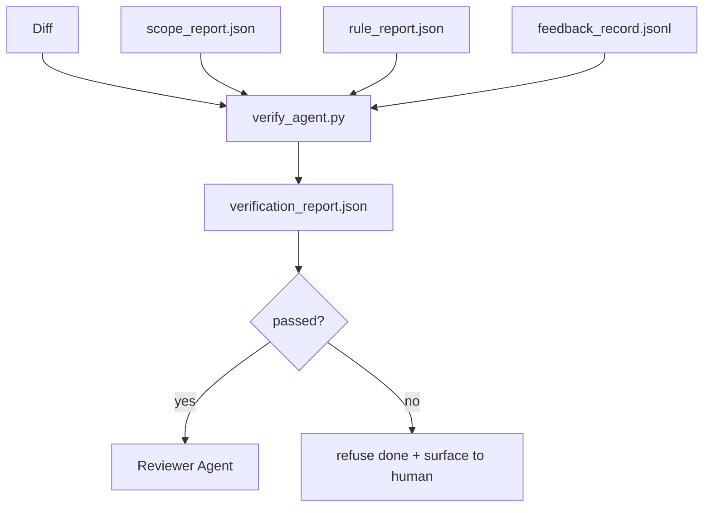

# Bramy weryfikacyjne

> Agent nie może samodzielnie decydować o zakończeniu swojej pracy. Bramka weryfikacyjna (verification gate) analizuje umowę dotyczącą zakresu (scope contract), logi sprzężenia zwrotnego (feedback records), raport z reguł (rule report) oraz zestaw zmian (diff), a następnie odpowiada na kluczowe pytanie: czy zadanie zostało faktycznie ukończone? Jeśli bramka wyda werdykt odmowny, zadanie nie zostanie uznane za wykonane, niezależnie od zapewnień na czacie.

**Typ:** Kompilacja
**Języki:** Python (stdlib)
**Wymagania wstępne:** Faza 14 · 33 (Zasady jako ograniczenia), Faza 14 · 36 (Umowy zakresu), Faza 14 · 37 (Pętle sprzężenia zwrotnego)
**Czas:** ~55 minut

## Cele nauczania

- Zdefiniowanie bramki weryfikacyjnej jako funkcji deterministycznej operującej na artefaktach środowiska roboczego.
- Integracja raportu reguł, raportu zakresu, rekordów sprzężenia zwrotnego i zmian (diff) w jeden spójny werdykt.
- Generowanie raportu `verification_report.json`, przeznaczonego do odczytu zarówno dla agenta-recenzenta, jak i systemów CI.
- Bezwzględne blokowanie dalszego postępu zadania w przypadku jakiegokolwiek naruszenia o krytycznym poziomie istotności (block/hard fail).

## Problem

Agenci zbyt łatwo uznają zadanie za zakończone sukcesem. Najczęściej dochodzi do trzech rodzajów błędów:

- „Wygląda w porządku”: Model przeanalizował własne zmiany (diff) i uznał, że są poprawne.
- „Testy zakończone sukcesem”: Agent zapewnia o tym z pełnym przekonaniem, mimo braku jakichkolwiek logów potwierdzających rzeczywiste uruchomienie testów.
- „Kryteria akceptacji spełnione”: Zbyt luźna interpretacja kryteriów, w wyniku której za wykonane uznaje się cokolwiek, co choć trochę przypomina oczekiwany rezultat.

Rozwiązaniem jest wdrożenie w środowisku roboczym niezależnej bramki weryfikacyjnej, która analizuje artefakty wytworzone przez agenta i podejmuje decyzję. Bramka działa deterministycznie, podlega kontroli wersji i jest zintegrowana z CI. Agent nie ma możliwości jej obejścia.

## Koncepcja



### Co sprawdza bramka weryfikacyjna

| Sprawdzany warunek | Artefakt źródłowy | Poziom błędu (Severity) |
|-------|-----------------|---------|
| Wszystkie polecenia testowe akceptacji zostały uruchomione | `feedback_record.jsonl` | blokada (block) |
| Wszystkie polecenia testowe akceptacji zakończyły się kodem 0 | `feedback_record.jsonl` | blokada (block) |
| Raport z analizy zakresu (scope check) nie wykazuje modyfikacji plików zabronionych | `scope_report.json` | blokada (block) |
| Raport z analizy zakresu nie wykazuje zmian wykraczających poza dozwolony zakres | `scope_report.json` | blokada (block) lub ostrzeżenie (warn) |
| Wszystkie reguły o krytycznym statusie zostały spełnione | `rule_report.json` | blokada (block) |
| Brak statusu `null` w logach wykonania poleceń (feedback) | `feedback_record.jsonl` | blokada (block) |
| Lista zmodyfikowanych plików odpowiada regułom `scope.allowed_files` | oba powyższe | ostrzeżenie (warn) |

Wynik `warn` dodaje adnotację do raportu; status `block` bezwzględnie uniemożliwia ustawienie flagi `passed: true`.

### Deterministyczna, a nie probabilistyczna walidacja

Bramka musi zawsze zwracać identyczny wynik dla tego samego zestawu artefaktów. Na tym etapie nie stosuje się oceny przez modele LLM. Walidacja z użyciem LLM jest domeną recenzentów (faza 14 · 39), gdzie celem jest ocena jakościowa kodu, a nie zero-jedynkowa weryfikacja statusu.

### Jeden raport, jedna ścieżka zapisu

Bramka generuje jeden raport `verification_report.json` na koniec zadania i zapisuje go w lokalizacji `outputs/verification/<task_id>.json`. System CI odczytuje dane z tej samej ścieżki. Definiowanie wielu bramek o różnych strukturach i ścieżkach zapisu rozbija jedno źródło prawdy.

### Brak wyjątków przy blokadach

Agent nie ma uprawnień do ignorowania lub nadpisywania wykrytych naruszeń o statusie blokady. Obejście reguł może zostać dokonane wyłącznie przez człowieka poprzez podanie uzasadnienia (`override_reason`) oraz identyfikatora (`overridden_by`). Nadpisanie to formalnie zatwierdzona i podpisana modyfikacja, a nie arbitralna decyzja agenta.

## Implementacja

`code/main.py` implementuje:

- parser dla każdego z artefaktów wejściowych (wszystkie ścieżki powiązane są lokalnie, dzięki czemu lekcja jest w pełni autonomiczna).
- czystą funkcję `verify(task_id, artifacts) -> VerdictReport`.
- moduł wizualizacji prezentujący rezultaty poszczególnych testów oraz ostateczny werdykt (sukces/błąd).
- demonstrację trzech scenariuszy: pomyślnego przejścia weryfikacji, przekroczenia zakresu oraz braku uruchomienia testów akceptacyjnych.

Urunhomienie:

```
python3 code/main.py
```

Wynik: trzy raporty z werdyktami, każdy zapisany w katalogu roboczym.

## Wzorce produkcyjne w praktyce

Cztery poniższe wzorce podnoszą bramkę weryfikacyjną z roli zwykłego narzędzia do rangi kluczowego elementu kontroli jakości.

**Wielopoziomowa obrona (defense in depth) zamiast pojedynczego punktu kontroli.** Schemat kontroli: hook przed commitem → weryfikacja statusu w CI → autoryzacja przed użyciem narzędzia (pre-action hook) → bramka przed scaleniem (pre-merge gate). Każdy poziom działa deterministycznie, dzięki czemu ewentualne przeoczenie na jednym etapie jest wychwytywane na kolejnym. W opracowaniu microservices.io z marca 2026 roku wskazano jednoznacznie: hooka przed commitem nie da się pominąć, ponieważ w przeciwieństwie do instrukcji w promptach nie polega on na posłuszeństwie modelu. Bramka weryfikacyjna stanowi ostateczny filtr w potoku CI i przed scaleniem kodu.

**Rozdział walidacji: testy deterministyczne jako twarda bariera, modele LLM tylko do oceny niuansów.** Wzór Hybrydowej Walidacji (Anthropic 2026) zaleca: weryfikowalne kryteria (testy jednostkowe, zgodność schematów, kody wyjścia) dają jednoznaczną odpowiedź na pytanie „czy kod działa i spełnia wymagania techniczne?”. Z kolei ocena opisowa modelu LLM odpowiada na pytanie „czy kod jest czytelny, bezpieczny i zgodny ze stylem?”. Bramka weryfikacyjna realizuje pierwszy etap, podczas gdy recenzent (faza 14 · 39) zajmuje się drugim. Łączenie tych zadań zniekształca sygnał zwrotny.

**Rejestr nadpisań (override log) zamiast ustaleń na komunikatorach.** Każde obejście reguł generuje wpis w pliku `outputs/verification/overrides.jsonl` zawierający: znacznik czasu, kod błędu, uzasadnienie, identyfikator podpisującego użytkownika oraz hash commitu HEAD. Środowisko uruchomieniowe bezwzględnie odrzuca wszelkie próby nadpisania pozbawione podpisu, a pełna ścieżka audytu jest rejestrowana w systemie Git. Tworzy to wyraźną granicę między przemyślaną procedurą a pozorowaniem kontroli.

**Wymóg pokrycia testami (coverage floor) jako kluczowy warunek.** Dane z pliku `coverage_report.json` zasilają mechanizm weryfikacji pokrycia (domyślnie min. 80%). Bramka odrzuca kod, jeśli pokrycie testami spadnie poniżej ustalonego progu lub zmniejszy się o więcej niż 1 punkt procentowy w porównaniu z poprzednim scaleniem. Bez tego mechanizmu agenci mogliby po cichu usuwać niedziałające testy, aby uzyskać fałszywy zielony status weryfikacji.

**Tryb rygorystyczny (`--strict`) podnosi status ostrzeżeń do błędów blokujących.** W przypadku wydań produkcyjnych (release branches), krytycznych poprawek (hotfixes) lub weryfikacji poawaryjnej, flaga `--strict` sprawia, że każde ostrzeżenie jest traktowane jako błąd blokujący scalenie. Reguła ta jest konfigurowana na poziomie gałęzi (branch); nie powinna być globalnym ustawieniem domyślnym, aby nie paraliżować codziennej pracy deweloperskiej.

## Zastosowanie

Wzorce produkcyjne:

- **Krok w potoku CI.** Zadanie `verify_agent` uruchamia bramkę weryfikacyjną na artefaktach wejściowych wyprodukowanych przez agenta. Bramka blokuje scalenie kodu, jeśli raport nie zawiera flagi `passed: true`.
- **Hook przed przekazaniem zadania (pre-handoff hook).** Środowisko uruchomieniowe agenta uruchamia weryfikację przed wygenerowaniem dokumentu przekazania prac. Brak pozytywnego werdyktu blokuje proces przekazania.
- **Weryfikacja manualna.** Operatorzy analizują raport w sytuacjach, gdy deklaracja sukcesu ze strony agenta budzi wątpliwości zespołu.

Bramka weryfikacyjna stanowi fundament kontroli jakości w pracy ze środowiskiem roboczym. Wszystkie pozostałe poziomy analizy są na niej nadbudowane.

## Wdrożenie

`outputs/skill-verification-gate.md` dostosowuje bramkę weryfikacyjną do specyfiki konkretnego projektu: definiuje polecenia testowe akceptacji, reguły o charakterze blokującym, dopuszczalny margines modyfikacji poza zakresem oraz strukturę rejestru nadpisań (override log).

## Ćwiczenia

1. Dodaj opcję `coverage_floor`: testy akceptacyjne muszą wykazać pokrycie kodu na poziomie co najmniej 80%. Zdecyduj, z którego artefaktu należy odczytywać te dane.
2. Zaimplementuj obsługę trybu `--strict`, który podnosi status każdego ostrzeżenia (`warn`) do błędu blokującego (`block`). Udokumentuj sytuacje, w których ten tryb powinien być włączony domyślnie.
3. Rozbuduj bramkę tak, aby oprócz formatu JSON generowała czytelne podsumowanie w formacie Markdown. Uzasadnij wybór informacji prezentowanych w podsumowaniu.
4. Wprowadź regułę `time_since_last_human_touch`: wszelkie modyfikacje w plikach dokonane w ciągu 60 sekund od ostatniej interakcji człowieka (np. edycji kodu przez programistę) are wyłączone z reguł wykrywania zmian spoza zakresu.
5. Przetestuj działanie bramki weryfikacyjnej na rzeczywistym agencie modyfikującym kod. Jaki odsetek zgłoszeń stanowią realne błędy, a jaki fałszywe alarmy (szum)? W jakich obszarach bramka wymaga dalszego rozwoju?

## Kluczowe terminy

| Termin | Co ludzie mówią | Co to właściwie oznacza |
|------|----------------|--------------------------------------|
| Bramka weryfikacyjna (verification gate) | „Ostateczny test” | Deterministyczna funkcja analizująca artefakty środowiska roboczego i wydająca werdykt (sukces/błąd) |
| Status blokujący (block severity) | „Błąd krytyczny” | Wynik weryfikacji, który uniemożliwia zatwierdzenie zmian (`passed: true`) i wymaga autoryzowanego nadpisania |
| Rejestr nadpisań (override log) | „Dziennik wyjątków” | Podpisane i uzasadnione wpisy o pominięciu reguł wraz z identyfikatorem użytkownika, poddawane późniejszemu audytowi |
| Polecenie akceptacyjne (acceptance command) | „Test zaliczający” | Polecenie powłoki, którego zerowy kod wyjścia (exit 0) potwierdza prawidłowe wykonanie zadania |
| Jedna ścieżka raportu (single report path) | „Jedno źródło prawdy” | Wspólny plik `outputs/verification/<task_id>.json` wykorzystywany zarówno przez system CI, jak i recenzentów |

## Dalsze czytanie

- [Anthropic, projekt uprzęży do długotrwałego tworzenia aplikacji](https://www.anthropic.com/engineering/harness-design-long-running-apps)
- [Poręcze zabezpieczające OpenAI Agents SDK](https://platform.openai.com/docs/guides/agents-sdk/guardrails)
- [microservices.io, platforma deweloperska GenAI: poręcze ochronne](https://microservices.io/post/architecture/2026/03/09/genai-development-platform-part-1-development-guardrails.html) — wielopoziomowa obrona między pre-commitem a CI
- [ICMD, Podręcznik 2026 dla Agentic AI Ops](https://icmd.app/article/the-2026-playbook-for-agentic-ai-ops-guardrails-costs-and-reliability-at-scale-1776661990431) — drabina bramek zatwierdzeń (wersja robocza → zatwierdzenie → automatyczne poniżej progów)
- [Zgodność sprawdzona typem: Deterministyczne poręcze (arXiv 2604.01483)](https://arxiv.org/pdf/2604.01483) — Lean 4 jako górna granica bramkowania deterministycznego
- [logi-cmd/agent-guardrails — specyfikacja bramki scalającej](https://github.com/logi-cmd/agent-guardrails) — zakres + bramki testujące mutacje
- [Guardrails AI x MLflow](https://guardrailsai.com/blog/guardrails-mlflow) — deterministyczne walidatory jako osoby oceniające CI
- [Akira, Poręcze działające w czasie rzeczywistym dla systemów agentowych](https://www.akira.ai/blog/real-time-guardrails-agentic-systems) — bramy przed/po narzędziu
- Faza 14 · 27 – natychmiastowa obrona przed wstrzykiwaniem instrukcji (para przeciwników bramy)
- Faza 14 · 36 – kontrakt dotyczący zakresu, jaki wymusza ta bramka
- Faza 14 · 37 — dziennik informacji zwrotnych o wynikach tej bramki
- Faza 14 · 39 – agent recenzenta, któremu przekazuje bramę
