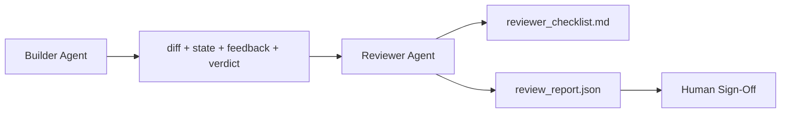

# Agent recenzenta: Oddziel konstruktora od znacznika

> Agent, który napisał kod, nie może go oceniać. Recenzent to druga pętla z innym monitem systemowym, innym celem i dostępem tylko do odczytu do wszystkiego, co stworzył konstruktor. Największą niezawodność stanowi różnica między konstruktorem a recenzentem.

**Typ:** Kompilacja
**Języki:** Python (stdlib)
**Wymagania wstępne:** Faza 14 · 38 (brama weryfikacyjna)
**Czas:** ~55 minut

## Cele nauczania

- Wyjaśnij, dlaczego ten sam agent nie może wiarygodnie ocenić swojej własnej pracy.
- Zbuduj pętlę agenta recenzenta, która zużywa artefakty konstruktora i generuje ustrukturyzowany raport z recenzji.
- Napisz rubrykę recenzenta, która ocenia konkretne wymiary, a nie wibracje.
- Podłącz recenzenta do stołu roboczego, aby etap przeglądu ręcznego rozpoczynał się od prawdziwego artefaktu.

## Problem

Prosisz agenta o naprawienie błędu. Edytuje cztery pliki, uruchamia testy i sporządza raporty. Bramka weryfikacyjna (faza 14 · 38) potwierdza przebieg akceptacji i utrzymanie zakresu. Brama mówi `passed: true`. Łączysz. Dwa dni później okazuje się, że poprawka rozwiązała niewłaściwą połowę błędu.

Akceptacja jest konieczna, ale nie wystarczająca. Recenzent zadaje pytania, których akceptacja nie może zadać: czy rozwiązało to właściwy problem? Czy rozszerzono zakres bez oznaczania go? Czy dokumentował założenia, które należało zakwestionować? Czy opuścił warsztat w stanie, który będzie mógł przyjąć następna sesja?

## Koncepcja



### Rubryka recenzenta

Pięć wymiarów, każdy z punktacją od 0 do 2.

| Wymiar | Pytanie |
|----------|----------|
| Problem z dopasowaniem | Czy zmiana rozwiązała zadanie zgodnie z opisem, a nie zadanie pobliskie? |
| Zakres dyscypliny | Czy zmiany ograniczały się do umowy, czy też umowa została celowo rozszerzona? |
| Założenia | Czy wszystkie ukryte założenia są gdzieś spisane i możliwe do sprawdzenia? |
| Jakość weryfikacji | Czy polecenie akceptacji rzeczywiście potwierdza cel, czy też okazało się słabszą wersją? |
| Gotowość do przekazania | Czy następna sesja może rozpocząć się od obecnego stanu? |

Razem na 10. Wynik poniżej 7 to miękka porażka; wynik poniżej 5 to ciężka porażka.

### Recenzent to osobna rola, a nie odrębny model

Możesz uruchomić recenzenta z tym samym modelem, co konstruktor. Dyscyplina polega na rozdzieleniu ról: inny monit systemowy, różne dane wejściowe, brak dostępu do zapisu w pliku różnicowym. Zmiana postawy jest zmianą sygnału.

### Recenzent nie może edytować różnicy

Recenzent czyta różnicę, stan, informację zwrotną, werdykt. Pisze raport. Nie łata różnicy. Jeśli raport mówi „napraw to”, następna tura budowniczego dokona naprawy; recenzent wraca do recenzowania. Mieszanie ról likwiduje tę lukę.

### Rubryka recenzenta a bramka weryfikacyjna

Bramka (faza 14 · 38) sprawdza deterministyczne fakty: czy przebiegła akceptacja, czy reguły zostały przyjęte, czy zakres się utrzymał. Recenzent dokonuje oceny jakościowej: czy była to właściwa praca, czy została udokumentowana, czy przekazanie dało się wykorzystać. Obydwa są wymagane.

## Zbuduj to

`code/main.py` implementuje:

- Klasa danych `ReviewerInputs` grupująca artefakty czytane przez recenzenta.
- Punktator rubryk z jedną funkcją na wymiar. Każda funkcja jest deterministyczna i stanowi punkt odniesienia dla lekcji; prawdziwe wdrożenia nazywałyby LLM.
- Autor `review_report.json` z pięcioma punktami, sumą i werdyktem (`pass`, `soft_fail`, `hard_fail`).
- Dwa przypadki demonstracyjne: czysta zmiana i zmiana „właściwe testy, zły problem”.

Uruchom to:

```
python3 code/main.py
```

Dane wyjściowe: dwa raporty z przeglądu zapisane na dysku i konsolowa tabela wyników wymiarowych.

## Wzorce produkcji na wolności

Potwierdzenia: system Cloudflare AI Code Review z kwietnia 2026 r. przeprowadził 131 246 przeglądów obejmujących 48 095 żądań połączenia w 5169 repozytoriach w ciągu 30 dni. Mediana przeglądu ukończona w ciągu 3 minut i 39 sekund. Aż siedmiu wyspecjalizowanych recenzentów (bezpieczeństwo, wydajność, jakość kodu, dokumentacja, zarządzanie wersjami, zgodność, Kodeks inżynieryjny) działało równolegle pod okiem koordynatora przeglądu, który deduplikował ustalenia i oceniał ważność. Model z najwyższej półki zarezerwowany wyłącznie dla koordynatora; specjaliści pracowali na tańszych poziomach.

Cztery wzorce sprawiają, że działa to na dużą skalę.

**Basen specjalistów, a nie jeden duży recenzent.** Jeden recenzent z 5-wymiarową rubryką pracuje w przypadku repozytoriów solowych. Gdy baza kodu zawiera obszary krytyczne dla bezpieczeństwa, wydajności i dokumentacji, podziel je na specjalistów z mniejszymi podpowiedziami. Koordynator zajmuje się deduplikacją; specjaliści nigdy nie zajmują się pełną rubryką. Wypada separacja na poziomie modelu: tani specjaliści, drogi koordynator.

**Łagodzenie błędu systematycznego jako wymóg projektowy, a nie optymalizacja.** Sędziowie LLM wykazują cztery wiarygodne błędy systematyczne (Adnan Masood, kwiecień 2026 r.): błąd pozycyjny (GPT-4 ~40% niezgodności w kolejności (A,B) vs (B,A), błąd gadatliwości (inflacja wyniku ~15% w kierunku dłuższych wyników), własne preferencje (sędziowie wolą wyniki z tej samej rodziny modeli), autorytet (sędziowie przeceniają odniesienia do znanych autorów). Środki zaradcze: oceń oba zamówienia i licz tylko spójne zwycięstwa; użyj skal 1-4, które wyraźnie nagradzają zwięzłość; zmieniać sędziów w rodzinach modeli; usuń nazwiska autorów przed punktacją.

**Zestaw kalibracyjny, a nie wibracje.** Historyczny zestaw zadań składający się z 10–20 zadań ze znanymi poprawnymi werdyktami. Sprawdzaj to recenzentem przy każdej monitowanej zmianie. Jeżeli zgodność z danymi historycznymi spadnie poniżej 80%, rubryka wymaga przeglądu przed wysyłką przez recenzenta. To jest to, co każdy zespół w końcu odkrywa na nowo; lepiej od tego zacząć.

**Norma hybrydowa z bramką.** Bramka weryfikacyjna (faza 14 · 38) obsługuje kontrole deterministyczne (czy przebiegła akceptacja, czy testy przebiegły pomyślnie, czy zakres się utrzymał). Recenzent przeprowadza kontrolę semantyczną (czy została wykonana właściwa praca, czy założenia są udokumentowane, czy przekazanie jest użyteczne). Wytyczne Anthropic na rok 2026 jasno mówią o tym podziale: nie proś recenzenta o ponowne wykonanie tego, co już udowodniła bramka.

## Użyj tego

Wzory produkcyjne:

- **Podagenci Claude Code.** Podagent recenzenta działa po zamknięciu zadania przez konstruktora. Publikuje komentarz do PR z punktacją rubrykową.
- **Przekazanie pakietu SDK dla agentów OpenAI.** Konstruktor przekazuje recenzentowi po zakończeniu zadania. Recenzent może przekazać listę ustaleń lub przekazać ją osobie.
- **Parowanie dwóch modeli.** Builder działa na szybszym, tańszym modelu. Recenzent opiera się na silniejszym modelu z mniejszym kontekstem i koncentruje się na ocenie.

Recenzent to druga para oczu, która rośnie w środowisku warsztatowym, gdy ludzie nie są w stanie sami dokonać każdej recenzji.

## Wyślij to

`outputs/skill-reviewer-agent.md` generuje rubrykę recenzenta specyficzną dla projektu, odcinek agenta recenzenta podłączony do artefaktów konstruktora oraz integrację z bramką weryfikacyjną, dzięki czemu weryfikacja manualna rozpoczyna się od pisemnego raportu, a nie pustej strony.

## Ćwiczenia

1. Dodaj szósty wymiar specyficzny dla domeny Twojego produktu. Bronić, dlaczego nie jest wchłaniany przez istniejącą piątkę.
2. Uruchom przeglądarkę z dwoma różnymi podpowiedziami systemowymi (zwięzłymi i szczegółowymi). Który generuje raport, który człowiek jest bardziej skłonny przeczytać?
3. Dodaj pole `confidence` na każdy wymiar. Odmów wysłania raportu, gdy poziom zaufania do najniższego wymiaru jest niższy niż 0,6.
4. Zbuduj zestaw kalibracyjny: 10 historycznych zamknięć zadań ze znanymi poprawnymi werdyktami. Przeprowadź nad nimi recenzenta. W którym miejscu nie zgadza się to z zapisami historycznymi?
5. Dodaj opcję „poproś o więcej dowodów”: recenzent może poprosić konstruktora o wykonanie konkretnego uruchomienia testowego przed oceną. Jakie jest właściwe wycofanie, aby nie doszło do zapętlenia?

## Kluczowe terminy

| Termin | Co ludzie mówią | Co to właściwie oznacza |
|------|----------------|--------------------------------------|
| Rubryka recenzenta | „Lista kontrolna” | Pięciowymiarowa punktacja 0-2 z pisemnym pytaniem dla każdego wymiaru |
| Miękkie niepowodzenie | „Wymaga poprawek” | Razem poniżej 7; budowniczy otrzymuje ustalenia, którymi może się zająć |
| Ciężka porażka | „Odrzuć” | Suma poniżej 5 lub dowolny wymiar przy 0; zatrzymaj się i wynurz na człowieka |
| Rozdzielenie ról | „Inny monit” | Ten sam model może pełnić obie role; dyscypliną są nakłady i postawa |
| Poziom ufności | „Nie wysyłaj raportów o niskim sygnale” | Odmów wydania werdyktu, gdy rubryka jest niepewna |

## Dalsze czytanie

— [Przekazanie pakietu SDK dla agentów OpenAI](https://platform.openai.com/docs/guides/agents-sdk/handoffs)
- [Podagenci Anthropic Claude Code](https://docs.anthropic.com/en/docs/agents-and-tools/claude-code/sub-agents)
— [Cloudflare, orkiestrujący przegląd kodu AI na dużą skalę](https://blog.cloudflare.com/ai-code-review/) — architektura obejmująca 7 specjalistów i koordynatora, 131 tys. uruchomień / 30 dni
- [Agent-as-a-Judge: Ocena agentów za pomocą agentów (OpenReview / ICLR)](https://openreview.net/forum?id=DeVm3YUnpj) — test porównawczy DevAI, wymagania dotyczące rozwiązań hierarchicznych 366
- [Adnan Masood, Oceny oparte na rubrykach i LLM-as-a-Judge: metodologie, uprzedzenia, empiryczne Walidacja](https://medium.com/@adnanmasood/rubric-based-evals-llm-as-a-judge-methodologies-and-empirical-validation-in-domain-context-71936b989e80) — 4 uprzedzenia i łagodzenia
- [MLflow, LLM-as-a-Judge Evaluation](https://mlflow.org/llm-as-a-judge) — narzędzia produkcyjne dla oddzielnego konstruktora/ewaluatora
- [LangChain, How to Calibrate LLM-as-a-Judge with Human Corrections](https://www.langchain.com/articles/llm-as-a-judge) — przepływ pracy z zestawem kalibracyjnym
– [Ewidentnie AI, LLM-as-a-judge: kompletny przewodnik](https://www.evidentlyai.com/llm-guide/llm-as-a-judge)
– [Arize, LLM jako sędzia – elementy wstępne i gotowe oceny](https://arize.com/llm-as-a-judge/)
- Faza 14 · 05 — Samodoskonalenie i KRYTYK (punkt bazowy samooceny przeprowadzanej przez jednego agenta)
- Faza 14 · 30 — Opracowanie środka opartego na ewaluacji (generator zestawu kalibracyjnego)
- Faza 14 · 38 – bramka weryfikacyjna, którą czyta recenzent
- Faza 14 · 40 — pakiet przekazania przesyłany przez raport recenzenta