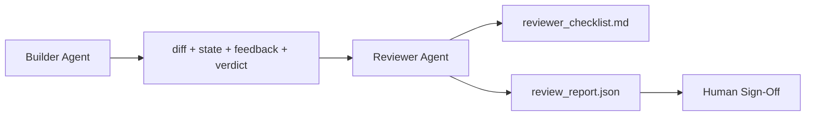

# Agent-recenzent: Rozdzielenie roli wykonawcy i weryfikatora

> Agent, który napisał kod, nie powinien samodzielnie go oceniać. Recenzent (reviewer) to niezależna pętla agentowa z odrębnym promptem systemowym, osobnym celem oraz dostępem wyłącznie do odczytu do wszystkich efektów pracy wykonawcy (buildera). Największy wzrost niezawodności wynika właśnie z podziału ról na wykonawcę i recenzenta.

**Typ:** Kompilacja
**Języki:** Python (stdlib)
**Wymagania wstępne:** Faza 14 · 38 (Bramka weryfikacyjna)
**Czas:** ~55 minut

## Cele nauczania

- Zrozumienie, dlaczego ten sam agent nie potrafi obiektywnie ocenić własnej pracy.
- Zaimplementowanie pętli agenta-recenzenta, która analizuje artefakty wykonawcy i generuje ustrukturyzowany raport z weryfikacji.
- Opracowanie precyzyjnych kryteriów (rubryki) oceny dla recenzenta, skupiających się na konkretnych parametrach zamiast ogólnych wrażeń.
- Zintegrowanie agenta-recenzenta ze środowiskiem roboczym, aby manualny przegląd kodu opierał się na gotowym, rzeczowym raporcie.

## Problem

Zlecamy agentowi naprawienie błędu. Model modyfikuje cztery pliki, uruchamia testy i generuje raporty. Bramka weryfikacyjna (faza 14 · 38) potwierdza pomyślny wynik testów akceptacyjnych oraz zachowanie zakresu zmian. Wynik weryfikacji to `passed: true`. Scalasz kod. Dwa dni później okazuje się, że poprawka usunęła skutki błędu, ale nie jego przyczynę.

Zalecenie testów akceptacyjnych to warunek konieczny, lecz niewystarczający. Agent-recenzent stawia pytania, których automatyczny test nie potrafi zadać: Czy zmiana rzeczywiście rozwiązała właściwy problem? Czy nie doszło do niekontrolowanego rozszerzenia zakresu? Czy udokumentowano założenia projektowe, które należało zweryfikować? Czy stan końcowy repozytorium pozwala na płynne podjęcie pracy w kolejnej sesji?

## Koncepcja



### Kryteria oceny recenzenta (Rubryka)

Pięć wymiarów, każdy oceniany w skali od 0 do 2.

| Wymiar | Pytanie |
|----------|----------|
| Zgodność z problemem | Czy wprowadzone zmiany rozwiązują dokładnie opisane zadanie, czy jedynie problem pokrewny? |
| Dyscyplina zakresu | Czy zmiany ściśle trzymały się umowy zakresu, czy też niepotrzebnie ją rozszerzono? |
| Założenia projektowe | Czy wszystkie niejawne założenia zostały spisane i są łatwe do zweryfikowania? |
| Jakość weryfikacji | Czy polecenia akceptacyjne rzeczywiście potwierdzają realizację celu, czy są jedynie powierzchownym testem? |
| Gotowość do przekazania | Czy kolejna sesja może bez przeszkód wystartować z obecnego stanu projektu? |

Maksymalna ocena wynosi 10 punktów. Wynik poniżej 7 oznacza warunkowe odrzucenie (soft fail); wynik poniżej 5 to bezwzględne odrzucenie (hard fail).

### Recenzent to osobna rola, a nie koniecznie inny model

W roli recenzenta możesz wykorzystać ten sam model LLM, który wykonywał zadanie. Istotą metody jest ścisłe rozdzielenie ról: odrębny prompt systemowy, inne dane wejściowe oraz brak uprawnień do modyfikowania kodu przez recenzenta. Zmiana perspektywy i kontekstu diametralnie poprawia jakość weryfikacji.

### Recenzent nie może modyfikować zmian (diff)

Recenzent analizuje diff, stan środowiska, logi oraz werdykt bramki. Jego zadaniem jest wyłącznie sporządzenie raportu – nie wprowadza on poprawek do kodu. Jeśli raport wykazuje błędy, poprawia je wykonawca (builder) w kolejnej iteracji, a recenzent ponownie ocenia wynik. Łączenie tych ról w ramach jednego procesu niweczy korzyści z weryfikacji.

### Kryteria recenzenta a bramka weryfikacyjna

Bramka weryfikacyjna (faza 14 · 38) bada obiektywne fakty: czy testy zakończyły się sukcesem, czy reguły zostały spełnione oraz czy dotrzymano zakresu zmian. Recenzent dokonuje natomiast oceny semantycznej i jakościowej: czy praca została wykonana prawidłowo, czy udokumentowano założenia oraz czy kod nadaje się do przekazania. Oba te mechanizmy są niezbędne.

## Implementacja

`code/main.py` implementuje:

- klasę danych `ReviewerInputs` agregującą artefakty analizowane przez recenzenta.
- moduł oceny (punktator) z odrębną funkcją dla każdego wymiaru. Funkcje te są deterministyczne na potrzeby tej lekcji; w środowisku produkcyjnym byłyby one realizowane przez zapytania LLM.
- generator pliku `review_report.json` zawierający szczegółowe oceny składowe, sumę punktów oraz ostateczną decyzję (`pass`, `soft_fail`, `hard_fail`).
- dwa przypadki testowe: poprawną modyfikację oraz zmianę typu „testy zaliczone, ale rozwiązano niewłaściwy problem”.

Uruchomienie:

```
python3 code/main.py
```

Wynik: dwa raporty z recenzji zapisane na dysku oraz podsumowanie ocen w tabeli na konsoli.

## Wzorce produkcyjne w praktyce

Dowody wdrożeniowe: wdrożony w kwietniu 2026 roku system Cloudflare AI Code Review przeprowadził 131 246 recenzji obejmujących 48 095 pull requestów w 5 169 repozytoriach w ciągu zaledwie 30 dni. Mediana czasu trwania recenzji wyniosła 3 minuty i 39 sekund. Aż siedmiu wyspecjalizowanych agentów-recenzentów (odpowiedzialnych m.in. za bezpieczeństwo, wydajność, jakość kodu, dokumentację, wersjonowanie, zgodność z normami oraz standardy inżynieryjne) pracowało równolegle. Ich działania były koordynowane przez agenta-integratora, który deduplikował uwagi i decydował o ostatecznym werdykcie. Najdroższy model LLM z najwyższej półki zarezerwowano wyłącznie dla koordynatora; agenci specjalistyczni korzystali z tańszych i szybszych modeli.

Cztery poniższe wzorce decydują o skuteczności tego rozwiązania na dużą skalę.

**Zespół wyspecjalizowanych agentów zamiast jednego ogólnego recenzenta.** Pojedynczy recenzent korzystający z 5-wymiarowej rubryki sprawdza się w małych, jednoosobowych projektach. Gdy kod zawiera obszary krytyczne pod kątem bezpieczeństwa, wydajności lub zgodności, warto podzielić zadania między agentów specjalistycznych o węższym kontekście i prostszych promptach. Agent koordynujący zajmuje się agregacją i deduplikacją uwag, co optymalizuje koszty i wydajność (tani agenci dedykowani, drogi koordynator).

**Eliminacja uprzedzeń modeli (bias) jako kluczowy warunek projektowy.** Modele LLM stosowane jako sędziowie (LLM-as-a-judge) wykazują cztery powtarzalne typy uprzedzeń (Adnan Masood, kwiecień 2026 r.): błąd kolejności (order bias – np. GPT-4 wykazuje ~40% rozbieżności przy ocenie par w kolejności A-B vs B-A), błąd gadatliwości (verbosity bias – zawyżanie ocen o ~15% dla dłuższych odpowiedzi), preferencja własna (same-model bias – faworyzowanie odpowiedzi wygenerowanych przez tę samą rodzinę modeli) oraz uleganie autorytetom (authority bias – przecenianie odwołań do znanych autorów). Środki zaradcze obejmują: ocenę wariantów w obu kolejnościach i uwzględnianie tylko spójnych werdyktów, stosowanie precyzyjnych skal ocen (np. 1-4) promujących zwięzłość, rotację modeli sędziowskich oraz anonimizację autorstwa kodu przed oceną.

**Zestaw kalibracyjny zamiast subiektywnych odczuć.** Przygotuj zestaw 10–20 historycznych zadań o znanych, potwierdzonych przez człowieka werdyktach. Uruchamiaj na nich weryfikację przy każdej modyfikacji promptów recenzenta. Jeśli zgodność z wzorcowymi ocenami spadnie poniżej 80%, rubryka i instrukcje wymagają poprawek przed wdrożeniem produkcyjnym. Zamiast dochodzić do tego wniosku po czasie, warto zaimplementować to od samego początku.

**Walidacja hybrydowa z bramką.** Bramka weryfikacyjna (faza 14 · 38) realizuje testy deterministyczne (pomyślność kompilacji, wyniki testów jednostkowych, kontrola zakresu). Recenzent skupia się na analizie semantycznej (czy poprawnie rozwiązano problem, czy udokumentowano założenia, czy kod jest czytelny). Oficjalne zalecenia Anthropic (2026) kładą nacisk na ten podział: agent-recenzent nie powinien powielać weryfikacji deterministycznych, które zostały już potwierdzone przez bramkę.

## Zastosowanie

Wzorce produkcyjne:

- **Subagenci w Claude Code.** Subagent-recenzent uruchamia się automatycznie po zakończeniu prac przez wykonawcę. Dodaje do pull requestu komentarz zawierający szczegółową punktację.
- **Przekazywanie zadań w OpenAI Agents SDK.** Wykonawca przekazuje kontekst recenzentowi po zakończeniu prac. Recenzent generuje listę uwag lub eskaluje problem do człowieka.
- **Praca w tandemie modelowym.** Wykonawca (builder) korzysta z szybszego i tańszego modelu LLM, natomiast recenzent (reviewer) opiera się na bardziej zaawansowanym modelu o mniejszym oknie kontekstowym, wyspecjalizowanym w analizie krytycznej.

Agent-recenzent to druga para oczu w cyklu deweloperskim, przejmująca powtarzalne procesy weryfikacji kodu, zanim trafią one do manualnej oceny przez zespół.

## Wdrożenie

`outputs/skill-reviewer-agent.md` tworzy dostosowaną do projektu rubrykę ocen, definiuje pętlę agenta-recenzenta zintegrowaną z wynikami prac wykonawcy oraz konfiguruje połączenie z bramką weryfikacyjną. Zapewnia to, że manualny przegląd kodu rozpoczyna się od gotowego raportu, a nie od analizy od zera.

## Ćwiczenia

1. Dodaj szósty wymiar oceny, specyficzny dla domeny Twojego projektu. Uzasadnij, czemy nie powinien on być częścią dotychczasowych pięciu kryteriów.
2. Przetestuj agenta-recenzenta z dwoma różnymi promptami systemowymi (zwięzłym oraz szczegółowym). Który raport jest bardziej przystępny dla programistów?
3. Wprowadź wskaźnik pewności (`confidence`) dla każdego wymiaru oceny. Zablokuj generowanie raportu, jeśli poziom pewności dla dowolnego z kryteriów spadnie poniżej 0.6.
4. Stwórz zestaw kalibracyjny złożony z 10 zamkniętych zadań o potwierdzonych werdyktach. Uruchom na nich agenta-recenzenta i przeanalizuj ewentualne rozbieżności z wzorcowymi ocenami.
5. Zaimplementuj funkcję „żądania dodatkowych dowodów”: recenzent może zlecić wykonawcy uruchomienie konkretnych testów przed dokonaniem oceny. Jak zabezpieczyć ten proces przed wpadnięciem w nieskończoną pętlę?

## Kluczowe terminy

| Termin | Co ludzie mówią | Co to właściwie oznacza |
|------|----------------|--------------------------------------|
| Kryteria oceny (reviewer rubric) | „Karta ocen” | Zestaw pięciu kryteriów ocenianych w skali 0-2 wraz ze szczegółowymi pytaniami pomocniczymi |
| Warunkowe odrzucenie (soft fail) | „Do poprawki” | Suma punktów poniżej 7; wykonawca otrzymuje listę uwag do natychmiastowego wdrożenia |
| Bezwzględne odrzucenie (hard fail) | „Odrzucone” | Suma punktów poniżej 5 lub ocena 0 w dowolnym z wymiarów; praca zostaje wstrzymana i przekazana człowiekowi |
| Rozdział ról (role separation) | „Osobny prompt” | Ścisłe zróżnicowanie zadań wykonawcy i recenzenta (nawet przy użyciu tego samego modelu) poprzez odrębny kontekst i brak uprawnień zapisu |
| Wskaźnik pewności (confidence floor) | „Filtr niskiej pewności” | Blokowanie werdyktów w przypadku niskiego stopnia pewności modelu co do wystawionej oceny |

## Dalsze czytanie

- [Przekazanie pakietu SDK dla agentów OpenAI](https://platform.openai.com/docs/guides/agents-sdk/handoffs)
- [Podagenci Anthropic Claude Code](https://docs.anthropic.com/en/docs/agents-and-tools/claude-code/sub-agents)
- [Cloudflare, orkiestrujący przegląd kodu AI na dużą skalę](https://blog.cloudflare.com/ai-code-review/) — architektura obejmująca 7 specjalistów i koordynatora, 131 tys. uruchomień / 30 dni
- [Agent-as-a-Judge: Ocena agentów za pomocą agentów (OpenReview / ICLR)](https://openreview.net/forum?id=DeVm3YUnpj) — test porównawczy DevAI, wymagania dotyczące rozwiązań hierarchicznych 366
- [Adnan Masood, Ewaluacja oparta na rubrykach i LLM-as-a-judge: metodologie, uprzedzenia, empiryczna walidacja](https://medium.com/@adnanmasood/rubric-based-evals-llm-as-a-judge-methodologies-and-empirical-validation-in-domain-context-71936b989e80) — 4 uprzedzenia i metody ich łagodzenia
- [MLflow, LLM-as-a-Judge Evaluation](https://mlflow.org/llm-as-a-judge) — narzędzia produkcyjne dla oddzielnego konstruktora/ewaluatora
- [LangChain, How to Calibrate LLM-as-a-Judge with Human Corrections](https://www.langchain.com/articles/llm-as-a-judge) — przepływ pracy z zestawem kalibracyjnym
- [Evidently AI, LLM-as-a-judge: kompletny przewodnik](https://www.evidentlyai.com/llm-guide/llm-as-a-judge)
- [Arize, LLM jako sędzia – elementy wstępne i gotowe oceny](https://arize.com/llm-as-a-judge/)
- Faza 14 · 05 — Samodoskonalenie i KRYTYK (punkt bazowy samooceny przeprowadzanej przez jednego agenta)
- Faza 14 · 30 — Projektowanie oparte na ewaluacji (generator zestawu kalibracyjnego)
- Faza 14 · 38 – bramka weryfikacyjna, którą czyta recenzent
- Faza 14 · 40 — pakiet przekazania przesyłany przez raport recenzenta
