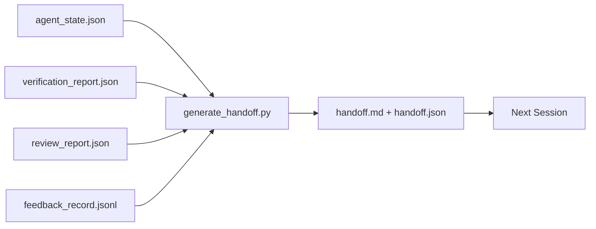

# Przekazanie wielu sesji

> Sesja dobiegnie końca. Praca nie. Pakiet przekazania to artefakt, który zmienia „agent pracował przez godzinę” w „następna sesja jest produktywna w ciągu pierwszej minuty”. Twórz go celowo, a nie po namyśle.

**Typ:** Kompilacja
**Języki:** Python (stdlib)
**Wymagania wstępne:** Faza 14 · 34 (pamięć Repo), Faza 14 · 38 (weryfikacja), Faza 14 · 39 (Recenzent)
**Czas:** ~50 minut

## Cele nauczania

- Zidentyfikuj siedem pól, których potrzebuje każdy pakiet przekazania.
- Generuj przekaz na podstawie artefaktów warsztatu bez ręcznego pisania prozy.
- Przytnij duże dzienniki opinii do podsumowania wielkości przekazania.
- Ustaw pierwszą akcję następnej sesji jako deterministyczną.

## Problem

Sesja się kończy. Agent mówi: „Świetnie, zrobiliśmy postęp”. Rozpoczyna się następna sesja. Następny agent pyta: „Gdzie skończyliśmy?” Odpowiedź pierwszego agenta zniknęła. Następny agent odkrywa na nowo, ponownie wykonuje te same polecenia, ponownie zadaje człowiekowi te same pytania i traci trzydzieści minut, odzyskując ostatnie trzydzieści sekund poprzedniej sesji.

Koszt złego przekazania jest płacony w każdej sesji przez cały czas trwania zadania. Poprawka to pakiet generowany automatycznie na koniec sesji: co się zmieniło, dlaczego, czego próbowano, co się nie udało, co pozostało, co zrobić najpierw następnym razem.

## Koncepcja



### Siedem pól, które zawiera każde przekazanie

| Pole | Pytanie, na które odpowiada |
|------|---------------------|
| `summary` | Jeden akapit tego, co zostało zrobione |
| `changed_files` | Różnica w skrócie |
| `commands_run` | Co faktycznie zostało wykonane |
| `failed_attempts` | Co próbowano i dlaczego nie zadziałało |
| `open_risks` | Co może ugryźć następną sesję, z dotkliwością |
| `next_action` | Pierwszy konkretny krok trwa następna sesja |
| `verdict_pointer` | Ścieżka do raportów z weryfikacji + przeglądu |

Pole `next_action` jest polem nośnym. Przekazanie ze wszystkim oprócz `next_action` to raport o stanie, a nie przekazanie.

### Przekazania są generowane, a nie zapisywane

Odręczne przekazanie dokumentów to przekazanie, które zostaje pominięte w przypadku ciężkiego dnia. Generator odczytuje artefakty środowiska warsztatowego i emituje pakiet. Zadaniem agenta jest pozostawienie środowiska roboczego w stanie, który generator może podsumować, a nie zapisanie podsumowania.

### Dwie formy: czytelna dla człowieka i maszynowa

`handoff.md` to to, co czyta człowiek. `handoff.json` to zawartość, którą ładuje następny agent. Obydwa pochodzą z tego samego źródła artefaktów. Jeśli się różnią, wygrywa JSON.

### Przycinanie dziennika opinii

Pełny `feedback_record.jsonl` może zawierać setki wpisów. Przekazanie przenosi tylko ostatnie K plus każdy wpis z niezerowym wyjściem. Następna sesja ładuje pełny dziennik, jeśli zajdzie taka potrzeba, ale pakiet pozostaje mały.

## Zbuduj to

`code/main.py` implementuje:

- Moduł ładujący, który gromadzi stan, werdykt, recenzję i opinie w jednym `WorkbenchSnapshot`.
- Funkcja `generate_handoff(snapshot) -> (markdown, payload)`.
- Filtr, który wybiera ostatnie K wpisów zwrotnych i wszystkie niezerowe wyjścia.
- Uruchomienie demonstracyjne, w którym obok skryptu zapisano `handoff.md` i `handoff.json`.

Uruchom to:

```
python3 code/main.py
```

Dane wyjściowe: wydrukowana treść przekazania oraz oba pliki na dysku.

## Wzorce produkcji na wolności

Codex CLI, Claude Code i OpenCode oferują inną historię zagęszczania; ustrukturyzowany pakiet przekazania znajduje się na górze wszystkich trzech.

**Strategie zagęszczania są różne; schemat pakietu tego nie robi.** POST /v1/responses/compact Codex CLI to nieprzezroczysty blob AES po stronie serwera (szybka ścieżka dla modeli OpenAI); rezerwą jest lokalne „podsumowanie przekazania” dołączone jako `_summary` komunikat dotyczący roli użytkownika. Claude Code przeprowadza pięciostopniową, progresywną kompresję w 95% kontekstu. OpenCode ukrywa wiadomości w oparciu o znaczniki czasu oraz 5-nagłówkowe podsumowanie LLM. Trzy różne mechanizmy, ta sama potrzeba: serializacja tego, co przetrwa kompresję, w przenośny artefakt. Pakiet jest tym artefaktem.

**Przekazanie nowej sesji nie jest kompaktowaniem.** Kompaktowanie wydłuża sesję; przekazanie kończy się czysto i rozpoczyna następne. Ramy wydania Hermesa nr 20372 (kwiecień 2026 r.) są prawidłowe: gdy kompresja lokalna zaczyna się pogarszać, agent powinien napisać zwarte przekazanie, zakończyć sesję i wznowić ją w nowym kontekście. Pakiet sprawia, że ​​to przejście jest tanie. Błędem jest trzymanie kompresji do momentu pogorszenia się jakości; rozwiązaniem jest zaplanowanie budżetu na wczesne, czyste przekazanie.

**Jedno aktywne przekazanie na gałąź i temat.** Koordynacja wieloagentowa psuje się częściej w przypadku nieaktualnych przekazań niż w przypadku złych wyników modelu. Zawsze dołączaj `branch`, `last_known_good_commit` i `status` z `active | superseded | archived`. Nieaktualne przekazania są archiwizowane; tylko aktywny prowadzi następną sesję. Na tym polega różnica między przekazaniem jako notatką a przekazaniem jako stan.

**Zakończ przed 50-75% kontekstu, a nie przy ścianie.** Ręcznie napisany podręcznik (CLAUDE.md + HANDOVER.md) podaje najlepsze wyniki, gdy sesja kończy się przy budżecie kontekstowym 50-75% zamiast 95%. Generator pakietów działa prawidłowo, zanim artefakty kompresji zanieczyszczą stan źródłowy. Tanie pisanie, gdy kontekst jest nienaruszony; drogie, gdy model już traci swoje miejsce.

## Użyj tego

Wzory produkcyjne:

- **Zaczep na koniec sesji.** Środowisko wykonawcze uruchamia generator, gdy użytkownik zamyka czat. Pakiet trafia do `outputs/handoff/<session_id>/`.
- **Szablon PR.** Przecena generatora jest również treścią PR. Recenzenci czytają go bez otwierania pięciu innych plików.
- **Przekazywanie między agentami.** Twórz z jednym produktem (Claude Code), kontynuuj z innym (Codex). Pakiet to lingua franca.

Opakowanie jest małe, regularne i tanie w produkcji. Oszczędzające koszty związki przy każdej sesji.

## Wyślij to

`outputs/skill-handoff-generator.md` tworzy generator dostrojony do ścieżek artefaktów projektu, hak na koniec sesji, który go uruchamia, oraz schemat `handoff.json`, który następny agent czyta podczas uruchamiania.

## Ćwiczenia

1. Dodaj pole `assumptions_to_validate`, które wyświetla wszystkie założenia zarejestrowane przez konstruktora, ale recenzent nie uzyskał oceny powyżej 1.
2. Inaczej przycinaj podsumowanie opinii dla nieudanych serii i dla tych, które zdały egzamin. Broń asymetrii.
3. Dołącz listę „pytań do człowieka”. Jaki jest próg, od którego pytanie może znaleźć się w pakiecie w porównaniu do wiadomości na czacie?
4. Ustaw generator jako idempotentny: dwukrotne uruchomienie daje ten sam pakiet. Co musi być stabilne, żeby to wytrzymało?
5. Dodaj sekcję „Wymagania wstępne następnej sesji”, zawierającą dokładną listę artefaktów, które następna sesja musi załadować przed podjęciem działań.

## Kluczowe terminy

| Termin | Co ludzie mówią | Co to właściwie oznacza |
|------|----------------|--------------------------------------|
| Pakiet przekazania | „Podsumowanie sesji” | Wygenerowano artefakt zawierający siedem pól, zarówno Markdown, jak i JSON |
| Następna akcja | „Co zrobić najpierw” | Jeden konkretny krok rozpoczynający następną sesję |
| Opinia przycinana | „Podsumowanie dziennika” | Ostatnie K rekordów plus każde niezerowe wyjście |
| Raport stanu | „Co zrobiliśmy” | Brak dokumentu `next_action`; przydatne, ale nie do przekazania |
| Wskaźnik werdyktu | „Odbiór” | Ścieżka do raportów z weryfikacji i przeglądu pod kątem identyfikowalności |

## Dalsze czytanie

- [Antropiczne, skuteczne uprzęże dla agentów działających długotrwale](https://www.anthropic.com/engineering/efektywne-harnesses-for-long-running-agents)
— [Przekazanie pakietu SDK dla agentów OpenAI](https://platform.openai.com/docs/guides/agents-sdk/handoffs)
- [Blog Codex, Kompaktowanie kontekstu Codex CLI: architektura, konfiguracja, zarządzanie długimi sesjami](https://codex.danielvaughan.com/2026/03/31/codex-cli-context-compaction-architecture/) — POST /v1/responses/compact i lokalna rezerwa
— [Justin3go, Shedding Heavy Memories: Context Compaction in Codex, Claude Code, OpenCode](https://justin3go.com/en/posts/2026/04/09-context-compaction-in-codex-claude-code-and-opencode) — porównanie trzech dostawców
– [JD Hodges, Claude Handoff Prompt: Jak zachować kontekst między sesjami (2026)](https://www.jdhodges.com/blog/ai-session-handoffs-keep-context-across-conversations/) — CLAUDE.md + HANDOVER.md, budżet kontekstowy 50–75%
- [Mervin Praison, Zarządzanie przełączeniami w sesjach kodowania wieloagentowego: nowy kontekst bez utraty ciągłości](https://mer.vin/2026/04/managing-handoffs-in-multi-agent-coding-sessions-fresh-context-without-losing-continuity/) — ramowanie systemów rozproszonych
— [Hermes, wydanie nr 20372 — automatyczne przełączanie nowej sesji, gdy kompresja staje się ryzykowna](https://github.com/NousResearch/hermes-agent/issues/20372)
— [Hermes, wydanie nr 499 — Zmiana jakości zagęszczania kontekstu](https://github.com/NousResearch/hermes-agent/issues/499) — podpowiedzi zorientowane na przekazanie w interfejsie wiersza polecenia Codex
— [Microsoft Agent Framework, kompaktowanie](https://learn.microsoft.com/en-us/agent-framework/agents/conversations/compaction)
- [OpenCode, zarządzanie kontekstem i kompaktowanie](https://deepwiki.com/sst/opencode/2.4-context-management-and-compaction)
- [LangChain, inżynieria kontekstu dla agentów](https://www.langchain.com/blog/context-engineering-for-agents)
- Faza 14 · 34 — plik stanu czytany przez generator
- Faza 14 · 38 – werdykt weryfikacji, na który wskazuje pakiet
- Faza 14 · 39 – raport recenzenta dołączony do pakietu