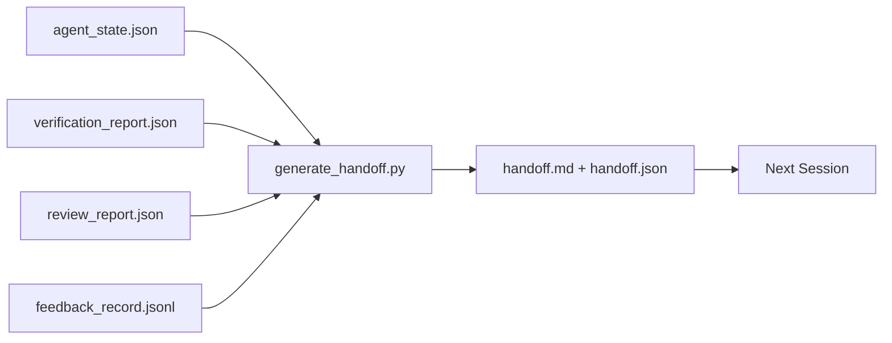

# Przekazanie wielu sesji

> Sesja dobiegnie końca, ale praca trwa nadal. Pakiet przekazania (handoff package) to kluczowy dokument, który sprawia, że kolejna sesja może ruszyć z pełną wydajnością od pierwszej minuty, zamiast tracić czas na wdrażanie się. Twórz go celowo, a nie w pośpiechu na samym końcu.

**Typ:** Kompilacja
**Języki:** Python (stdlib)
**Wymagania wstępne:** Faza 14 · 34 (Pamięć repozytorium), Faza 14 · 38 (Bramki weryfikacyjne), Faza 14 · 39 (Agent-recenzent)
**Czas:** ~50 minut

## Cele nauczania

- Zdefiniowanie siedmiu kluczowych pól niezbędnych w każdym pakiecie przekazania.
- Automatyczne generowanie pakietu przekazania na podstawie artefaktów środowiska roboczego, bez konieczności ręcznego opisywania prac.
- Skracanie (przycinanie) obszernych logów sprzężenia zwrotnego do zwięzłego podsumowania.
- Zdefiniowanie deterministycznej pierwszej akcji dla kolejnej sesji.

## Problem

Sesja dobiega końca. Agent komunikuje: „Świetnie, zrobiliśmy spore postępy”. Rozpoczyna się kolejna sesja, a nowy agent pyta: „Na czym skończyliśmy?”. Informacje od poprzednika przepadły. Nowy agent musi na nowo analizować sytuację, powtarzać te same polecenia i zadawać programiście te same pytania, tracąc pół godziny na odtworzenie ostatnich sekund poprzedniej sesji.

Koszt niewłaściwego przekazania ponoszony jest na początku każdej kolejnej sesji. Rozwiązaniem jest automatycznie generowany pakiet przekazania na koniec pracy: co uległo zmianie i dlaczego, jakich rozwiązań próbowano, co zakończyło się błędem, jakie zadania pozostały do wykonania oraz jaki powinien być pierwszy krok w kolejnej sesji.

## Koncepcja



### Siedem kluczowych pól pakietu przekazania

| Pole | Pytanie, na które odpowiada |
|------|---------------------|
| `summary` | Zwięzłe podsumowanie wykonanych prac |
| `changed_files` | Wykaz zmodyfikowanych plików |
| `commands_run` | Lista uruchomionych poleceń |
| `failed_attempts` | Opis nieudanych prób i przyczyny niepowodzeń |
| `open_risks` | Potencjalne ryzyka i problemy dla kolejnej sesji wraz z poziomem krytyczności |
| `next_action` | Konkretny, pierwszy krok do wykonania w kolejnej sesji |
| `verdict_pointer` | Ścieżka do raportu weryfikacyjnego i recenzji |

Pole `next_action` ma kluczowe znaczenie. Dokument zawierający wszystkie informacje oprócz pola `next_action` to jedynie raport o stanie prac, a nie rzeczywiste przekazanie.

### Przekazania powinny być generowane automatycznie, a nie pisane ręcznie

Ręczne spisywanie raportów to pierwsza rzecz, z której rezygnuje się pod presją czasu. Generator odczytuje artefakty ze środowiska roboczego i automatycznie tworzy pakiet przekazania. Zadaniem agenta jest utrzymanie środowiska roboczego w stanie pozwalającym na automatyczną agregację danych, a nie pisanie podsumowań.

### Dwie formy: dla człowieka oraz dla maszyn

Plik `handoff.md` jest przeznaczony dla człowieka. Z kolei plik `handoff.json` zawiera dane strukturalne wczytywane przez kolejnego agenta na starcie sesji. Oba powstają z tych samych artefaktów wejściowych. W przypadku rozbieżności, priorytet ma struktura JSON.

### Przycinanie logu sprzężenia zwrotnego

Pełny plik logów `feedback_record.jsonl` może zawierać setki wpisów. Pakiet przekazania powinien uwzględniać jedynie K ostatnich rekordów oraz wszystkie te, które zakończyły się kodem błędu. W razie potrzeby kolejna sesja może wczytać kompletny log, dzięki czemu sam pakiet przekazania pozostaje zwięzły.

## Implementacja

`code/main.py` implementuje:

- loader agregujący pliki stanu, werdykt, raport recenzji oraz logi sprzężenia zwrotnego w jeden obiekt `WorkbenchSnapshot`.
- funkcję `generate_handoff(snapshot) -> (markdown, payload)`.
- mechanizm filtrujący wybierający K ostatnich rekordów sprzężenia zwrotnego oraz wszystkie błędy.
- przebieg demonstracyjny, który zapisuje pliki `handoff.md` oraz `handoff.json` w katalogu roboczym.

Uruchomienie:

```
python3 code/main.py
```

Wynik: wydrukowana treść przekazania oraz oba pliki na dysku.

## Wzorce produkcyjne w praktyce

Narzędzia takie jak Codex CLI, Claude Code oraz OpenCode stosują różne podejścia do kompresji kontekstu, jednak ustrukturyzowany pakiet przekazania stanowi fundament każdego z nich.

**Różne strategie kompresji, spójny schemat pakietu.** Funkcja `POST /v1/responses/compact` w Codex CLI zwraca nieprzejrzysty obiekt binarny (blob) po stronie serwera (zoptymalizowany pod kątem modeli OpenAI); mechanizmem zapasowym jest lokalne podsumowanie dodawane jako wiadomość systemowa `_summary`. Claude Code stosuje pięcioetapową, progresywną kompresję przy zapełnieniu 95% kontekstu. Z kolei OpenCode filtruje wiadomości na podstawie znaczników czasu i tworzy zwięzłe podsumowanie przy użyciu LLM. Choć mechanizmy te się różnią, realizują ten sam cel: zapisanie najważniejszych informacji w przenośnym formacie. Pakiet przekazania jest właśnie takim artefaktem.

**Rozpoczęcie nowej sesji to nie to samo co kompresja kontekstu.** Kompresja ma na celu sztuczne wydłużenie bieżącej sesji; przekazanie polega na jej czystym zamknięciu i otwarciu nowej. Potwierdza to zgłoszenie NousResearch/Hermes nr 20372 (kwiecień 2026 r.): gdy skuteczność lokalnej kompresji kontekstu zaczyna spadać, agent powinien wygenerować zwięzły raport przekazania, zakończyć sesję i uruchomić kolejną w czystym kontekście. Pakiet przekazania sprawia, że przejście to jest bardzo efektywne. Błędem jest opóźnianie kompresji do momentu degradacji odpowiedzi modelu; właściwym rozwiązaniem jest zaplanowanie budżetu tokenów na wczesne, uporządkowane przekazanie.

**Tylko jeden aktywny dokument przekazania dla danej gałęzi i zadania.** Koordynacja pracy wielu agentów zawodzi najczęściej z powodu nieaktualnych informacji o stanie prac, a nie błędów samych modeli. Zawsze dołączaj pola takie jak: `branch`, `last_known_good_commit` oraz `status` o wartościach `active | superseded | archived`. Nieaktualne raporty powinny być natychmiast archiwizowane – tylko aktywny dokument decyduje o starcie kolejnego agenta. Taka struktura odróżnia luźne notatki od formalnego zapisu stanu projektu.

**Kończ sesję przy zajętości 50-75% kontekstu, zanim model napotka limit.** Utrzymywanie notatek w plikach takich jak `CLAUDE.md` czy `HANDOVER.md` przynosi najlepsze rezultaty, gdy sesję zamyka się przy wykorzystaniu okna kontekstowego na poziomie 50-75%, a nie w ostatniej chwili przed limitem. Generator działa bezbłędnie, zanim zaszumiony kontekst zaburzy analizę. Generowanie podsumowania jest efektywne, dopóki kontekst pozostaje przejrzysty dla modelu.

## Zastosowanie

Wzorce produkcyjne:

- **Hook na zakończenie sesji.** Środowisko uruchomieniowe uruchamia generator w momencie, gdy użytkownik zamyka sesję czatu. Pakiet przekazania jest zapisywany w katalogu `outputs/handoff/<session_id>/`.
- **Szablon pull requestu (PR).** Wygenerowany plik Markdown może służyć jako gotowy opis PR. Recenzenci mogą szybko zapoznać się ze zmianami bez konieczności przeglądania wielu plików źródłowych.
- **Komunikacja między różnymi agentami.** Możesz rozpocząć pracę z jednym agentem (np. Claude Code), a kontynuować z innym (np. Codex). Ujednolicony pakiet przekazania stanowi wspólny standard wymiany danych.

Pakiet przekazania jest lekki, powtarzalny i tani w generowaniu. Inwestycja ta przynosi duże oszczędności przy każdej kolejnej sesji.

## Wdrożenie

`outputs/skill-handoff-generator.md` tworzy generator dostosowany do ścieżek projektowych, konfiguruje hook uruchamiający proces na koniec sesji oraz definiuje schemat `handoff.json`, który kolejny agent wczytuje na starcie.

## Ćwiczenia

1. Dodaj pole `assumptions_to_validate` wyświetlające założenia spisane przez wykonawcę, które uzyskały u recenzenta ocenę poniżej lub równą 1.
2. Zróżnicuj sposób skracania logów sprzężenia zwrotnego dla przebiegów zakończonych sukcesem oraz tych z błędami. Uzasadnij tę asymetrię.
3. Dodaj sekcję zawierająca pytania do dewelopera. Zdefiniuj kryterium decydujące o tym, czy dane pytanie trafia do pakietu przekazania, czy powinno zostać zadane bezpośrednio na czacie.
4. Zapewnij idempotentność generatora: dwukrotne uruchomienie skryptu na tych samych danych musi wygenerować identyczny pakiet. Jakie elementy wejściowe muszą pozostać niezmienne, aby to zagwarantować?
5. Wprowadź sekcję „Wymagania wstępne kolejnej sesji”, określającą dokładną listę artefaktów, które muszą zostać załadowane na starcie kolejnego kroku.

## Kluczowe terminy

| Termin | Co ludzie mówią | Co to właściwie oznacza |
|------|----------------|--------------------------------------|
| Pakiet przekazania (handoff package) | „Karta przekazania” | Automatycznie wygenerowany zestaw danych zawierający siedem pól, zapisany w formatach Markdown oraz JSON |
| Kolejny krok (next action) | „Zadanie na start” | Jedno precyzyjnie określone działanie, od którego rozpoczyna się kolejna sesja |
| Skrócone logi (trimmed feedback) | „Skrócony log” | K ostatnich rekordów sprzężenia zwrotnego wraz ze wszystkimi błędami (niezerowy kod wyjścia) |
| Raport o stanie prac (status report) | „Podsumowanie postępu” | Dokument opisujący dotychczasowe kroki bez określonego pola `next_action`; przydatny, lecz niewystarczający do przekazania prac |
| Referencja werdyktu (verdict pointer) | „Ścieżka weryfikacji” | Wskaźnik do raportów weryfikacyjnych i recenzji, umożliwiający pełną identyfikowalność zmian |

## Dalsze czytanie

- [Anthropic, Sprawne środowiska uruchomieniowe dla długo działających agentów](https://www.anthropic.com/engineering/effective-harnesses-for-long-running-agents)
- [Przekazanie pakietu SDK dla agentów OpenAI](https://platform.openai.com/docs/guides/agents-sdk/handoffs)
- [Blog Codex, Kompaktowanie kontekstu Codex CLI: architektura, konfiguracja, zarządzanie długimi sesjami](https://codex.danielvaughan.com/2026/03/31/codex-cli-context-compaction-architecture/) — POST /v1/responses/compact i lokalna rezerwa
- [Justin3go, Shedding Heavy Memories: Context Compaction in Codex, Claude Code, OpenCode](https://justin3go.com/en/posts/2026/04/09-context-compaction-in-codex-claude-code-and-opencode) — porównanie trzech dostawców
- [JD Hodges, Claude Handoff Prompt: Jak zachować kontekst między sesjami (2026)](https://www.jdhodges.com/blog/ai-session-handoffs-keep-context-across-conversations/) — CLAUDE.md + HANDOVER.md, budżet kontekstowy 50–75%
- [Mervin Praison, Zarządzanie przełączeniami w sesjach kodowania wieloagentowego: nowy kontekst bez utraty ciągłości](https://mer.vin/2026/04/managing-handoffs-in-multi-agent-coding-sessions-fresh-context-without-losing-continuity/) — ramowanie systemów rozproszonych
- [Hermes, wydanie nr 20372 — automatyczne przełączanie nowej sesji, gdy kompresja staje się ryzykowna](https://github.com/NousResearch/hermes-agent/issues/20372)
- [Hermes, wydanie nr 499 — Zmiana jakości zagęszczania kontekstu](https://github.com/NousResearch/hermes-agent/issues/499) — podpowiedzi zorientowane na przekazanie w interfejsie wiersza polecenia Codex
- [Microsoft Agent Framework, kompaktowanie](https://learn.microsoft.com/en-us/agent-framework/agents/conversations/compaction)
- [OpenCode, zarządzanie kontekstem i kompaktowanie](https://deepwiki.com/sst/opencode/2.4-context-management-and-compaction)
- [LangChain, inżynieria kontekstu dla agentów](https://www.langchain.com/blog/context-engineering-for-agents)
- Faza 14 · 34 — plik stanu odczytywany przez generator
- Faza 14 · 38 – werdykt weryfikacji, na który wskazuje pakiet
- Faza 14 · 39 – raport recenzenta dołączony do pakietu
