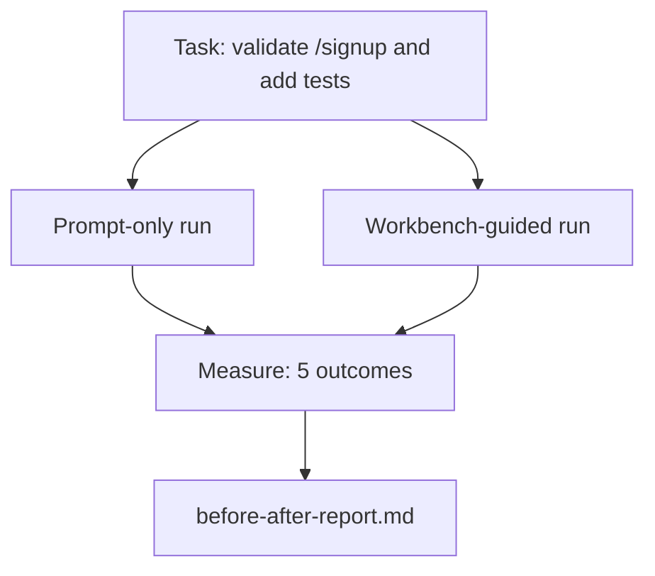

# Środowisko pracy na prawdziwym repozytorium

> Jedenaście lekcji o powierzchniach nie jest nic warte, jeśli nie przetrwają kontaktu z prawdziwą bazą kodu. W tej lekcji dwukrotnie uruchamiane jest to samo zadanie w małej przykładowej aplikacji: tylko z podpowiedzią i ze wskazówkami w środowisku warsztatowym. Liczby stanowią argument.

**Typ:** Kompilacja
**Języki:** Python (stdlib)
**Wymagania wstępne:** Fazy 14 · 32 do 14 · 40
**Czas:** ~60 minut

## Cele nauczania

- Połącz siedem powierzchni stołu warsztatowego w ramach małej aplikacji.
- Uruchom to samo zadanie dwa razy (tylko w trybie podpowiedzi i przy pomocy środowiska warsztatowego) i zmierz pięć wyników.
- Przeczytaj raport przed/po i zdecyduj, które powierzchnie dały największy efekt.
- Broń stołu warsztatowego przed odrzuceniem typu „ale mój model jest wystarczająco dobry”.

## Problem

Demo dotyczące zadania zabawkowego nikogo nie przekonuje. Argument za środowiskiem warsztatowym ma miejsce wtedy, gdy rzeczywiste zadanie w realistycznym repozytorium trafia do produkcji z mniejszą liczbą błędów, mniejszą liczbą powrotów i pakietem, z którego może skorzystać następna sesja.

Ta lekcja przedstawia repozytorium, które wydaje się prawdziwe i uruchamia to samo zadanie w obu potokach. Rezultatem jest raport przed/po, który możesz wręczyć sceptykowi.

## Koncepcja



### Przykładowa aplikacja

Minimalny moduł obsługi w stylu FastAPI w `sample_app/`:

- `app.py` z `/signup` (jeszcze nie zatwierdzono).
- `test_app.py` z jednym testem szczęśliwej ścieżki.
- `README.md` i `scripts/release.sh` jako przynęta w strefie zabronionej.

### Zadanie

> Dodaj sprawdzanie poprawności danych wejściowych do `/signup`: odrzucaj hasła krótsze niż 8 znaków, zwróć 422 z wpisaną kopertą błędu. Dodaj test potwierdzający nowe zachowanie.

### Dwa rurociągi

Tylko monit:

1. Przeczytaj plik README.
2. Przeczytaj `app.py`.
3. Edytuj pliki.
4. Reklamacja zrealizowana.

Prowadzone na stole warsztatowym:

1. Uruchom skrypt inicjujący (Lekcja 35).
2. Przeczytaj umowę zakresową (lekcja 36).
3. Przeczytaj stan (lekcja 34).
4. Edytuj tylko dozwolone pliki.
5. Uruchom polecenie akceptacji poprzez moduł sprzężenia zwrotnego (Lekcja 37).
6. Uruchom bramkę weryfikacyjną (Lekcja 38).
7. Uruchom recenzenta (Lekcja 39).
8. Wygeneruj przekazanie (Lekcja 40).

### Pięć zmierzonych wyników

| Wynik | Dlaczego to ma znaczenie |
|------------|----------------|
| `tests_actually_run` | Większość twierdzeń o „zaliczonych testach” jest niemożliwa do zweryfikowania |
| `acceptance_met` | Testem potwierdzającym cel musi być test, który przeprowadził |
| `files_outside_scope` | Pełzanie zakresu jest dominującą cichą awarią |
| `handoff_quality` | Następna sesja opłaca się lub korzysta z tego |
| `reviewer_total` | Ocena jakościowa na szczycie bramy |

## Zbuduj to

`code/main.py` koordynuje dwa potoki w oparciu o to samo przykładowe urządzenie aplikacji. Oba potoki są skryptowane (bez LLM w pętli), więc pomiar jest powtarzalny. Skrypt zapisuje porównanie w `before-after-report.md` i `comparison.json`.

Uruchom to:

```
python3 code/main.py
```

Dane wyjściowe: konsolowa tabela wyników dla każdego potoku, raport przeceny zapisany obok skryptu i kod JSON dla każdego, kto chce go sporządzić na wykresie.

## Wzorce produkcji na wolności

Pytanie sceptyka brzmi: „w jakim stopniu stół warsztatowy faktycznie pomaga?” Liczby za rok 2026 mówią znacznie więcej niż wyjaśnienia.

**Terminal Bench z pierwszej 30 do pierwszej 5 na tym samym modelu.** *Anatomia uprzęży agenta* LangChaina (kwiecień 2026): agent kodujący przeskoczył spoza pierwszej 30 i zajął piąte miejsce w Terminal Bench 2.0, zmieniając tylko uprząż. Ten sam model. Różne powierzchnie. Delta dwudziestu pięciu stopni.

**Vercel 80% do 100% poprzez usunięcie narzędzi.** Vercel zgłosił, że usunięcie 80% narzędzi swojego agenta zwiększyło wskaźnik sukcesu z 80% do 100%. Mniejsza powierzchnia narzędzia, ostrzejszy zakres, mniej możliwości awarii. Przestrzeń ujemna wygrywa.

**Dokładność Harveya 2x dzięki samej uprzęży.** Prawnicy ponad dwukrotnie zwiększyli swoją dokładność dzięki optymalizacji uprzęży, bez zmiany modelu.

**88% projektów agentów AI w przedsiębiorstwach nie trafia do produkcji.** W artykule preprints.org *Harness Engineering for Language Agents* (marzec 2026 r.) śledzono awarie w czasie wykonywania, a nie w rozumowaniu: nieaktualny stan, kruche ponowne próby, przerośnięty kontekst, słabe odtwarzanie po błędach pośrednich.

**Załamanie w długim kontekście.** Bazowe 40-50% sukcesu WebAgent spada do poniżej 10% w warunkach długiego kontekstu, głównie z powodu nieskończonych pętli i utraty celów. Pętla Ralpha i pakiet przekazania istnieją po to, aby to wchłonąć.

**Nadal istnieją fałszywe negatywy.** Jednoetapowe zadania oparte na faktach, jednowierszowe linty, uruchomienia programu formatującego, wszystko, co model zapamiętał dosłownie – działają szybciej, tylko za pomocą podpowiedzi. Benchmark powinien wyliczyć je uczciwie, aby stół warsztatowy nie był postrzegany jako przesada.

Wniosek na wynos nie jest taki, że „uprząż zwycięża na zawsze”. Modele z biegiem czasu absorbują sztuczki z uprzężą. Wniosek jest taki, że obecnie obciążenie inżynieryjne spoczywa na siedmiu powierzchniach, a liczby to potwierdzają.

## Użyj tego

Ta lekcja to akta sprawy, które cytujesz, gdy:

- Ktoś pyta, dlaczego każdy PR ma `agent-rules.md` i umowę zakresową.
- Zespół chce porzucić bramkę weryfikacyjną „tylko na potrzeby tego sprintu”.
- Pojawia się nowy produkt agenta i potrzebny jest przenośny punkt odniesienia, aby sprawdzić, czy faktycznie oszczędza on czas.

Liczby sięgają dalej niż wyjaśnienia.

## Wyślij to

`outputs/skill-workbench-benchmark.md` to przenośna platforma ewaluacyjna, która uruchamia dowolny produkt agenta w obu potokach względem przykładowej aplikacji projektu i raportuje pięć wyników.

## Ćwiczenia

1. Dodaj szósty wynik: czas do pierwszej znaczącej edycji. Jak to zmierzyć, żeby było czysto?
2. Uruchom porównanie prawdziwego zadania drugiego dnia w swojej bazie kodu. Gdzie padają numery stanowisk warsztatowych?
3. Dodaj wynik „fałszywie negatywny”: zadania, w przypadku których użycie samego podpowiedzi byłoby szybsze, a obciążenie środowiska warsztatowego stanowi realny koszt. Tak czy inaczej broń warsztatu.
4. Zastąp skryptowanego „agenta” prawdziwym wywołaniem LLM. Które wyniki stają się głośniejsze?
5. Napisz jednostronicowe streszczenie skierowane do osób niebędących inżynierami. Co przetrwa cięcie?

## Kluczowe terminy

| Termin | Co ludzie mówią | Co to właściwie oznacza |
|------|----------------|--------------------------------------|
| Przykładowa aplikacja | „Repozytorium zabawek” | Mały, ale wystarczająco realistyczny, aby ćwiczyć wszystkie siedem powierzchni |
| Rurociąg | „Przepływ pracy” | Uporządkowana sekwencja odczytów/zapisów powierzchni, po której podąża agent |
| Raport przed/po | „Przychody” | Artefakt, który podajesz sceptykowi |
| Fałszywie negatywny | „Przesada w warsztacie” | Zadania, w których tylko monit jest szybszy; warto uczciwie wyliczyć |
| Test porównawczy środowiska roboczego | „Wynik niezawodności” | Przenośna uprząż, która uruchamia porównanie w bazie kodu |

## Dalsze czytanie

– [LangChain, The Anatomy of an Agent Harness](https://blog.langchain.com/the-anatomy-of-an-agent-harness/) — Rachunek z terminala od 30 do 5 najlepszych
- [MongoDB, Zespół agentów: dlaczego LLM jest najmniejszą częścią Twojego systemu agenta](https://www.mongodb.com/company/blog/technical/agent-harness-why-llm-is-smallest-part-of-your-agent-system) — liczby Vercel + Harvey
– [preprints.org, Harness Engineering for Language Agents](https://www.preprints.org/manuscript/202603.1756) — wskaźnik awaryjności przedsiębiorstw na poziomie 88%, główne przyczyny w czasie wykonywania
- [HN: Udoskonalenie 15 przedmiotów LLM w zakresie kodowania w jedno popołudnie. Zmieniono tylko uprząż](https://news.ycombinator.com/item?id=46988596) — powtórzono w 15 modelach
– [Cloudflare, orkiestrowanie przeglądu kodu AI na dużą skalę](https://blog.cloudflare.com/ai-code-review/) — 131 tys. przebiegów recenzji / 30 dni produkcji
– [Anthropic, budowanie skutecznych agentów](https://www.anthropic.com/research/building-efektywne-agents)
- Fazy 14 · 32 do 14 · 40 — powierzchnie, które ta lekcja ćwiczy od końca do końca
- Faza 14 · 19 — SWE-bench, GAIA, AgentBench jako makropunkty odniesienia, które uzupełnia ta lekcja
- Faza 14 · 30 — rozwój agenta opartego na ewaluacji, do którego podłącza się tę samą uprząż