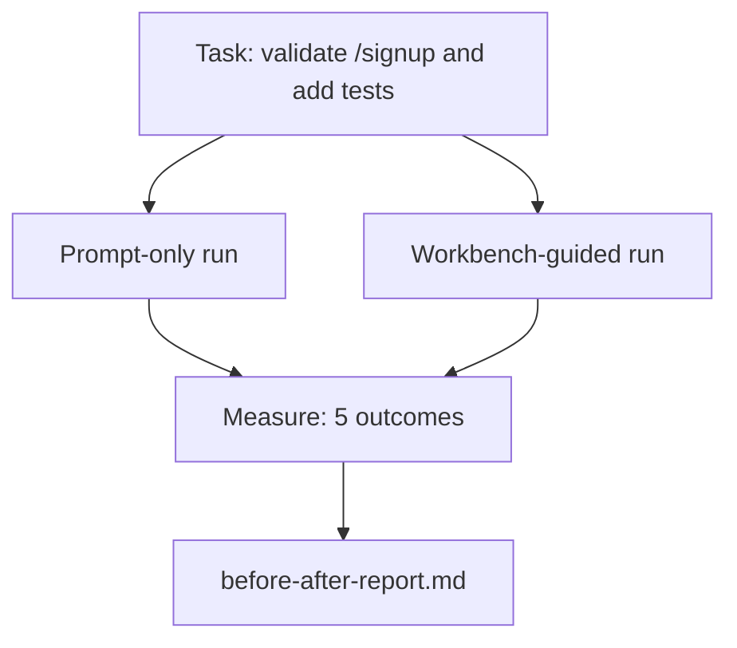

# Środowisko pracy na rzeczywistym repozytorium

> Jedenaście lekcji o interfejsach (powierzchniach styku) jest bezwartościowych, jeśli nie przetrwają one kontaktu z rzeczywistą bazą kodu. W tej lekcji dwukrotnie uruchomimy to samo zadanie w małej, przykładowej aplikacji: najpierw korzystając wyłącznie z promptu (podpowiedzi), a następnie ze wskazówek w środowisku warsztatowym (workbench). Liczby mówią same za siebie.

**Typ:** Kompilacja
**Języki:** Python (stdlib)
**Wymagania wstępne:** Fazy 14 · 32 do 14 · 40
**Czas:** ~60 minut

## Cele lekcji

- Połączenie siedmiu interfejsów środowiska roboczego (workbencha) w ramach małej aplikacji.
- Dwukrotne uruchomienie tego samego zadania (tylko z promptem oraz ze wsparciem środowiska warsztatowego) i zmierzenie pięciu wskaźników.
- Analiza raportu przed/po i ocena, które interfejsy przyniosły najlepsze rezultaty.
- Obrona koncepcji środowiska warsztatowego przed argumentami typu „ale mój model jest wystarczająco dobry”.

## Problem

Prezentacja oparta na trywialnym przykładzie (tzw. toy task) nikogo nie przekona. Argumentem przemawiającym za środowiskiem warsztatowym jest sytuacja, w której rzeczywiste zadanie w realistycznym repozytorium trafia na produkcję z mniejszą liczbą błędów, mniejszą liczbą poprawek i z pakietem dokumentacji, z którego może skorzystać kolejny agent lub programista w następnej sesji.

W tej lekcji dowiesz się, jak przygotować realistyczne repozytorium i uruchomić to samo zadanie w dwóch różnych potokach (pipelines). Wynikiem będzie raport przed/po, który możesz przedstawić sceptykom.

## Koncepcja



### Przykładowa aplikacja

Minimalna aplikacja w FastAPI w katalogu `sample_app/`:

- `app.py` z endpointem `/signup` (jeszcze bez walidacji).
- `test_app.py` z pojedynczym testem ścieżki pomyślnej (happy path).
- `README.md` oraz `scripts/release.sh` jako „przynęta” w strefie wyłączonej z zakresu prac.

### Zadanie

> Dodaj walidację danych wejściowych do `/signup`: odrzucaj hasła krótsze niż 8 znaków i zwracaj kod statusu 422 wraz z ustrukturyzowanym obiektem błędu. Dodaj test jednostkowy potwierdzający nowe zachowanie.

### Dwa potoki (pipelines)

Tylko prompt:

1. Odczyt pliku README.
2. Odczyt `app.py`.
3. Edycja plików.
4. Deklaracja zakończenia prac.

Z użyciem środowiska warsztatowego (workbench):

1. Uruchomienie skryptu inicjalizującego (Lekcja 35).
2. Odczytanie kontraktu zakresu (Lekcja 36).
3. Odczytanie stanu (Lekcja 34).
4. Edycja wyłącznie dozwolonych plików.
5. Uruchomienie testów akceptacyjnych za pomocą modułu informacji zwrotnej (Lekcja 37).
6. Uruchomienie bramki weryfikacyjnej (Lekcja 38).
7. Uruchomienie modułu recenzenckiego (Lekcja 39).
8. Wygenerowanie pakietu przekazania (Lekcja 40).

### Pięć mierzonych wskaźników

| Wskaźnik | Dlaczego to ważne |
|------------|----------------|
| `tests_actually_run` | Większość deklaracji o „zaliczonych testach” jest niemożliwa do zweryfikowania bez ich faktycznego uruchomienia |
| `acceptance_met` | Testem weryfikującym cel musi być ten, który rzeczywiście został uruchomiony i zaliczony |
| `files_outside_scope` | Rozrastanie się zakresu (scope creep) to najczęstsza przyczyna niewykrytych awarii |
| `handoff_quality` | Kolejna sesja opiera się na tych danych i bezpośrednio z nich korzysta |
| `reviewer_total` | Jakościowa ocena końcowa na etapie bramki weryfikacyjnej |

## Implementacja

Skrypt `code/main.py` koordynuje oba potoki na tej samej przykładowej aplikacji. Działanie obu potoków jest w pełni oskryptowane (bez udziału LLM w pętli), dzięki czemu pomiary są powtarzalne. Skrypt zapisuje wyniki porównania w plikach `before-after-report.md` oraz `comparison.json`.

Uruchomienie:

```
python3 code/main.py
```

Wyniki: konsolowa tabela z wynikami dla każdego potoku, raport w formacie Markdown zapisany obok skryptu oraz plik JSON dla każdego, kto chciałby przedstawić dane na wykresie.

## Przykłady z wdrożeń produkcyjnych

Sceptycy często pytają: „w jakim stopniu workbench rzeczywiście pomaga?”. Dane z 2026 roku są znacznie bardziej przekonujące niż jakiekolwiek teoretyczne wyjaśnienia.

**Awans w rankingu Terminal Bench z TOP 30 do TOP 5 na tym samym modelu.** Raport *Anatomia uprzęży agenta* firmy LangChain (kwiecień 2026): agent kodujący awansował z miejsca poza pierwszą trzydziestką na piąte miejsce w benchmarku Terminal Bench 2.0 wyłącznie dzięki modyfikacji środowiska uruchomieniowego (uprzęży). Ten sam model, inne interfejsy – różnica wyniosła aż 25 pozycji.

**Wzrost skuteczności w Vercel z 80% do 100% dzięki ograniczeniu narzędzi.** Zespół Vercel poinformował, że usunięcie 80% narzędzi dostępnych dla agenta zwiększyło wskaźnik sukcesu z 80% do 100%. Mniejsza liczba narzędzi, precyzyjniejszy zakres i mniej potencjalnych punktów awarii – minimalizm wygrywa.

**Dwukrotny wzrost dokładności systemu Harvey wyłącznie dzięki optymalizacji środowiska.** Platforma Harvey (AI dla branży prawniczej) ponad dwukrotnie zwiększyła dokładność swoich wyników dzięki optymalizacji środowiska uruchomieniowego agenta, bez wprowadzania zmian w samym modelu bazowym.

**88% korporacyjnych projektów agentowych AI nie trafia na produkcję.** Publikacja naukowa *Harness Engineering for Language Agents* (marzec 2026 r.) na portalu preprints.org wskazuje, że większość błędów wynika z problemów w fazie wykonania (runtime), a nie błędów rozumowania modelu. Główne przyczyny to: nieaktualny stan wiedzy, niestabilne mechanizmy ponawiania prób, zbyt duży kontekst oraz brak odporności na błędy pośrednie.

**Spadek wydajności w długim kontekście.** Początkowa skuteczność WebAgenta na poziomie 40–50% spada poniżej 10%, gdy kontekst staje się zbyt długi. Wynika to głównie z wpadania w nieskończone pętle i gubienia głównych celów. Pętla Ralpha i ustrukturyzowany pakiet przekazania (handoff) zostały zaprojektowane właśnie po to, by temu zapobiec.

**Wciąż występują przypadki fałszywie negatywne.** Proste, jednoetapowe zadania faktograficzne, poprawianie pojedynczych błędów lintera czy uruchamianie programów formatujących (formaterów) – czyli wszystko, co model potrafi odtworzyć z pamięci – są wykonywane szybciej za pomocą zwykłego promptu. Benchmark powinien rzetelnie uwzględniać takie przypadki, aby stosowanie rozbudowanego środowiska warsztatowego nie było postrzegane jako przerost formy nad treścią.

Kluczowym wnioskiem nie jest to, że „dobre środowisko uruchomieniowe zawsze rozwiąże każdy problem”. Z czasem modele zaczną bezpośrednio przyswajać techniki optymalizacji środowiskowej. Kluczowy wniosek na dziś jest taki, że inżynieryjny ciężar spoczywa na właściwym zaprojektowaniu siedmiu interfejsów (powierzchni styku), a liczby to potwierdzają.

## Zastosowanie

Ta lekcja stanowi zbiór argumentów, na które możesz się powołać, gdy:

- Ktoś pyta, dlaczego do każdego Pull Requesta (PR) musi być dołączony plik `agent-rules.md` oraz kontrakt zakresu prac.
- Zespół próbuje zrezygnować z bramki weryfikacyjnej „tylko na czas tego jednego sprintu”.
- Pojawia się nowe rozwiązanie agentowe i potrzebujesz uniwersalnego benchmarku, aby sprawdzić, czy rzeczywiście pozwala ono zaoszczędzić czas.

Liczby przemawiają silniej niż słowa.

## Rezultat prac

Plik `outputs/skill-workbench-benchmark.md` to uniwersalna platforma ewaluacyjna, która umożliwia uruchomienie dowolnego agenta w obu potokach na przykładowej aplikacji i mierzy pięć kluczowych wskaźników.

## Ćwiczenia

1. Dodaj szósty wskaźnik: czas do wykonania pierwszej istotnej edycji. Jak zmierzyć to w wiarygodny sposób?
2. Przeprowadź porównanie na rzeczywistym zadaniu w swojej bazie kodu. Jak wypadają wyniki dla środowiska warsztatowego (workbench)?
3. Uwzględnij przypadki „fałszywie negatywne”: zidentyfikuj zadania, przy których użycie samego promptu byłoby szybsze, a narzut środowiska warsztatowego generuje realny koszt. Przedstaw argumenty broniące stosowania workbencha mimo tych kosztów.
4. Zastąp oskryptowanego „agenta” rzeczywistym wywołaniem LLM. W których wskaźnikach widać największe wahania (szum)?
5. Przygotuj jednostronicowe podsumowanie (one-pager) dla osób spoza działu technicznego. Które informacje są kluczowe i powinny w nim pozostać?

## Kluczowe terminy

| Termin | Potoczne określenie | Co to naprawdę oznacza |
|------|----------------|--------------------------------------|
| Przykładowa aplikacja | „Repozytorium zabawek” (toy repo) | Mały, lecz wystarczająco realistyczny projekt do przetestowania wszystkich siedmiu interfejsów (powierzchni) |
| Potok (pipeline) | „Przepływ pracy” (workflow) | Uporządkowana sekwencja operacji odczytu/zapisu na interfejsach, realizowana przez agenta |
| Raport przed/po | „Dowód” / „Wyniki” | Dokumentacja przedstawiająca mierzalne korzyści, gotowa do pokazania sceptykom |
| Fałszywie negatywny | „Przerost formy (overengineering)” | Zadania, przy których sam prompt jest szybszy i bardziej opłacalny; warto je rzetelnie wskazać |
| Benchmark środowiska roboczego | „Test niezawodności” | Uniwersalny zestaw testowy służący do weryfikacji i porównania wydajności w bazie kodu |

## Dalsze czytanie

– [LangChain, The Anatomy of an Agent Harness](https://blog.langchain.com/the-anatomy-of-an-agent-harness/) — Awans w rankingu z TOP 30 do TOP 5
- [MongoDB, Agent Harness: Why the LLM is the Smallest Part of Your Agent System](https://www.mongodb.com/company/blog/technical/agent-harness-why-llm-is-smallest-part-of-your-agent-system) — Analiza danych z Vercel i Harvey
– [preprints.org, Harness Engineering for Language Agents](https://www.preprints.org/manuscript/202603.1756) — Ośmiodziesięcioośmioprocentowy wskaźnik awaryjności projektów korporacyjnych w fazie runtime
- [HN: Improving 15 LLMs on Coding in One Afternoon. Only Harness Changed](https://news.ycombinator.com/item?id=46988596) — Wyniki powtórzone na 15 modelach
– [Cloudflare, Orchestrating AI Code Review at Scale](https://blog.cloudflare.com/ai-code-review/) — Ponad 131 tysięcy recenzji kodu w ciągu 30 dni produkcyjnych
– [Anthropic, Building Effective Agents](https://www.anthropic.com/research/building-effective-agents)
- Fazy od 14 · 32 do 14 · 40 — interfejsy (powierzchnie), które ta lekcja omawia kompleksowo
- Faza 14 · 19 — SWE-bench, GAIA, AgentBench jako makro-benchmarki uzupełniane przez tę lekcję
- Faza 14 · 30 — tworzenie agentów w oparciu o ewaluację (eval-driven development), korzystających z tego samego środowiska uruchomieniowego
