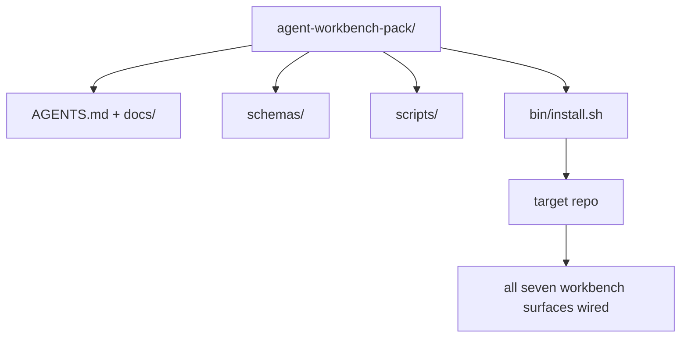

# Capstone: wyślij pakiet warsztatowy agenta wielokrotnego użytku

> Miniścieżka kończy się pakietem, który upuścisz w dowolnym repozytorium. Jedenaście lekcji o powierzchniach skompresowanych w katalogu, w którym możesz `cp -r` i mieć agenta działającego niezawodnie następnego ranka. Zwieńczenie jest artefaktem, na którym opiera się ten program nauczania.

**Typ:** Kompilacja
**Języki:** Python (stdlib)
**Wymagania wstępne:** Fazy 14 · 31 do 14 · 41
**Czas:** ~75 minut

## Cele nauczania

- Spakuj siedem powierzchni warsztatowych w jeden katalog rozwijany.
- Przypnij schematy, skrypty i szablony, aby nowe repozytorium uzyskało znany dobry poziom bazowy.
- Dodaj pojedynczy skrypt instalacyjny, który idempotentnie instaluje pakiet.
- Zdecyduj, co pozostanie w pakiecie, a co na zewnątrz, broniąc każdego z nich.

## Problem

Workbench oparty na dokumencie Google, historii czatów i trzech na wpół zapamiętanych skryptach to warsztat, który jest przebudowywany co kwartał. Lekarstwo to pakiet wersjonowany: repozytorium lub katalog z powierzchniami, schematami, skryptami i instalatorem uruchamianym jednym poleceniem.

Zakończysz tę lekcję z `outputs/agent-workbench-pack/` dostarczonym na dysku i `bin/install.sh`, który umieści go w dowolnym docelowym repozytorium.

## Koncepcja



### Układ paczki

```
outputs/agent-workbench-pack/
├── AGENTS.md
├── docs/
│   ├── agent-rules.md
│   ├── reliability-policy.md
│   ├── handoff-protocol.md
│   └── reviewer-rubric.md
├── schemas/
│   ├── agent_state.schema.json
│   ├── task_board.schema.json
│   └── scope_contract.schema.json
├── scripts/
│   ├── init_agent.py
│   ├── run_with_feedback.py
│   ├── verify_agent.py
│   └── generate_handoff.py
├── bin/
│   └── install.sh
└── README.md
```

### Co zostaje w środku, co zostaje na zewnątrz

W:

- Schematy powierzchniowe. Oni są umową.
- Cztery powyższe skrypty. Są środowiskiem wykonawczym.
- Cztery dokumenty. Są to zasady i rubryki.

Wyjście:

- Zadania specyficzne dla projektu. Zadania znajdują się na tablicy docelowego repozytorium, a nie w pakiecie.
- Połączenia SDK dostawcy. Pakiet jest niezależny od platformy.
- Proza wstępna. Pakiet znajduje się obok istniejącego systemu wdrażania zespołu, a nie w nim.

### Instalator

Krótki `bin/install.sh` (lub `bin/install.py`):

1. Odmawia instalacji na istniejącym pakiecie bez `--force`.
2. Kopiuje pakiet do repozytorium docelowego.
3. Łączy CI, jeśli istnieje `.github/workflows/`.
4. Drukuje kolejne kroki: wypełnij tablicę, ustaw komendy akceptacji, uruchom skrypt inicjujący.

### Wersjonowanie

Pakiet zawiera plik `VERSION`. Wpadki schematu i zmiany skryptu wymagające migracji powodują poważne problemy. Zmiany dotyczące wyłącznie dokumentów utrudniają łatkę. Docelowe repozytorium `agent_state.json` rejestruje wersję pakietu, dla której zostało zainicjowane.

## Zbuduj to

`code/main.py` składa pakiet w `outputs/agent-workbench-pack/` obok lekcji, zawierający schematy i skrypty z poprzednich lekcji w tej miniścieżce oraz dokumenty, które już napisałeś.

Uruchom to:

```
python3 code/main.py
```

Skrypt kopiuje i przypina powierzchnie, zapisuje plik README, drukuje drzewo pakietów i wychodzi z zera. Ponowne uruchomienie jest idempotentne.

## Wzorce produkcji na wolności

Pakiet jest wartościowy tylko wtedy, gdy przetrwa rozwidlenia, aktualizacje i nieprzyjazny upstream. Cztery wzory sprawiają, że to działa.

**`VERSION` to umowa, a nie marketing.** Większe wstrząsy wymagają migracji stanu. Drobne nierówności wymagają ponownego uruchomienia kontrolera. Zmiany w łatkach są dostępne wyłącznie w dokumentach. Instalator zapisuje `.workbench-version` w repozytorium docelowym przy każdej instalacji; `lint_pack.py` odmawia wysyłki, jeśli zamek celu nie zgadza się z `VERSION` pakietu. W ten sposób `npm`, `Cargo` i `pyproject.toml` przetrwały 10 lat rezygnacji; nic o agentach nie zmienia zasad.

**Pojedyncze źródło dystrybucji obejmującej wiele narzędzi.** Nx dostarcza jedno `nx ai-setup`, które zawiera `AGENTS.md`, `CLAUDE.md`, `.cursor/rules/`, `.github/copilot-instructions.md` i serwer MCP z jednej konfiguracji. Paczka powinna zrobić to samo; instalator emituje dowiązania symboliczne (`ln -s AGENTS.md CLAUDE.md`), więc do każdego agenta kodującego dociera jedno źródło prawdy. Rozwidlanie pakietu w celu obsługi jednego narzędzia nad drugim jest trybem awaryjnym.

**`uninstall.sh`, który odmawia w przypadku nietypowego stanu.** Deinstalacja pakietu nie może usunąć `agent_state.json`, `task_board.json` ani `outputs/` użytkownika. Deinstalator usuwa schematy, skrypty, dokumenty i `AGENTS.md` (z opcją rezygnacji `--keep-agents-md`) i odmawia kontynuowania, jeśli pliki stanu zawierają niezatwierdzone zmiany. Stan należy do użytkownika; pakiet nie jest jego właścicielem.

**Umiejętności dostępne do publikacji. Dystrybucja w stylu SkillKit.** Pakiet jest dostarczany jako umiejętność SkillKit: `skillkit install agent-workbench-pack` obejmuje ją dla 32 agentów AI z jednego źródła. Repozytorium pakietu jest źródłem prawdy; SkillKit to kanał dystrybucji. Załamanie się blokady dostawcy; siedem powierzchni pozostaje takich samych.

## Użyj tego

Trzy miejsca, w których paczka jest wysyłana:

- **Jako katalog upuszczasz do repozytorium.** `cp -r outputs/agent-workbench-pack /path/to/repo`.
- **Jako publiczne repozytorium szablonów.** Możliwość rozwidlenia i dostosowania, z kontrolą dryfu `VERSION`.
- **Jako umiejętność SkillKit.** Podłączona do produktu agenta, więc wystarczy jedno polecenie.

Opakowanie to przepis. Każda instalacja to porcja.

## Wyślij to

`outputs/skill-workbench-pack.md` generuje pakiet dostosowany do projektu: reguły dostosowane do historii zespołu, globusy zakresu dopasowane do repozytorium, wymiary rubryk rozszerzone o jeden wpis specyficzny dla domeny.

## Ćwiczenia

1. Zdecyduj, który opcjonalny piąty dokument zasługuje na awans do pakietu kanonicznego. Broń cięcia.
2. Przepisz instalator jako Python z flagą `--dry-run`. Porównaj ergonomię z bashem.
3. Dodaj `bin/uninstall.sh`, który bezpiecznie usuwa pakiet i odmawia, jeśli pliki stanu mają nietrywialną historię. Co uważa się za nietrywialne?
4. Dodaj `lint_pack.py`, który kończy się niepowodzeniem, gdy pakiet dryfuje z `VERSION`. Podłącz go do CI, aby uzyskać własne repozytorium pakietu.
5. Utwórz element Runbook migracji z ręcznie opracowanego środowiska roboczego do tego pakietu. Jaka jest kolejność operacji, która minimalizuje przestoje?

## Kluczowe terminy

| Termin | Co ludzie mówią | Co to właściwie oznacza |
|------|----------------|--------------------------------------|
| Pakiet stołu warsztatowego | „Zestaw startowy” | Wersjonowany katalog zawierający wszystkie siedem powierzchni |
| Instalator | „Skrypt instalacyjny” | `bin/install.sh`, który ustawia pakiet idempotentnie |
| Wersja pakietu | „WERSJA” | Poważne zmiany w schemacie/skrypcie, poprawka tylko dla dokumentów |
| Pakiet wrzutowy | „cp -r i idź” | Pakiet działa bez dostosowywania poszczególnych repo już pierwszego dnia |
| Szablon do rozwidlenia | „Szablon GitHuba” | Publiczne repozytorium, z którego można sklonować opcję „Użyj tego szablonu” w serwisie GitHub |

## Dalsze czytanie

- Fazy 14 · 31 do 14 · 41 — każda powierzchnia zawarta w tym pakiecie
- [SkillKit](https://github.com/rohitg00/skillkit) — zainstaluj tę umiejętność u 32 agentów AI
– [Blog Nx, Naucz swojego agenta AI, jak pracować w Monorepo](https://nx.dev/blog/nx-ai-agent-skills) — generator z jednego źródła w sześciu narzędziach
- [agents.md — otwarta specyfikacja](https://agents.md/) — co musi implementować router Twojego pakietu
- [HKUDS/OpenHarness](https://github.com/HKUDS/OpenHarness) — referencyjna implementacja odpowiednika pakietu
- [andrewgarst/agentic_harness](https://github.com/andrewgarst/agentic_harness) — Referencja oparta na Redis z pakietem eval
— [Kod rozszerzający, dobry plik AGENTS.md to aktualizacja modelu](https://www.augmentcode.com/blog/how-to-write-good-agents-dot-md-files) — pasek jakości dokumentów pakietu
- [Antropiczne, skuteczne uprzęże dla agentów działających długotrwale](https://www.anthropic.com/engineering/efektywne-harnesses-for-long-running-agents)
- [Anthropic, projekt uprzęży do długotrwałego tworzenia aplikacji](https://www.anthropic.com/engineering/harness-design-long-running-apps)
- Faza 14 · 30 — rozwój agenta opartego na ewaluacji, który wykorzystuje bramkę weryfikacyjną pakietu
- Faza 14 · 41 — punkt odniesienia przed/po, który ten pakiet udoskonala