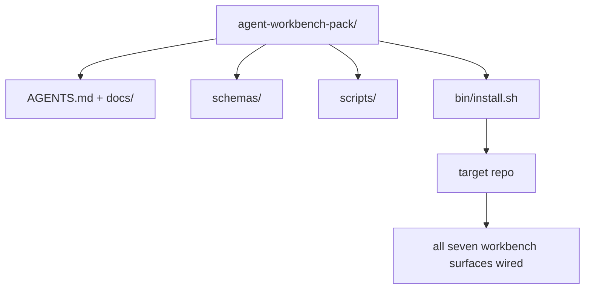

# Projekt końcowy (Capstone): wdrożenie uniwersalnego pakietu środowiska warsztatowego dla agenta

> Ta mini-ścieżka edukacyjna kończy się przygotowaniem pakietu, który możesz łatwo wdrożyć w dowolnym repozytorium. Wiedza z jedenastu lekcji o interfejsach (powierzchniach styku) została skondensowana w pojedynczym katalogu — wystarczy użyć polecenia `cp -r`, aby już następnego dnia cieszyć się stabilnie działającym agentem. Ten projekt końcowy (capstone) jest kluczowym efektem całego programu nauczania.

**Typ:** Kompilacja
**Języki:** Python (stdlib)
**Wymagania wstępne:** Fazy 14 · 31 do 14 · 41
**Czas:** ~75 minut

## Cele lekcji

- Spakowanie siedmiu interfejsów (powierzchni) środowiska warsztatowego w jeden gotowy do wdrożenia katalog.
- Przygotowanie schematów, skryptów i szablonów gwarantujących stabilny punkt startowy dla każdego nowego repozytorium.
- Stworzenie skryptu instalacyjnego zapewniającego idempotentną instalację pakietu.
- Podjęcie decyzji, które elementy powinny znaleźć się w pakiecie, a które poza nim, wraz z uzasadnieniem tych wyborów.

## Problem

Środowisko warsztatowe (workbench) oparte na dokumentach Google Docs, historii czatów i kilku prowizorycznych skryptach to rozwiązanie, które trzeba budować na nowo co kwartał. Rozwiązaniem tego problemu jest wersjonowany pakiet: ustrukturyzowane repozytorium lub katalog zawierający interfejsy, schematy, skrypty oraz instalator uruchamiany pojedynczym poleceniem.

Efektem tej lekcji będzie gotowy pakiet w katalogu `outputs/agent-workbench-pack/` oraz skrypt instalacyjny `bin/install.sh` służący do przenoszenia go do dowolnego repozytorium docelowego.

## Koncepcja



### Struktura pakietu

```
outputs/agent-workbench-pack/
├── AGENTS.md
├── docs/
│   ├── agent-rules.md
│   ├── reliability-policy.md
│   ├── handoff-protocol.md
│   └── reviewer-rubric.md
├── schemas/
│   ├── agent_state.schema.json
│   ├── task_board.schema.json
│   └── scope_contract.schema.json
├── scripts/
│   ├── init_agent.py
│   ├── run_with_feedback.py
│   ├── verify_agent.py
│   └── generate_handoff.py
├── bin/
│   └── install.sh
└── README.md
```

### Co wchodzi w skład pakietu, a co zostaje poza nim

W pakiecie:

- Schematy interfejsów (powierzchni) — stanowią one kontrakt.
- Cztery wymienione wyżej skrypty — odpowiadają one za środowisko uruchomieniowe.
- Cztery dokumenty — definiują one zasady i rubryki oceny.

Poza pakietem:

- Zadania specyficzne dla danego projektu — powinny znajdować się na tablicy zadań docelowego repozytorium, a nie w samym pakiecie uniwersalnym.
- Integracje z SDK konkretnych dostawców — pakiet musi pozostać niezależny od dostawców (platform-agnostic).
- Wprowadzenia i teksty ogólne — pakiet ma funkcjonować obok istniejącego systemu wdrażania w zespole, a nie stawać się jego częścią.

### Instalator

Działanie skryptu instalacyjnego `bin/install.sh` (lub `bin/install.py`):

1. Odmowa instalacji na istniejącym już pakiecie, chyba że użyto flagi `--force`.
2. Skopiowanie plików pakietu do repozytorium docelowego.
3. Konfiguracja i podpięcie potoku CI (jeśli w projekcie istnieje katalog `.github/workflows/`).
4. Wyświetlenie instrukcji dotyczących kolejnych kroków (np. uzupełnienie tablicy zadań, zdefiniowanie poleceń akceptacyjnych, uruchomienie skryptu inicjalizującego).

### Wersjonowanie

Pakiet zawiera plik `VERSION`. Zmiany w schematach i skryptach wymagające migracji danych podnoszą wersję główną (major), ponieważ mogą powodować problemy z kompatybilnością. Zmiany dotyczące wyłącznie dokumentacji podnoszą wersję poprawkową (patch). Plik stanu `agent_state.json` w docelowym repozytorium rejestruje wersję pakietu, z której został zainicjalizowany.

## Implementacja

Skrypt `code/main.py` buduje gotowy pakiet w katalogu `outputs/agent-workbench-pack/`, gromadząc schematy i skrypty z poprzednich lekcji tej ścieżki oraz dokumenty, które zostały wcześniej przygotowane.

Uruchomienie:

```
python3 code/main.py
```

Skrypt kopiuje i konfiguruje interfejsy, zapisuje plik README, wyświetla strukturę katalogów pakietu i kończy działanie z kodem wyjścia 0. Ponowne uruchomienie skryptu jest idempotentne.

## Przykłady z wdrożeń produkcyjnych

Pakiet jest naprawdę użyteczny tylko wtedy, gdy radzi sobie z forkami (rozwidleniami), aktualizacjami i niekompatybilnymi zmianami w głównym repozytorium (upstream). Oto cztery wzorce projektowe gwarantujące stabilność:

**Wersjonowanie (`VERSION`) jako wiążący kontrakt.** Poważne modyfikacje (major) wymagają migracji stanu. Mniejsze zmiany (minor) mogą wymagać restartu kontrolera. Wersje poprawkowe (patch) obejmują wyłącznie zmiany w dokumentacji. Przy każdej instalacji skrypt zapisuje plik `.workbench-version` w repozytorium docelowym. Z kolei skrypt `lint_pack.py` uniemożliwia wdrożenie, jeśli wersja docelowa nie zgadza się z `VERSION` pakietu. Dzięki tym zasadom systemy takie jak `npm`, `Cargo` czy `pyproject.toml` przetrwały lata bez utraty stabilności; systemy agentowe również muszą przestrzegać tych reguł.

**Jedno źródło prawdy dla wielu narzędzi.** Przykładem jest Nx, który dostarcza jedno polecenie `nx ai-setup` generujące `AGENTS.md`, `CLAUDE.md`, `.cursor/rules/`, `.github/copilot-instructions.md` oraz serwer MCP z pojedynczego szablonu. Nasz pakiet powinien działać analogicznie: instalator tworzy dowiązania symboliczne (np. `ln -s AGENTS.md CLAUDE.md`), dzięki czemu każdy agent korzysta z tego samego źródła wiedzy. Tworzenie osobnych forków pakietu dla poszczególnych edytorów lub narzędzi jest błędem (anti-patternem).

**Bezpieczny skrypt odinstalowujący (`uninstall.sh`).** Proces deinstalacji nie może usuwać plików użytkownika, takich jak `agent_state.json`, `task_board.json` czy zawartości katalogu `outputs/`. Skrypt odinstalowujący usuwa jedynie schematy, skrypty, dokumentację oraz plik `AGENTS.md` (chyba że użyto flagi `--keep-agents-md`). Co więcej, skrypt przerywa działanie, jeśli pliki stanu zawierają niezatwierdzone zmiany. Stan należy do użytkownika — pakiet nie powinien w niego ingerować.

**Dystrybucja w formie gotowych modułów (np. SkillKit).** Pakiet może być dystrybuowany jako gotowa umiejętność, np. polecenie `skillkit install agent-workbench-pack` instaluje go dla wielu agentów AI z jednego źródła. Repozytorium pakietu stanowi tu źródło prawdy, a platforma taka jak SkillKit służy jako kanał dystrybucji. Pozwala to uniknąć uzależnienia od jednego dostawcy (vendor lock-in), przy jednoczesnym zachowaniu spójności siedmiu interfejsów (powierzchni).

## Zastosowanie

Trzy główne sposoby wdrożenia pakietu:

- **Bezpośrednie skopiowanie katalogu do repozytorium:** `cp -r outputs/agent-workbench-pack /path/to/repo`.
- **Jako publiczny szablon repozytorium (template repository):** Umożliwia łatwe tworzenie forków i dostosowywanie kodu, przy jednoczesnym kontrolowaniu spójności wersji (`VERSION`).
- **Jako umiejętność SkillKit:** Bezpośrednio podpięta pod agenta i instalowana za pomocą jednego polecenia.

Pakiet to sprawdzony przepis, a każda instalacja to gotowe danie.

## Rezultat prac

Plik `outputs/skill-workbench-pack.md` generuje pakiet dostosowany do specyfiki projektu: reguły są dopasowane do historii prac zespołu, reguły ignorowania plików (glob patterns) odpowiadają strukturze repozytorium, a kryteria ocen (rubryki) zostały rozszerzone o elementy specyficzne dla danej domeny.

## Ćwiczenia

1. Zdecuduj, który dodatkowy dokument zasługuje na włączenie do podstawowego pakietu. Uzasadnij swój wybór.
2. Przepisz instalator w Pythonie, dodając flagę `--dry-run`. Porównaj wygodę użytkowania z wersją w Bashu.
3. Stwórz skrypt `bin/uninstall.sh`, który bezpiecznie odinstaluje pakiet i przerwie działanie, jeśli pliki stanu zawierają istotne, unikalne zmiany. Jak zdefiniować takie zmiany?
4. Napisz skrypt `lint_pack.py` zgłaszający błąd, gdy stan docelowy rozbiega się z wersją zadeklarowaną w `VERSION`. Podepnij go pod proces CI we własnym repozytorium pakietu.
5. Przygotuj instrukcję (Runbook) migracji z dotychczasowego, ręcznie konfigurowanego środowiska roboczego na ten ujednolicony pakiet. Jaka kolejność działań zminimalizuje czas przestoju?

## Kluczowe terminy

| Termin | Potoczne określenie | Co to naprawdę oznacza |
|------|----------------|--------------------------------------|
| Pakiet środowiska warsztatowego (workbench pack) | „Zestaw startowy” (starter kit) | Wersjonowany katalog zawierający komplet siedmiu interfejsów (powierzchni) |
| Instalator | „Skrypt instalacyjny” | Skrypt `bin/install.sh` instalujący i konfigurujący pakiet w sposób idempotentny |
| Wersja pakietu | „VERSION” | Numer wersji; zmiany major oznaczają modyfikację schematów/skryptów, patch — jedynie poprawki w dokumentach |
| Pakiet gotowy do wdrożenia (drop-in) | „cp -r i gotowe” | Pakiet działający w nowym repozytorium od pierwszego dnia bez konieczności dodatkowej konfiguracji |
| Szablon do forknięcia | „Szablon na GitHubie” | Publiczne repozytorium udostępnione jako szablon na GitHubie (opcja „Use this template”) |

## Dalsza lektura

- Fazy od 14 · 31 do 14 · 41 — szczegółowy opis każdego interfejsu wchodzącego w skład pakietu
- [SkillKit](https://github.com/rohitg00/skillkit) — narzędzie umożliwiające instalację tej umiejętności u wielu agentów AI
- [Blog Nx, Teach Your AI Agent How to Work in a Monorepo](https://nx.dev/blog/nx-ai-agent-skills) — generator konfiguracji z jednego źródła prawdy
- [agents.md — otwarta specyfikacja](https://agents.md/) — wymagania dotyczące implementacji routera w pakiecie
- [HKUDS/OpenHarness](https://github.com/HKUDS/OpenHarness) — referencyjna implementacja zbliżonego rozwiązania
- [andrewgarst/agentic_harness](https://github.com/andrewgarst/agentic_harness) — referencyjne środowisko oparte na Redis z pakietem ewaluacyjnym
- [Augment Code, A Good AGENTS.md is a Model Upgrade](https://www.augmentcode.com/blog/how-to-write-good-agents-dot-md-files) — wytyczne dotyczące tworzenia wysokiej jakości dokumentów AGENTS.md
- [Anthropic, Effective harnesses for long-running agents](https://www.anthropic.com/engineering/effective-harnesses-for-long-running-agents)
- [Anthropic, Harness design for long-running apps](https://www.anthropic.com/engineering/harness-design-long-running-apps)
- Faza 14 · 30 — rozwój agentów oparty na ewaluacji z użyciem wbudowanej w pakiet bramki weryfikacyjnej
- Faza 14 · 41 — benchmark przed/po, który jest rozwijany i wdrażany za pomocą tego pakietu
