# Protokoły komunikacyjne

> Agenci, którzy nie mówią tym samym językiem, nie stanowią zespołu. To obcy ludzie krzyczący w pustkę.

**Typ:** Kompilacja
**Języki:** TypeScript
**Wymagania wstępne:** Faza 14 (Inżynieria agentów), Lekcja 16.01 (Dlaczego wieloagentowy)
**Czas:** ~120 minut

## Cele nauczania

- Zaimplementuj wykrywanie i wywoływanie narzędzi MCP, aby agenci mogli korzystać z narzędzi udostępnianych przez serwery zewnętrzne
- Zbuduj kartę agenta A2A i punkt końcowy zadania, który umożliwi jednemu agentowi delegowanie pracy innemu za pośrednictwem protokołu HTTP
- Porównaj MCP (dostęp do narzędzi), A2A (agent-agent), ACP (audyt przedsiębiorstwa) i ANP (zdecentralizowane zaufanie) i wyjaśnij, który protokół rozwiązuje dany problem
- Połącz wiele protokołów w jeden system, w którym agenci odkrywają narzędzia za pośrednictwem MCP i delegują zadania za pośrednictwem A2A

## Problem

Dzielisz swój system na wielu agentów. Badacz, koder, recenzent. Są świetni w swoich indywidualnych zadaniach. Ale teraz potrzebujesz, żeby rzeczywiście ze sobą porozmawiali.

Twoja pierwsza próba jest oczywista: przekaż ciągi znaków. Badacz zwraca kroplę tekstu, koder analizuje go w dowolny sposób. Działa to do czasu, gdy programista błędnie zinterpretuje podsumowanie badania, dwóch agentów utknie w martwym punkcie i czeka na siebie, lub do współpracy będą potrzebni agenci zbudowani przez różne zespoły. Nagle „po prostu przekaż sznurki” rozpada się.

Jest to problem protokołu komunikacyjnego. Bez wspólnej umowy dotyczącej sposobu, w jaki agenci wymieniają informacje, systemy wieloagentowe są kruche, niemożliwe do skontrolowania i niemożliwe do skalowania poza garstkę agentów, których osobiście napisałeś.

Ekosystem sztucznej inteligencji odpowiedział czterema protokołami, z których każdy rozwiązuje inny fragment problemu:

- **MCP** dla dostępu do narzędzi
- **A2A** w przypadku współpracy między agentami
- **ACP** dla audytowalności przedsiębiorstwa
- **ANP** dla zdecentralizowanej tożsamości i zaufania

Ta lekcja jest głęboka. Będziesz czytać rzeczywiste formaty przewodów z każdej specyfikacji, budować działające implementacje i łączyć wszystkie cztery w zunifikowany system.

## Koncepcja

### Krajobraz protokołu

Pomyśl o tych czterech protokołach jako o warstwach, z których każdy dotyczy innego pytania:

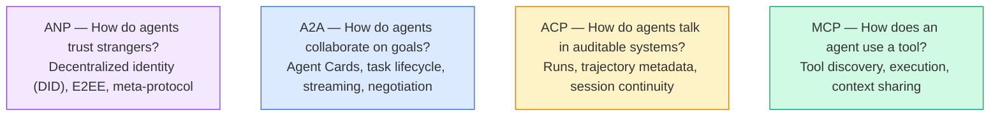

To nie są konkurenci. Rozwiązują różne problemy na różnych poziomach.

### MCP (podsumowanie)

MCP zostało szczegółowo omówione w fazie 13. Szybkie podsumowanie: MCP standaryzuje sposób, w jaki LLM łączy się z zewnętrznymi narzędziami i źródłami danych. Jest to protokół **klient-serwer**, w którym agent (klient) odkrywa i wywołuje narzędzia udostępnione przez serwer.

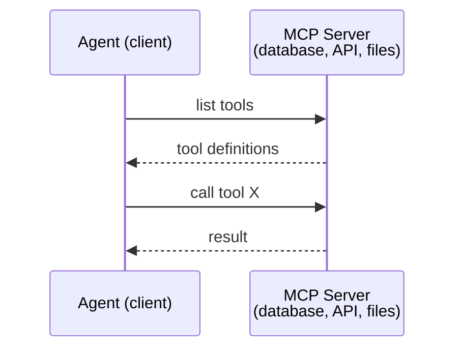

MCP to komunikacja **agent-narzędzie**. To nie pomaga agentom rozmawiać ze sobą.

### A2A (protokół Agent2Agent)

**Utworzony przez:** Google (obecnie w ramach Linux Foundation jako `lf.a2a.v1`)
**Wersja specyfikacji:** 1.0.0
**Problem:** W jaki sposób autonomiczni agenci współpracują, negocjują i delegują sobie zadania?

A2A to protokół **współpracy agentów peer-to-peer**. Tam, gdzie MCP łączy agenta z narzędziami, A2A łączy agenta z innymi agentami. Każdy agent publikuje **Kartę Agenta** pod dobrze znanym adresem URL, a inni agenci odkrywają ją, negocjują z nią i delegują jej zadania.

#### Jak działa A2A

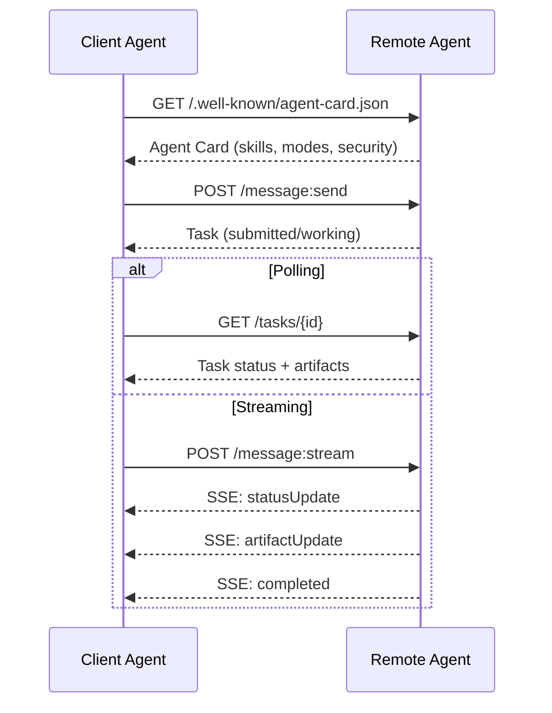

#### Karta prawdziwego agenta

Tak w rzeczywistości wygląda karta agenta A2A. Podawane w `GET /.well-known/agent-card.json`:

```json
{
  "name": "Research Agent",
  "description": "Searches documentation and summarizes findings",
  "version": "1.0.0",
  "supportedInterfaces": [
    {
      "url": "https://research-agent.example.com/a2a/v1",
      "protocolBinding": "JSONRPC",
      "protocolVersion": "1.0"
    },
    {
      "url": "https://research-agent.example.com/a2a/rest",
      "protocolBinding": "HTTP+JSON",
      "protocolVersion": "1.0"
    }
  ],
  "provider": {
    "organization": "Your Company",
    "url": "https://example.com"
  },
  "capabilities": {
    "streaming": true,
    "pushNotifications": false
  },
  "defaultInputModes": ["text/plain", "application/json"],
  "defaultOutputModes": ["text/plain", "application/json"],
  "skills": [
    {
      "id": "web-research",
      "name": "Web Research",
      "description": "Searches the web and synthesizes findings",
      "tags": ["research", "search", "summarization"],
      "examples": ["Research the latest changes in React 19"]
    },
    {
      "id": "doc-analysis",
      "name": "Documentation Analysis",
      "description": "Reads and analyzes technical documentation",
      "tags": ["docs", "analysis"],
      "inputModes": ["text/plain", "application/pdf"],
      "outputModes": ["application/json"]
    }
  ],
  "securitySchemes": {
    "bearer": {
      "httpAuthSecurityScheme": {
        "scheme": "Bearer",
        "bearerFormat": "JWT"
      }
    }
  },
  "security": [{ "bearer": [] }]
}
```

Najważniejsze rzeczy, na które warto zwrócić uwagę:
- **Umiejętności** to coś, co może zrobić agent. Każdy z nich ma identyfikator, znaczniki i obsługiwane typy MIME wejścia/wyjścia. W ten sposób agent klienta decyduje, czy zdalny agent może obsłużyć jego żądanie.
- **supportedInterfaces** zawiera listę wielu powiązań protokołów. Pojedynczy agent może jednocześnie używać języków JSON-RPC, REST i gRPC.
- **Bezpieczeństwo** jest wbudowane w kartę. Klient wie, jakiego uwierzytelnienia potrzebuje przed złożeniem pojedynczego żądania.

#### Cykl życia zadania

Zadania są podstawową jednostką pracy w A2A. Przechodzą przez określone stany:

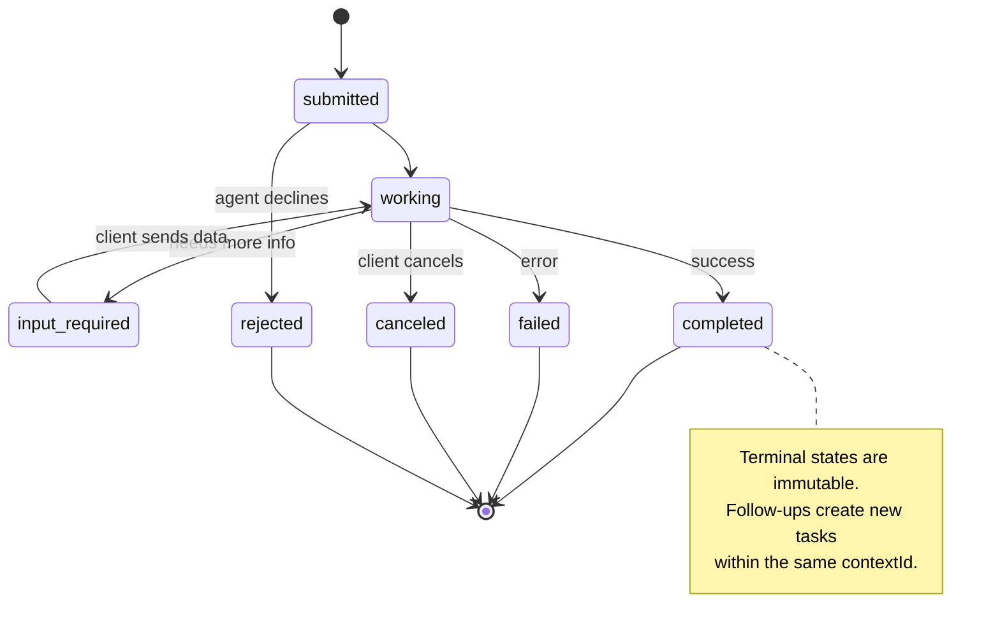

Wszystkie 8 stanów (specyfikacja definiuje również `UNSPECIFIED` jako wartownika, tutaj pominięto):

| stan | Terminal? | Znaczenie |
|---|---|---|
| `TASK_STATE_SUBMITTED` | Nie | Potwierdzono, jeszcze nie przetwarzano |
| `TASK_STATE_WORKING` | Nie | Aktywnie przetwarzane |
| `TASK_STATE_INPUT_REQUIRED` | Nie | Agent potrzebuje więcej informacji od klienta |
| `TASK_STATE_AUTH_REQUIRED` | Nie | Wymagane uwierzytelnienie |
| `TASK_STATE_COMPLETED` | Tak | Zakończono pomyślnie |
| `TASK_STATE_FAILED` | Tak | Zakończono z błędem |
| `TASK_STATE_CANCELED` | Tak | Anulowano przed zakończeniem |
| `TASK_STATE_REJECTED` | Tak | Agent odrzucił zadanie |

Gdy zadanie osiągnie stan końcowy, jest niezmienne. Żadnych dalszych wiadomości. Kontynuacje tworzą nowe zadanie w ramach tego samego `contextId`.

#### Format przewodu

A2A używa JSON-RPC 2.0. Oto jak wygląda prawdziwa wymiana wiadomości:

**Klient wysyła zadanie:**

```json
{
  "jsonrpc": "2.0",
  "id": 1,
  "method": "SendMessage",
  "params": {
    "message": {
      "messageId": "msg-001",
      "role": "ROLE_USER",
      "parts": [{ "text": "Research React 19 compiler features" }]
    },
    "configuration": {
      "acceptedOutputModes": ["text/plain", "application/json"],
      "historyLength": 10
    }
  }
}
```

**Agent odpowiada zadaniem:**

```json
{
  "jsonrpc": "2.0",
  "id": 1,
  "result": {
    "task": {
      "id": "task-abc-123",
      "contextId": "ctx-xyz-789",
      "status": {
        "state": "TASK_STATE_COMPLETED",
        "timestamp": "2026-03-27T10:30:00Z"
      },
      "artifacts": [
        {
          "artifactId": "art-001",
          "name": "research-results",
          "parts": [{
            "data": {
              "findings": [
                "React 19 compiler auto-memoizes components",
                "No more manual useMemo/useCallback needed",
                "Compiler runs at build time, not runtime"
              ]
            },
            "mediaType": "application/json"
          }]
        }
      ]
    }
  }
}
```

**Streaming przez SSE:**

```text
POST /message:stream HTTP/1.1
Content-Type: application/json
A2A-Version: 1.0

data: {"task":{"id":"task-123","status":{"state":"TASK_STATE_WORKING"}}}

data: {"statusUpdate":{"taskId":"task-123","status":{"state":"TASK_STATE_WORKING","message":{"role":"ROLE_AGENT","parts":[{"text":"Searching documentation..."}]}}}}

data: {"artifactUpdate":{"taskId":"task-123","artifact":{"artifactId":"art-1","parts":[{"text":"partial findings..."}]},"append":true,"lastChunk":false}}

data: {"statusUpdate":{"taskId":"task-123","status":{"state":"TASK_STATE_COMPLETED"}}}
```

### ACP (protokół komunikacji agenta)

**Utworzony przez:** IBM / BeeAI
**Wersja specyfikacji:** 0.2.0 (OpenAPI 3.1.1)
**Stan:** Połączenie z A2A w ramach Linux Foundation
**Problem:** W jaki sposób agenci komunikują się, zapewniając pełną kontrolę, ciągłość sesji i śledzenie trajektorii?

ACP to **protokół korporacyjny**. W przeciwieństwie do tego, co twierdzi wiele podsumowań, ACP **nie** używa JSON-LD. Jest to proste API REST/JSON zdefiniowane poprzez OpenAPI. To, co czyni tę usługę wyjątkową, to **TrajectoryMetadata**: każda odpowiedź agenta może zawierać szczegółowy dziennik kroków wnioskowania i wywołań narzędzi, które ją wygenerowały.

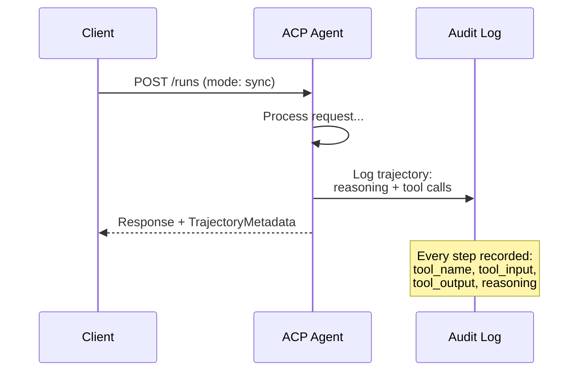

#### Wykrywanie agenta w ACP

ACP definiuje cztery metody wykrywania:

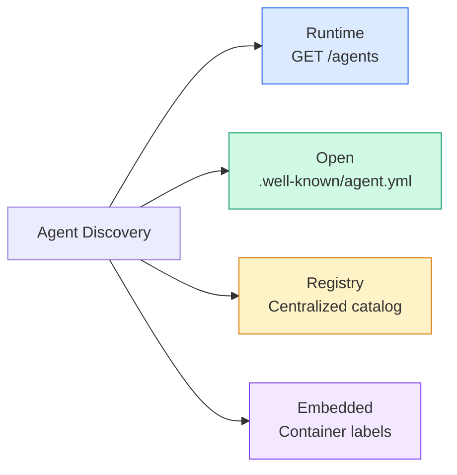

**AgentManifest** jest prostszy niż karta agenta A2A:

```json
{
  "name": "summarizer",
  "description": "Summarizes documents with source citations",
  "input_content_types": ["text/plain", "application/pdf"],
  "output_content_types": ["text/plain", "application/json"],
  "metadata": {
    "tags": ["summarization", "RAG"],
    "framework": "BeeAI",
    "capabilities": [
      {
        "name": "Document Summarization",
        "description": "Condenses long documents into key points"
      }
    ],
    "recommended_models": ["llama3.3:70b-instruct-fp16"],
    "license": "Apache-2.0",
    "programming_language": "Python"
  }
}
```

#### Uruchom cykl życia

ACP używa „Uruchomień” zamiast „Zadań”. Uruchomienie to wykonanie agenta w trzech trybach:

| Tryb | Zachowanie |
|---|---|
| `sync` | Bloking. Odpowiedź zawiera pełny wynik. |
| `async` | Natychmiast zwraca 202. Ankieta `GET /runs/{id}`, aby sprawdzić stan. |
| `stream` | Strumień SSE. Zdarzenia są uruchamiane w miarę działania agenta. |

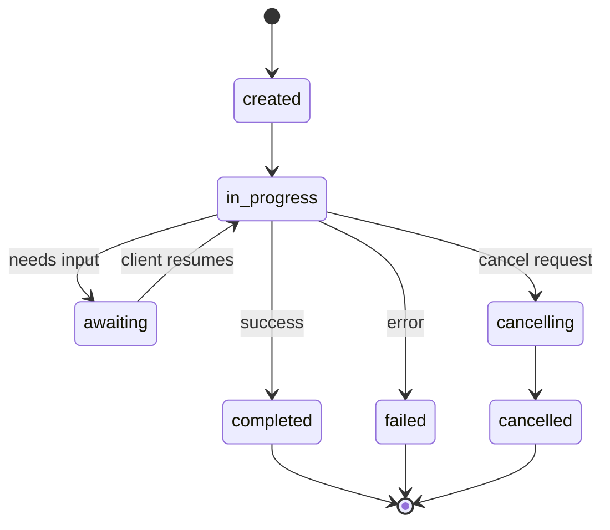

#### TrajectoryMetadata (ścieżka audytu)

Jest to kluczowy wyróżnik ACP. Każda część wiadomości może zawierać metadane pokazujące dokładnie, co zrobił agent:

```json
{
  "role": "agent/researcher",
  "parts": [
    {
      "content_type": "text/plain",
      "content": "The weather in San Francisco is 72F and sunny.",
      "metadata": {
        "kind": "trajectory",
        "message": "I need to check the weather for this location",
        "tool_name": "weather_api",
        "tool_input": { "location": "San Francisco, CA" },
        "tool_output": { "temperature": 72, "condition": "sunny" }
      }
    }
  ]
}
```

Dla branż regulowanych jest to złoto. Każda odpowiedź zawiera możliwy do udowodnienia ciąg rozumowania: jakie narzędzia zostały wywołane, jakie dane wejściowe zostały użyte, jakie otrzymano wyniki. Brak czarnej skrzynki.

ACP obsługuje również **CitationMetadata** w celu przypisania źródła:

```json
{
  "kind": "citation",
  "start_index": 0,
  "end_index": 47,
  "url": "https://weather.gov/sf",
  "title": "NWS San Francisco Forecast"
}
```

### ANP (protokół sieci agenta)

**Utworzony przez:** Społeczność open source (założona przez GaoWei Chang)
**Repo:** [github.com/agent-network-protocol/AgentNetworkProtocol](https://github.com/agent-network-protocol/AgentNetworkProtocol)
**Problem:** W jaki sposób agenci z różnych organizacji mogą sobie ufać bez organu centralnego?

ANP to **zdecentralizowany protokół tożsamości**. Buduje zaufanie przy użyciu zdecentralizowanych identyfikatorów W3C (DID) i kompleksowego szyfrowania. W przeciwieństwie do A2A, w którym agenty są odkrywane za pośrednictwem znanych punktów końcowych, ANP umożliwia agentom kryptograficzne potwierdzanie swojej tożsamości.

ANP ma trzy warstwy:

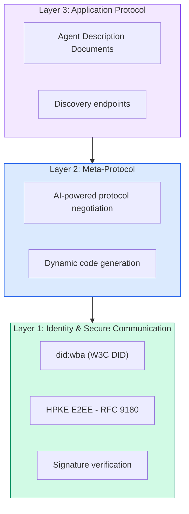

#### Dokumenty DID (rzeczywista struktura)

ANP używa niestandardowej metody DID o nazwie `did:wba` (Agent internetowy). DID `did:wba:example.com:user:alice` jest przekształcany na `https://example.com/user/alice/did.json`:

```json
{
  "@context": [
    "https://www.w3.org/ns/did/v1",
    "https://w3id.org/security/suites/jws-2020/v1",
    "https://w3id.org/security/suites/secp256k1-2019/v1"
  ],
  "id": "did:wba:example.com:user:alice",
  "verificationMethod": [
    {
      "id": "did:wba:example.com:user:alice#key-1",
      "type": "EcdsaSecp256k1VerificationKey2019",
      "controller": "did:wba:example.com:user:alice",
      "publicKeyJwk": {
        "crv": "secp256k1",
        "x": "NtngWpJUr-rlNNbs0u-Aa8e16OwSJu6UiFf0Rdo1oJ4",
        "y": "qN1jKupJlFsPFc1UkWinqljv4YE0mq_Ickwnjgasvmo",
        "kty": "EC"
      }
    },
    {
      "id": "did:wba:example.com:user:alice#key-x25519-1",
      "type": "X25519KeyAgreementKey2019",
      "controller": "did:wba:example.com:user:alice",
      "publicKeyMultibase": "z9hFgmPVfmBZwRvFEyniQDBkz9LmV7gDEqytWyGZLmDXE"
    }
  ],
  "authentication": [
    "did:wba:example.com:user:alice#key-1"
  ],
  "keyAgreement": [
    "did:wba:example.com:user:alice#key-x25519-1"
  ],
  "humanAuthorization": [
    "did:wba:example.com:user:alice#key-1"
  ],
  "service": [
    {
      "id": "did:wba:example.com:user:alice#agent-description",
      "type": "AgentDescription",
      "serviceEndpoint": "https://example.com/agents/alice/ad.json"
    }
  ]
}
```

Najważniejsze rzeczy, na które warto zwrócić uwagę:
- **Wymuszona jest separacja klawiszy**. Klucze podpisywania (secp256k1) są oddzielone od kluczy szyfrowania (X25519).
- **`humanAuthorization`** jest unikalny dla ANP. Klucze te wymagają wyraźnej zgody człowieka (biometryczne, hasło, HSM) przed użyciem. Tą ścieżką przechodzą operacje wysokiego ryzyka, takie jak transfery środków.
- **`keyAgreement`** klucze są używane do kompleksowego szyfrowania HPKE (RFC 9180).
- Sekcja **usługa** łączy się z dokumentem Opis agenta.

#### Jak działa zaufanie w ANP

ANP **nie** korzysta z wykresu sieci zaufania ani wykresu poparcia. Zaufanie jest dwustronne i weryfikowane w ramach każdej interakcji:

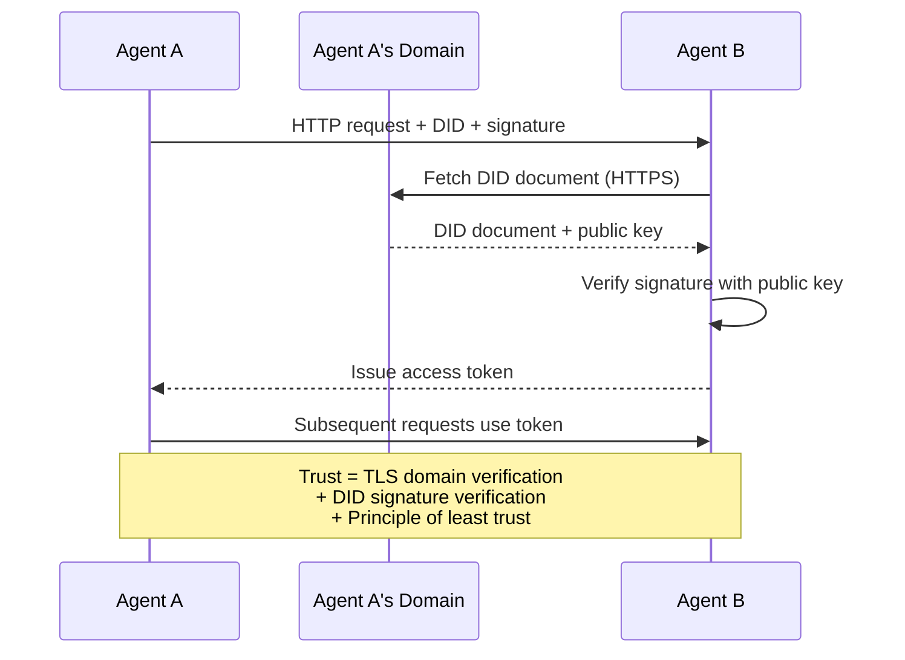

Zaufanie pochodzi z trzech źródeł:
1. **TLS na poziomie domeny** weryfikuje hosta dokumentu DID
2. **Podpisy kryptograficzne DID** weryfikują tożsamość agenta
3. **Zasada najmniejszego zaufania** przyznaje jedynie minimalne uprawnienia

Nie ma mowy o propagowaniu zaufania w oparciu o plotki ani punktacji PageRank. Weryfikujesz każdego agenta bezpośrednio poprzez jego DID.

#### Negocjacje metaprotokołu

Jest to najbardziej nowatorska funkcja ANP. Kiedy spotykają się dwaj agenci z różnych ekosystemów, nie potrzebują wcześniej uzgodnionych formatów danych. Negocjują w języku naturalnym:

```json
{
  "action": "protocolNegotiation",
  "sequenceId": 0,
  "candidateProtocols": "I can communicate using:\n1. JSON-RPC with hotel booking schema\n2. REST with OpenAPI 3.1 spec\n3. Natural language over HTTP",
  "modificationSummary": "Initial proposal",
  "status": "negotiating"
}
```

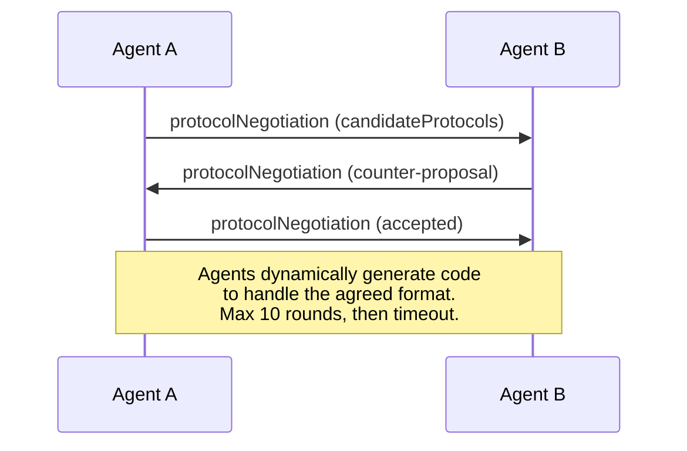

Agenci chodzą tam i z powrotem (maksymalnie 10 rund), dopóki nie uzgodnią formatu, a następnie dynamicznie generują kod do obsługi tego problemu. Wartości statusu: `negotiating`, `rejected`, `accepted`, `timeout`.

Oznacza to, że dwóch agentów, którzy nigdy wcześniej się nie widzieli, może dowiedzieć się, jak się komunikować, bez konieczności wcześniejszego definiowania wspólnego schematu.

### Porównanie (poprawione)

| | MCP | A2A | AKP | ANP |
|---|---|---|---|---|
| **Utworzone przez** | Antropiczny | Fundacja Google / Linux | IBM / BeeAI | Społeczność |
| **Format specyfikacji** | JSON-RPC | JSON-RPC / REST / gRPC | OpenAPI 3.1 (REST) ​​| JSON-RPC |
| **Podstawowe zastosowanie** | Agent do narzędzia | Agent do agenta | Agent do agenta | Agent do agenta |
| **Odkrycie** | Lista narzędzi | `/.well-known/agent-card.json` | `GET /agents`, `/.well-known/agent.yml` | `/.well-known/agent-descriptions`, punkty końcowe usługi DID |
| **Tożsamość** | Ukryte (lokalne) | Schematy bezpieczeństwa (OAuth, mTLS) | Poziom serwera | W3C DID (`did:wba`) z E2EE |
| **Ścieżka audytu** | Nie dotyczy | Podstawowy (historia zadań) | TrajectoryMetadata (wywołania narzędzi, rozumowanie) | Nie określono formalnie |
| **Maszyna stanu** | Nie dotyczy | 9 stanów zadań | 7 stanów uruchomienia | Nie dotyczy |
| **Przesyłanie strumieniowe** | Nie dotyczy | SSE | SSE | Niezależny od transportu |
| **Unikalna funkcja** | Schematy narzędzi | Karty Agentów + Umiejętności | Ścieżka audytu trajektorii | Negocjacje metaprotokołu |
| **Najlepsze dla** | Narzędzia i dane | Dynamiczna współpraca | Branże regulowane | Zaufanie między organizacjami |
| **Stan** | Stabilny | Stabilny (v1.0) | Połączenie w A2A | Aktywny rozwój |

### Jak oni razem współpracują

Protokoły te nie wykluczają się wzajemnie. Realistyczny system korporacyjny wykorzystuje wiele:

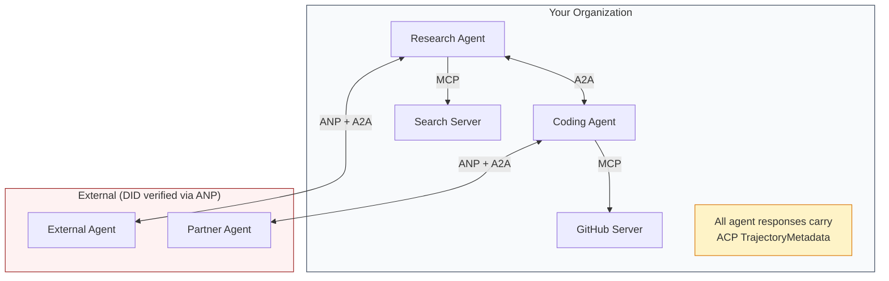

- **MCP** łączy każdego agenta z jego narzędziami
- **A2A** obsługuje współpracę pomiędzy agentami (wewnętrznymi i zewnętrznymi)
- **ACP** otacza odpowiedzi metadanymi trajektorii w celu umożliwienia kontroli
- **ANP** zapewnia weryfikację tożsamości agentów, nad którymi nie masz kontroli

## Zbuduj to

### Krok 1: Podstawowe typy wiadomości

Każdy system wieloagentowy zaczyna się od formatu komunikatu. Definiujemy typy, które odwzorowują to, czego używają prawdziwe protokoły:

```typescript
import crypto from "node:crypto";

type MessageRole = "user" | "agent";

type MessagePart =
  | { kind: "text"; text: string }
  | { kind: "data"; data: unknown; mediaType: string }
  | { kind: "file"; name: string; url: string; mediaType: string };

type TrajectoryEntry = {
  reasoning: string;
  toolName?: string;
  toolInput?: unknown;
  toolOutput?: unknown;
  timestamp: number;
};

type AgentMessage = {
  id: string;
  role: MessageRole;
  parts: MessagePart[];
  trajectory?: TrajectoryEntry[];
  replyTo?: string;
  timestamp: number;
};

function createMessage(
  role: MessageRole,
  parts: MessagePart[],
  replyTo?: string
): AgentMessage {
  return {
    id: crypto.randomUUID(),
    role,
    parts,
    replyTo,
    timestamp: Date.now(),
  };
}

function textMessage(role: MessageRole, text: string): AgentMessage {
  return createMessage(role, [{ kind: "text", text }]);
}
```

Uwaga: `MessagePart` jest multimodalny (tekst, dane strukturalne, pliki), podobnie jak prawdziwe specyfikacje A2A i ACP. `TrajectoryEntry` przechwytuje łańcuch rozumowania pasujący do TrajectoryMetadata ACP.

### Krok 2: Karta agenta A2A i rejestr

Zbuduj wykrywanie agentów zgodne z rzeczywistą specyfikacją A2A:

```typescript
type Skill = {
  id: string;
  name: string;
  description: string;
  tags: string[];
  inputModes: string[];
  outputModes: string[];
};

type AgentCard = {
  name: string;
  description: string;
  version: string;
  url: string;
  capabilities: {
    streaming: boolean;
    pushNotifications: boolean;
  };
  defaultInputModes: string[];
  defaultOutputModes: string[];
  skills: Skill[];
};

class AgentRegistry {
  private cards: Map<string, AgentCard> = new Map();

  register(card: AgentCard) {
    this.cards.set(card.name, card);
  }

  discoverBySkillTag(tag: string): AgentCard[] {
    return [...this.cards.values()].filter((card) =>
      card.skills.some((skill) => skill.tags.includes(tag))
    );
  }

  discoverByInputMode(mimeType: string): AgentCard[] {
    return [...this.cards.values()].filter(
      (card) =>
        card.defaultInputModes.includes(mimeType) ||
        card.skills.some((skill) => skill.inputModes.includes(mimeType))
    );
  }

  resolve(name: string): AgentCard | undefined {
    return this.cards.get(name);
  }

  listAll(): AgentCard[] {
    return [...this.cards.values()];
  }
}
```

Jest to znacznie bogatsze niż prosta mapa nazwy do możliwości. Możesz wyszukiwać agentów według znaczników umiejętności, wprowadzonych typów MIME lub nazwy, tak jak jest to obsługiwane w prawdziwej specyfikacji A2A.

### Krok 3: Cykl życia zadania A2A

Zbuduj maszynę stanu pełnego zadania:

```typescript
type TaskState =
  | "submitted"
  | "working"
  | "input-required"
  | "auth-required"
  | "completed"
  | "failed"
  | "canceled"
  | "rejected";

const TERMINAL_STATES: TaskState[] = [
  "completed",
  "failed",
  "canceled",
  "rejected",
];

type TaskStatus = {
  state: TaskState;
  message?: AgentMessage;
  timestamp: number;
};

type Artifact = {
  id: string;
  name: string;
  parts: MessagePart[];
};

type Task = {
  id: string;
  contextId: string;
  status: TaskStatus;
  artifacts: Artifact[];
  history: AgentMessage[];
};

type TaskEvent =
  | { kind: "statusUpdate"; taskId: string; status: TaskStatus }
  | {
      kind: "artifactUpdate";
      taskId: string;
      artifact: Artifact;
      append: boolean;
      lastChunk: boolean;
    };

type TaskHandler = (
  task: Task,
  message: AgentMessage
) => AsyncGenerator<TaskEvent>;

class TaskManager {
  private tasks: Map<string, Task> = new Map();
  private handlers: Map<string, TaskHandler> = new Map();
  private listeners: Map<string, ((event: TaskEvent) => void)[]> = new Map();

  registerHandler(agentName: string, handler: TaskHandler) {
    this.handlers.set(agentName, handler);
  }

  subscribe(taskId: string, listener: (event: TaskEvent) => void) {
    const existing = this.listeners.get(taskId) ?? [];
    existing.push(listener);
    this.listeners.set(taskId, existing);
  }

  async sendMessage(
    agentName: string,
    message: AgentMessage,
    contextId?: string
  ): Promise<Task> {
    const handler = this.handlers.get(agentName);
    if (!handler) {
      const task = this.createTask(contextId);
      task.status = {
        state: "rejected",
        timestamp: Date.now(),
        message: textMessage("agent", `No handler for ${agentName}`),
      };
      return task;
    }

    const task = this.createTask(contextId);
    task.history.push(message);
    task.status = { state: "submitted", timestamp: Date.now() };

    this.processTask(task, handler, message).catch((err) => {
      task.status = {
        state: "failed",
        timestamp: Date.now(),
        message: textMessage("agent", String(err)),
      };
    });
    return task;
  }

  getTask(taskId: string): Task | undefined {
    return this.tasks.get(taskId);
  }

  cancelTask(taskId: string): boolean {
    const task = this.tasks.get(taskId);
    if (!task || TERMINAL_STATES.includes(task.status.state)) return false;
    task.status = { state: "canceled", timestamp: Date.now() };
    this.emit(taskId, {
      kind: "statusUpdate",
      taskId,
      status: task.status,
    });
    return true;
  }

  private createTask(contextId?: string): Task {
    const task: Task = {
      id: crypto.randomUUID(),
      contextId: contextId ?? crypto.randomUUID(),
      status: { state: "submitted", timestamp: Date.now() },
      artifacts: [],
      history: [],
    };
    this.tasks.set(task.id, task);
    return task;
  }

  private async processTask(
    task: Task,
    handler: TaskHandler,
    message: AgentMessage
  ) {
    task.status = { state: "working", timestamp: Date.now() };
    this.emit(task.id, {
      kind: "statusUpdate",
      taskId: task.id,
      status: task.status,
    });

    try {
      for await (const event of handler(task, message)) {
        if (TERMINAL_STATES.includes(task.status.state)) break;

        if (event.kind === "statusUpdate") {
          task.status = event.status;
        }
        if (event.kind === "artifactUpdate") {
          const existing = task.artifacts.find(
            (a) => a.id === event.artifact.id
          );
          if (existing && event.append) {
            existing.parts.push(...event.artifact.parts);
          } else {
            task.artifacts.push(event.artifact);
          }
        }
        this.emit(task.id, event);
      }
    } catch (err) {
      task.status = {
        state: "failed",
        timestamp: Date.now(),
        message: textMessage("agent", String(err)),
      };
      this.emit(task.id, {
        kind: "statusUpdate",
        taskId: task.id,
        status: task.status,
      });
    }
  }

  private emit(taskId: string, event: TaskEvent) {
    for (const listener of this.listeners.get(taskId) ?? []) {
      listener(event);
    }
  }
}
```

Implementuje to prawdziwy cykl życia zadania A2A: przesłane, działające, wymagane dane wejściowe, stany końcowe. Programy obsługi to generatory asynchroniczne, które generują zdarzenia (aktualizacje stanu i fragmenty artefaktów) pasujące do modelu przesyłania strumieniowego SSE.

### Krok 4: Ścieżka audytu w stylu AKP

Zakończ komunikację ze śledzeniem trajektorii:

```typescript
type AuditEntry = {
  runId: string;
  agentName: string;
  input: AgentMessage[];
  output: AgentMessage[];
  trajectory: TrajectoryEntry[];
  status: "created" | "in-progress" | "completed" | "failed" | "awaiting";
  startedAt: number;
  completedAt?: number;
  sessionId?: string;
};

class AuditableRunner {
  private log: AuditEntry[] = [];
  private handlers: Map<
    string,
    (input: AgentMessage[]) => Promise<{
      output: AgentMessage[];
      trajectory: TrajectoryEntry[];
    }>
  > = new Map();

  registerAgent(
    name: string,
    handler: (input: AgentMessage[]) => Promise<{
      output: AgentMessage[];
      trajectory: TrajectoryEntry[];
    }>
  ) {
    this.handlers.set(name, handler);
  }

  async run(
    agentName: string,
    input: AgentMessage[],
    sessionId?: string
  ): Promise<AuditEntry> {
    const entry: AuditEntry = {
      runId: crypto.randomUUID(),
      agentName,
      input: structuredClone(input),
      output: [],
      trajectory: [],
      status: "created",
      startedAt: Date.now(),
      sessionId,
    };
    this.log.push(entry);

    const handler = this.handlers.get(agentName);
    if (!handler) {
      entry.status = "failed";
      return entry;
    }

    entry.status = "in-progress";
    try {
      const result = await handler(input);
      entry.output = structuredClone(result.output);
      entry.trajectory = structuredClone(result.trajectory);
      entry.status = "completed";
      entry.completedAt = Date.now();
    } catch (err) {
      entry.status = "failed";
      entry.trajectory.push({
        reasoning: `Error: ${String(err)}`,
        timestamp: Date.now(),
      });
      entry.completedAt = Date.now();
    }
    return entry;
  }

  getFullAuditLog(): AuditEntry[] {
    return structuredClone(this.log);
  }

  getAuditLogForAgent(agentName: string): AuditEntry[] {
    return structuredClone(
      this.log.filter((e) => e.agentName === agentName)
    );
  }

  getAuditLogForSession(sessionId: string): AuditEntry[] {
    return structuredClone(
      this.log.filter((e) => e.sessionId === sessionId)
    );
  }

  getTrajectoryForRun(runId: string): TrajectoryEntry[] {
    const entry = this.log.find((e) => e.runId === runId);
    return entry ? structuredClone(entry.trajectory) : [];
  }
}
```

Każde wykonanie agenta generuje pełny wpis audytu: co weszło, co wyszło oraz pełną trajektorię wywołań narzędzi i etapów rozumowania pomiędzy nimi. Możesz wysyłać zapytania według agenta, sesji lub pojedynczego uruchomienia.

### Krok 5: Weryfikacja tożsamości w stylu ANP

Zbuduj tożsamość i weryfikację opartą na DID:

```typescript
type VerificationMethod = {
  id: string;
  type: string;
  controller: string;
  publicKeyDer: string;
};

type DIDDocument = {
  id: string;
  verificationMethod: VerificationMethod[];
  authentication: string[];
  keyAgreement: string[];
  humanAuthorization: string[];
  service: { id: string; type: string; serviceEndpoint: string }[];
};

type AgentIdentity = {
  did: string;
  document: DIDDocument;
  privateKey: crypto.KeyObject;
  publicKey: crypto.KeyObject;
};

class IdentityRegistry {
  private documents: Map<string, DIDDocument> = new Map();

  publish(doc: DIDDocument) {
    this.documents.set(doc.id, doc);
  }

  resolve(did: string): DIDDocument | undefined {
    return this.documents.get(did);
  }

  verify(did: string, signature: string, payload: string): boolean {
    const doc = this.documents.get(did);
    if (!doc) return false;

    const authKeyIds = doc.authentication;
    const authKeys = doc.verificationMethod.filter((vm) =>
      authKeyIds.includes(vm.id)
    );

    for (const key of authKeys) {
      const publicKey = crypto.createPublicKey({
        key: Buffer.from(key.publicKeyDer, "base64"),
        format: "der",
        type: "spki",
      });
      const isValid = crypto.verify(
        null,
        Buffer.from(payload),
        publicKey,
        Buffer.from(signature, "hex")
      );
      if (isValid) return true;
    }
    return false;
  }

  requiresHumanAuth(did: string, operationKeyId: string): boolean {
    const doc = this.documents.get(did);
    if (!doc) return false;
    return doc.humanAuthorization.includes(operationKeyId);
  }
}

function createIdentity(domain: string, agentName: string): AgentIdentity {
  const did = `did:wba:${domain}:agent:${agentName}`;
  const { publicKey, privateKey } = crypto.generateKeyPairSync("ed25519");

  const publicKeyDer = publicKey
    .export({ format: "der", type: "spki" })
    .toString("base64");

  const keyId = `${did}#key-1`;
  const encKeyId = `${did}#key-x25519-1`;

  const document: DIDDocument = {
    id: did,
    verificationMethod: [
      {
        id: keyId,
        type: "Ed25519VerificationKey2020",
        controller: did,
        publicKeyDer,
      },
      {
        id: encKeyId,
        type: "X25519KeyAgreementKey2019",
        controller: did,
        publicKeyDer,
      },
    ],
    authentication: [keyId],
    keyAgreement: [encKeyId],
    humanAuthorization: [],
    service: [
      {
        id: `${did}#agent-description`,
        type: "AgentDescription",
        serviceEndpoint: `https://${domain}/agents/${agentName}/ad.json`,
      },
    ],
  };

  return { did, document, privateKey, publicKey };
}

function signPayload(identity: AgentIdentity, payload: string): string {
  return crypto
    .sign(null, Buffer.from(payload), identity.privateKey)
    .toString("hex");
}
```

Odzwierciedla to prawdziwy model tożsamości ANP: agenci mają dokumenty DID z oddzielnym uwierzytelnianiem, umową kluczy i kluczami autoryzacji człowieka. `IdentityRegistry` symuluje rozpoznawanie DID (w środowisku produkcyjnym byłoby to pobieranie HTTP do domeny agenta).

### Krok 6: Brama protokołu

Połącz wszystkie cztery protokoły w zunifikowany system:

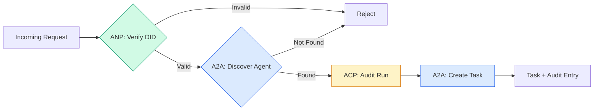

```typescript
class ProtocolGateway {
  private registry: AgentRegistry;
  private taskManager: TaskManager;
  private auditRunner: AuditableRunner;
  private identityRegistry: IdentityRegistry;

  constructor(
    registry: AgentRegistry,
    taskManager: TaskManager,
    auditRunner: AuditableRunner,
    identityRegistry: IdentityRegistry
  ) {
    this.registry = registry;
    this.taskManager = taskManager;
    this.auditRunner = auditRunner;
    this.identityRegistry = identityRegistry;
  }

  async delegateTask(
    fromDid: string,
    signature: string,
    targetAgent: string,
    message: AgentMessage,
    sessionId?: string
  ): Promise<{ task: Task; audit: AuditEntry } | { error: string }> {
    if (!this.identityRegistry.verify(fromDid, signature, message.id)) {
      return { error: "Identity verification failed" };
    }

    const card = this.registry.resolve(targetAgent);
    if (!card) {
      return { error: `Agent ${targetAgent} not found in registry` };
    }

    const audit = await this.auditRunner.run(
      targetAgent,
      [message],
      sessionId
    );
    const task = await this.taskManager.sendMessage(targetAgent, message);

    return { task, audit };
  }

  discoverAndDelegate(
    fromDid: string,
    signature: string,
    skillTag: string,
    message: AgentMessage
  ): Promise<{ task: Task; audit: AuditEntry } | { error: string }> {
    const candidates = this.registry.discoverBySkillTag(skillTag);
    if (candidates.length === 0) {
      return Promise.resolve({
        error: `No agents found with skill tag: ${skillTag}`,
      });
    }
    return this.delegateTask(
      fromDid,
      signature,
      candidates[0].name,
      message
    );
  }
}
```

Bramka wykonuje cztery czynności podczas jednego połączenia:
1. **ANP**: Weryfikuje tożsamość dzwoniącego poprzez podpis DID
2. **A2A**: Odkrywa docelowego agenta i sprawdza jego możliwości
3. **ACP**: Zawija wykonanie w ścieżce audytu z trajektorią
4. **A2A**: Tworzy zadanie ze śledzeniem pełnego cyklu życia

### Krok 7: Połącz wszystko razem

```typescript
async function protocolDemo() {
  const registry = new AgentRegistry();
  registry.register({
    name: "researcher",
    description: "Searches and summarizes findings",
    version: "1.0.0",
    url: "https://researcher.local/a2a/v1",
    capabilities: { streaming: true, pushNotifications: false },
    defaultInputModes: ["text/plain"],
    defaultOutputModes: ["text/plain", "application/json"],
    skills: [
      {
        id: "web-research",
        name: "Web Research",
        description: "Searches the web",
        tags: ["research", "search", "summarization"],
        inputModes: ["text/plain"],
        outputModes: ["application/json"],
      },
    ],
  });
  registry.register({
    name: "coder",
    description: "Writes code from specs",
    version: "1.0.0",
    url: "https://coder.local/a2a/v1",
    capabilities: { streaming: false, pushNotifications: false },
    defaultInputModes: ["text/plain", "application/json"],
    defaultOutputModes: ["text/plain"],
    skills: [
      {
        id: "code-gen",
        name: "Code Generation",
        description: "Generates code",
        tags: ["coding", "generation"],
        inputModes: ["text/plain", "application/json"],
        outputModes: ["text/plain"],
      },
    ],
  });

  const taskManager = new TaskManager();
  const auditRunner = new AuditableRunner();

  const researchTrajectory: TrajectoryEntry[] = [];

  taskManager.registerHandler(
    "researcher",
    async function* (task, message) {
      yield {
        kind: "statusUpdate" as const,
        taskId: task.id,
        status: { state: "working" as const, timestamp: Date.now() },
      };

      researchTrajectory.push({
        reasoning: "Searching for React 19 documentation",
        toolName: "web_search",
        toolInput: { query: "React 19 compiler features" },
        toolOutput: {
          results: ["react.dev/blog/react-19", "github.com/react/react"],
        },
        timestamp: Date.now(),
      });

      researchTrajectory.push({
        reasoning: "Extracting key findings from search results",
        toolName: "doc_analysis",
        toolInput: { url: "react.dev/blog/react-19" },
        toolOutput: {
          summary:
            "React 19 compiler auto-memoizes, no manual useMemo needed",
        },
        timestamp: Date.now(),
      });

      yield {
        kind: "artifactUpdate" as const,
        taskId: task.id,
        artifact: {
          id: crypto.randomUUID(),
          name: "research-results",
          parts: [
            {
              kind: "data" as const,
              data: {
                findings: [
                  "React 19 compiler auto-memoizes components",
                  "No more manual useMemo/useCallback needed",
                  "Compiler runs at build time, not runtime",
                ],
                sources: ["react.dev/blog/react-19"],
              },
              mediaType: "application/json",
            },
          ],
        },
        append: false,
        lastChunk: true,
      };

      yield {
        kind: "statusUpdate" as const,
        taskId: task.id,
        status: { state: "completed" as const, timestamp: Date.now() },
      };
    }
  );

  auditRunner.registerAgent("researcher", async () => ({
    output: [
      textMessage("agent", "React 19 compiler auto-memoizes components"),
    ],
    trajectory: researchTrajectory,
  }));

  const identityRegistry = new IdentityRegistry();

  const coderIdentity = createIdentity("coder.local", "coder");
  const researcherIdentity = createIdentity("researcher.local", "researcher");

  identityRegistry.publish(coderIdentity.document);
  identityRegistry.publish(researcherIdentity.document);

  const gateway = new ProtocolGateway(
    registry,
    taskManager,
    auditRunner,
    identityRegistry
  );

  console.log("=== Protocol Demo ===\n");

  console.log("1. Agent Discovery (A2A)");
  const researchAgents = registry.discoverBySkillTag("research");
  console.log(
    `   Found ${researchAgents.length} agent(s):`,
    researchAgents.map((a) => a.name)
  );

  console.log("\n2. Identity Verification (ANP)");
  const message = textMessage("user", "Research React 19 compiler features");
  const signature = signPayload(coderIdentity, message.id);
  const verified = identityRegistry.verify(
    coderIdentity.did,
    signature,
    message.id
  );
  console.log(`   Coder DID: ${coderIdentity.did}`);
  console.log(`   Signature verified: ${verified}`);

  console.log("\n3. Task Delegation (A2A + ACP + ANP)");
  const result = await gateway.delegateTask(
    coderIdentity.did,
    signature,
    "researcher",
    message,
    "session-001"
  );

  if ("error" in result) {
    console.log(`   Error: ${result.error}`);
    return;
  }

  console.log(`   Task ID: ${result.task.id}`);
  console.log(`   Task state: ${result.task.status.state}`);
  console.log(`   Artifacts: ${result.task.artifacts.length}`);

  console.log("\n4. Audit Trail (ACP)");
  console.log(`   Run ID: ${result.audit.runId}`);
  console.log(`   Status: ${result.audit.status}`);
  console.log(`   Trajectory steps: ${result.audit.trajectory.length}`);
  for (const step of result.audit.trajectory) {
    console.log(`     - ${step.reasoning}`);
    if (step.toolName) {
      console.log(`       Tool: ${step.toolName}`);
    }
  }

  console.log("\n5. Full Audit Log");
  const fullLog = auditRunner.getFullAuditLog();
  console.log(`   Total runs: ${fullLog.length}`);
  for (const entry of fullLog) {
    const duration = entry.completedAt
      ? `${entry.completedAt - entry.startedAt}ms`
      : "in-progress";
    console.log(`   ${entry.agentName}: ${entry.status} (${duration})`);
  }
}

protocolDemo().catch((err) => {
  console.error("Protocol demo failed:", err);
  process.exitCode = 1;
});
```

## Co pójdzie nie tak

Protokoły rozwiązują szczęśliwą ścieżkę. Oto przerwy w produkcji:

**Zmiana schematu.** Agent A publikuje dane wyjściowe dotyczące Karty Agenta reklamującej `application/json`. Ale schemat JSON zmienia się między wersjami. Agent B analizuje stary format i otrzymuje śmieci. Poprawka: wersjonuj swoje umiejętności i schematy wyjściowe. Z tego powodu specyfikacja A2A obsługuje `version` na kartach agentów.

**Naruszenia maszyny stanowej.** Procedura obsługi agenta generuje zdarzenie `completed`, a następnie próbuje wygenerować więcej artefaktów. Zadanie jest niezmienne. Twój kod po cichu porzuca aktualizacje lub zgłasza. Poprawka: sprawdź stan terminala przed ustąpieniem. Powyższy `TaskManager` wymusza to za pomocą `break` po stanach terminala.

**Niepowodzenie rozpoznawania zaufania.** Agent A próbuje zweryfikować DID Agenta B, ale domena Agenta B nie działa. Nie można pobrać dokumentu DID. Czy otwierasz się niepowodzeniem (akceptujesz niezweryfikowanych agentów) czy zamykasz (odrzucasz wszystko)? ANP zaleca zamknięcie niepowodzeniem zgodnie z zasadą najmniejszego zaufania.

**Rozdęcie trajektorii.** Rejestrowanie trajektorii ACP jest wydajne, ale kosztowne. Złożony agent, który wykonuje 200 wywołań narzędzi na przebieg, generuje ogromne wpisy audytu. Poprawka: trajektoria dziennika na konfigurowalnych poziomach szczegółowości. Rejestruj nazwy narzędzi i operacje we/wy pod kątem zgodności, pomiń etapy rozumowania w przypadku obciążeń nieuregulowanych.

**Odkrycie grzmiącego stada.** 50 agentów, wszyscy jednocześnie wysyłają zapytania `GET /agents` podczas uruchamiania. Poprawka: buforuj karty agentów z TTL, rozłóż interwały wykrywania lub użyj rejestracji opartej na wypychaniu zamiast odpytywania.

## Użyj tego

### Prawdziwe wdrożenia

**A2A** jest najbardziej dojrzały. [oficjalna specyfikacja Google](https://github.com/google/A2A) jest oprogramowaniem typu open source w ramach Linux Foundation. SDK dla Pythona i TypeScriptu. Jeśli Twoi agenci potrzebują dynamicznego odkrywania i współpracy, zacznij tutaj.

**ACP** łączy się z A2A. W ramach [projektu BeeAI](https://github.com/i-am-bee/acp) IBM stworzył ACP jako alternatywę REST-first, ale koncepcja metadanych trajektorii jest wchłaniana przez ekosystem A2A. Używaj wzorców ACP (rejestrowanie trajektorii, cykl życia przebiegu), nawet jeśli używasz A2A jako transportu.

**ANP** jest najbardziej eksperymentalny. [Repozytorium społeczności](https://github.com/agent-network-protocol/AgentNetworkProtocol) zawiera pakiet SDK języka Python (AgentConnect). Koncepcja negocjacji metaprotokołu jest naprawdę nowatorska. Warto zwrócić uwagę na wdrożenia agentów między organizacjami.

**MCP** zostało już omówione w fazie 13. Jeśli chcesz, aby agenci korzystali z narzędzi, standardem jest MCP.

### Wybór odpowiedniego protokołu

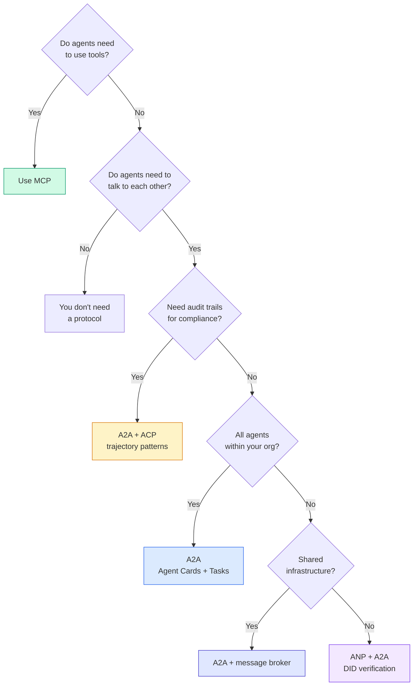

## Wyślij to

Ta lekcja daje:
- `code/main.ts` — pełna implementacja wszystkich czterech wzorców protokołów
- `outputs/prompt-protocol-selector.md` – monit pomagający wybrać protokoły dla Twojego systemu

## Ćwiczenia

1. **Delegacja zadań z wieloma przeskokami.** Rozszerz `TaskManager`, aby osoba obsługująca agenta mogła delegować podzadania innym agentom. Badacz otrzymuje zadanie, deleguje podzadania „wyszukiwania” i „podsumowywania” dwóm wyspecjalizowanym agentom, czeka na wykonanie obu, a następnie łączy wyniki we własne artefakty.

2. **Ścieżka audytu przesyłania strumieniowego.** Zmodyfikuj `AuditableRunner`, aby obsługiwał tryb przesyłania strumieniowego. Zamiast czekać na pełny wynik, aktualizuj `AuditEntry` w czasie rzeczywistym w miarę dodawania wpisów trajektorii. Użyj generatora asynchronicznego, który tworzy migawki inspekcji.

3. **Rotacja DID.** Dodaj rotację klucza do `IdentityRegistry`. Agent powinien mieć możliwość opublikowania nowego dokumentu DID ze zaktualizowanymi kluczami, zachowując odwołanie `previousDid`. Weryfikatorzy powinni akceptować podpisy zarówno z bieżącego, jak i poprzedniego klucza w okresie karencji.

4. **Negocjowanie protokołu.** Wdrożenie koncepcji metaprotokołu ANP. Dwóch agentów wymienia wiadomości `protocolNegotiation` w proponowanych formatach (np. „Potrafię mówić w języku JSON-RPC” vs „Wolę REST”). Po maksymalnie 3 rundach uzgadniają format lub przerwę na żądanie. Uzgodniony format określa, jakiego `TaskManager` lub `AuditableRunner` używają.

5. **Wykrywanie z ograniczoną szybkością.** Dodaj opakowanie `RateLimitedRegistry`, które buforuje wyszukiwania na karcie agenta z konfigurowalnym TTL i ogranicza liczbę zapytań wykrywających na agenta na sekundę. Symuluj ogromne stado 100 agentów odkrywających się nawzajem przy uruchomieniu i zmierz różnicę.

## Kluczowe terminy

| Termin | Co ludzie mówią | Co to właściwie oznacza |
|------|----------------|----------------------|
| MCP | „Protokół dla narzędzi AI” | Protokół klient-serwer umożliwiający agentom wykrywanie i używanie narzędzi. Od agenta do narzędzia, a nie od agenta do agenta. |
| A2A | „Protokół agenta Google” | Protokół peer-to-peer do współpracy agentów w ramach Linux Foundation. Wykrywanie za pomocą kart agentów, cykl życia zadań składający się z 9 stanów, przesyłanie strumieniowe za pośrednictwem SSE. Obsługuje powiązania JSON-RPC, REST i gRPC. |
| AKP | „Komunikacja agentów korporacyjnych” | Interfejs API REST IBM/BeeAI do obsługi agentów z TrajectoryMetadata: każda odpowiedź zawiera pełny łańcuch rozumowań i wywołań narzędzi. Połączenie się z A2A. |
| ANP | „Zdecentralizowana tożsamość agenta” | Protokół społeczności wykorzystujący `did:wba` (DID) do tożsamości kryptograficznej, HPKE dla E2EE i negocjacje metaprotokołów oparte na sztucznej inteligencji dla agentów, którzy nigdy się nie widzieli. |
| Karta agenta | „Wizytówka agenta” | Dokument JSON pod adresem `/.well-known/agent-card.json` opisujący umiejętności, obsługiwane typy MIME, schematy zabezpieczeń i powiązania protokołów. |
| CZY | „Zdecentralizowany identyfikator” | Standard W3C dotyczący tożsamości weryfikowalnych kryptograficznie, hostowanych w domenie agenta. ANP używa metody `did:wba`. |
| TrajektoriaMetadane | „Potwierdzenie audytu” | Mechanizm ACP umożliwiający dołączanie kroków rozumowania, wywołań narzędzi i ich wejść/wyjść do każdej odpowiedzi agenta. |
| Metaprotokół | „Agenci negocjują, jak rozmawiać” | Podejście ANP, w którym agenci używają języka naturalnego do dynamicznego uzgadniania formatów danych, a następnie generują kod do ich obsługi. |
| Zadanie | „Jednostka pracy” | Śledzenie obiektów stanowych A2A odbywa się od momentu przesłania do zakończenia. Niezmienny po terminalu. |

## Dalsze czytanie

– [Specyfikacja Google A2A](https://github.com/google/A2A) – oficjalna specyfikacja i pakiety SDK (wersja 1.0.0, Linux Foundation)
– [Specyfikacja IBM/BeeAI ACP](https://github.com/i-am-bee/acp) – Specyfikacja OpenAPI 3.1 dotycząca uruchomień agentów i metadanych trajektorii
– [Protokół sieci agenta](https://github.com/agent-network-protocol/AgentNetworkProtocol) – Tożsamość oparta na DID, E2EE, negocjowanie metaprotokołu
– [Dokumentacja Model Context Protocol](https://modelcontextprotocol.io/) – Specyfikacja MCP firmy Anthropic (omówiona w fazie 13)
– [Zdecentralizowane identyfikatory W3C](https://www.w3.org/TR/did-core/) – standard tożsamości stanowiący podstawę ANP
- [RFC 9180 (HPKE)](https://www.rfc-editor.org/rfc/rfc9180) – schemat szyfrowania używany przez ANP dla E2EE
- [Język komunikacji agenta FIPA] (http://www.fipa.org/specs/fipa00061/SC00061G.html) — akademicki prekursor nowoczesnych protokołów agentów