# Protokoły komunikacyjne

> Agenci, którzy nie mówią tym samym językiem, nie tworzą zespołu. To obcy ludzie krzyczący w próżnię.

**Typ:** Kompilacja  
**Języki:** TypeScript  
**Wymagania wstępne:** Faza 14 (Inżynieria agentów), Lekcja 16.01 (Dlaczego wieloagentowy)  
**Czas:** ~120 minut  

## Cele nauczania

- Zaimplementuj wykrywanie i wywoływanie narzędzi w standardzie MCP, aby agenci mogli korzystać z zasobów udostępnianych przez serwery zewnętrzne.
- Zbuduj kartę agenta A2A oraz punkt końcowy (endpoint) zadań, umożliwiający jednemu agentowi delegowanie pracy innemu za pośrednictwem protokołu HTTP.
- Porównaj protokoły MCP (dostęp do narzędzi), A2A (współpraca agent-agent), ACP (audyt przedsiębiorstwa) oraz ANP (zdecentralizowane zaufanie) i wyjaśnij, który z nich najlepiej rozwiązuje dany problem.
- Połącz wiele protokołów w jeden zunifikowany system, w którym agenci dynamicznie odkrywają narzędzia za pomocą MCP i delegują zadania poprzez A2A.

## Problem

Dzielisz swój system na wielu agentów: badacza, programistę, recenzenta. Każdy z nich doskonale radzi sobie ze swoim zadaniem. Jednak teraz musisz sprawić, aby zaczęli ze sobą efektywnie współpracować.

Twoja pierwsza próba jest intuicyjna: przekazywanie zwykłych ciągów znaków (strings). Badacz zwraca blok tekstu, a programista próbuje go sparsować według własnego uznania. To działa do momentu, gdy programista błędnie zinterpretuje podsumowanie badań, dwaj agenci utkną w zakleszczeniu (deadlock) czekając na siebie nawzajem lub gdy pojawi się potrzeba integracji z agentami stworzonymi przez zewnętrzne zespoły. Wtedy podejście „po prostu przesyłajmy tekst” całkowicie się załamuje.

Jest to klasyczny problem protokołu komunikacyjnego. Bez wspólnej umowy określającej sposób wymiany informacji, systemy wieloagentowe stają się niestabilne, trudne do audytowania i niemożliwe do skalowania poza wąskie grono agentów, których napisałeś osobiście.

Ekosystem sztucznej inteligencji odpowiada na to wyzwanie czterema protokołami, z których każdy rozwiązuje inną część problemu:

- **MCP** — zapewnia dostęp do narzędzi.
- **A2A** — obsługuje współpracę między agentami.
- **ACP** — umożliwia audyt w systemach korporacyjnych.
- **ANP** — zarządza zdecentralizowaną tożsamością i zaufaniem.

Ta lekcja jest szczegółowa. Będziesz analizować rzeczywiste formaty sieciowe (wire formats) z każdej specyfikacji, budować działające implementacje i łączyć wszystkie cztery protokoły w jeden spójny system.

## Koncepcja

### Krajobraz protokołów

Pomyśl o tych czterech protokołach jako o warstwach, z których każda odpowiada na inne pytanie projektowe:

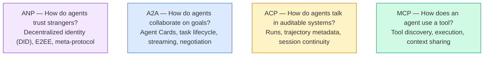

Nie są to protokoły konkurencyjne. Rozwiązują one odmienne problemy na różnych poziomach architektury.

### MCP (Podsumowanie)

Protokół MCP (Model Context Protocol) został szczegółowo omówiony w fazie 13. W ramach szybkiego przypomnienia: MCP standaryzuje sposób, w jaki modele LLM łączą się z zewnętrznymi narzędziami i źródłami danych. Jest to protokół typu **klient-serwer**, w którym agent (klient) wykrywa i wywołuje narzędzia udostępnione przez serwer.

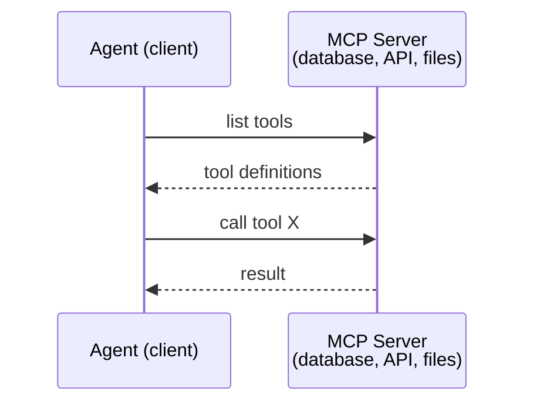

MCP służy do komunikacji na linii **agent-narzędzie**. Sam w sobie nie ułatwia bezpośredniej rozmowy między agentami.

### A2A (Protokół Agent2Agent)

**Autor:** Google (obecnie rozwijany w ramach Linux Foundation jako `lf.a2a.v1`)  
**Wersja specyfikacji:** 1.0.0  
**Problem:** W jaki sposób autonomiczni agenci współpracują, negocjują i delegują sobie zadania?  

A2A to protokół do **partnerskiej współpracy agentów (peer-to-peer)**. Tam, gdzie MCP łączy agenta z narzędziami, A2A łączy agenta z innymi agentami. Każdy agent publikuje **Kartę Agenta (Agent Card)** pod dobrze znanym adresem URL, a pozostali agenci mogą ją odczytać, aby poznać jego możliwości, podjąć negocjacje i delegować mu zadania.

#### Jak działa A2A

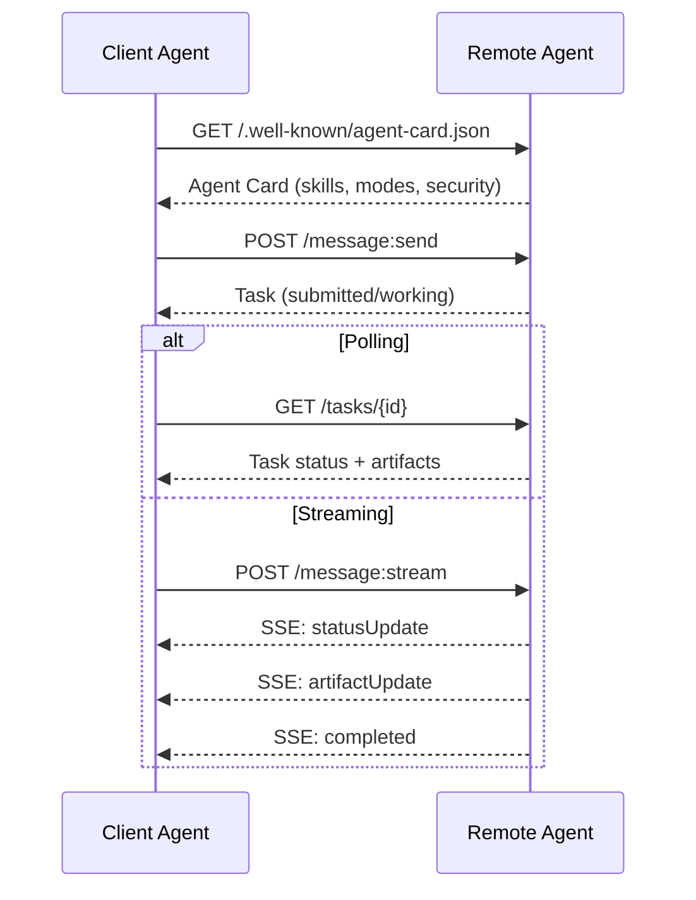

#### Przykładowa Karta Agenta

Tak wygląda rzeczywista struktura karty agenta A2A, serwowana pod adresem `GET /.well-known/agent-card.json`:

```json
{
  "name": "Research Agent",
  "description": "Searches documentation and summarizes findings",
  "version": "1.0.0",
  "supportedInterfaces": [
    {
      "url": "https://research-agent.example.com/a2a/v1",
      "protocolBinding": "JSONRPC",
      "protocolVersion": "1.0"
    },
    {
      "url": "https://research-agent.example.com/a2a/rest",
      "protocolBinding": "HTTP+JSON",
      "protocolVersion": "1.0"
    }
  ],
  "provider": {
    "organization": "Your Company",
    "url": "https://example.com"
  },
  "capabilities": {
    "streaming": true,
    "pushNotifications": false
  },
  "defaultInputModes": ["text/plain", "application/json"],
  "defaultOutputModes": ["text/plain", "application/json"],
  "skills": [
    {
      "id": "web-research",
      "name": "Web Research",
      "description": "Searches the web and synthesizes findings",
      "tags": ["research", "search", "summarization"],
      "examples": ["Research the latest changes in React 19"]
    },
    {
      "id": "doc-analysis",
      "name": "Documentation Analysis",
      "description": "Reads and analyzes technical documentation",
      "tags": ["docs", "analysis"],
      "inputModes": ["text/plain", "application/pdf"],
      "outputModes": ["application/json"]
    }
  ],
  "securitySchemes": {
    "bearer": {
      "httpAuthSecurityScheme": {
        "scheme": "Bearer",
        "bearerFormat": "JWT"
      }
    }
  },
  "security": [{ "bearer": [] }]
}
```

Kluczowe elementy karty:
- **skills (umiejętności)** określają, co dany agent potrafi zrobić. Każda umiejętność ma unikalny identyfikator, tagi oraz obsługiwane typy MIME (media types) dla wejścia i wyjścia. Na tej podstawie agent wysyłający zapytanie decyduje, czy odbiorca jest w stanie obsłużyć zadanie.
- **supportedInterfaces** zawiera listę dostępnych powiązań protokołów. Jeden agent może jednocześnie udostępniać interfejsy JSON-RPC, REST czy gRPC.
- **Bezpieczeństwo** jest wbudowane bezpośrednio w kartę. Klient wie, jaki schemat uwierzytelniania jest wymagany przed wysłaniem pierwszego żądania.

#### Cykl życia zadania

Zadania (Tasks) stanowią podstawową jednostkę pracy w A2A. Przechodzą one przez ściśle zdefiniowane stany:

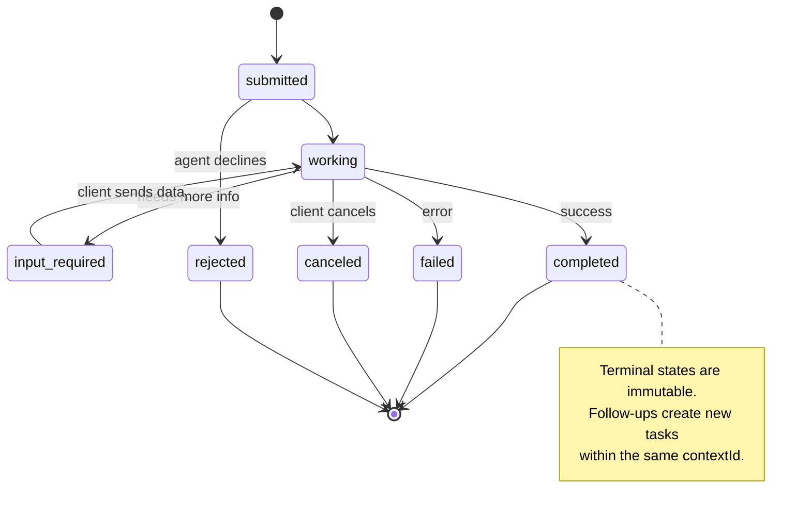

Stany zdefiniowane w specyfikacji (pomijając stan wartowniczy `UNSPECIFIED`):

| Stan | Terminalny? | Znaczenie |
|---|---|---|
| `TASK_STATE_SUBMITTED` | Nie | Zadanie przyjęte, oczekuje na przetworzenie |
| `TASK_STATE_WORKING` | Nie | Zadanie jest aktywnie przetwarzane |
| `TASK_STATE_INPUT_REQUIRED` | Nie | Agent potrzebuje dodatkowych danych od klienta |
| `TASK_STATE_AUTH_REQUIRED` | Nie | Wymagane jest uwierzytelnienie użytkownika |
| `TASK_STATE_COMPLETED` | Tak | Zadanie zakończyło się sukcesem |
| `TASK_STATE_FAILED` | Tak | Zadanie zakończyło się błędem |
| `TASK_STATE_CANCELED` | Tak | Zadanie zostało anulowane przez klienta |
| `TASK_STATE_REJECTED` | Tak | Agent odrzucił wykonanie zadania |

Gdy zadanie osiągnie stan końcowy (terminalny), staje się niezmienne. Dalsze interakcje wymagają utworzenia nowego zadania w ramach tego samego identyfikatora kontekstu (`contextId`).

#### Format sieciowy komunikatów

A2A korzysta z formatu JSON-RPC 2.0. Oto przykładowa wymiana wiadomości:

**Klient wysyła zadanie:**

```json
{
  "jsonrpc": "2.0",
  "id": 1,
  "method": "SendMessage",
  "params": {
    "message": {
      "messageId": "msg-001",
      "role": "ROLE_USER",
      "parts": [{ "text": "Research React 19 compiler features" }]
    },
    "configuration": {
      "acceptedOutputModes": ["text/plain", "application/json"],
      "historyLength": 10
    }
  }
}
```

**Agent odpowiada, zwracając informacje o zadaniu:**

```json
{
  "jsonrpc": "2.0",
  "id": 1,
  "result": {
    "task": {
      "id": "task-abc-123",
      "contextId": "ctx-xyz-789",
      "status": {
        "state": "TASK_STATE_COMPLETED",
        "timestamp": "2026-03-27T10:30:00Z"
      },
      "artifacts": [
        {
          "artifactId": "art-001",
          "name": "research-results",
          "parts": [{
            "data": {
              "findings": [
                "React 19 compiler auto-memoizes components",
                "No more manual useMemo/useCallback needed",
                "Compiler runs at build time, not runtime"
              ]
            },
            "mediaType": "application/json"
          }]
        }
      ]
    }
  }
}
```

**Przesyłanie strumieniowe przez Server-Sent Events (SSE):**

```text
POST /message:stream HTTP/1.1
Content-Type: application/json
A2A-Version: 1.0

data: {"task":{"id":"task-123","status":{"state":"TASK_STATE_WORKING"}}}

data: {"statusUpdate":{"taskId":"task-123","status":{"state":"TASK_STATE_WORKING","message":{"role":"ROLE_AGENT","parts":[{"text":"Searching documentation..."}]}}}}

data: {"artifactUpdate":{"taskId":"task-123","artifact":{"artifactId":"art-1","parts":[{"text":"partial findings..."}]},"append":true,"lastChunk":false}}

data: {"statusUpdate":{"taskId":"task-123","status":{"state":"TASK_STATE_COMPLETED"}}}
```

### ACP (Agent Communication Protocol)

**Autor:** IBM / BeeAI  
**Wersja specyfikacji:** 0.2.0 (OpenAPI 3.1.1)  
**Stan:** W trakcie łączenia z A2A pod parasolem Linux Foundation  
**Problem:** W jaki sposób agenci komunikują się, zapewniając pełną rozliczalność, ciągłość sesji i śledzenie historii decyzji?  

ACP to **protokół o profilu korporacyjnym**. Wbrew powszechnym błędnym uproszczeniom, ACP **nie** wymaga stosowania JSON-LD – jest to prosty interfejs API REST/JSON zdefiniowany przy użyciu OpenAPI. Unikalną cechą tego protokołu jest obiekt **TrajectoryMetadata**: każda odpowiedź agenta może zawierać szczegółowy dziennik (trajektorię) kroków wnioskowania i wywołań narzędzi, które doprowadziły do wygenerowania danego wyniku.

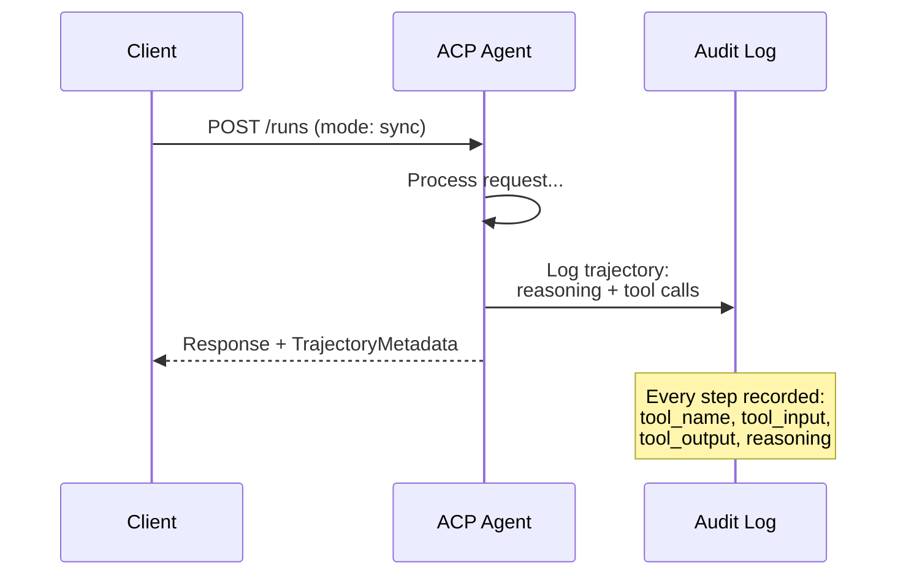

#### Wykrywanie agentów w ACP

ACP definiuje cztery metody odkrywania:

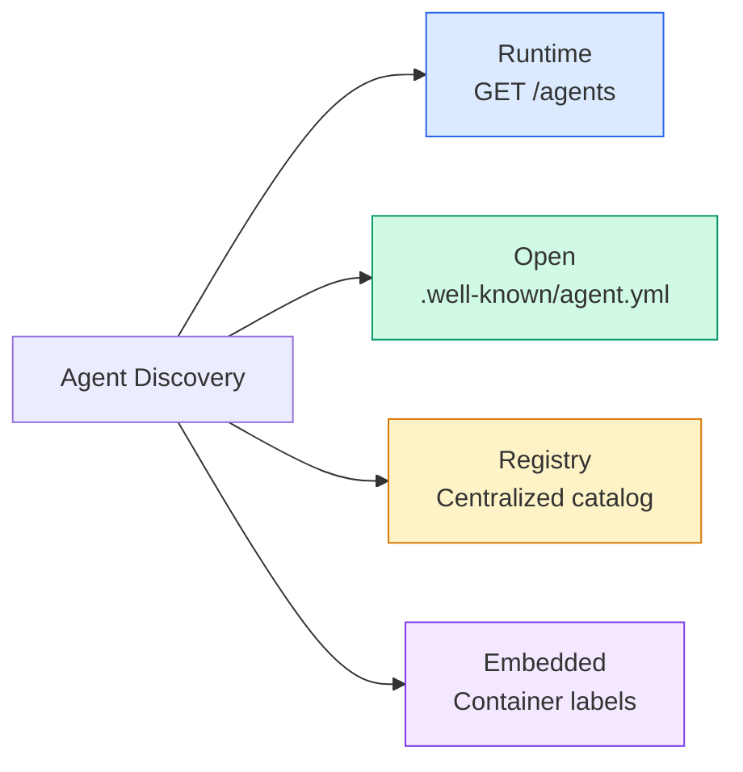

**AgentManifest** w ACP jest prostszy niż karta agenta w A2A:

```json
{
  "name": "summarizer",
  "description": "Summarizes documents with source citations",
  "input_content_types": ["text/plain", "application/pdf"],
  "output_content_types": ["text/plain", "application/json"],
  "metadata": {
    "tags": ["summarization", "RAG"],
    "framework": "BeeAI",
    "capabilities": [
      {
        "name": "Document Summarization",
        "description": "Condenses long documents into key points"
      }
    ],
    "recommended_models": ["llama3.3:70b-instruct-fp16"],
    "license": "Apache-2.0",
    "programming_language": "Python"
  }
}
```

#### Cykl życia uruchomienia (Run)

ACP posługuje się pojęciem „Uruchomień” (Runs) zamiast zadań. Uruchomienie to wykonanie agenta w jednym z trzech trybów:

| Tryb | Zachowanie |
|---|---|
| `sync` | Blokujący. Odpowiedź zawiera kompletny wynik końcowy. |
| `async` | Asynchroniczny. Zwraca natychmiast kod 202. Stan sprawdza się przez `GET /runs/{id}`. |
| `stream` | Strumieniowy (SSE). Zdarzenia są wysyłane na bieżąco w trakcie pracy agenta. |

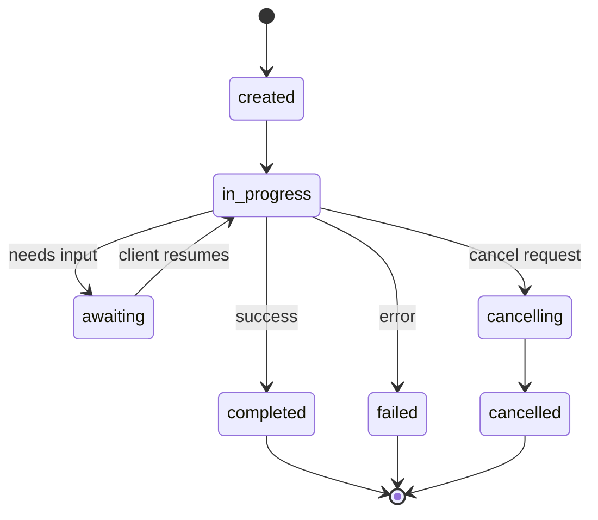

#### Ścieżka audytu w TrajectoryMetadata

To najważniejszy wyróżnik ACP. Każdy element odpowiedzi może zawierać metadane pokazujące dokładnie, co zrobił agent:

```json
{
  "role": "agent/researcher",
  "parts": [
    {
      "content_type": "text/plain",
      "content": "The weather in San Francisco is 72F and sunny.",
      "metadata": {
        "kind": "trajectory",
        "message": "I need to check the weather for this location",
        "tool_name": "weather_api",
        "tool_input": { "location": "San Francisco, CA" },
        "tool_output": { "temperature": 72, "condition": "sunny" }
      }
    }
  ]
}
```

Dla branż podlegających ścisłym regulacjom te metadane są kluczowe. Każda odpowiedź zawiera przejrzysty łańcuch wnioskowania: jakie narzędzia wywołano, z jakimi parametrami i co zwróciły. Brak efektu „czarnej skrzynki”.

ACP wspiera także metadane źródłowe (**CitationMetadata**):

```json
{
  "kind": "citation",
  "start_index": 0,
  "end_index": 47,
  "url": "https://weather.gov/sf",
  "title": "NWS San Francisco Forecast"
}
```

### ANP (Agent Network Protocol)

**Autor:** Społeczność Open Source (projekt zainicjowany przez GaoWei Changa)  
**Repozytorium:** [github.com/agent-network-protocol/AgentNetworkProtocol](https://github.com/agent-network-protocol/AgentNetworkProtocol)  
**Problem:** W jaki sposób agenci należący do różnych organizacji mogą nawiązać współpracę bez centralnego organu uwierzytelniającego?  

ANP to **zdecentralizowany protokół tożsamości**. Buduje relacje zaufania z wykorzystaniem zdecentralizowanych identyfikatorów W3C (DID) oraz kompleksowego szyfrowania (E2EE). W przeciwieństwie do A2A, gdzie agenci są odkrywani poprzez stałe punkty końcowe w znanych domenach, ANP pozwala agentom na kryptograficzne uwierzytelnianie swojej tożsamości w sposób zdecentralizowany.

ANP składa się z trzech warstw:

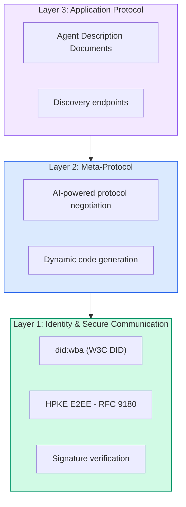

#### Dokumenty DID w ANP

ANP wykorzystuje dedykowaną metodę DID o nazwie `did:wba` (Web-Based Agent). Identyfikator DID o postaci `did:wba:example.com:user:alice` jest rozwiązywany do ścieżki `https://example.com/user/alice/did.json`:

```json
{
  "@context": [
    "https://www.w3.org/ns/did/v1",
    "https://w3id.org/security/suites/jws-2020/v1",
    "https://w3id.org/security/suites/secp256k1-2019/v1"
  ],
  "id": "did:wba:example.com:user:alice",
  "verificationMethod": [
    {
      "id": "did:wba:example.com:user:alice#key-1",
      "type": "EcdsaSecp256k1VerificationKey2019",
      "controller": "did:wba:example.com:user:alice",
      "publicKeyJwk": {
        "crv": "secp256k1",
        "x": "NtngWpJUr-rlNNbs0u-Aa8e16OwSJu6UiFf0Rdo1oJ4",
        "y": "qN1jKupJlFsPFc1UkWinqljv4YE0mq_Ickwnjgasvmo",
        "kty": "EC"
      }
    },
    {
      "id": "did:wba:example.com:user:alice#key-x25519-1",
      "type": "X25519KeyAgreementKey2019",
      "controller": "did:wba:example.com:user:alice",
      "publicKeyMultibase": "z9hFgmPVfmBZwRvFEyniQDBkz9LmV7gDEqytWyGZLmDXE"
    }
  ],
  "authentication": [
    "did:wba:example.com:user:alice#key-1"
  ],
  "keyAgreement": [
    "did:wba:example.com:user:alice#key-x25519-1"
  ],
  "humanAuthorization": [
    "did:wba:example.com:user:alice#key-1"
  ],
  "service": [
    {
      "id": "did:wba:example.com:user:alice#agent-description",
      "type": "AgentDescription",
      "serviceEndpoint": "https://example.com/agents/alice/ad.json"
    }
  ]
}
```

Istotne cechy struktury:
- **Rozdzielenie kluczy (Key Separation).** Klucze służące do podpisywania (secp256k1) są odseparowane od kluczy szyfrujących (X25519).
- **`humanAuthorization`** to unikalne pole w ANP. Wskazane tu klucze wymagają jawnej autoryzacji ze strony człowieka (np. potwierdzenie biometryczne, klucz sprzętowy HSM) przed ich użyciem. Jest to wymagane w przypadku akcji wysokiego ryzyka, np. operacji finansowych.
- Sekcja **keyAgreement** definiuje klucze używane do szyfrowania HPKE (RFC 9180) na potrzeby bezpiecznej komunikacji E2EE.
- Wpis **service** wskazuje dokument opisu możliwości agenta (Agent Description).

#### Jak działa zaufanie w ANP

ANP **nie** opiera się na globalnej sieci zaufania (web of trust). Zaufanie jest relacją dwustronną, weryfikowaną przy każdej interakcji:

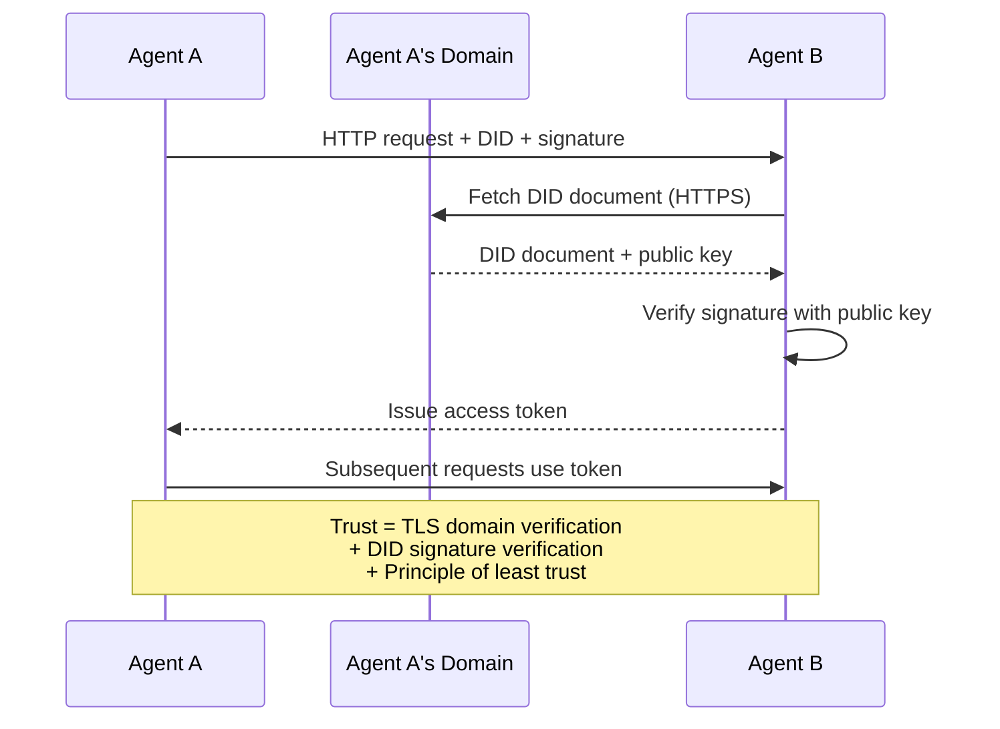

Zaufanie wynika z trzech czynników:
1. **Weryfikacja domeny przez protokół TLS** hostujący dokument DID.
2. **Kryptograficzny podpis DID**, potwierdzający tożsamość agenta.
3. **Zasada najmniejszych uprawnień (Principle of least trust)** przyznająca minimalny zakres dostępu.

Zaufanie nie opiera się na plotkach czy zewnętrznych ocenach reputacji. Każdego agenta weryfikuje się bezpośrednio za pomocą jego DID.

#### Negocjacja metaprotokołu (Meta-Protocol Negotiation)

To najbardziej innowacyjny element ANP. Gdy dwaj agenci z różnych środowisk wchodzą w interakcję, nie muszą z góry posiadać zdefiniowanego formatu danych. Negocjują go dynamicznie, korzystając z języka naturalnego:

```json
{
  "action": "protocolNegotiation",
  "sequenceId": 0,
  "candidateProtocols": "I can communicate using:\n1. JSON-RPC with hotel booking schema\n2. REST with OpenAPI 3.1 spec\n3. Natural language over HTTP",
  "modificationSummary": "Initial proposal",
  "status": "negotiating"
}
```

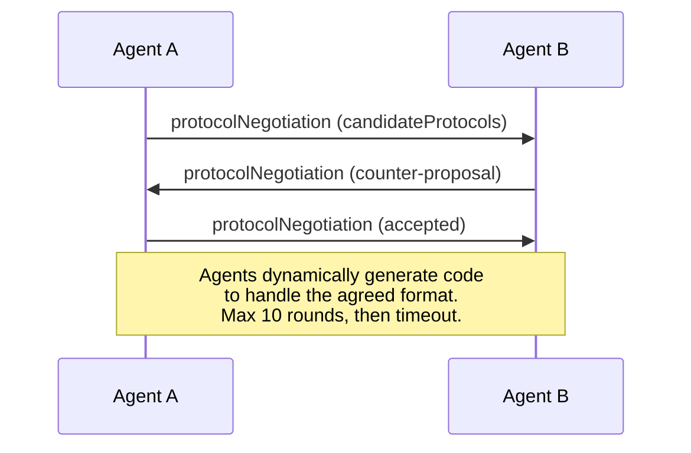

Agenci wymieniają oferty (maksymalnie do 10 rund), aż uzgodnią wspólny format, a następnie mogą automatycznie wygenerować kod do jego obsługi. Dopuszczalne stany pola `status`: `negotiating`, `rejected`, `accepted`, `timeout`.

Dzięki temu dwa niezależne systemy mogą ustalić sposób komunikacji w locie, bez uprzedniej koordynacji programistów.

### Porównanie protokołów

| Cecha | MCP | A2A | ACP | ANP |
|---|---|---|---|---|
| **Autor** | Anthropic | Google / Linux Foundation | IBM / BeeAI | Społeczność |
| **Format specyfikacji** | JSON-RPC | JSON-RPC / REST / gRPC | OpenAPI 3.1 (REST) | JSON-RPC |
| **Główny cel** | Agent -> Narzędzie | Agent -> Agent | Agent -> Agent | Agent -> Agent |
| **Wykrywanie (Discovery)** | Wywołanie listTools | `/.well-known/agent-card.json` | `GET /agents`, `/.well-known/agent.yml` | Opisy w DID Service |
| **Tożsamość** | Lokalna (niejawna) | Schematy bezpieczeństwa (OAuth, mTLS) | Poziom serwera | W3C DID (`did:wba`) z E2EE |
| **Ścieżka audytu** | Brak | Podstawowa (historia zadań) | TrajectoryMetadata (rozumowanie, narzędzia) | Brak formalnego standardu |
| **Maszyna stanowa** | Brak | 8 stanów zadań (Task) | 7 stanów uruchomienia (Run) | Brak |
| **Strumieniowanie** | Brak | SSE | SSE | Niezależne od transportu |
| **Unikalna zaleta** | Standaryzacja narzędzi | Karty Agentów + definicje umiejętności | Śledzenie trajektorii wykonania | Negocjacje metaprotokołu |
| **Zastosowanie** | Integracja z bazami danych/API | Dynamiczna współpraca agentów | Zgodność i branże regulowane | Współpraca między organizacjami |
| **Status projektu** | Stabilny | Stabilny (v1.0) | Wdrażany do A2A | Aktywnie rozwijany |

### Współpraca protokołów w jednym systemie

Protokoły te uzupełniają się wzajemnie. Realistyczny system klasy Enterprise może wykorzystywać je równolegle:

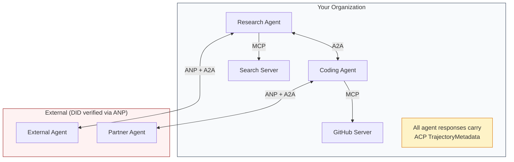

- **MCP** łączy agentów z dedykowanymi narzędziami.
- **A2A** obsługuje współpracę i delegację zadań (zarówno wewnątrz organizacji, jak i na zewnątrz).
- **ACP** wzbogaca odpowiedzi o metadane trajektorii w celach audytowych.
- **ANP** weryfikuje tożsamość agentów należących do zewnętrznych partnerów.

## Zbuduj to

### Krok 1: Podstawowe typy komunikatów

Każdy system wieloagentowy wymaga jednolitego formatu wiadomości. Definiujemy typy odpowiadające rzeczywistym specyfikacjom:

```typescript
import crypto from "node:crypto";

type MessageRole = "user" | "agent";

type MessagePart =
  | { kind: "text"; text: string }
  | { kind: "data"; data: unknown; mediaType: string }
  | { kind: "file"; name: string; url: string; mediaType: string };

type TrajectoryEntry = {
  reasoning: string;
  toolName?: string;
  toolInput?: unknown;
  toolOutput?: unknown;
  timestamp: number;
};

type AgentMessage = {
  id: string;
  role: MessageRole;
  parts: MessagePart[];
  trajectory?: TrajectoryEntry[];
  replyTo?: string;
  timestamp: number;
};

function createMessage(
  role: MessageRole,
  parts: MessagePart[],
  replyTo?: string
): AgentMessage {
  return {
    id: crypto.randomUUID(),
    role,
    parts,
    replyTo,
    timestamp: Date.now(),
  };
}

function textMessage(role: MessageRole, text: string): AgentMessage {
  return createMessage(role, [{ kind: "text", text }]);
}
```

*Uwaga:* Obiekt `MessagePart` jest z założenia multimodalny (obsługuje tekst, dane strukturyzowane oraz pliki), tak jak w specyfikacji A2A czy ACP. `TrajectoryEntry` pozwala na zapisanie kroków rozumowania zgodnie z wymogami TrajectoryMetadata z ACP.

### Krok 2: Karta agenta A2A i rejestr

Tworzymy rejestr agentów wspierający dynamiczne wykrywanie możliwości:

```typescript
type Skill = {
  id: string;
  name: string;
  description: string;
  tags: string[];
  inputModes: string[];
  outputModes: string[];
};

type AgentCard = {
  name: string;
  description: string;
  version: string;
  url: string;
  capabilities: {
    streaming: boolean;
    pushNotifications: boolean;
  };
  defaultInputModes: string[];
  defaultOutputModes: string[];
  skills: Skill[];
};

class AgentRegistry {
  private cards: Map<string, AgentCard> = new Map();

  register(card: AgentCard) {
    this.cards.set(card.name, card);
  }

  discoverBySkillTag(tag: string): AgentCard[] {
    return [...this.cards.values()].filter((card) =>
      card.skills.some((skill) => skill.tags.includes(tag))
    );
  }

  discoverByInputMode(mimeType: string): AgentCard[] {
    return [...this.cards.values()].filter(
      (card) =>
        card.defaultInputModes.includes(mimeType) ||
        card.skills.some((skill) => skill.inputModes.includes(mimeType))
    );
  }

  resolve(name: string): AgentCard | undefined {
    return this.cards.get(name);
  }

  listAll(): AgentCard[] {
    return [...this.cards.values()];
  }
}
```

Ten rejestr pozwala na wyszukiwanie agentów według oferowanych umiejętności (skill tags) czy typów danych, odwzorowując rzeczywisty model A2A.

### Krok 3: Cykl życia zadania A2A

Implementacja maszyny stanów zadania (Task):

```typescript
type TaskState =
  | "submitted"
  | "working"
  | "input-required"
  | "auth-required"
  | "completed"
  | "failed"
  | "canceled"
  | "rejected";

const TERMINAL_STATES: TaskState[] = [
  "completed",
  "failed",
  "canceled",
  "rejected",
];

type TaskStatus = {
  state: TaskState;
  message?: AgentMessage;
  timestamp: number;
};

type Artifact = {
  id: string;
  name: string;
  parts: MessagePart[];
};

type Task = {
  id: string;
  contextId: string;
  status: TaskStatus;
  artifacts: Artifact[];
  history: AgentMessage[];
};

type TaskEvent =
  | { kind: "statusUpdate"; taskId: string; status: TaskStatus }
  | {
      kind: "artifactUpdate";
      taskId: string;
      artifact: Artifact;
      append: boolean;
      lastChunk: boolean;
    };

type TaskHandler = (
  task: Task,
  message: AgentMessage
) => AsyncGenerator<TaskEvent>;

class TaskManager {
  private tasks: Map<string, Task> = new Map();
  private handlers: Map<string, TaskHandler> = new Map();
  private listeners: Map<string, ((event: TaskEvent) => void)[]> = new Map();

  registerHandler(agentName: string, handler: TaskHandler) {
    this.handlers.set(agentName, handler);
  }

  subscribe(taskId: string, listener: (event: TaskEvent) => void) {
    const existing = this.listeners.get(taskId) ?? [];
    existing.push(listener);
    this.listeners.set(taskId, existing);
  }

  async sendMessage(
    agentName: string,
    message: AgentMessage,
    contextId?: string
  ): Promise<Task> {
    const handler = this.handlers.get(agentName);
    if (!handler) {
      const task = this.createTask(contextId);
      task.status = {
        state: "rejected",
        timestamp: Date.now(),
        message: textMessage("agent", `No handler for ${agentName}`),
      };
      return task;
    }

    const task = this.createTask(contextId);
    task.history.push(message);
    task.status = { state: "submitted", timestamp: Date.now() };

    this.processTask(task, handler, message).catch((err) => {
      task.status = {
        state: "failed",
        timestamp: Date.now(),
        message: textMessage("agent", String(err)),
      };
    });
    return task;
  }

  getTask(taskId: string): Task | undefined {
    return this.tasks.get(taskId);
  }

  cancelTask(taskId: string): boolean {
    const task = this.tasks.get(taskId);
    if (!task || TERMINAL_STATES.includes(task.status.state)) return false;
    task.status = { state: "canceled", timestamp: Date.now() };
    this.emit(taskId, {
      kind: "statusUpdate",
      taskId,
      status: task.status,
    });
    return true;
  }

  private createTask(contextId?: string): Task {
    const task: Task = {
      id: crypto.randomUUID(),
      contextId: contextId ?? crypto.randomUUID(),
      status: { state: "submitted", timestamp: Date.now() },
      artifacts: [],
      history: [],
    };
    this.tasks.set(task.id, task);
    return task;
  }

  private async processTask(
    task: Task,
    handler: TaskHandler,
    message: AgentMessage
  ) {
    task.status = { state: "working", timestamp: Date.now() };
    this.emit(task.id, {
      kind: "statusUpdate",
      taskId: task.id,
      status: task.status,
    });

    try {
      for await (const event of handler(task, message)) {
        if (TERMINAL_STATES.includes(task.status.state)) break;

        if (event.kind === "statusUpdate") {
          task.status = event.status;
        }
        if (event.kind === "artifactUpdate") {
          const existing = task.artifacts.find(
            (a) => a.id === event.artifact.id
          );
          if (existing && event.append) {
            existing.parts.push(...event.artifact.parts);
          } else {
            task.artifacts.push(event.artifact);
          }
        }
        this.emit(task.id, event);
      }
    } catch (err) {
      task.status = {
        state: "failed",
        timestamp: Date.now(),
        message: textMessage("agent", String(err)),
      };
      this.emit(task.id, {
        kind: "statusUpdate",
        taskId: task.id,
        status: task.status,
      });
    }
  }

  private emit(taskId: string, event: TaskEvent) {
    for (const listener of this.listeners.get(taskId) ?? []) {
      listener(event);
    }
  }
}
```

Struktura ta odwzorowuje cykl życia zadań w A2A. Handlery oparte na generatorach asynchronicznych symulują asynchroniczną generację wyników i fragmentów artefaktów (zbieżną z SSE).

### Krok 4: Ścieżka audytu w stylu ACP

Moduł audytu do rejestrowania historii wykonania oraz trajektorii:

```typescript
type AuditEntry = {
  runId: string;
  agentName: string;
  input: AgentMessage[];
  output: AgentMessage[];
  trajectory: TrajectoryEntry[];
  status: "created" | "in-progress" | "completed" | "failed" | "awaiting";
  startedAt: number;
  completedAt?: number;
  sessionId?: string;
};

class AuditableRunner {
  private log: AuditEntry[] = [];
  private handlers: Map<
    string,
    (input: AgentMessage[]) => Promise<{
      output: AgentMessage[];
      trajectory: TrajectoryEntry[];
    }>
  > = new Map();

  registerAgent(
    name: string,
    handler: (input: AgentMessage[]) => Promise<{
      output: AgentMessage[];
      trajectory: TrajectoryEntry[];
    }>
  ) {
    this.handlers.set(name, handler);
  }

  async run(
    agentName: string,
    input: AgentMessage[],
    sessionId?: string
  ): Promise<AuditEntry> {
    const entry: AuditEntry = {
      runId: crypto.randomUUID(),
      agentName,
      input: structuredClone(input),
      output: [],
      trajectory: [],
      status: "created",
      startedAt: Date.now(),
      sessionId,
    };
    this.log.push(entry);

    const handler = this.handlers.get(agentName);
    if (!handler) {
      entry.status = "failed";
      return entry;
    }

    entry.status = "in-progress";
    try {
      const result = await handler(input);
      entry.output = structuredClone(result.output);
      entry.trajectory = structuredClone(result.trajectory);
      entry.status = "completed";
      entry.completedAt = Date.now();
    } catch (err) {
      entry.status = "failed";
      entry.trajectory.push({
        reasoning: `Error: ${String(err)}`,
        timestamp: Date.now(),
      });
      entry.completedAt = Date.now();
    }
    return entry;
  }

  getFullAuditLog(): AuditEntry[] {
    return structuredClone(this.log);
  }

  getAuditLogForAgent(agentName: string): AuditEntry[] {
    return structuredClone(
      this.log.filter((e) => e.agentName === agentName)
    );
  }

  getAuditLogForSession(sessionId: string): AuditEntry[] {
    return structuredClone(
      this.log.filter((e) => e.sessionId === sessionId)
    );
  }

  getTrajectoryForRun(runId: string): TrajectoryEntry[] {
    const entry = this.log.find((e) => e.runId === runId);
    return entry ? structuredClone(entry.trajectory) : [];
  }
}
```

### Krok 5: Weryfikacja tożsamości w stylu ANP

Moduł tożsamości oparty na zdecentralizowanych identyfikatorach DID:

```typescript
type VerificationMethod = {
  id: string;
  type: string;
  controller: string;
  publicKeyDer: string;
};

type DIDDocument = {
  id: string;
  verificationMethod: VerificationMethod[];
  authentication: string[];
  keyAgreement: string[];
  humanAuthorization: string[];
  service: { id: string; type: string; serviceEndpoint: string }[];
};

type AgentIdentity = {
  did: string;
  document: DIDDocument;
  privateKey: crypto.KeyObject;
  publicKey: crypto.KeyObject;
};

class IdentityRegistry {
  private documents: Map<string, DIDDocument> = new Map();

  publish(doc: DIDDocument) {
    this.documents.set(doc.id, doc);
  }

  resolve(did: string): DIDDocument | undefined {
    return this.documents.get(did);
  }

  verify(did: string, signature: string, payload: string): boolean {
    const doc = this.documents.get(did);
    if (!doc) return false;

    const authKeyIds = doc.authentication;
    const authKeys = doc.verificationMethod.filter((vm) =>
      authKeyIds.includes(vm.id)
    );

    for (const key of authKeys) {
      const publicKey = crypto.createPublicKey({
        key: Buffer.from(key.publicKeyDer, "base64"),
        format: "der",
        type: "spki",
      });
      const isValid = crypto.verify(
        null,
        Buffer.from(payload),
        publicKey,
        Buffer.from(signature, "hex")
      );
      if (isValid) return true;
    }
    return false;
  }

  requiresHumanAuth(did: string, operationKeyId: string): boolean {
    const doc = this.documents.get(did);
    if (!doc) return false;
    return doc.humanAuthorization.includes(operationKeyId);
  }
}

function createIdentity(domain: string, agentName: string): AgentIdentity {
  const did = `did:wba:${domain}:agent:${agentName}`;
  const { publicKey, privateKey } = crypto.generateKeyPairSync("ed25519");

  const publicKeyDer = publicKey
    .export({ format: "der", type: "spki" })
    .toString("base64");

  const keyId = `${did}#key-1`;
  const encKeyId = `${did}#key-x25519-1`;

  const document: DIDDocument = {
    id: did,
    verificationMethod: [
      {
        id: keyId,
        type: "Ed25519VerificationKey2020",
        controller: did,
        publicKeyDer,
      },
      {
        id: encKeyId,
        type: "X25519KeyAgreementKey2019",
        controller: did,
        publicKeyDer,
      },
    ],
    authentication: [keyId],
    keyAgreement: [encKeyId],
    humanAuthorization: [],
    service: [
      {
        id: `${did}#agent-description`,
        type: "AgentDescription",
        serviceEndpoint: `https://${domain}/agents/${agentName}/ad.json`,
      },
    ],
  };

  return { did, document, privateKey, publicKey };
}

function signPayload(identity: AgentIdentity, payload: string): string {
  return crypto
    .sign(null, Buffer.from(payload), identity.privateKey)
    .toString("hex");
}
```

### Krok 6: Bramka protokołów

Złożenie wszystkich elementów w jedną spójną architekturę:

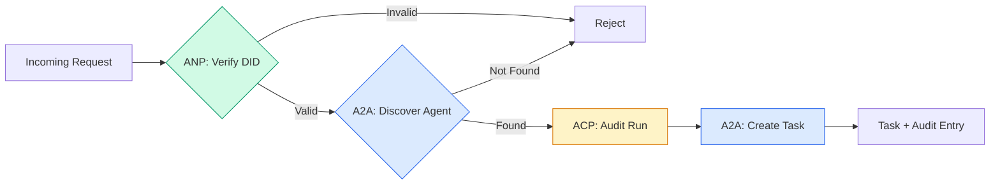

```typescript
class ProtocolGateway {
  private registry: AgentRegistry;
  private taskManager: TaskManager;
  private auditRunner: AuditableRunner;
  private identityRegistry: IdentityRegistry;

  constructor(
    registry: AgentRegistry,
    taskManager: TaskManager,
    auditRunner: AuditableRunner,
    identityRegistry: IdentityRegistry
  ) {
    this.registry = registry;
    this.taskManager = taskManager;
    this.auditRunner = auditRunner;
    this.identityRegistry = identityRegistry;
  }

  async delegateTask(
    fromDid: string,
    signature: string,
    targetAgent: string,
    message: AgentMessage,
    sessionId?: string
  ): Promise<{ task: Task; audit: AuditEntry } | { error: string }> {
    if (!this.identityRegistry.verify(fromDid, signature, message.id)) {
      return { error: "Identity verification failed" };
    }

    const card = this.registry.resolve(targetAgent);
    if (!card) {
      return { error: `Agent ${targetAgent} not found in registry` };
    }

    const audit = await this.auditRunner.run(
      targetAgent,
      [message],
      sessionId
    );
    const task = await this.taskManager.sendMessage(targetAgent, message);

    return { task, audit };
  }

  discoverAndDelegate(
    fromDid: string,
    signature: string,
    skillTag: string,
    message: AgentMessage
  ): Promise<{ task: Task; audit: AuditEntry } | { error: string }> {
    const candidates = this.registry.discoverBySkillTag(skillTag);
    if (candidates.length === 0) {
      return Promise.resolve({
        error: `No agents found with skill tag: ${skillTag}`,
      });
    }
    return this.delegateTask(
      fromDid,
      signature,
      candidates[0].name,
      message
    );
  }
}
```

Bramka wykonuje kompletny proces:
1. **ANP**: Weryfikuje tożsamość nadawcy poprzez podpis kryptograficzny DID.
2. **A2A**: Wyszukuje docelowego agenta i ocenia jego Karcie.
3. **ACP**: Kapsułkuje wykonanie, tworząc wpis audytowy z trajektorią.
4. **A2A**: Generuje zadanie (Task) o pełnym cyklu życia.

### Krok 7: Prezentacja działania systemu (Demo)

```typescript
async function protocolDemo() {
  const registry = new AgentRegistry();
  registry.register({
    name: "researcher",
    description: "Searches and summarizes findings",
    version: "1.0.0",
    url: "https://researcher.local/a2a/v1",
    capabilities: { streaming: true, pushNotifications: false },
    defaultInputModes: ["text/plain"],
    defaultOutputModes: ["text/plain", "application/json"],
    skills: [
      {
        id: "web-research",
        name: "Web Research",
        description: "Searches the web",
        tags: ["research", "search", "summarization"],
        inputModes: ["text/plain"],
        outputModes: ["application/json"],
      },
    ],
  });
  registry.register({
    name: "coder",
    description: "Writes code from specs",
    version: "1.0.0",
    url: "https://coder.local/a2a/v1",
    capabilities: { streaming: false, pushNotifications: false },
    defaultInputModes: ["text/plain", "application/json"],
    defaultOutputModes: ["text/plain"],
    skills: [
      {
        id: "code-gen",
        name: "Code Generation",
        description: "Generates code",
        tags: ["coding", "generation"],
        inputModes: ["text/plain", "application/json"],
        outputModes: ["text/plain"],
      },
    ],
  });

  const taskManager = new TaskManager();
  const auditRunner = new AuditableRunner();

  const researchTrajectory: TrajectoryEntry[] = [];

  taskManager.registerHandler(
    "researcher",
    async function* (task, message) {
      yield {
        kind: "statusUpdate" as const,
        taskId: task.id,
        status: { state: "working" as const, timestamp: Date.now() },
      };

      researchTrajectory.push({
        reasoning: "Searching for React 19 documentation",
        toolName: "web_search",
        toolInput: { query: "React 19 compiler features" },
        toolOutput: {
          results: ["react.dev/blog/react-19", "github.com/react/react"],
        },
        timestamp: Date.now(),
      });

      researchTrajectory.push({
        reasoning: "Extracting key findings from search results",
        toolName: "doc_analysis",
        toolInput: { url: "react.dev/blog/react-19" },
        toolOutput: {
          summary:
            "React 19 compiler auto-memoizes, no manual useMemo needed",
        },
        timestamp: Date.now(),
      });

      yield {
        kind: "artifactUpdate" as const,
        taskId: task.id,
        artifact: {
          id: crypto.randomUUID(),
          name: "research-results",
          parts: [
            {
              kind: "data" as const,
              data: {
                findings: [
                  "React 19 compiler auto-memoizes components",
                  "No more manual useMemo/useCallback needed",
                  "Compiler runs at build time, not runtime",
                ],
                sources: ["react.dev/blog/react-19"],
              },
              mediaType: "application/json",
            },
          ],
        },
        append: false,
        lastChunk: true,
      };

      yield {
        kind: "statusUpdate" as const,
        taskId: task.id,
        status: { state: "completed" as const, timestamp: Date.now() },
      };
    }
  );

  auditRunner.registerAgent("researcher", async () => ({
    output: [
      textMessage("agent", "React 19 compiler auto-memoizes components"),
    ],
    trajectory: researchTrajectory,
  }));

  const identityRegistry = new IdentityRegistry();

  const coderIdentity = createIdentity("coder.local", "coder");
  const researcherIdentity = createIdentity("researcher.local", "researcher");

  identityRegistry.publish(coderIdentity.document);
  identityRegistry.publish(researcherIdentity.document);

  const gateway = new ProtocolGateway(
    registry,
    taskManager,
    auditRunner,
    identityRegistry
  );

  console.log("=== Protocol Demo ===\n");

  console.log("1. Agent Discovery (A2A)");
  const researchAgents = registry.discoverBySkillTag("research");
  console.log(
    `   Found ${researchAgents.length} agent(s):`,
    researchAgents.map((a) => a.name)
  );

  console.log("\n2. Identity Verification (ANP)");
  const message = textMessage("user", "Research React 19 compiler features");
  const signature = signPayload(coderIdentity, message.id);
  const verified = identityRegistry.verify(
    coderIdentity.did,
    signature,
    message.id
  );
  console.log(`   Coder DID: ${coderIdentity.did}`);
  console.log(`   Signature verified: ${verified}`);

  console.log("\n3. Task Delegation (A2A + ACP + ANP)");
  const result = await gateway.delegateTask(
    coderIdentity.did,
    signature,
    "researcher",
    message,
    "session-001"
  );

  if ("error" in result) {
    console.log(`   Error: ${result.error}`);
    return;
  }

  console.log(`   Task ID: ${result.task.id}`);
  console.log(`   Task state: ${result.task.status.state}`);
  console.log(`   Artifacts: ${result.task.artifacts.length}`);

  console.log("\n4. Audit Trail (ACP)");
  console.log(`   Run ID: ${result.audit.runId}`);
  console.log(`   Status: ${result.audit.status}`);
  console.log(`   Trajectory steps: ${result.audit.trajectory.length}`);
  for (const step of result.audit.trajectory) {
    console.log(`     - ${step.reasoning}`);
    if (step.toolName) {
      console.log(`       Tool: ${step.toolName}`);
    }
  }

  console.log("\n5. Full Audit Log");
  const fullLog = auditRunner.getFullAuditLog();
  console.log(`   Total runs: ${fullLog.length}`);
  for (const entry of fullLog) {
    const duration = entry.completedAt
      ? `${entry.completedAt - entry.startedAt}ms`
      : "in-progress";
    console.log(`   ${entry.agentName}: ${entry.status} (${duration})`);
  }
}

protocolDemo().catch((err) => {
  console.error("Protocol demo failed:", err);
  process.exitCode = 1;
});
```

## Co może pójść nie tak (Typowe problemy)

Protokoły działają dobrze przy optymistycznych ścieżkach. W produkcji pojawiają się następujące problemy:

**Dryf schematu (Schema drift).** Agent A publikuje dane wyjściowe opisane w Karcie jako `application/json`. Z czasem schemat ulega zmianie. Agent B próbuje odczytać stary format i przetwarza błędne dane. *Rozwiązanie:* wersjonuj umiejętności i formaty wyjściowe. W A2A pole `version` w Karcie agenta służy właśnie do tego.

**Naruszenia maszyny stanów.** Handler agenta wysyła zdarzenie `completed`, a następnie próbuje wygenerować dodatkowy artefakt. Zgodnie ze specyfikacją stan terminalny jest ostateczny. *Rozwiązanie:* zablokuj możliwość wysyłania aktualizacji po osiągnięciu stanu końcowego (w naszym `TaskManager` dba o to instrukcja `break`).

**Błąd weryfikacji tożsamości.** Agent A próbuje zweryfikować DID Agenta B, ale serwer hostujący dokument DID Agenta B jest nieosiągalny. Czy system powinien zignorować błąd (fail open), czy zablokować komunikację (fail closed)? *Rozwiązanie:* ANP rekomenduje zasadę fail closed dla zachowania bezpieczeństwa.

**Rozrastanie się metadanych trajektorii.** Zapisywanie pełnej trajektorii w ACP jest przydatne, ale generuje duże koszty transferu i pamięci. Złożony agent wykonujący 200 kroków generuje ogromny plik audytowy. *Rozwiązanie:* wdróż filtrowanie trajektorii w zależności od konfiguracji i poziomu logowania.

**Gromadne odpytywanie rejestru (Thundering herd).** Równoczesne odpytanie punktu `GET /agents` przez 50 instancji przy starcie systemu. *Rozwiązanie:* stosuj cache'owanie kart z czasem TTL i rozpraszaj zapytania (jitter).

## Użyj tego

### Realne wdrożenia

**A2A** jest najbardziej dojrzałym standardem. [Oficjalna specyfikacja Google](https://github.com/google/A2A) została przekazana do Linux Foundation i posiada pakiety SDK dla języków Python oraz TypeScript. Jeśli potrzebujesz dynamicznego wykrywania możliwości i współpracy peer-to-peer, zacznij tutaj.

**ACP** łączy się z A2A. W [projekcie BeeAI](https://github.com/i-am-bee/acp) IBM stworzył ACP jako prosty interfejs REST, ale idea TrajectoryMetadata jest adaptowana do szerszego ekosystemu A2A. Używaj wzorców ACP do audytowania, nawet jeśli sam transport realizujesz przez A2A.

**ANP** to protokół o statusie eksperymentalnym. [Repozytorium społeczności](https://github.com/agent-network-protocol/AgentNetworkProtocol) oferuje pakiet SDK dla Pythona (AgentConnect). Warto obserwować ten projekt pod kątem bezpiecznej współpracy agentów należących do różnych organizacji.

**MCP** jest standardem rynkowym (szczególnie po popularyzacji przez Anthropic) w scenariuszach łączenia agenta z zewnętrznymi narzędziami i lokalnymi bazami danych.

### Wybór odpowiedniego protokołu

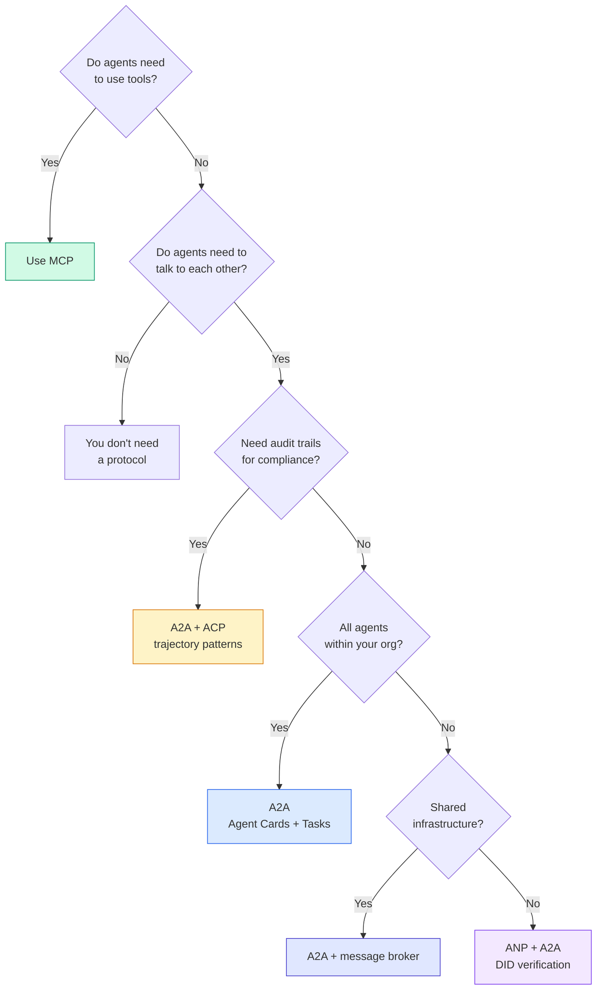

## Wyślij to

Ta lekcja udostępnia:
- `code/main.ts` — pełna implementacja wszystkich czterech protokołów.
- `outputs/prompt-protocol-selector.md` — system podpowiedzi ułatwiający dobór protokołu.

## Ćwiczenia

1. **Wielopoziomowe delegowanie zadań.** Rozszerz klasę `TaskManager` tak, aby handler agenta mógł delegować podzadania do innych agentów. Przetestuj scenariusz, w którym agent badawczy deleguje podzadania wyszukiwania i podsumowania, po czym łączy oba wyniki.
2. **Strumieniowa ścieżka audytu.** Zmodyfikuj klasę `AuditableRunner`, aby wspierała tryb strumieniowy. Aktualizuj stan `AuditEntry` na bieżąco, w miarę pojawiania się nowych kroków w generatorze asynchronicznym.
3. **Rotacja kluczy DID.** Wprowadź mechanizm rotacji kluczy w `IdentityRegistry`. Agent powinien mieć możliwość opublikowania zaktualizowanego dokumentu DID ze wskazaniem klucza poprzedniego (`previousDid`). Weryfikator powinien akceptować podpisy z obu kluczy w zdefiniowanym oknie czasowym transition.
4. **Negocjacja protokołów.** Zaimplementuj uproszczony metaprotokół ANP. Dwa agenty wymieniają komunikaty `protocolNegotiation`, proponując formaty (np. JSON-RPC vs REST). Po maksymalnie 3 rundach dochodzą do porozumienia i inicjują właściwy runner.
5. **Rejestr z limitem zapytań (Rate Limiting).** Zbuduj wrapper `RateLimitedRegistry` buforujący karty agentów z czasem TTL i ograniczający dopuszczalną częstotliwość odpytywania per agent na sekundę.

## Kluczowe terminy

| Termin | Co ludzie mówią | Co to właściwie oznacza |
|------|----------------|----------------------|
| MCP | „Protokół dla narzędzi AI” | Standard klient-serwer do łączenia agenta z narzędziami i bazami danych (agent-to-tool). |
| A2A | „Protokół agentów Google” | Standard peer-to-peer do współpracy agentów w ramach Linux Foundation. Oferuje karty agentów, 8 stanów zadań i strumieniowanie SSE. |
| ACP | „Standard IBM/BeeAI” | Interfejs REST-first wzbogacający odpowiedzi o TrajectoryMetadata (ścieżki audytu kroków wnioskowania i wywołań narzędzi). |
| ANP | „Kryptograficzny protokół agentów” | Standard oparty na DID (`did:wba`) i szyfrowaniu HPKE (E2EE) umożliwiający współpracę bez centralnego rejestru zaufania. |
| Karta agenta (Agent Card) | „Wizytówka agenta” | Dokument JSON pod adresem `/.well-known/agent-card.json` opisujący umiejętności, typy wejścia/wyjścia i uwierzytelnianie. |
| DID | „Zdecentralizowany identyfikator” | Kryptograficzny standard tożsamości W3C. ANP definiuje metodę `did:wba`. |
| TrajectoryMetadata | „Trajektoria wykonania” | Standard zapisu ścieżki wnioskowania i wywołań narzędzi do celów audytowych w ACP. |
| Metaprotokół | „Negocjacja sposobu rozmowy” | Mechanizm ANP, w którym agenci za pomocą języka naturalnego ustalają schemat komunikacji, po czym generują kod do jego obsługi. |
| Zadanie (Task) | „Jednostka pracy” | Obiekt w A2A reprezentujący zlecenia, o ściśle określonym i niezmiennym po zakończeniu cyklu życia. |

## Dalsze czytanie

- [Specyfikacja Google A2A](https://github.com/google/A2A) — repozytorium projektu i pakiety SDK w ramach Linux Foundation.
- [Specyfikacja IBM/BeeAI ACP](https://github.com/i-am-bee/acp) — definicje interfejsów OpenAPI dla trajektorii i przebiegów agentów.
- [Specyfikacja Agent Network Protocol (ANP)](https://github.com/agent-network-protocol/AgentNetworkProtocol) — szczegóły techniczne zdecentralizowanej tożsamości i E2EE.
- [Model Context Protocol](https://modelcontextprotocol.io/) — oficjalna dokumentacja specyfikacji MCP firmy Anthropic.
- [W3C Decentralized Identifiers (DIDs)](https://www.w3.org/TR/did-core/) — oficjalna rekomendacja standardu DID.
- [RFC 9180 (HPKE)](https://www.rfc-editor.org/rfc/rfc9180) — standard Hybrid Public Key Encryption stosowany w ANP.
