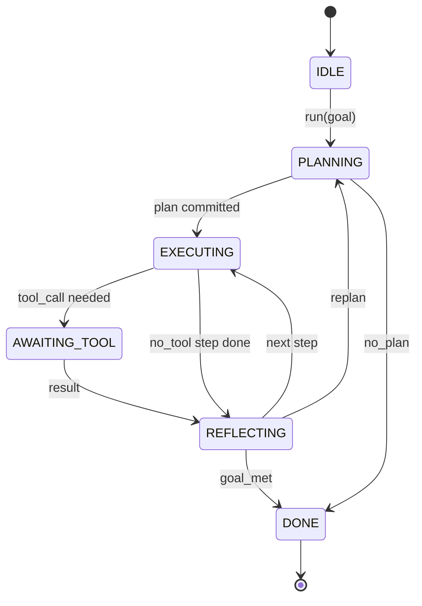

# Umowa o pętlę uprzęży agenta

> Uprząż jest czynnikiem. Model jest koprocesorem. Ta lekcja blokuje kontrakt pętli, do którego możesz podłączyć dowolny model.

**Typ:** Kompilacja
**Języki:** Python
**Wymagania wstępne:** Faza 13, lekcje 01-07, Faza 14, lekcja 01
**Czas:** ~90 minut

## Cele nauczania
- Określ pętlę wiązki agenta jako deterministyczną maszynę stanu z jawnymi przejściami.
- Zaimplementuj dziesięć tematów haków cyklu życia, do których operatorzy łączą zasady, dane telemetryczne i poręcze.
- Zdefiniuj dwa punkty ściągania, w których pętla przekazuje kontrolę z powrotem do wywołującego i wznawia po nowym wejściu.
- Egzekwuj budżety na sesję (obroty, wywołania narzędzi, zegar ścienny) bez wyciekania stanu częściowego po przekroczeniu.
- Emituj wpisany strumień jedenastu typów zdarzeń, aby interfejsy użytkownika i moduły śledzące na dalszym etapie mogły subskrybować bez bezpośredniego sprawdzania pętli.

## Rama

Agent kodujący działający bez nadzoru przez czterdzieści tur nie jest pętlą czatu. Jest to maszyna stanów, której węzły może przechwycić operator i których krawędzie może kontrolować. Po spisaniu umowy zamiana modeli, narzędzi lub zasad przestaje być refaktorem. Staje się połączeniem rejestracyjnym.

Ta lekcja buduje tę umowę. Wymieniamy sześć stanów, dziesięć tematów haków, dwa punkty przyciągania, jedenaście typów wydarzeń i kopertę budżetową. Wszystko inne w wiązce (rejestr narzędzi, transport JSON-RPC, dyspozytor, planista) podłącza się do tego kształtu.

## Stany

Pętla ma sześć stanów. Pięć jest aktywnych. Jeden jest terminalowy.



`IDLE` to jedyny legalny punkt wejścia. `DONE` to jedyne legalne wyjście. `AWAITING_TOOL` to jedyny stan, który daje punkt przyciągania. Każde inne przejście ma charakter wewnętrzny.

Maszyna stanów jest deterministyczna. Biorąc pod uwagę ten sam dziennik zdarzeń, wiązka przewodów ponownie przechodzi w ten sam stan. Ta właściwość pozwala odtwarzać sesje w celu debugowania bez ponownego wywoływania modelu.

## Tematy haków

Haczyki to szew operatora w pętli. Uprząż uruchamia dziesięć tematów. Każdy temat przyjmuje dowolną liczbę subskrybentów. Abonenci strzelają według kolejności rejestracji. Abonent może zmutować ładunek, podnieść, aby przerwać turę lub zwrócić wartownika, aby pominąć następny krok.

```text
before_plan         after_plan
before_tool_call    after_tool_call
before_step         after_step
on_error
on_pause
on_budget_exceeded
on_complete
```

Kształt odzwierciedla to, do czego do połowy 2025 roku zbliżyły się rozwiązania Claude Code, Cursor i OpenCode. Nazwy mają charakter funkcjonalny, a nie markowy. Hak blokujący `rm -rf` znajduje się w `before_tool_call`. Hak dostarczający zakres OpenTelemetry znajduje się w `after_step`. Hak, który jest wznawiany po wstrzymanej sesji, znajduje się w `on_pause`.

## Punkty przyciągania

Pętla daje kontrolę dwukrotnie. Najpierw `AWAITING_TOOL`, gdy nie można poczynić postępów bez wyniku narzędzia. Drugie miejsce `on_pause`, gdy budżet zostanie wyczerpany lub hak wyraźnie wymaga ręcznej weryfikacji.

Punkt przyciągania nie jest wyjątkiem. To jest powrót. Osoba wywołująca sprawdza stan wiązki przewodów, pobiera wszystko, o co prosiła wiązka, i wywołuje funkcję `resume(payload)`. Uprząż podnosi się w miejscu, w którym się zatrzymała. Ma ten sam kształt, co generator Pythona. Transport przez punkt ciągnięcia należy do Ciebie. W TUI jest to naciśnięcie klawisza. W przypadku MCP jest to `tools/call`. W przypadku kolejki jest to ankieta dotycząca pracy.

## Strumień zdarzenia

Pętla dołącza zdarzenia do strumienia o określonym typie w określonych punktach kontraktu. Strumień można tylko dodawać, a subskrybenci mogą odtwarzać go od dowolnego przesunięcia. Jedenaście zaimplementowanych typów zdarzeń to:

- `session.start` — emitowany jednorazowo po wywołaniu `run(goal)`
- `plan.draft` — emitowany, gdy planista zwraca wersję roboczą planu
- `plan.commit` — emitowany po zatwierdzeniu wersji roboczej jako planu aktywnego
- `step.start` — emitowany na początku każdego kroku wykonawczego
- `step.end` — emitowany na końcu każdego kroku wykonawczego
- `tool.call` — emitowany, gdy krok wymagający narzędzia przekazuje kontrolę wywołującemu
- `tool.result` — emitowany przy wznowieniu z wynikiem narzędzia
- `tool.error` — emitowany przy wznowieniu z błędem lub gdy przechwytywanie przerywa połączenie
- `budget.warn` — emitowane po osiągnięciu limitu budżetu
- `session.pause` — emitowany, gdy pętla ustąpi po pauzie (budżet lub hak)
- `session.complete` — emitowany raz, gdy pętla osiągnie `DONE`

Zdarzenia nie duplikują ładunków haków. Haki są konieczne (mutacja, przerwanie). Zdarzenia mają charakter obserwacyjny (zapis, statek). Traktuj je jako ortogonalne.

## Koperta budżetowa

Sesja ma trzy ograniczenia. Liczba obrotów, liczba wywołań narzędzi, sekundy zegara ściennego. Każda tura zwiększa się o jeden. Każde wywołanie narzędzia zwiększa wywołanie narzędzia o jeden. Zegar ścienny jest sprawdzany przy każdej zmianie stanu. Po osiągnięciu dowolnego limitu pętla uruchamia `on_budget_exceeded`, emituje `budget.warn`, a następnie przechodzi do `IDLE` z przyczyną przekroczenia budżetu w następnym punkcie ściągania.

Budżet nie jest wyłącznikiem awaryjnym. To jest plon. Rozmówca decyduje, czy rozszerzyć budżet i wznowić, czy też zamknąć sesję.

## Czego ta lekcja nie robi

Nie wywołuje modelu. Nie rejestruje prawdziwych narzędzi. Nie realizuje transportu. To są kolejne cztery lekcje. Ta lekcja gwoździ kontrakt, aby następni czterej mogli się do niego podłączyć bez przepisywania.

Deterministyczny planista w `main.py` jest zastępczy. Zwraca zakodowany na stałe plan trzech kroków, z których dwa wymagają wyniku narzędzia. Istotą jest pętla, a nie plan.

## Jak odczytać kod

`HarnessLoop` jest klasą główną. Utrzymuje stan, uruchamia haki, emituje zdarzenia. `Budget` śledzi limity. `Event` to koperta wpisana w strumieniu. `HookRegistry` to tabela rozsyłania. `_transition` to jedyna funkcja, która zmienia stan, więc niezmienniki maszyny stanów znajdują się w jednym miejscu.

Przeczytaj `main.py` od góry do dołu. Następnie przeczytaj `code/tests/test_loop.py`. Testy przypinają każde przejście i każdą kolejność uruchamiania haka.

## Idziemy dalej

Najtrudniejszą częścią tworzenia uprzęży w środowisku produkcyjnym nie jest maszyna stanu. Dzięki temu umowa staje się wykonalna. Kontrakt musi przetrwać gorące przeładowanie planisty. Musi przetrwać narzędzie, które zwraca zniekształcony JSON. Musi przetrwać hak, który podnosi się w `before_tool_call` dwóch trzecich sesji składającej się z czterdziestu tur. Testy zawarte w tej lekcji ćwiczą te tryby awarii. Uruchom je. Złam je. Dodaj przypadki.

Następna lekcja dodaje rejestr narzędzi. Następnie transport JSON-RPC. Następnie dyspozytor. Do lekcji dwudziestej czwartej pętla w tym pliku będzie uruchamiać prawdziwy plan w porównaniu z prawdziwymi narzędziami z narzuconymi rzeczywistymi budżetami.