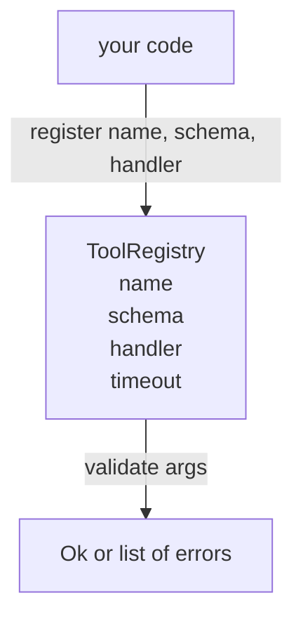

# Rejestr narzędzi z walidacją schematu

> Narzędzie, którego agent nie może zweryfikować, jest narzędziem, którego agent nie może wywołać. Przed zbudowaniem narzędzi zbuduj rejestr i narzędzie do sprawdzania schematu.

**Typ:** Kompilacja
**Języki:** Python
**Wymagania wstępne:** Faza 13, lekcje 01-07, Faza 14, lekcja 01
**Czas:** ~90 minut

## Cele nauczania
- Przechowuj wpisany rejestr zawierający nazwę narzędzia → schemat → procedurę obsługi, o którą dyspozytor może zapytać raz, a następnie zaufać.
— Zaimplementuj podzbiór schematu JSON 2020-12 obejmujący słowa kluczowe, których faktycznie używa dziewięćdziesiąt procent wywołań narzędzi.
- Zwracaj dokładne ścieżki błędów w kształcie wskaźnika json, aby model mógł dokonać samokorekty podczas jednej podróży w obie strony.
- Odrzuć ponowną rejestrację bez wyraźnego zastąpienia, ponieważ ciche nadpisywanie powoduje dryfowanie katalogów narzędzi produkcyjnych.
- Zachowaj czystość walidatora (bez operacji we/wy, bez czasu, bez wartości globalnych), aby można było go ponownie uruchomić w dzienniku powtórek.

## Dlaczego rejestr jest ważniejszy niż narzędzie

Agent kodujący w 2026 roku ma więcej zarejestrowanych narzędzi, niż model może zmieścić się w jednym oknie kontekstowym. Nietrywialna uprząż zarejestruje dwieście narzędzi i powierzchnię od dziesięciu do czterdziestu w dowolnym zakręcie. Rejestr jest źródłem prawdy o tym, „jakie istnieją narzędzia”, „jaki kształt przyjmują ich argumenty” i „jakiego opiekuna wzywam”. Gdy te trzy odpowiedzi zostaną przypięte, reszta uprzęży może przestać zgadywać.

Błędem, którego unikamy, są podmioty zajmujące się wysyłką bez schematów lub schematy wysyłki bez walidacji. Obydwa są powszechne. Obydwa zmieniają następną warstwę (dyspozytor z lekcji dwudziestej trzeciej) w grę w zgadywanie, w której jedynym trybem niepowodzenia jest ślad stosu z procedury obsługi.

## Jak wygląda zapis narzędzia

```text
ToolRecord
  name        : str          (unique, lowercase alphanumeric and underscore segments separated by dots, e.g., snake_case.segment.case)
  description : str          (one line, shown to the model)
  schema      : dict         (JSON Schema 2020-12 subset)
  handler     : Callable     (async or sync, returns Any)
  idempotent  : bool         (dispatcher uses this for retry decisions)
  timeout_ms  : int          (override per-tool dispatcher default)
```

Schemat jest jedynym polem, którego dotyka walidator. Program obsługi jest dla niego nieprzezroczysty. Rozdzielamy je celowo. Schemat to dane. Procedura obsługi to kod. Mieszanie ich kusi, aby umieścić logikę sprawdzania poprawności w procedurze obsługi, co jest błędem, który powstrzymujemy.

## Podzbiór schematu JSON 2020-12

Pełna specyfikacja na lata 2020–2012 to dokument. Potrzebujemy ośmiu słów kluczowych.

```text
type           string / number / integer / boolean / object / array / null
properties     map of property name -> schema
required       list of property names
enum           list of allowed primitive values
minLength      integer, applies to strings
maxLength      integer, applies to strings
pattern        ECMA-262-compatible regex, applies to strings
items          schema applied to every array element
```

To wystarczy, aby pokryć faktyczne potrzeby interfejsu API narzędzia. Słowa kluczowe, których nie dodajemy (oneOf, anyOf, allOf, $ref, warunkowe) są prawidłowe w schematach produkcyjnych, ale zmieniają walidator w narzędzie do przechodzenia po drzewach z cyklami. Budujemy rejestr, a nie silnik schematu JSON.

## Ścieżki błędów wskaźnika Json

Jeśli walidacja nie powiedzie się, walidator zwraca listę błędów. Każdy błąd przenosi ścieżkę wskaźnika json na dane wejściowe. Wskaźnik to poprzedzona ukośnikiem sekwencja nazw właściwości i indeksów tablicy.

```text
{"a": {"b": [1, 2, "x"]}}
                    ^
                    /a/b/2
```

Model lepiej odczytuje ścieżki błędów niż zdania. Jeśli schemat wymaga `args.user.email`, a model przekazał liczbę całkowitą, błąd powinien wynosić `/user/email` z `expected_type: string`. Model naprawia to w następnym wywołaniu bez rundy języka naturalnego.

## Rejestracja i zastąpienie

`register(name, schema, handler, **opts)` domyślnie odrzuca ponowną rejestrację. Osoba wywołująca musi przekazać `override=True`, aby zastąpić. To jest higiena pracy. Dwie części bazy kodu po cichu rejestrujące tę samą nazwę narzędzia to błąd, którego znalezienie w środowisku produkcyjnym zajmuje tydzień.

Rejestr udostępnia trzy metody odczytu. `get(name)` zwraca rekord lub podbija. `validate(name, args)` zwraca `Ok` lub listę błędów. `names()` zwraca nazwy narzędzi w kolejności rejestracji.

## Czym jest, a czym nie jest walidator

Jest to pojedyncze przejście przez drzewo schematów, rekursywne. To jest czyste. Nie wywołuje obsługi. Nie wymusza typów (ciąg `"42"` nie przekazuje schematu liczbowego). Nie obcina się po cichu.

To nie jest granica bezpieczeństwa. Złośliwy program obsługi może nadal zachowywać się niewłaściwie po przejściu walidacji. Dyspozytor z lekcji dwudziestej trzeciej dodaje warstwy limitu czasu i piaskownicy. Rejestr dodaje kształtu.

## Kształt



## Jak odczytać kod

`code/main.py` definiuje `ToolRegistry`, `ToolRecord`, `ValidationError` i osiem funkcji walidatora. Walidator wywołuje `schema["type"]` (lub traktuje schemat z `enum` jako sprawdzenie wyliczenia bez typu). Każdy walidator typu zwraca pustą listę lub listę `ValidationError`. Walker najwyższego poziomu łączy błędy i dołącza segmenty ścieżki podczas opadania.

`code/tests/test_registry.py` obejmuje rejestrację, zastąpienie, powodzenie walidacji, niepowodzenie walidacji ze ścieżkami i każde słowo kluczowe w podzbiorze.

## Idziemy dalej

Dwa rozszerzenia, których będziesz potrzebować po zakończeniu tej lekcji, to `$ref` rozdzielczość względem lokalnego bloku definicji i `additionalProperties: false` dla ścisłego kształtu. Obydwa są małe. Obydwa są często dodawane w miarę powiększania się katalogu narzędzi powyżej pięćdziesięciu narzędzi. Zostawiliśmy je poza lekcją, aby zachować plik w ramach jednego odczytu.

Następna lekcja (dwadzieścia dwie) buduje transport stdio JSON-RPC, który udostępnia ten rejestr klientowi modelowemu. Lekcja po (dwadzieścia trzy) kończy się za dyspozytorem z przekroczeniami limitu czasu i ponownymi próbami.