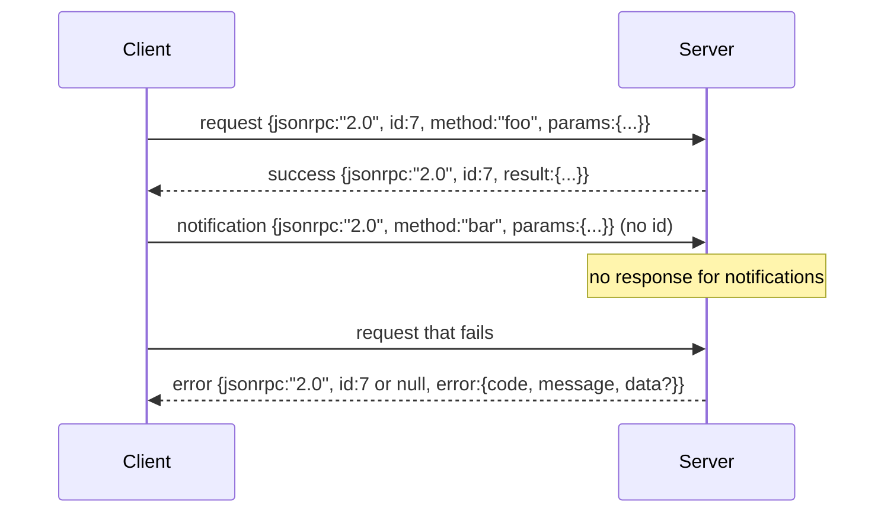

# JSON-RPC 2.0 przez Stdio rozdzielane znakami nowej linii

> Transport między klientem modelowym a serwerem narzędzi odbywa się w formacie JSON-RPC przez stdio. Ręczne zwinięcie go raz nauczy Cię, za co płaci każda warstwa kadrowania.

**Typ:** Kompilacja
**Języki:** Python
**Wymagania wstępne:** Faza 13, lekcje 01-07, Faza 14, lekcja 01
**Czas:** ~90 minut

## Cele nauczania
- Mów JSON-RPC 2.0 w ramce jako JSON rozdzielany znakami nowej linii na stdin i stdout.
- Zamapuj pięć standardowych kodów błędów (-32700, -32600, -32601, -32602, -32603) i wykaż je odpowiednią semantyką.
- Rozróżniaj żądania, odpowiedzi, powiadomienia i partie bez wymyślania nowych kluczy kopert.
- Obsługuj jeden błąd analizy na linię bez zatruwania reszty strumienia.
- Zbuduj samokończące się demo za pomocą io.BytesIO, aby lekcja przebiegała bez tworzenia procesu potomnego.

## Dlaczego JSON-RPC pozostaje lingua franca

Agent kodujący w 2026 r. rozmawia z może dwunastoma serwerami narzędzi podczas jednej sesji. Każdy serwer jest oddzielnym procesem lub zdalnym punktem końcowym. Format przewodu jest taki sam od 2013 r. JSON-RPC 2.0 to dwustronicowa specyfikacja. Przetrwa, ponieważ alternatywy (gRPC, HTTP na wywołanie, niestandardowy plik binarny) narzucają kompromis, którego JSON-RPC nie robi: wybierają albo przesyłanie strumieniowe, wsadowe, albo łączenie transportu. JSON-RPC jest symetryczny między standardem, gniazdami, gniazdami internetowymi i protokołem HTTP, a klient może sterować serwerem, jakiego nigdy nie widział, jeśli oba będą przestrzegać specyfikacji.

W tej lekcji omówiono wariant stdio. JSON rozdzielany znakami nowej linii. Każde żądanie to jedna linia. Każda odpowiedź to jedna linia. Granica transportu to `\n`.

## Kształt drutu

Istnieją cztery kształty kopert. Dwa są wypowiadane przez klienta. Serwer wypowiada dwa.



Powiadomienie nie ma `id`. Serwer nie może na to odpowiedzieć. Jeśli serwer zwróci odpowiedź na powiadomienie, klient nie ma możliwości dołączenia go do witryny wywoławczej. Ta pojedyncza zasada sprawia, że ​​matematyka kadrowania jest prosta.

Partia to tablica JSON żądań lub powiadomień. Serwer odpowiada tablicą odpowiedzi w dowolnej kolejności, po jednej na wpis niezwiązany z powiadomieniem. Jeśli każdy wpis w partii jest powiadomieniem, serwer nie wysyła niczego z powrotem.

## Pięć kodów błędów

```text
-32700  Parse error      JSON could not be parsed
-32600  Invalid Request  Envelope shape is wrong
-32601  Method not found
-32602  Invalid params
-32603  Internal error
```

Kody od -32000 do -32099 są zarezerwowane dla błędów zdefiniowanych przez serwer. Cała reszta jest zdefiniowana przez aplikację. Lekcja trzyma się piątki. Jeśli procedura obsługi zgłosi się, transport opakuje go jako -32603 z nazwą klasy wyjątku w `data.exception`.

Błąd analizy ma specjalną regułę. `id` w odpowiedzi to `null`, ponieważ żądanie nigdy nie zostało przeanalizowane wystarczająco, aby wyodrębnić identyfikator.

## Ramkowanie nowej linii i wersja demonstracyjna BytesIO

Transport czyta jedną linię na raz. Linia składa się z bajtów do `\n` włącznie. Jeśli nie można przeanalizować linii, transport zapisuje odpowiedź -32700 z `id: null` i kontynuuje. Strumień nie jest zatruty. Następna linia jest analizowana na nowo.

Na potrzeby lekcji zawijamy parę `io.BytesIO` jako stdin i stdout. Serwer odczytuje żądania do EOF, zapisuje odpowiedzi na każde z nich i zwraca. Klient ponownie odczytuje odpowiedzi. Brak spawnowania procesów. Brak limitów czasu. Zachowanie transportu jest identyczne jak w prawdziwym potoku podprocesu, ponieważ interfejs `io` Pythona przedstawia ten sam kontrakt `.readline()` i `.write()`.

## Wysyłka metody

Transport nie wie, jakie metody istnieją. Przekazuje wywoływany element `handler(method, params)` dostarczany przez wiązkę przewodów. Procedura obsługi zwraca wynik lub podnosi. Trzy klasy wyjątków wyświetlają specyficzne kody.

```text
MethodNotFound -> -32601
InvalidParams  -> -32602
Anything else  -> -32603 with exception name in data
```

Transport nigdy nie widzi rejestru narzędzi. Rejestr znajduje się za modułem obsługi. To jest takie nakładanie warstw, jakiego chcemy. Transport mówi w formacie JSON-RPC. Rejestr mówi o kształtach narzędzi. Dyspozytor (lekcja dwudziesta trzecia) zszywa je razem.

## Zachowanie strumienia w przypadku błędów

```text
client writes              server reads             server writes
---------------            -----------              -------------
{...valid request...}      parses ok                {...response, id matches...}
{...broken json...         parse fails              {id:null, error: -32700}
{...valid request...}      parses ok                {...response, id matches...}
{...missing method...}     invalid envelope         {id:X, error: -32600}
```

Uszkodzona linia JSON nie zatrzymuje pętli. Brakujące pole `method` nie powoduje zatrzymania pętli. Wyjątek procedury obsługi nie zatrzymuje pętli. Transport kontynuuje odczyt aż do EOF.

## Powiadomienia i przepływy asymetryczne

Powiadomienie można odpalić i zapomnieć. Uprząż wykorzystuje powiadomienia o zdarzeniach postępu, sygnałach anulowania i wierszach dziennika. Powiadomienia umożliwiają długotrwałemu narzędziu przesyłanie strumieniowe aktualizacji statusu bez konieczności powtarzania każdego z nich.

Lekcja implementuje jednego pomocnika powiadomień wychodzących, `write_notification`. Serwer używa go do emitowania postępu podczas realizacji żądania. Demo pokazuje wzorzec: przychodzi żądanie, program obsługi emituje dwa powiadomienia o postępie, a następnie zapisuje ostateczną odpowiedź.

## Jak odczytać kod

`code/main.py` definiuje `StdioTransport`, pomocnika analizy (`parse_request`), trzech pomocników zapisu (`write_response`, `write_error`, `write_notification`) i pętlę wysyłania `serve`. Stałe kodu błędu są obecne w zasięgu modułu.

`code/tests/test_transport.py` obejmuje pięć kodów błędów, powiadomienia (brak zapisanej odpowiedzi), partie (wejście do tablicy, wyjście z tablicy, pominięcie powiadomień), uszkodzony kod JSON (błąd analizy, a następnie kontynuacja) oraz przepływ asymetryczny, w którym moduł obsługi zapisuje powiadomienie w trakcie wywołania.

## Idziemy dalej

Ten transport wystarczy na następujące lekcje. Transporty produkcyjne dodają trzy rzeczy. Pole identyfikatora korelacji, które przetrwa przesyłanie dalej (Twój `id` już jest tym, ale w siatce potrzebujesz również zewnętrznego identyfikatora śledzenia). Kanał anulowania (powiadomienie typu `$/cancelRequest` z identyfikatorem połączenia podczas lotu). Oraz uzgadnianie negocjacji typu zawartości, dzięki czemu to samo gniazdo może obsługiwać JSON-RPC i Streamable HTTP. Żaden z nich nie zmienia przewodu. Dodają metadane.