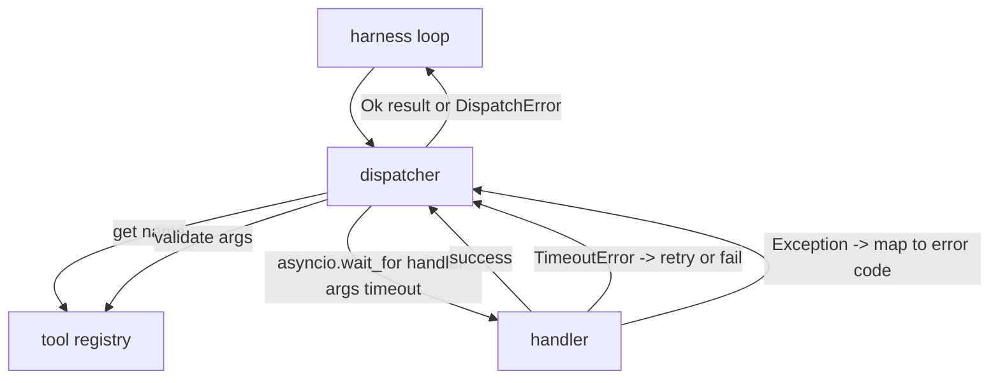
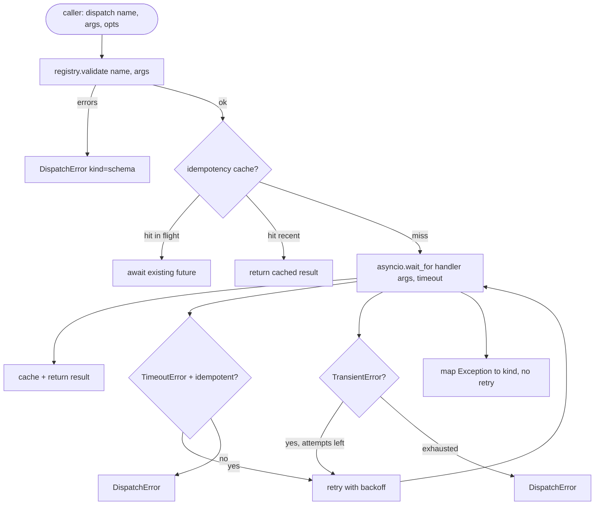

# Dyspozytor wywołań funkcji

> Dyspozytor to miejsce, w którym uprząż płaci za każdą obietnicę złożoną przez schemat. Przekroczenia limitu czasu, ponowne podjęcie próby, deduplikacja, mapowanie błędów. Wszystko na jednym szwie.

**Typ:** Kompilacja
**Języki:** Python
**Wymagania wstępne:** Faza 13, lekcje 01-07, Faza 14, lekcja 01
**Czas:** ~90 minut

## Cele nauczania
- Zawiń procedurę obsługi narzędzia w limit czasu na wywołanie, który zwraca błąd wpisany zamiast zawieszać pętlę.
- Zastosuj wykładniczą ponowną próbę z jitterem i maksymalną liczbą prób.
- Ponowne próby deduplikacji na kluczu idempotencji, aby ponowna próba, która przebiega z powolnym oryginałem, nie była wykonywana dwukrotnie.
- Mapuj wyjątki procedury obsługi i błędy transportu na pojedynczą kopertę błędów, którą pętla wiązki przewodów już rozumie.
- Powiązana wysyłka równoległa z limitem współbieżności, więc rozłożenie czterdziestu wywołań narzędzi nie wyczerpuje pętli zdarzeń.

## Gdzie siedzi dyspozytor

Pomiędzy pętlą uprzęży (lekcja dwudziesta) a rejestrem narzędzi (lekcja dwudziesta pierwsza). Transport (lekcja dwudziesta druga) zasila pętlę. Pętla przekazuje wywołanie narzędzia dyspozytorowi. Dyspozytor wywołuje rejestr, uruchamia procedurę obsługi i zwraca wynik lub kopertę błędu w kształcie JSON-RPC.



Dyspozytor jest jedyną warstwą, która wie o licznikach czasu, ponownych próbach i idempotencji. Pętla nie. Rejestr tego nie robi. Opiekun tego nie robi. O tę izolację chodzi.

## Limity czasu

Każde narzędzie ma domyślny limit czasu. Rekord rejestru zawiera `timeout_ms`. Dyspozytor zastępuje to w przypadku obejścia na każde wezwanie, gdy uprząż mija jedno. Używamy `asyncio.wait_for`. Po przekroczeniu limitu czasu zadanie obsługi zostaje anulowane, a dyspozytor zwraca wartość `DispatchError(kind="timeout")`.

Przekroczenie limitu czasu nie jest domyślnie błędem, który można ponowić w przypadku narzędzi innych niż idempotentne. `db.write`, który przekroczył limit czasu, mógł zostać zatwierdzony lub nie. Ponowna próba powoduje zduplikowanie zapisu. Dyspozytor honoruje flagę `idempotent` z rekordu rejestru. Ponów próbę narzędzi idempotentnych. Narzędzia inne niż idempotentne tego nie robią.

## Ponowne próby z wykładniczym wycofywaniem

Zasady ponawiania obejmują maksymalnie trzy próby. Backoff jest wykładniczy z jitterem.

```text
attempt 1  -> delay 0
attempt 2  -> delay 0.1s * (1 + random[0..0.5])
attempt 3  -> delay 0.4s * (1 + random[0..0.5])
```

Ponawiane są tylko błędy `timeout` i `transient`. Błąd `schema`, błąd `not_found` lub błąd `internal` nie powoduje ponowienia próby. Błędy schematu są deterministyczne. Ponowna próba nie zmienia wyniku i rujnuje budżet.

Pętla ponawiania prób uwzględnia budżet z uprzęży. Jeśli w budżecie wywołującego nie pozostały żadne wywołania narzędzi, dyspozytor szybko kończy się niepowodzeniem przy pierwszej próbie i zwraca `kind="budget_exceeded"`.

## Deduplikacja klucza idempotencji

Ponowna próba, która zostaje uruchomiona, gdy oryginał jest jeszcze w locie, jest prawdziwym błędem produkcyjnym. Pierwsze połączenie zawiesza się o cztery i dziewięć sekund (tuż przed upływem limitu czasu). Ponowna próba zostanie uruchomiona po pięciu sekundach. Teraz dwa żądania ścigają się z tym samym backendem. Jeśli narzędziem jest `payments.charge`, opłata została naliczona dwukrotnie.

Dyspozytor akceptuje opcjonalny `idempotency_key`. Jeśli ten sam klucz jest w locie, gdy nadejdzie połączenie, dyspozytor czeka na przyszłość w locie i zwraca jej wynik. Pamięć podręczna przechowuje klucze przez sześćdziesiąt sekund po zakończeniu, aby uwzględnić późne ponowne próby.

Kluczem jest odpowiedzialność dzwoniącego. Uprząż wyprowadza ją od planisty: `f"{step_id}:{tool_name}:{hash(args)}"`. Dyspozytor nie wymyśla kluczy, ponieważ wyprowadzenie klucza z samych argumentów sprawia, że ​​dwa semantycznie różne wywołania wyglądają tak samo.

## Błąd koperty

Nieudana wysyłka zwraca pojedynczy kształt.

```text
DispatchError
  kind        : "timeout" | "transient" | "schema" | "not_found" | "internal" | "budget_exceeded"
  message     : str
  attempts    : int
  jsonrpc_code: int   (one of -32601, -32602, -32603)
```

Pętla wiązki przewodów odwzorowuje `kind` do następnego stanu. `schema` i `not_found` przejdź do `on_error` i uruchom ponowny plan. `timeout` i `transient` przechodzą do `on_error` i mogą, ale nie muszą, zmienić plan w zależności od prób. `budget_exceeded` wyzwala `on_budget_exceeded`.

## Limit współbieżności przy rozsyłaniu

`gather(*calls)` uruchamia wszystkie współprogramy jednocześnie. Z czterdziestoma wywołaniami narzędzi, czyli czterdziestoma otwartymi gniazdami lub czterdziestoma potokami procesów. Większość backendów nie lubi czterdziestu równoległych połączeń od jednego klienta.

Dyspozytor otacza `gather` semaforem. Domyślny limit współbieżności wynosi osiem. Każde wywołanie uzyskuje semafor przed wysłaniem i zwalnia po zakończeniu. Obiekt wywołujący widzi dane wyjściowe w kształcie `gather`, ale rzeczywisty harmonogram jest ograniczony.

## Przepływ dla jednego połączenia



## Jak odczytać kod

`code/main.py` definiuje `Dispatcher`, `DispatchError` i `TransientError`. Dyspozytor prowadzi rejestr budowy. Jedynym punktem wejścia jest asynchroniczny `dispatch(name, args, ...)`. Limity czasu na próbę są stosowane bezpośrednio w `_run_with_retries` za pomocą `asyncio.wait_for`. `gather_bounded(calls)` uruchamia wiele wysyłek z limitem współbieżności.

`code/tests/test_dispatcher.py` obejmuje uruchamianie po przekroczeniu limitu czasu, ponawianie prób w przypadku stanu przejściowego, brak ponawiania próby w przypadku błędu schematu, deduplikację idempotencji (dwa równoczesne wywołania z tym samym kluczem zwijają się do jednego wywołania procedury obsługi) i ograniczanie współbieżności (semafor w akcji).

Testy korzystają z procedur obsługi opartych na `asyncio.sleep(0)` i deterministycznych `Counter`, więc kończą się w milisekundach i nie zależą od taktowania zegara ściennego.

## Idziemy dalej

Dodają dwa rozszerzenia dyspozytorzy produkcji. Po pierwsze, strukturalne rejestrowanie przy każdym przejściu (które strumień zdarzeń pętli już zapewnia, ale program rozsyłający powinien także emitować zdarzenia `dispatch.attempt` i `dispatch.retry`). Po drugie, wyłączniki automatyczne: po N awariach w oknie narzędzie przechodzi okres ostygnięcia, podczas którego komunikaty natychmiast powracają z `kind="circuit_open"` zamiast próbować wykonać procedurę obsługi. Obydwa mieszczą się na górze tego dyspozytora bez zmiany umowy.

Lekcja dwudziesta czwarta łączy dyspozytora z agentem planującym i realizującym, dzięki czemu widzisz wszystkie cztery elementy w ruchu.