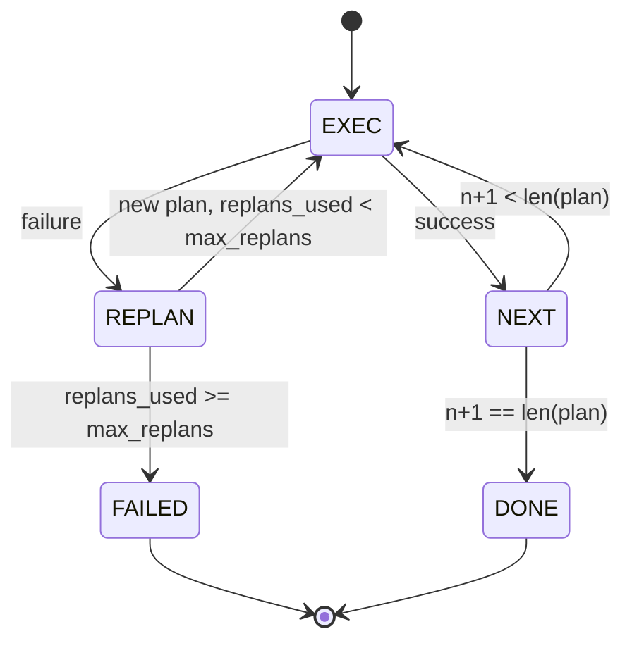

# Przepływ kontroli planu i wykonania

> Plan, który nie przetrwa porażki, to scenariusz. Skrypt, który może przeplanować, jest agentem. Najpierw zbuduj narzędzie do ponownego planowania.

**Typ:** Kompilacja
**Języki:** Python
**Wymagania wstępne:** Faza 13, lekcje 01-07, Faza 14, lekcja 01
**Czas:** ~90 minut

## Cele nauczania
- Przedstaw plan jako uporządkowaną listę wpisanych kroków, aby wykonawca mógł ocenić postęp i wynik.
- Wykonuj kroki sekwencyjnie, z kontrolowanym przekazaniem awarii planiście.
- Zaplanuj ponownie od bieżącego kursora, uwzględniając wcześniejszy błąd w kontekście, aby poinformować o następnym planie.
- Emituj różnicę planu przy każdej wersji, aby dalszy moduł śledzący lub interfejs użytkownika mógł pokazać, dlaczego plan się zmienił.
- Egzekwuj dwa budżety: twardy pułap schodkowy i twardy pułap ponownego planu.

## Planuj i realizuj, a nie łańcuch myślowy

Agent łańcucha myślowego emituje tokeny i pozwala pętli odgadnąć, gdzie kończy się wywołanie narzędzia. Agent planu i wykonania najpierw emituje ustrukturyzowany plan, a następnie wykonuje każdy krok w sposób deterministyczny. Plan to dane, które uprząż może poddać introspekcji. Wykonanie to uprząż przesyłająca te dane przez dyspozytora.

Dwie sztuki. Planista, który tworzy plan. Wykonawca, który uruchamia plan. Interesującą pracą jest to, co dzieje się, gdy executor napotka błąd. Trzy opcje:

```text
1. Abort         (return failed, surface the error)
2. Skip          (mark step failed, continue with the rest)
3. Replan        (hand the error to the planner, get a new plan from the cursor)
```

Replan to ten, który zamienia skrypt w agenta.

## Kształt kroku

```text
Step
  id              : int           (monotonic within a plan revision)
  tool_name       : str
  args            : dict
  expected_outcome: str           (planner's stated success condition)
  result          : Any | None
  error           : str | None
```

`expected_outcome` to krótkie zdanie, które planista emituje obok kroku. Nie jest to egzekwowane przez wykonawcę. Służy dwóm celom: osoba zajmująca się ponownym planowaniem czyta ją podczas rewizji planu; strumień zdarzeń emituje je, aby moduł śledzący mógł pokazać, że „ten krok miał wykonać X”.

## Kształt planisty

```python
def planner(goal: str, history: list[Step], last_error: str | None) -> list[Step]:
    ...
```

Czysta funkcja. `goal` to cel użytkownika. `history` to kroki już wykonane (z wypełnionymi wynikami i błędami). `last_error` to Brak przy pierwszym połączeniu i najnowszy komunikat o niepowodzeniu przy każdym kolejnym połączeniu. Planista zwraca następny plan zaczynając od kursora.

Planista nie wie o wykonawcy. Nie wie o ponownych próbach. Nie ma informacji o przekroczeniach limitów czasu. Tworzy plan. To wszystko.

## Wykonawca

Executor jest małą maszyną stanową. Każdy krok przebiega przez dyspozytora. Wynik jest jedną z trzech rzeczy: sukces, porażka możliwa do ponownego zaplanowania, porażka śmiertelna. Awarie, które można ponownie zaplanować, są przekazywane planiście. Fatalne awarie (przekroczenie budżetu, przekroczenie limitu planu) zwracają wynik sesji `FAILED`.



## Różnice w planie po rewizji

Gdy planista zwraca nowy plan po awarii, wykonawca emituje zdarzenie `plan.diff` z trzema polami.

```text
removed: list of step ids that were in the old plan and are not in the new
added  : list of step ids in the new plan that were not in the old
revised: list of step ids whose tool_name or args changed
```

Moduł śledzący lub interfejs użytkownika może wyświetlić to jako przekreślenie usuniętych kroków i wyróżnienie dodanych. Nie chodzi o format różnicowy. Chodzi o to, że rewizja jest widocznym wydarzeniem, a nie cichym przepisaniem.

## Dwa budżety, oba trudne

`max_steps` ogranicza całkowitą liczbę wykonań kroków w całej sesji, łącznie z ponownymi planami. Wartość domyślna to dwanaście. Liniowy plan składający się z pięciu kroków, w którym dwukrotnie powtarza się plan i za każdym razem dodaje trzy kroki, osiąga szesnaście wykonań i przekracza budżet. Wykonawca odrzuci ponowny plan i zwróci BŁĄD.

`max_replans` ogranicza liczbę wywołań planisty po pierwszym planie. Wartość domyślna to pięć. To jest ważniejsza granica. Planista, który pięć razy z rzędu zwraca ten sam zepsuty plan, w przeciwnym razie zapętlałby się, dopóki budżet kroku go nie wykryje. Ograniczanie ponownych planów sprawia, że ​​awaria jest szybsza, a przyczyna staje się jaśniejsza.

## Planista deterministyczny w tej lekcji

W tej lekcji nie nazywamy modelu. Lekcja przedstawia deterministyczny planista, który wybiera plan w oparciu o `last_error`.

```text
last_error is None    -> emit a four-step plan
last_error matches X  -> emit a three-step plan that routes around X
last_error matches Y  -> emit a two-step plan that gives up gracefully
otherwise             -> return [] (signals nothing to replan)
```

To wystarczy, aby przetestować zachowanie wykonawcy na każdej ścieżce przejścia: sukces, ponowne zaplanowanie raz, ponowne zaplanowanie dwukrotnie, ponowne zaplanowanie wyczerpanie i wyczerpanie budżetu krokowego.

## Kształt wyniku

```text
SessionResult
  status      : "completed" | "failed"
  reason      : str     ("goal_met" | "step_budget" | "replan_budget" | "no_plan")
  history     : list[Step]
  revisions   : list[PlanDiff]
  events      : list[Event]
```

Pętla uprzęży z lekcji dwudziestej może to odczytać bezpośrednio. Każdy krok wykonuje dyspozytor z lekcji dwudziestej trzeciej. Rejestr z lekcji dwudziestej pierwszej sprawdza argumenty każdego kroku. Transport z lekcji dwudziestej drugiej pokazałby cały przepływ przez JSON-RPC klientowi modelowemu.

## Jak odczytać kod

`code/main.py` definiuje `PlanExecuteAgent`, `Step`, `PlanDiff`, `SessionResult` i planista deterministyczny. Executor to pojedyncza metoda `run(goal)`, która zwraca `SessionResult`. Różnicę planu oblicza się, porównując identyfikatory kroków i krotki `(tool_name, args)`.

`code/tests/test_agent.py` obejmuje sukces liniowy, niepowodzenie w połowie planu wymagające jednorazowego ponownego planowania, wyczerpanie planu, które zwraca `failed:replan_budget`, wyczerpanie budżetu krokowego i format zdarzenia planu-różnicy.

## Idziemy dalej

Dwa rozszerzenia, które będziesz chciał po podłączeniu do prawdziwego modelu. Po pierwsze, buforowanie planu częściowego: jeśli plan powiedzie się w pierwszych trzech z sześciu kroków, a następnie zakończy się niepowodzeniem, nie chcesz ponownie uruchamiać pierwszych trzech. Wykonawca już przechowuje historię; Planista musi to po prostu przeczytać. Po drugie, gałęzie równoległe: bieżący executor jest ściśle sekwencyjny. Planista emitujący niezależną gałąź (`gather_step` zamiast `next_step`) może jednocześnie uruchomić dwa wywołania narzędzi za pośrednictwem modułu dyspozytorskiego.

Obydwa dodają prawdziwej złożoności. Obydwa są łatwiejsze do dodania, gdy executor liniowy jest przypięty. To właśnie ma na celu ta lekcja.