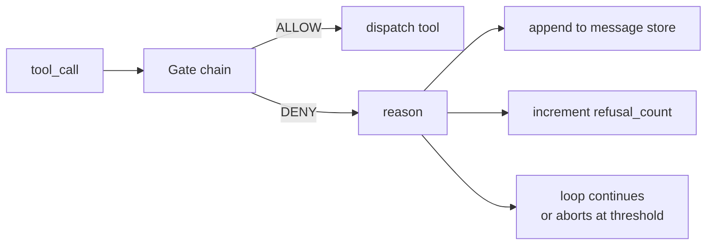
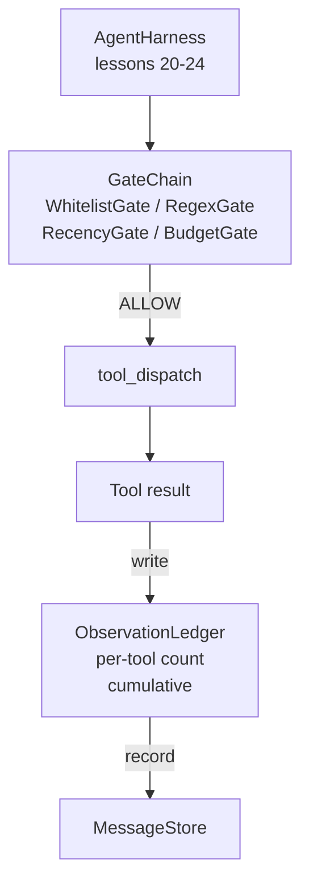

# Capstone Lekcja 25: Bramki weryfikacyjne i budżet obserwacji

> Uprząż agenta bez warstwy weryfikacyjnej to marzenie w trenczu. Ta lekcja buduje deterministyczny łańcuch bramek, który decyduje, czy wywołanie narzędzia może zostać uruchomione, jaką część wyników może zobaczyć agent i kiedy pętla musi się zatrzymać, ponieważ agent przeczytał za dużo. Łańcuch składa się z małych, nazwanych bramek oraz księgi obserwacyjnej, która śledzi każdy żeton pokazany modelowi.

**Typ:** Kompilacja
**Języki:** Python (stdlib)
**Wymagania wstępne:** Faza 19 · 20-24 (ścieżka A1: pętla agenta, rejestr narzędzi, magazyn komunikatów, konstruktor podpowiedzi, router modelu), faza 14 · 33 (instrukcje jako ograniczenia), faza 14 · 36 (kontrakty dotyczące zakresu), faza 14 · 38 (bramki weryfikacyjne)
**Czas:** ~90 minut

## Cele nauczania

- Zbuduj protokół `VerificationGate` z deterministyczną metodą `evaluate(call)`.
- Twórz bramki budżetu, aktualności, białej listy i wyrażeń regularnych w łańcuch z semantyką zwarć.
- Śledź każdą obserwację za pomocą `ObservationLedger` z kluczem według narzędzia i obrotu.
- Odmówić wezwania narzędzia, gdy łączny budżet na obserwację zostałby przekroczony.
- Wyświetl ustrukturyzowany `GateDecision` rekord, który może zostać pobrany przez obserwowalność w dalszej części.

## Problem

Kiedy uprząż agenta pozwala modelowi na swobodne wywoływanie narzędzi, w ciągu pierwszej godziny rzeczywistego użycia pojawiają się trzy klasy błędów.

Pierwsza to nieograniczona obserwacja. Grep w repozytorium o długości 200 tys. linii zrzuca pół miliona tokenów wyjściowych do następnej tury. Model widzi jedno dopasowanie na kilobajt, a reszta kontekstu jest marnowana. Symboliczny rachunek jest duży, a agent wykonuje teraz gorzej, a nie lepiej swoje zadanie.

Drugim jest nieświeża świeżość. Długotrwałe zadanie gromadzi pięćdziesiąt wywołań narzędzi. Model ponownie odczytuje pierwszy plik read_file z trzeciej tury, tak jakby był w stanie aktywnym. Zmiany dokonane w turze czterdziestym siódmym nigdy nie pojawiają się, ponieważ konstruktor podpowiedzi najpierw serializował najwcześniejsze obserwacje.

Trzeci to pełzanie przywilejów. Zadanie badawcze rozpoczyna się od wywołania `web_search`, a następnie w jakiś sposób kończy się uruchomieniem `shell`, ponieważ model wymyślił nazwę narzędzia, a wiązka przewodów została domyślnie ustawiona na permisywną. Zanim ktokolwiek przeczyta ślad, w katalogu /tmp znajduje się niepotrzebny plik, a plik curl działa na prywatnym interfejsie API.

Bramka weryfikacyjna to element wiązki przewodów, który mówi „nie”. To nie jest model. To nie jest sędzia. Jest to funkcja deterministyczna `(call, history, ledger)`, która zwraca ZEZWÓL lub ODMÓW z podaniem przyczyny. Powód został zarejestrowany. Model zostaje opowiedziany. Pętla jest kontynuowana lub przerywana.

## Koncepcja



Bramą jest wszystko, co ma metodę `evaluate(call, ctx) -> GateDecision`. Łańcuch jest uporządkowaną listą. Zwarcie oceny przy pierwszej odmowie. Porządek ma znaczenie: tanie bramki strukturalne działają przed drogimi bramkami liczącymi żetony.

Ta lekcja przedstawia cztery bramy:

- `WhitelistGate`. Dozwolone nazwy narzędzi są jawnym zestawem. Wszystko, co jest na zewnątrz, jest odrzucane. Jest to najtańsza brama i działa jako pierwsza.
- `RegexGate`. Argumenty narzędzia są dopasowywane do wyrażenia regularnego. Przydatne do odrzucania wywołań powłoki zawierających `rm -rf` lub wywołań HTTP do wewnętrznych adresów IP. Czysty ładunek połączenia.
- `RecencyGate`. Model widzi tylko obserwacje z N ostatnich obrotów. Starsze obserwacje są maskowane. Brama odmawia wywołania narzędzia, którego wynikiem byłoby wydłużenie okna obserwacyjnego, które już się zestarzało.
- `BudgetGate`. Skumulowane tokeny, które model odczytał w trakcie sesji, mają limit. Kiedy księga informuje, że osiągnięto pułap, każde kolejne wywołanie narzędzia jest odrzucane.

Księga obserwacyjna to księgowość. Każde pomyślne wywołanie narzędzia zapisuje jeden wiersz: nazwę narzędzia, obrót, wyemitowane żetony, kumulację. Księga odpowiada na dwa pytania: ile model widział ogółem i ile widział narzędzie X. Bramka budżetowa odczytuje pierwsze. Bramka budżetowa na narzędzie, którą napiszesz jako ćwiczenie, czyta drugą.

## Architektura



Uprząż pyta łańcuch. Łańcuch albo kiwa głową, albo odmawia. Jeśli skinie głową, narzędzie zostanie uruchomione, księga zostanie zaznaczona, a wynik zostanie dodany do magazynu komunikatów. Jeśli odmówi, model otrzymuje informację o odmowie w formie komunikatu systemowego i pętla decyduje, czy ponowić próbę, czy przerwać.

## Co zbudujesz

Implementacja składa się z pojedynczego `main.py` plus testy.

1. Klasy danych `Observation` i `ToolCall` definiują kształty przewodów.
2. `ObservationLedger` rejestruje `(turn, tool, tokens)` wiersze i odpowiedzi `cumulative()` i `per_tool(name)`.
3. `GateDecision` przenosi `(allow, reason, gate_name)`.
4. `VerificationGate` to protokół. Każda bramka implementuje `evaluate(call, ctx)`.
5. `GateChain` zawija uporządkowaną listę. Wywołuje każdą bramkę, zwraca pierwszą odmowę lub zwraca zezwolenie, jeśli każda bramka przejdzie.
6. Demo uruchamia małą pętlę agenta syntetycznego. Trzy tury. Trzecia tura uruchamia bramkę budżetową i pętla zgłasza czystą odmowę z niezerową liczbą odmów.

Licznik tokenów jest celowo głupią heurystyką `len(text) // 4`. Celem tej lekcji jest instalacja hydrauliczna bramy, a nie tokenizator. Wpuść prawdziwy tokenizer do produkcji.

## Dlaczego kolejność łańcucha ma znaczenie

Odmowa jest tańsza niż zezwolenie. `WhitelistGate` działa przy wyszukiwaniu skrótu O(1). `RegexGate` działa w O(wzór * argv). `RecencyGate` odczytuje mały fragment magazynu wiadomości. `BudgetGate` odczytuje całą księgę. Zamawiasz je według rosnącego kosztu, więc odmowa połączenia powoduje zwarcie przed wykonaniem kosztownej pracy.

Można je również zamówić według promienia wybuchu. Biała lista to najmocniejszy argument: tego narzędzia nie ma w umowie. Następna jest bramka wyrażeń regularnych: tego argumentu nie ma w umowie. Nowość przychodzi później: uprząż nadal się tym przejmuje, ale wezwanie jest strukturalnie legalne. Budżet jest ostatni, ponieważ z definicji uruchamia się dopiero wtedy, gdy wszystko inne zostanie zrealizowane.

## Jak to się komponuje z resztą ścieżki A

W poprzednich lekcjach poznaliśmy pętlę, rejestr narzędzi, magazyn komunikatów, kreator podpowiedzi i router modelu. W tej lekcji dodana zostanie warstwa pomiędzy modelem a narzędziami. Lekcja 26 dostarcza piaskownicę, do której dyspozytor przekazuje wywołanie narzędzia, gdy łańcuch bramy powie ZEZWALAJ. W lekcji 27 przedstawiono uprząż eval, która rejestruje liczbę odmów jako sygnał jakości. Lekcja 28 łączy decyzje dotyczące bramek z zakresami OpenTelemetry. Lekcja 29 łączy całość w działającego agenta kodującego.

## Uruchomienie

```bash
cd phases/19-capstone-projects/25-verification-gates-observation-budget
python3 code/main.py
python3 -m pytest code/tests/ -v
```

Wersja demonstracyjna drukuje krok po kroku ślad, w tym każdą decyzję dotyczącą bramki i wychodzi zera. Testy obejmują księgę, każdą bramkę z osobna, zwarcie łańcucha i pętlę syntetyczną od końca do końca.