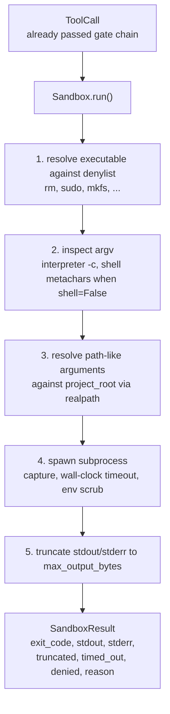
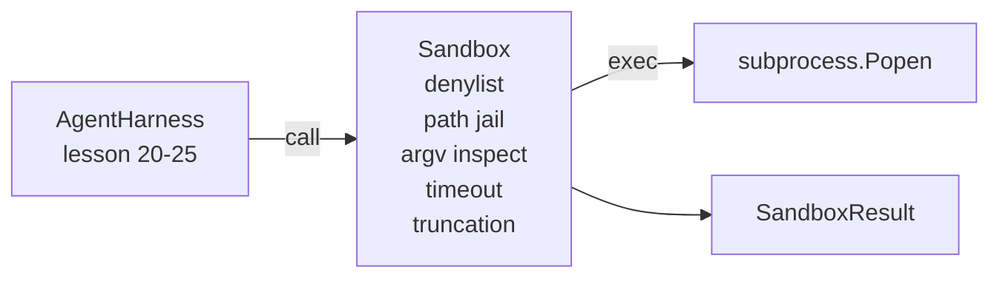

# Capstone Lekcja 26: Sandbox Runner z listą odrzuconych i więzieniem na ścieżce

> Bramka weryfikacyjna decyduje o tym, czy powinno zostać uruchomione wywołanie narzędzia. Piaskownica decyduje, co się stanie, kiedy to nastąpi. W tej lekcji przedstawiono moduł uruchamiający podprocesy, który odrzuca niebezpieczne pliki wykonywalne, odrzuca niebezpieczne kształty argv, więzi każdą ścieżkę pliku do katalogu głównego projektu, obcina zbyt duże dane wyjściowe i zabija niekontrolowane procesy po przekroczeniu limitu czasu zegara ściennego. Jest to druga z dwóch warstw znajdujących się pomiędzy modelem a systemem operacyjnym.

**Typ:** Kompilacja
**Języki:** Python (stdlib)
**Wymagania wstępne:** Faza 19 · 25 (bramki weryfikacyjne i budżet obserwacji), Faza 14 · 33 (instrukcje jako ograniczenia), Faza 14 · 38 (bramki weryfikacyjne)
**Czas:** ~90 minut

## Cele nauczania

- Zbuduj klasę `Sandbox` zawijającą `subprocess.run` z limitem czasu, przechwytywaniem i obcinaniem.
- Odrzuć polecenie według nazwy w przypadku listy odrzuconych i według struktury w przypadku inspektora argv.
- Odrzuć każdy argument ścieżki, który jest rozpoznawany poza zadeklarowanym katalogiem głównym projektu.
- Odmawiaj metaznaków powłoki, gdy tryb powłoki jest wyłączony.
- Zwraca ustrukturyzowany `SandboxResult`, który może przyjąć obserwowalność w dalszej części i uprząż eval.

## Problem

Agent kodujący, który może wydać pieniądze, może zainstalować backdoory, wydobyć klucze, zamurować laptopa programisty i w jednej turze pobrać rachunek za chmurę. Najtańszą obroną jest nie dawanie mu powłoki. Drugim najtańszym rozwiązaniem jest piaskownica, która odmawia precyzyjnej listy wzorców.

W śladach agenta powtarzają się trzy klasy błędów.

Pierwszy to niebezpieczne pliki wykonywalne. Model pod presją naprawienia problemu ze ścieżką spróbuje `sudo`, `chmod -R 777`, `rm -rf`, `mkfs`, `dd`. Żaden z nich nie należy do biegu agenta. Lista odrzuconych przechwytuje je według nazwy i aliasu.

Drugi to sztuczki argv. Model, któremu powiedziano, że żadna powłoka nie przeprowadzi ataku przez interpreter: `python3 -c "import os; os.system('rm -rf /')"`, `bash -c '...'`, `node -e '...'`, `perl -e '...'`. Sandbox musi wiedzieć, że każdy interpreter uruchomiony z flagą podobną do `-c` jest po prostu wywołaniem powłoki z dodatkowymi krokami.

Trzecia to ucieczka ze ścieżki. Model otrzymuje polecenie odczytania `./src/main.py`, a zamiast tego odczytuje `../../etc/passwd`. Piaskownica więzi każdy argument ścieżki, rozwiązując go poprzez `os.path.realpath` i potwierdzając przedrostek.

Piaskownica nie stanowi granicy bezpieczeństwa w sensie systemu operacyjnego. Zdeterminowany atakujący wykonujący kod nadal może się przełamać. Piaskownica stanowi barierę ochronną na czas programowania: wygłasza typowe tryby awarii i powstrzymuje agenta przed wyrządzeniem szkód z powodu zwykłej nieudolności.

## Koncepcja



Piaskownica ma cztery osie odmowy: nazwa, argv, ścieżka, struktura. Każda oś jest czystą funkcją wywołania, nie ma jeszcze podprocesu. Podproces pojawia się dopiero po przejściu każdej osi.

Kody wyjścia `SandboxResult` są konwencjonalne: 0 powodzenia, niezerowa porażka plus trzy kody sygnalizacyjne dla odmowy (-100), timed_out (-101) i obcięte (kod zakończenia jest prawdziwy, z ustawioną flagą). Lekcje dalszych etapów odczytują ten ustrukturyzowany wynik, zamiast analizować stderr.

## Architektura



Lista odrzuconych to zamrożony zbiór wykonywalnych nazw bazowych. Wszystkie aliasy (`/bin/rm`, `/usr/bin/rm`) mają tę samą nazwę bazową. Inspektor argv zna kształt interpretera: dowolny argv, gdzie argv[0] jest interpreterem, a każdy późniejszy arg zaczyna się od `-c` lub `-e` jest odrzucany. Metaznaki powłoki (`;`, `|`, `&`, `>`, `<`, backticks, `$()`) powodują odmowę, gdy wywołanie nie żądało jawnie powłoki.

Więzienie ścieżki to najbardziej subtelny element. Piaskownica akceptuje `project_root` podczas budowy. Każdy argument, który wygląda jak ścieżka (zawiera `/` lub pasuje do istniejącego pliku) jest normalizowany przez `os.path.realpath`, a następnie sprawdzany pod kątem rzeczywistej ścieżki katalogu głównego projektu. Jeśli ustalony cel nie znajduje się w katalogu głównym, odmowa. Próby ucieczki dowiązania symbolicznego (dowiązanie symboliczne w katalogu głównym projektu wskazujące na zewnątrz) są blokowane przez sprawdzenie ścieżki rzeczywistej, a nie ścieżki dosłownej.

## Co zbudujesz

Implementacja to `main.py` plus katalog testów.

1. `SandboxResult` klasa danych: kod_wyjścia, stdout, stderr, obcięty, limit czasu, odmowa, powód, czas trwania_ms.
2. `SandboxConfig` klasa danych: katalog_główny_projektu, max_output_bytes, timeout_sekundy, lista odrzuconych, blok_interpretera.
3. Klasa `Sandbox`: `run(argv, *, shell=False, cwd=None)` zwraca wartość `SandboxResult`.
4. Wewnętrzne pomoce w odmowie: `_check_executable_denylist`, `_check_argv_interpreter`, `_check_shell_metachars`, `_check_path_jail`.
5. Obcięcie danych wyjściowych z wyraźną flagą `truncated` i linią znacznika w przechwyconym strumieniu.
6. Demo na dole: sekwencja uzasadnionych i kontradyktoryjnych wywołań. Każdy z nich jest pokazany wraz z jego wynikiem.

Piaskownica domyślnie używa `subprocess.run` z `shell=False` i `capture_output=True`. Limit czasu zegara ściennego wykorzystuje argument `timeout`; w `TimeoutExpired` piaskownica zabija grupę procesów i syntetyzuje wynik SandboxResult.

## Dlaczego to nie jest prawdziwa piaskownica

Piaskownica lekcji nie korzysta z przestrzeni nazw, cgroups, seccomp, gVisor, Firecracker ani żadnej izolacji na poziomie jądra. Wszystko, co może zrobić podproces, może zrobić piaskownica. Ochrona ma charakter strukturalny: agentowi odmawia się najczęstszych niebezpiecznych wezwań, a głośna odmowa zamienia się w obserwowalność, a nie w ciche działanie.

W przypadku agentów produkcyjnych nakładasz warstwę na wierzch: uruchamiasz w nieuprzywilejowanym kontenerze Dockera, uruchamiasz wewnątrz microVM, usuwasz możliwości, montujesz katalog główny projektu tylko do odczytu i katalog tymczasowy do odczytu i zapisu, ustawiasz ulimit pamięci i procesora, szorujesz środowisko do znanej bezpiecznej białej listy. Lekcja 29 trochę o tym mówi. Izolacja systemu operacyjnego nie jest przedmiotem tej lekcji.

## Uruchomienie

```bash
cd phases/19-capstone-projects/26-sandbox-runner-denylist
python3 code/main.py
python3 -m pytest code/tests/ -v
```

Wersja demonstracyjna tworzy katalog tymczasowy, umieszcza w nim czysty plik, a następnie uruchamia zestaw wywołań. Wezwania prawne powiodły się. Odrzucone połączenia zwracają SandboxResult z `denied=True` i powodem. Limity czasu zwracają `timed_out=True`. Zestawy obcięcia `truncated=True`. Wersja demonstracyjna drukuje tabelę wyników JSON i kończy działanie zerem.

## Jak to się komponuje z resztą ścieżki A

Lekcja 25 stworzyła łańcuch bramowy. Lekcja 26 przedstawia executor uruchamiający bramkę ALLOW. Uprząż eval z lekcji 27 porównuje wyniki piaskownicy z oczekiwanym kodem wyjścia dla każdego zadania. Lekcja 28 emituje `gen_ai.tool.execution` zakres wokół każdego wywołania `Sandbox.run`. Kompleksowe demo z lekcji 29 łączy prawdziwego agenta kodującego przez obie warstwy.